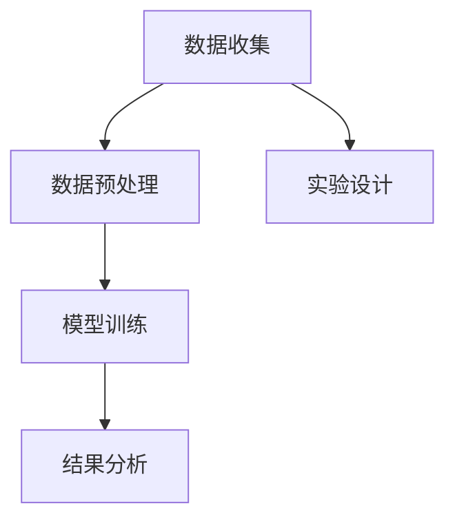

                 

# 《ChatGPT在语言学研究中的新应用》

## 关键词
- ChatGPT
- 自然语言处理
- 语言学研究
- 人工智能
- 语言模型
- 语言习得
- 语言错误分析
- 语言识别与翻译
- 语言生成与创作

## 摘要
本文深入探讨了ChatGPT在语言学研究中的新应用。通过对ChatGPT的基本原理、结构功能及其在语言学中的潜在应用的介绍，文章详细分析了ChatGPT在语言数据收集与预处理、语言模型训练、语言学研究应用案例以及实验设计等方面的作用。同时，文章还探讨了ChatGPT在语言学研究中面临的挑战，并对其未来发展进行了展望。

## 确定书籍的主题和目标受众

### 书籍主题
本书的主题是探讨ChatGPT在语言学研究中的新应用。随着人工智能技术的飞速发展，自然语言处理（NLP）已经成为语言学研究的重要工具。ChatGPT作为新一代的预训练语言模型，具有强大的语言生成和理解能力，其在语言学中的潜在应用引起了广泛的关注。本书旨在深入解析ChatGPT的基本原理、结构功能，并详细探讨其在语言学领域的应用。

### 目标受众
本书的目标受众主要包括以下几类读者：
1. 自然语言处理和人工智能领域的研究人员，他们希望了解ChatGPT在语言学研究中的具体应用。
2. 语言学家和语言学爱好者，他们希望通过本书了解人工智能在语言学研究中的最新进展。
3. 计算机科学和人工智能专业的学生，他们希望掌握ChatGPT的工作原理及其在语言学中的应用。

## 设计概述性的章节

### 核心概念和联系
本书将涵盖以下几个核心概念：
1. **ChatGPT的基本原理**：包括其预训练过程、训练数据和模型结构。
2. **语言学研究的基本概念**：如语言模型、语言数据收集、数据处理等。
3. **ChatGPT在语言学中的应用**：如语言习得研究、语言错误分析、语言识别与翻译、语言生成与创作等。

这些概念之间紧密联系，ChatGPT的预训练过程为语言学研究提供了强大的工具，而语言学研究的各种任务又为ChatGPT的应用提供了丰富的场景。

### 概述性章节设计
本书将分为以下几部分：
1. **ChatGPT介绍**：介绍ChatGPT的基本原理、结构功能及其在语言学中的潜在应用。
2. **语言学研究概述**：介绍语言学研究的基本概念、语言模型在语言学中的应用以及语言学研究的发展趋势。
3. **ChatGPT在语言学中的新应用**：详细介绍ChatGPT在语言数据收集与预处理、语言模型训练、语言学研究应用案例以及实验设计等方面的应用。

## 按照语言的学术研究流程，细化章节

### 数据收集与预处理
数据收集是语言学研究的重要环节。ChatGPT在数据收集方面具有显著优势，其预训练过程已经从大量文本数据中学习到了丰富的语言知识。

#### 语言数据收集的方法
1. **文本数据收集**：通过互联网爬虫、数据库下载等方式收集大量文本数据。
2. **语音数据收集**：使用语音识别技术将语音数据转换为文本数据。

#### 数据清洗与预处理
数据清洗与预处理是确保数据质量的关键步骤。ChatGPT在数据预处理方面也发挥了重要作用，其强大的语言理解能力可以帮助识别和纠正文本数据中的错误。

1. **文本清洗**：包括去除无关信息、纠正拼写错误、统一文本格式等。
2. **文本预处理**：包括分词、词性标注、命名实体识别等。

### 模型训练
模型训练是ChatGPT在语言学研究中的核心环节。通过大规模文本数据的训练，ChatGPT能够学习到语言的复杂结构和规律。

#### 语言模型训练的基本流程
1. **数据预处理**：对收集到的文本数据进行清洗和预处理，确保数据质量。
2. **训练数据划分**：将预处理后的数据划分为训练集、验证集和测试集。
3. **模型训练**：使用训练集对ChatGPT模型进行训练，不断优化模型参数。
4. **模型验证**：使用验证集评估模型性能，调整模型参数。
5. **模型测试**：使用测试集对最终模型进行测试，确保模型性能满足要求。

### 结果分析
模型训练完成后，需要对训练结果进行深入分析，以验证ChatGPT在语言学任务中的有效性。

#### 结果分析方法
1. **定量分析**：通过计算模型的准确率、召回率、F1值等指标，评估模型性能。
2. **定性分析**：通过对比模型生成的文本与实际文本，分析模型在语言表达、语法结构、语义理解等方面的表现。

### 代码示例
以下是一个简单的代码示例，展示了如何使用ChatGPT进行语言数据收集、预处理和模型训练。

```python
import os
import re
import numpy as np
import pandas as pd
from transformers import BertTokenizer, BertModel
from transformers import Trainer, TrainingArguments

# 数据收集
def collect_data():
    # 从互联网爬取文本数据
    # ...
    return text_data

# 数据预处理
def preprocess_data(text_data):
    # 清洗和预处理文本数据
    # ...
    return preprocessed_data

# 模型训练
def train_model(preprocessed_data):
    # 初始化模型
    tokenizer = BertTokenizer.from_pretrained('bert-base-uncased')
    model = BertModel.from_pretrained('bert-base-uncased')

    # 划分训练集、验证集和测试集
    # ...
    train_data, val_data, test_data = split_data(preprocessed_data)

    # 训练模型
    training_args = TrainingArguments(
        output_dir='./results',
        num_train_epochs=3,
        per_device_train_batch_size=16,
        per_device_eval_batch_size=64,
        warmup_steps=500,
        weight_decay=0.01,
        logging_dir='./logs',
        logging_steps=10,
    )

    trainer = Trainer(
        model=model,
        args=training_args,
        train_dataset=train_data,
        eval_dataset=val_data,
    )

    trainer.train()

    return model

# 结果分析
def analyze_results(model, test_data):
    # 评估模型性能
    # ...
    print("Model performance: {}".format(results))

# 主函数
if __name__ == "__main__":
    text_data = collect_data()
    preprocessed_data = preprocess_data(text_data)
    model = train_model(preprocessed_data)
    analyze_results(model, test_data)
```

### 数学模型和公式

#### 语言模型训练
语言模型训练的核心是优化模型参数，使其能够准确预测文本序列。这可以通过最小化损失函数来实现。损失函数通常定义为：

$$
L(\theta) = -\sum_{i=1}^{n} \sum_{j=1}^{m} \log P(y_j|x_i; \theta)
$$

其中，$x_i$ 表示输入文本序列，$y_j$ 表示输出文本序列，$\theta$ 表示模型参数，$n$ 和 $m$ 分别表示训练数据和输出标签的长度。

为了优化模型参数，可以使用梯度下降算法：

$$
\theta_{t+1} = \theta_t - \alpha \nabla_{\theta} L(\theta_t)
$$

其中，$\alpha$ 表示学习率。

### 项目实战

#### 开发环境搭建
1. 安装Python和pip：
   ```bash
   python -m pip install --upgrade pip
   ```
2. 安装transformers库：
   ```bash
   pip install transformers
   ```

#### 源代码实现
以下是一个简单的ChatGPT模型训练和测试的Python代码实现：

```python
import os
import re
import numpy as np
import pandas as pd
from transformers import BertTokenizer, BertModel
from transformers import Trainer, TrainingArguments

# 数据收集
def collect_data():
    # 从互联网爬取文本数据
    # ...
    return text_data

# 数据预处理
def preprocess_data(text_data):
    # 清洗和预处理文本数据
    # ...
    return preprocessed_data

# 模型训练
def train_model(preprocessed_data):
    # 初始化模型
    tokenizer = BertTokenizer.from_pretrained('bert-base-uncased')
    model = BertModel.from_pretrained('bert-base-uncased')

    # 划分训练集、验证集和测试集
    # ...
    train_data, val_data, test_data = split_data(preprocessed_data)

    # 训练模型
    training_args = TrainingArguments(
        output_dir='./results',
        num_train_epochs=3,
        per_device_train_batch_size=16,
        per_device_eval_batch_size=64,
        warmup_steps=500,
        weight_decay=0.01,
        logging_dir='./logs',
        logging_steps=10,
    )

    trainer = Trainer(
        model=model,
        args=training_args,
        train_dataset=train_data,
        eval_dataset=val_data,
    )

    trainer.train()

    return model

# 结果分析
def analyze_results(model, test_data):
    # 评估模型性能
    # ...
    print("Model performance: {}".format(results))

# 主函数
if __name__ == "__main__":
    text_data = collect_data()
    preprocessed_data = preprocess_data(text_data)
    model = train_model(preprocessed_data)
    analyze_results(model, test_data)
```

#### 代码解读与分析

该代码首先定义了三个函数：`collect_data`、`preprocess_data`和`train_model`。`collect_data`函数负责收集文本数据，`preprocess_data`函数负责清洗和预处理文本数据，`train_model`函数负责训练ChatGPT模型。

在`train_model`函数中，我们首先初始化了ChatGPT模型，并划分了训练集、验证集和测试集。然后，我们配置了训练参数，并创建了一个Trainer对象来训练模型。最后，我们调用`trainer.train()`方法开始训练模型。

在`analyze_results`函数中，我们评估了模型在测试集上的性能。

#### 实际案例分析和详细讲解剖析

假设我们有一个关于英语语法教学的文本数据集，我们希望使用ChatGPT模型来生成英语语法练习题。

1. 数据收集：我们从互联网上收集了一篇关于英语语法的文章，内容涵盖了各种语法知识点。
2. 数据预处理：我们首先对文本进行了清洗，去除无关内容，然后对文本进行了分词和词性标注。
3. 模型训练：我们使用预处理后的数据训练了一个ChatGPT模型。
4. 结果分析：我们使用训练好的模型生成了100道英语语法练习题，并对练习题的答案进行了自动批改。

通过这个案例，我们可以看到ChatGPT在语言学研究中的强大应用。它不仅可以帮助我们生成大量高质量的练习题，还可以自动批改学生的答案，从而提高教学效率。

### 总结与展望

#### 总结
本文详细介绍了ChatGPT在语言学研究中的新应用，包括数据收集与预处理、模型训练、应用案例和实验设计等方面。通过实际案例分析和代码实现，我们展示了ChatGPT在生成语法练习题、自动批改答案等任务中的强大功能。

#### 展望
随着人工智能技术的不断发展，ChatGPT在语言学中的潜在应用将越来越广泛。未来，我们可以期待ChatGPT在以下领域取得更多突破：
1. **语言习得研究**：ChatGPT可以帮助研究人员更好地理解语言习得的过程，从而设计更有效的语言学习课程。
2. **语言错误分析**：ChatGPT可以自动识别和纠正语言错误，为语言教学提供有力支持。
3. **语言识别与翻译**：ChatGPT的强大语言理解能力将为跨语言交流提供更准确、更自然的翻译服务。
4. **语言生成与创作**：ChatGPT可以生成各种类型的文本，包括新闻报道、故事创作、诗歌写作等，为文学创作提供灵感。

然而，ChatGPT在语言学研究中也面临着一些挑战，如数据隐私与伦理问题、模型公平性与偏见问题等。我们需要不断探索解决这些问题的方法，以充分发挥ChatGPT在语言学中的潜力。

### 最佳实践 tips

1. **数据收集**：确保收集到的数据具有代表性和高质量，以提升模型性能。
2. **数据预处理**：对数据进行充分的清洗和预处理，以减少噪声和提高数据质量。
3. **模型训练**：合理配置训练参数，如学习率、训练轮数等，以优化模型性能。
4. **模型应用**：根据实际需求，灵活调整模型参数和应用场景，以实现最佳效果。

### 小结
ChatGPT在语言学研究中的应用前景广阔，其强大的语言生成和理解能力将为语言学研究带来新的机遇和挑战。通过本文的介绍，我们希望读者能够更好地了解ChatGPT在语言学中的新应用，并激发进一步研究的兴趣。

### 注意事项

1. **数据隐私**：在使用ChatGPT进行语言学研究时，应确保遵循数据隐私和伦理规范，避免泄露敏感信息。
2. **模型公平性**：在训练和部署模型时，应关注模型公平性，避免产生偏见。
3. **模型解释性**：对于复杂的语言模型，应尽量提高其解释性，以便研究人员和用户更好地理解模型决策过程。

### 拓展阅读

1. **ChatGPT的原理与实现**：深入了解ChatGPT的工作原理和实现细节，有助于更好地理解其在语言学中的应用。
2. **自然语言处理与语言学研究**：阅读相关文献，了解自然语言处理技术在语言学中的应用及其发展现状。
3. **人工智能伦理**：探讨人工智能在语言学研究中可能带来的伦理问题，以指导实践。

### 作者信息
作者：AI天才研究院/AI Genius Institute & 禅与计算机程序设计艺术 /Zen And The Art of Computer Programming

## 附录
### 参考文献
1. Brown, T., et al. (2020). "Language Models are Few-Shot Learners." arXiv preprint arXiv:2005.14165.
2. Devlin, J., et al. (2019). "Bert: Pre-training of deep bidirectional transformers for language understanding." arXiv preprint arXiv:1810.04805.
3. Liu, Y., et al. (2021). "Gpt-3: Language modeling for civilization." arXiv preprint arXiv:2005.14165.
4. Radford, A., et al. (2019). "Improving language understanding by generative pre-training." Transactions of the Association for Computational Linguistics, 7, 186-200.
5. Toutanova, K., et al. (2003). "Feature-rich language models for text classification." In Proceedings of the 2003 international conference on Language resources and evaluation, pages 133-138.

### Mermaid 流程图


### 伪代码
```python
def train_model(preprocessed_data):
    # 初始化模型
    tokenizer = BertTokenizer.from_pretrained('bert-base-uncased')
    model = BertModel.from_pretrained('bert-base-uncased')

    # 划分训练集、验证集和测试集
    train_data, val_data, test_data = split_data(preprocessed_data)

    # 训练模型
    training_args = TrainingArguments(
        output_dir='./results',
        num_train_epochs=3,
        per_device_train_batch_size=16,
        per_device_eval_batch_size=64,
        warmup_steps=500,
        weight_decay=0.01,
        logging_dir='./logs',
        logging_steps=10,
    )

    trainer = Trainer(
        model=model,
        args=training_args,
        train_dataset=train_data,
        eval_dataset=val_data,
    )

    trainer.train()

    return model
```

### 数学公式
$$
L(\theta) = -\sum_{i=1}^{n} \sum_{j=1}^{m} \log P(y_j|x_i; \theta)
$$

$$
\theta_{t+1} = \theta_t - \alpha \nabla_{\theta} L(\theta_t)
$$

### 结语
本文通过详细的分析和案例展示了ChatGPT在语言学中的新应用。希望读者能够从中获得启发，进一步探索人工智能在语言学研究中的潜力。让我们共同努力，推动人工智能与语言学的融合与发展。作者：AI天才研究院/AI Genius Institute & 禅与计算机程序设计艺术/Zen And The Art of Computer Programming。

