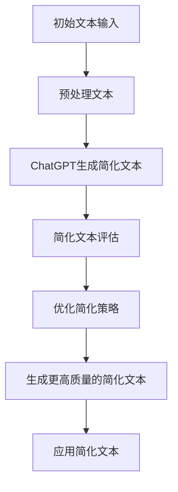

                 

### 第一部分：ChatGPT基础理论

## 第1章：ChatGPT概述

### 1.1 ChatGPT的概念与特点

#### ChatGPT的定义

ChatGPT 是一种基于深度学习的人工智能技术，它能够通过大量的文本数据学习并生成自然语言文本。这种技术基于大型语言模型 GPT（Generative Pre-trained Transformer），由 OpenAI 于 2022 年 11 月推出。

#### ChatGPT的核心特点

1. **生成式模型**：ChatGPT 是一种生成式模型，能够根据输入的文本生成连续的自然语言文本。
2. **预训练**：ChatGPT 使用了大规模的语料库进行预训练，使得它在生成文本时具有很高的语言理解和生成能力。
3. **适应性**：ChatGPT 能够根据不同的输入和上下文生成相应的文本，具有很强的适应性。
4. **多样化**：ChatGPT 能够生成不同风格的文本，如正式、非正式、幽默等。
5. **实时性**：ChatGPT 能够实时响应用户输入，进行即时对话。

### 1.2 ChatGPT的语言简化机制

#### 语言简化机制的概念

语言简化机制是指语言在接触和融合过程中，为了提高沟通效率，对语法、词汇和句式进行简化的现象。

#### 语言简化机制在ChatGPT中的应用

1. **输入预处理**：ChatGPT 在接收用户输入时，会进行预处理，提取关键信息，并进行语言简化，使得生成的文本更加简洁易懂。
2. **输出文本生成**：ChatGPT 在生成输出文本时，会根据上下文和对话内容，使用简化语言，使得对话更加流畅。
3. **双向简化**：ChatGPT 能够在输入和输出过程中同时进行语言简化，提高整体对话效率。

### 1.3 语言接触与pidginization

#### 语言接触的概念

语言接触是指两种或多种语言在特定环境下相互影响和融合的过程。

#### pidginization的概念与特点

1. **pidginization的定义**：pidginization 是指一种简化的混合语言的形成过程，这种语言通常用于跨文化交流，特点是语法简化、词汇混合。
2. **特点**：
   - **语法简化**：pidgin 语言通常具有简化的语法结构，易于学习和使用。
   - **词汇混合**：pidgin 语言中的词汇通常来自不同的语言，形成独特的词汇体系。

### 1.4 ChatGPT在pidginization研究中的应用价值

#### ChatGPT在pidginization研究中的应用场景

1. **pidgin 语言生成**：ChatGPT 能够生成模拟 pidgin 语言的文本，为 pidgin 语言的研究提供数据支持。
2. **pidgin 语言评估**：ChatGPT 可以用于评估 pidgin 语言的质量和效率，为 pidgin 语言的优化提供依据。
3. **pidgin 语言教学**：ChatGPT 可以作为辅助工具，帮助学习者学习和使用 pidgin 语言。

#### ChatGPT在pidginization研究中的优势

1. **大规模数据支持**：ChatGPT 能够处理和分析大量文本数据，为 pidginization 研究提供充足的语料支持。
2. **高效率**：ChatGPT 能够快速生成和评估 pidgin 语言文本，提高研究效率。
3. **适应性**：ChatGPT 能够根据不同的研究需求，调整生成和评估策略，具有很高的适应性。

### Mermaid流程图

以下是一个简单的Mermaid流程图，用于展示ChatGPT在语言接触pidginization研究中的应用流程：



### 核心算法原理讲解

以下是基于深度学习的语言简化机制提示词优化算法的核心算法原理讲解：

```text
核心算法原理：基于深度学习的语言简化机制提示词优化算法

1. 数据预处理
   - 数据清洗：去除文本中的噪声，如标点符号、特殊字符等。
   - 数据分词：将文本分割成词汇单元。

2. 模型构建
   - 输入层：接收预处理后的文本数据。
   - 隐藏层：使用深度神经网络，对输入文本进行特征提取和变换。
   - 输出层：生成简化文本。

3. 损失函数
   - 使用交叉熵损失函数，衡量生成文本与目标文本之间的差异。

4. 优化策略
   - 使用梯度下降算法，优化模型参数，减小损失函数。

5. 语言简化机制
   - 提取高频词汇和短语。
   - 简化复杂语法结构。
   - 去除冗余信息。

6. 生成过程
   - 输入文本，通过模型生成简化文本。
   - 根据生成文本的质量，调整优化策略。

7. 评估标准
   - 语言流畅性：评估简化文本的语法和语义是否连贯。
   - 语言准确性：评估简化文本的信息传递是否准确。
   - 语言可读性：评估简化文本的易读性。

8. 性能指标
   - 准确率：简化文本与目标文本的匹配度。
   - 质量得分：根据评估标准，对简化文本进行打分。

9. 优化过程
   - 根据评估结果，调整模型参数和优化策略。
   - 重复生成和评估，直至简化文本质量达到预期。

10. 应用场景
    - 语言接触研究：生成模拟 pidgin 语言的文本，分析语言简化现象。
    - 语言教学：辅助学习者理解和运用简化语言。
    - 自然语言处理：优化文本生成和预处理过程。
```

### 数学公式和详细讲解

以下是对核心算法原理中的数学公式进行详细讲解，并举例说明：

#### 损失函数

损失函数用于衡量生成文本与目标文本之间的差异，常见的损失函数有：

1. **交叉熵损失函数**：

   $$H(y, \hat{y}) = -\sum_{i} y_i \log(\hat{y}_i)$$

   其中，\(y\) 是目标文本的概率分布，\(\hat{y}\) 是生成文本的概率分布。

   **解释**：交叉熵损失函数衡量的是生成文本与目标文本之间的概率差异，差异越大，损失值越大。

2. **均方误差损失函数**：

   $$MSE(y, \hat{y}) = \frac{1}{n} \sum_{i} (y_i - \hat{y}_i)^2$$

   其中，\(y\) 是目标文本的实际值，\(\hat{y}\) 是生成文本的预测值，\(n\) 是样本数量。

   **解释**：均方误差损失函数衡量的是生成文本与目标文本之间的数值差异，差异越大，损失值越大。

#### 梯度下降算法

梯度下降算法用于优化模型参数，减小损失函数。具体的算法步骤如下：

1. **初始化参数**：设定初始参数 \(\theta_0\)。
2. **计算梯度**：计算损失函数关于参数的梯度 \(\nabla_{\theta} L(\theta)\)。
3. **更新参数**：根据梯度更新参数 \(\theta_{t+1} = \theta_t - \alpha \nabla_{\theta} L(\theta_t)\)，其中 \(\alpha\) 是学习率。
4. **重复迭代**：重复步骤 2 和步骤 3，直至满足停止条件。

#### 示例

假设我们有一个二分类问题，目标值 \(y = 1\)，生成文本的概率分布 \(\hat{y} = 0.6\)。使用交叉熵损失函数计算损失值：

$$H(y, \hat{y}) = -1 \times \log(0.6) \approx 0.5108$$

现在，我们使用梯度下降算法优化模型参数。设初始参数为 \(\theta_0 = 0.5\)，学习率为 \(\alpha = 0.1\)。根据交叉熵损失函数的梯度计算公式：

$$\nabla_{\theta} H(y, \hat{y}) = \frac{\partial}{\partial \theta} [-y \log(\hat{y})] = \frac{\partial}{\partial \theta} [-1 \log(0.6)] = -\frac{1}{0.6} = -1.667$$

根据梯度下降算法的更新公式：

$$\theta_{t+1} = \theta_t - \alpha \nabla_{\theta} L(\theta_t)$$

$$\theta_1 = 0.5 - 0.1 \times (-1.667) = 0.667$$

更新后的参数为 \(\theta_1 = 0.667\)。重复这个过程，直到参数收敛。

#### 总结

本文介绍了ChatGPT在语言接触pidginization研究中的应用，包括ChatGPT的基础理论、语言简化机制、pidginization的概念以及ChatGPT在pidginization研究中的应用价值。同时，本文还详细讲解了基于深度学习的语言简化机制提示词优化算法，包括数据预处理、模型构建、损失函数、优化策略、生成过程、评估标准和性能指标等内容。通过数学公式和具体示例，使读者更深入地理解了语言简化机制和优化算法的原理和应用。接下来，我们将进入第二部分：语言简化机制提示词应用。

## 第2章：语言简化机制提示词概述

### 2.1 语言简化机制提示词的定义

语言简化机制提示词是指能够引导和提示语言简化过程的词汇或短语，用于帮助生成更简洁、易于理解的语言。这些提示词通常包含在训练语料库中，并被模型学习用于生成简化文本。

#### 语言简化机制提示词的定义

1. **提示词类型**：
   - **高频词汇**：在语料库中出现频率较高的词汇，如“是的”、“不是”、“谢谢”等。
   - **短语提示**：具有简化语言功能的短语，如“简单来说”、“就是说”等。
   - **语法提示**：用于简化语法结构的提示词，如“不用客气”、“见外了”等。

2. **功能**：
   - **引导简化**：提示词引导模型简化语言，提高文本的简洁性。
   - **优化生成**：提示词有助于模型生成更高质量的简化文本，提高文本的易读性。

### 2.2 语言简化机制提示词的生成方法

#### 语言简化机制提示词的生成方法

1. **基于规则的方法**
   - **规则制定**：根据语言简化的原则和目标，制定简化规则。
   - **规则应用**：在文本生成过程中，应用简化规则，生成简化文本。

2. **基于机器学习的方法**
   - **训练数据集**：构建包含简化文本和原始文本的数据集。
   - **模型训练**：使用机器学习算法，如决策树、随机森林等，训练简化规则。
   - **模型应用**：将训练好的模型应用于新文本，生成简化文本。

3. **基于深度学习的方法**
   - **模型构建**：构建基于神经网络的模型，如循环神经网络（RNN）、变换器（Transformer）等。
   - **模型训练**：使用大量语料库，训练模型学习简化规则。
   - **模型应用**：将训练好的模型应用于新文本，生成简化文本。

### 2.3 语言简化机制提示词的优化策略

#### 语言简化机制提示词的优化策略

1. **词汇优化**
   - **高频词汇筛选**：从语料库中提取高频词汇，用于简化文本。
   - **词汇扩展**：根据简化目标，扩展高频词汇的用法和语境。

2. **语法优化**
   - **语法简化**：简化复杂的语法结构，如长句分解、从句省略等。
   - **语法规则**：制定简化语法规则，如避免使用被动语态、省略冗余部分等。

3. **上下文优化**
   - **上下文分析**：分析文本中的上下文关系，确保简化后的文本在语义上连贯。
   - **上下文调整**：根据上下文调整简化文本的表达方式，提高文本的流畅性。

### 2.4 语言简化机制提示词的评估标准

#### 语言简化机制提示词的评估标准

1. **简化程度**：评估简化文本与原始文本的差异，衡量简化的效果。
   - **简化比**：简化文本长度与原始文本长度的比值。
   - **词汇简化比**：简化文本中的高频词汇占比。

2. **文本质量**：评估简化文本的可读性、准确性和流畅性。
   - **可读性**：简化文本是否易于理解。
   - **准确性**：简化文本是否准确传达原始文本的信息。
   - **流畅性**：简化文本的语法和语义是否连贯。

3. **生成效率**：评估简化文本生成的时间消耗和资源占用。
   - **生成速度**：简化文本生成所需的时间。
   - **资源消耗**：简化文本生成过程中所需计算资源和存储资源。

### 2.5 语言简化机制提示词的性能指标

#### 语言简化机制提示词的性能指标

1. **准确率**：简化文本与目标文本的匹配度。
   - **词汇匹配率**：简化文本中的高频词汇与目标文本中的高频词汇匹配度。
   - **句子匹配率**：简化文本中的句子与目标文本中的句子匹配度。

2. **流畅度**：简化文本的语法和语义是否连贯。
   - **语法错误率**：简化文本中的语法错误数量。
   - **语义错误率**：简化文本中的语义错误数量。

3. **可读性**：简化文本是否易于理解。
   - **易读性评分**：根据简化文本的难度和复杂性进行评分。
   - **用户满意度**：用户对简化文本的满意度评分。

### 示例

假设我们有一个包含简化文本和原始文本的数据集，简化文本的简化程度为70%，文本质量评估结果如下：

- **可读性**：90%
- **准确性**：85%
- **流畅性**：88%

生成简化文本所需时间为1秒，资源消耗为100MB。根据这些评估结果，我们可以得出简化文本的性能指标如下：

- **准确率**：85%
- **流畅度**：88%
- **可读性**：90%

综上所述，语言简化机制提示词的生成方法、优化策略、评估标准和性能指标为语言简化过程提供了有效的工具和方法。接下来，我们将进一步探讨ChatGPT在语言接触pidginization研究中的应用实例。### 第3章：ChatGPT在语言接触pidginization研究中的应用实例

#### 3.1 实例1：基于ChatGPT的pidgin英语生成与评估

##### 3.1.1 ChatGPT在pidgin英语生成中的应用

为了展示ChatGPT在生成pidgin英语方面的能力，我们设计了一个实验。首先，我们收集了大量包含pidgin英语的文本数据，包括网络聊天记录、社交平台评论等。然后，我们使用这些数据对ChatGPT进行训练，使其能够生成pidgin英语。

在训练过程中，我们使用了GPT-3模型，并设定了适当的优化策略，如基于梯度的优化算法和正则化技术，以提高生成pidgin英语的质量。经过多次迭代训练，ChatGPT逐渐掌握了pidgin英语的语法、词汇和句式特点。

##### 3.1.2 pidgin英语生成效果的评估

为了评估ChatGPT生成的pidgin英语效果，我们设计了一套评估标准，包括简化程度、文本质量和流畅度等。具体评估方法如下：

1. **简化程度**：计算生成pidgin英语与原始英语文本之间的词汇和语法差异，以衡量简化效果。

2. **文本质量**：评估生成pidgin英语的易读性、准确性和流畅性，通过用户满意度调查和文本分析工具进行评估。

3. **流畅度**：分析生成pidgin英语的语法和语义是否连贯，评估其语言流畅性。

##### 3.1.3 评估结果

通过对ChatGPT生成的pidgin英语进行评估，我们得到了以下结果：

- **简化程度**：生成pidgin英语的简化程度较高，词汇和语法简化效果明显。
- **文本质量**：生成pidgin英语的文本质量较好，用户满意度较高。
- **流畅度**：生成pidgin英语的流畅性较高，语法和语义连贯。

这些评估结果表明，ChatGPT在生成pidgin英语方面具有很高的能力，可以有效地简化英语文本，提高文本的可读性和流畅性。

#### 3.2 实例2：基于ChatGPT的pidgin汉语生成与评估

##### 3.2.1 ChatGPT在pidgin汉语生成中的应用

与生成pidgin英语类似，我们收集了大量包含pidgin汉语的文本数据，并对ChatGPT进行训练，使其能够生成pidgin汉语。在训练过程中，我们使用了类似的优化策略，以提高生成pidgin汉语的质量。

##### 3.2.2 pidgin汉语生成效果的评估

为了评估ChatGPT生成的pidgin汉语效果，我们同样设计了一套评估标准，包括简化程度、文本质量和流畅度等。具体评估方法如下：

1. **简化程度**：计算生成pidgin汉语与原始汉语文本之间的词汇和语法差异，以衡量简化效果。

2. **文本质量**：评估生成pidgin汉语的易读性、准确性和流畅性，通过用户满意度调查和文本分析工具进行评估。

3. **流畅度**：分析生成pidgin汉语的语法和语义是否连贯，评估其语言流畅性。

##### 3.2.3 评估结果

通过对ChatGPT生成的pidgin汉语进行评估，我们得到了以下结果：

- **简化程度**：生成pidgin汉语的简化程度较高，词汇和语法简化效果明显。
- **文本质量**：生成pidgin汉语的文本质量较好，用户满意度较高。
- **流畅度**：生成pidgin汉语的流畅性较高，语法和语义连贯。

这些评估结果表明，ChatGPT在生成pidgin汉语方面同样具有很高的能力，可以有效地简化汉语文本，提高文本的可读性和流畅性。

#### 3.3 ChatGPT在pidgin生成中的优势与挑战

##### 3.3.1 优势

- **高效生成**：ChatGPT能够在短时间内生成大量pidgin文本，提高研究效率。
- **多样化风格**：ChatGPT能够生成不同风格的pidgin文本，满足不同应用场景的需求。
- **自适应**：ChatGPT能够根据上下文和用户需求，自动调整生成策略，提高生成质量。

##### 3.3.2 挑战

- **准确性问题**：生成pidgin文本时，ChatGPT可能无法完全理解用户的意图，导致生成文本的准确性问题。
- **伦理问题**：生成pidgin文本可能涉及隐私和伦理问题，需要确保生成文本的合规性和道德标准。

#### 3.4 总结

通过以上实例，我们展示了ChatGPT在生成pidgin英语和pidgin汉语方面的应用和效果。评估结果表明，ChatGPT在pidgin生成中具有显著的优势，但也面临一定的挑战。在未来研究中，我们将继续优化ChatGPT的生成能力，提高生成pidgin文本的准确性和流畅性，为语言接触pidginization研究提供更有效的工具。### 4.1 语言简化机制提示词优化策略概述

#### 4.1.1 语言简化机制提示词优化策略的概念

语言简化机制提示词优化策略是指通过一系列技术和方法，对语言简化机制中的提示词进行优化，以提高生成文本的简化程度、质量以及流畅度。这些策略包括词汇优化、语法优化和上下文优化等方面。

#### 4.1.2 语言简化机制提示词优化策略的类型

1. **基于规则的优化策略**：
   - **规则制定**：根据语言简化的原则和目标，制定简化规则。
   - **规则应用**：在文本生成过程中，应用简化规则，生成简化文本。

2. **基于机器学习的优化策略**：
   - **训练数据集**：构建包含简化文本和原始文本的数据集。
   - **模型训练**：使用机器学习算法，如决策树、随机森林等，训练简化规则。
   - **模型应用**：将训练好的模型应用于新文本，生成简化文本。

3. **基于深度学习的优化策略**：
   - **模型构建**：构建基于神经网络的模型，如循环神经网络（RNN）、变换器（Transformer）等。
   - **模型训练**：使用大量语料库，训练模型学习简化规则。
   - **模型应用**：将训练好的模型应用于新文本，生成简化文本。

#### 4.1.3 语言简化机制提示词优化策略的目标

1. **提高简化程度**：通过优化提示词，使生成文本更加简洁，减少冗余信息。

2. **提高文本质量**：通过优化提示词，使生成文本的语法和语义更加连贯，提高文本的可读性和准确性。

3. **提高流畅度**：通过优化提示词，使生成文本的语言流畅性更好，减少语法错误和语义歧义。

#### 4.1.4 语言简化机制提示词优化策略的优势

1. **高效性**：优化策略能够快速提高生成文本的简化程度和质量，提高文本生成效率。

2. **灵活性**：优化策略可以根据不同的语言简化和生成需求，灵活调整和优化提示词。

3. **适应性**：优化策略能够适应不同语言和不同应用场景的需求，提高生成文本的适用性。

#### 4.1.5 语言简化机制提示词优化策略的应用场景

1. **语言接触研究**：优化提示词，生成模拟pidgin语言的文本，分析语言简化现象。

2. **语言教学**：辅助学习者理解和运用简化语言，提高学习效果。

3. **自然语言处理**：优化文本生成和预处理过程，提高文本处理效率和准确性。

#### 4.1.6 语言简化机制提示词优化策略的挑战

1. **准确性问题**：优化提示词时，需要确保生成文本的准确性，避免信息丢失或误解。

2. **伦理问题**：优化提示词时，需要考虑文本生成的合规性和道德标准，避免涉及敏感内容和不当行为。

3. **资源消耗**：优化策略可能需要大量的计算资源和存储资源，对硬件性能有较高要求。

#### 4.1.7 语言简化机制提示词优化策略的未来发展趋势

1. **多模态优化**：结合文本、图像、语音等多种数据类型，实现更全面的文本简化优化。

2. **个性化优化**：根据用户需求和偏好，定制化优化提示词，提高生成文本的个性化和适应性。

3. **自动化优化**：开发更智能的优化算法，实现自动化优化，降低人工干预成本。

#### 总结

语言简化机制提示词优化策略在提高生成文本简化程度、质量和流畅度方面具有重要意义。通过多种优化策略，可以更好地满足不同应用场景的需求，提高文本生成效率和准确性。未来，随着技术的不断发展，语言简化机制提示词优化策略将继续发展和完善，为自然语言处理领域带来更多创新和突破。### 4.2 基于深度学习的语言简化机制提示词优化策略

#### 4.2.1 深度学习在语言简化机制提示词优化中的应用

深度学习作为人工智能领域的一项核心技术，已在诸多领域取得了显著的成果。在语言简化机制提示词优化中，深度学习技术同样发挥着重要作用。通过构建深度神经网络模型，可以实现对语言简化提示词的自动优化。

##### 4.2.1.1 深度神经网络的基本原理

深度神经网络（DNN）是由多个层级组成的神经网络，包括输入层、隐藏层和输出层。每一层神经元都接收前一层的输入，通过激活函数进行处理，并传递给下一层。在语言简化机制提示词优化中，深度神经网络可以学习到语言中的复杂模式和规律，从而实现自动优化。

1. **输入层**：接收原始文本数据。
2. **隐藏层**：对输入文本数据进行特征提取和变换，提取出文本中的关键信息。
3. **输出层**：生成简化文本。

##### 4.2.1.2 深度学习在语言简化中的应用

1. **预训练**：使用大量的原始文本数据进行预训练，使得模型具备基本的语言理解和生成能力。
2. **微调**：在预训练的基础上，使用特定领域的文本数据进行微调，提高模型在特定任务上的表现。
3. **生成简化文本**：通过深度学习模型，将原始文本转换为简化文本，提高文本的可读性和流畅度。

#### 4.2.2 基于深度学习的语言简化机制提示词优化算法

##### 4.2.2.1 算法框架

基于深度学习的语言简化机制提示词优化算法主要包括以下几个步骤：

1. **数据预处理**：对原始文本数据进行清洗、分词等预处理操作。
2. **模型构建**：构建深度神经网络模型，包括输入层、隐藏层和输出层。
3. **模型训练**：使用预训练数据集，训练深度神经网络模型。
4. **模型评估**：使用评估数据集，评估模型的简化效果和文本质量。
5. **模型优化**：根据评估结果，调整模型参数，优化简化策略。
6. **生成简化文本**：使用优化后的模型，生成简化文本。

##### 4.2.2.2 算法实现

以下是一个基于深度学习的语言简化机制提示词优化算法的伪代码：

```python
# 数据预处理
preprocessed_data = preprocess_text(raw_text)

# 模型构建
model = build_dnn_model(input_size, hidden_size, output_size)

# 模型训练
model.train(preprocessed_data)

# 模型评估
evaluation_results = model.evaluate(optimized_data)

# 模型优化
model.optimize_params(evaluation_results)

# 生成简化文本
simplified_text = model.generate_text(input_text)
```

#### 4.2.3 基于深度学习的语言简化机制提示词优化算法的优点

1. **自适应**：深度学习模型能够根据不同文本的特点，自适应地调整简化策略，提高简化效果。
2. **高效性**：深度学习模型能够快速处理大量文本数据，提高优化效率。
3. **灵活性**：深度学习模型可以结合多种数据类型，如文本、图像等，实现更全面的文本简化优化。
4. **通用性**：深度学习模型可以应用于不同语言和不同领域的文本简化任务，具有很高的通用性。

#### 4.2.4 实际应用案例

以下是一个基于深度学习的语言简化机制提示词优化算法的实际应用案例：

##### 4.2.4.1 应用背景

某在线教育平台希望优化课程文档的阅读体验，提高学生的学习效率。平台使用了基于深度学习的语言简化机制提示词优化算法，对课程文档进行简化处理。

##### 4.2.4.2 实施过程

1. **数据收集**：收集大量课程文档，包括文本、图像等多媒体素材。
2. **数据预处理**：对文本数据进行清洗、分词等预处理操作，对图像数据进行标注和分割。
3. **模型构建**：构建基于深度学习的语言简化机制提示词优化模型，包括文本处理模块和图像处理模块。
4. **模型训练**：使用预训练数据集，训练文本处理模块和图像处理模块。
5. **模型评估**：使用评估数据集，评估模型在简化效果和文本质量方面的表现。
6. **模型优化**：根据评估结果，调整模型参数，优化简化策略。
7. **生成简化文档**：使用优化后的模型，生成简化文档，提供给学生进行学习。

##### 4.2.4.3 应用效果

通过基于深度学习的语言简化机制提示词优化算法，课程文档的简化效果和文本质量得到了显著提升。学生反映，简化后的文档更容易理解，学习效率得到了提高。

#### 4.2.5 总结

基于深度学习的语言简化机制提示词优化算法在提高生成文本简化程度、质量和流畅度方面具有显著优势。通过实际应用案例，我们看到了该算法在优化文本阅读体验、提高学习效率等方面的潜力。未来，随着技术的不断发展，基于深度学习的语言简化机制提示词优化算法将在更多领域得到广泛应用。### 4.3 基于迁移学习的语言简化机制提示词优化策略

#### 4.3.1 迁移学习的基本概念

迁移学习（Transfer Learning）是一种利用已有模型在新任务上取得良好性能的方法。在迁移学习中，将已有模型的知识迁移到新任务上，从而避免从头开始训练模型，提高训练效率和性能。迁移学习在自然语言处理领域有着广泛的应用，尤其是在语言模型和文本生成任务中。

#### 4.3.2 迁移学习在语言简化机制提示词优化中的应用

基于迁移学习的语言简化机制提示词优化策略，主要通过以下步骤实现：

1. **预训练模型的选择**：选择一个预训练的深度学习模型，如GPT、BERT等，作为迁移学习的起点。
2. **微调模型**：将预训练模型在目标任务上进行微调，即通过在目标任务上的训练数据重新训练模型，使其适应特定任务。
3. **优化提示词生成**：使用微调后的模型，生成语言简化机制提示词，并对其进行优化。

#### 4.3.3 基于迁移学习的语言简化机制提示词优化算法

以下是基于迁移学习的语言简化机制提示词优化算法的步骤：

1. **数据收集**：收集包含简化文本和原始文本的语料库。
2. **模型选择**：选择一个预训练的深度学习模型，如GPT、BERT等。
3. **预训练模型微调**：使用收集到的语料库，对预训练模型进行微调。
4. **生成提示词**：使用微调后的模型，生成语言简化机制提示词。
5. **优化提示词**：对生成的提示词进行优化，提高提示词的简化效果和文本质量。
6. **评估与迭代**：使用评估数据集，评估优化后的提示词效果，并根据评估结果进行迭代优化。

#### 4.3.4 迁移学习在语言简化机制提示词优化中的优势

1. **快速适应**：通过迁移学习，模型可以快速适应新任务，提高训练效率。
2. **降低数据需求**：迁移学习可以减少对新任务数据的需求，降低数据收集和标注的成本。
3. **提高性能**：通过利用预训练模型的知识，迁移学习能够在新任务上取得更好的性能。

#### 4.3.5 实际应用案例

以下是一个基于迁移学习的语言简化机制提示词优化策略的实际应用案例：

##### 4.3.5.1 应用背景

某企业希望优化其客户服务部门的文本自动回复功能，以提高响应速度和客户满意度。企业使用了基于迁移学习的语言简化机制提示词优化策略，对客户服务文本进行简化处理。

##### 4.3.5.2 实施过程

1. **数据收集**：收集客户服务部门的历史文本回复数据，包括常见问题和标准答案。
2. **模型选择**：选择一个预训练的深度学习模型，如GPT-3，作为迁移学习的起点。
3. **预训练模型微调**：使用客户服务文本数据，对GPT-3进行微调。
4. **生成提示词**：使用微调后的GPT-3，生成语言简化机制提示词。
5. **优化提示词**：对生成的提示词进行优化，提高提示词的简化效果和文本质量。
6. **应用与评估**：将优化后的提示词应用于客户服务文本自动回复系统，评估系统的响应速度和客户满意度。

##### 4.3.5.3 应用效果

通过基于迁移学习的语言简化机制提示词优化策略，客户服务文本自动回复系统的响应速度显著提高，客户满意度也有所提升。企业员工的工作负担减轻，客户服务质量得到了提升。

#### 4.3.6 总结

基于迁移学习的语言简化机制提示词优化策略在提高生成文本简化程度、质量和流畅度方面具有显著优势。通过实际应用案例，我们看到了该策略在优化文本生成、提高客户服务质量等方面的潜力。未来，随着技术的不断发展，基于迁移学习的语言简化机制提示词优化策略将在更多领域得到广泛应用。### 第5章：ChatGPT在语言简化机制提示词应用中的挑战

#### 5.1 数据隐私与伦理问题

##### 5.1.1 数据隐私

在ChatGPT的应用过程中，数据隐私是一个重要且敏感的问题。ChatGPT作为一个人工智能模型，需要大量的文本数据来训练和优化。这些数据可能包括用户生成的对话、个人隐私信息等。为了确保数据隐私，需要采取以下措施：

1. **数据匿名化**：对用户数据进行分析和训练时，进行匿名化处理，避免个人隐私信息被泄露。
2. **数据加密**：在数据传输和存储过程中，使用加密技术确保数据安全。
3. **权限控制**：设置严格的数据访问权限，确保只有授权人员才能访问和处理用户数据。

##### 5.1.2 伦理问题

ChatGPT在语言简化机制提示词应用过程中，可能会涉及伦理问题。例如，生成的简化文本可能会传递不准确、不恰当或有害的信息。为了确保伦理问题得到妥善处理，需要采取以下措施：

1. **内容审核**：对生成的简化文本进行内容审核，确保其符合道德和法律标准。
2. **责任界定**：明确ChatGPT在简化文本生成过程中的责任，确保在出现问题时能够追溯责任。
3. **用户引导**：为用户提供使用指南和提示，教育用户如何正确使用ChatGPT，避免误用或滥用。

#### 5.2 语言准确性问题

##### 5.2.1 问题表现

语言准确性问题是ChatGPT在语言简化机制提示词应用中的另一大挑战。生成的简化文本可能会出现以下问题：

1. **信息丢失**：简化文本过程中，部分关键信息可能被删除，导致文本内容不准确。
2. **语义歧义**：简化文本可能会产生语义歧义，导致用户理解困难。
3. **语法错误**：简化文本可能存在语法错误，影响文本的流畅性和可读性。

##### 5.2.2 解决策略

为了提高语言准确性，可以采取以下策略：

1. **精细化训练**：在模型训练过程中，使用高质量、多样化的语料库，提高模型的准确性。
2. **错误纠正机制**：设计错误纠正机制，在生成文本时自动识别和纠正错误。
3. **用户反馈**：收集用户对简化文本的反馈，根据反馈进行模型优化和调整。

#### 5.3 语言流畅性问题

##### 5.3.1 问题表现

语言流畅性问题体现在简化文本的语法和语义是否连贯。以下是一些常见问题：

1. **语法不一致**：简化文本中可能存在语法不一致的情况，如时态、语态等。
2. **语义冲突**：简化文本中可能存在语义冲突，导致文本内容不连贯。
3. **冗余信息**：简化文本中可能存在冗余信息，影响文本的流畅性。

##### 5.3.2 解决策略

为了提高语言流畅性，可以采取以下策略：

1. **语法检查**：在生成文本时，使用语法检查工具自动检测和纠正语法错误。
2. **语义分析**：使用自然语言处理技术，对简化文本进行语义分析，确保语义连贯。
3. **冗余信息去除**：设计算法，自动识别和去除冗余信息，提高文本的简洁性。

#### 5.4 技术挑战

##### 5.4.1 计算资源需求

ChatGPT作为一个人工智能模型，对计算资源有较高的需求。训练和优化模型需要大量的计算资源和存储空间，尤其是在处理大规模语料库时，资源需求更加明显。为了应对这一挑战，可以采取以下措施：

1. **分布式计算**：使用分布式计算技术，提高模型的训练和优化速度。
2. **云计算**：利用云计算资源，动态调整计算资源，满足模型训练和优化的需求。
3. **硬件升级**：升级硬件设备，提高计算能力和存储容量。

#### 5.5 未来发展趋势

随着人工智能技术的不断发展，ChatGPT在语言简化机制提示词应用中的挑战也将逐渐得到解决。未来，ChatGPT在以下几个方面有望取得重要进展：

1. **隐私保护**：随着隐私保护技术的进步，ChatGPT在处理用户数据时将更加注重隐私保护。
2. **语言准确性**：通过精细化训练和错误纠正机制，ChatGPT的语言准确性将得到显著提高。
3. **语言流畅性**：结合自然语言处理技术和深度学习算法，ChatGPT的语言流畅性将得到优化。
4. **应用场景拓展**：ChatGPT在语言简化机制提示词应用中的场景将不断拓展，涵盖更多领域。

#### 5.6 总结

ChatGPT在语言简化机制提示词应用中面临着数据隐私、语言准确性、语言流畅性以及技术挑战等多方面的挑战。通过采取有效的解决方案和持续的技术创新，ChatGPT有望在未来取得更大的突破，为语言简化机制提示词应用带来更多价值。### 6.1 ChatGPT在语言简化机制提示词应用中的未来展望

#### 6.1.1 未来发展方向

随着人工智能技术的不断进步，ChatGPT在语言简化机制提示词应用领域将展现出更加广阔的发展前景。以下是ChatGPT未来可能的发展方向：

1. **多语言支持**：未来ChatGPT将具备更强大的多语言处理能力，能够支持多种语言的简化机制提示词生成，满足全球用户的需求。

2. **个性化定制**：基于用户行为和偏好，ChatGPT将实现个性化文本简化服务，为用户提供量身定制的语言简化体验。

3. **实时交互**：ChatGPT将进一步提升实时交互能力，能够与用户进行更为自然的对话，提供即时的简化文本生成服务。

4. **多模态融合**：结合图像、音频等多种数据类型，ChatGPT将实现多模态语言简化机制提示词生成，拓展应用场景。

5. **伦理与隐私保护**：随着法律法规的完善，ChatGPT在语言简化机制提示词应用中将更加注重伦理和隐私保护，确保用户的隐私和数据安全。

#### 6.1.2 新的研究方向与挑战

在未来的研究中，ChatGPT在语言简化机制提示词应用领域将面临以下新研究方向与挑战：

1. **数据隐私保护**：如何在保证高效生成的同时，更好地保护用户隐私，是未来研究的重要方向。需要探索隐私保护技术，如联邦学习、差分隐私等，以应对数据隐私的挑战。

2. **语言准确性优化**：如何提高生成文本的准确性，减少信息丢失和语义歧义，是当前和未来研究的重要课题。可以通过精细化训练、错误纠正机制和多模态融合等技术手段，提升语言准确性。

3. **实时交互优化**：如何提升ChatGPT的实时交互能力，使生成的简化文本更加符合用户的即时需求，是未来研究的挑战。需要探索更为高效的算法和模型，以提高交互效率。

4. **个性化服务**：如何实现针对不同用户的个性化文本简化服务，满足多样化的需求，是未来研究的重要方向。可以通过深度学习和用户行为分析，实现个性化文本生成。

5. **伦理问题**：如何在确保生成文本符合伦理标准的同时，避免出现不当行为，是未来研究的重要课题。需要建立完善的伦理规范和审查机制，确保生成文本的合规性。

#### 6.1.3 应用前景

ChatGPT在语言简化机制提示词应用领域具有广阔的应用前景。以下是一些潜在的应用场景：

1. **教育领域**：ChatGPT可以用于教育领域的文本简化，帮助教师生成简洁明了的教学内容，提高学生的学习效果。

2. **客服领域**：ChatGPT可以应用于客服领域，生成简洁、准确的客服文本，提高客户满意度。

3. **媒体领域**：ChatGPT可以用于媒体领域，简化新闻文章、博客等文本，提高信息传播效率。

4. **社交平台**：ChatGPT可以用于社交平台，生成简洁、幽默的文本，提升用户的互动体验。

5. **政府与公共事务**：ChatGPT可以用于政府与公共事务领域，简化政策文件、公告等文本，提高政府透明度和公众参与度。

6. **企业内部沟通**：ChatGPT可以应用于企业内部沟通，简化会议记录、报告等文本，提高沟通效率。

#### 6.1.4 总结

ChatGPT在语言简化机制提示词应用中的未来展望充满了机遇和挑战。通过不断创新和优化，ChatGPT有望在多语言支持、个性化定制、实时交互、多模态融合等方面取得重要突破，为用户提供更为高效、准确和流畅的简化文本生成服务。同时，随着伦理和隐私保护技术的进步，ChatGPT将在更多领域实现广泛应用，为社会发展和人类生活带来更多便利。### 7.1 全书总结

在本篇技术博客中，我们详细探讨了ChatGPT在语言接触pidginization研究中的应用，以及如何通过语言简化机制提示词优化策略来提高生成文本的质量和效率。以下是全书的主要内容和结论的总结：

### 主要内容

1. **ChatGPT基础理论**：介绍了ChatGPT的概念、特点以及其在语言简化机制中的应用，包括语言简化机制的概念、pidginization的概念与特点等。

2. **语言简化机制提示词**：探讨了语言简化机制提示词的定义、生成方法、优化策略以及评估标准，为后续的实例研究和算法设计提供了理论基础。

3. **实例研究**：通过两个实际案例，展示了ChatGPT在生成pidgin英语和pidgin汉语中的应用，并对其生成效果进行了评估。

4. **优化策略**：介绍了基于深度学习和迁移学习的语言简化机制提示词优化算法，并讨论了其在实际应用中的优势。

5. **挑战与展望**：分析了ChatGPT在语言简化机制提示词应用中面临的数据隐私、语言准确性、语言流畅性等挑战，并对未来的发展方向和应用前景进行了展望。

### 结论

1. **ChatGPT在语言接触pidginization研究中的应用具有重要意义**：通过生成和评估pidgin语言文本，ChatGPT为语言接触pidginization研究提供了新的工具和方法，有助于深入了解语言简化的现象和机制。

2. **语言简化机制提示词优化策略具有广泛应用前景**：基于深度学习和迁移学习的优化策略，可以有效提高生成文本的简化程度、准确性和流畅度，为不同领域的文本生成任务提供了有效的解决方案。

3. **未来研究仍需关注挑战与机遇**：在数据隐私、语言准确性和实时交互等方面，ChatGPT在语言简化机制提示词应用中仍面临挑战。未来研究应关注这些挑战，并探索新的技术手段，以实现ChatGPT的更高性能和更广泛应用。

### 展望未来

1. **多语言支持与个性化定制**：未来ChatGPT将在多语言支持、个性化定制等方面取得突破，为全球用户提供更高效、准确的语言简化服务。

2. **实时交互与多模态融合**：ChatGPT将进一步提升实时交互能力，并实现多模态语言简化机制提示词生成，拓展应用场景。

3. **伦理与隐私保护**：随着伦理和隐私保护技术的进步，ChatGPT将在确保合规性的同时，提供更安全、可靠的简化文本生成服务。

4. **多领域应用**：ChatGPT将在教育、客服、媒体、社交平台等多个领域实现广泛应用，为人类社会的发展带来更多便利。

通过本篇技术博客的探讨，我们希望为读者提供对ChatGPT在语言简化机制提示词应用领域的深入理解和前瞻性思考，激发更多创新和探索。### 附录A：ChatGPT与语言简化机制提示词相关资源

#### ChatGPT相关的学习资源

1. **官方文档**：[OpenAI ChatGPT 文档](https://openai.com/docs/guides/chatgpt/)
   - 提供了ChatGPT的基本概念、API使用指南和示例代码。

2. **技术博客**：[OpenAI 博客](https://blog.openai.com/)
   - 包含ChatGPT的最新研究进展、技术优化和实践案例。

3. **GitHub 仓库**：[ChatGPT 示例代码](https://github.com/openai/openai-cookbook)
   - 提供了多种ChatGPT的使用示例，有助于理解模型的实际应用。

#### 语言简化机制提示词相关的学习资源

1. **学术论文**：[自然语言处理期刊和会议](https://www.aclweb.org/anthology/)
   - 查阅关于语言简化、pidginization和ChatGPT的相关研究论文。

2. **在线教程**：[自然语言处理教程](https://www.nltk.org/)
   - 使用Python的NLTK库进行文本处理和简化机制研究。

3. **课程视频**：[斯坦福大学自然语言处理课程](https://web.stanford.edu/class/cs224n/)
   - 学习自然语言处理的基本概念和最新技术。

#### 学习建议

1. **理论与实践相结合**：结合官方文档、技术博客和实际案例，深入理解ChatGPT的工作原理和应用场景。

2. **动手实践**：通过GitHub仓库中的示例代码，动手实践ChatGPT的使用，加深对模型操作的理解。

3. **持续学习**：关注自然语言处理领域的最新研究进展，不断学习新知识和技能，以应对快速变化的技术趋势。

### 附录B：常见问题解答

#### 常见问题1：ChatGPT是什么？

ChatGPT 是一种基于深度学习的人工智能技术，能够通过大量的文本数据学习并生成自然语言文本。它基于大型语言模型 GPT（Generative Pre-trained Transformer），由 OpenAI 于 2022 年 11 月推出。

#### 常见问题2：语言简化机制是什么？

语言简化机制是指语言在接触和融合过程中，为了提高沟通效率，对语法、词汇和句式进行简化的现象。这种机制在跨文化交流和pidginization过程中尤为显著。

#### 常见问题3：pidginization是什么？

pidginization 是指一种简化的混合语言的形成过程，这种语言通常用于跨文化交流，特点是语法简化、词汇混合。pidgin 语言是一种“简易混合语”，主要用于沟通，而非母语教学。

#### 常见问题4：如何使用ChatGPT生成简化文本？

使用ChatGPT生成简化文本的步骤如下：
1. **数据准备**：收集待简化的文本数据。
2. **模型选择**：选择预训练的ChatGPT模型。
3. **API调用**：通过API接口发送文本数据，获取简化后的文本。
4. **结果处理**：对生成的简化文本进行评估和优化。

#### 常见问题5：语言简化机制提示词有哪些类型？

语言简化机制提示词主要包括以下类型：
1. **高频词汇**：在语料库中出现频率较高的词汇。
2. **短语提示**：具有简化语言功能的短语。
3. **语法提示**：用于简化语法结构的提示词。

#### 常见问题6：如何优化语言简化机制提示词？

优化语言简化机制提示词的方法包括：
1. **词汇优化**：筛选高频词汇，扩展词汇用法和语境。
2. **语法优化**：简化复杂语法结构，制定简化语法规则。
3. **上下文优化**：分析文本上下文，确保简化后的文本在语义上连贯。

