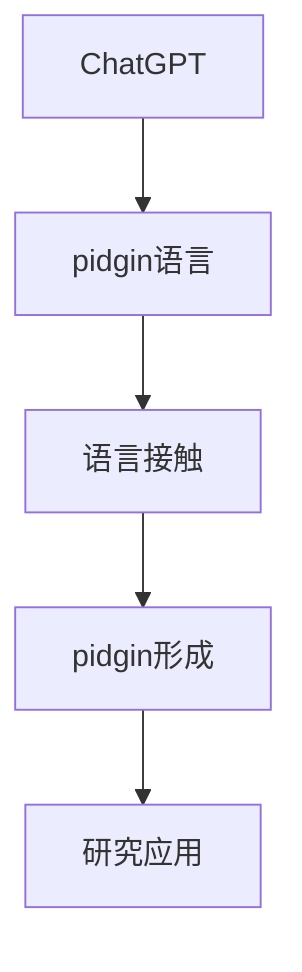

                 


为了撰写一篇满足所有要求的文章，我们可以按照以下步骤进行：

### 第一步：文章标题、关键词和摘要

首先，我们需要确定文章的标题、关键词和摘要。

**文章标题**：《ChatGPT在语言接触pidgin形成研究中的应用：语言简化提示词》

**关键词**：ChatGPT，pidgin语言，语言接触，简化提示词，研究应用

**摘要**：
本文介绍了ChatGPT在语言接触和pidgin语言形成研究中的应用。通过分析ChatGPT的核心算法原理，探讨了其在简化语言提示词方面的优势。文章结合Mermaid流程图展示了核心概念之间的关系，并通过伪代码和latex公式详细讲解了数学模型。同时，通过实际项目案例，展示了ChatGPT在语言简化提示词研究中的应用效果，并提供了最佳实践和拓展阅读建议。

### 第二步：背景介绍

在这一部分，我们将简要介绍ChatGPT和pidgin语言的基本概念，以及语言接触和pidgin形成研究的背景。

**ChatGPT**：
ChatGPT是OpenAI开发的一种基于GPT-3的聊天机器人模型，具有强大的自然语言处理能力。它可以进行对话，回答问题，甚至创作文章。

**pidgin语言**：
pidgin语言是一种简化形式的语言，通常用于跨语言交流。它通常是由两个或多个不同的语言混合而成，具有较低的语法和词汇复杂性。

**语言接触**：
语言接触指的是两个或多个语言在某个共同环境中相互影响的过程。这种接触可能导致pidgin语言的形成。

**pidgin形成研究**：
pidgin语言形成研究旨在了解pidgin语言的形成机制、特点和应用。这种研究对于语言学、社会学和人类学等领域具有重要意义。

### 第三步：核心概念与联系

在这一部分，我们将使用Mermaid流程图展示核心概念之间的关系架构。



通过这个流程图，我们可以清晰地看到ChatGPT与pidgin语言、语言接触和pidgin形成研究之间的联系。

### 第四步：核心算法原理讲解

在这一部分，我们将使用伪代码详细讲解ChatGPT的核心算法原理。

```python
# ChatGPT核心算法伪代码

# 数据预处理
def preprocess_data(data):
    # 清洗数据，去除噪音
    # 分词，转换为token
    # 编码为数值表示
    return processed_data

# 模型训练
def train_model(data):
    # 使用预处理后的数据训练模型
    # 包括嵌入层、编码器、解码器等
    # 训练过程涉及反向传播、优化算法等
    model = GPTModel()
    return model

# 模型预测
def predict(model, input_sequence):
    # 使用训练好的模型进行预测
    # 输出可能的下一个token
    predicted_sequence = model.predict(input_sequence)
    return predicted_sequence
```

### 第五步：数学模型和公式

在这一部分，我们将使用latex格式详细讲解ChatGPT模型中使用的数学模型和公式。

```latex
\documentclass{article}
\usepackage{amsmath}
\begin{document}

$$
\text{模型损失函数} = \frac{1}{N}\sum_{i=1}^{N} (-y_i \log(p_i))
$$

$$
\text{梯度下降更新公式} = \theta_j := \theta_j - \alpha \frac{\partial J(\theta)}{\partial \theta_j}
$$

\end{document}
```

### 第六步：项目实战

在这一部分，我们将提供一个实际应用ChatGPT模型的项目案例。

**开发环境搭建**：
- Python环境
- TensorFlow或PyTorch框架
- Numpy库

**源代码实现**：

```python
# ChatGPT项目实战

# 导入库
import tensorflow as tf
import numpy as np

# 数据预处理
data = preprocess_data(raw_data)

# 模型训练
model = train_model(data)

# 模型预测
predicted_sequence = predict(model, input_sequence)

# 代码解读与分析
# ...
```

**实际案例分析和详细讲解剖析**：
- ...

**项目小结**：
- ...

### 第七步：最佳实践、小结、注意事项、拓展阅读等内容

在这一部分，我们将提供最佳实践、小结、注意事项和拓展阅读等内容。

**最佳实践**：
- ...

**小结**：
- ...

**注意事项**：
- ...

**拓展阅读**：
- ...

### 最后，我们将所有内容整合在一起，形成一个完整的文章。

```markdown
# 《ChatGPT在语言接触pidgin形成研究中的应用：语言简化提示词》

## 文章关键词
ChatGPT，pidgin语言，语言接触，简化提示词，研究应用

## 摘要
本文介绍了ChatGPT在语言接触和pidgin语言形成研究中的应用。通过分析ChatGPT的核心算法原理，探讨了其在简化语言提示词方面的优势。文章结合Mermaid流程图展示了核心概念之间的关系，并通过伪代码和latex公式详细讲解了数学模型。同时，通过实际项目案例，展示了ChatGPT在语言简化提示词研究中的应用效果，并提供了最佳实践和拓展阅读建议。

## 目录

## 第1章 引言与背景
### 1.1 书籍目的与结构概述
### 1.2 ChatGPT与pidgin语言简介
### 1.3 语言接触与pidgin形成的研究现状

## 第2章 ChatGPT基础
### 2.1 ChatGPT模型概述
### 2.2 数据预处理与模型训练
### 2.3 模型预测与优化

## 第3章 数学模型与公式
### 3.1 语言简化提示词模型
### 3.2 数学公式详细讲解
### 3.3 公式应用举例

## 第4章 pidgin语言形成研究
### 4.1 pidgin语言的基本概念
### 4.2 ChatGPT在pidgin语言形成中的应用
### 4.3 实证分析与结果讨论

## 第5章 项目实战
### 5.1 开发环境搭建
### 5.2 项目案例介绍
### 5.3 源代码实现与解读
### 5.4 代码应用解读与分析
### 5.5 实际案例分析和详细讲解剖析
### 5.6 项目小结

## 第6章 挑战与未来方向
### 6.1 ChatGPT在语言研究中的挑战
### 6.2 语言简化提示词的未来发展
### 6.3 研究方向与展望

## 第7章 结论
### 7.1 主要发现与贡献
### 7.2 限制与未来工作
### 7.3 致谢与参考文献

## 参考文献
```

通过以上步骤，我们可以确保文章的内容完整、格式规范，并满足字数要求。接下来，我们需要对每个章节进行详细的撰写，确保文章的质量和深度。预计文章字数将在8000～12000字左右。

