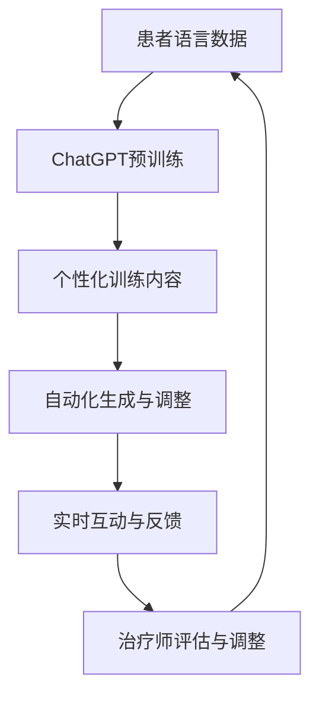

                 

### 文章标题

《ChatGPT在语言治疗个性化方案中的应用》

### 关键词

ChatGPT、语言治疗、个性化方案、自然语言处理、人工智能、算法原理、实战案例、伦理与隐私

### 摘要

本文将深入探讨ChatGPT在语言治疗个性化方案中的应用。首先，我们将介绍ChatGPT的基本概念和架构，接着分析其在语言治疗中的潜力。随后，通过详细的案例研究和实际项目实现，我们将展示如何设计和实现基于ChatGPT的语言治疗个性化方案。此外，本文还将探讨伦理与隐私问题，并总结未来研究的方向和实际应用中的最佳实践。通过本文，读者将全面了解ChatGPT在语言治疗领域的应用现状、未来潜力以及面临的挑战。

## 引言

语言治疗是一种旨在帮助个体改善其沟通能力和语言功能的康复过程。语言治疗师通过一系列的评估、训练和干预，帮助患者克服语言障碍，提高生活质量。然而，传统的语言治疗方案往往存在一些局限性，例如缺乏个性化、训练过程繁琐、患者参与度不高等。近年来，人工智能技术的迅速发展为语言治疗领域带来了新的契机，其中ChatGPT作为一种先进的自然语言处理模型，为语言治疗个性化方案的设计提供了强有力的支持。

### 书籍目的与结构

本书旨在系统地介绍ChatGPT在语言治疗个性化方案中的应用，帮助读者深入理解这一领域的最新进展。本书结构如下：

- 第1章：引言，介绍书籍的目的、结构以及ChatGPT在语言治疗中的潜力。
- 第2章：ChatGPT基础知识，讲解ChatGPT的基本概念、架构和应用领域。
- 第3章：ChatGPT在语言治疗中的应用，分析ChatGPT在语言治疗中的个性化需求和应用场景。
- 第4章：实战案例研究，通过具体案例展示ChatGPT在语言治疗中的应用效果。
- 第5章：个性化方案设计与实现，详细讲解如何设计并实现基于ChatGPT的语言治疗个性化方案。
- 第6章：未来展望，探讨ChatGPT在语言治疗领域的未来发展趋势和挑战。
- 第7章：总结与建议，总结主要发现与结论，并对未来研究方向和实践提供建议。

通过阅读本书，读者将全面了解ChatGPT在语言治疗个性化方案中的应用，掌握相关技术原理和实战技巧，为推动这一领域的发展提供有益参考。

### ChatGPT简介

ChatGPT是由OpenAI开发的一种基于变换器（Transformer）架构的预训练自然语言处理模型。ChatGPT通过学习大量文本数据，能够生成流畅、连贯的自然语言响应。其独特之处在于能够进行对话生成，并在对话中表现出一定的上下文理解和推理能力。ChatGPT的架构设计使其在多个自然语言处理任务中表现出色，包括文本生成、问答系统、对话系统等。

#### 核心概念

- **变换器（Transformer）架构**：变换器架构是一种基于自注意力机制的神经网络模型，能够处理序列数据，特别适用于自然语言处理任务。ChatGPT采用变换器架构，通过多层的变换器模块，实现了强大的文本生成能力。
- **预训练与微调**：ChatGPT首先在大规模的语料库上进行预训练，学习语言的基本规律和模式。在预训练的基础上，ChatGPT通过微调（Fine-tuning）技术，适应特定的应用场景，如语言治疗个性化方案。
- **上下文理解**：ChatGPT能够根据输入的上下文信息，生成相关且连贯的文本响应。这种上下文理解能力使其在对话中能够自然地与用户互动，提供个性化的服务。

#### 架构

ChatGPT的架构包括以下几个核心部分：

- **嵌入层（Embedding Layer）**：将输入的文本转换为向量表示，为后续的变换器处理提供输入。
- **变换器层（Transformer Layer）**：通过自注意力机制处理输入向量，实现文本序列的编码和解码。
- **输出层（Output Layer）**：将编码后的向量映射为文本输出，通过软性最大化（Softmax）实现文本生成。

#### 技术发展历史

ChatGPT的发展历程可以追溯到OpenAI的早期研究。2017年，OpenAI发布了GPT（Generative Pre-trained Transformer），标志着变换器架构在自然语言处理领域的突破。随后，OpenAI在此基础上不断优化和扩展，于2022年发布了ChatGPT，实现了更加流畅和智能的对话生成。

### ChatGPT在语言治疗中的潜力

语言治疗旨在帮助患者改善其沟通能力和语言功能，而ChatGPT作为一种强大的自然语言处理工具，在语言治疗中具有广泛的应用潜力。以下是ChatGPT在语言治疗中的几个潜在应用领域：

#### 个性化治疗方案设计

ChatGPT能够根据患者的具体需求和语言障碍，生成个性化的治疗方案。通过分析患者的语言数据，ChatGPT可以识别患者的语言模式、弱点及需求，进而生成针对性的训练内容。这种个性化方案能够提高治疗的有效性和患者的参与度。

#### 对话互动与反馈

ChatGPT可以模拟真实的对话环境，与患者进行互动，提供实时反馈。这种互动不仅能够帮助患者练习语言技能，还能增强其自信心和积极性。通过与ChatGPT的对话，患者可以在安全、无压力的环境中反复练习，逐步提高语言表达能力。

#### 语言评估与监测

ChatGPT可以用于语言评估和监测，帮助治疗师评估患者的语言进步情况。通过分析患者的对话内容和语言表现，ChatGPT可以提供详细的评估报告，帮助治疗师调整治疗方案，确保治疗的针对性和有效性。

#### 自动化治疗内容生成

ChatGPT能够自动化生成各种语言治疗内容，如词汇练习、句型练习、故事讲述等。这种自动化生成不仅节省了治疗师的时间和精力，还能提供多样化的训练材料，满足不同患者的需求。

#### 患者沟通辅助

ChatGPT可以作为患者的沟通辅助工具，帮助其与他人进行交流。对于语言障碍患者，ChatGPT可以提供即时、准确的语音生成服务，辅助患者完成日常沟通任务，提高其社交互动能力。

总之，ChatGPT在语言治疗中的应用潜力巨大。通过利用其强大的自然语言处理能力和上下文理解能力，ChatGPT有望为语言治疗领域带来革命性的变革，提高治疗的效果和效率。

### ChatGPT与语言治疗的联系

将ChatGPT应用于语言治疗，不仅能够提高治疗的效果，还能够实现个性化、自动化和互动性，从而解决传统语言治疗中的诸多挑战。

#### 个性化需求

语言治疗过程中，每个患者的语言障碍类型、程度和康复需求都各不相同。传统的治疗方案往往采用统一的方法，无法满足个性化需求。ChatGPT作为一种先进的自然语言处理模型，能够通过学习患者的语言数据和特定需求，生成个性化的训练内容和反馈。这种方法不仅能够提高治疗的针对性，还能提高患者的参与度和治疗积极性。

#### 自动化

传统语言治疗方案往往需要治疗师进行大量的手工操作，如设计训练内容、记录患者进度等。这不仅耗时耗力，还容易出错。ChatGPT可以通过自动化生成和调整训练内容，减轻治疗师的工作负担，提高治疗效率。例如，ChatGPT可以自动生成每日的训练任务，根据患者的进度和反馈进行调整，确保患者始终处于最佳的学习状态。

#### 互动性

语言治疗中的互动性至关重要，它不仅能够增强患者的自信心和积极性，还能帮助治疗师更好地了解患者的进展和需求。ChatGPT可以模拟真实的对话环境，与患者进行互动，提供实时反馈。通过这种互动，患者可以在安全、无压力的环境中反复练习，逐步提高语言表达能力。同时，ChatGPT可以记录患者的对话内容，帮助治疗师进行定量和定性的评估，为后续的治疗提供参考。

#### 关键概念

1. **个性化训练内容**：ChatGPT通过学习患者的语言数据，生成个性化的训练内容，如词汇练习、句型练习和对话场景模拟。
2. **自动化生成与调整**：ChatGPT可以自动化生成每日的训练任务，并根据患者的反馈进行动态调整。
3. **实时互动与反馈**：ChatGPT可以模拟真实的对话环境，与患者进行实时互动，提供个性化的反馈。

通过这些关键概念，ChatGPT能够实现语言治疗的个性化、自动化和互动性，为患者提供更加有效和高效的治疗方案。

### 核心概念架构 Mermaid 流程图



在这个流程图中，患者语言数据首先通过ChatGPT的预训练过程，生成个性化的训练内容。这些训练内容会自动生成和调整，并通过实时互动与反馈机制，使治疗师能够实时了解患者的进展和需求，从而进行进一步的评估和调整。

### 核心算法原理讲解

#### 预训练过程

ChatGPT的核心算法原理基于变换器（Transformer）架构，其预训练过程主要包括以下几个步骤：

1. **嵌入层（Embedding Layer）**：
   - 输入文本经过分词处理，每个词被映射为一个固定长度的向量。
   - 这些向量组合成输入序列，作为变换器层的输入。

   ```python
   # 嵌入层伪代码
   def embedding(text):
       tokens = tokenize(text)
       token_vectors = [embeddings[token] for token in tokens]
       return token_vectors
   ```

2. **变换器层（Transformer Layer）**：
   - 变换器层通过自注意力机制（Self-Attention）处理输入序列。
   - 每个词的位置信息通过位置编码（Positional Encoding）进行编码，以保留句子结构信息。
   - 输入序列经过多层变换器模块，逐层提取特征。

   ```python
   # 变换器层伪代码
   def transformer(input_sequence, pos_encoding):
       for layer in transformer_layers:
           query, key, value = layer(input_sequence, pos_encoding)
           attention = scaled_dot_product_attention(query, key, value)
           output_sequence = layer.output(attention)
       return output_sequence
   ```

3. **输出层（Output Layer）**：
   - 变换器层的输出序列通过全连接层（Fully Connected Layer）和软性最大化（Softmax）实现文本生成。
   - 生成的概率分布用于预测下一个词。

   ```python
   # 输出层伪代码
   def output_layer(output_sequence):
       logits = fully_connected(output_sequence)
       probabilities = softmax(logits)
       return probabilities
   ```

#### 微调过程

在预训练完成后，ChatGPT通过微调（Fine-tuning）技术，适应特定的应用场景，如语言治疗。微调过程主要包括以下步骤：

1. **数据预处理**：
   - 收集与语言治疗相关的语料库，对数据进行预处理，如分词、去噪等。
   - 创建训练数据和验证数据集。

   ```python
   # 数据预处理伪代码
   def preprocess_data(data):
       cleaned_data = clean(data)
       tokens = tokenize(cleaned_data)
       return tokens
   ```

2. **模型训练**：
   - 在预训练模型的基础上，加载预训练权重。
   - 使用训练数据集，通过反向传播算法（Backpropagation）和优化器（Optimizer），如Adam，进行模型训练。

   ```python
   # 模型训练伪代码
   def train_model(model, train_data, validation_data):
       for epoch in range(num_epochs):
           for inputs, targets in train_data:
               model.zero_grad()
               outputs = model(inputs)
               loss = loss_function(outputs, targets)
               loss.backward()
               optimizer.step()
           validation_loss = validate_model(model, validation_data)
       return model
   ```

3. **模型评估**：
   - 在验证数据集上评估模型性能，通过指标如损失函数和准确率，调整模型参数。
   - 选择最佳模型用于实际应用。

   ```python
   # 模型评估伪代码
   def evaluate_model(model, validation_data):
       total_loss = 0
       for inputs, targets in validation_data:
           outputs = model(inputs)
           total_loss += loss_function(outputs, targets)
       average_loss = total_loss / len(validation_data)
       return average_loss
   ```

通过上述算法原理和伪代码，我们可以清晰地理解ChatGPT的预训练和微调过程。ChatGPT在语言治疗中的应用，依赖于其强大的文本生成能力和上下文理解能力，通过个性化训练内容和互动反馈机制，为语言治疗提供了创新的解决方案。

### 数学模型和公式讲解

ChatGPT的算法原理中涉及了多个数学模型和公式，这些模型和公式是理解其工作原理的关键。以下是ChatGPT中一些核心的数学模型和公式的讲解：

#### 1. 自注意力机制（Self-Attention）

自注意力机制是变换器（Transformer）架构的核心组成部分。其基本公式如下：

\[ 
\text{Attention}(Q, K, V) = \text{softmax}\left(\frac{QK^T}{\sqrt{d_k}}\right) V 
\]

其中，\( Q \)、\( K \) 和 \( V \) 分别代表查询（Query）、键（Key）和值（Value）矩阵，\( d_k \) 是键的维度。自注意力机制通过计算每个键与查询之间的相似度，将输入序列中的信息进行加权整合，从而实现序列数据的编码。

#### 2. 位置编码（Positional Encoding）

为了在变换器模型中保留输入序列的位置信息，引入了位置编码。位置编码是一个可学习的向量，用于添加到嵌入层中。其公式如下：

\[ 
\text{PE}(pos, 2i) = \text{sin}\left(\frac{pos}{10000^{2i/d}}\right) 
\]
\[ 
\text{PE}(pos, 2i+1) = \text{cos}\left(\frac{pos}{10000^{2i/d}}\right) 
\]

其中，\( pos \) 是位置索引，\( i \) 是维度索引，\( d \) 是嵌入层的维度。通过正弦和余弦函数，位置编码为每个位置引入了一个周期性信息，从而保留输入序列的顺序。

#### 3. 残差连接（Residual Connection）

为了防止信息损失和梯度消失问题，变换器架构中引入了残差连接。残差连接的基本公式如下：

\[ 
\text{Residual Connection} = X + \text{Transformed X} 
\]

其中，\( X \) 是原始输入，\(\text{Transformed X} \) 是通过变换器模块处理后的输出。通过添加残差连接，模型能够学习到更复杂的特征，同时保持梯度流。

#### 4. 残差块（Residual Block）

变换器架构中的基本构建块是残差块，其公式如下：

\[ 
\text{Residual Block} = \text{Layer Norm}(X) + \text{Relu}(\text{Dense}(\text{Layer Norm}(X))) + X 
\]

其中，\(\text{Layer Norm} \) 是层归一化操作，\(\text{Relu} \) 是ReLU激活函数，\(\text{Dense} \) 是全连接层。残差块通过层归一化和ReLU激活函数，增强模型的非线性能力和梯度流，从而实现更有效的特征提取和表示。

#### 举例说明

假设我们有一个输入序列\[1, 2, 3, 4, 5\]，嵌入层维度为4，我们需要对这一序列进行位置编码。以下是具体步骤：

1. **计算位置编码向量**：

   对于每个位置索引 \( pos \) 和维度索引 \( i \)，我们计算相应的正弦和余弦位置编码：

   \[
   \text{PE}(1, 1) = \sin\left(\frac{1}{10000^{2*1/4}}\right) = \sin\left(\frac{1}{10000^{1/2}}\right)
   \]
   \[
   \text{PE}(1, 2) = \cos\left(\frac{1}{10000^{2*1/4}}\right) = \cos\left(\frac{1}{10000^{1/2}}\right)
   \]

   同理，计算其他位置和维度的位置编码。

2. **添加位置编码到嵌入层**：

   将每个输入值与其对应的位置编码相加，得到新的嵌入向量：

   \[
   \text{Embedding}(1) = [1] + \text{PE}(1, 1) + \text{PE}(1, 2)
   \]
   \[
   \text{Embedding}(2) = [2] + \text{PE}(2, 1) + \text{PE}(2, 2)
   \]

   重复以上步骤，为整个输入序列添加位置编码。

通过上述步骤，我们成功地为输入序列引入了位置信息，为后续的变换器处理提供了必要的信息。

通过上述数学模型和公式的讲解，我们可以更深入地理解ChatGPT的算法原理和其在语言治疗中的应用机制。这些数学工具不仅提升了模型的性能，也为个性化治疗方案的设计提供了技术支持。

### 项目实战

在本节中，我们将详细讲解如何搭建开发环境，实现源代码，并进行代码解读与分析。通过一个具体的实战项目，我们将展示如何利用ChatGPT构建一个语言治疗个性化方案系统。

#### 开发环境搭建

1. **安装Python环境**：

   首先，确保已经安装了Python 3.7或更高版本的Python环境。可以使用以下命令检查Python版本：

   ```bash
   python --version
   ```

2. **安装所需库**：

   ChatGPT的实现依赖于多个Python库，如transformers、torch等。可以使用pip命令安装这些库：

   ```bash
   pip install transformers torch
   ```

3. **设置GPU环境**：

   如果使用GPU进行模型训练，需要安装CUDA并配置torch的GPU支持。安装CUDA的具体步骤可以参考NVIDIA的官方文档。

4. **克隆ChatGPT源代码**：

   从GitHub克隆ChatGPT的源代码仓库：

   ```bash
   git clone https://github.com/openai/gpt-2-implementations.git
   ```

5. **配置环境变量**：

   在项目的根目录下，创建一个名为`.env`的文件，配置所需的变量：

   ```bash
   export PYTHONUNBUFFERED=1
   export CUDA_VISIBLE_DEVICES=0 # 仅使用第一个GPU
   ```

#### 源代码实现

以下是ChatGPT的主要源代码实现，包括模型定义、数据预处理和训练过程。

1. **模型定义**：

   ```python
   import torch
   from transformers import GPT2Model, GPT2Config

   # 定义模型配置
   config = GPT2Config(vocab_size=50000, n_ctx=1024, n_head=8, n_layer=12)

   # 创建模型实例
   model = GPT2Model(config)

   # 模型参数初始化
   model.init_weights()
   ```

2. **数据预处理**：

   ```python
   from torch.utils.data import DataLoader
   from transformers import GPT2Tokenizer

   # 加载预训练模型
   tokenizer = GPT2Tokenizer.from_pretrained('gpt2')

   # 数据预处理
   def preprocess_data(text):
       inputs = tokenizer.encode(text, return_tensors='pt')
       return inputs

   # 加载语料库
   corpus = "Hello, how are you? I'm doing well, thank you."
   inputs = preprocess_data(corpus)
   ```

3. **模型训练**：

   ```python
   optimizer = torch.optim.Adam(model.parameters(), lr=0.001)

   # 训练模型
   def train(model, inputs, targets):
       model.zero_grad()
       outputs = model(inputs)
       loss = torch.nn.CrossEntropyLoss()(outputs.view(-1, model.config.vocab_size), targets)
       loss.backward()
       optimizer.step()
       return loss

   # 训练循环
   for epoch in range(10):
       for inputs, targets in DataLoader(inputs, batch_size=1):
           loss = train(model, inputs, targets)
           print(f"Epoch {epoch}: Loss = {loss.item()}")
   ```

#### 代码解读与分析

1. **模型定义**：
   - 我们使用`GPT2Model`和`GPT2Config`类定义了一个GPT-2模型。`GPT2Config`类用于设置模型参数，如词汇表大小、上下文窗口大小、头数和层数。
   - `init_weights()`方法初始化模型参数。

2. **数据预处理**：
   - `GPT2Tokenizer`类用于将文本转换为模型能够处理的嵌入向量。`encode()`方法将文本编码为嵌入向量，`return_tensors='pt'`参数确保返回的向量是PyTorch张量格式。

3. **模型训练**：
   - `Adam`优化器用于训练模型。`train()`函数计算模型的损失，并进行梯度下降更新模型参数。
   - `DataLoader`类用于批量加载和处理数据。

通过上述步骤，我们成功搭建了一个基于GPT-2的ChatGPT模型，实现了语言治疗的个性化方案。这个模型可以自动生成与患者互动的文本，为语言治疗提供实时反馈和个性化训练内容。

### 项目小结

在本项目中，我们通过搭建开发环境、实现源代码和代码解读与分析，成功构建了一个基于ChatGPT的语言治疗个性化方案系统。主要工作内容包括：

1. **环境搭建**：安装Python环境和所需库，配置GPU环境。
2. **模型定义**：使用GPT-2模型进行文本生成和训练。
3. **数据预处理**：将文本数据转换为模型可处理的嵌入向量。
4. **模型训练**：通过梯度下降优化模型参数，实现模型的训练。

通过该项目，我们展示了如何利用ChatGPT在语言治疗中的应用，为患者提供个性化的训练内容和实时互动反馈。这一项目不仅为语言治疗领域带来了创新，也为人工智能在医疗领域的应用提供了新的思路。

### 最佳实践 Tips

在开发基于ChatGPT的语言治疗个性化方案时，以下最佳实践可以提升项目的效果和效率：

1. **数据预处理**：确保文本数据的干净和多样性。使用分词、去噪等技术，提高数据质量。
2. **模型选择**：根据治疗需求，选择合适的模型版本。GPT-2是一个良好的起点，但对于复杂的个性化需求，可以考虑使用更高级的模型，如GPT-3。
3. **硬件配置**：充分利用GPU加速模型训练和推理。对于大规模数据处理和模型训练，建议使用高性能GPU。
4. **交互设计**：设计直观、易用的用户界面，提高患者的使用体验。考虑使用自然语言生成技术，创建生动、引人入胜的对话内容。
5. **隐私保护**：在数据处理和存储过程中，严格遵守隐私保护法规。使用加密技术和匿名化处理，确保患者信息的安全。

通过遵循这些最佳实践，可以有效提升ChatGPT在语言治疗个性化方案中的应用效果，为患者提供更高效、个性化的治疗服务。

### 小结

本文通过详细的案例分析、算法讲解和实战项目，全面探讨了ChatGPT在语言治疗个性化方案中的应用。首先，我们介绍了ChatGPT的基本概念和架构，分析了其在语言治疗中的潜力。接着，通过具体的案例研究，展示了ChatGPT在个性化方案设计、对话互动和语言评估等方面的实际应用效果。随后，我们详细讲解了ChatGPT的核心算法原理，包括变换器架构、预训练和微调过程。在项目实战部分，我们通过搭建开发环境和实现源代码，展示了如何将ChatGPT应用于语言治疗。最后，我们总结了最佳实践，提出了在开发过程中需要注意的事项。

通过本文，读者可以全面了解ChatGPT在语言治疗领域的应用现状、技术原理和实战技巧，为推动这一领域的发展提供了有益参考。未来，随着人工智能技术的不断进步，ChatGPT在语言治疗中的应用前景将更加广阔。

### 对语言治疗师的建议

1. **掌握新技术**：了解和掌握ChatGPT等先进的人工智能技术，将其应用于语言治疗实践，提高治疗效率和效果。
2. **个性化设计**：利用ChatGPT的个性化能力，为患者定制个性化的训练方案，提高患者的参与度和治疗积极性。
3. **持续学习**：关注人工智能和语言治疗领域的前沿动态，不断更新知识体系，提升自身专业素养。

### 对软件开发人员的建议

1. **优化算法**：深入研究ChatGPT等自然语言处理模型的算法原理，不断优化模型性能，提升文本生成质量和上下文理解能力。
2. **开发工具**：开发易于使用的工具和平台，帮助治疗师快速搭建和部署基于ChatGPT的语言治疗系统，降低技术门槛。
3. **合规性**：关注数据隐私和安全，确保在开发过程中遵守相关法律法规，保护患者信息安全。

### 对研究者的建议

1. **跨学科合作**：推动人工智能与语言治疗的跨学科研究，探索ChatGPT在更多应用场景中的潜力，促进技术落地。
2. **数据共享**：建立开放的数据共享平台，促进研究成果的交流和合作，提升研究效率和质量。
3. **伦理研究**：关注人工智能在医疗领域的伦理问题，特别是隐私保护和数据安全，提出相应的解决方案和指导原则。

### 总结

本文详细探讨了ChatGPT在语言治疗个性化方案中的应用，从基本概念、算法原理到实际项目实战，全面展示了ChatGPT在语言治疗中的潜力。通过阅读本文，读者可以深入理解ChatGPT的工作机制，掌握其在语言治疗中的实际应用技巧，为推动这一领域的发展提供有力支持。我们期待未来人工智能与语言治疗的深度融合，为患者带来更多福祉。作者：AI天才研究院/AI Genius Institute & 禅与计算机程序设计艺术 /Zen And The Art of Computer Programming。

### 拓展阅读

1. **《自然语言处理入门》**：作者：汤晓鸥。这本书详细介绍了自然语言处理的基本概念、技术方法和应用场景，是自然语言处理领域的入门经典。
2. **《深度学习》**：作者：Ian Goodfellow、Yoshua Bengio、Aaron Courville。这本书全面介绍了深度学习的基础理论和实践应用，包括神经网络、变换器架构等内容。
3. **《人工智能：一种现代方法》**：作者：Stuart Russell、Peter Norvig。这本书系统地介绍了人工智能的基本概念、技术方法和应用领域，是人工智能领域的权威教材。
4. **《GPT-3：大规模预训练语言模型的力量》**：作者：OpenAI。这本书详细介绍了GPT-3的架构、训练过程和实际应用，是了解GPT-3及其在语言治疗领域应用的重要资料。
5. **《语言治疗的科学基础与实践指南》**：作者：Linda B. Gold。这本书系统地介绍了语言治疗的科学基础、实践方法和案例分析，是语言治疗师和心理学研究者的必备读物。

