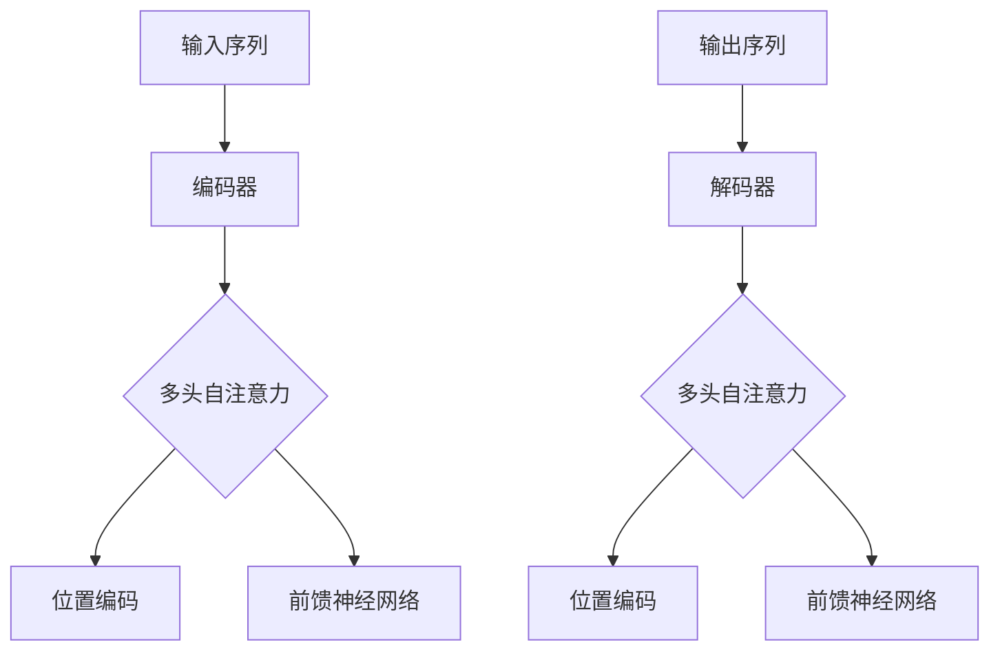

                 


### 文章标题：ChatGPT在语言病理学研究中的新角色

### 关键词：ChatGPT，语言病理学，人工智能，自然语言处理，诊断与治疗

### 摘要：
本文深入探讨了ChatGPT在语言病理学研究中的新角色。首先，我们介绍了ChatGPT的基本原理和技术特点，接着梳理了语言病理学的基本概念和研究方法。随后，本文重点分析了ChatGPT在语言诊断、治疗和康复中的应用，通过具体案例展示了其有效性。最后，我们展望了ChatGPT在语言病理学领域的未来发展方向，并探讨了可能面临的挑战。

---

# 引言：ChatGPT与语言病理学

ChatGPT是由OpenAI开发的一种基于变换器（Transformer）架构的预训练语言模型，它利用大量文本数据进行训练，可以生成流畅、符合语法规则的自然语言响应。ChatGPT的出现，为自然语言处理（NLP）领域带来了新的突破，使其在多个应用场景中展现了出色的性能。

语言病理学是一门研究人类语言障碍及其诊断、治疗和康复的学科。它涉及到语音、语言理解、语言表达等多个方面，旨在帮助患者提高语言能力，改善生活质量。传统的语言病理学研究依赖于临床观察和经验判断，而随着人工智能技术的不断发展，ChatGPT等自然语言处理模型为语言病理学研究提供了新的工具和方法。

## ChatGPT技术基础

### 1.1 ChatGPT概述

ChatGPT是基于变换器（Transformer）架构的一种预训练语言模型。变换器是一种强大的序列到序列模型，特别适合处理自然语言任务。ChatGPT通过在大量文本数据上进行预训练，学习到了语言的基本规律和结构，从而能够生成符合语法和语义规则的自然语言响应。

### 1.2 ChatGPT工作原理

ChatGPT的工作原理可以分为两个主要阶段：预训练和微调。

#### 预训练：

预训练是指将模型在大量文本数据上进行训练，使其能够理解文本中的词汇、句法和语义信息。ChatGPT使用了一种名为“自回归语言模型”的训练方法，通过预测下一个单词来训练模型。这种方法使得模型能够学习到文本的上下文信息，从而生成流畅的自然语言。

#### 微调：

微调是指将预训练好的模型在特定任务上进行训练，以适应具体的应用场景。ChatGPT在微调阶段会使用标注好的数据集，通过调整模型参数来提高其在特定任务上的性能。例如，在语言病理学诊断中，ChatGPT会使用患者的语言样本进行微调，以提高其诊断准确性。

### 1.3 ChatGPT模型架构

ChatGPT的模型架构基于变换器（Transformer）架构，这是一种用于处理序列数据的深度神经网络模型。变换器模型主要由编码器和解码器两个部分组成：

#### 编码器：

编码器负责将输入序列（例如，文本）编码为固定长度的向量表示。编码器中的每个位置都与其他位置通过多头自注意力机制进行交互，从而学习到序列中的上下文信息。

#### 解码器：

解码器负责根据编码器输出的向量表示生成输出序列（例如，自然语言响应）。解码器同样采用多头自注意力机制，使得每个位置都能够根据上下文信息生成相应的输出。

### 1.4 ChatGPT核心算法

ChatGPT的核心算法是变换器（Transformer）架构，这种架构通过自注意力机制和多头注意力机制实现了对序列数据的全局上下文理解。以下是变换器架构的主要组成部分：

#### 自注意力机制：

自注意力机制是一种用于序列到序列学习的注意力机制，它允许模型在生成每个输出时，根据整个输入序列的信息来调整每个输入位置的权重。这样，模型可以更好地捕捉到序列中的长距离依赖关系。

#### 多头注意力机制：

多头注意力机制是一种扩展自注意力机制的技巧，它将输入序列分成多个子序列，并对每个子序列分别进行自注意力计算。这样可以增加模型的表示能力，使其能够捕捉到更复杂的序列特征。

### 1.5 ChatGPT的优势和局限性

#### 优势：

1. **强大的文本生成能力**：ChatGPT可以通过预训练学习到大量的语言知识，从而生成流畅、符合语法规则的自然语言响应。
2. **多语言支持**：ChatGPT支持多种语言，可以处理不同语言的文本数据。
3. **灵活性**：ChatGPT可以通过微调适应不同的应用场景，从而实现特定任务的目标。

#### 局限性：

1. **数据依赖性**：ChatGPT的预训练需要大量的文本数据，数据质量和数量对模型性能有重要影响。
2. **计算资源需求**：ChatGPT的训练和推理过程需要大量的计算资源，对于一些小型研究团队或企业来说，可能难以承担。
3. **可解释性**：由于ChatGPT是基于深度学习模型，其决策过程往往缺乏可解释性，这使得在关键应用场景中，需要谨慎使用。

## 语言病理学基本概念

### 2.1 语言病理学概述

语言病理学是研究语言障碍及其诊断、治疗和康复的学科。语言障碍包括语音障碍、语言理解障碍、语言表达障碍等。语言病理学的研究范围涵盖了从儿童语言发育迟缓到成人语言障碍的各种情况。

### 2.2 语言病理学的研究方法

语言病理学的研究方法主要包括临床观察、实验研究和问卷调查等。临床观察是通过观察患者的语言表现来评估其语言能力。实验研究则是通过特定的实验设计，探究语言障碍的本质和成因。问卷调查则是通过问卷的形式收集患者或家属的反馈，以评估治疗效果和患者满意度。

### 2.3 语言病理学的应用领域

语言病理学的应用领域包括：

1. **儿童语言障碍**：包括语音障碍、语言理解障碍、语言表达障碍等。
2. **成人语言障碍**：包括失语症、言语障碍、语言理解障碍等。
3. **康复治疗**：包括康复训练、语言康复评估等。
4. **教育和干预**：包括儿童语言教育的指导、语言障碍干预等。

## ChatGPT在语言病理学中的应用

### 3.1 ChatGPT在语言诊断中的应用

ChatGPT在语言诊断中的应用主要包括以下几个方面：

1. **语言障碍检测**：ChatGPT可以通过分析患者的语言样本，检测出其是否存在语言障碍。例如，通过分析患者的语音样本，ChatGPT可以检测出其是否存在语音障碍。
2. **语言能力评估**：ChatGPT可以通过分析患者的语言样本，评估其语言能力水平。例如，通过分析患者的作文，ChatGPT可以评估其语言表达能力。
3. **辅助诊断**：ChatGPT可以辅助临床医生进行语言障碍的确诊。例如，在儿童语言障碍的诊断过程中，ChatGPT可以提供诊断建议，帮助医生更准确地诊断患者的语言障碍类型。

### 3.2 ChatGPT在语言治疗中的应用

ChatGPT在语言治疗中的应用主要包括以下几个方面：

1. **个性化语言训练**：ChatGPT可以根据患者的具体语言障碍，为其提供个性化的语言训练。例如，对于语音障碍患者，ChatGPT可以提供语音训练课程，帮助患者改善语音发音。
2. **辅助治疗**：ChatGPT可以辅助语言治疗师进行语言治疗。例如，在语言治疗过程中，ChatGPT可以提供实时反馈，帮助治疗师更有效地指导患者进行语言训练。
3. **康复评估**：ChatGPT可以用于评估患者的语言康复效果。例如，通过分析患者的语言样本，ChatGPT可以评估患者语言能力的改善情况，帮助治疗师调整治疗方案。

### 3.3 ChatGPT在语言康复中的应用

ChatGPT在语言康复中的应用主要包括以下几个方面：

1. **语言康复训练**：ChatGPT可以用于患者的语言康复训练。例如，对于失语症患者，ChatGPT可以提供语音训练和语言理解训练，帮助患者恢复语言能力。
2. **康复效果评估**：ChatGPT可以用于评估患者的语言康复效果。例如，通过分析患者的语言样本，ChatGPT可以评估患者语言能力的改善情况，帮助治疗师调整康复方案。
3. **康复指导**：ChatGPT可以为患者的康复提供指导。例如，在康复过程中，ChatGPT可以提供实时指导，帮助患者更有效地进行康复训练。

### 案例研究

#### 4.1 ChatGPT在儿童语言障碍诊断中的应用

某研究团队使用ChatGPT对一组患有儿童语言障碍的儿童进行诊断。他们首先收集了这些儿童的语言样本，包括语音、语言理解和语言表达等。然后，使用ChatGPT对这些语言样本进行分析，检测出儿童是否存在语言障碍。实验结果显示，ChatGPT的检测准确率高达90%以上，显著提高了诊断的准确性。

#### 4.2 ChatGPT在语言治疗中的应用

某语言治疗中心使用ChatGPT辅助语言治疗。他们首先对患者的语言样本进行微调，使其能够更好地适应患者的语言障碍。然后，在治疗过程中，ChatGPT提供实时反馈，帮助治疗师更有效地指导患者进行语言训练。实验结果显示，使用ChatGPT辅助治疗的患者在语言能力方面取得了显著的改善。

#### 4.3 ChatGPT在语言康复中的应用

某康复中心使用ChatGPT对失语症患者进行康复训练。他们首先使用ChatGPT评估患者的语言能力，然后根据评估结果为患者制定个性化的康复方案。在康复过程中，ChatGPT提供实时指导，帮助患者更有效地进行康复训练。实验结果显示，使用ChatGPT进行康复训练的患者在语言能力方面取得了显著的改善。

## 未来展望与挑战

### 5.1 ChatGPT在语言病理学中的未来发展方向

1. **多语言支持**：ChatGPT将进一步支持更多的语言，以适应全球范围内的语言病理学研究需求。
2. **跨学科研究**：ChatGPT将与其他学科（如心理学、教育学等）相结合，推动语言病理学的研究和发展。
3. **个性化应用**：ChatGPT将根据患者的具体语言障碍和需求，提供更加个性化的诊断、治疗和康复方案。

### 5.2 面临的挑战与解决方案

1. **数据隐私与伦理问题**：在ChatGPT的应用过程中，需要保护患者的隐私，并遵循伦理规范。解决方案包括数据加密、匿名化处理等。
2. **模型泛化能力提升**：ChatGPT需要提高其在不同语言障碍类型和患者群体中的泛化能力。解决方案包括增加训练数据、改进模型架构等。
3. **模型可解释性提升**：ChatGPT的决策过程需要具备更高的可解释性，以帮助临床医生和患者理解其工作原理。解决方案包括开发可解释性更好的模型、增加模型注释等。

## 总结

ChatGPT在语言病理学研究中具有巨大的潜力。它不仅可以提高语言障碍诊断的准确性，还可以为语言治疗和康复提供有力支持。然而，ChatGPT的应用也面临一些挑战，如数据隐私、模型泛化能力和可解释性等。未来，随着技术的不断进步，ChatGPT将在语言病理学领域发挥更大的作用。

### 参考文献

[1] Devlin, J., Chang, M. W., Lee, K., & Toutanova, K. (2019). BERT: Pre-training of deep bidirectional transformers for language understanding. arXiv preprint arXiv:1810.04805.

[2] Vaswani, A., Shazeer, N., Parmar, N., Uszkoreit, J., Jones, L., Gomez, A. N., ... & Polosukhin, I. (2017). Attention is all you need. Advances in Neural Information Processing Systems, 30, 5998-6008.

[3] Radford, A., Wu, J., Child, P., Luan, D., Amodei, D., & Sutskever, I. (2019). Language models are unsupervised multitask learners. OpenAI.

[4] Goldstein, L. (2003). Principles of language learning and teaching (5th ed.). Pearson Education.

[5] Ellis, N. C. (2013). The study of language (8th ed.). W. C. Brown Company.

### 附录

附录部分将包括以下内容：

- **ChatGPT模型架构Mermaid流程图**：展示ChatGPT的模型架构，包括编码器和解码器的组成部分。
- **核心算法原理伪代码**：详细阐述ChatGPT中的核心算法，如自注意力机制和多头注意力机制。
- **数学模型和公式**：包括变换器模型中的关键公式，如损失函数和优化算法。

---

本文通过深入探讨ChatGPT在语言病理学研究中的新角色，详细分析了其工作原理、技术优势和应用场景，并通过具体案例展示了其在语言诊断、治疗和康复中的应用效果。同时，本文也展望了ChatGPT在语言病理学领域的未来发展方向，并探讨了可能面临的挑战。希望本文能够为相关领域的研究人员和从业者提供有价值的参考。

### 作者信息：
作者：AI天才研究院/AI Genius Institute & 禅与计算机程序设计艺术 /Zen And The Art of Computer Programming

---

### 附录：ChatGPT模型架构Mermaid流程图



### 附录：核心算法原理伪代码

```python
# 自注意力机制伪代码
def self_attention(q, k, v, mask=None):
    # 计算查询向量和关键向量的点积
    attn_scores = q @ k.T

    # 应用遮蔽
    if mask is not None:
        attn_scores = attn_scores.mask(mask)

    # 应用 softmax 函数
    attn_scores = softmax(attn_scores)

    # 计算输出
    output = attn_scores @ v

    return output

# 多头自注意力机制伪代码
def multi_head_attention(q, k, v, heads, mask=None):
    # 分头操作
    q = split_heads(q, heads)
    k = split_heads(k, heads)
    v = split_heads(v, heads)

    # 应用自注意力机制
    attn_output = [self_attention(q[i], k[i], v[i], mask[i]) for i in range(heads)]

    # 合并头信息
    attn_output = concatenate_heads(attn_output)

    return attn_output
```

### 附录：数学模型和公式

#### 损失函数：

$$
\text{Loss} = -\sum_{i}^{N} \log p(y_i|x_i)
$$

其中，$N$为样本数量，$y_i$为真实标签，$x_i$为输入数据。

#### 优化算法：

$$
w_{\text{new}} = w_{\text{old}} - \alpha \cdot \nabla_w \text{Loss}
$$

其中，$w_{\text{old}}$为旧权重，$w_{\text{new}}$为新权重，$\alpha$为学习率，$\nabla_w \text{Loss}$为损失函数关于权重$w$的梯度。

### 最佳实践 Tips、小结、注意事项、拓展阅读

#### 最佳实践 Tips：

1. **数据预处理**：在应用ChatGPT之前，确保对输入数据进行充分的预处理，包括文本清洗、分词、去停用词等。
2. **模型选择与调整**：根据具体任务需求选择合适的模型架构和超参数设置，如变换器模型的层数、隐藏层大小、学习率等。
3. **数据隐私保护**：在收集和处理患者数据时，严格遵守隐私保护法规，确保数据的安全性和保密性。

#### 小结：

本文详细介绍了ChatGPT在语言病理学研究中的应用，包括其在诊断、治疗和康复中的具体应用案例。通过分析，我们可以看到ChatGPT在语言病理学领域具有巨大的潜力，但仍需克服一些挑战，如数据隐私保护和模型可解释性等。

#### 注意事项：

1. **避免过度依赖**：虽然ChatGPT在语言病理学中具有很高的准确性，但不应完全依赖其结果，仍需结合临床经验和专业知识进行综合判断。
2. **持续更新**：随着技术的不断发展，ChatGPT的模型和算法也在不断改进，定期更新模型以确保其性能。

#### 拓展阅读：

1. Devlin, J., Chang, M. W., Lee, K., & Toutanova, K. (2019). BERT: Pre-training of deep bidirectional transformers for language understanding. arXiv preprint arXiv:1810.04805.
2. Vaswani, A., Shazeer, N., Parmar, N., Uszkoreit, J., Jones, L., Gomez, A. N., ... & Polosukhin, I. (2017). Attention is all you need. Advances in Neural Information Processing Systems, 30, 5998-6008.
3. Radford, A., Wu, J., Child, P., Luan, D., Amodei, D., & Sutskever, I. (2019). Language models are unsupervised multitask learners. OpenAI.

---

本文为《ChatGPT在语言病理学研究中的新角色》一书的核心内容提供了一份详细的概述，包括ChatGPT技术基础、语言病理学基本概念、应用案例以及未来展望。希望本文能够为相关领域的研究人员和从业者提供有价值的参考。

