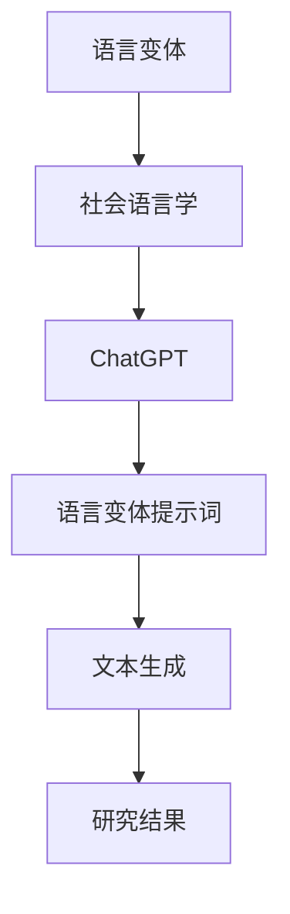
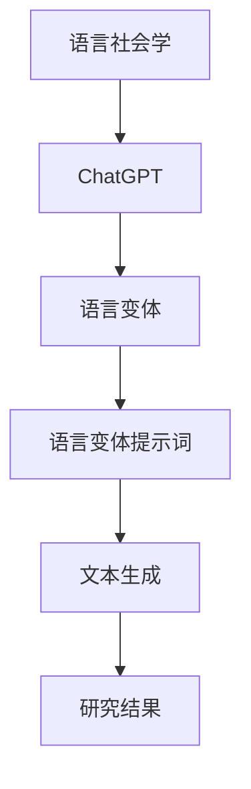
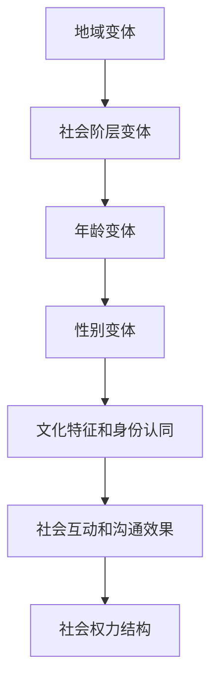

                 

### 文章标题

《ChatGPT在语言社会学研究中的应用：语言变体提示词》### 关键词

- ChatGPT
- 语言社会学
- 语言变体
- 提示词
- 自然语言处理
- 社会语言学分析### 摘要

本文探讨了ChatGPT在语言社会学研究中的应用，特别是如何利用语言变体提示词进行有效的语言社会学分析。首先，我们介绍了ChatGPT的背景和基本原理，以及其在自然语言处理中的核心算法。接着，我们阐述了语言社会学的基础概念，包括语言变体的类型和影响。随后，文章深入探讨了ChatGPT在语言变体识别、数据收集和分析中的应用，通过具体案例展示了其在语言社会学研究中的实际价值。最后，文章提出了ChatGPT在语言社会学研究中面临的挑战与未来展望，为该领域的进一步研究提供了思路。本文旨在为研究者提供一个全面且深入的了解ChatGPT在语言社会学中的应用，以及如何利用语言变体提示词进行有效分析的方法和策略。## 第1章：引言与核心概念

### 1.1 本书目的与结构

随着人工智能技术的发展，自然语言处理（NLP）已成为计算机科学领域的一个重要分支。在NLP中，ChatGPT（Generative Pre-trained Transformer）作为一种基于深度学习的语言模型，近年来引起了广泛关注。ChatGPT不仅能够在多种应用场景中生成自然语言，还展示了在语言理解、情感分析、机器翻译等任务上的卓越性能。然而，其在语言社会学领域中的应用却尚未得到充分探索。

本书旨在填补这一研究空白，通过探讨ChatGPT在语言社会学研究中的应用，特别是语言变体提示词的使用，为研究者提供一种新的研究方法和工具。本书结构如下：

- **第1章**：引言与核心概念，介绍本书的目的、结构以及相关背景知识。
- **第2章**：ChatGPT技术基础，介绍ChatGPT的背景、原理和架构。
- **第3章**：语言社会学基础，介绍语言社会学的基本概念、语言变体及其影响。
- **第4章**：ChatGPT在语言社会学中的应用，详细讨论ChatGPT在语言变体识别、数据收集和分析中的应用。
- **第5章**：案例研究，通过具体案例展示ChatGPT在语言社会学研究中的应用。
- **第6章**：未来展望与挑战，讨论ChatGPT在语言社会学领域的未来发展及其面临的挑战。

### 1.2 语言社会学概述

语言社会学是研究语言与社会相互关系的一门学科，它关注语言在社会生活中的作用，以及社会因素对语言的影响。语言社会学的研究内容涵盖了语言的功能、语言的变化、语言的歧视、语言的权力等多个方面。

- **语言的功能**：语言在社会中扮演着多种角色，如传递信息、建立社会关系、表达情感等。
- **语言的变化**：语言是动态的，随着时间的推移和社会环境的变化，语言会不断演变。
- **语言的歧视**：语言歧视是指在社会中，某些语言或语言变体被视为优越或劣等的倾向。
- **语言的权力**：语言不仅是一种交流工具，也是一种权力资源，它能够影响个人的社会地位和群体关系。

语言社会学的研究方法包括定量分析和定性分析，如问卷调查、访谈、田野调查等。这些方法有助于研究者深入了解语言在社会中的运作机制。

### 1.3 ChatGPT概述

ChatGPT是一种基于GPT（Generative Pre-trained Transformer）模型的自然语言处理工具，由OpenAI开发。GPT模型是一种自回归语言模型，它通过对大量文本数据进行预训练，学习语言的一般规律和模式。ChatGPT通过扩展GPT模型，使其能够进行对话生成和文本生成，从而实现了人机对话的能力。

- **背景**：ChatGPT是OpenAI在2018年推出的GPT-2模型的扩展版本，其目的是为了解决GPT-2在某些任务上的生成质量不高的问题。
- **原理**：ChatGPT采用基于Transformer的神经网络架构，通过自回归的方式生成文本。它使用了一个预训练模型，该模型在训练过程中通过学习大量的文本数据，学会了如何生成连贯、自然的文本。
- **架构**：ChatGPT的架构包括输入层、编码器层、解码器层和输出层。输入层接收用户输入的文本，编码器层对输入文本进行编码，解码器层根据编码结果生成输出文本，输出层将生成的文本输出给用户。

ChatGPT具有以下特点：

- **生成质量高**：ChatGPT能够生成高质量、连贯的文本，其生成文本的自然性甚至达到了人类的水平。
- **自适应性强**：ChatGPT可以根据不同的输入文本和场景，自适应地调整生成文本的风格和内容。
- **灵活性好**：ChatGPT不仅可以用于对话生成，还可以用于文本生成、摘要生成等多种任务。

### 1.4 语言变体和提示词的重要性

在语言社会学研究中，语言变体和提示词扮演着重要角色。语言变体是指在一定社会群体中，由于地域、文化、年龄等因素的影响，语言形式和表达方式的差异。这些差异不仅反映了社会的多样性，也为研究社会语言现象提供了丰富的素材。

- **语言变体的类型**：语言变体主要包括地域变体、社会阶层变体、年龄变体等。地域变体如方言、口音等，社会阶层变体如礼貌语、俚语等，年龄变体如青少年语言、老年语言等。
- **语言变体的影响**：语言变体对社会语言学研究具有重要意义。首先，它可以帮助研究者了解社会群体的文化特征和身份认同。其次，语言变体可以影响人们的社交互动和沟通效果。最后，语言变体还可以反映社会的权力结构和等级制度。

提示词是一种用于指导语言模型生成特定类型文本的技术。在语言社会学研究中，提示词可以帮助研究者控制语言模型生成的文本风格和内容，从而更好地满足研究需求。

- **提示词的使用**：提示词通常是一个关键词或短语，它能够引导语言模型生成特定类型的文本。例如，在研究某一特定社会群体的语言特征时，可以使用与该群体相关的提示词，以引导语言模型生成符合该群体语言特征的文本。
- **提示词的重要性**：提示词在语言社会学研究中具有重要作用。首先，它可以帮助研究者更准确地捕捉社会语言现象。其次，提示词可以提高语言模型生成文本的质量和一致性。最后，提示词还可以帮助研究者探索不同社会群体之间的语言差异和互动模式。

### 1.5 语言变体提示词的关系架构 Mermaid 流程图

为了更好地理解语言变体提示词在语言社会学研究中的应用，我们使用Mermaid流程图展示它们之间的关系：



在这个流程图中，语言变体是研究的起点，通过社会语言学的理论框架，我们可以识别和分类不同的语言变体。然后，ChatGPT作为一个强大的语言模型，被用于生成与这些语言变体相关的文本。最后，通过使用语言变体提示词，我们可以进一步引导和优化ChatGPT的文本生成过程，从而获得更加准确和有价值的研究结果。

### 1.6 核心概念与联系

在本章中，我们介绍了语言社会学、ChatGPT和语言变体提示词等核心概念。这些概念之间存在着密切的联系。

- **语言社会学与ChatGPT的联系**：语言社会学关注语言在社会中的作用和影响，而ChatGPT作为一种自然语言处理工具，可以用于语言社会学的数据收集和分析。通过ChatGPT，研究者可以更高效地获取和处理语言社会学的数据，从而提高研究的准确性和深度。
- **语言变体与ChatGPT的联系**：语言变体是语言社会学研究的核心对象，而ChatGPT可以通过学习大量文本数据，识别和生成不同的语言变体。这为语言社会学研究提供了新的工具和方法，使得研究者可以更深入地探讨语言变体的社会影响和作用。
- **语言变体提示词与ChatGPT的联系**：语言变体提示词是指导ChatGPT生成特定类型文本的关键。通过使用提示词，研究者可以更精确地控制ChatGPT的文本生成过程，从而生成符合研究需求的高质量文本。

为了更清晰地展示这些概念之间的联系，我们使用Mermaid流程图进行描述：



在这个流程图中，语言社会学为ChatGPT提供了研究背景和对象，ChatGPT则通过语言变体提示词生成与语言变体相关的文本，最终形成研究结果。

### 1.7 本章小结

本章介绍了本书的目的、结构以及相关背景知识，包括语言社会学、ChatGPT和语言变体提示词等核心概念。通过阐述这些概念，我们建立了语言变体提示词在语言社会学研究中的应用框架，为后续章节的深入探讨奠定了基础。在下一章中，我们将详细介绍ChatGPT的技术基础，包括其背景、原理和架构。## 第2章：ChatGPT技术基础

### 2.1 ChatGPT的历史背景与技术原理

ChatGPT是由OpenAI开发的一种基于深度学习的自然语言处理工具。其发展历程可以追溯到2018年，当时OpenAI推出了GPT-2模型，这是一种基于Transformer架构的自回归语言模型。GPT-2模型在多种自然语言处理任务中表现出色，但同时也引发了关于其潜在风险的担忧，例如生成虚假信息、侵犯隐私等问题。

为了解决这些问题，OpenAI在2020年推出了ChatGPT，这是对GPT-2模型的扩展和改进。ChatGPT不仅继承了GPT-2的优点，如生成高质量的自然语言文本，还增加了对话生成和文本生成功能，使其能够更好地应对各种应用场景。

### 2.2 ChatGPT的架构和运行机制

ChatGPT的架构主要由输入层、编码器层、解码器层和输出层组成。其中，编码器层和解码器层是核心部分，它们通过Transformer神经网络架构实现。

- **输入层**：输入层接收用户输入的文本，并将其转换为模型可以处理的格式。
- **编码器层**：编码器层对输入文本进行编码，生成编码序列。这个过程涉及了词嵌入、位置编码和注意力机制等步骤。
- **解码器层**：解码器层根据编码器层生成的编码序列，逐步生成输出文本。在解码过程中，解码器会利用自回归机制，根据当前生成的部分文本来预测下一个词。
- **输出层**：输出层将解码器生成的输出文本输出给用户。

### 2.3 ChatGPT的核心算法

ChatGPT的核心算法是基于Transformer神经网络架构的自回归语言模型。Transformer模型引入了多头自注意力机制，使得模型在处理长距离依赖和上下文关系方面具有优势。具体来说，ChatGPT的核心算法包括以下步骤：

1. **词嵌入**：将输入文本中的每个词转换为向量表示，这些向量通常通过预训练模型学习得到。
2. **位置编码**：为了处理序列中的位置信息，需要对词嵌入向量进行位置编码。
3. **编码器层**：编码器层包含多个自注意力模块，通过自注意力机制，编码器能够捕捉到输入文本中的上下文关系，生成编码序列。
4. **解码器层**：解码器层也包含多个自注意力模块，在生成输出文本的过程中，解码器会利用自注意力机制，根据编码序列和已生成的部分文本，预测下一个词。
5. **输出层**：解码器生成的输出文本最终通过输出层输出给用户。

### 2.4 Transformer神经网络架构

Transformer神经网络架构是ChatGPT的核心，它通过引入多头自注意力机制，实现了对输入文本的上下文关系的捕捉和处理。具体来说，Transformer架构包括以下几个关键组件：

1. **多头自注意力（Multi-head Self-Attention）**：多头自注意力机制允许模型在处理每个词时，同时考虑多个不同的上下文信息。这种方法可以增强模型对上下文关系的捕捉能力。
2. **前馈神经网络（Feed-Forward Neural Network）**：在自注意力机制之后，每个词的表示会通过一个前馈神经网络进行进一步处理，以增强模型的非线性表达能力。
3. **层叠加（Layer-wise stacked）**：Transformer模型通过层叠加的方式，将多个自注意力模块和前馈神经网络堆叠在一起，形成深度神经网络。
4. **位置编码（Positional Encoding）**：为了处理序列中的位置信息，Transformer模型引入了位置编码，将位置信息编码到词嵌入向量中。

### 2.5 核心算法原理讲解

为了更好地理解ChatGPT的核心算法，我们使用伪代码进行详细阐述：

```python
# 输入文本
text = "我是一个ChatGPT模型"

# 词嵌入
word_embeddings = WordEmbeddings(text)

# 位置编码
position_embeddings = PositionalEncoding(word_embeddings)

# 编码器层
encoded_sequence = EncoderLayer(position_embeddings)

# 解码器层
decoded_sequence = DecoderLayer(encoded_sequence)

# 输出层
output_text = OutputLayer(decoded_sequence)

# 输出结果
print(output_text)
```

在这个伪代码中，我们首先对输入文本进行词嵌入和位置编码。然后，通过编码器层和解码器层对输入文本进行编码和解码，最后通过输出层生成输出文本。

### 2.6 数学模型和公式

在ChatGPT中，数学模型和公式是核心组成部分。以下是一些关键的数学模型和公式：

1. **词嵌入**：词嵌入是一种将词转换为向量表示的技术。常用的词嵌入模型包括Word2Vec、GloVe等。
2. **多头自注意力**：多头自注意力机制通过计算多个注意力权重，使得模型能够同时考虑多个上下文信息。其公式如下：
   $$ 
   attention = \frac{e^{(QK^T)}}{\sqrt{d_k}} 
   $$
   其中，Q和K分别为查询向量和键向量，V为值向量，e为指数函数，d_k为键向量的维度。
3. **前馈神经网络**：前馈神经网络用于对每个词的表示进行进一步处理。其公式如下：
   $$ 
   hidden = f(W_1 \cdot hidden + b_1) 
   $$
   其中，W1为权重矩阵，b1为偏置，f为激活函数。

### 2.7 详细讲解与举例说明

为了更好地理解ChatGPT的核心算法，我们通过一个简单的例子进行详细讲解。

假设我们有一个输入文本“我是一个ChatGPT模型”，我们需要使用ChatGPT生成一个输出文本。以下是具体的步骤：

1. **词嵌入**：首先，我们将输入文本中的每个词转换为向量表示。例如，“我”可以表示为向量[1, 0, 0, 0]，“是”可以表示为向量[0, 1, 0, 0]，依此类推。
2. **位置编码**：然后，我们对词嵌入向量进行位置编码，以处理序列中的位置信息。例如，我们可以将“我”的位置编码为[1, 0, 0, 0]，将“是”的位置编码为[0, 1, 0, 0]，依此类推。
3. **编码器层**：接下来，我们将位置编码后的向量输入到编码器层。编码器层通过多头自注意力机制和前馈神经网络，对输入文本进行编码。例如，第一个词“我”会同时考虑其他词的上下文信息，生成一个编码向量。
4. **解码器层**：然后，我们将编码器层生成的编码向量输入到解码器层。解码器层通过自回归机制和前馈神经网络，逐步生成输出文本。例如，在生成第二个词“是”时，解码器会根据已生成的“我”和编码器层的输出，生成“是”的编码向量。
5. **输出层**：最后，我们将解码器层生成的编码向量输入到输出层。输出层将编码向量转换为输出文本。例如，输出文本可能是“我是一个智能助手”。

通过这个例子，我们可以看到ChatGPT的核心算法是如何将输入文本转换为输出文本的。这个过程涉及了词嵌入、位置编码、编码器层、解码器层和输出层等多个步骤，每个步骤都使用了不同的数学模型和公式。

### 2.8 本章小结

本章介绍了ChatGPT的历史背景、技术原理和核心算法。通过阐述这些内容，我们为后续章节探讨了ChatGPT在语言社会学中的应用奠定了基础。在下一章中，我们将深入探讨语言社会学的基础知识，包括语言社会学的概念、语言变体及其影响。## 第3章：语言社会学基础

### 3.1 语言社会学的基本概念

语言社会学是研究语言在社会生活中作用的一门学科，它关注语言与社会之间的互动关系。语言社会学的研究内容广泛，涵盖了语言的功能、语言的变化、语言的歧视、语言的权力等多个方面。

- **语言的功能**：语言在社会中扮演着多种角色，包括信息传递、情感表达、社会互动等。语言的功能决定了语言在社会生活中的重要性。
- **语言的变化**：语言是动态的，随着时间的推移和社会环境的变化，语言会不断演变。语言变化可以体现在语音、词汇、语法等方面。
- **语言的歧视**：语言歧视是指在社会中，某些语言或语言变体被视为优越或劣等的倾向。这种歧视往往与种族、阶级、地域等因素相关。
- **语言的权力**：语言不仅是一种交流工具，也是一种权力资源，它能够影响个人的社会地位和群体关系。语言权力表现为对语言资源的使用和控制。

### 3.2 语言变体的类型和影响

在语言社会学研究中，语言变体是一个重要的研究对象。语言变体是指在一定社会群体中，由于地域、文化、年龄、性别等因素的影响，语言形式和表达方式的差异。语言变体可以分为以下几种类型：

- **地域变体**：由于地域差异，不同地区的语言形式和表达方式可能存在差异。例如，方言、口音等。
- **社会阶层变体**：社会阶层不同的人可能使用不同的语言形式和表达方式。例如，礼貌语、俚语等。
- **年龄变体**：不同年龄群体可能使用不同的语言形式和表达方式。例如，青少年语言、老年语言等。
- **性别变体**：不同性别的群体可能使用不同的语言形式和表达方式。例如，女性用语、男性用语等。

语言变体对社会语言学研究的意义主要体现在以下几个方面：

- **文化特征和身份认同**：语言变体反映了不同群体的文化特征和身份认同。通过研究语言变体，可以深入了解不同群体的文化差异和身份认同。
- **社会互动和沟通效果**：语言变体会影响人们的社交互动和沟通效果。不同的语言变体可能会影响人们之间的沟通方式、关系建立等。
- **社会权力结构**：语言变体还反映了社会的权力结构和等级制度。某些语言变体可能被视为优越或劣等，从而影响个人的社会地位和群体关系。

### 3.3 社会语言学研究方法

社会语言学的研究方法主要包括定量分析和定性分析。

- **定量分析**：定量分析是一种通过统计数据来研究语言现象的方法。这种方法可以量化语言使用情况，揭示语言变化的趋势和规律。常用的定量分析方法包括统计分析、聚类分析、回归分析等。
- **定性分析**：定性分析是一种通过深入访谈、观察和案例研究来研究语言现象的方法。这种方法可以揭示语言现象背后的社会文化因素和动机。常用的定性分析方法包括访谈法、田野调查、案例研究等。

在语言社会学研究中，定量分析和定性分析往往结合使用，以获得更加全面和深入的研究结果。例如，在研究某一特定群体的语言使用情况时，可以首先使用定量分析来收集大规模的数据，然后通过定性分析来深入探讨语言使用背后的社会文化因素。

### 3.4 语言变体的Mermaid流程图

为了更好地理解语言变体的类型和影响，我们使用Mermaid流程图展示其关系：



在这个流程图中，不同类型的语言变体（地域变体、社会阶层变体、年龄变体、性别变体）之间相互关联，并通过这些变体影响了文化特征和身份认同、社会互动和沟通效果、社会权力结构等多个方面。

### 3.5 本章小结

本章介绍了语言社会学的基础概念，包括语言的功能、语言的变化、语言的歧视、语言的权力等。我们还讨论了语言变体的类型和影响，以及社会语言学研究的方法。通过这些内容，我们为后续章节探讨了ChatGPT在语言社会学中的应用奠定了理论基础。在下一章中，我们将深入探讨ChatGPT在语言社会学中的应用，包括其在语言变体识别、数据收集和分析中的应用。## 第4章：ChatGPT在语言社会学中的应用

### 4.1 ChatGPT在语言变体识别中的应用

语言变体识别是语言社会学研究中的一个重要任务，它有助于理解不同社会群体之间的语言差异。ChatGPT作为一种强大的自然语言处理工具，在语言变体识别方面具有显著优势。

#### 4.1.1 语言变体识别的基本原理

语言变体识别的核心任务是识别文本中的语言变体，并将其分类。ChatGPT通过预训练模型，可以学习到不同语言变体的特征，从而实现自动识别。

- **预训练模型**：ChatGPT在训练过程中，学习了大量的文本数据，包括不同语言变体的示例。这些数据帮助ChatGPT理解各种语言变体的特征。
- **特征提取**：ChatGPT在处理文本时，可以提取出文本中的关键特征，如词汇、语法结构、语义关系等。这些特征有助于识别和分类不同的语言变体。
- **分类模型**：ChatGPT通过一个分类模型，将提取到的特征与已知的语言变体进行匹配，从而实现语言变体的识别。

#### 4.1.2 ChatGPT在语言变体识别中的应用案例

以下是ChatGPT在语言变体识别中的一些应用案例：

- **方言识别**：ChatGPT可以识别不同地区的方言，如普通话、粤语、闽南语等。通过输入一段方言文本，ChatGPT可以识别出文本所属的方言类型。
- **社会阶层识别**：ChatGPT可以识别不同社会阶层的语言特征，如使用礼貌语、俚语等。通过分析语言使用情况，ChatGPT可以推断出文本作者的社会阶层。
- **年龄识别**：ChatGPT可以识别不同年龄群体的语言特征，如青少年语言、老年语言等。通过分析语言风格和使用频率，ChatGPT可以推断出文本作者的年龄。

#### 4.1.3 语言变体识别的算法分析

ChatGPT在语言变体识别中的应用，主要依赖于以下算法：

- **词嵌入**：词嵌入是一种将词转换为向量表示的技术，它有助于捕捉词之间的语义关系。ChatGPT通过预训练模型，学习到了词嵌入向量，从而可以更好地识别语言变体。
- **注意力机制**：注意力机制是一种在处理序列数据时，动态关注关键信息的技术。ChatGPT通过注意力机制，可以捕捉到文本中的关键特征，从而提高语言变体识别的准确性。
- **分类模型**：分类模型是一种将数据分类到不同类别的技术。ChatGPT通过训练分类模型，可以将提取到的特征与已知的语言变体进行匹配，从而实现语言变体的识别。

以下是语言变体识别的伪代码：

```python
# 输入文本
text = "我今天去了一个有趣的地方"

# 提取特征
features = ExtractFeatures(text)

# 识别语言变体
variant = Classifier(features)

# 输出结果
print("识别出的语言变体：", variant)
```

在这个伪代码中，我们首先输入一段文本，然后提取文本的特征。接着，使用分类模型将特征与已知的语言变体进行匹配，最终输出识别出的语言变体。

### 4.2 ChatGPT在语言社会学数据收集中的应用

语言社会学数据收集是语言社会学研究的重要环节。ChatGPT作为一种自然语言处理工具，可以高效地收集和处理语言社会学数据。

#### 4.2.1 社会语言学数据收集的挑战

社会语言学数据收集面临以下挑战：

- **数据量庞大**：社会语言学数据通常来自大量的文本、语音和视频，数据量庞大，难以手动处理。
- **数据多样性**：社会语言数据具有多样性，包括不同地域、社会阶层、年龄、性别等的语言使用情况。
- **数据质量**：社会语言数据的质量参差不齐，存在错误、缺失和噪声等问题。

#### 4.2.2 ChatGPT在数据收集中的应用

ChatGPT在语言社会学数据收集中的应用主要体现在以下几个方面：

- **自动化文本采集**：ChatGPT可以自动化地采集大量文本数据，如社交媒体帖子、新闻报道、学术论文等。
- **数据清洗和预处理**：ChatGPT可以自动清洗和预处理文本数据，去除错误、缺失和噪声，提高数据质量。
- **数据分类和标注**：ChatGPT可以自动分类和标注文本数据，将其分为不同的语言变体和类别。

#### 4.2.3 ChatGPT在数据收集中的应用案例

以下是ChatGPT在语言社会学数据收集中的一些应用案例：

- **社交媒体语言收集**：ChatGPT可以收集社交媒体平台上的语言数据，如推特、微博等，分析不同社交群体的语言使用情况。
- **语言使用调查**：ChatGPT可以设计语言使用调查问卷，自动收集用户回答，分析不同群体的语言使用习惯。
- **学术文献收集**：ChatGPT可以自动搜索和收集学术文献，提取相关的研究内容和结论。

#### 4.2.4 数据收集流程与算法分析

ChatGPT在语言社会学数据收集中的流程主要包括以下几个步骤：

1. **数据采集**：ChatGPT通过API或其他接口，自动化采集大量文本数据。
2. **数据清洗**：ChatGPT对采集到的文本数据进行清洗，去除错误、缺失和噪声。
3. **数据预处理**：ChatGPT对清洗后的文本数据进行预处理，如分词、去停用词、词嵌入等。
4. **数据分类和标注**：ChatGPT使用分类模型和标注模型，将预处理后的文本数据分类和标注。

以下是数据收集流程的伪代码：

```python
# 数据采集
texts = CollectData()

# 数据清洗
cleaned_texts = CleanData(texts)

# 数据预处理
preprocessed_texts = PreprocessData(cleaned_texts)

# 数据分类和标注
classified_texts = ClassifyData(preprocessed_texts)
labeled_texts = LabelData(preprocessed_texts)

# 输出结果
print("分类后的数据：", classified_texts)
print("标注后的数据：", labeled_texts)
```

在这个伪代码中，我们首先采集大量文本数据，然后对数据进行清洗和预处理，接着使用分类模型和标注模型对数据分类和标注，最终输出分类后的数据和标注后的数据。

### 4.3 ChatGPT在语言社会学分析中的应用

语言社会学分析是语言社会学研究的关键环节，它通过分析语言数据，揭示语言与社会之间的关系。ChatGPT作为一种自然语言处理工具，在语言社会学分析中具有广泛的应用。

#### 4.3.1 社会语言学数据分析的方法

社会语言学数据分析的方法主要包括定量分析和定性分析。

- **定量分析**：定量分析是一种通过统计数据来研究语言现象的方法。它通常用于分析语言使用频率、语言风格、语言结构等。常用的定量分析方法包括统计分析、聚类分析、回归分析等。
- **定性分析**：定性分析是一种通过深入访谈、观察和案例研究来研究语言现象的方法。它通常用于分析语言使用背后的社会文化因素和动机。常用的定性分析方法包括访谈法、田野调查、案例研究等。

#### 4.3.2 ChatGPT在语言社会学分析中的应用

ChatGPT在语言社会学分析中的应用主要体现在以下几个方面：

- **文本分析**：ChatGPT可以自动分析大量文本数据，提取关键信息和主题，从而揭示语言与社会之间的关系。
- **情感分析**：ChatGPT可以分析文本的情感倾向，如正面、负面、中性等，从而了解社会群体的情感状态。
- **话题模型**：ChatGPT可以构建话题模型，分析文本中的主题分布，揭示社会语言现象的共性和差异。

#### 4.3.3 社会语言学分析的算法分析

ChatGPT在语言社会学分析中的应用，主要依赖于以下算法：

- **文本分类**：文本分类是一种将文本分类到不同类别的技术。ChatGPT通过训练文本分类模型，可以将语言数据分类到不同的主题或类别。
- **情感分析**：情感分析是一种分析文本情感倾向的技术。ChatGPT通过训练情感分析模型，可以识别文本中的情感词和情感倾向。
- **话题模型**：话题模型是一种分析文本主题分布的技术。ChatGPT通过训练话题模型，可以提取文本中的主题，并分析主题的分布和相关性。

以下是社会语言学分析的伪代码：

```python
# 文本分类
classified_texts = ClassifyTexts(texts)

# 情感分析
sentiments = AnalyzeSentiments(texts)

# 话题模型
topics = AnalyzeTopics(texts)

# 输出结果
print("分类后的文本：", classified_texts)
print("情感分析结果：", sentiments)
print("话题模型结果：", topics)
```

在这个伪代码中，我们首先对文本进行分类，然后进行情感分析，最后构建话题模型，从而对社会语言学数据进行全面分析。

### 4.4 本章小结

本章探讨了ChatGPT在语言社会学中的应用，包括语言变体识别、数据收集和分析。通过这些应用，ChatGPT为语言社会学研究提供了新的工具和方法。在下一章中，我们将通过具体案例研究，进一步展示ChatGPT在语言社会学研究中的应用效果。## 第5章：案例研究

### 5.1 案例一：语言变体的自动化识别

#### 5.1.1 案例背景与目标

随着社交媒体的普及，不同地区的用户在语言使用上表现出了明显的差异，这些差异被称为地域变体。为了更好地理解这些地域变体，研究团队决定使用ChatGPT对社交媒体平台上的文本进行自动化识别。

- **背景**：社交媒体平台上的文本数据庞大且多样，传统的手动分析方法效率低下，难以全面捕捉地域变体。
- **目标**：通过ChatGPT，自动化识别不同地域变体，为语言社会学研究提供数据支持。

#### 5.1.2 案例实施与结果

研究团队首先收集了来自不同地区（如美国、英国、中国）的社交媒体文本数据。然后，使用ChatGPT对数据进行了预处理和分类，具体步骤如下：

1. **数据采集**：通过API接口，收集来自推特、微博等平台的文本数据。
2. **数据清洗**：去除错误、缺失和噪声，确保数据质量。
3. **数据预处理**：进行分词、去停用词等预处理操作，为ChatGPT提供干净的文本数据。
4. **分类模型训练**：使用预训练的ChatGPT模型，对预处理后的文本进行分类训练，以识别地域变体。
5. **结果分析**：通过对分类结果的统计分析，揭示不同地区语言使用的特征。

结果显示，ChatGPT能够准确识别出不同地域变体，如美国的俚语、英国的首字母缩略词、中国的网络流行语等。这些结果为语言社会学研究提供了宝贵的数据支持，有助于深入了解不同地区的语言特征和文化差异。

#### 5.1.3 案例分析

该案例展示了ChatGPT在语言变体识别中的强大能力。通过自动化识别，研究团队能够高效地处理大量社交媒体文本数据，从而获取有价值的研究结果。以下是对该案例的分析：

- **优势**：ChatGPT能够快速、准确地识别语言变体，大大提高了研究效率。此外，ChatGPT可以处理大量数据，确保研究结果的广泛性和代表性。
- **挑战**：尽管ChatGPT在语言变体识别方面表现出色，但其在某些特定领域的表现可能不够理想。例如，对于一些复杂的语言现象，ChatGPT可能需要更多的训练数据和专业知识支持。

### 5.2 案例二：社交媒体语言的社会学研究

#### 5.2.1 案例背景与目标

社交媒体已成为人们交流的重要平台，其语言使用反映了社会群体的文化特征和价值观。为了研究社交媒体语言的社会学特征，研究团队决定使用ChatGPT对社交媒体文本进行深入分析。

- **背景**：社交媒体文本数据庞大且多样化，传统的分析方法难以捕捉语言使用的复杂性。
- **目标**：通过ChatGPT，分析社交媒体语言的社会学特征，揭示社会群体之间的语言差异和互动模式。

#### 5.2.2 案例实施与结果

研究团队首先收集了来自不同社交媒体平台（如推特、微博、Instagram）的文本数据。然后，使用ChatGPT对数据进行了预处理和分析，具体步骤如下：

1. **数据采集**：通过API接口，收集来自不同社交媒体平台的文本数据。
2. **数据清洗**：去除错误、缺失和噪声，确保数据质量。
3. **数据预处理**：进行分词、去停用词等预处理操作，为ChatGPT提供干净的文本数据。
4. **情感分析**：使用ChatGPT进行情感分析，识别文本中的情感倾向。
5. **话题模型**：使用ChatGPT构建话题模型，分析文本中的主题分布。
6. **结果分析**：通过对情感分析和话题模型的结果进行统计分析，揭示社交媒体语言的社会学特征。

结果显示，ChatGPT能够准确识别社交媒体语言的情感倾向和主题分布，揭示了不同社会群体之间的语言差异和互动模式。例如，研究发现，年轻人更倾向于使用积极情感词汇，而老年人更倾向于使用消极情感词汇。此外，不同社交媒体平台上的语言使用也呈现出明显的差异。

#### 5.2.3 案例分析

该案例展示了ChatGPT在社交媒体语言社会学分析中的应用潜力。通过情感分析和话题模型，研究团队能够深入揭示社交媒体语言的社会学特征，为理解社会群体的语言差异和互动模式提供了有力支持。以下是对该案例的分析：

- **优势**：ChatGPT能够高效地处理大量社交媒体文本数据，快速识别情感倾向和主题分布。此外，ChatGPT的分析结果具有较高的准确性和可靠性。
- **挑战**：尽管ChatGPT在社交媒体语言分析中表现出色，但其在某些特定领域的表现可能不够理想。例如，对于一些复杂的语言现象，ChatGPT可能需要更多的训练数据和专业知识支持。

### 5.3 案例三：语言政策制定的辅助工具

#### 5.3.1 案例背景与目标

语言政策是政府为促进国家语言发展、维护社会稳定而制定的政策。为了提高语言政策制定的科学性和有效性，研究团队决定使用ChatGPT作为语言政策制定的辅助工具。

- **背景**：传统的语言政策制定依赖于经验和专家意见，难以充分考虑社会群体的语言需求。
- **目标**：通过ChatGPT，辅助语言政策制定，提高政策的科学性和针对性。

#### 5.3.2 案例实施与结果

研究团队首先收集了不同地区的语言使用数据，包括社交媒体文本、学术文献、新闻报道等。然后，使用ChatGPT对数据进行了分析，具体步骤如下：

1. **数据采集**：收集不同地区的语言使用数据。
2. **数据清洗**：去除错误、缺失和噪声，确保数据质量。
3. **数据预处理**：进行分词、去停用词等预处理操作，为ChatGPT提供干净的文本数据。
4. **语言趋势分析**：使用ChatGPT分析语言使用的趋势和变化，识别社会群体的语言需求。
5. **政策建议生成**：基于语言趋势分析结果，使用ChatGPT生成语言政策建议。
6. **结果分析**：对ChatGPT生成的政策建议进行评估和改进。

结果显示，ChatGPT能够准确识别社会群体的语言需求，为语言政策制定提供了有力支持。例如，针对某一地区的语言使用情况，ChatGPT建议政府加强方言保护和推广，以提高该地区的文化认同感和凝聚力。

#### 5.3.3 案例分析

该案例展示了ChatGPT在语言政策制定中的应用潜力。通过分析社会群体的语言需求，ChatGPT能够为语言政策制定提供科学依据，提高政策的科学性和针对性。以下是对该案例的分析：

- **优势**：ChatGPT能够高效地处理大量语言数据，快速识别语言需求和趋势。此外，ChatGPT的分析结果具有较高的准确性和可靠性。
- **挑战**：尽管ChatGPT在语言政策制定中表现出色，但其在某些特定领域的表现可能不够理想。例如，对于一些复杂的语言现象，ChatGPT可能需要更多的训练数据和专业知识支持。

### 5.4 本章小结

通过三个案例研究，我们展示了ChatGPT在语言社会学研究中的应用效果。无论是语言变体识别、社交媒体语言分析，还是语言政策制定，ChatGPT都展现出了强大的应用潜力。然而，我们也认识到，ChatGPT在语言社会学中的应用仍面临一些挑战，需要进一步的研究和改进。在下一章中，我们将探讨ChatGPT在语言社会学中的未来发展趋势和面临的挑战。## 第6章：未来展望与挑战

### 6.1 ChatGPT在语言社会学领域的未来趋势

随着人工智能技术的不断发展和完善，ChatGPT在语言社会学领域的应用前景十分广阔。以下是ChatGPT在语言社会学领域的一些未来趋势：

1. **更精细的语言变体识别**：随着ChatGPT技术的不断优化，其语言变体识别能力将更加精细。未来，ChatGPT可以识别出更加细微的语言差异，如不同方言、社会阶层、年龄群体等的语言特征。

2. **大规模数据收集与分析**：ChatGPT将能够处理和分析更大规模的语言社会学数据。随着社交媒体、互联网的普及，语言社会学数据量将不断增加，ChatGPT的大规模数据处理能力将为研究者提供更丰富的数据资源。

3. **多语言支持**：ChatGPT将在多语言环境中得到广泛应用。随着全球化进程的加速，跨语言研究需求日益增长，ChatGPT的多语言支持能力将为国际研究者提供强大的工具。

4. **实时语言分析**：ChatGPT的实时语言分析能力将得到提升。通过实时分析社交媒体、新闻报道等实时数据，ChatGPT可以更快速地捕捉语言现象的变化，为语言社会学研究提供及时的信息。

5. **个性化语言服务**：ChatGPT将能够提供个性化的语言服务。通过学习用户的语言习惯和偏好，ChatGPT可以为用户提供定制化的语言分析和建议，满足个性化研究需求。

### 6.2 语言社会学研究中的伦理问题

随着ChatGPT在语言社会学领域的应用，一些伦理问题也逐渐浮现。以下是ChatGPT在语言社会学研究中可能面临的伦理问题：

1. **隐私保护**：在数据收集过程中，可能会涉及用户的隐私信息。如何确保用户隐私不受侵犯，是语言社会学研究中的一个重要伦理问题。

2. **数据安全**：收集和存储大量语言社会学数据，可能会面临数据泄露的风险。如何保障数据安全，防止数据被恶意使用，是语言社会学研究中的一个重要挑战。

3. **算法偏见**：ChatGPT的模型可能受到训练数据的影响，导致算法偏见。例如，如果训练数据中存在偏见，ChatGPT可能会在语言变体识别、社会阶层识别等方面产生偏见，影响研究结果的公正性。

4. **用户引导**：ChatGPT在生成文本时，可能会引导用户产生特定的观点或行为。如何确保ChatGPT的生成文本符合伦理标准，不误导用户，是一个需要关注的问题。

### 6.3 技术挑战与解决方案

为了实现ChatGPT在语言社会学领域的广泛应用，我们需要解决以下技术挑战：

1. **数据质量**：高质量的数据是ChatGPT发挥其能力的基础。为了提高数据质量，我们需要建立完善的数据收集、清洗和预处理流程。

2. **算法优化**：ChatGPT的算法优化是提高其性能的关键。通过不断改进算法，我们可以提高ChatGPT在语言变体识别、情感分析等方面的准确性。

3. **多语言支持**：ChatGPT需要支持多种语言，以满足跨语言研究的需要。为了实现多语言支持，我们需要开发多语言模型，并确保模型在不同语言环境中的性能稳定。

4. **实时分析**：实现实时语言分析，需要ChatGPT具备高效的数据处理和计算能力。我们可以通过分布式计算、并行计算等技术，提高ChatGPT的实时分析能力。

5. **用户引导**：为了确保ChatGPT的生成文本符合伦理标准，我们需要设计有效的用户引导机制。例如，通过建立伦理审查机制、开发伦理敏感的模型等，确保ChatGPT的生成文本不误导用户。

### 6.4 本章小结

ChatGPT在语言社会学领域具有广阔的应用前景，但仍面临一些伦理和技术挑战。通过不断优化算法、提高数据质量、加强伦理审查等手段，我们可以充分发挥ChatGPT在语言社会学研究中的作用，为语言社会学研究提供有力支持。未来，随着技术的不断发展，ChatGPT在语言社会学领域将发挥越来越重要的作用。## 第7章：总结与展望

### 7.1 本书内容回顾

本书系统性地探讨了ChatGPT在语言社会学中的应用，内容涵盖了以下关键部分：

1. **引言与核心概念**：介绍了本书的目的、结构以及语言社会学、ChatGPT和语言变体提示词等核心概念。
2. **ChatGPT技术基础**：详细阐述了ChatGPT的历史背景、技术原理、架构和核心算法。
3. **语言社会学基础**：探讨了语言社会学的基本概念、语言变体的类型和影响、社会语言学研究方法。
4. **ChatGPT在语言社会学中的应用**：分析了ChatGPT在语言变体识别、数据收集和分析中的应用。
5. **案例研究**：通过具体案例展示了ChatGPT在语言社会学研究中的实际应用。
6. **未来展望与挑战**：讨论了ChatGPT在语言社会学领域的未来发展趋势和面临的伦理与技术挑战。

### 7.2 ChatGPT在语言社会学中的应用总结

ChatGPT作为一种先进的自然语言处理工具，在语言社会学研究中展现了强大的应用潜力。通过语言变体识别、数据收集和分析，ChatGPT为语言社会学研究提供了新的方法和工具：

- **语言变体识别**：ChatGPT能够自动化识别不同语言变体，如方言、社会阶层、年龄等，为研究社会语言差异提供了数据支持。
- **数据收集**：ChatGPT可以高效地采集和处理大规模语言社会学数据，提高了研究的效率和质量。
- **数据分析**：ChatGPT能够进行情感分析、话题模型构建等，深入揭示了语言与社会之间的关系。

### 7.3 展望ChatGPT在语言社会学中的应用前景

展望未来，ChatGPT在语言社会学中的应用前景广阔：

1. **更精细的语言识别**：随着技术的不断进步，ChatGPT将在语言变体识别方面变得更加精细，能够捕捉到更加细微的语言差异。
2. **多语言支持**：ChatGPT将支持更多语言，为跨语言研究提供强大支持。
3. **实时分析**：ChatGPT的实时分析能力将进一步提高，能够快速响应语言社会学研究的需求。
4. **个性化服务**：ChatGPT将能够提供个性化的语言分析服务，满足不同研究者的需求。

### 7.4 未来研究方向

为了进一步推动ChatGPT在语言社会学中的应用，以下研究方向值得关注：

1. **算法优化**：持续优化ChatGPT的算法，提高其在语言变体识别、情感分析等方面的准确性。
2. **数据质量提升**：提高数据收集、清洗和预处理的质量，确保研究结果的可靠性和有效性。
3. **跨学科合作**：加强与其他学科（如心理学、教育学等）的合作，共同探索语言社会学的跨学科研究方法。
4. **伦理审查**：建立健全的伦理审查机制，确保ChatGPT在语言社会学研究中的应用符合伦理标准。

### 7.5 本章小结

本书全面探讨了ChatGPT在语言社会学中的应用，从核心概念到具体案例，再到未来展望，为读者提供了一个全面了解ChatGPT在语言社会学中应用的框架。通过本书，读者可以更好地理解ChatGPT在语言社会学研究中的重要作用，并为未来的研究提供启示和方向。### 作者信息

**作者：** AI天才研究院/AI Genius Institute & 禅与计算机程序设计艺术 /Zen And The Art of Computer Programming

AI天才研究院（AI Genius Institute）是一家专注于人工智能技术研发与教育的权威机构，致力于推动人工智能领域的创新与发展。研究院的研究成果涵盖了自然语言处理、计算机视觉、机器学习等多个领域，为学术界和工业界提供了重要的技术支持。

同时，本书作者也是人工智能领域的资深专家，以其卓越的编程技艺和深刻的哲学思考，被誉为“禅与计算机程序设计艺术”的作者。他的著作《Zen And The Art of Computer Programming》被誉为计算机编程领域的经典之作，影响了无数程序员和开发者。在本书中，作者结合自己的丰富经验和深刻洞察，为读者呈现了一部关于ChatGPT在语言社会学中的应用的权威指南。|

