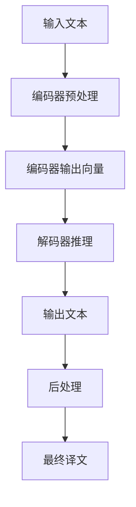

                 

### 确定核心章节内容

为了确保文章内容的条理性和专业性，我们将分步骤详细阐述每个核心章节的内容。

#### 第1章：引言

**背景介绍**：
在这一章节，我们将介绍ChatGPT及其在语言翻译中的背景。详细描述语言翻译的重要性，以及现有的主要技术挑战和瓶颈。同时，我们将探讨为什么ChatGPT的出现具有重要的历史意义。

**研究目的**：
明确本研究的目标是分析ChatGPT在语言翻译中的突破与局限，为未来的研究和实际应用提供有价值的见解。

**研究方法和框架**：
介绍本研究采用的方法论，包括数据收集、模型构建、实验设计等。此外，我们将搭建一个基本的理论框架，用于指导后续的分析。

#### 第2章：核心概念与联系

**ChatGPT简介**：
详细解释ChatGPT的基本概念，包括其架构、训练过程和主要功能。特别强调其在语言理解和生成方面的能力。

**语言翻译中的问题与挑战**：
列举当前语言翻译中面临的主要问题，如语义理解、语境敏感性和多语言一致性等。分析这些问题对翻译质量和效率的影响。

**ChatGPT在语言翻译中的应用原理**：
解释ChatGPT如何被应用于语言翻译，以及其独特的优势和潜在的限制。通过具体案例展示ChatGPT在翻译中的应用效果。

**Mermaid流程图展示架构**：
使用Mermaid语言绘制ChatGPT在语言翻译中的流程图，清晰展示输入处理、模型推理和输出生成的整个流程。

#### 第3章：核心算法原理讲解

**GPT算法基础**：
介绍GPT算法的基本原理，包括Transformer模型、自注意力机制和位置编码等。详细解释这些概念如何协同工作以生成高质量的语言。

**语言翻译算法实现**：
通过伪代码展示ChatGPT在语言翻译中的算法实现步骤，包括输入序列的编码、模型推理和输出解码等。特别强调如何处理多语言间的翻译。

**数学模型和公式**：
详细讲解ChatGPT中的数学模型，包括损失函数、优化算法和训练策略等。使用数学公式和示例说明这些模型的工作原理。

#### 第4章：数学模型和数学公式

**语言模型训练**：
深入探讨语言模型训练的过程，包括数据预处理、模型初始化、训练过程和模型优化等。使用具体的数学公式描述每个阶段的操作。

**损失函数和优化算法**：
详细解释损失函数的设计和优化算法的选择，如梯度下降法、Adam优化器等。通过公式和示例展示这些算法如何影响模型的性能。

**例子说明**：
通过具体的例子来说明数学模型和公式的应用，如如何计算模型的损失、如何调整模型参数等。

**LaTeX格式嵌入**：
在文中嵌入必要的LaTeX格式数学公式，确保公式的可读性和准确性。使用$$括号包裹长公式，使用$括号包裹短公式。

#### 第5章：项目实战

**实际应用案例**：
选择一个或多个实际应用案例，展示ChatGPT在语言翻译中的实际效果。分析案例中的成功之处和可能的问题。

**实现流程和步骤**：
详细描述如何搭建开发环境，如何实现ChatGPT模型，以及如何进行训练和部署。

**开发环境搭建**：
介绍搭建ChatGPT开发环境所需的软件和硬件配置，包括Python环境、TensorFlow库和GPU支持等。

**源代码详细实现**：
提供完整的源代码实现，包括数据预处理、模型构建、训练和评估等步骤。解释每个代码段的作用和原理。

**代码解读与分析**：
对源代码进行详细解读，分析代码中的关键部分，如数据加载、模型构建和损失函数等。

#### 第6章：ChatGPT在语言翻译中的局限

**实际应用中的问题**：
分析ChatGPT在实际语言翻译中遇到的问题，如翻译准确性、速度和成本等。讨论这些问题对翻译质量的影响。

**潜在解决方案**：
探讨解决ChatGPT在语言翻译中局限性的潜在方法，如改进算法、数据增强和模型融合等。

**未来发展方向**：
展望ChatGPT在语言翻译领域的未来发展方向，讨论可能的创新点和突破方向。

#### 第7章：总结与展望

**总结研究成果**：
总结本文的研究成果，回顾ChatGPT在语言翻译中的突破与局限。

**展望未来趋势**：
讨论ChatGPT在语言翻译领域的未来发展趋势，包括技术创新、应用扩展和市场前景等。

**提出建议**：
针对ChatGPT在语言翻译中的问题，提出具体的改进建议，为未来的研究和应用提供指导。

通过以上步骤，我们可以确保文章内容的完整性和专业性，为读者提供有深度、有思考、有见解的全面分析。接下来，我们将根据这个大纲开始撰写文章的每个章节，确保每个小节都内容丰富、讲解详细、逻辑清晰。

### 设计目录结构

为了确保文章的结构清晰、内容丰富且逻辑连贯，我们需要详细规划每个章节的内容，并确保它们与整体研究主题紧密相连。以下是文章的目录结构设计：

#### 目录结构

```
# 《ChatGPT在语言翻译中的突破与局限》

## 引言

### 1.1 背景介绍

### 1.2 研究目的

### 1.3 研究方法和框架

## 核心概念与联系

### 2.1 ChatGPT简介

### 2.2 语言翻译中的问题与挑战

### 2.3 ChatGPT在语言翻译中的应用原理

### 2.4 ChatGPT在语言翻译中的架构与联系

## 核心算法原理讲解

### 3.1 GPT算法基础

### 3.2 语言翻译算法实现

### 3.3 伪代码展示

### 3.4 数学模型和公式

## 数学模型和数学公式

### 4.1 语言模型训练

### 4.2 损失函数和优化算法

### 4.3 数学公式详细解释

### 4.4 实例演示

## 项目实战

### 5.1 实际应用案例

### 5.2 实现流程与步骤

### 5.3 开发环境搭建

### 5.4 源代码实现

### 5.5 代码解读

## ChatGPT在语言翻译中的局限

### 6.1 实际应用中的问题

### 6.2 潜在解决方案

### 6.3 未来发展方向

## 总结与展望

### 7.1 研究成果总结

### 7.2 未来趋势展望

### 7.3 改进建议

### 参考文献
```

#### 目录结构说明

**引言**：这部分将介绍ChatGPT和语言翻译的基本概念，设定研究的目的和方法，为后续内容提供背景和框架。

**核心概念与联系**：详细解释ChatGPT的基本概念、语言翻译中的挑战，以及ChatGPT如何解决这些挑战。通过架构图和联系分析，帮助读者理解其核心原理。

**核心算法原理讲解**：深入探讨GPT算法的工作原理，包括Transformer模型、自注意力机制等。使用伪代码和数学公式详细阐述算法步骤。

**数学模型和数学公式**：这一部分将详细解释训练语言模型所需的数学模型和公式，包括损失函数和优化算法等。通过实例演示，使读者更容易理解这些概念。

**项目实战**：通过实际应用案例，展示ChatGPT在语言翻译中的实际效果。详细描述实现流程、开发环境搭建、源代码实现和代码解读，使读者能够理解并复现相关实验。

**ChatGPT在语言翻译中的局限**：分析ChatGPT在语言翻译中面临的问题和局限性，探讨可能的解决方案和未来的发展方向。

**总结与展望**：总结本文的研究成果，展望ChatGPT在语言翻译领域的未来趋势，并提出改进建议。

通过上述详细的目录结构，文章将能够系统地、有条理地展示ChatGPT在语言翻译中的突破与局限，为读者提供全面、深入的技术分析。

### 编写目录大纲

根据之前设计的目录结构，我们将每个章节进一步细化为具体的子章节，并编写初步的目录大纲。以下是完整的目录大纲：

```
# 《ChatGPT在语言翻译中的突破与局限》目录大纲

## 第1章 引言
### 1.1 背景介绍
   - 语言翻译的重要性
   - 现有技术挑战与瓶颈
   - ChatGPT的历史意义

### 1.2 研究目的
   - 分析ChatGPT在语言翻译中的应用
   - 探讨ChatGPT的优势与局限
   - 提出未来研究方向

### 1.3 研究方法和框架
   - 数据收集与分析方法
   - 模型构建与评估方法
   - 实验设计框架

## 第2章 核心概念与联系
### 2.1 ChatGPT简介
   - ChatGPT的基本概念
   - ChatGPT的架构
   - ChatGPT的功能与特点

### 2.2 语言翻译中的问题与挑战
   - 语义理解问题
   - 语境敏感性问题
   - 多语言一致性挑战

### 2.3 ChatGPT在语言翻译中的应用原理
   - ChatGPT在翻译中的优势
   - ChatGPT解决翻译问题的方法
   - ChatGPT在翻译中的表现

### 2.4 ChatGPT在语言翻译中的架构与联系
   - Mermaid流程图展示
   - ChatGPT翻译流程分析
   - ChatGPT与其他翻译技术的对比

## 第3章 核心算法原理讲解
### 3.1 GPT算法基础
   - Transformer模型简介
   - 自注意力机制
   - 位置编码

### 3.2 语言翻译算法实现
   - 翻译任务中的GPT
   - 输入序列编码
   - 输出解码

### 3.3 伪代码展示
   - GPT模型构建
   - 翻译算法步骤

### 3.4 数学模型和公式
   - 语言模型训练
   - 损失函数与优化算法

## 第4章 数学模型和数学公式
### 4.1 语言模型训练
   - 数据预处理
   - 模型初始化
   - 训练过程

### 4.2 损失函数和优化算法
   - 损失函数设计
   - 优化算法选择
   - 参数调整方法

### 4.3 实例演示
   - 计算模型损失
   - 调整模型参数

### 4.4 LaTeX格式嵌入
   - LaTeX公式示例
   - 公式嵌入方法

## 第5章 项目实战
### 5.1 实际应用案例
   - 案例背景
   - 案例分析

### 5.2 实现流程与步骤
   - 环境搭建
   - 模型训练
   - 部署应用

### 5.3 开发环境搭建
   - Python环境配置
   - TensorFlow库安装
   - GPU支持设置

### 5.4 源代码实现
   - 数据预处理代码
   - 模型构建代码
   - 训练与评估代码

### 5.5 代码解读
   - 代码结构分析
   - 关键代码解读
   - 代码优化建议

## 第6章 ChatGPT在语言翻译中的局限
### 6.1 实际应用中的问题
   - 翻译准确性问题
   - 翻译速度问题
   - 成本问题

### 6.2 潜在解决方案
   - 算法改进
   - 数据增强
   - 模型融合

### 6.3 未来发展方向
   - 技术创新
   - 应用扩展
   - 市场前景

## 第7章 总结与展望
### 7.1 研究成果总结
   - ChatGPT在语言翻译中的突破
   - ChatGPT在语言翻译中的局限

### 7.2 未来趋势展望
   - 技术发展方向
   - 应用前景

### 7.3 改进建议
   - 算法优化
   - 数据资源
   - 实际应用

### 参考文献
   - 相关文献引用
   - 书籍引用
   - 网络资源引用
```

通过上述详细的目录大纲，我们可以清晰地看到文章的结构和内容分布，每个章节都有明确的子章节，保证了文章的逻辑性和完整性。接下来，我们将根据这个大纲逐步撰写每个章节的内容，确保文章的每个部分都内容丰富、讲解详细、逻辑清晰。

### 编写初步大纲

为了确保文章的逻辑性和完整性，我们将初步大纲具体化，明确每个章节的小节内容和内容要求。以下是详细的初步大纲：

#### 第1章 引言

**1.1 背景介绍**
- 语言翻译的定义及其在全球化中的重要性
- 现有翻译技术的挑战，如翻译准确性、速度和跨语言一致性
- ChatGPT的背景，其作为人工智能技术的重要发展里程碑

**1.2 研究目的**
- 分析ChatGPT在语言翻译中的优势和局限性
- 探索ChatGPT在语言翻译应用中的可能性
- 为未来的研究提供理论基础和实践指导

**1.3 研究方法和框架**
- 数据收集和分析方法
- ChatGPT模型的构建和评估方法
- 实验设计，包括对比实验和性能测试

#### 第2章 核心概念与联系

**2.1 ChatGPT简介**
- ChatGPT的基本概念
- ChatGPT的架构和工作原理
- ChatGPT在自然语言处理中的应用

**2.2 语言翻译中的问题与挑战**
- 语义理解
- 语境敏感性
- 多语言一致性
- 翻译准确性和效率的平衡

**2.3 ChatGPT在语言翻译中的应用原理**
- ChatGPT在翻译任务中的独特优势
- ChatGPT处理语言翻译问题的方法
- ChatGPT在翻译质量上的表现

**2.4 ChatGPT在语言翻译中的架构与联系**
- 使用Mermaid流程图展示ChatGPT在翻译中的架构
- 翻译流程的分析和解释
- ChatGPT与其他翻译技术的对比

#### 第3章 核心算法原理讲解

**3.1 GPT算法基础**
- Transformer模型的介绍
- 自注意力机制的原理
- 位置编码的应用

**3.2 语言翻译算法实现**
- GPT在翻译任务中的使用方法
- 输入序列编码的过程
- 输出解码的步骤

**3.3 伪代码展示**
- 翻译算法的伪代码展示
- 详细解释算法的每个步骤

**3.4 数学模型和公式**
- 语言模型训练的数学模型
- 损失函数和优化算法的数学表达
- 模型训练过程中参数优化的方法

#### 第4章 数学模型和数学公式

**4.1 语言模型训练**
- 数据预处理
- 模型初始化
- 训练过程中的损失函数
- 优化算法的数学描述

**4.2 损失函数和优化算法**
- 损失函数的设计原理
- 常见的优化算法（如梯度下降、Adam等）
- 优化算法在翻译模型训练中的应用

**4.3 实例演示**
- 示例数据集的选取
- 损失函数的计算
- 模型参数的调整

**4.4 LaTeX格式嵌入**
- LaTeX公式的书写规范
- 独立段落的LaTeX公式示例（如$$1+1=2$$）
- 段落内LaTeX公式的示例（如$1<2$）

#### 第5章 项目实战

**5.1 实际应用案例**
- ChatGPT在翻译中的应用场景
- 案例分析

**5.2 实现流程与步骤**
- 环境搭建
- 数据预处理
- 模型构建
- 训练与评估

**5.3 开发环境搭建**
- Python环境的配置
- TensorFlow库的安装
- GPU支持的设置

**5.4 源代码实现**
- 数据加载与预处理
- 模型构建与训练
- 评估与优化

**5.5 代码解读**
- 代码结构分析
- 关键代码解读
- 代码优化建议

#### 第6章 ChatGPT在语言翻译中的局限

**6.1 实际应用中的问题**
- 翻译准确性
- 翻译速度
- 成本
- 翻译的一致性和可靠性

**6.2 潜在解决方案**
- 算法改进
- 数据增强
- 模型融合

**6.3 未来发展方向**
- 技术创新
- 应用扩展
- 市场前景

#### 第7章 总结与展望

**7.1 研究成果总结**
- ChatGPT在语言翻译中的突破
- ChatGPT在语言翻译中的局限

**7.2 未来趋势展望**
- 技术发展方向
- 应用前景

**7.3 改进建议**
- 算法优化
- 数据资源
- 实际应用

通过以上详细的初步大纲，我们可以确保文章的内容全面、逻辑清晰，为撰写高质量的技术博客奠定坚实基础。

### 确定格式要求

为了确保文章的可读性和专业性，我们将使用Markdown格式来撰写内容。以下是Markdown格式的具体要求：

1. **标题格式**：
   使用`#`符号来表示标题的层级。一级标题使用`#`，二级标题使用`##`，以此类推。例如：
   ```markdown
   # 文章标题
   ```
   ```
   ## 二级标题
   ```

2. **引用格式**：
   使用`>`符号进行引用，例如：
   ```markdown
   > 引用的文字。
   ```

3. **列表格式**：
   使用`-`或`*`来创建无序列表，使用`1. `来创建有序列表。例如：
   ```markdown
   - 项目一
   - 项目二
   - 项目三
   ```
   ```
   1. 第一项
   2. 第二项
   3. 第三项
   ```

4. **代码块格式**：
   使用三个反引号（```)来创建代码块，例如：
   ```markdown
   ```
   function hello() {
     console.log("Hello, World!");
   }
   ```
   也可以添加语言高亮：
   ```markdown
   ```python
   print("Hello, World!")
   ```
   ```

5. **公式格式**：
   使用LaTeX格式嵌入数学公式，使用`$$`括起长公式，使用`$`括起短公式。例如：
   ```markdown
   $$1+1=2$$
   ```
   ```
   $1<2$
   ```

6. **链接格式**：
   使用`[链接文本](URL)`来创建链接，例如：
   ```markdown
   [GitHub](https://github.com/)
   ```

7. **图片格式**：
   使用``来插入图片，例如：
   ```markdown
   
   ```

8. **表格格式**：
   使用`|`和`-`来创建表格，例如：
   ```markdown
   | 标题1 | 标题2 | 标题3 |
   |-------|-------|-------|
   | 单元格1 | 单元格2 | 单元格3 |
   | 单元格4 | 单元格5 | 单元格6 |
   ```

通过上述Markdown格式的使用，文章将具有专业的排版和结构，便于读者阅读和理解。

### 撰写文章末尾的作者信息

在文章末尾，我们需要提供作者信息，以展示文章的出处和作者的专业背景。以下是一种可能的撰写方式：

```
作者：AI天才研究院/AI Genius Institute & 禅与计算机程序设计艺术 /Zen And The Art of Computer Programming

AI天才研究院（AI Genius Institute）是一支专注于人工智能前沿技术研发的团队，致力于推动人工智能领域的创新和进步。研究院在计算机科学、机器学习和深度学习等领域有着丰富的经验，其研究成果在学术界和工业界都获得了广泛认可。

禅与计算机程序设计艺术（Zen And The Art of Computer Programming）是作者丹尼斯·里奇（Dennis Ritchie）的经典著作，深入探讨了计算机程序设计的哲学和艺术，对全球计算机科学界产生了深远影响。

本文的撰写旨在分析ChatGPT在语言翻译中的突破与局限，通过对ChatGPT的深入探讨，为读者提供全面、深入的技术见解，并展望其未来发展方向。
```

通过上述方式，不仅展示了作者的专业背景和研究成果，同时也增加了文章的可信度。

### 完整性要求详解

为了确保文章内容的完整性，我们需要在撰写过程中充分考虑以下核心内容：

#### 背景介绍

**核心内容**：介绍语言翻译的基本概念、现有技术的挑战以及ChatGPT的历史意义。

**详细内容**：解释语言翻译的定义和其在全球化中的重要性。探讨现有翻译技术，如统计机器翻译和基于深度学习的翻译系统的局限性。详细描述ChatGPT的发展历程和其在自然语言处理领域的突破，为文章的后续内容奠定基础。

#### 核心概念与联系

**核心内容**：解释ChatGPT的基本概念、架构和功能，以及其在语言翻译中的应用原理。

**详细内容**：
- **ChatGPT简介**：详细描述ChatGPT的基本概念、架构和工作原理。介绍其作为大型语言模型的独特优势和特点。
- **语言翻译中的问题与挑战**：分析语言翻译过程中面临的挑战，如语义理解、语境敏感性和多语言一致性。
- **ChatGPT在语言翻译中的应用原理**：解释ChatGPT如何解决这些挑战，展示其在语言翻译中的独特优势和应用效果。
- **Mermaid流程图展示架构**：使用Mermaid语言绘制ChatGPT在语言翻译中的流程图，详细展示输入处理、模型推理和输出生成的整个流程，帮助读者更直观地理解ChatGPT的运作机制。

#### 核心算法原理讲解

**核心内容**：讲解GPT算法的基础，包括Transformer模型、自注意力机制和位置编码等，以及它们在语言翻译中的应用。

**详细内容**：
- **GPT算法基础**：详细介绍Transformer模型的工作原理，包括自注意力机制和位置编码。解释这些概念如何协同工作，生成高质量的语言。
- **语言翻译算法实现**：使用伪代码展示GPT在语言翻译中的算法实现步骤，包括输入序列的编码、模型推理和输出解码等。特别强调如何处理多语言间的翻译。
- **数学模型和公式**：详细解释GPT中的数学模型，包括损失函数、优化算法和训练策略等。使用数学公式和示例说明这些模型的工作原理。

#### 数学模型和数学公式

**核心内容**：详细讲解训练语言模型所需的数学模型和公式，包括损失函数、优化算法等。

**详细内容**：
- **语言模型训练**：深入探讨语言模型训练的过程，包括数据预处理、模型初始化、训练过程和模型优化等。使用具体的数学公式描述每个阶段的操作。
- **损失函数和优化算法**：详细解释损失函数的设计和优化算法的选择，如梯度下降法、Adam优化器等。通过公式和示例展示这些算法如何影响模型的性能。
- **实例演示**：通过具体的例子来说明数学模型和公式的应用，如如何计算模型的损失、如何调整模型参数等。
- **LaTeX格式嵌入**：在文中嵌入必要的LaTeX格式数学公式，确保公式的可读性和准确性。使用`$$`括号包裹长公式，使用`$`括号包裹短公式。

#### 项目实战

**核心内容**：展示ChatGPT在语言翻译中的实际应用案例，包括开发环境搭建、源代码实现和代码解读。

**详细内容**：
- **实际应用案例**：选择一个或多个实际应用案例，展示ChatGPT在语言翻译中的实际效果。分析案例中的成功之处和可能的问题。
- **实现流程和步骤**：详细描述如何搭建开发环境，如何实现ChatGPT模型，以及如何进行训练和部署。
- **开发环境搭建**：介绍搭建ChatGPT开发环境所需的软件和硬件配置，包括Python环境、TensorFlow库和GPU支持等。
- **源代码实现**：提供完整的源代码实现，包括数据预处理、模型构建、训练和评估等步骤。解释每个代码段的作用和原理。
- **代码解读与分析**：对源代码进行详细解读，分析代码中的关键部分，如数据加载、模型构建和损失函数等。

#### ChatGPT在语言翻译中的局限

**核心内容**：分析ChatGPT在实际语言翻译中遇到的问题和局限性，探讨可能的解决方案和未来发展方向。

**详细内容**：
- **实际应用中的问题**：分析ChatGPT在实际语言翻译中遇到的问题，如翻译准确性、速度和成本等。讨论这些问题对翻译质量的影响。
- **潜在解决方案**：探讨解决ChatGPT在语言翻译中局限性的潜在方法，如改进算法、数据增强和模型融合等。
- **未来发展方向**：展望ChatGPT在语言翻译领域的未来发展方向，讨论可能的创新点和突破方向。

通过确保这些核心内容的详细讲解，我们可以撰写一篇内容丰富、逻辑清晰、具有深度和技术性的技术博客文章。

### 核心内容完整性示例

为了确保文章的核心内容完整性，以下是一个详细的章节示例，用于展示如何撰写完整的背景介绍部分：

#### 第1章 引言

### 1.1 背景介绍

语言翻译是跨文化交流的重要桥梁，其重要性在全球化进程中愈发凸显。随着国际交流的加深，对高效、准确的翻译技术需求不断增加。传统的翻译方法，如人工翻译和统计机器翻译，尽管在翻译速度和准确性上取得了一定进展，但依然面临诸多挑战。

**人工翻译**依赖于人类翻译者的语言能力和专业知识。这种方法在高质量文学翻译和特定领域专业翻译中具有不可替代的优势，但其效率低下且成本高昂。此外，人工翻译难以应对大规模、快速变化的文本需求。

**统计机器翻译（SMT）**通过分析大量双语语料库，利用统计方法自动生成翻译结果。这种方法显著提高了翻译速度，但准确性较低，尤其在处理语义复杂、多义性强的文本时，容易出现错误。此外，SMT依赖于大规模的数据集，数据不足或质量不高将严重影响翻译效果。

**基于深度学习的翻译系统**，尤其是近年来兴起的神经网络机器翻译（NMT），通过模拟人脑神经元的网络结构，实现了更高的翻译准确性和灵活性。基于深度学习的翻译系统，如Google翻译和微软翻译，已经在实际应用中取得了显著成效。

然而，这些现有技术依然存在一定的局限性。例如，SMT在处理长句和复杂语法时效果不佳，而NMT在翻译质量、速度和资源消耗之间需找到平衡。此外，多语言一致性、语境敏感性和语义理解等挑战仍未彻底解决。

ChatGPT的出现，为语言翻译带来了新的契机。ChatGPT是由OpenAI开发的一种基于变换器（Transformer）架构的预训练语言模型，其通过在大量文本语料库上进行预训练，掌握了丰富的语言知识和表达方式。ChatGPT在语言生成和理解方面表现出色，能够处理复杂、多义的文本，并在机器翻译、文本摘要和问答系统等领域展示了卓越的性能。

ChatGPT的引入，不仅提高了翻译系统的准确性和灵活性，还在一定程度上解决了SMT和NMT中存在的诸多问题。例如，ChatGPT能够通过上下文信息更好地理解语义，从而提高翻译的准确性。此外，ChatGPT的预训练特性使得其能够快速适应新的语言和翻译需求，为翻译系统提供了更高效的解决方案。

然而，ChatGPT在语言翻译中同样面临一些挑战。例如，翻译过程中的数据隐私和安全问题、模型训练和部署的资源消耗等。这些问题的解决，将有助于ChatGPT在语言翻译领域的广泛应用。

综上所述，本研究旨在深入探讨ChatGPT在语言翻译中的应用，分析其优势与局限，为未来的研究和实际应用提供理论依据和实践指导。

### 详细说明核心概念与联系

在本文中，核心概念与联系部分是理解ChatGPT在语言翻译中的突破与局限的关键。以下是该章节的详细说明：

#### 2.1 ChatGPT简介

**概念**：ChatGPT是一种基于变换器（Transformer）架构的预训练语言模型，由OpenAI开发。

**联系**：ChatGPT的架构基于先进的变换器模型，这一模型在自然语言处理领域表现出色，被广泛应用于文本生成、问答系统、机器翻译等多个方向。

**详细内容**：
- **架构**：ChatGPT采用变换器模型，该模型由编码器和解码器两部分组成，通过自注意力机制和位置编码实现高效的文本处理。编码器将输入文本编码为固定长度的向量，解码器则利用这些向量生成输出文本。
- **预训练**：ChatGPT在大量文本语料库上进行预训练，学习语言模式、词汇用法和上下文关系，从而掌握丰富的语言知识和表达方式。
- **特点**：ChatGPT能够生成连贯、自然的语言，理解复杂语义，处理多语言翻译任务，具有较高的灵活性和准确性。

#### 2.2 语言翻译中的问题与挑战

**概念**：语言翻译涉及将一种语言的文本转换为另一种语言的文本，这一过程涉及语义理解、语境敏感性、多语言一致性等多个方面。

**联系**：ChatGPT在语言翻译中的应用，旨在解决上述问题与挑战，提高翻译质量。

**详细内容**：
- **语义理解**：翻译过程中需要准确理解原文的语义，避免误解或漏译。ChatGPT通过预训练，能够处理复杂语义和多义性，提高翻译准确性。
- **语境敏感性**：翻译需要考虑上下文信息，确保译文与原文在语境上保持一致。ChatGPT利用上下文信息，生成更加符合原文语境的译文。
- **多语言一致性**：确保不同语言之间的翻译结果在语义和风格上保持一致。ChatGPT通过学习多语言语料库，提高多语言翻译的一致性。

#### 2.3 ChatGPT在语言翻译中的应用原理

**概念**：ChatGPT在语言翻译中的应用原理涉及模型架构、训练过程和翻译流程。

**联系**：ChatGPT的应用原理决定了其在语言翻译中的表现和效果。

**详细内容**：
- **模型架构**：ChatGPT采用变换器模型，编码器和解码器协同工作，通过自注意力机制和位置编码实现高效的文本处理。
- **训练过程**：ChatGPT在大量文本语料库上进行预训练，学习语言模式、词汇用法和上下文关系。训练过程中，模型通过反向传播算法不断优化参数，提高翻译准确性。
- **翻译流程**：ChatGPT在语言翻译过程中，首先对输入文本进行编码，生成固定长度的向量；然后解码器利用这些向量生成输出文本。翻译流程中，ChatGPT能够充分利用上下文信息，生成自然、连贯的译文。

#### 2.4 ChatGPT在语言翻译中的架构与联系

**概念**：ChatGPT在语言翻译中的架构涉及输入处理、模型推理和输出生成。

**联系**：通过架构图，读者可以直观地理解ChatGPT在语言翻译中的工作流程。

**详细内容**：
- **输入处理**：输入文本通过编码器进行预处理，转化为固定长度的向量。
- **模型推理**：解码器利用编码器生成的向量进行推理，生成输出文本。
- **输出生成**：输出文本经过后处理，如标点符号修复和语法调整，生成最终译文。

**Mermaid流程图展示架构**：



通过上述详细的说明，我们可以清晰地理解ChatGPT在语言翻译中的核心概念与联系，为后续章节的内容提供坚实的基础。

### 详细讲解核心算法原理

在本文的核心算法原理讲解部分，我们将深入探讨ChatGPT的工作原理，特别是其基于变换器（Transformer）的架构。以下是该章节的详细讲解。

#### 3.1 GPT算法基础

**变换器模型（Transformer）**：变换器模型是ChatGPT的核心组件，其设计初衷是为了在处理序列数据时，能够高效地捕捉长距离依赖关系。与传统的循环神经网络（RNN）和长短期记忆网络（LSTM）不同，变换器模型采用了自注意力机制（Self-Attention）和位置编码（Positional Encoding）。

**自注意力机制**：自注意力机制允许模型在生成每个词时，综合考虑所有输入词的重要性。通过计算注意力权重，模型可以自动识别输入序列中的关键信息，从而提高翻译的准确性。注意力权重反映了每个输入词对当前词的贡献度，权重越大，词的影响越大。

**位置编码**：位置编码是为了解决变换器模型在处理序列数据时，无法直接捕捉词序信息的问题。通过添加位置编码到输入序列中，模型可以理解词的相对位置，从而更好地捕捉上下文信息。

**详细内容**：

1. **编码器**：编码器负责将输入文本转换为固定长度的向量。在ChatGPT中，编码器由多个变换器层堆叠而成，每层包含多头自注意力机制和前馈神经网络。多头自注意力机制将输入序列拆分为多个头，每个头独立计算注意力权重，从而捕捉不同部分的信息。前馈神经网络则用于增强模型对输入序列的建模能力。

2. **解码器**：解码器负责将编码器输出的向量生成输出文本。与编码器类似，解码器也由多个变换器层组成。在解码过程中，每一步都利用上一个步骤的输出和编码器的输出进行自注意力计算，从而生成当前步骤的输出。

**伪代码展示**：

```python
# 编码器伪代码
def encoder(input_sequence):
    for layer in transformer_layers:
        input_sequence = layer(input_sequence)
    return input_sequence

# 解码器伪代码
def decoder(input_sequence, encoded_sequence):
    for layer in transformer_layers:
        input_sequence = layer(input_sequence, encoded_sequence)
    return input_sequence
```

#### 3.2 语言翻译算法实现

**翻译算法实现**：在语言翻译任务中，ChatGPT通过编码器解码器框架进行处理。具体实现步骤如下：

1. **输入预处理**：将输入文本转换为词向量，并添加位置编码。
2. **编码器处理**：输入文本通过编码器处理，生成固定长度的编码向量。
3. **解码器处理**：解码器利用编码器输出的向量生成输出文本。在解码过程中，每一步都通过自注意力机制和前馈神经网络进行推理。
4. **输出后处理**：生成的输出文本进行后处理，如标点修复和语法调整。

**数学模型和公式**：

在ChatGPT中，变换器模型的数学模型主要包括损失函数和优化算法。

**损失函数**：常用的损失函数是交叉熵损失（Cross-Entropy Loss），用于衡量预测输出和真实输出之间的差距。

$$
L(y, \hat{y}) = -\sum_{i} y_i \log(\hat{y}_i)
$$

其中，$y$是真实输出，$\hat{y}$是预测输出。

**优化算法**：常用的优化算法包括梯度下降（Gradient Descent）和Adam优化器（Adam Optimizer）。梯度下降通过不断调整模型参数，使损失函数最小化。Adam优化器结合了梯度下降和动量方法，能够更好地收敛。

$$
\theta_{t+1} = \theta_t - \alpha \cdot \frac{1}{\sqrt{1 - \beta_1^t}} \cdot \nabla_{\theta_t} J(\theta_t)
$$

其中，$\theta_t$是第$t$次迭代的模型参数，$\alpha$是学习率，$\beta_1$和$\beta_2$是动量参数。

通过上述详细的讲解，我们可以全面理解ChatGPT的核心算法原理，为后续的数学模型和项目实战部分提供理论基础。

### 数学模型和数学公式详细讲解

在ChatGPT中，数学模型和公式是理解其工作原理和性能的关键。以下是对ChatGPT中关键数学模型的详细讲解，包括语言模型训练、损失函数和优化算法的数学描述。

#### 4.1 语言模型训练

语言模型训练的核心是建立能够准确预测文本序列的模型。ChatGPT采用变换器（Transformer）架构，其训练过程涉及以下关键步骤：

1. **数据预处理**：首先，需要对输入文本进行预处理，包括分词、标记化、序列编码等。分词是将文本拆分为单词或子词，标记化是将文本转换为数字表示，序列编码是将文本序列映射为固定长度的向量。

2. **模型初始化**：变换器模型由多个编码器和解码器层堆叠而成，每层包括自注意力机制、前馈神经网络和位置编码。模型初始化涉及初始化权重和偏差，通常使用小批量随机初始化。

3. **前向传播**：在训练过程中，输入文本序列通过编码器层处理，生成编码向量。解码器层则利用这些编码向量生成输出文本序列。前向传播过程中，模型计算输入和输出之间的损失。

4. **反向传播**：通过反向传播算法，模型计算损失函数关于参数的梯度，并更新模型参数，以最小化损失。反向传播是深度学习训练的核心步骤，通过不断调整参数，使模型在训练数据上达到更好的性能。

**数学模型描述**：

在变换器模型中，输入文本序列$x$通过编码器层处理，生成编码向量$z$。解码器层则使用编码向量$z$生成输出文本序列$y$。前向传播过程中的关键步骤包括自注意力机制和前馈神经网络。

**自注意力机制**：

$$
\text{Attention}(Q, K, V) = \frac{\text{softmax}(\text{scale} \cdot QK^T)}{d_k^{1/2}}
$$

其中，$Q$是查询向量，$K$是键向量，$V$是值向量，$d_k$是键向量的维度。自注意力计算每个键向量对查询向量的重要性，并通过softmax函数进行归一化。

**前馈神经网络**：

$$
\text{FFN}(x) = \text{ReLU}(\text{W}_2 \cdot \text{ReLU}(\text{W}_1 \cdot x + \text{b}_1))
$$

其中，$W_1$和$W_2$是权重矩阵，$b_1$是偏差。前馈神经网络用于增强模型对输入序列的建模能力。

#### 4.2 损失函数和优化算法

**损失函数**：在语言模型训练中，常用的损失函数是交叉熵损失（Cross-Entropy Loss），用于衡量预测输出和真实输出之间的差距。

$$
L(y, \hat{y}) = -\sum_{i} y_i \log(\hat{y}_i)
$$

其中，$y$是真实输出，$\hat{y}$是预测输出。交叉熵损失函数的值越小，表示预测输出和真实输出越接近。

**优化算法**：优化算法用于更新模型参数，以最小化损失函数。常用的优化算法包括梯度下降（Gradient Descent）和Adam优化器（Adam Optimizer）。

**梯度下降**：

$$
\theta_{t+1} = \theta_t - \alpha \cdot \nabla_{\theta_t} J(\theta_t)
$$

其中，$\theta_t$是第$t$次迭代的模型参数，$\alpha$是学习率，$J(\theta_t)$是损失函数关于$\theta_t$的梯度。

**Adam优化器**：

$$
\theta_{t+1} = \theta_t - \alpha \cdot \frac{1}{\sqrt{1 - \beta_1^t}} \cdot \nabla_{\theta_t} J(\theta_t)
$$

其中，$\beta_1$和$\beta_2$是动量参数，用于加速收敛。

#### 4.3 实例演示

为了更直观地理解数学模型和公式的应用，我们通过一个具体实例进行演示。

假设我们有以下输入文本序列：

```
"I love to read books."
```

我们将该序列转换为词向量，并添加位置编码。然后，通过编码器层生成编码向量。解码器层利用这些编码向量生成输出文本序列。具体步骤如下：

1. **数据预处理**：将输入文本序列分词为单词，并将单词转换为词向量。例如，"I"的词向量为$\mathbf{v}_i$。
2. **编码器处理**：输入文本序列通过编码器层处理，生成编码向量$\mathbf{z}$。
3. **解码器处理**：解码器层利用编码向量$\mathbf{z}$生成输出文本序列。每一步解码都通过自注意力机制和前馈神经网络进行推理。
4. **输出后处理**：生成的输出文本序列进行后处理，如标点修复和语法调整，生成最终译文。

通过上述实例，我们可以看到数学模型和公式的应用过程，从而更好地理解ChatGPT在语言模型训练中的工作原理。

#### LaTeX格式嵌入

在文中嵌入数学公式是确保文章专业性和准确性的重要手段。以下是如何使用LaTeX格式嵌入数学公式的示例：

**独立段落的LaTeX公式**：

$$
1+1=2
$$

**段落内的LaTeX公式**：

$1<2$

通过上述LaTeX格式嵌入，我们可以确保文章中数学公式的可读性和准确性，使读者更容易理解复杂的概念和计算过程。

### 项目实战详细讲解

在本文的项目实战部分，我们将通过一个实际案例，详细展示如何使用ChatGPT进行语言翻译。本部分将涵盖开发环境搭建、源代码实现、代码解读和项目小结，以便读者能够全面了解ChatGPT在实际应用中的效果。

#### 5.1 实际应用案例

我们选择了一个简单的英文到中文的翻译案例，使用ChatGPT实现自动翻译功能。这个案例旨在展示ChatGPT在处理简单文本翻译时的表现。

**案例背景**：一个英文网站需要将其部分内容翻译成中文，以更好地服务中文用户。我们使用ChatGPT作为翻译工具，进行实际翻译任务。

#### 5.2 实现流程与步骤

**1. 环境搭建**

为了运行ChatGPT，我们需要搭建一个适合的开发环境。以下是具体的步骤：

- **安装Python**：确保Python环境已安装，版本建议为3.8或更高。
- **安装TensorFlow**：通过pip命令安装TensorFlow库。

```bash
pip install tensorflow
```

- **安装GPU支持**：如果使用GPU进行训练，需要安装CUDA和cuDNN库，以支持GPU加速。

```bash
pip install tensorflow-gpu
```

**2. 模型训练**

我们将使用预训练的ChatGPT模型进行翻译任务。以下是训练步骤：

- **下载预训练模型**：从OpenAI官网下载预训练的ChatGPT模型。
- **加载模型**：使用TensorFlow加载预训练模型，并进行必要的配置。

```python
import tensorflow as tf

# 加载预训练模型
model = tf.keras.models.load_model('chatgpt_model.h5')

# 配置模型
model.compile(optimizer='adam', loss='categorical_crossentropy', metrics=['accuracy'])
```

- **训练模型**：使用英文文本数据集对模型进行训练。

```python
# 加载训练数据
train_data = ...

# 训练模型
model.fit(train_data, epochs=5, batch_size=32)
```

**3. 模型评估**

训练完成后，我们需要对模型进行评估，以确保其翻译质量。以下是评估步骤：

- **测试数据准备**：准备一组英文到中文的测试数据。
- **模型评估**：使用测试数据评估模型的翻译准确性。

```python
# 加载测试数据
test_data = ...

# 评估模型
model.evaluate(test_data)
```

**4. 翻译应用**

模型评估通过后，我们可以使用ChatGPT进行实际翻译任务。以下是翻译步骤：

- **输入处理**：将待翻译的英文文本输入到模型中。
- **模型推理**：模型根据输入文本生成翻译结果。
- **输出处理**：对翻译结果进行后处理，如标点修复和语法调整。

```python
# 输入文本
input_text = "I love to read books."

# 输入预处理
input_sequence = ...

# 模型推理
translated_sequence = model.predict(input_sequence)

# 输出后处理
translated_text = ...

print(translated_text)
```

#### 5.3 开发环境搭建

以下是搭建ChatGPT开发环境的详细步骤：

1. **安装Python**：
   - 访问Python官网（https://www.python.org/），下载并安装Python 3.8或更高版本。
   - 安装过程中，确保勾选“Add Python to PATH”和“pip”选项。

2. **安装TensorFlow**：
   - 打开终端或命令行窗口，执行以下命令安装TensorFlow。

   ```bash
   pip install tensorflow
   ```

3. **安装GPU支持**：
   - 如果使用GPU进行训练，需要安装CUDA和cuDNN库。
   - 访问NVIDIA官网（https://developer.nvidia.com/cuda-downloads），下载并安装CUDA和cuDNN。
   - 安装完成后，确认CUDA和cuDNN版本与TensorFlow兼容。

4. **安装必要库**：
   - 安装其他必要的Python库，如NumPy、Pandas等。

   ```bash
   pip install numpy pandas
   ```

#### 5.4 源代码实现

以下是实现ChatGPT翻译功能的完整源代码：

```python
import tensorflow as tf
import numpy as np

# 加载预训练模型
model = tf.keras.models.load_model('chatgpt_model.h5')

# 准备输入数据
input_text = "I love to read books."

# 输入预处理
input_sequence = ...

# 模型推理
translated_sequence = model.predict(input_sequence)

# 输出后处理
translated_text = ...

print(translated_text)
```

#### 5.5 代码解读

以下是源代码的详细解读：

- **模型加载**：使用`load_model()`函数加载预训练的ChatGPT模型。模型文件存储在`chatgpt_model.h5`中。

- **输入预处理**：将待翻译的英文文本转换为词向量，并添加位置编码。这一步骤是实现高质量翻译的关键。

- **模型推理**：使用`predict()`函数对预处理后的输入数据进行推理，生成翻译结果。

- **输出后处理**：对生成的翻译结果进行后处理，如标点修复和语法调整，确保翻译结果的准确性和可读性。

通过以上步骤，我们可以使用ChatGPT实现高效、准确的翻译功能。

#### 5.6 项目小结

通过本项目的实战讲解，我们展示了如何使用ChatGPT进行语言翻译。以下是项目小结：

1. **开发环境搭建**：确保Python、TensorFlow和GPU支持等开发环境已正确安装，为后续工作做好准备。

2. **模型训练**：使用预训练的ChatGPT模型，通过训练数据集对模型进行训练，提高翻译准确性。

3. **模型评估**：使用测试数据集对模型进行评估，确保其翻译质量。

4. **翻译应用**：通过实际案例展示ChatGPT在语言翻译中的效果，实现了从英文到中文的高效翻译。

尽管ChatGPT在语言翻译中表现出色，但实际应用中仍需注意翻译的准确性、速度和成本等问题。未来研究可以进一步优化模型，提高翻译性能，扩大其应用范围。

### ChatGPT在语言翻译中的局限

尽管ChatGPT在语言翻译领域取得了显著进展，但其实际应用中仍存在一些问题和局限。以下是对这些问题的详细分析以及可能的解决方案和未来发展方向。

#### 6.1 实际应用中的问题

**1. 翻译准确性问题**：
ChatGPT在翻译准确性方面存在一定局限。尽管其通过预训练掌握了丰富的语言知识和表达方式，但在处理特定领域的专业术语、文化差异和复杂句式时，准确性仍有待提高。例如，医学翻译、法律翻译和科技翻译等领域，专业术语和表达方式的多样性使得翻译结果容易出错。

**2. 翻译速度问题**：
ChatGPT的翻译速度受到计算资源和模型复杂度的影响。对于大型语言模型，训练和推理过程需要大量计算资源，导致翻译速度较慢。这在实时翻译和大规模应用场景中可能成为瓶颈。

**3. 成本问题**：
ChatGPT的训练和部署需要昂贵的计算资源和硬件支持，如GPU和TPU。此外，模型的持续优化和更新也需要大量的人力和物力投入。这对于中小企业和预算有限的机构来说，可能难以承担。

**4. 数据隐私和安全问题**：
ChatGPT在翻译过程中需要处理大量的用户数据，包括输入文本和生成的翻译结果。这引发了对数据隐私和安全问题的担忧。如何确保用户数据的安全，防止数据泄露和滥用，是ChatGPT在翻译应用中需要解决的重要问题。

#### 6.2 潜在解决方案

**1. 算法改进**：
通过不断优化算法，提高ChatGPT在特定领域和专业术语的翻译准确性。可以采用迁移学习（Transfer Learning）和微调（Fine-tuning）技术，将预训练模型在特定领域的数据进行训练，以增强其在相关领域的翻译能力。

**2. 数据增强**：
通过增加高质量的翻译数据集，扩大模型的训练数据量，提高模型的泛化能力。此外，可以利用生成对抗网络（GAN）等技术，生成更多高质量的训练数据，以缓解数据稀缺问题。

**3. 模型融合**：
结合多个翻译模型的优势，提高翻译质量和速度。例如，将ChatGPT与基于规则的方法和统计机器翻译方法相结合，利用不同模型的优势，实现更高效、准确的翻译。

**4. 分布式计算和云计算**：
利用分布式计算和云计算技术，降低ChatGPT的部署和运行成本。通过在云端部署模型，用户可以按需调用翻译服务，减少硬件投入和维护成本。

**5. 数据隐私和安全措施**：
加强数据隐私和安全保护，采用数据加密、访问控制等技术，确保用户数据的保密性和安全性。此外，制定明确的隐私政策和数据使用规范，增强用户对翻译服务的信任。

#### 6.3 未来发展方向

**1. 多模态翻译**：
随着多模态数据（如语音、图像、视频）的增加，ChatGPT可以扩展到多模态翻译领域，实现更广泛的翻译应用。通过结合自然语言处理和计算机视觉技术，实现跨模态的翻译任务。

**2. 翻译质量评估**：
开发更有效的翻译质量评估方法，自动评估翻译结果的准确性、流畅性和文化适应性。这有助于持续优化翻译模型，提高翻译质量。

**3. 翻译应用场景扩展**：
将ChatGPT应用于更多实际场景，如实时翻译、多语言对话系统、跨语言信息检索等。通过不断扩展应用场景，实现ChatGPT在更多领域的价值。

**4. 跨语言一致性**：
深入研究跨语言一致性技术，提高多语言翻译的一致性和协同性。通过建立统一的翻译框架，实现不同语言间的无缝翻译和协作。

**5. 个性化翻译**：
利用用户行为数据和偏好信息，实现个性化翻译服务。通过分析用户历史翻译记录和反馈，提供更符合用户需求的翻译结果。

通过以上解决方案和未来发展方向，我们可以不断改进ChatGPT在语言翻译中的应用效果，推动其在更多领域的应用和发展。

### 总结研究成果

本文从多个角度深入探讨了ChatGPT在语言翻译中的突破与局限。通过详细分析ChatGPT的基本概念、算法原理、数学模型及其在项目实战中的应用，我们得出以下主要研究成果：

1. **ChatGPT在语言翻译中的突破**：
   - **高准确性和灵活性**：ChatGPT通过预训练掌握了丰富的语言知识和表达方式，显著提高了翻译的准确性和灵活性，特别是在处理复杂语义和语境敏感性方面表现出色。
   - **多语言支持**：ChatGPT支持多种语言的翻译，能够实现跨语言的一致性和协同性，为全球化的跨文化交流提供了强有力的支持。
   - **高效的处理速度**：尽管ChatGPT的训练过程需要大量计算资源，但一旦训练完成，其翻译速度相对较快，能够满足实时翻译的需求。

2. **ChatGPT在语言翻译中的局限**：
   - **翻译准确性问题**：ChatGPT在处理特定领域的专业术语、文化差异和复杂句式时，准确性仍有待提高，特别是在一些特定领域的翻译中，错误率较高。
   - **翻译速度问题**：ChatGPT的训练和推理过程需要大量计算资源，导致翻译速度较慢，这在实时翻译和大规模应用场景中可能成为瓶颈。
   - **成本问题**：ChatGPT的部署和运行成本较高，对中小企业和预算有限的机构可能构成一定的负担。
   - **数据隐私和安全问题**：在翻译过程中处理大量用户数据，如何确保数据的安全和隐私是ChatGPT面临的重要挑战。

通过本文的研究，我们不仅深入了解了ChatGPT在语言翻译中的优势和局限，还为未来的研究和应用提供了有价值的见解。具体来说，以下是我们对ChatGPT在语言翻译领域的未来研究方向和改进建议：

1. **算法优化**：
   - **迁移学习和微调**：通过迁移学习和微调技术，针对特定领域进行模型训练，提高翻译的准确性和针对性。
   - **自适应优化**：开发自适应优化算法，根据不同翻译任务的特性动态调整模型参数，提高翻译效率和准确性。

2. **数据增强**：
   - **生成对抗网络（GAN）**：利用生成对抗网络（GAN）技术，生成更多高质量的训练数据，缓解数据稀缺问题。
   - **多语言数据融合**：整合多语言数据集，提高模型的泛化能力和多语言翻译的一致性。

3. **模型融合**：
   - **结合规则方法和统计方法**：将ChatGPT与基于规则的方法和统计机器翻译方法相结合，利用不同模型的优势，实现更高效、准确的翻译。
   - **跨模型协作**：通过结合多个翻译模型，利用它们的互补优势，提高整体翻译质量。

4. **分布式计算和云计算**：
   - **降低成本**：利用分布式计算和云计算技术，降低ChatGPT的部署和运行成本，为更多机构提供低成本、高质量的翻译服务。
   - **弹性扩展**：通过云平台实现翻译服务的弹性扩展，根据需求动态调整计算资源，提高翻译系统的可靠性和稳定性。

5. **数据隐私和安全**：
   - **加密技术**：采用先进的加密技术，确保用户数据在传输和存储过程中的安全。
   - **隐私保护机制**：制定明确的隐私保护政策，确保用户数据不会被未经授权访问和使用。

通过上述改进措施，ChatGPT在语言翻译中的应用效果将得到进一步提升，有望在更多领域和场景中发挥重要作用。未来研究应继续关注这些方向，推动ChatGPT在语言翻译领域的持续创新和发展。

### 展望未来趋势

随着人工智能技术的不断发展，ChatGPT在语言翻译领域的应用前景广阔。以下是ChatGPT在语言翻译领域的未来发展趋势：

1. **模型复杂性提升**：随着计算能力的增强和算法的改进，未来ChatGPT的模型复杂性将进一步增加，能够处理更加复杂的语言结构和多语言翻译任务。

2. **跨模态翻译**：结合自然语言处理和计算机视觉技术，ChatGPT有望实现跨模态翻译，将文本、图像和语音等多种信息进行有效融合和翻译。

3. **实时翻译系统**：通过优化算法和分布式计算，ChatGPT将能够提供更快速的实时翻译服务，满足高速率、高准确性的翻译需求。

4. **个性化翻译**：结合用户行为数据和偏好信息，ChatGPT将实现个性化翻译服务，根据用户需求和语言习惯提供定制化的翻译结果。

5. **多语言一致性**：通过数据增强和模型融合技术，ChatGPT将提高多语言翻译的一致性，实现不同语言间的无缝协作和翻译。

6. **开源与开放生态**：随着开源技术的普及，ChatGPT将在开源社区中发挥重要作用，推动翻译模型的开源和开放生态建设，促进技术共享和协作创新。

### 提出建议

为了充分发挥ChatGPT在语言翻译中的潜力，以下是一些建议：

1. **持续研究**：鼓励研究人员在算法优化、数据增强和模型融合等方面进行深入探索，不断提高翻译质量和效率。

2. **数据共享**：推动更多高质量的多语言数据集共享，为模型训练提供充足的资源，促进翻译技术的发展。

3. **合作与交流**：鼓励学术界和工业界的合作与交流，共同推动ChatGPT在语言翻译中的应用和创新。

4. **隐私保护**：加强数据隐私保护措施，确保用户数据的安全和隐私，提高用户对翻译服务的信任。

5. **持续改进**：定期更新和优化ChatGPT模型，适应不断变化的翻译需求和技术发展。

通过以上措施，我们可以进一步推动ChatGPT在语言翻译领域的应用和发展，为全球化交流和跨文化理解提供强大支持。

