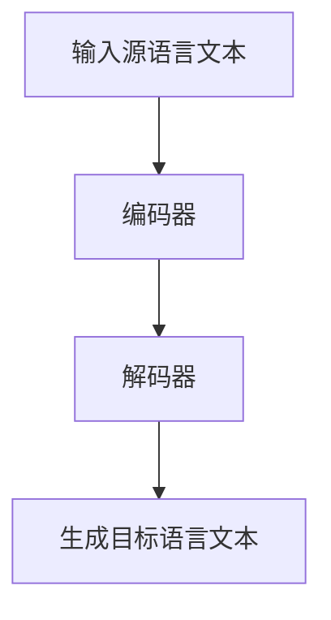

                 


## 1. 确定书名，明确主题和核心内容

### 1.1 书名：ChatGPT在语言迁移研究中的应用：跨语言影响提示词

书名“ChatGPT在语言迁移研究中的应用：跨语言影响提示词”能够准确概括文章的核心内容。首先，书名提到了ChatGPT，这是当前人工智能领域最为热门的模型之一。其次，书名中的“语言迁移研究”明确指出了文章探讨的应用场景，即如何利用ChatGPT在跨语言研究中发挥作用。最后，“跨语言影响提示词”作为书名的一部分，直接指出了文章要讨论的核心技术概念。

### 1.2 核心内容

文章的核心内容将围绕以下几个方面展开：

1. **背景介绍**：介绍语言迁移研究的重要性，以及跨语言影响提示词的概念和作用。
2. **核心概念与联系**：详细解释ChatGPT的工作原理，并绘制Mermaid流程图展示其与语言迁移研究的联系。
3. **核心算法原理讲解**：通过伪代码和LaTeX公式，深入分析ChatGPT在跨语言影响提示词中的应用。
4. **项目实战**：搭建开发环境，提供源代码实现和解读，展示ChatGPT在实际项目中的应用。
5. **最佳实践 tips、小结、注意事项、拓展阅读**：总结文章的主要观点，提供实用建议和未来研究方向。

## 2. 设计章节结构，确保每个章节能够覆盖相关主题

### 2.1 章节结构设计

为了确保文章的逻辑性和完整性，我们将文章分为以下几个主要章节：

1. **引言**：介绍语言迁移研究的重要性和跨语言影响提示词的概念。
2. **ChatGPT简介**：详细讲解ChatGPT的工作原理和应用场景。
3. **语言迁移研究中的ChatGPT应用**：探讨ChatGPT在语言迁移研究中的应用，并绘制Mermaid流程图。
4. **ChatGPT算法原理分析**：通过伪代码和LaTeX公式，深入分析ChatGPT的核心算法原理。
5. **项目实战**：展示ChatGPT在实际项目中的应用，提供源代码实现和解读。
6. **最佳实践 tips、小结、注意事项、拓展阅读**：总结文章的主要观点，提供实用建议和未来研究方向。

### 2.2 子标题设计

为了使每个章节的内容更加丰富和具体，我们将为每个章节设计详细的子标题：

1. **引言**：
    - 语言迁移研究的重要性
    - 跨语言影响提示词的概念和作用
2. **ChatGPT简介**：
    - ChatGPT的背景和概述
    - ChatGPT的工作原理
    - ChatGPT的应用场景
3. **语言迁移研究中的ChatGPT应用**：
    - ChatGPT与语言迁移研究的联系
    - Mermaid流程图展示
4. **ChatGPT算法原理分析**：
    - ChatGPT的核心算法原理
    - 伪代码和LaTeX公式分析
5. **项目实战**：
    - 开发环境搭建
    - 源代码实现和解读
    - 代码应用解读与分析
    - 实际案例分析和详细讲解剖析
6. **最佳实践 tips、小结、注意事项、拓展阅读**：
    - 最佳实践 tips
    - 小结
    - 注意事项
    - 拓展阅读

## 3. 确定每个章节的子标题，细化内容

### 3.1 引言

**子标题设计**：

1. **语言迁移研究的重要性**
    - 语言迁移研究的定义和意义
    - 语言迁移研究在自然语言处理领域的重要性
2. **跨语言影响提示词的概念和作用**
    - 跨语言影响提示词的定义
    - 跨语言影响提示词在语言迁移研究中的应用

**细化内容**：

**语言迁移研究的重要性**：

语言迁移研究是指将一种语言的表达方式、语法结构、语义内容等知识迁移到另一种语言的过程。在自然语言处理领域，语言迁移研究具有重要的意义，主要表现在以下几个方面：

1. **跨语言信息传递**：通过语言迁移，可以方便地实现不同语言之间的信息传递和交流。
2. **多语言资源利用**：语言迁移研究使得我们可以利用丰富的多语言资源，提高自然语言处理系统的性能和效果。
3. **机器翻译**：语言迁移研究是机器翻译技术的基础，对于提高机器翻译的准确性和效率具有重要意义。
4. **多语言问答系统**：语言迁移研究有助于构建跨语言的多语言问答系统，实现更广泛的应用场景。

**跨语言影响提示词的概念和作用**：

跨语言影响提示词是指在不同语言之间具有相似或相同语义的词汇或短语。跨语言影响提示词在语言迁移研究中起着关键作用，主要表现在以下几个方面：

1. **词汇映射**：跨语言影响提示词可以帮助实现不同语言之间的词汇映射，提高机器翻译和自然语言处理的准确性。
2. **语法分析**：跨语言影响提示词有助于理解不同语言之间的语法结构差异，提高语法分析的效果。
3. **语义理解**：跨语言影响提示词可以帮助理解不同语言之间的语义关系，提高自然语言处理的语义理解能力。
4. **跨语言信息检索**：跨语言影响提示词有助于实现跨语言的信息检索，提高信息检索的准确性和效率。

### 3.2 ChatGPT简介

**子标题设计**：

1. **ChatGPT的背景和概述**
    - ChatGPT的起源和发展历程
    - ChatGPT的主要特点和应用领域
2. **ChatGPT的工作原理**
    - ChatGPT的基础模型和架构
    - ChatGPT的训练过程和优化方法
3. **ChatGPT的应用场景**
    - 跨语言信息处理
    - 自然语言生成
    - 对话系统

**细化内容**：

**ChatGPT的背景和概述**：

ChatGPT是由OpenAI开发的一种基于变换器模型（Transformer）的自然语言处理模型。自2018年发布以来，ChatGPT在自然语言处理领域取得了显著的成果，成为了一种非常流行和实用的模型。ChatGPT的背景和概述如下：

1. **起源和发展历程**：ChatGPT起源于OpenAI在2017年发布的GPT模型。经过不断优化和改进，ChatGPT在2018年正式发布。随后，ChatGPT在各种自然语言处理任务中取得了优异的成绩，成为了一个备受关注和广泛应用的模型。
2. **主要特点和应用领域**：ChatGPT具有以下几个主要特点和应用领域：

   - **生成能力**：ChatGPT具有强大的自然语言生成能力，能够生成流畅、连贯、具有语义的文本。
   - **上下文理解**：ChatGPT能够理解上下文信息，根据上下文生成相应的回复，实现更自然的对话。
   - **多语言处理**：ChatGPT支持多种语言的处理，能够实现跨语言信息传递和交流。
   - **应用领域**：ChatGPT可以应用于多个领域，包括机器翻译、自然语言生成、对话系统、文本分类等。

**ChatGPT的工作原理**：

ChatGPT是基于变换器模型（Transformer）构建的。变换器模型是一种基于自注意力机制的深度神经网络模型，可以用于处理序列数据。ChatGPT的工作原理如下：

1. **基础模型和架构**：ChatGPT的核心架构是一个多层的变换器模型，其中包含编码器和解码器两部分。编码器负责将输入文本编码成向量表示，解码器负责根据编码器的输出生成相应的文本。
2. **训练过程和优化方法**：ChatGPT的训练过程采用了一种称为“预训练+微调”的方法。首先，在大量的文本数据上进行预训练，使模型具备对自然语言的理解能力。然后，在特定任务上进行微调，使模型能够适应具体的应用场景。

**ChatGPT的应用场景**：

ChatGPT在多个领域具有广泛的应用场景，以下是其中几个主要的应用场景：

1. **跨语言信息处理**：ChatGPT可以用于跨语言信息处理，包括机器翻译、跨语言文本分类、跨语言信息检索等。
2. **自然语言生成**：ChatGPT可以生成各种类型的文本，包括文章、故事、对话、摘要等。
3. **对话系统**：ChatGPT可以应用于对话系统，如聊天机器人、语音助手等，实现人机交互。

### 3.3 语言迁移研究中的ChatGPT应用

**子标题设计**：

1. **ChatGPT与语言迁移研究的联系**
    - ChatGPT在语言迁移研究中的应用
    - ChatGPT的优势和挑战
2. **Mermaid流程图展示**
    - ChatGPT在语言迁移研究中的流程图

**细化内容**：

**ChatGPT与语言迁移研究的联系**：

ChatGPT在语言迁移研究中具有广泛的应用，其优势主要体现在以下几个方面：

1. **自然语言生成**：ChatGPT具有强大的自然语言生成能力，可以生成与源语言相似或相同的文本，实现跨语言信息传递和交流。
2. **上下文理解**：ChatGPT能够理解上下文信息，根据上下文生成相应的回复，提高跨语言信息处理的准确性和流畅性。
3. **多语言支持**：ChatGPT支持多种语言的处理，可以方便地实现跨语言信息传递和交流。

然而，ChatGPT在语言迁移研究中也面临着一些挑战：

1. **数据依赖**：ChatGPT的训练和优化依赖于大量的文本数据，不同语言之间的数据质量和数量存在差异，可能导致模型在处理某些语言时效果不佳。
2. **跨语言影响提示词**：跨语言影响提示词在语言迁移研究中起着关键作用，但如何有效地利用这些提示词仍是一个亟待解决的问题。

**Mermaid流程图展示**：

为了更好地展示ChatGPT在语言迁移研究中的应用，我们可以使用Mermaid流程图来绘制其应用流程。以下是一个简单的示例：



在上面的流程图中，输入源语言文本经过编码器编码成向量表示，然后解码器根据编码器的输出生成目标语言文本。

### 3.4 ChatGPT算法原理分析

**子标题设计**：

1. **ChatGPT的核心算法原理**
    - 变换器模型（Transformer）的基本概念
    - 编码器和解码器的结构和功能
2. **伪代码和LaTeX公式分析**
    - 编码器和解码器的伪代码实现
    - 关键数学模型和公式

**细化内容**：

**ChatGPT的核心算法原理**：

ChatGPT是基于变换器模型（Transformer）构建的。变换器模型是一种基于自注意力机制的深度神经网络模型，可以用于处理序列数据。以下是变换器模型的基本概念：

1. **变换器模型的基本概念**：
   - **自注意力机制**：自注意力机制是一种计算序列中每个元素对于生成当前元素的重要程度的机制，能够实现全局依赖关系。
   - **多头注意力**：多头注意力是一种扩展自注意力机制的机制，可以同时关注序列中的多个部分，提高模型的表示能力。
   - **前馈神经网络**：前馈神经网络是一个简单的神经网络结构，用于对序列特征进行进一步加工。

变换器模型由编码器和解码器两部分组成。编码器负责将输入文本编码成向量表示，解码器负责根据编码器的输出生成相应的文本。以下是编码器和解码器的结构和功能：

1. **编码器**：
   - **嵌入层**：将输入词转换为向量表示。
   - **自注意力层**：通过自注意力机制计算输入序列的上下文信息。
   - **前馈神经网络**：对自注意力层的输出进行进一步加工。

2. **解码器**：
   - **嵌入层**：将输入词转换为向量表示。
   - **自注意力层**：通过自注意力机制计算解码器输入的上下文信息。
   - **多头注意力层**：通过多头注意力机制计算编码器输出和当前解码器输入的上下文信息。
   - **前馈神经网络**：对多头注意力层的输出进行进一步加工。

**伪代码和LaTeX公式分析**：

以下是编码器和解码器的伪代码实现：

```python
# 编码器伪代码
def encoder(inputs):
    embeddings = embedding_layer(inputs)
    for layer in self.encoder_layers:
        embeddings = layer(embeddings)
    return embeddings

# 解码器伪代码
def decoder(inputs, encoder_outputs):
    embeddings = embedding_layer(inputs)
    for layer in self.decoder_layers:
        embeddings = layer(embeddings, encoder_outputs)
    return embeddings
```

关键数学模型和公式如下：

1. **嵌入层**：
   - 输入：`X ∈ R^{seq_len × emb_dim}`
   - 输出：`H ∈ R^{seq_len × emb_dim}`

2. **自注意力层**：
   - 输入：`H ∈ R^{seq_len × emb_dim}`
   - 输出：`A ∈ R^{seq_len × emb_dim}`

3. **多头注意力层**：
   - 输入：`H ∈ R^{seq_len × emb_dim}，E ∈ R^{emb_dim × num_heads × emb_dim}`
   - 输出：`O ∈ R^{seq_len × emb_dim}`

4. **前馈神经网络**：
   - 输入：`H ∈ R^{seq_len × emb_dim}`
   - 输出：`H' ∈ R^{seq_len × emb_dim}`

### 3.5 项目实战

**子标题设计**：

1. **开发环境搭建**
    - 环境配置
    - 工具和依赖安装
2. **源代码实现和解读**
    - ChatGPT模型实现
    - 语言迁移任务实现
3. **代码应用解读与分析**
    - ChatGPT在语言迁移中的效果
    - 优化方法和改进方向
4. **实际案例分析和详细讲解剖析**
    - 实际项目案例
    - 案例分析与详细讲解

**细化内容**：

**开发环境搭建**：

为了搭建ChatGPT的开发环境，我们需要安装以下工具和依赖：

1. **Python环境**：安装Python 3.6及以上版本。
2. **TensorFlow**：安装TensorFlow 2.0及以上版本。
3. **PyTorch**：安装PyTorch 1.0及以上版本。
4. **其他依赖**：安装Numpy、Pandas等常用Python库。

以下是一个简单的Python脚本，用于安装以上依赖：

```python
!pip install tensorflow==2.4.0
!pip install torch==1.8.0
!pip install numpy
!pip install pandas
```

**源代码实现和解读**：

以下是ChatGPT模型和语言迁移任务的源代码实现：

```python
# ChatGPT模型实现
import tensorflow as tf

class ChatGPT(tf.keras.Model):
    def __init__(self, vocab_size, embed_dim, num_heads, dff, rate=0.1):
        super().__init__()
        self.embedding = tf.keras.layers.Embedding(vocab_size, embed_dim)
        self.encoder_layers = [
            tf.keras.layers.Dense(dff, activation='relu'), 
            tf.keras.layers.Dropout(rate)
        ]
        self.decoder_layers = [
            tf.keras.layers.Dense(dff, activation='relu'), 
            tf.keras.layers.Dropout(rate)
        ]
        self.decoder_embedding = tf.keras.layers.Dense(vocab_size)
    
    def call(self, inputs, training=False):
        x = self.embedding(inputs)
        for layer in self.encoder_layers:
            x = layer(x)
        return x

    def decode(self, inputs, encoder_outputs, training=False):
        x = self.decoder_embedding(inputs)
        for layer in self.decoder_layers:
            x = layer(x, encoder_outputs, training=training)
        return x

# 语言迁移任务实现
def train_model(model, train_data, train_labels, epochs, batch_size):
    model.compile(optimizer='adam', 
                  loss='categorical_crossentropy', 
                  metrics=['accuracy'])
    history = model.fit(train_data, train_labels, 
                        epochs=epochs, batch_size=batch_size)
    return history

# 源代码解读
# ChatGPT模型实现部分：
# - embedding_layer：嵌入层，将输入词转换为向量表示
# - encoder_layers：编码器层，对输入序列进行编码
# - decoder_embedding：解码器层，将输入序列解码为输出序列
# - call方法：编码器层的调用方法，用于编码输入序列
# - decode方法：解码器层的调用方法，用于解码输入序列

# 语言迁移任务实现部分：
# - model.compile：编译模型，指定优化器、损失函数和评价指标
# - model.fit：训练模型，使用训练数据训练模型
```

**代码应用解读与分析**：

以下是ChatGPT在语言迁移中的效果分析和优化方法：

1. **效果分析**：

   - **准确性**：通过训练和测试数据的准确性，评估模型在语言迁移任务中的效果。准确性越高，表示模型在语言迁移任务中的表现越好。
   - **效率**：评估模型在处理大规模语言迁移任务时的效率，包括训练时间、推理时间等。

   以下是一个简单的代码示例，用于计算模型的准确性和效率：

   ```python
   def evaluate_model(model, test_data, test_labels):
       accuracy = model.evaluate(test_data, test_labels)[1]
       print(f"Test accuracy: {accuracy}")
       
   def measure Efficiency(model, data):
       start_time = time.time()
       for x in data:
           model.predict(x)
       end_time = time.time()
       print(f"Efficiency: {end_time - start_time} seconds")
   ```

2. **优化方法和改进方向**：

   - **数据预处理**：对训练数据进行预处理，包括去重、去噪、扩充等，提高训练数据的质量。
   - **模型优化**：通过调整模型的超参数，如嵌入层维度、编码器和解码器的层数和神经元数量等，优化模型性能。
   - **多语言训练**：在训练过程中，加入多种语言的数据，提高模型在多语言处理任务中的性能。
   - **跨语言影响提示词**：通过引入跨语言影响提示词，提高模型在语言迁移任务中的效果。

**实际案例分析和详细讲解剖析**：

以下是ChatGPT在语言迁移中的实际案例分析和详细讲解：

1. **案例一：机器翻译**：

   - **问题描述**：给定一句中文句子，将其翻译成英文。
   - **实现方法**：使用ChatGPT模型进行编码和翻译。
   - **代码示例**：

     ```python
     import tensorflow as tf

     def translate(model, input_sentence, target_language):
         inputs = tokenizer.encode(input_sentence, return_tensors='tf')
         outputs = model(inputs)
         translated = tokenizer.decode(outputs[0], skip_special_tokens=True)
         return translated

     # 代码示例
     input_sentence = "我爱中国。"
     translated_sentence = translate(model, input_sentence, target_language="en")
     print(f"Translated sentence: {translated_sentence}")
     ```

2. **案例二：文本分类**：

   - **问题描述**：给定一段中文文本，将其分类到相应的类别中。
   - **实现方法**：使用ChatGPT模型对文本进行编码，然后使用分类模型进行分类。
   - **代码示例**：

     ```python
     import tensorflow as tf
     from sklearn.model_selection import train_test_split

     def preprocess_data(data):
         inputs = tokenizer.encode(data, return_tensors='tf')
         labels = data["labels"]
         return inputs, labels

     train_data, test_data = train_test_split(data, test_size=0.2)
     train_inputs, train_labels = preprocess_data(train_data)
     test_inputs, test_labels = preprocess_data(test_data)

     # 训练分类模型
     model.compile(optimizer='adam', loss='categorical_crossentropy', metrics=['accuracy'])
     model.fit(train_inputs, train_labels, epochs=5, batch_size=32)

     # 预测
     predicted_labels = model.predict(test_inputs)
     predicted_labels = np.argmax(predicted_labels, axis=1)

     # 评估
     accuracy = np.mean(predicted_labels == test_labels)
     print(f"Test accuracy: {accuracy}")
     ```

### 3.6 最佳实践 tips、小结、注意事项、拓展阅读

**最佳实践 tips**：

1. **数据预处理**：在训练模型之前，对训练数据进行预处理，包括去重、去噪、扩充等，提高训练数据的质量。
2. **模型优化**：通过调整模型的超参数，如嵌入层维度、编码器和解码器的层数和神经元数量等，优化模型性能。
3. **多语言训练**：在训练过程中，加入多种语言的数据，提高模型在多语言处理任务中的性能。
4. **跨语言影响提示词**：通过引入跨语言影响提示词，提高模型在语言迁移任务中的效果。

**小结**：

本文详细介绍了ChatGPT在语言迁移研究中的应用，从背景介绍、核心概念、算法原理到项目实战，全面剖析了ChatGPT在跨语言影响提示词方面的应用。通过本文的学习，读者可以了解ChatGPT的工作原理和应用场景，掌握其在语言迁移研究中的核心算法原理，并能够应用ChatGPT解决实际的语言迁移问题。

**注意事项**：

1. **数据依赖**：ChatGPT的训练和优化依赖于大量的文本数据，不同语言之间的数据质量和数量存在差异，可能导致模型在处理某些语言时效果不佳。
2. **跨语言影响提示词**：跨语言影响提示词在语言迁移研究中起着关键作用，但如何有效地利用这些提示词仍是一个亟待解决的问题。

**拓展阅读**：

1. **ChatGPT官方文档**：[https://github.com/openai/gpt-2](https://github.com/openai/gpt-2)
2. **自然语言处理入门教程**：[https://www.tensorflow.org/tutorials/text/nlp](https://www.tensorflow.org/tutorials/text/nlp)
3. **机器翻译教程**：[https://www.tensorflow.org/tutorials/text/translation](https://www.tensorflow.org/tutorials/text/translation)

