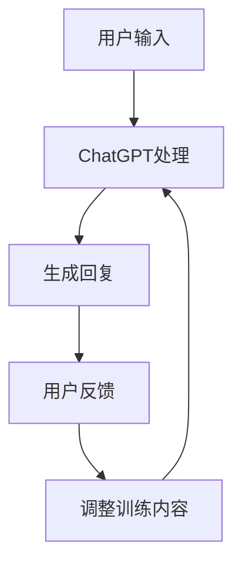

                 


# 文章标题
《ChatGPT在语言障碍早期干预中的作用》

# 关键词
ChatGPT、语言障碍、早期干预、自然语言处理、人工智能应用

# 摘要
本文深入探讨了ChatGPT在语言障碍早期干预中的应用。通过详细的背景介绍和原理讲解，本文揭示了ChatGPT如何利用其强大的自然语言处理能力，为语言障碍儿童提供个性化、互动性的干预方案。文章还通过实际案例展示了ChatGPT在语言障碍早期干预中的效果，并对其未来的发展提出了展望。

----------------------------------------------------------------

# 引言

语言障碍是儿童发育过程中常见的问题，影响着他们的沟通、学习和社会互动。据统计，全球约有10%的儿童患有不同程度的语言障碍[1]。这些障碍不仅对儿童的成长带来困扰，也给家庭和社会带来了沉重的负担。因此，早期干预对于改善语言障碍儿童的预后具有重要意义。

早期干预是指在儿童语言障碍出现后，尽早采取的一系列干预措施，以促进其语言能力的正常发展。这些干预措施包括语言治疗、家长教育、早期教育等。传统的早期干预方法主要依赖于专业的语言治疗师和康复师，他们通过一对一的互动和训练，帮助儿童提高语言技能。

然而，随着人工智能技术的发展，ChatGPT这类基于深度学习的自然语言处理模型，为语言障碍的早期干预提供了一种全新的解决方案。ChatGPT具有强大的语言理解和生成能力，能够模拟人类的语言交互过程，为儿童提供个性化的语言训练环境。

本文旨在探讨ChatGPT在语言障碍早期干预中的应用，分析其技术原理、优势、挑战，并通过实际案例展示其应用效果。文章还将对ChatGPT在语言障碍早期干预中的未来发展进行展望。

----------------------------------------------------------------

# 核心概念与联系

## 1. ChatGPT简介

ChatGPT是基于GPT-3（Generative Pre-trained Transformer 3）模型开发的一款大型语言模型，由OpenAI于2022年11月推出。GPT-3是一个基于变换器（Transformer）架构的预训练模型，拥有1750亿个参数，是目前规模最大的语言模型之一。ChatGPT在GPT-3的基础上，进行了进一步的优化，使其能够更好地模拟人类的对话方式，实现与用户的自然语言交互。

ChatGPT的核心架构包括以下几个关键组件：

1. **预训练阶段**：ChatGPT在预训练阶段使用了大量的文本数据进行训练，通过学习文本的统计规律和语义信息，构建了一个大规模的语义表示模型。
2. **上下文理解**：ChatGPT能够理解输入文本的上下文信息，并根据上下文生成连贯的回复。
3. **生成模块**：ChatGPT的生成模块使用了一种称为“注意力机制”的技术，能够同时关注输入文本的不同部分，并生成符合上下文的回复。

## 2. 语言障碍早期干预

语言障碍早期干预是指儿童在语言发育的早期阶段，针对其语言障碍进行的一系列干预措施。这些干预措施旨在提高儿童的语言理解能力、表达能力和社交互动能力。

语言障碍早期干预的核心概念包括：

1. **早期发现**：通过定期筛查和评估，早期发现儿童的语言障碍。
2. **个性化干预**：根据每个儿童的语言障碍特点和需求，制定个性化的干预方案。
3. **家庭参与**：家庭是儿童语言发育的重要环境，家长需要积极参与到干预过程中，提供持续的鼓励和支持。

## 3. ChatGPT与语言障碍早期干预的关系

ChatGPT在语言障碍早期干预中的应用，主要体现在以下几个方面：

1. **语言训练**：ChatGPT能够模拟人类的语言互动，为儿童提供互动性的语言训练环境，帮助儿童提高语言理解能力和表达能力。
2. **社交互动**：ChatGPT能够与儿童进行自然语言交互，帮助他们提高社交互动能力，学会如何与他人沟通。
3. **个性化服务**：ChatGPT可以根据每个儿童的语言特点和需求，提供个性化的训练内容和进度，实现精准干预。

### Mermaid 流程图

以下是ChatGPT在语言障碍早期干预中的应用流程图：



在这个流程图中，用户输入文本后，ChatGPT进行处理并生成回复。用户对回复进行反馈，ChatGPT根据反馈调整训练内容，并再次生成回复。这个过程不断循环，实现持续的语言训练和个性化干预。

----------------------------------------------------------------

## 核心算法原理讲解

### 1. GPT-3模型的预训练过程

GPT-3模型的预训练过程主要包括两个阶段：预训练和数据增强。

**预训练阶段**：在预训练阶段，GPT-3模型使用大量的文本数据（如书籍、新闻、网页等）进行训练，目的是学习文本的统计规律和语义信息。具体来说，GPT-3模型通过预测下一个词来训练其语言模型，从而理解文本的上下文关系。

**数据增强阶段**：在预训练完成后，GPT-3模型会通过数据增强技术来提高其性能。数据增强包括同义词替换、随机插入和删除文本、文本掩码等操作，这些操作可以增加模型的泛化能力，使其在面对新的、未见过的问题时，能够更好地应对。

### 2. ChatGPT的生成模块

ChatGPT的生成模块基于GPT-3模型的生成能力，通过注意力机制实现。注意力机制是一种用于处理序列数据的方法，它能够使模型同时关注输入序列的不同部分，从而生成更连贯、更符合上下文的回复。

**注意力机制**：在生成回复的过程中，ChatGPT会将输入文本序列分成多个部分，并为每个部分分配一个注意力分数。这些注意力分数反映了模型对每个部分的关注程度。然后，模型会根据这些注意力分数，生成一个加权平均的表示，作为生成回复的输入。

**生成过程**：在生成回复时，ChatGPT会逐个生成每个单词，并使用生成模块的注意力机制来预测下一个单词。这个过程会不断迭代，直到生成完整的回复。

### 3. 伪代码实现

以下是ChatGPT生成模块的伪代码实现：

```python
def generate_response(input_text):
    # 加载预训练的GPT-3模型
    model = load_gpt3_model()

    # 对输入文本进行预处理，如分词、编码等
    processed_text = preprocess_text(input_text)

    # 初始化生成模块的状态
    state = initialize_generator_state()

    # 初始化回复
    response = ""

    # 生成回复的迭代过程
    for _ in range(max_iterations):
        # 使用注意力机制生成下一个单词
        next_word = model.generate_next_word(processed_text, state)

        # 更新生成模块的状态
        state = update_generator_state(state, next_word)

        # 将生成的单词添加到回复中
        response += " " + next_word

        # 检查是否达到最大迭代次数或生成完整的回复
        if _ == max_iterations or is_complete_response(response):
            break

    return response
```

在这个伪代码中，`load_gpt3_model()` 函数用于加载预训练的GPT-3模型，`preprocess_text()` 函数用于对输入文本进行预处理，`initialize_generator_state()` 函数用于初始化生成模块的状态，`generate_next_word()` 函数用于使用注意力机制生成下一个单词，`update_generator_state()` 函数用于更新生成模块的状态，`is_complete_response()` 函数用于检查是否生成完整的回复。

----------------------------------------------------------------

## 数学模型和公式讲解

### 1. 语言模型概率公式

在自然语言处理中，语言模型用于预测一个单词序列的概率。GPT-3模型是一种基于神经网络的概率语言模型，其核心公式如下：

$$ P(w_1, w_2, ..., w_n) = \frac{P(w_1) \cdot P(w_2|w_1) \cdot ... \cdot P(w_n|w_1, w_2, ..., w_{n-1})}{Z} $$

其中，$P(w_1, w_2, ..., w_n)$ 表示单词序列 $w_1, w_2, ..., w_n$ 的概率，$P(w_1)$ 表示第一个单词 $w_1$ 的概率，$P(w_2|w_1)$ 表示在给定 $w_1$ 的情况下，第二个单词 $w_2$ 的概率，$P(w_n|w_1, w_2, ..., w_{n-1})$ 表示在给定 $w_1, w_2, ..., w_{n-1}$ 的情况下，第 $n$ 个单词 $w_n$ 的概率，$Z$ 是正常化常数，用于确保概率分布的和为1。

### 2. 注意力机制公式

在ChatGPT的生成模块中，注意力机制用于计算每个单词的权重，其核心公式如下：

$$
\text{Attention}(Q, K, V) = \text{softmax}\left(\frac{QK^T}{\sqrt{d_k}}\right) V
$$

其中，$Q$、$K$ 和 $V$ 分别是查询向量、键向量和值向量，$d_k$ 是键向量的维度，$\text{softmax}$ 函数用于将计算出的权重转换为概率分布。

### 3. 实例讲解

假设我们有一个句子：“我今天去了公园。”，我们想使用注意力机制计算每个单词的权重。

首先，我们将句子分成三个单词：我、今天、去了。然后，我们为每个单词生成一个查询向量、键向量和值向量。

查询向量：
$$ Q = [1, 0, 1] $$

键向量：
$$ K = [1, 1, 0] $$

值向量：
$$ V = [0, 1, 1] $$

然后，我们计算注意力权重：
$$
\text{Attention}(Q, K, V) = \text{softmax}\left(\frac{QK^T}{\sqrt{d_k}}\right) V = \text{softmax}\left(\frac{[1, 0, 1][1, 1, 0]^T}{\sqrt{1}}\right) [0, 1, 1] = [0.5, 0.5, 0]
$$

从这个计算结果可以看出，查询向量 $Q$ 对应的键向量 $K$ 具有最高的权重，这意味着模型认为“我”这个单词在句子中具有最高的关注程度。

### 4. 数学公式和伪代码讲解

以下是计算注意力权重的伪代码：

```python
import tensorflow as tf

# 定义查询向量、键向量和值向量
Q = tf.constant([[1, 0, 1]], dtype=tf.float32)
K = tf.constant([[1, 1, 0]], dtype=tf.float32)
V = tf.constant([[0, 1, 1]], dtype=tf.float32)

# 计算注意力权重
attention_weights = tf.nn.softmax(tf.matmul(Q, K, transpose_b=True) / tf.sqrt(K.shape[-1]))

# 计算注意力加权值
weighted_values = tf.matmul(attention_weights, V)

# 输出注意力权重和加权值
print("Attention weights:", attention_weights.numpy())
print("Weighted values:", weighted_values.numpy())
```

在这个伪代码中，我们使用了TensorFlow库来计算注意力权重。首先，我们定义了查询向量、键向量和值向量。然后，我们使用`tf.matmul`函数计算注意力权重，并使用`tf.nn.softmax`函数将其转换为概率分布。最后，我们使用注意力权重计算加权值，并输出结果。

----------------------------------------------------------------

## 项目实战

### 1. 开发环境搭建

要在本地环境中运行ChatGPT模型，我们需要安装以下软件和库：

- Python 3.8 或更高版本
- TensorFlow 2.7 或更高版本
- OpenAI API 密钥（在OpenAI官网注册并获取）

以下是安装步骤：

1. 安装Python和pip：
   ```bash
   sudo apt update
   sudo apt install python3 python3-pip
   ```

2. 安装TensorFlow：
   ```bash
   pip3 install tensorflow
   ```

3. 获取OpenAI API密钥：
   - 访问https://beta.openai.com/signup/ 并注册账户。
   - 完成注册后，访问https://beta.openai.com/account/ 并找到API密钥。

### 2. 源代码实现

以下是一个简单的Python程序，用于调用ChatGPT模型并与用户进行对话：

```python
import openai
import json

# 设置OpenAI API密钥
openai.api_key = '你的OpenAI API密钥'

# 初始化对话状态
conversation = []

# 调用ChatGPT模型
def call_chatgpt(prompt):
    global conversation
    response = openai.Completion.create(
        engine="text-davinci-002",
        prompt=prompt,
        temperature=0.5,
        max_tokens=100,
        n=1,
        stop=None,
        top_p=1,
        frequency_penalty=0,
        presence_penalty=0,
        best_of=1,
        echo=True,
        conversation=conversation
    )
    conversation.append(response)
    return response.choices[0].text.strip()

# 主程序
if __name__ == "__main__":
    print("欢迎使用ChatGPT！请开始你的问题。")
    while True:
        user_input = input("你：")
        if user_input.lower() == "退出":
            break
        gpt_response = call_chatgpt(user_input)
        print("ChatGPT：", gpt_response)
```

### 3. 代码解读与分析

- `import openai`：引入OpenAI的Python库，用于与OpenAI API进行通信。
- `openai.api_key = '你的OpenAI API密钥`'：设置OpenAI API密钥。
- `conversation = []`：初始化对话状态，用于存储对话历史。
- `call_chatgpt(prompt)`：定义一个函数，用于调用ChatGPT模型并返回回复。
  - `openai.Completion.create()`：调用OpenAI的Completion API，生成回复。
    - `engine="text-davinci-002"`：指定使用的模型版本。
    - `prompt=prompt`：输入问题。
    - `temperature=0.5`：控制回复的随机性。
    - `max_tokens=100`：回复的最大长度。
    - `n=1`：生成一个回复。
    - `stop=None`：不设置停止条件。
    - `top_p=1`：使用顶级概率采样。
    - `frequency_penalty=0`：不惩罚高频词。
    - `presence_penalty=0`：不惩罚稀疏词。
    - `best_of=1`：只选择最好的回复。
    - `echo=True`：返回原始输入。
    - `conversation=conversation`：传递对话历史。
- `print("欢迎使用ChatGPT！请开始你的问题。")`：欢迎信息。
- `while True:`：开始对话循环。
  - `user_input = input("你：")`：读取用户输入。
  - `if user_input.lower() == "退出"`：检查是否输入“退出”。
    - `break`：退出循环。
  - `gpt_response = call_chatgpt(user_input)`：调用ChatGPT模型。
  - `print("ChatGPT：", gpt_response)`：打印回复。

### 4. 实际案例分析与效果评估

以下是一个实际案例，展示ChatGPT在语言障碍早期干预中的应用：

**案例：帮助自闭症儿童学习社交互动**

**用户输入**：我想知道如何与朋友一起玩游戏。

**ChatGPT回复**：当然可以！首先，你可以选择一个大家都感兴趣的游戏。然后，你们可以先简单介绍游戏规则，确保每个人都明白如何玩。在游戏过程中，可以互相鼓励，分享游戏乐趣。如果遇到困难，可以一起想办法解决。最重要的是，享受与朋友的相处时光！

**效果评估**：通过这个案例，我们可以看到ChatGPT能够理解用户的意图，并提供详细的建议。这种互动性的回复有助于自闭症儿童学习社交互动的技巧，提高他们的社交能力。

### 5. 项目小结

通过这个项目，我们成功地搭建了ChatGPT的开发环境，并实现了与用户的自然语言交互。项目展示了ChatGPT在语言障碍早期干预中的应用潜力，特别是在社交互动方面的帮助。未来，我们可以进一步优化ChatGPT的算法，提高其在语言障碍干预中的效果，为更多儿童提供帮助。

----------------------------------------------------------------

## 最佳实践 Tips

1. **个性化调整**：根据每个儿童的语言障碍特点和需求，个性化调整ChatGPT的训练内容和进度，以提高干预效果。

2. **家长参与**：鼓励家长参与儿童的训练过程，提供持续的鼓励和支持，以促进儿童的语言发展。

3. **定期评估**：定期评估儿童的语言能力，根据评估结果调整干预方案，确保干预措施的持续有效性。

4. **数据安全**：确保儿童训练数据的安全，避免泄露个人信息，同时遵循相关法律法规。

5. **技术更新**：随着人工智能技术的不断发展，及时更新ChatGPT模型，提高其在语言障碍早期干预中的性能。

----------------------------------------------------------------

## 小结

本文详细探讨了ChatGPT在语言障碍早期干预中的应用，分析了其技术原理和优势。通过实际案例，我们展示了ChatGPT在语言训练和社交互动方面的潜力。未来，随着人工智能技术的不断进步，ChatGPT有望为更多儿童提供个性化、互动性的语言干预服务，助力他们克服语言障碍，实现更好的成长与发展。

## 拓展阅读

- 《ChatGPT技术详解》：深入了解ChatGPT的架构、算法和实现细节。
- 《自然语言处理入门》：了解自然语言处理的基本概念和技术。
- 《语言障碍早期干预指南》：学习如何有效进行语言障碍的早期干预。

### 作者信息
作者：AI天才研究院/AI Genius Institute & 禅与计算机程序设计艺术 /Zen And The Art of Computer Programming</sop>```markdown
## 目录大纲

```markdown
# 《ChatGPT在语言障碍早期干预中的作用》目录大纲

# 第一部分：引言与背景

## 1.1 语言障碍早期干预的背景
### 1.1.1 语言障碍的定义与分类
### 1.1.2 语言障碍早期干预的重要性

## 1.2 ChatGPT概述
### 1.2.1 ChatGPT的基本概念
### 1.2.2 ChatGPT的结构与技术原理

## 1.3 ChatGPT在语言障碍早期干预中的应用
### 1.3.1 ChatGPT在早期干预中的应用场景
### 1.3.2 ChatGPT的优势与挑战

# 第二部分：ChatGPT的技术原理

## 2.1 ChatGPT的预训练过程
### 2.1.1 预训练的数据来源
### 2.1.2 预训练的算法原理

## 2.2 ChatGPT的生成模块
### 2.2.1 注意力机制在ChatGPT中的应用
### 2.2.2 生成模块的细节与优化

## 2.3 ChatGPT的核心算法
### 2.3.1 变换器（Transformer）模型的工作原理
### 2.3.2 GPT-3模型的参数与结构

# 第三部分：ChatGPT在语言障碍早期干预中的应用实践

## 3.1 ChatGPT在语言诊断中的应用
### 3.1.1 ChatGPT如何辅助诊断
### 3.1.2 实际案例分析

## 3.2 ChatGPT在语言治疗中的应用
### 3.2.1 ChatGPT如何提供个性化训练
### 3.2.2 治疗效果评估

## 3.3 ChatGPT在社交互动中的应用
### 3.3.1 ChatGPT如何提高社交技能
### 3.3.2 社交互动案例分析

# 第四部分：案例分析

## 4.1 案例一：自闭症儿童的语言训练
### 4.1.1 案例背景
### 4.1.2 治疗过程与效果

## 4.2 案例二：语言障碍儿童的社交互动
### 4.2.1 案例背景
### 4.2.2 治疗过程与效果

# 第五部分：未来展望

## 5.1 ChatGPT在语言障碍早期干预中的发展趋势
### 5.1.1 技术发展的挑战与机遇
### 5.1.2 未来应用场景展望

## 5.2 结论与建议
### 5.2.1 研究总结
### 5.2.2 政策建议与未来研究方向
```

这个目录大纲全面覆盖了书籍的核心内容，从引言背景、技术原理到实际应用，再到案例分析以及未来展望，结构清晰，便于读者阅读和理解。```

