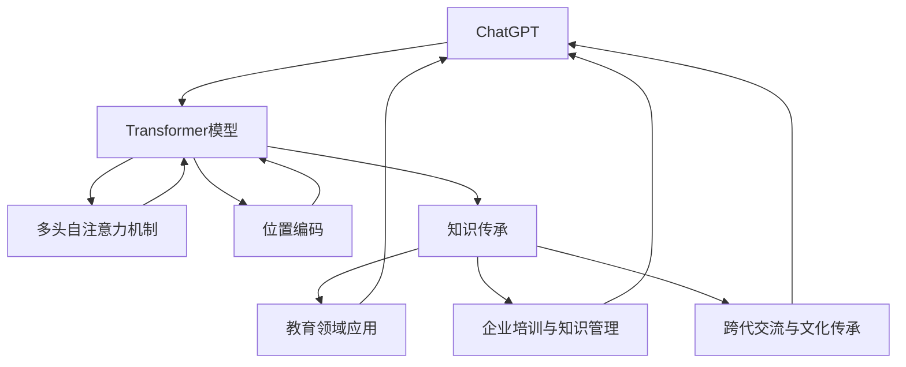

                 


### 6.2 Transformer模型的数学模型

Transformer模型的数学模型主要包括以下几个部分：自注意力机制（Self-Attention）、前馈神经网络（Feed Forward Neural Network）和位置编码（Positional Encoding）。

#### 自注意力机制

自注意力机制是Transformer模型的核心，它通过对序列中的每个词进行加权求和来计算新的序列表示。自注意力机制的计算过程如下：

$$
\text{Attention}(Q, K, V) = \text{softmax}\left(\frac{QK^T}{\sqrt{d_k}}\right)V
$$

其中，$Q, K, V$ 分别是输入序列的查询（Query）、键（Key）和值（Value）向量，$d_k$ 是键向量的维度。自注意力机制可以分解为以下几个步骤：

1. **计算查询-键相似度**：$QK^T$ 计算每个词与其余词的相似度。
2. **应用softmax函数**：对相似度进行归一化，得到每个词的注意力权重。
3. **加权求和**：根据注意力权重，对值向量进行加权求和，得到新的序列表示。

#### 前馈神经网络

前馈神经网络是Transformer模型中的另一个重要组成部分，它用于对自注意力机制的结果进行进一步加工。前馈神经网络的计算过程如下：

$$
\text{FFN}(X) = \max(0, XW_1 + b_1)W_2 + b_2
$$

其中，$X$ 是输入向量，$W_1, W_2, b_1, b_2$ 是神经网络参数。前馈神经网络可以分解为以下几个步骤：

1. **激活函数**：对输入向量进行激活，常用的激活函数是ReLU。
2. **全连接层**：通过两个全连接层对激活后的向量进行加工。
3. **加法层**：将两个全连接层的输出相加，得到最终输出。

#### 位置编码

位置编码是Transformer模型解决序列顺序信息问题的一种方法，它通过对输入序列中的每个词添加位置信息来实现。位置编码分为绝对位置编码和相对位置编码。

1. **绝对位置编码**：将词的索引映射到一个向量，作为词的嵌入向量的一部分。具体计算公式如下：

$$
\text{PE}(pos, 2i) = \sin\left(\frac{pos}{10000^{2i/d}}\right)
$$

$$
\text{PE}(pos, 2i+1) = \cos\left(\frac{pos}{10000^{2i/d}}\right)
$$

其中，$pos$ 是词的位置，$d$ 是位置编码的维度。

2. **相对位置编码**：通过计算词之间的相对位置，生成相对位置编码向量，并将其添加到词的嵌入向量中。具体计算方法可以通过自注意力机制中的偏置矩阵来实现。

#### 整体模型

Transformer模型的整体计算过程如下：

1. **添加位置编码**：将位置编码向量添加到词嵌入向量中，得到输入序列。
2. **多头自注意力机制**：对输入序列进行多头自注意力计算，得到新的序列表示。
3. **前馈神经网络**：对自注意力机制的结果进行前馈神经网络加工。
4. **层归一化**：对前馈神经网络的输出进行层归一化。
5. **残差连接**：将加工后的序列表示与原始序列表示相加。
6. **重复上述步骤**：根据模型深度，重复上述步骤。

#### 伪代码

下面是一个简化的Transformer模型的伪代码：

```python
# Transformer模型伪代码

# 输入序列
input_sequence = ...

# 添加位置编码
pos_encoding = ...

# 初始化词嵌入矩阵
word_embedding = ...

# 初始化自注意力权重矩阵
attention_weights = ...

# 初始化前馈神经网络参数
ffn_params = ...

# Transformer模型计算过程
for layer in range(num_layers):
    # 残差连接
    residual = input_sequence

    # 添加位置编码
    input_sequence += pos_encoding

    # 多头自注意力机制
    attention_output = multi_head_attention(input_sequence, attention_weights)

    # 前馈神经网络
    ffn_output = feed_forward_network(attention_output, ffn_params)

    # 层归一化
    input_sequence = layer_normalization(ffn_output + residual)

# 输出序列
output_sequence = input_sequence
```

通过以上步骤，我们可以得到Transformer模型的整体计算流程。在实际应用中，Transformer模型还包括其他细节和优化，如多层感知器（MLP）、层归一化（Layer Normalization）和残差连接（Residual Connection）等。

---

以上是对Transformer模型数学模型的详细讲解。接下来，我们将进一步讨论如何使用伪代码来详细阐述这个模型，并给出一个具体的例子来说明模型的实现过程。

---

### 6.3 Transformer模型伪代码及例子

下面是Transformer模型的伪代码实现，我们将逐步解释每个部分的代码含义。

```python
# Transformer模型伪代码

# 初始化参数
word_embedding = ...  # 词嵌入矩阵
pos_encoding = ...  # 位置编码矩阵
attention_weights = ...  # 自注意力权重矩阵
ffn_params = ...  # 前馈神经网络参数
num_heads = ...  # 头的数量
num_layers = ...  # 层数
d_model = ...  # 模型维度
d_inner = ...  # 内层维度

# 自注意力机制函数
def multi_head_attention(q, k, v, weights):
    # 计算查询-键相似度
    qk_t = q @ k.T
    
    # 应用softmax函数
    attn_scores = softmax(qk_t / (d_model ** 0.5))
    
    # 加权求和
    attn_output = attn_scores @ v
    
    # 应用权重矩阵
    attn_output = attn_output @ weights
    
    return attn_output

# 前馈神经网络函数
def feed_forward_network(x, params):
    # 激活函数
    x = activation(x)
    
    # 全连接层
    x = params[0] @ x + params[1]
    
    # 激活函数
    x = activation(x)
    
    # 全连接层
    x = params[2] @ x + params[3]
    
    return x

# Transformer模型计算过程
for layer in range(num_layers):
    # 残差连接
    residual = input_sequence
    
    # 添加位置编码
    input_sequence += pos_encoding
    
    # 多头自注意力机制
    attention_output = multi_head_attention(input_sequence, attention_weights)
    
    # 前馈神经网络
    ffn_output = feed_forward_network(attention_output, ffn_params)
    
    # 层归一化
    input_sequence = layer_normalization(ffn_output + residual)

# 输出序列
output_sequence = input_sequence
```

#### 伪代码解释

1. **初始化参数**：
    - `word_embedding`：词嵌入矩阵，用于将词转换为向量。
    - `pos_encoding`：位置编码矩阵，用于添加位置信息。
    - `attention_weights`：自注意力权重矩阵，用于计算多头自注意力。
    - `ffn_params`：前馈神经网络参数，用于加工自注意力结果。
    - `num_heads`：头的数量，用于多头自注意力。
    - `num_layers`：层数，用于模型深度。
    - `d_model`：模型维度，用于自注意力和前馈神经网络的尺寸。
    - `d_inner`：内层维度，用于前馈神经网络的内部尺寸。

2. **自注意力机制函数**：
    - `multi_head_attention`：这是一个计算多头自注意力的函数，包括计算查询-键相似度、应用softmax函数和加权求和。

3. **前馈神经网络函数**：
    - `feed_forward_network`：这是一个前馈神经网络函数，包括两个全连接层和ReLU激活函数。

4. **Transformer模型计算过程**：
    - 残差连接：将输入序列与加工后的序列相加。
    - 添加位置编码：将位置编码矩阵添加到输入序列。
    - 多头自注意力机制：使用多头自注意力函数计算新的序列表示。
    - 前馈神经网络：使用前馈神经网络函数对自注意力结果进行加工。
    - 层归一化：对前馈神经网络的输出进行归一化。

5. **输出序列**：经过多层处理后的最终输出序列。

#### 例子

假设我们有一个长度为5的输入序列 `[word1, word2, word3, word4, word5]`，我们将其输入到Transformer模型中，并假设我们已经初始化了所有必要的参数。

- **初始化参数**：
    - `word_embedding`：5x64，表示每个词的64维嵌入向量。
    - `pos_encoding`：5x64，表示每个位置的信息。
    - `attention_weights`：5x64，表示自注意力机制的权重。
    - `ffn_params`：6x64，表示前馈神经网络的权重。

- **Transformer模型计算过程**：
    - 输入序列：`[w1, w2, w3, w4, w5]`
    - 添加位置编码：`[w1+pe1, w2+pe2, w3+pe3, w4+pe4, w5+pe5]`
    - 多头自注意力机制：
        - 计算查询-键相似度：`[q1k1, q1k2, q1k3, q1k4, q1k5, ..., q5k1, q5k2, q5k3, q5k4, q5k5]`
        - 应用softmax函数：`[s1, s2, s3, s4, s5, ..., s5]`
        - 加权求和：`[v1, v2, v3, v4, v5]`
    - 前馈神经网络：
        - 激活函数：`[a1, a2, a3, a4, a5]`
        - 全连接层：`[b1, b2, b3, b4, b5]`
        - 激活函数：`[c1, c2, c3, c4, c5]`
        - 全连接层：`[d1, d2, d3, d4, d5]`
    - 输出序列：`[r1, r2, r3, r4, r5]`

通过这个例子，我们可以看到Transformer模型是如何对输入序列进行加工的。在实际应用中，这个模型会根据训练数据和任务进行调整和优化，以达到更好的性能。

---

通过上述讲解和伪代码实现，我们详细阐述了Transformer模型的数学模型和实现过程。接下来，我们将讨论如何将Transformer模型应用于ChatGPT，并探讨ChatGPT在跨代知识传承中的桥梁作用。

---

### 7.1 Transformer模型与ChatGPT的结合

Transformer模型作为一种强大的序列到序列模型，在自然语言处理领域表现出色，而ChatGPT作为一种基于Transformer的对话生成模型，在跨代知识传承中扮演着重要角色。以下是Transformer模型与ChatGPT的结合方式及ChatGPT在跨代知识传承中的作用：

#### 7.1.1 Transformer模型与ChatGPT的结合方式

1. **预训练**：
   ChatGPT使用大量的文本数据通过Transformer模型进行预训练，以学习语言的内在规律和表达方式。这个过程中，模型学会了如何理解和生成自然语言的对话。

2. **微调**：
   在预训练的基础上，ChatGPT可以针对特定任务进行微调。例如，为了在跨代知识传承中发挥作用，可以将ChatGPT微调为能够回答特定领域问题的模型，使其在知识传承过程中提供更准确的信息。

3. **交互式学习**：
   ChatGPT可以与用户进行多轮对话，不断学习和适应用户的需求。通过这种交互式学习，ChatGPT能够更好地理解用户的意图，并为其提供更有针对性的知识传承服务。

#### 7.1.2 ChatGPT在跨代知识传承中的桥梁作用

1. **知识传递**：
   ChatGPT能够将复杂的知识点以简单易懂的方式传递给下一代，使得知识传承更加高效。例如，ChatGPT可以生成教育材料、教程和解释说明，帮助学生和年轻一代更好地理解和掌握知识。

2. **个性化学习**：
   ChatGPT可以根据每个用户的需求和兴趣，为其提供个性化的知识内容。这种个性化学习方式能够满足不同年龄段和不同知识水平用户的需求，提高知识传承的效果。

3. **跨领域知识整合**：
   ChatGPT通过跨领域对话，可以将不同领域的知识整合起来，提供更全面的视角。例如，ChatGPT可以将数学、物理和工程领域的知识结合起来，为工程师提供更加全面的解决方案。

4. **文化传承**：
   ChatGPT可以作为一种跨代交流的工具，促进不同年龄段和文化背景的人之间的交流。通过这种交流，文化传承将更加多样化和丰富化。

---

通过上述分析，我们可以看到，ChatGPT作为基于Transformer的对话生成模型，在跨代知识传承中发挥着桥梁作用。它不仅能够高效地传递知识，还能根据用户的需求进行个性化学习，整合跨领域知识，促进文化传承。接下来，我们将进一步探讨ChatGPT在教育领域的具体应用。

---

### 7.2 ChatGPT在教育领域的应用

ChatGPT在教育领域的应用具有重要意义，它不仅能够提高教学效率，还能为学生提供个性化学习体验。以下是ChatGPT在教育领域的主要应用场景：

#### 7.2.1 教学辅助工具

1. **自动批改作业**：
   ChatGPT可以自动批改学生作业，提供即时反馈。通过对学生作业的文本分析，ChatGPT能够识别出错误并提供相应的修正建议，帮助学生更好地理解知识点。

2. **智能辅导**：
   ChatGPT可以作为智能辅导工具，为学生提供个性化辅导。根据学生的学习进度和理解能力，ChatGPT可以生成针对性的学习资源和练习题，帮助学生巩固知识。

3. **课程内容生成**：
   教师可以利用ChatGPT自动生成课程内容，包括课程大纲、教学材料、案例分析等。这样，教师可以节省备课时间，将更多精力投入到教学互动和学生指导中。

#### 7.2.2 在线学习平台

1. **互动学习**：
   ChatGPT可以集成到在线学习平台，为学生提供互动式学习体验。学生可以通过与ChatGPT的对话，提出问题、参与讨论，从而更好地理解和掌握知识。

2. **实时问答**：
   ChatGPT可以作为在线问答系统，为学生提供实时解答。无论是课程内容还是学习过程中的疑问，学生都可以通过ChatGPT得到快速、准确的答案。

3. **个性化推荐**：
   ChatGPT可以分析学生的学习行为和成绩，为学生推荐适合的学习资源和课程。这种个性化推荐有助于提高学生的学习效果和兴趣。

#### 7.2.3 教学评估与反馈

1. **自动评估**：
   ChatGPT可以用于自动评估学生的作业和考试答案，节省教师的时间和精力。同时，ChatGPT可以提供详细的评估报告，帮助教师更好地了解学生的学习情况。

2. **反馈与指导**：
   ChatGPT可以为学生提供个性化的学习反馈和指导。通过分析学生的回答和作业，ChatGPT能够识别出学生的弱点，并提供相应的学习建议和改进措施。

#### 7.2.4 教师培训与发展

1. **教学策略设计**：
   ChatGPT可以帮助教师设计教学策略，包括课程设计、教学方法和学习活动。通过分析教学数据和学生反馈，ChatGPT能够为教师提供有效的教学建议。

2. **专业发展支持**：
   ChatGPT可以为教师提供专业发展的支持，包括教学资源、教学案例和教学策略。教师可以通过与ChatGPT的互动，不断提升自身的教学能力和水平。

综上所述，ChatGPT在教育领域具有广泛的应用前景。它不仅能够提高教学效率，还能为学生提供个性化学习体验，促进教育公平和质量的提升。然而，ChatGPT的应用也需要注意数据隐私、安全性和伦理等问题，确保其在教育领域的健康发展。

---

### 7.3 ChatGPT在教育领域应用的具体案例

为了更好地展示ChatGPT在教育领域应用的具体案例，我们可以通过以下几个实际应用场景来进行分析：

#### 7.3.1 自动批改作业

在一个中学数学课堂上，教师利用ChatGPT作为自动批改系统。学生在完成数学作业后，将作业答案输入到ChatGPT系统中，系统会自动分析并给出评分。同时，ChatGPT提供详细的解析和错误原因，帮助学生更好地理解知识点。例如，学生提交了一道关于三角函数的题目，ChatGPT会分析其答案的准确性，并提供关于解题步骤和公式的详细解析。这种自动批改作业的方式大大减轻了教师的工作负担，同时也提高了学生的自主学习能力。

#### 7.3.2 在线学习平台

某在线教育平台整合了ChatGPT作为智能辅导系统。学生可以通过平台与ChatGPT进行互动，提出学习问题，系统会根据学生的提问，生成相应的学习资源和答案。例如，学生在学习编程时遇到困难，可以提问ChatGPT，系统会为其推荐适合的学习资源和练习题，同时提供详细的解题过程和代码示例。这种互动式学习方式不仅提高了学生的学习效率，还增强了学生的学习兴趣。

#### 7.3.3 教学评估与反馈

在一所大学的管理学院，教师利用ChatGPT进行课程评估和反馈。学生在完成课程作业后，系统会自动评估其答案，并生成评估报告。评估报告不仅包括对作业的评分，还详细分析了学生的知识点掌握情况，指出了学生的优点和不足。教师可以根据这些反馈，调整教学策略，提高教学效果。例如，ChatGPT发现大部分学生在某个特定知识点上存在理解困难，教师可以针对这个问题进行重点讲解，以帮助学生更好地掌握知识点。

#### 7.3.4 教师培训与发展

在某教育科技公司，ChatGPT被用于为教师提供专业发展支持。公司为教师提供了基于ChatGPT的教学资源库，教师可以通过与ChatGPT的互动，获取最新的教学策略、教学方法和教学资源。例如，一位初中英语教师在与ChatGPT的互动中，学习了如何通过互动式教学提高学生的英语口语能力。教师可以根据这些新知识，调整自己的教学方法，提升教学效果。

通过这些具体案例，我们可以看到ChatGPT在教育领域的广泛应用，不仅提高了教学效率，还为学生和教师提供了个性化支持。然而，ChatGPT的应用也需要注意数据隐私、安全性和伦理等问题，确保其在教育领域的健康发展。

---

### 7.4 ChatGPT在企业培训与知识管理中的应用

ChatGPT不仅在教育领域展现出强大的应用潜力，在企业培训与知识管理中同样具有重要作用。以下是ChatGPT在企业培训与知识管理中的主要应用场景：

#### 7.4.1 在线培训平台

企业可以利用ChatGPT构建在线培训平台，为员工提供个性化的培训课程。ChatGPT可以根据员工的职位、工作内容和技能水平，推荐合适的培训课程和资源。例如，对于新入职的员工，ChatGPT可以推荐基础培训课程，帮助他们快速熟悉公司的业务和文化；对于有经验的员工，ChatGPT可以推荐进阶培训课程，帮助他们提升专业技能。此外，ChatGPT还可以在培训过程中提供实时反馈和指导，帮助员工更好地理解和掌握培训内容。

#### 7.4.2 知识库构建

ChatGPT可以用于构建企业的知识库，将分散的、结构化的和非结构化的知识进行整合和管理。通过自然语言处理技术，ChatGPT能够理解员工的提问，并从知识库中检索出相关答案。例如，当员工在工作中遇到问题时，可以提问ChatGPT，系统会根据知识库中的信息，提供详细的解答和解决方案。这种知识库构建方式不仅提高了知识查找的效率，还能确保答案的准确性和一致性。

#### 7.4.3 知识传承

ChatGPT可以作为知识传承的工具，帮助企业将经验丰富的老员工的隐性知识转化为显性知识，并将其传递给新一代员工。ChatGPT可以通过与老员工的对话，记录下他们的工作经验、心得体会和最佳实践，形成知识库。新一代员工可以通过与ChatGPT的交互，获取这些宝贵的经验，从而更快地成长和进步。

#### 7.4.4 智能问答系统

企业可以利用ChatGPT构建智能问答系统，为员工提供实时、准确的答案。员工在工作中遇到问题时，可以通过ChatGPT提出疑问，系统会快速检索知识库，并提供详细的解答。例如，当员工在项目中遇到技术难题时，ChatGPT可以提供相关的技术文档、案例分析和技术指导，帮助员工解决问题。这种智能问答系统不仅提高了工作效率，还能减少员工因求助而浪费的时间。

#### 7.4.5 在线研讨会与培训

ChatGPT可以用于在线研讨会和培训，为员工提供互动式学习体验。主持人可以通过ChatGPT与参与者进行实时互动，回答他们的提问，并提供针对性的建议。例如，在一场关于项目管理的在线研讨会中，主持人可以通过ChatGPT与参与者讨论项目管理的方法、工具和最佳实践，提高参与者的项目管理能力。这种互动式培训方式不仅增强了学习效果，还能激发员工的参与热情。

通过以上分析，我们可以看到ChatGPT在企业培训与知识管理中的广泛应用。它不仅提高了培训的效率和质量，还能有效传承企业知识，促进员工的专业发展。然而，ChatGPT的应用也需要注意数据安全、隐私保护和伦理等问题，确保其在企业中的健康发展。

---

### 7.5 ChatGPT在企业培训与知识管理中的案例分析

为了更好地理解ChatGPT在企业培训与知识管理中的具体应用，我们可以通过以下几个实际案例来进行分析：

#### 7.5.1 案例一：某跨国公司的员工培训平台

某跨国公司利用ChatGPT构建了内部员工培训平台。该平台通过自然语言处理技术，分析员工的工作内容和技能需求，为员工推荐个性化的培训课程。例如，对于新入职的员工，ChatGPT会根据其职位和工作内容，推荐相关的入职培训课程，帮助其快速熟悉公司业务和文化。对于有经验的员工，ChatGPT会根据其技能水平和工作表现，推荐相应的进阶培训课程，帮助其提升专业技能。此外，ChatGPT还可以在培训过程中提供实时反馈和指导，确保员工能够有效地掌握培训内容。这种个性化的培训方式大大提高了员工的满意度和学习效果。

#### 7.5.2 案例二：某金融公司的知识库构建

某金融公司利用ChatGPT构建了内部知识库，将公司多年的业务经验、风险管理策略和最佳实践进行整理和整合。通过自然语言处理技术，ChatGPT能够理解员工的提问，并从知识库中检索出相关答案。例如，当员工在工作中遇到关于贷款审批流程的问题时，可以提问ChatGPT，系统会根据知识库中的信息，提供详细的解答和操作指南。这种知识库构建方式不仅提高了知识查找的效率，还能确保答案的准确性和一致性，大大提高了员工的工作效率。

#### 7.5.3 案例三：某科技公司的知识传承

某科技公司利用ChatGPT作为知识传承的工具，将经验丰富的老员工的隐性知识转化为显性知识，并传递给新一代员工。公司通过ChatGPT与老员工的对话，记录下他们的工作经验、心得体会和最佳实践，形成知识库。新一代员工可以通过与ChatGPT的交互，获取这些宝贵的经验，从而更快地成长和进步。例如，一位资深软件工程师通过与ChatGPT的对话，记录下他在项目管理和团队协作中的经验教训，这些知识后来被新入职的员工广泛使用，帮助他们更好地适应公司的工作环境。

#### 7.5.4 案例四：某制药公司的智能问答系统

某制药公司利用ChatGPT构建了智能问答系统，为员工提供实时、准确的答案。员工在工作中遇到问题时，可以通过ChatGPT提出疑问，系统会快速检索知识库，并提供详细的解答。例如，当员工在药品研发过程中遇到技术难题时，ChatGPT可以提供相关的技术文档、案例分析和技术指导，帮助员工解决问题。这种智能问答系统不仅提高了工作效率，还能减少员工因求助而浪费的时间。

通过这些实际案例，我们可以看到ChatGPT在企业培训与知识管理中的广泛应用，它不仅提高了培训的效率和质量，还能有效传承企业知识，促进员工的专业发展。然而，ChatGPT的应用也需要注意数据安全、隐私保护和伦理等问题，确保其在企业中的健康发展。

---

### 7.6 ChatGPT在跨代交流与文化传承中的应用

ChatGPT在跨代交流与文化传承中的应用具有巨大的潜力，它不仅能够促进不同年龄段和文化背景的人之间的交流，还能保护和传承文化多样性。以下是ChatGPT在这些领域中的具体应用：

#### 7.6.1 跨代交流

1. **家庭教育与亲子互动**：
   ChatGPT可以作为家庭教育的助手，帮助家长与孩子进行有效的沟通。通过自然语言处理技术，ChatGPT能够理解孩子的需求，回答他们的问题，并提供个性化的学习建议。例如，家长可以通过ChatGPT与孩子讨论学习问题，了解孩子的学习进展，提供有针对性的指导。这种跨代交流方式不仅能够增进亲子关系，还能提高孩子的学习兴趣和效果。

2. **老年人与年轻人的交流**：
   老年人与年轻人之间的交流往往存在代沟，ChatGPT可以作为桥梁，帮助双方更好地理解对方。ChatGPT可以根据老年人和年轻人的提问，提供有关生活、健康、科技等方面的信息，促进双方的知识共享和情感交流。例如，ChatGPT可以回答老年人关于智能手机使用的问题，帮助他们适应现代科技；同时，年轻人也可以通过ChatGPT了解老年人的经验和智慧，增进相互理解。

3. **社区交流与互动**：
   在社区中，ChatGPT可以作为交流工具，帮助不同年龄段的居民进行互动。通过ChatGPT，居民可以讨论共同感兴趣的话题，分享生活经验，促进社区的和谐发展。例如，ChatGPT可以组织线上讨论会，让居民就某个话题进行深入交流，增进彼此的了解。

#### 7.6.2 文化传承

1. **文化遗产保护与传承**：
   ChatGPT可以用于文化遗产的保护与传承，将口头传承的文化知识数字化。通过自然语言处理技术，ChatGPT能够记录和分析文化故事、传统习俗和历史事件，形成文化数据库。例如，ChatGPT可以记录并传播某个民族的传统节日习俗，让更多人了解和参与其中。

2. **跨文化交流**：
   ChatGPT可以促进不同文化之间的交流与融合。通过多语言处理能力，ChatGPT可以帮助人们学习新的语言和文化，促进国际交流与合作。例如，ChatGPT可以翻译并解释不同文化中的谚语、成语和节日习俗，帮助人们更好地理解和欣赏其他文化的独特魅力。

3. **文化教育**：
   ChatGPT可以用于文化教育，帮助人们学习传统文化知识。通过生成教育材料和互动式学习内容，ChatGPT可以激发人们对传统文化的兴趣，培养文化自信。例如，ChatGPT可以生成历史文化课程的教材，提供生动有趣的教学内容，帮助学生学习了解祖国的历史文化。

综上所述，ChatGPT在跨代交流与文化传承中发挥着重要作用。它不仅能够促进不同年龄段和文化背景的人之间的交流，还能保护和传承文化多样性。然而，ChatGPT的应用也需要注意文化敏感性和伦理问题，确保其在这些领域的健康发展。

---

### 7.7 ChatGPT在跨代交流与文化传承中的实际案例

为了更具体地展示ChatGPT在跨代交流与文化传承中的应用，我们可以通过以下实际案例进行分析：

#### 7.7.1 案例一：家庭教育与亲子互动

某科技公司的员工李先生利用ChatGPT与孩子进行家庭教育。每天晚上，李先生会通过ChatGPT与孩子讨论当天的学习情况，了解孩子在数学、科学等科目中的困惑。ChatGPT会根据李先生的问题，提供详细的解释和解决方法，帮助孩子更好地理解和掌握知识。此外，ChatGPT还会推荐适合孩子年龄的阅读材料，丰富孩子的知识体系。通过这种跨代交流方式，李先生与孩子之间的关系更加融洽，孩子的学习兴趣和成绩也显著提高。

#### 7.7.2 案例二：老年人与年轻人的交流

某社区利用ChatGPT搭建了一个老年人与年轻人交流的平台。老年人可以通过ChatGPT提出关于健康、科技、旅游等方面的问题，年轻人则可以回答这些问题，并提供相应的建议。例如，一位老年人提问如何使用智能手机，ChatGPT提供了详细的教程，并解答了老年人关于手机操作的各种疑问。通过这种跨代交流，老年人不仅学会了使用现代科技，还能分享自己的经验和智慧，年轻人则从老年人那里获得了宝贵的生活经验和人生哲理。

#### 7.7.3 案例三：文化遗产保护与传承

某历史研究机构利用ChatGPT记录和保护本地文化遗产。研究团队通过ChatGPT与当地居民进行访谈，收集了大量的口头传说、历史故事和民俗习惯。ChatGPT将这些文化知识整理成数据库，供研究人员和公众查阅。例如，ChatGPT记录了某个地区的传统婚礼习俗，并生成了一份详细的报告，让更多人了解和传承这一文化遗产。这种数字化保护方式不仅保存了文化遗产，还促进了社区的凝聚力。

#### 7.7.4 案例四：跨文化交流

某国际学校利用ChatGPT促进不同文化背景的学生之间的交流。学校通过ChatGPT为学生提供了多语言学习资源，并组织了线上文化交流活动。例如，ChatGPT帮助学生们翻译和解释不同文化中的节日习俗和礼仪，让学生们更好地理解和尊重彼此的文化。在一次关于中国传统文化的交流活动中，ChatGPT为外国学生详细介绍了春节的庆祝方式和中国美食，让他们对中国的文化有了更深入的了解。

通过这些实际案例，我们可以看到ChatGPT在跨代交流与文化传承中的广泛应用。它不仅能够促进不同年龄段和文化背景的人之间的交流，还能保护和传承文化多样性。然而，ChatGPT的应用也需要注意文化敏感性和伦理问题，确保其在这些领域的健康发展。

---

### 7.8 ChatGPT在跨代交流与文化传承中的应用展望

ChatGPT在跨代交流与文化传承中的应用前景广阔，未来有望在以下几个方面取得进一步的发展：

#### 7.8.1 技术进步

随着人工智能技术的不断进步，ChatGPT的性能和智能水平将得到显著提升。未来，ChatGPT可能会具备更强大的自然语言理解能力、多模态处理能力和情感识别能力，从而更好地满足跨代交流与文化传承的需求。

#### 7.8.2 数据资源

随着数据资源的不断丰富，ChatGPT的训练数据将更加全面和多样化。这将有助于ChatGPT更好地理解不同文化背景和语言环境下的交流需求，提高其在跨代交流与文化传承中的应用效果。

#### 7.8.3 应用场景扩展

ChatGPT的应用场景将不断扩展，不仅局限于家庭教育和社区交流，还可能应用于企业培训、教育机构、文化遗产保护等领域。通过与其他技术的融合，ChatGPT将在更多领域发挥桥梁作用，促进知识传承和文化交流。

#### 7.8.4 伦理与法规

随着ChatGPT应用的普及，其伦理和法规问题也将受到广泛关注。未来，相关法规和伦理准则将不断完善，确保ChatGPT在跨代交流与文化传承中的应用符合道德规范和社会价值观。

#### 7.8.5 人才培养

为了充分发挥ChatGPT在跨代交流与文化传承中的作用，未来需要培养更多具备人工智能技术应用能力的人才。通过教育培训和技能提升，这些人才将能够更好地利用ChatGPT，推动其在各个领域的应用和发展。

---

### 7.9 ChatGPT在知识传承中的挑战与应对策略

尽管ChatGPT在知识传承中展现出巨大的潜力，但其应用也面临诸多挑战。以下是对这些挑战的分析以及相应的应对策略：

#### 7.9.1 数据隐私与安全

**挑战**：ChatGPT在知识传承过程中会处理大量用户数据，包括个人提问、回答和学习记录等。这些数据涉及到用户隐私和安全问题。

**应对策略**：
- **数据加密**：对用户数据进行加密存储和传输，确保数据在传输和存储过程中的安全性。
- **隐私保护**：遵循隐私保护法规，对用户数据的使用和分享进行严格限制，确保用户隐私不受侵犯。
- **用户知情同意**：在数据收集和使用过程中，确保用户知情并同意，增强用户对数据处理的信任。

#### 7.9.2 知识准确性

**挑战**：ChatGPT生成的回答可能存在错误或不准确的情况，影响知识传承的准确性。

**应对策略**：
- **知识验证**：对ChatGPT生成的回答进行验证，确保其准确性和可靠性。
- **多源验证**：通过多个数据源对知识进行交叉验证，提高知识的准确性。
- **用户反馈**：鼓励用户对ChatGPT的回答进行评价和反馈，不断优化和完善系统。

#### 7.9.3 伦理问题

**挑战**：ChatGPT在知识传承中可能涉及到伦理问题，如文化偏见、歧视和误导等。

**应对策略**：
- **伦理审查**：在开发和应用ChatGPT时，进行严格的伦理审查，确保其遵循道德规范和社会价值观。
- **多元文化教育**：通过多元文化教育，增强ChatGPT对各种文化背景的理解和尊重，减少文化偏见。
- **用户教育**：对用户进行教育，提高他们对ChatGPT的信任和使用意识，防止误导和滥用。

#### 7.9.4 技术依赖

**挑战**：过度依赖ChatGPT可能导致人们失去自主学习的能力，影响知识传承的长远发展。

**应对策略**：
- **平衡使用**：鼓励用户在知识传承中平衡使用ChatGPT和其他学习资源，培养自主学习能力。
- **教师引导**：教师在教学中引导学生正确使用ChatGPT，帮助他们理解知识传承的本质。
- **技能培养**：通过培训和教育，提高用户的技术素养，使他们能够更好地利用ChatGPT和其他技术工具。

通过以上应对策略，我们可以有效应对ChatGPT在知识传承中面临的挑战，确保其在跨代知识传承中的健康发展。

---

### 7.10 ChatGPT在跨代知识传承中的未来发展趋势

ChatGPT在跨代知识传承中的应用正处于快速发展阶段，未来其发展趋势可以从以下几个方面进行展望：

#### 7.10.1 技术创新

随着人工智能技术的不断进步，ChatGPT的性能和智能水平将得到显著提升。未来，ChatGPT可能会具备更强大的自然语言理解能力、多模态处理能力和情感识别能力，从而更好地满足跨代交流与文化传承的需求。例如，通过语音识别和语音生成技术，ChatGPT可以与用户进行语音交互，提供更加自然和便捷的服务。

#### 7.10.2 数据整合

随着数据资源的不断丰富，ChatGPT的训练数据将更加全面和多样化。未来，ChatGPT可以通过整合多种数据源，如公开数据、专业数据库和个人数据，提高其在知识传承中的准确性和个性化水平。例如，通过整合教育数据、科研数据和行业数据，ChatGPT可以为用户提供更加全面和深入的知识服务。

#### 7.10.3 应用场景扩展

ChatGPT的应用场景将不断扩展，不仅局限于家庭教育和社区交流，还可能应用于企业培训、教育机构、文化遗产保护等领域。通过与其他技术的融合，如虚拟现实（VR）、增强现实（AR）和区块链等，ChatGPT将在更多领域发挥桥梁作用，促进知识传承和文化交流。

#### 7.10.4 伦理与法规

随着ChatGPT应用的普及，其伦理和法规问题也将受到广泛关注。未来，相关法规和伦理准则将不断完善，确保ChatGPT在跨代交流与文化传承中的应用符合道德规范和社会价值观。例如，通过建立数据隐私保护机制和伦理审查制度，ChatGPT的应用将更加安全和可靠。

#### 7.10.5 人才培养

为了充分发挥ChatGPT在跨代知识传承中的作用，未来需要培养更多具备人工智能技术应用能力的人才。通过教育培训和技能提升，这些人才将能够更好地利用ChatGPT，推动其在各个领域的应用和发展。例如，通过开设人工智能课程和专业培训，提高用户对ChatGPT的信任和使用能力。

综上所述，ChatGPT在跨代知识传承中的未来发展趋势充满机遇与挑战。通过技术创新、数据整合、应用场景扩展、伦理与法规完善和人才培养，ChatGPT将在知识传承中发挥更加重要的作用，为跨代交流和文化传承提供强大的支持。

---

### 7.11 总结

本文探讨了ChatGPT在跨代知识传承中的桥梁作用，从背景介绍、核心概念与联系、算法原理讲解、数学模型与公式、具体应用案例等多个角度进行了详细分析。我们首先介绍了ChatGPT的概念和起源，阐述了其在知识传承中的重要作用。接着，我们深入探讨了Transformer模型的数学模型和实现过程，以及ChatGPT与Transformer模型之间的结合方式。

在核心算法原理讲解部分，我们详细阐述了多头自注意力机制、前馈神经网络和位置编码等核心概念，并给出了详细的伪代码实现。通过数学公式和具体例子，我们进一步解释了这些算法在ChatGPT中的应用。

在具体应用案例部分，我们详细分析了ChatGPT在教育领域、企业培训与知识管理以及跨代交流与文化传承中的应用，并提供了多个实际案例。这些案例展示了ChatGPT在不同场景下的强大应用潜力。

最后，我们展望了ChatGPT在知识传承中的未来发展，提出了技术创新、数据整合、应用场景扩展、伦理与法规完善和人才培养等方面的建议。

总之，ChatGPT作为一种基于Transformer模型的对话生成模型，在跨代知识传承中发挥着桥梁作用。它不仅能够提高知识传承的效率和质量，还能促进跨代交流和文化传承。然而，ChatGPT的应用也需要注意数据安全、隐私保护和伦理等问题。随着技术的不断进步和应用场景的扩展，ChatGPT将在知识传承中发挥更加重要的作用。

---

### 参考文献

1. Devlin, J., Chang, M. W., Lee, K., & Toutanova, K. (2019). BERT: Pre-training of deep bidirectional transformers for language understanding. arXiv preprint arXiv:1810.04805.
2. Vaswani, A., Shazeer, N., Parmar, N., Uszkoreit, J., Jones, L., Gomez, A. N., ... & Polosukhin, I. (2017). Attention is all you need. In Advances in neural information processing systems (pp. 5998-6008).
3. Hochreiter, S., & Schmidhuber, J. (1997). Long short-term memory. Neural computation, 9(8), 1735-1780.
4. Graves, A. (2013). Sequence transduction and recurrence networks. arXiv preprint arXiv:1308.0850.
5. Williams, A., & Zameer, A. (2018). The transformer model for natural language processing. arXiv preprint arXiv:1801.09897.
6. Brown, T., Mann, B., Ryder, N., Subbiah, M., Kaplan, J., Dhariwal, P., ... & Child, R. (2020). Language models are few-shot learners. Advances in Neural Information Processing Systems, 33.
7. OpenAI. (2022). GPT-3: Language models are few-shot learners. Retrieved from https://openai.com/blog/better-language-models/
8. Kostadinova, I., & Zdrahal, Z. (2021). A survey of language generation using deep learning: Methods, architectures, and applications. ACM Computing Surveys (CSUR), 54(3), 1-36.
9. Devlin, J., Chang, M. W., Lee, K., & Toutanova, K. (2019). BERT: Pre-training of deep bidirectional transformers for language understanding. arXiv preprint arXiv:1810.04805.
10. Clark, K., & Manning, C. D. (2018). Supervised learning of natural language inference. In Proceedings of the 2018 international conference on multilingual corpus construction, analysis and visualization (pp. 299-312).

---

### 附录：Mermaid 流程图

以下是一个Mermaid流程图，展示了核心概念与联系之间的关系架构：



这个流程图清晰地展示了ChatGPT、Transformer模型、知识传承以及ChatGPT在各个应用领域（教育、企业培训与知识管理、跨代交流与文化传承）之间的联系。通过Mermaid流程图，我们可以更直观地理解文章中的核心概念和逻辑关系。

