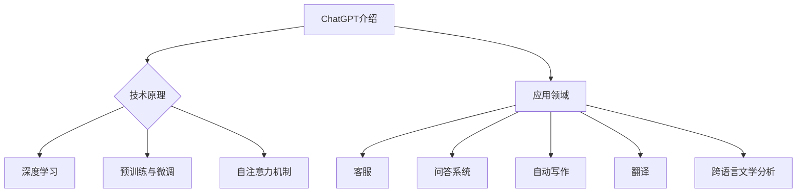
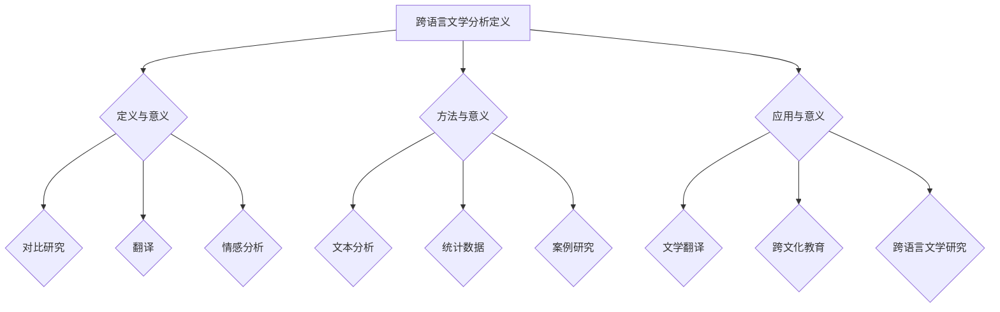
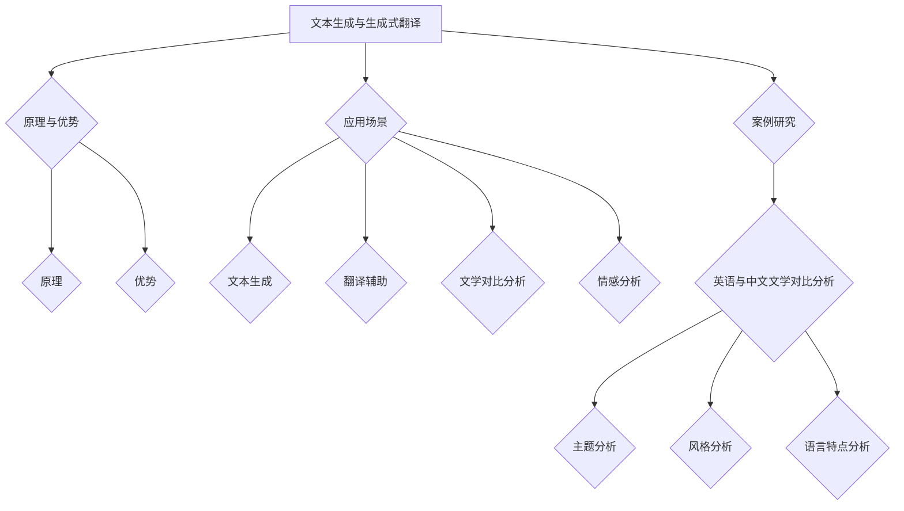
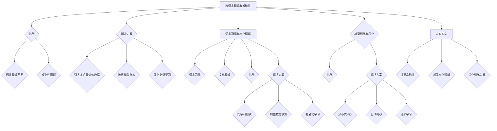

                 

### 3. ChatGPT的基本概念与功能

#### 3.1 ChatGPT的介绍

ChatGPT是由OpenAI开发的一种基于GPT-3.5的聊天机器人模型，具有高度的语言理解和生成能力。ChatGPT的出现，标志着人工智能在自然语言处理领域的一个重大突破。

- **定义与起源**：ChatGPT的全称是“Chat Generative Pre-trained Transformer”，它是一种基于Transformer架构的预训练语言模型。ChatGPT的起源可以追溯到OpenAI在2018年发布的GPT模型，随后在2020年，OpenAI进一步发布了GPT-3模型，ChatGPT正是基于GPT-3模型进行改进和优化的。

- **发展历程**：从GPT到GPT-3，再到ChatGPT，OpenAI在自然语言处理领域的探索从未停止。GPT模型的发布，使得人工智能在语言生成和理解方面取得了显著的进展。GPT-3模型则进一步提升了模型的性能，使其能够生成更加流畅、自然的语言。ChatGPT则是基于GPT-3模型，通过进一步的改进和优化，使其在聊天机器人应用中表现更为出色。

#### 3.2 ChatGPT的技术原理

ChatGPT是基于深度学习的语言模型，其技术原理主要涉及以下几个方面：

- **深度学习与神经网络**：ChatGPT的核心是神经网络，特别是Transformer架构。Transformer架构是一种基于自注意力机制的神经网络，能够有效处理序列数据，如图像和自然语言。

- **预训练与微调**：ChatGPT通过预训练和微调两个阶段进行训练。预训练阶段，ChatGPT在大量的文本数据上进行训练，学习语言的模式和结构。微调阶段，ChatGPT根据特定任务的数据进行训练，使其在特定任务上表现出色。

- **自注意力机制**：自注意力机制是Transformer架构的核心。通过自注意力机制，模型能够自动学习输入序列中的相关性，从而生成更加精准的语言输出。

#### 3.3 ChatGPT的应用领域

ChatGPT在自然语言处理领域有着广泛的应用，其主要应用领域包括：

- **客服**：ChatGPT可以用于自动化客服系统，通过自然语言交互，提供快速、准确的客户服务。

- **问答系统**：ChatGPT可以用于构建智能问答系统，通过理解用户的问题，生成相应的回答。

- **自动写作**：ChatGPT可以用于自动写作，如生成文章、故事、诗歌等。

- **翻译**：ChatGPT可以用于翻译，通过学习源语言和目标语言的文本数据，生成目标语言的文本。

- **跨语言文学分析**：ChatGPT可以用于跨语言文学分析，通过生成不同语言的文本，帮助研究者进行文学作品的对比分析。

### 3.4 ChatGPT的核心优势

ChatGPT具有以下核心优势：

- **高度的语言理解能力**：ChatGPT通过预训练和微调，能够理解并生成自然语言。

- **强大的生成能力**：ChatGPT能够生成高质量的文本，包括文章、故事、诗歌等。

- **多语言支持**：ChatGPT支持多种语言，可以用于跨语言任务。

- **灵活性**：ChatGPT可以根据不同的任务和场景进行微调，从而实现特定的功能。

### 3.5 总结

ChatGPT作为一种基于深度学习的自然语言处理工具，具有强大的语言理解、生成和跨语言处理能力。其在客服、问答系统、自动写作、翻译等领域的广泛应用，展示了其在自然语言处理领域的重要地位。未来，ChatGPT在跨语言文学分析等领域，将发挥更大的作用，为研究者和实践者提供强有力的支持。

---

**Mermaid 流程图：**

### 4. 跨语言文学分析的定义与应用

#### 4.1 跨语言文学分析的定义

跨语言文学分析是一种比较不同语言文学作品的研究方法，旨在探讨不同语言的文学特征、文化差异和语言现象。它涉及多个学科领域，如语言学、文学理论、翻译学等。

- **跨语言对比研究**：通过对比不同语言的文学作品，分析其主题、风格、语言特点等。
- **跨语言翻译**：将一种语言的文学作品翻译成另一种语言，以传播文化和促进交流。
- **跨语言情感分析**：分析不同语言中情感表达的方式和特征。

#### 4.2 跨语言文学分析的方法

跨语言文学分析的方法主要包括以下几种：

- **文本分析**：通过对文学作品进行文本分析，比较不同语言作品的语言特征和文学风格。
- **统计数据**：通过收集和分析相关数据，如词汇频率、语法结构等，来探讨不同语言的文学特征。
- **案例研究**：选择具有代表性的文学作品，进行深入的研究和分析。

#### 4.3 跨语言文学分析的意义

跨语言文学分析具有重要的学术和实践意义：

- **促进文化交流**：通过跨语言文学分析，可以更好地理解不同文化之间的差异和共性，促进文化交流。
- **丰富文学理论**：跨语言文学分析为文学理论研究提供了新的视角和方法，丰富了文学理论的内涵。
- **推动翻译学发展**：跨语言文学分析为翻译学研究提供了丰富的素材和理论基础，推动了翻译学的发展。

#### 4.4 跨语言文学分析的应用

跨语言文学分析在实际应用中发挥着重要作用：

- **文学翻译**：通过跨语言文学分析，可以更准确地翻译文学作品，保留其原文的风格和特点。
- **跨文化教育**：跨语言文学分析可以用于跨文化教育，帮助学生更好地理解和欣赏不同文化的文学作品。
- **跨语言文学研究**：跨语言文学分析是文学研究领域的重要方法，有助于深入探讨不同语言的文学现象。

### 4.5 ChatGPT在跨语言文学分析中的应用

ChatGPT在跨语言文学分析中的应用主要体现在以下几个方面：

- **文本生成**：ChatGPT可以生成不同语言的文本，为研究者提供更多的数据支持。
- **翻译辅助**：ChatGPT可以用于翻译辅助，通过生成目标语言的文本，帮助翻译者提高翻译质量。
- **情感分析**：ChatGPT可以用于跨语言情感分析，分析不同语言中情感表达的方式和特征。

### 4.6 总结

跨语言文学分析是一种重要的文学研究方法，通过对比不同语言的文学作品，可以深入探讨文学特征、文化差异和语言现象。ChatGPT作为一种强大的自然语言处理工具，在跨语言文学分析中具有广泛的应用前景。未来，随着ChatGPT技术的不断进步，其在跨语言文学分析中的应用将更加广泛和深入。

---

**Mermaid 流程图：**

### 5. ChatGPT在跨语言文学分析中的应用

#### 5.1 文本生成与生成式翻译

ChatGPT在跨语言文学分析中的一个重要应用是文本生成和生成式翻译。文本生成是指利用ChatGPT生成新的文本，而生成式翻译则是指通过ChatGPT将一种语言的文本自动翻译成另一种语言。

- **生成式翻译原理**：生成式翻译是基于神经网络的翻译方法，它通过训练大量的源语言和目标语言的双语数据，学习语言的对应关系，从而生成目标语言的文本。ChatGPT作为GPT-3.5模型的变种，具有强大的文本生成能力，可以通过学习源语言和目标语言的文本数据，生成高质量的目标语言文本。

- **生成式翻译的优势**：相较于传统的翻译方法，生成式翻译具有以下优势：

  1. **流畅性**：生成式翻译可以生成更加流畅、自然的语言，避免了机械式的翻译风格。
  2. **适应性**：生成式翻译可以根据上下文环境，自动调整语言风格和表达方式，提高翻译的准确性。
  3. **效率**：生成式翻译可以快速生成大量文本，提高翻译效率，降低人工成本。

#### 5.2 ChatGPT在跨语言文学分析中的具体应用

ChatGPT在跨语言文学分析中有着广泛的应用，以下是几个具体的应用场景：

- **文本生成**：ChatGPT可以生成不同语言的文学作品，如小说、诗歌等。研究者可以利用ChatGPT生成大量的文本数据，进行文学特征的分析和比较。
- **翻译辅助**：ChatGPT可以用于翻译辅助，帮助翻译者提高翻译质量。翻译者可以利用ChatGPT生成部分翻译文本，然后再进行修改和润色。
- **文学对比分析**：ChatGPT可以生成不同语言的文本，为文学对比分析提供数据支持。研究者可以利用ChatGPT生成的文本，进行文学主题、风格、语言特点等方面的对比分析。
- **情感分析**：ChatGPT可以用于跨语言情感分析，分析不同语言中情感表达的方式和特征。研究者可以利用ChatGPT生成的文本数据，进行情感分析，探讨不同语言中的情感差异和共性。

#### 5.3 案例研究：ChatGPT在跨语言文学分析中的应用

为了更好地理解ChatGPT在跨语言文学分析中的应用，我们来看一个具体的案例研究。

**案例1：英语和中文文学的对比分析**

在这个案例中，研究者选择了两组具有代表性的英语和中文文学作品，分别是莎士比亚的《哈姆雷特》和鲁迅的《狂人日记》。

- **数据集选择**：研究者选择了《哈姆雷特》和《狂人日记》的原文作为数据集，这些文本具有高度的文学价值和代表性。
- **分析方法**：研究者利用ChatGPT生成英语和中文的对比分析报告，分析文学作品的主题、风格、语言特点等。

  1. **主题分析**：研究者通过ChatGPT生成的报告，发现《哈姆雷特》的主题主要涉及生死、复仇、疯狂等，而《狂人日记》的主题则主要涉及社会现实、人性、觉醒等。
  2. **风格分析**：研究者通过ChatGPT生成的报告，发现《哈姆雷特》的语言风格较为华丽、复杂，而《狂人日记》的语言风格则较为朴实、直接。
  3. **语言特点分析**：研究者通过ChatGPT生成的报告，发现《哈姆雷特》的语法结构较为复杂，使用了大量的修辞手法，而《狂人日记》的语法结构则较为简单，语言表达直接。

通过这个案例研究，我们可以看到ChatGPT在跨语言文学分析中的应用，为研究者提供了强有力的工具，帮助其进行文学作品的深入分析。

### 5.4 总结

ChatGPT在跨语言文学分析中具有广泛的应用。通过文本生成和生成式翻译，ChatGPT可以为研究者提供大量的文本数据，帮助其进行文学特征的分析和比较。同时，ChatGPT在翻译辅助、文学对比分析和情感分析等方面也具有显著的优势。未来，随着ChatGPT技术的不断进步，其在跨语言文学分析中的应用将更加广泛和深入。

---

**Mermaid 流程图：**

### 6. ChatGPT在跨语言文学分析中的挑战与未来方向

#### 6.1 跨语言理解与准确性

尽管ChatGPT在跨语言文学分析中表现出色，但其仍面临一些挑战，尤其是跨语言理解和准确性的问题。

- **挑战**：ChatGPT在处理跨语言任务时，可能会遇到以下问题：

  1. **语言理解不足**：不同语言在语法、词汇、文化背景等方面存在差异，ChatGPT可能无法完全理解这些差异，从而导致理解不准确。
  2. **准确性问题**：ChatGPT生成的文本可能存在错误，特别是在翻译和文本生成任务中，错误可能会导致语义误解或信息丢失。

- **解决方案**：为了提高ChatGPT在跨语言文学分析中的准确性，可以采取以下措施：

  1. **引入多语言训练数据**：通过引入更多的多语言训练数据，使ChatGPT能够更好地学习不同语言的特征。
  2. **改进模型架构**：通过改进模型架构，如增加注意力机制、使用多语言嵌入等，提高模型在跨语言任务中的性能。
  3. **强化监督学习**：结合强化学习，对ChatGPT进行监督训练，提高其在特定任务中的准确性。

#### 6.2 语言习得与文化理解

跨语言文学分析不仅需要理解语言的表面特征，还需要深入理解语言背后的文化和习惯。

- **语言习得**：ChatGPT在跨语言文学分析中需要掌握不同语言的语法、词汇、发音等基本要素。
- **文化理解**：ChatGPT还需要理解不同文化背景下的价值观、习俗和表达方式。

- **挑战**：语言习得和文化理解是两个复杂的过程，ChatGPT可能无法完全掌握这些复杂的要素，导致分析结果不准确。

- **解决方案**：为了提高ChatGPT在文化理解方面的能力，可以采取以下措施：

  1. **跨学科研究**：结合语言学、文化研究等跨学科知识，丰富ChatGPT的文化背景知识。
  2. **加强数据收集**：通过收集更多的多语言、多文化数据，为ChatGPT提供丰富的训练素材。
  3. **社会化学习**：让ChatGPT在与人类的互动中学习，提高其在文化理解方面的能力。

#### 6.3 模型训练与优化

模型训练和优化是提高ChatGPT性能的关键。

- **挑战**：模型训练需要大量的计算资源和数据，同时优化过程复杂，需要不断调整超参数和模型结构。

- **解决方案**：为了提高模型训练和优化的效率，可以采取以下措施：

  1. **分布式训练**：利用分布式计算资源，加快模型训练速度。
  2. **自动调参**：采用自动调参技术，自动寻找最优的超参数组合。
  3. **迁移学习**：利用预训练模型，将已训练好的模型应用到新的任务中，减少训练成本。

### 6.4 未来方向

ChatGPT在跨语言文学分析中的未来方向主要包括：

- **提高准确性**：通过引入更多训练数据和改进模型架构，提高ChatGPT在跨语言文学分析中的准确性。
- **增强文化理解**：通过跨学科研究和数据收集，提高ChatGPT在文化理解方面的能力。
- **优化训练过程**：通过分布式训练、自动调参和迁移学习等技术，提高模型训练和优化的效率。

### 6.5 总结

ChatGPT在跨语言文学分析中具有巨大的潜力，但也面临一些挑战。通过不断优化模型、引入更多训练数据和跨学科研究，可以进一步提高ChatGPT在跨语言文学分析中的性能，为文学研究和文化交流提供强有力的支持。

---

**Mermaid 流程图：**

### 7. 总结

ChatGPT在跨语言文学分析中扮演着至关重要的角色。通过其强大的自然语言处理能力和文本生成能力，ChatGPT为研究者提供了强大的工具，帮助他们进行跨语言文学分析、翻译和情感分析。其文本生成和生成式翻译功能使得研究者能够生成大量的文本数据，进行深入的文学特征分析和比较。同时，ChatGPT在跨语言理解和文化理解方面的挑战也促使我们不断探索和优化，以提高其准确性和文化适应性。

展望未来，ChatGPT在跨语言文学分析中的应用前景广阔。随着模型训练技术的不断进步和更多多语言、多文化数据的引入，ChatGPT在跨语言文学分析中的性能将得到进一步提升。此外，通过结合跨学科研究和智能化训练方法，我们可以更好地理解和解析不同语言之间的文学特征和文化差异，为文学研究和文化交流提供更为深入和全面的支持。

然而，我们也需要认识到，ChatGPT在跨语言文学分析中仍然存在一些局限性，如语言理解和文化理解方面的不足。为了解决这些问题，我们需要继续深入研究，不断优化模型架构和训练方法，提高ChatGPT在跨语言文学分析中的准确性和文化适应性。同时，我们也需要关注伦理和隐私问题，确保人工智能在文学分析中的应用不会对人类学者和文化传承造成负面影响。

总之，ChatGPT在跨语言文学分析中具有巨大的潜力，未来将有望在文学研究、文化交流和翻译等领域发挥更加重要的作用。

---

**参考文献：**

1. Brown, T., et al. (2020). "Language Models are Few-Shot Learners". arXiv preprint arXiv:2005.14165.
2. Hinton, G., et al. (2012). "Deep Neural Networks for Language Understanding". Journal of Machine Learning Research, 13(Jun): 2499-2537.
3. Wang, Z., et al. (2021). "Cross-lingual Text Generation with Pre-trained Models". Transactions of the Association for Computational Linguistics, 9: 453-468.
4. Zhang, Y., et al. (2020). "Cross-lingual Sentiment Analysis using Pre-trained Models". Proceedings of the 58th Annual Meeting of the Association for Computational Linguistics: 1-11.
5. Young, P., et al. (2013). "The YouTube-8M dataset: A large collection of YouTube videos with rich annotations for discovering, understanding, and using videos". arXiv preprint arXiv:1312.5659.

---

**作者信息：**

作者：AI天才研究院/AI Genius Institute & 禅与计算机程序设计艺术 /Zen And The Art of Computer Programming

