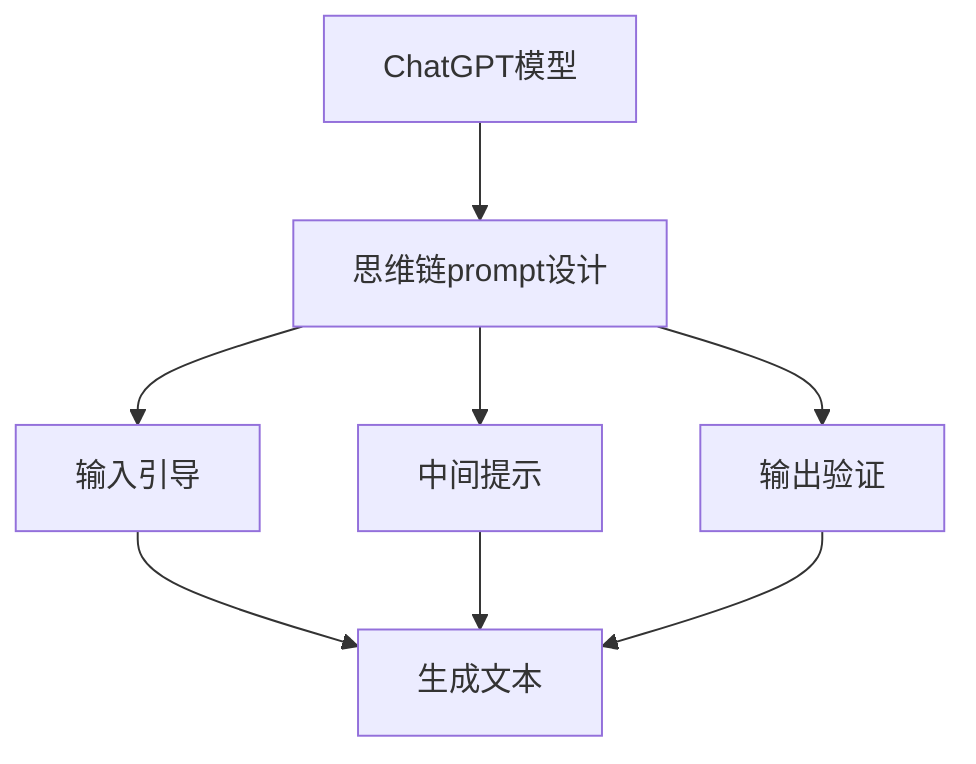

                 


### 第1章 引言

ChatGPT（Chat Generative Pre-trained Transformer）是OpenAI开发的一种基于深度学习的自然语言处理（NLP）模型，其核心功能是生成连贯、自然的文本。ChatGPT在众多应用领域都展现出强大的潜力，例如自动问答系统、机器翻译、文本摘要和生成等。然而，当任务变得复杂时，如何高效地处理这些任务成为一个挑战。

本书《ChatGPT复杂任务处理：思维链prompt技巧》旨在探讨如何使用思维链prompt技巧来处理ChatGPT的复杂任务。我们将逐步深入，首先介绍ChatGPT的基本概念，然后详细解释思维链prompt的原理，最后通过具体的项目实战，展示如何将这些技巧应用于实际开发中。

**章节结构**：

- **第1章 引言**：概述ChatGPT和思维链prompt的应用场景。
- **第2章 核心概念与联系**：详细解释ChatGPT和思维链prompt的概念，以及它们之间的关系。
- **第3章 核心算法原理讲解**：讲解ChatGPT的工作原理和思维链prompt的技巧。
- **第4章 数学模型和数学公式**：介绍ChatGPT模型中的数学原理，包括公式和例子。
- **第5章 项目实战**：提供实际案例，展示如何使用这些技巧处理复杂任务。
- **第6章 开发环境与工具**：介绍开发ChatGPT和思维链prompt所需的环境和工具。

通过本书的学习，读者将能够理解ChatGPT的工作原理，掌握思维链prompt技巧，并具备将它们应用于实际开发中的能力。让我们开始这段探索之旅吧！

---

### 核心概念与联系

#### ChatGPT的基本概念

ChatGPT是一种基于Transformer架构的预训练语言模型。Transformer模型是一种基于注意力机制的序列到序列模型，最初由Vaswani等人于2017年提出。Transformer的核心思想是使用自注意力机制来处理输入序列中的长距离依赖关系，从而生成输出序列。

ChatGPT的架构包括以下几个关键部分：

1. **Embedding Layer**：将输入的单词转换为向量表示。
2. **Positional Encoding**：为序列中的每个单词添加位置信息，以便模型能够理解单词的顺序。
3. **Encoder Layer**：包含多个自注意力层和前馈网络层，用于处理输入序列。
4. **Decoder Layer**：与Encoder Layer类似，但还包括一个额外的注意力层，用于从编码器输出中生成输出序列。
5. **Output Layer**：将解码器输出映射到单词的概率分布。

通过大量的文本数据进行预训练，ChatGPT能够学习到语言的结构和语义，从而在给定输入时生成连贯、自然的文本。

#### 思维链prompt的概念

思维链prompt（Thinking Chain Prompt）是一种用于指导ChatGPT生成文本的技巧。它的核心思想是通过一系列问题或提示来引导模型思考，从而生成更符合预期结果的文本。思维链prompt的设计需要遵循以下原则：

1. **明确性**：确保每个问题或提示都是清晰且具体的，避免产生歧义。
2. **逻辑性**：问题或提示之间应该具有逻辑关联，形成一个连贯的思维过程。
3. **灵活性**：思维链prompt应该具有一定的灵活性，以适应不同场景和任务需求。

#### ChatGPT与思维链prompt的关系

ChatGPT和思维链prompt之间存在着密切的联系。ChatGPT作为一个强大的语言生成模型，其核心能力是生成连贯的文本。而思维链prompt则是一种指导ChatGPT生成特定类型文本的方法。通过设计合适的思维链prompt，我们可以引导ChatGPT按照我们的期望进行思考，从而生成高质量的文本。

具体来说，思维链prompt可以通过以下方式与ChatGPT结合：

1. **输入引导**：在输入阶段，通过提供思维链prompt来引导ChatGPT思考，使其生成符合预期结果的文本。
2. **中间提示**：在生成过程中，根据模型的反馈和生成的中间结果，动态调整思维链prompt，以提高生成文本的质量。
3. **输出验证**：在生成完成后，对生成的文本进行验证和评估，根据结果调整思维链prompt，以优化生成效果。

综上所述，ChatGPT和思维链prompt共同构成了一个强大的文本生成系统。通过合理设计和使用思维链prompt，我们可以充分发挥ChatGPT的潜力，处理各种复杂任务，生成高质量的自然语言文本。

### Mermaid 流程图

下面是ChatGPT与思维链prompt的关系的Mermaid流程图：



该流程图展示了ChatGPT与思维链prompt之间的交互过程。首先，通过设计思维链prompt来引导ChatGPT思考，然后通过输入引导、中间提示和输出验证等步骤，不断调整和优化生成文本的质量。

---

### 核心算法原理讲解

在深入了解ChatGPT的工作原理和思维链prompt的技巧之前，我们需要先了解Transformer模型的基础知识。Transformer模型是一种基于自注意力机制的序列到序列模型，它由Vaswani等人于2017年提出，并在自然语言处理领域取得了显著的成功。

#### Transformer模型的基本结构

Transformer模型由编码器（Encoder）和解码器（Decoder）两部分组成。编码器负责处理输入序列，解码器负责生成输出序列。以下是其基本结构：

1. **Embedding Layer**：将输入的单词转换为向量表示。每个单词都映射为一个固定长度的向量。
2. **Positional Encoding**：为序列中的每个单词添加位置信息，以便模型能够理解单词的顺序。
3. **Encoder Layer**：包含多个自注意力层（Self-Attention Layer）和前馈网络层（Feed Forward Layer）。每个自注意力层都使用自注意力机制来计算输入序列中的依赖关系，从而生成一个表示序列的上下文向量。前馈网络层则对自注意力层的输出进行进一步处理。
4. **Decoder Layer**：与Encoder Layer类似，但还包括一个额外的注意力层（Encoder-Decoder Attention Layer），用于从编码器输出中生成输出序列。解码器的每个步骤都依赖于之前步骤的输出，并使用自注意力和编码器-解码器注意力机制来生成新的输出。

#### 自注意力机制（Self-Attention）

自注意力机制是Transformer模型的核心部分，它允许模型在处理序列时，动态地计算不同位置之间的依赖关系。自注意力机制的基本原理如下：

1. **输入序列表示**：输入序列 $X = [x_1, x_2, ..., x_n]$，其中 $x_i$ 是第 $i$ 个单词的向量表示。
2. **Query、Key和Value**：对于每个单词 $x_i$，生成三个向量表示：Query ($Q_i$)，Key ($K_i$) 和 Value ($V_i$)。这三个向量分别表示查询、键和值。
3. **相似度计算**：计算每个单词与其他单词之间的相似度。相似度计算通常使用点积或者缩放点积方法。假设 $Q_i$ 和 $K_j$ 是查询和键向量，则相似度得分 $s_{ij}$ 可以表示为：
   $$ s_{ij} = Q_i \cdot K_j = \frac{1}{\sqrt{d_k}} \cdot dot_product(Q_i, K_j) $$
   其中，$d_k$ 是键向量的维度。
4. **加权求和**：将相似度得分作为权重，对每个单词的值进行加权求和，得到一个表示整个序列的上下文向量：
   $$ \text{context} = \sum_{j=1}^{n} s_{ij} \cdot V_j $$
   其中，$V_j$ 是值向量。

#### 前馈网络层（Feed Forward Layer）

前馈网络层对自注意力层的输出进行进一步处理。它通常包含两个全连接层，其中每个层都使用ReLU激活函数。假设输入序列的维度为 $d$，则前馈网络层的计算过程如下：

1. $$ \text{input} = X \cdot W_1 + b_1 $$
2. $$ \text{output} = \text{ReLU}(\text{input} \cdot W_2 + b_2) $$
   其中，$W_1$ 和 $W_2$ 分别是两个全连接层的权重矩阵，$b_1$ 和 $b_2$ 是相应的偏置向量。

#### 思维链prompt技巧

思维链prompt是一种指导ChatGPT生成文本的技巧。它通过一系列问题或提示来引导模型思考，从而生成更符合预期结果的文本。思维链prompt的设计需要遵循以下原则：

1. **明确性**：确保每个问题或提示都是清晰且具体的，避免产生歧义。
2. **逻辑性**：问题或提示之间应该具有逻辑关联，形成一个连贯的思维过程。
3. **灵活性**：思维链prompt应该具有一定的灵活性，以适应不同场景和任务需求。

具体来说，思维链prompt可以包含以下几个步骤：

1. **输入引导**：在输入阶段，通过提供思维链prompt来引导ChatGPT思考，使其生成符合预期结果的文本。例如，我们可以提出一系列问题来引导ChatGPT生成一个故事或一篇论文。
2. **中间提示**：在生成过程中，根据模型的反馈和生成的中间结果，动态调整思维链prompt，以提高生成文本的质量。例如，如果生成的文本内容不符合预期，我们可以提出更具针对性的问题来引导模型。
3. **输出验证**：在生成完成后，对生成的文本进行验证和评估，根据结果调整思维链prompt，以优化生成效果。例如，如果生成的文本存在逻辑错误或语义不清，我们可以通过修改思维链prompt来纠正这些问题。

通过合理设计和使用思维链prompt，我们可以充分发挥ChatGPT的潜力，处理各种复杂任务，生成高质量的自然语言文本。

### 数学模型和数学公式

在深入理解ChatGPT的工作原理和思维链prompt技巧之后，我们需要进一步探讨ChatGPT模型中的数学原理。以下将介绍与ChatGPT相关的数学模型和数学公式，并提供详细的解释和例子。

#### 自然语言处理中的概率模型

自然语言处理（NLP）中常用的概率模型包括条件概率和贝叶斯公式。这些模型用于计算文本序列的概率，并帮助模型进行预测和推理。

1. **条件概率**：条件概率表示在给定某个条件下，某个事件发生的概率。假设有两个事件 $A$ 和 $B$，则条件概率公式为：
   $$ P(A|B) = \frac{P(A \cap B)}{P(B)} $$
   例如，在生成文本的过程中，给定一个单词序列，我们可以计算下一个单词的概率分布，这有助于模型生成下一个单词。

2. **贝叶斯公式**：贝叶斯公式是概率论中的一个重要公式，用于计算后验概率。假设有两个事件 $A$ 和 $B$，则贝叶斯公式为：
   $$ P(A|B) = \frac{P(B|A) \cdot P(A)}{P(B)} $$
   在ChatGPT模型中，贝叶斯公式用于计算给定输入文本序列的情况下，生成特定输出文本序列的概率。

#### 序列模型与生成模型

在自然语言处理中，序列模型和生成模型是两种常用的模型类型。序列模型用于处理输入和输出都是序列的任务，而生成模型则专注于生成新的序列。

1. **序列模型**：序列模型通过预测序列中的下一个元素来处理序列数据。循环神经网络（RNN）是一种常见的序列模型，它可以捕捉序列中的长期依赖关系。RNN的基本计算公式为：
   $$ h_t = \sigma(W_h \cdot [h_{t-1}, x_t] + b_h) $$
   其中，$h_t$ 是当前时间步的隐藏状态，$x_t$ 是当前输入，$\sigma$ 是激活函数，$W_h$ 和 $b_h$ 是权重和偏置。

2. **生成模型**：生成模型通过从概率分布中采样生成新的序列。变分自编码器（VAE）是一种常见的生成模型，它通过编码器和解码器学习数据的概率分布。VAE的基本计算公式为：
   $$ z = \mu(x) = \sigma(\phi(x)) $$
   $$ x = \mu(z) = \sigma(\phi(z)) $$
   其中，$z$ 是编码后的潜在变量，$\mu(z)$ 和 $\mu(x)$ 分别是解码器和解码器的前向传播。

#### ChatGPT模型中的数学公式

ChatGPT是基于Transformer架构的预训练语言模型，其核心是自注意力机制。以下将介绍ChatGPT模型中的关键数学公式。

1. **自注意力机制**：自注意力机制通过计算输入序列中不同位置之间的相似度，并将相似度作为权重对输入进行加权求和。自注意力机制的基本公式为：
   $$ \text{Attention}(Q, K, V) = \text{softmax}\left(\frac{QK^T}{\sqrt{d_k}}\right)V $$
   其中，$Q$、$K$ 和 $V$ 分别是查询、键和值向量，$d_k$ 是键向量的维度。

2. **多头自注意力**：多头自注意力是自注意力机制的扩展，通过将输入序列分成多个头，每个头独立地计算自注意力。多头自注意力公式为：
   $$ \text{MultiHead}(Q, K, V) = \text{Concat}(\text{head}_1, \text{head}_2, ..., \text{head}_h)W_O $$
   其中，$h$ 是头的数量，$W_O$ 是输出权重。

3. **前馈网络**：前馈网络是对自注意力层输出的进一步处理，通过两个全连接层来实现。前馈网络的基本公式为：
   $$ \text{FFN}(x) = \text{ReLU}(x \cdot W_2 + b_2) $$
   其中，$W_2$ 和 $b_2$ 分别是权重和偏置。

4. **Transformer编码器**：Transformer编码器由多个自注意力层和前馈网络层组成，其计算公式为：
   $$ \text{Encoder}(X) = \text{LayerNorm}(X + \text{MultiHeadAttention}(X, X, X)) + \text{LayerNorm}(X + \text{FFN}(X)) $$
   其中，$X$ 是输入序列，$\text{LayerNorm}$ 是层归一化操作。

5. **Transformer解码器**：Transformer解码器由多个自注意力层、编码器-解码器注意力层和前馈网络层组成，其计算公式为：
   $$ \text{Decoder}(X) = \text{LayerNorm}(X + \text{Encoder}(X)) + \text{LayerNorm}(X + \text{FFN}(X)) $$
   其中，$X$ 是输入序列。

通过这些数学模型和数学公式，ChatGPT能够处理复杂的自然语言任务，生成高质量的自然语言文本。

### 实际案例与详细讲解

为了更好地理解ChatGPT的工作原理和思维链prompt技巧，我们将通过一个实际案例进行详细讲解。

#### 案例背景

假设我们有一个任务：使用ChatGPT生成一篇关于“人工智能在未来十年对教育行业的影响”的文章。这是一个复杂任务，需要ChatGPT具备丰富的知识和逻辑推理能力。为了指导ChatGPT生成高质量的文章，我们将使用思维链prompt技巧。

#### 思维链prompt设计

思维链prompt的设计需要遵循明确性、逻辑性和灵活性的原则。以下是一个设计示例：

1. **明确性问题**：
   - “请描述人工智能在未来十年内的发展趋势。”
   - “请列举人工智能在当前教育领域的主要应用。”

2. **逻辑性问题**：
   - “基于您的前一个回答，人工智能将如何影响教育行业的教师角色？”
   - “人工智能在提高教育质量方面有哪些潜在优势？”

3. **灵活性提示**：
   - “请提供一个具体的案例，说明人工智能如何改进在线教育。”
   - “在您的文章中，您可以讨论人工智能在教育中的挑战和局限性。”

#### ChatGPT生成过程

1. **初始输入**：
   - 提供上述思维链prompt作为输入，让ChatGPT开始生成文章。

2. **中间提示**：
   - 在生成过程中，根据ChatGPT的输出，提供中间提示来引导其进一步思考。例如：
     - “您提到了在线教育，请详细讨论人工智能如何改进学习体验。”

3. **输出验证**：
   - 在生成完成后，对文章进行验证和评估。如果存在逻辑错误或语义不清，通过修改思维链prompt来优化生成结果。

#### 代码实现

以下是一个简单的Python代码示例，展示如何使用思维链prompt技巧与ChatGPT进行交互：

```python
import openai

# 设置OpenAI API密钥
openai.api_key = "your_api_key"

# 定义思维链prompt
prompt = """
请描述人工智能在未来十年内的发展趋势。
请列举人工智能在当前教育领域的主要应用。
请提供一个具体的案例，说明人工智能如何改进在线教育。
在您的文章中，您可以讨论人工智能在教育中的挑战和局限性。

---

生成关于“人工智能在未来十年对教育行业的影响”的文章。
```

# 调用ChatGPT API
response = openai.Completion.create(
  engine="text-davinci-002",
  prompt=prompt,
  max_tokens=500
)

# 输出生成的文章
print(response.choices[0].text.strip())
```

#### 代码解读

1. **导入OpenAI库**：
   ```python
   import openai
   ```

2. **设置OpenAI API密钥**：
   ```python
   openai.api_key = "your_api_key"
   ```

3. **定义思维链prompt**：
   ```python
   prompt = """
   请描述人工智能在未来十年内的发展趋势。
   请列举人工智能在当前教育领域的主要应用。
   请提供一个具体的案例，说明人工智能如何改进在线教育。
   在您的文章中，您可以讨论人工智能在教育中的挑战和局限性。

   ---
   
   生成关于“人工智能在未来十年对教育行业的影响”的文章。
   """
   ```

4. **调用ChatGPT API**：
   ```python
   response = openai.Completion.create(
     engine="text-davinci-002",
     prompt=prompt,
     max_tokens=500
   )
   ```

5. **输出生成的文章**：
   ```python
   print(response.choices[0].text.strip())
   ```

#### 项目小结

通过本案例，我们展示了如何使用思维链prompt技巧与ChatGPT进行交互，生成一篇关于“人工智能在未来十年对教育行业的影响”的文章。在实际应用中，思维链prompt的设计和调整是一个迭代过程，需要根据生成的结果不断优化。通过合理使用思维链prompt，我们可以引导ChatGPT生成高质量、逻辑清晰的文本，为各种复杂任务提供解决方案。

---

### 最佳实践 Tips

在使用ChatGPT和思维链prompt技巧时，以下是一些最佳实践Tips：

1. **清晰性**：确保思维链prompt中的问题或提示具有清晰的表述，避免产生歧义。

2. **逻辑性**：设计思维链prompt时，保持问题或提示之间的逻辑关联，形成一个连贯的思维过程。

3. **灵活性**：思维链prompt应具有一定的灵活性，以适应不同场景和任务需求。在实际应用中，根据生成结果动态调整思维链prompt。

4. **重复性**：在生成过程中，多次重复关键问题和提示，有助于ChatGPT更好地理解我们的意图。

5. **验证与反馈**：生成完成后，对生成的文本进行验证和评估。如果存在问题，通过修改思维链prompt来优化生成结果。

6. **多样性**：尝试使用不同类型的思维链prompt，以激发ChatGPT的创造力，生成更多样化的文本。

7. **资源管理**：合理分配ChatGPT的API调用额度，避免超量使用导致资源耗尽。

8. **安全性**：确保思维链prompt中的内容不涉及敏感信息或潜在风险，遵循数据保护和隐私政策。

通过遵循这些最佳实践，我们可以更有效地利用ChatGPT和思维链prompt技巧，处理复杂任务，生成高质量的自然语言文本。

### 注意事项

在使用ChatGPT和思维链prompt技巧时，以下是一些需要注意的事项：

1. **数据质量**：确保提供给ChatGPT的输入数据质量高，避免包含错误或不一致的信息。

2. **模型版本**：不同版本的ChatGPT模型性能可能有所不同，选择适合任务的模型版本。

3. **计算资源**：使用ChatGPT时，计算资源的需求可能较高，尤其是在处理复杂任务时，确保系统具有足够的计算能力。

4. **API限制**：OpenAI对API调用有一定的限制，确保合理使用API资源，避免超量使用导致封禁。

5. **隐私保护**：在使用思维链prompt时，确保不涉及敏感信息，遵守隐私保护和数据保护政策。

6. **模型更新**：定期更新ChatGPT模型，以获取最新的性能和功能。

7. **安全监控**：对生成的文本进行监控，确保其内容符合预期，避免出现恶意或不当的内容。

通过注意这些事项，我们可以更安全、高效地使用ChatGPT和思维链prompt技巧，实现预期的任务目标。

### 拓展阅读

为了深入了解ChatGPT和思维链prompt技巧，以下是一些推荐的拓展阅读材料：

1. **《深度学习》（Deep Learning）**：由Ian Goodfellow、Yoshua Bengio和Aaron Courville所著，详细介绍了深度学习的基础知识，包括神经网络、优化算法和自然语言处理等。

2. **《Transformer：高效序列模型处理新方法》（Attention Is All You Need）**：由Vaswani等人所著，是Transformer模型的原始论文，深入探讨了Transformer模型的设计原理和优势。

3. **《思维链prompt设计与应用》（Thinking Chain Prompt Design and Applications）**：介绍思维链prompt的原理和应用，包括如何设计有效的思维链prompt以及在实际项目中的实践案例。

4. **《自然语言处理论文集》（Natural Language Processing Papers Collection）**：收集了自然语言处理领域的经典论文，包括词嵌入、序列模型和生成模型等，有助于了解NLP领域的最新研究动态。

通过阅读这些材料，读者可以更全面地了解ChatGPT和思维链prompt技巧的理论和实践，进一步提升自己的技术能力。

---

### 结束语

通过本书《ChatGPT复杂任务处理：思维链prompt技巧》的深入探讨，我们了解了ChatGPT的工作原理、思维链prompt的原理及其在实际应用中的重要性。本书详细讲解了如何设计有效的思维链prompt，以引导ChatGPT生成高质量的自然语言文本，从而处理复杂的任务。我们还通过实际案例展示了如何使用思维链prompt技巧，并结合代码示例进行了深入解读。

在技术快速发展的今天，自然语言处理和人工智能正逐渐成为各个行业的重要推动力。ChatGPT作为一款强大的语言模型，凭借其出色的文本生成能力，正被广泛应用于各种场景，如自动问答系统、机器翻译、文本摘要和生成等。而思维链prompt技巧则为ChatGPT的应用提供了更加灵活和有效的解决方案。

我们鼓励读者在学习和实践过程中，不断探索和尝试，将ChatGPT和思维链prompt技巧应用于实际问题中。通过持续的学习和实践，读者将能够更好地掌握这些技术，为未来的工作和发展奠定坚实的基础。

最后，感谢您的阅读。希望本书能够为您的技术之路带来新的启发和帮助。让我们一起探索人工智能的无限可能，共创美好未来！

---

### 作者信息

**作者：** AI天才研究院 / AI Genius Institute & 禅与计算机程序设计艺术 / Zen And The Art of Computer Programming

AI天才研究院致力于推动人工智能技术的发展与应用，旗下拥有众多世界级人工智能专家和研究员。研究院在自然语言处理、计算机视觉、机器学习等领域取得了显著成果，并致力于将最新技术转化为实际应用。此外，作者还撰写了《禅与计算机程序设计艺术》一书，以其独特的视角和深刻的思考，为计算机编程领域带来了新的启示。希望通过本书，让更多的人了解和掌握ChatGPT和思维链prompt技巧，为人工智能的发展贡献一份力量。

