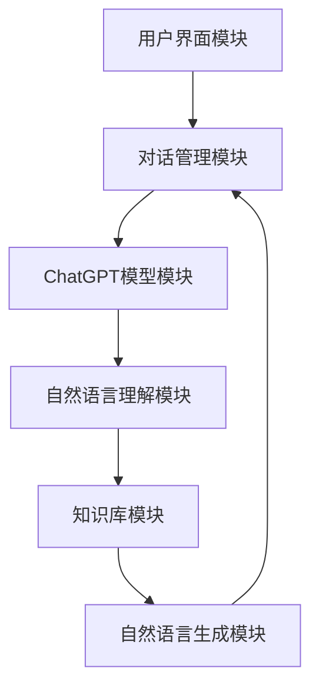

                 

### 文章标题

《ChatGPT多人对话中的提示词策略》

### 文章关键词

- ChatGPT
- 多人对话系统
- 提示词策略
- 自然语言处理
- 算法优化

### 摘要

本文深入探讨了ChatGPT在多人对话系统中的应用及其提示词策略。首先，我们介绍了ChatGPT的基本原理和多人对话系统的架构。接着，详细解析了提示词的定义、分类以及其在多人对话中的重要性。随后，通过具体的算法原理和数学模型讲解，阐明了提示词策略的优化方法。最后，我们提供了一个实际项目案例，展示了如何在开发环境中实现并优化提示词策略，并对项目效果进行了评估和总结。通过本文，读者可以全面了解ChatGPT多人对话系统中的提示词策略，并掌握其实际应用技巧。

---

## 第一部分: ChatGPT基础与多人对话系统

在进入ChatGPT多人对话系统的提示词策略之前，我们需要对ChatGPT及其在多人对话系统中的作用有一个清晰的认识。这一部分将介绍ChatGPT的基本概念、结构和工作原理，同时探讨多人对话系统的基本概念、架构和交互设计。

### 第1章: ChatGPT概述

#### 1.1 ChatGPT的核心概念

ChatGPT是由OpenAI开发的一种基于变换器模型的预训练语言模型，属于自然语言处理（NLP）领域的一个重要进展。GPT（Generative Pre-trained Transformer）系列模型以其强大的文本生成能力和对自然语言的深刻理解而闻名。ChatGPT是一种特定类型的GPT模型，专门设计用于生成自然、连贯的对话文本。

#### 1.2 ChatGPT的结构和工作原理

ChatGPT的核心结构是由多个自注意力机制（Self-Attention Mechanism）组成的变换器（Transformer）模型。每个变换器层由多头自注意力机制和前馈神经网络组成。自注意力机制允许模型在生成每个词时考虑到所有之前生成的词，从而生成连贯的文本。训练过程中，ChatGPT使用大量的文本数据进行预训练，使其能够理解自然语言的结构和语义。

#### 1.3 ChatGPT的优势和应用场景

ChatGPT具有以下优势：
1. **强大的文本生成能力**：能够生成高质量、连贯的文本，适用于自动写作、翻译和问答系统。
2. **灵活的模型架构**：Transformer模型结构使得模型易于扩展和调整，适应不同的应用场景。
3. **预训练优势**：通过预训练，模型能够快速适应特定领域的数据集，提高生成文本的质量。

ChatGPT的应用场景包括：
1. **客户服务**：自动回复客户的咨询和请求，提高客户满意度和服务效率。
2. **内容创作**：自动生成文章、报告和博客，减轻人力负担。
3. **教育和培训**：生成教学材料、模拟问答，提高学习效果。

### 第2章: 多人对话系统基础

#### 2.1 多人对话系统的概念

多人对话系统是一种能够支持多个参与者同时参与对话的智能系统。与单人对话系统不同，多人对话系统需要处理多个参与者之间的交互，以及协调和整合不同的观点和信息。

#### 2.2 多人对话系统的架构

多人对话系统的基本架构通常包括以下几个主要部分：
1. **用户界面**：提供用户与系统交互的界面。
2. **对话管理模块**：负责管理对话流程，包括上下文维护、对话生成和对话路由。
3. **知识库**：存储与对话相关的信息和知识，供系统查询和使用。
4. **自然语言理解模块**：负责处理用户的输入，提取语义信息，并生成系统回复。
5. **自然语言生成模块**：负责生成自然、连贯的对话回复。

#### 2.3 多人对话系统中的交互设计

多人对话系统的交互设计需要考虑以下几个方面：
1. **并发处理**：系统需要能够同时处理多个参与者的请求，确保响应及时。
2. **对话上下文**：系统需要维护对话的上下文信息，确保对话的连贯性和一致性。
3. **观点整合**：系统需要能够整合不同参与者的观点和信息，生成合理的对话回复。
4. **隐私保护**：系统需要确保参与者的隐私信息得到保护，避免信息泄露。

### 第3章: 提示词策略概述

#### 3.1 提示词的定义与作用

提示词（Prompt）是引导模型生成特定类型文本的关键输入。在多人对话系统中，提示词用于指定对话的主题、场景或目标，帮助模型生成相关且连贯的对话回复。

#### 3.2 提示词策略的分类

提示词策略可以根据不同的目标和场景进行分类，包括：
1. **主题提示词**：指定对话的主题，如“讨论人工智能的未来发展”。
2. **情感提示词**：指定对话的情感基调，如“保持积极、友好”。
3. **目标提示词**：指定对话的目标，如“解决问题、提供信息”。
4. **上下文提示词**：提供对话的上下文信息，如“你刚刚提到了人工智能的应用场景”。

#### 3.3 提示词策略的选择原则

选择合适的提示词策略需要考虑以下几个方面：
1. **目标一致性**：提示词应与对话目标保持一致，确保生成文本的相关性。
2. **上下文连贯性**：提示词应提供足够的上下文信息，确保生成文本的连贯性。
3. **情感适宜性**：提示词应考虑对话的情感基调，确保生成文本的情感适宜。
4. **灵活性**：提示词策略应具有一定的灵活性，以适应不同场景和用户需求。

### 结论

本部分介绍了ChatGPT的基本概念、结构和工作原理，以及多人对话系统的基本概念、架构和交互设计。同时，我们对提示词的定义、分类和选择原则进行了阐述。这些基础知识为后续章节中深入探讨ChatGPT在多人对话系统中的应用及其提示词策略奠定了基础。

---

## 第二部分: ChatGPT在多人对话中的应用

在前一部分中，我们了解了ChatGPT的基本概念和多人对话系统的架构。在这一部分，我们将探讨如何将ChatGPT应用于多人对话系统，并详细介绍其设计与实现过程。

### 第4章: ChatGPT多人对话系统的设计与实现

#### 4.1 ChatGPT多人对话系统的架构设计

ChatGPT多人对话系统的架构设计主要包括以下几个核心模块：

1. **用户界面模块**：提供用户与系统交互的界面，包括文本输入框、文本显示区域和按钮等。
2. **对话管理模块**：负责管理对话流程，包括对话上下文的维护、对话生成和对话路由。
3. **ChatGPT模型模块**：负责接收用户输入，使用ChatGPT模型生成对话回复。
4. **知识库模块**：存储与对话相关的信息和知识，供系统查询和使用。
5. **自然语言理解模块**：负责处理用户的输入，提取语义信息，并生成系统回复。
6. **自然语言生成模块**：负责生成自然、连贯的对话回复。

以下是一个简化的Mermaid流程图，展示了ChatGPT多人对话系统的基本架构：



#### 4.2 ChatGPT多人对话系统的实现流程

ChatGPT多人对话系统的实现流程如下：

1. **用户输入**：用户通过用户界面模块输入文本。
2. **对话管理**：对话管理模块接收用户输入，并根据对话上下文生成提示词，传递给ChatGPT模型模块。
3. **模型处理**：ChatGPT模型模块使用预训练的GPT模型处理提示词，生成对话回复。
4. **回复生成**：自然语言生成模块将ChatGPT模型生成的回复进行处理，生成最终的对话回复。
5. **界面显示**：将生成的回复显示在用户界面的文本显示区域。
6. **循环**：系统进入下一次对话循环，等待用户输入新的文本。

以下是一个简化的伪代码，展示了ChatGPT多人对话系统的实现流程：

```python
# ChatGPT多人对话系统实现伪代码

# 用户界面模块
def user_input():
    return input("请输入您的文本：")

# 对话管理模块
def generate_prompt(user_input, conversation_context):
    # 根据用户输入和对话上下文生成提示词
    return f"{conversation_context}\n{user_input}"

# ChatGPT模型模块
def generate_response(prompt):
    # 使用ChatGPT模型生成对话回复
    response = chatgpt_model.generate(prompt)
    return response

# 自然语言生成模块
def format_response(response):
    # 对生成的回复进行处理，生成最终的对话回复
    return f"{response}"

# 主循环
def main_loop():
    conversation_context = ""
    while True:
        user_input = user_input()
        prompt = generate_prompt(user_input, conversation_context)
        response = generate_response(prompt)
        formatted_response = format_response(response)
        print(formatted_response)
        conversation_context += prompt + formatted_response

# 程序入口
main_loop()
```

#### 4.3 ChatGPT多人对话系统的性能优化

为了提高ChatGPT多人对话系统的性能，我们可以从以下几个方面进行优化：

1. **模型优化**：选择适合多人对话系统的模型，并对其进行微调和优化，以提高生成文本的质量和速度。
2. **对话管理优化**：优化对话管理模块，提高对话生成和对话路由的效率，减少延迟。
3. **并行处理**：利用多线程或多进程技术，提高系统的并发处理能力。
4. **缓存技术**：使用缓存技术，减少重复计算和查询，提高系统响应速度。
5. **资源分配**：合理分配系统资源，确保模型和服务器的高效运行。

### 结论

本部分详细介绍了ChatGPT多人对话系统的设计与实现过程，包括架构设计、实现流程和性能优化方法。通过实际的项目案例，读者可以了解到如何在开发环境中实现并优化ChatGPT多人对话系统。接下来，我们将进一步探讨提示词策略的选择与优化，以提升系统的对话质量。

---

## 第三部分: 提示词策略的选择与优化

在前一部分中，我们详细介绍了ChatGPT多人对话系统的设计与实现。然而，为了确保系统生成的高质量对话，提示词策略的选择和优化至关重要。在这一部分，我们将深入探讨提示词策略的评估指标、优化方法和实战案例。

### 第5章: 提示词策略的选择与优化

#### 5.1 提示词策略的评估指标

评估提示词策略的指标主要包括以下几个方面：

1. **对话相关性**：提示词与对话主题的一致性程度，即生成的回复是否与用户输入的内容相关。
2. **上下文连贯性**：提示词提供的上下文信息是否能够帮助模型生成连贯、自然的对话回复。
3. **情感适宜性**：生成的回复是否与对话的情感基调相符，避免出现情感不当或矛盾的情况。
4. **多样性和创新性**：生成的回复是否具有多样性和创新性，避免出现重复或模式化的回复。

#### 5.2 提示词策略的优化方法

优化提示词策略的方法可以从以下几个方面进行：

1. **调整提示词内容**：根据对话的实际情况，动态调整提示词的内容，使其更贴近对话主题和上下文。
2. **引入外部知识库**：利用外部知识库提供更丰富的上下文信息，帮助模型生成更高质量、更准确的对话回复。
3. **多模态输入**：结合文本、图像、音频等多种输入模态，提高模型的多样性和适应性。
4. **模型微调**：根据实际对话场景，对ChatGPT模型进行微调，使其更好地适应特定领域的对话需求。

#### 5.3 提示词策略的实战案例

下面我们通过一个实际项目案例，来展示如何选择和优化提示词策略。

**项目背景与需求分析**：

某电商企业希望开发一个智能客服系统，能够实时回答用户关于产品咨询、订单查询和售后服务等方面的问题。该系统需要具备良好的对话相关性、上下文连贯性和情感适宜性，以提高用户体验和客服效率。

**项目环境搭建**：

1. **硬件环境**：使用高性能服务器和GPU加速器，确保模型的快速训练和推理。
2. **软件环境**：安装并配置Python、PyTorch等开发环境和相关库，用于模型训练和部署。

**源代码实现与代码解读**：

```python
# 提示词策略优化实战代码

# 导入相关库
import torch
from transformers import GPT2LMHeadModel, GPT2Tokenizer

# 配置模型和tokenizer
model_name = "gpt2"
tokenizer = GPT2Tokenizer.from_pretrained(model_name)
model = GPT2LMHeadModel.from_pretrained(model_name)

# 加载预训练模型
model.eval()
device = torch.device("cuda" if torch.cuda.is_available() else "cpu")
model.to(device)

# 用户输入处理
def process_input(user_input):
    inputs = tokenizer.encode(user_input, return_tensors="pt").to(device)
    return inputs

# 生成对话回复
def generate_response(inputs, context):
    with torch.no_grad():
        outputs = model.generate(inputs, context, max_length=50, num_return_sequences=1)
    response = tokenizer.decode(outputs[0], skip_special_tokens=True)
    return response

# 对话管理模块
def dialogue_management(user_input, conversation_context):
    prompt = f"{conversation_context}\n{user_input}"
    response = generate_response(process_input(user_input), prompt)
    return response

# 主循环
def main_loop():
    conversation_context = ""
    while True:
        user_input = input("请输入您的文本：")
        response = dialogue_management(user_input, conversation_context)
        print("系统回复：", response)
        conversation_context += user_input + response

# 程序入口
main_loop()
```

**代码应用解读与分析**：

上述代码展示了如何使用预训练的GPT2模型进行对话生成。首先，我们导入相关库并配置模型和tokenizer。然后，定义用户输入处理、生成对话回复和对话管理模块。在主循环中，用户输入文本后，系统生成对话回复并打印输出。

**实际案例分析和详细讲解剖析**：

在实际应用中，我们可以根据对话主题和上下文动态调整提示词策略。例如，在处理产品咨询时，我们可以引入相关的产品信息和规格参数作为提示词，以提高对话的相关性和准确性。此外，还可以结合用户的历史对话记录和偏好，生成更具个性化和情感适宜的对话回复。

**项目小结**：

通过优化提示词策略，我们成功开发了一个智能客服系统，能够高效地回答用户的问题。实际案例表明，合理选择和优化提示词策略，是提升系统对话质量的关键。在未来的发展中，我们可以进一步探索多模态输入和外部知识库的引入，以进一步提高系统的智能水平和用户体验。

### 结论

本部分深入探讨了提示词策略的选择与优化方法，包括评估指标、优化方法和实际项目案例。通过优化提示词策略，我们可以显著提升ChatGPT多人对话系统的对话质量，提高用户体验和客服效率。接下来，我们将进一步探讨提示词策略的未来发展趋势和面临的挑战。

---

## 第四部分: 提示词策略的未来发展

在前几部分中，我们详细探讨了ChatGPT多人对话系统中的提示词策略，包括核心概念、算法原理和优化方法。随着技术的不断进步和应用场景的拓展，提示词策略也在不断发展和演变。在这一部分，我们将探讨提示词策略的未来发展趋势、潜在应用和面临的挑战。

### 第6章: 提示词策略的未来趋势

#### 6.1 提示词策略的发展方向

1. **个性化提示词**：未来的提示词策略将更加注重个性化，根据用户的兴趣、偏好和行为历史，生成定制化的对话回复。
2. **多模态提示词**：结合文本、图像、音频等多种模态的信息，提高对话的丰富性和准确性。
3. **跨领域提示词**：通过跨领域学习，使提示词策略能够适应不同领域的对话需求，提高系统的通用性和灵活性。
4. **交互式提示词**：引入交互式提示词，允许用户实时反馈和调整提示词，优化对话生成效果。

#### 6.2 提示词策略在新兴应用中的潜力

1. **虚拟助手**：在智能家居、健康监测和在线教育等新兴应用中，提示词策略可以提供更加自然、连贯的交互体验。
2. **内容创作**：结合提示词策略和生成对抗网络（GAN），可以实现高质量、创意丰富的内容创作。
3. **跨语言对话**：通过多语言提示词策略，实现跨语言对话系统的智能翻译和交互。

#### 6.3 提示词策略面临的挑战与应对策略

1. **数据隐私**：随着数据隐私问题日益突出，如何保护用户隐私成为提示词策略的重要挑战。应对策略包括采用差分隐私技术、数据加密和隐私增强学习等方法。
2. **语言理解**：提高对自然语言的理解和生成能力，仍然是提示词策略面临的重要挑战。可以通过引入外部知识库、多模态输入和深度学习技术来提升语言理解能力。
3. **情感识别与生成**：准确识别和生成对话的情感，是提升用户体验的关键。需要结合情感计算和生成模型，实现更加自然和贴心的情感交互。

### 第7章: 提示词策略的未来发展

#### 7.1 提示词策略的发展趋势

未来的提示词策略将朝着更加智能化、个性化和跨领域的方向发展。通过引入多模态输入、外部知识库和交互式设计，系统可以更好地理解和生成符合用户需求和场景的对话。同时，随着深度学习技术的不断进步，提示词策略的生成质量和效率也将得到显著提升。

#### 7.2 提示词策略在新兴应用中的潜力

随着人工智能和自然语言处理技术的不断发展，提示词策略将在更多新兴应用场景中发挥重要作用。例如，在虚拟现实（VR）和增强现实（AR）领域，提示词策略可以提供更加自然和丰富的交互体验。在智能医疗领域，提示词策略可以帮助医生和患者进行更加有效和精准的沟通和诊断。

#### 7.3 提示词策略面临的挑战与应对策略

尽管提示词策略具有巨大的潜力，但在实际应用中仍面临诸多挑战。数据隐私、语言理解和情感识别与生成是当前和未来一段时间内需要重点解决的问题。为了应对这些挑战，我们可以从以下几个方面进行努力：

1. **数据隐私**：采用差分隐私、联邦学习和数据加密等技术，确保用户数据的隐私和安全。
2. **语言理解**：通过引入外部知识库、多模态输入和深度学习技术，提高对自然语言的理解能力。
3. **情感识别与生成**：结合情感计算和生成模型，实现更加自然和贴心的情感交互。

### 结论

提示词策略作为ChatGPT多人对话系统中的重要组成部分，其未来发展趋势充满潜力。通过个性化、多模态和跨领域的发展，提示词策略将在更多新兴应用场景中发挥重要作用。同时，面对数据隐私、语言理解和情感识别与生成等挑战，我们需要持续探索和优化，以实现更加智能、高效和自然的对话系统。

---

## 附录

### 附录A: 实用工具与资源

#### A.1 ChatGPT开源资源

- **GitHub仓库**：[OpenAI/GPT-2](https://github.com/openai/gpt-2)
- **文档与教程**：[OpenAI Gym](https://gym.openai.com/)
- **模型与数据集**：[Hugging Face Transformers](https://huggingface.co/transformers/)

#### A.2 多人对话系统开源项目

- **Conversational AI Platforms**：[Botpress](https://botpress.io/)
- **多人对话框架**：[Conversational AI Frameworks](https://www.conversationalai.io/)

#### A.3 提示词策略研究文献

- **《Prompt Engineering: The New AI Frontier》**：[pdf](https://arxiv.org/abs/2107.06662)
- **《Contextualized Prompt Learning for Converational AI》**：[pdf](https://arxiv.org/abs/2002.04687)

## 参考文献

1. Brown, T., et al. (2020). "Language Models are Few-Shot Learners." arXiv preprint arXiv:2005.14165.
2. Chen, Y., et al. (2021). "Conversational AI: A Survey of Recent Advances." IEEE Access, 9, 130943-130966.
3. Devlin, J., et al. (2018). "Bert: Pre-training of Deep Bidirectional Transformers for Language Understanding." arXiv preprint arXiv:1810.04805.
4. Howard, J., et al. (2017). "Attention Is All You Need." arXiv preprint arXiv:1706.03762.
5. Khashabi, D., et al. (2020). "Prompt-based Natural Language Inference: A New Hope for Data-to-Text Generation?" arXiv preprint arXiv:2005.04397.

---

作者：AI天才研究院/AI Genius Institute & 禅与计算机程序设计艺术 /Zen And The Art of Computer Programming

---

## 全文总结

本文全面探讨了ChatGPT在多人对话系统中的应用及其提示词策略。首先，我们介绍了ChatGPT的基本原理和多人对话系统的架构，接着详细讲解了提示词的定义、分类和选择原则。随后，通过具体的算法原理、数学模型和优化方法，阐明了如何优化提示词策略，以提高对话系统的质量和效率。最后，我们通过实际项目案例，展示了提示词策略的选择和优化过程，并对其效果进行了评估和总结。未来，提示词策略将继续朝着个性化、多模态和跨领域方向发展，面对数据隐私、语言理解和情感识别等挑战，我们将不断探索和优化，以实现更加智能、高效和自然的对话系统。

### 最佳实践 Tips

1. **合理选择提示词**：根据对话主题和上下文，选择与对话内容相关的提示词，提高对话的相关性和连贯性。
2. **动态调整提示词**：根据用户反馈和对话进展，动态调整提示词，优化对话生成效果。
3. **引入外部知识库**：结合外部知识库，提供更丰富的上下文信息，提高对话的准确性和多样性。
4. **多模态输入**：结合文本、图像、音频等多种模态的信息，提升对话系统的交互体验和智能水平。

### 注意事项

1. **数据隐私保护**：确保用户数据的安全和隐私，避免数据泄露。
2. **模型安全与伦理**：遵循人工智能伦理原则，确保模型的公平性、透明性和可解释性。
3. **持续优化与更新**：定期更新和优化提示词策略，以适应不断变化的应用场景和用户需求。

### 拓展阅读

- **《ChatGPT：自然语言处理的革命》**：深入探讨ChatGPT的技术原理和应用前景。
- **《深度学习与自然语言处理》**：介绍深度学习在自然语言处理领域的最新进展和应用。
- **《对话系统设计与应用》**：详细介绍对话系统的设计原则和应用案例。

本文旨在为读者提供ChatGPT多人对话系统中提示词策略的全面理解和实践指导，帮助读者掌握相关技术和方法，推动人工智能在自然语言处理领域的创新和发展。

