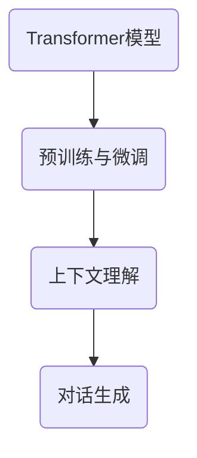
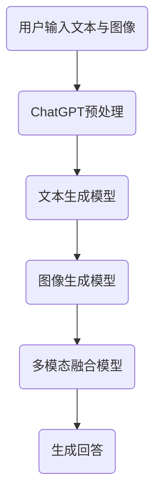

                 

### ChatGPT与自然语言处理

#### 2.1.1 背景介绍

**ChatGPT的基本概念**：ChatGPT是基于GPT（Generative Pre-trained Transformer）模型开发的一种自然语言处理技术。GPT是一种由OpenAI开发的预训练语言模型，通过大量的文本数据进行预训练，使其具有生成自然语言文本的能力。ChatGPT则是在GPT的基础上增加了对话生成的功能，使其能够更好地模拟人类对话行为。

**ChatGPT的发展历程**：ChatGPT首次亮相是在2022年11月30日，由OpenAI发布。它是基于GPT-3.5模型开发的，相比GPT-3，ChatGPT在对话生成的上下文理解和连贯性方面有了显著的提升。

**ChatGPT的应用场景**：ChatGPT在多个领域都有广泛的应用，包括但不限于：
- **对话系统**：如虚拟助手、客户服务机器人等。
- **问答系统**：能够针对用户的问题提供详细的解答。
- **文本生成**：包括文章写作、摘要生成、故事创作等。

#### 2.1.2 核心概念与联系

为了更好地理解ChatGPT，我们需要了解以下几个核心概念：

- **Transformer模型**：Transformer模型是ChatGPT的基础，它是一种基于自注意力机制的深度学习模型，能够有效处理长文本序列。

- **预训练与微调**：ChatGPT通过在大量文本数据上进行预训练，获得了强大的语言理解能力。而在实际应用中，ChatGPT会根据具体任务进行微调，以提高任务的性能。

- **上下文理解**：ChatGPT能够理解对话的上下文，从而生成更加连贯和自然的对话。

以下是ChatGPT的核心概念之间的联系架构Mermaid流程图：

#### 2.1.3 ChatGPT与多模态信息处理的联系

ChatGPT主要用于处理文本信息，但随着技术的发展，多模态信息处理变得越来越重要。多模态信息处理是指同时处理多种类型的数据，如图像、音频、视频和文本等。ChatGPT在多模态信息处理中的应用主要集中在以下几个方面：

- **文本与图像的结合**：ChatGPT可以处理文本和图像的输入，生成与图像相关的文本描述。

- **文本与语音的结合**：ChatGPT可以处理文本输入，并生成相应的语音输出，或者接受语音输入并生成文本输出。

- **多模态问答系统**：ChatGPT可以同时处理文本、图像和语音输入，为用户提供详细的解答。

以下是一个ChatGPT处理多模态信息的简单示例：

通过这个示例，我们可以看到ChatGPT是如何将文本和图像信息进行融合，生成高质量的回答。

### 2.2 多模态提示词的概念

#### 2.2.1 定义

**多模态提示词**是指在多模态信息处理中，用于引导模型进行信息处理和预测的关键词或短语。这些提示词可以来自多种模态，如图像、音频、视频和文本等。多模态提示词的关键在于能够同时提供多种模态的信息，从而帮助模型更好地理解和处理复杂的信息。

#### 2.2.2 构成

多模态提示词通常由以下几个部分构成：

- **文本**：用于描述问题和任务的关键信息。
- **图像**：用于提供视觉信息，如图像内容、颜色、形状等。
- **音频**：用于提供声音信息，如语音、音乐、环境音等。
- **视频**：用于提供动态信息，如视频内容、运动轨迹、人物表情等。

这些信息可以通过多种方式组合，形成不同的多模态提示词。例如，一个多模态提示词可以是“请描述这张图片中的场景，并给出相关的背景信息”。这个提示词同时包含了图像和文本信息。

### 2.3 超维度信息处理

#### 2.3.1 背景介绍

**超维度信息处理**是指处理超过常规维度（如二维、三维）的信息。在多模态信息处理中，超维度信息处理尤为重要。随着技术的发展，信息来源变得更加多样化，如图像、音频、视频和文本等，这些信息往往具有超维度特征。

#### 2.3.2 挑战

**数据复杂性**：超维度信息处理需要处理的数据量巨大，且数据格式复杂。这要求模型具备强大的计算能力和良好的数据处理能力。

**计算资源需求**：超维度信息处理通常需要大量的计算资源，特别是在训练阶段。这给模型的开发和部署带来了挑战。

#### 2.3.3 重要性

**提高信息处理效率**：超维度信息处理能够更高效地处理复杂信息，从而提高信息处理的效率。

**增强模型准确性**：通过处理超维度信息，模型能够获得更多的信息，从而提高模型的准确性。

### 2.4 全书结构

本书主要分为以下几个部分：

- **引言**：介绍ChatGPT和多模态提示词的概念，以及超维度信息处理的重要性。
- **理论基础**：阐述多模态信息处理的基本概念和理论框架。
- **ChatGPT工作原理**：详细介绍ChatGPT的架构和核心算法。
- **优化策略**：讨论如何针对多模态提示词进行优化。
- **算法实现**：介绍具体的优化算法和实现细节。
- **应用实例**：通过实际案例展示优化后的ChatGPT在多模态信息处理中的应用。
- **结论与展望**：总结优化策略和实现经验，提出未来研究方向。

通过以上章节，我们将深入探讨ChatGPT在多模态提示词处理中的优化策略，旨在提高模型在处理超维度信息时的效率和准确性。

