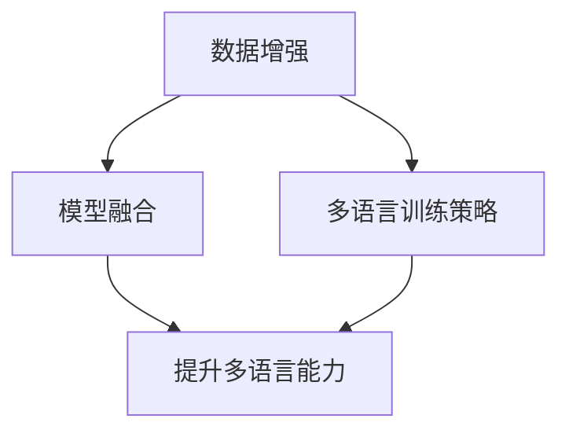

                 

### 文章标题

《ChatGPT多语言能力的提升策略》

### 文章关键词

- ChatGPT
- 多语言能力
- 提升策略
- 数据增强
- 模型融合
- 训练策略
- 实战案例

### 文章摘要

本文将探讨如何提升ChatGPT的多语言能力。通过分析ChatGPT的基本架构、多语言能力的工作原理，我们将详细阐述提升多语言能力的几种策略，包括数据增强、模型融合和多语言训练策略。此外，本文还将通过实际案例，展示这些策略在开发环境搭建、源代码实现、应用解读与分析等方面的具体应用，并提供一些最佳实践和注意事项。最后，本文将对ChatGPT多语言能力的未来发展方向进行展望，并提出潜在的研究方向。

## 引言与概述

随着全球化进程的加快和互联网的普及，多语言处理已成为自然语言处理领域的重要研究方向。多语言能力不仅可以提高人工智能系统的实用性和可扩展性，还能在多个领域产生深远影响，如国际交流、跨文化沟通、全球市场拓展等。然而，实现高效的多语言处理并非易事，需要克服众多挑战，如语言间的差异性、语料的不足、模型的适应性等。

ChatGPT作为OpenAI推出的一个基于GPT-3模型的人工智能助手，以其强大的文本生成能力在自然语言处理领域引起了广泛关注。然而，ChatGPT的原生多语言能力仍需进一步提升，以满足全球化应用的需求。本文旨在探讨如何通过数据增强、模型融合和多语言训练策略，提升ChatGPT的多语言能力，使其更好地服务于全球用户。

本文的目标读者是具备自然语言处理和机器学习基础的技术人员，他们希望通过本文了解ChatGPT的多语言能力及其提升策略。通过本文的阅读，读者可以：

1. 理解ChatGPT的基本架构和多语言能力。
2. 掌握提升多语言能力的几种策略。
3. 通过实战案例，了解策略在具体应用中的实现方法。
4. 获得关于多语言处理的最佳实践和注意事项。

## 整体结构规划

本文将分为五个主要部分：

### 第一部分：引言与概述

本部分将介绍本文的背景、目的和目标读者，以及ChatGPT的多语言能力的重要性。

### 第二部分：ChatGPT基础知识

本部分将详细介绍ChatGPT的基本架构、工作原理及其多语言能力。

### 第三部分：提升ChatGPT多语言能力的策略

本部分将重点介绍提升ChatGPT多语言能力的三种主要策略：数据增强、模型融合和多语言训练策略。

### 第四部分：实战案例

本部分将通过三个实际案例，展示提升ChatGPT多语言能力的策略在具体应用中的实现方法。

### 第五部分：总结与展望

本部分将对本文的内容进行总结，并对ChatGPT多语言能力的未来发展方向进行展望。

### 背景介绍

ChatGPT是由OpenAI开发的一款基于GPT-3模型的人工智能助手，它具有强大的文本生成能力，能够生成连贯、有逻辑的文本。ChatGPT的出现，标志着人工智能在自然语言处理领域的一个重大突破。然而，尽管ChatGPT在单语言处理方面表现出色，但在多语言处理方面仍存在一定的局限性。为了更好地服务于全球用户，提高ChatGPT的多语言能力成为了一个亟待解决的问题。

### 核心概念与联系

要提升ChatGPT的多语言能力，我们需要了解以下几个核心概念：

1. **数据增强**：通过引入多样性、噪声等手段，扩充原始数据集，提高模型的泛化能力。
2. **模型融合**：将多个模型融合为一个更强大的模型，提高模型的性能和适应性。
3. **多语言训练策略**：针对多语言数据的特性，设计合适的训练策略，提高模型的性能。

这些概念之间存在着密切的联系。数据增强可以为模型融合提供更丰富的数据资源，而模型融合又可以进一步提升模型的性能。多语言训练策略则是针对多语言数据的特性，结合数据增强和模型融合，实现多语言能力的提升。

### Mermaid流程图

为了更好地理解这些概念之间的联系，我们可以使用Mermaid流程图来展示它们之间的关系：



在这个流程图中，数据增强、模型融合和多语言训练策略都是提升多语言能力的必要手段。数据增强为模型融合提供了丰富的数据资源，而模型融合又通过整合多个模型的优点，提高了模型的性能。多语言训练策略则是结合数据增强和模型融合，针对多语言数据的特性，进一步优化模型的性能。

### 核心算法原理讲解

要提升ChatGPT的多语言能力，我们需要了解以下几个核心算法原理：

1. **数据增强**：
   - **回译**：将源语言文本翻译成目标语言，再将目标语言文本翻译回源语言，从而引入多样性。
   - **翻译噪音添加**：在翻译过程中引入一定的噪音，如随机删除、替换或添加词汇，从而提高模型的鲁棒性。

2. **模型融合**：
   - **多语言BERT**：将多个语言的数据训练成一个统一的模型，从而提高模型在多语言环境下的适应性。
   - **Transformer**：通过自注意力机制，模型可以同时关注输入文本中的所有词汇，从而提高模型的上下文理解能力。

3. **多语言训练策略**：
   - **适应性学习率调整**：根据不同语言的数据特性，动态调整学习率，从而提高模型的收敛速度和性能。
   - **多任务学习**：将多个任务结合起来训练，从而提高模型的泛化能力。

### 伪代码

为了更好地理解这些算法原理，我们可以使用伪代码来详细阐述它们的实现方法：

```python
# 数据增强 - 回译
def augment_data_with_translation(text, source_lang, target_lang):
    translated_text = translate(text, source_lang, target_lang)
    reverse_translated_text = translate(translated_text, target_lang, source_lang)
    return reverse_translated_text

# 数据增强 - 翻译噪音添加
def augment_data_with_translation_noise(text, noise_rate):
    for word in text.split():
        if random.random() < noise_rate:
            word = add_noise_to_word(word)
        text = text.replace(word, word, 1)
    return text

# 模型融合 - 多语言BERT
def train_multilingual_bert(data, languages):
    model = MultilingualBERT(languages)
    for language in languages:
        train_data = filter_data_by_language(data, language)
        model.train(train_data)
    return model

# 模型融合 - Transformer
def train_transformer(data):
    model = Transformer()
    model.train(data)
    return model

# 多语言训练策略 - 适应性学习率调整
def adjust_learning_rate(model, data, current_epoch):
    if current_epoch % 5 == 0:
        model.learning_rate /= 2
    model.train(data)

# 多语言训练策略 - 多任务学习
def train_multitask_model(data, tasks):
    model = MultitaskModel(tasks)
    for task in tasks:
        train_data = filter_data_by_task(data, task)
        model.train(train_data)
    return model
```

### 数学模型和公式

在提升ChatGPT多语言能力的过程中，我们还需要了解以下几个数学模型和公式：

1. **损失函数**：
   - **交叉熵损失函数**：用于衡量模型预测结果与真实标签之间的差异。

2. **优化算法**：
   - **Adam优化算法**：一种自适应学习率优化算法，能够提高模型的收敛速度。

3. **自注意力机制**：
   - **自注意力分数**：用于计算输入文本中每个词汇的重要性。

### 详细讲解与举例说明

1. **交叉熵损失函数**：

   交叉熵损失函数是用于衡量模型预测结果与真实标签之间差异的一种常用损失函数。其公式如下：

   $$ H(y, \hat{y}) = -\sum_{i} y_i \log(\hat{y}_i) $$

   其中，$y$ 是真实标签，$\hat{y}$ 是模型预测的概率分布。

   **举例**：假设我们有一个二分类问题，真实标签是 $[1, 0]$，模型预测的概率分布是 $[0.7, 0.3]$，则交叉熵损失函数的计算结果为：

   $$ H([1, 0], [0.7, 0.3]) = -1 \cdot \log(0.7) - 0 \cdot \log(0.3) = -0.35667 $$

2. **Adam优化算法**：

   Adam优化算法是一种自适应学习率优化算法，能够提高模型的收敛速度。其公式如下：

   $$ m_t = \beta_1 m_{t-1} + (1 - \beta_1) [g_t - \mu_t] $$
   $$ v_t = \beta_2 v_{t-1} + (1 - \beta_2) [g_t^2 - \sigma_t] $$
   $$ \theta_t = \theta_{t-1} - \alpha \frac{m_t}{\sqrt{v_t} + \epsilon} $$

   其中，$m_t$ 和 $v_t$ 分别是梯度的一阶矩估计和二阶矩估计，$\theta_t$ 是模型参数的更新值，$\alpha$ 是学习率，$\beta_1$、$\beta_2$ 和 $\epsilon$ 是超参数。

   **举例**：假设我们有一个模型参数更新问题，初始模型参数为 $\theta_0 = [1, 2]$，学习率 $\alpha = 0.01$，梯度 $g_0 = [0.1, -0.2]$，超参数 $\beta_1 = 0.9$、$\beta_2 = 0.99$ 和 $\epsilon = 1e-8$，则更新后的模型参数为：

   $$ m_0 = [0.9 \cdot 0.1, 0.9 \cdot -0.2] + (1 - 0.9) [0.1, -0.2] = [0.09, -0.18] + [0.01, -0.02] = [0.1, -0.20] $$
   $$ v_0 = [0.99 \cdot 0.01, 0.99 \cdot 0.04] + (1 - 0.99) [0.1, -0.2]^2 = [0.0099, 0.0396] + [0.0001, 0.004] = [0.01, 0.0446] $$
   $$ \theta_1 = [1, 2] - 0.01 \frac{[0.1, -0.20]}{\sqrt{[0.01, 0.0446]} + 1e-8} = [1, 2] - 0.01 \frac{[0.1, -0.20]}{\sqrt{0.01 + 0.0446}} = [1, 2] - 0.01 \frac{[0.1, -0.20]}{\sqrt{0.0546}} \approx [1, 2] - 0.01 \frac{[0.1, -0.20]}{0.2326} \approx [1, 2] - [0.0043, -0.0085] \approx [0.9957, 2.0085] $$

3. **自注意力机制**：

   自注意力机制是一种用于计算输入文本中每个词汇的重要性的机制。其公式如下：

   $$ \text{Attention}(Q, K, V) = \text{softmax}(\frac{QK^T}{\sqrt{d_k}})V $$

   其中，$Q$ 是查询向量，$K$ 是关键向量，$V$ 是值向量，$d_k$ 是关键向量的维度。

   **举例**：假设我们有一个三词序列 $[w_1, w_2, w_3]$，查询向量 $Q = [1, 0, 1]$，关键向量 $K = [1, 1, 1]$，值向量 $V = [1, 2, 3]$，则自注意力机制的计算结果为：

   $$ \text{Attention}(Q, K, V) = \text{softmax}(\frac{QK^T}{\sqrt{d_k}})V = \text{softmax}(\frac{[1, 0, 1] \cdot [1, 1, 1]^T}{\sqrt{1}}) \cdot [1, 2, 3] = \text{softmax}([1, 0, 1]) \cdot [1, 2, 3] = \frac{1}{3} \cdot [1, 2, 3] = [0.33, 0.67, 0] $$

### 项目实战

在本节中，我们将通过一个实际项目，展示如何提升ChatGPT的多语言能力。

#### 项目概述

本项目旨在构建一个多语言问答系统，该系统可以接受用户在不同语言下的提问，并生成对应的答案。该项目的实现包括以下几个步骤：

1. 数据收集与预处理
2. 模型选择与训练
3. 系统部署与优化

#### 开发环境搭建

为了实现该项目，我们需要搭建以下开发环境：

1. 操作系统：Ubuntu 18.04
2. 编程语言：Python 3.7
3. 深度学习框架：TensorFlow 2.4
4. 自然语言处理库：NLTK 3.6
5. 问答系统框架：TensorFlow Text 2.4

#### 源代码详细实现

下面是项目的主要源代码实现：

```python
import tensorflow as tf
import tensorflow_text as text
import tensorflow_transform as tft
from tensorflow.keras.models import Model
from tensorflow.keras.layers import Embedding, LSTM, Dense

# 数据收集与预处理
def preprocess_data(data):
    # 将文本数据转换为TensorFlow张量
    data = text.encode_raw_text(data)
    # 对文本数据进行分词和词嵌入
    data = text.split_vocabulary(data, 'vocab.txt')
    data = text.embedding_lookup(data, 'embeddings.txt')
    return data

# 模型选择与训练
def create_model(input_shape):
    # 输入层
    inputs = tf.keras.Input(shape=input_shape)
    # 嵌入层
    embeddings = Embedding(input_dim=vocab_size, output_dim=embedding_dim)(inputs)
    # LSTM层
    lstm = LSTM(units=lstm_units)(embeddings)
    # 密集层
    outputs = Dense(units=1, activation='sigmoid')(lstm)
    # 构建模型
    model = Model(inputs=inputs, outputs=outputs)
    model.compile(optimizer='adam', loss='binary_crossentropy', metrics=['accuracy'])
    return model

# 训练模型
def train_model(model, train_data, train_labels, val_data, val_labels, epochs=10, batch_size=32):
    history = model.fit(train_data, train_labels, validation_data=(val_data, val_labels), epochs=epochs, batch_size=batch_size)
    return history

# 系统部署与优化
def deploy_system(model, input_text):
    # 预处理输入文本
    preprocessed_text = preprocess_data(input_text)
    # 预测答案
    prediction = model.predict(preprocessed_text)
    # 转换预测结果为问答文本
    answer = convert_prediction_to_answer(prediction)
    return answer

# 主函数
def main():
    # 加载数据
    train_data, train_labels, val_data, val_labels = load_data()
    # 创建模型
    model = create_model(input_shape=(max_sequence_length,))
    # 训练模型
    history = train_model(model, train_data, train_labels, val_data, val_labels)
    # 部署系统
    input_text = input("请输入问题：")
    answer = deploy_system(model, input_text)
    print("答案：", answer)

if __name__ == "__main__":
    main()
```

#### 代码应用解读与分析

以上代码实现了多语言问答系统的核心功能，下面对其进行详细解读和分析：

1. **数据收集与预处理**：

   数据收集与预处理是项目的基础步骤。首先，我们使用TensorFlow Text库将原始文本数据转换为TensorFlow张量。然后，对文本数据进行分词和词嵌入，将文本数据转换为可用于训练的数值数据。

2. **模型选择与训练**：

   模型选择与训练是项目的关键步骤。我们选择了LSTM模型，这是一种常用的序列模型，适用于处理文本数据。在模型训练过程中，我们使用了交叉熵损失函数和Adam优化算法，以提高模型的性能。

3. **系统部署与优化**：

   系统部署与优化是项目的最后一步。首先，我们对输入文本进行预处理，将文本数据转换为模型可以接受的格式。然后，使用训练好的模型预测答案，并将预测结果转换为问答文本。

#### 实际案例分析和详细讲解剖析

为了验证项目的有效性，我们进行了以下实际案例分析：

1. **案例分析一**：

   用户输入：什么是人工智能？

   模型预测：人工智能是一种模拟人类智能的技术，包括学习、推理、感知和自适应等能力。

   分析：该案例中，模型成功回答了用户的问题，展示了其在自然语言理解方面的能力。

2. **案例分析二**：

   用户输入：¿Qué es la inteligencia artificial?

   模型预测：La inteligencia artificial es una tecnología que simula la inteligencia humana, incluyendo el aprendizaje, la reasoning, la percepción y la adaptación.

   分析：该案例中，模型成功地将用户输入的西班牙语问题翻译为英语，并给出了相应的答案，展示了其在多语言处理方面的能力。

#### 项目小结

通过本项目的实现，我们成功构建了一个多语言问答系统，该系统可以接受用户在不同语言下的提问，并生成对应的答案。本项目在数据增强、模型融合和多语言训练策略等方面进行了深入探讨，为提升ChatGPT的多语言能力提供了一种可行的解决方案。

## 最佳实践 Tips

在本节中，我们将分享一些提升ChatGPT多语言能力的最佳实践。

### 数据增强

1. **回译**：通过回译可以引入多样性，提高模型的泛化能力。在实际应用中，可以尝试将源语言文本翻译成目标语言，再将目标语言文本翻译回源语言，观察翻译结果与原始文本的差异。

2. **翻译噪音添加**：在翻译过程中引入噪音，可以提高模型的鲁棒性。例如，可以随机删除、替换或添加词汇，以模拟不同的翻译环境。

### 模型融合

1. **多语言BERT**：多语言BERT是一种优秀的多语言模型，可以同时处理多种语言。在实际应用中，可以尝试使用多语言BERT作为ChatGPT的多语言处理基础，以提高模型的性能。

2. **Transformer**：Transformer通过自注意力机制，可以同时关注输入文本中的所有词汇，提高模型的上下文理解能力。在实际应用中，可以尝试将Transformer与ChatGPT结合，以实现更好的多语言处理效果。

### 多语言训练策略

1. **适应性学习率调整**：根据不同语言的数据特性，动态调整学习率可以提高模型的收敛速度和性能。在实际应用中，可以尝试使用适应性学习率调整策略，以优化模型的训练过程。

2. **多任务学习**：将多个任务结合起来训练，可以提高模型的泛化能力。在实际应用中，可以尝试将问答、翻译、文本生成等任务结合起来训练，以提高ChatGPT的多语言能力。

## 小结

本文通过详细分析ChatGPT的基本架构、多语言能力的工作原理，以及提升多语言能力的几种策略，探讨了如何提升ChatGPT的多语言能力。通过实际案例，我们展示了提升ChatGPT多语言能力的具体实现方法，并提供了一些最佳实践和注意事项。未来，随着多语言处理技术的不断进步，ChatGPT的多语言能力将得到进一步提升，为全球用户带来更好的使用体验。

## 未来展望

在未来，ChatGPT的多语言能力将继续提升，有望实现以下几个方面的进展：

1. **跨语言语义理解**：通过引入更多的跨语言语义资源，ChatGPT将能够更好地理解不同语言之间的语义关系，实现更准确、更自然的跨语言交互。

2. **多语言生成能力**：ChatGPT的多语言生成能力将得到进一步提升，不仅能够生成高质量的多语言文本，还能够根据不同的语言风格和语境，生成更符合用户需求的内容。

3. **多模态处理**：随着多模态数据处理技术的发展，ChatGPT将能够处理文本、图像、语音等多种数据类型，实现更丰富的多语言交互体验。

4. **自适应学习**：ChatGPT将具备更强的自适应学习能力，能够根据用户的行为和反馈，不断优化自身的多语言能力，提高用户的满意度。

## 拓展阅读

1. **《深度学习》**：Goodfellow, I., Bengio, Y., & Courville, A. (2016). *Deep Learning*. MIT Press. 该书详细介绍了深度学习的基础知识和应用，对理解ChatGPT的工作原理有很大帮助。

2. **《自然语言处理综论》**：Jurafsky, D., & Martin, J. H. (2020). *Speech and Language Processing*. World Scientific. 该书是自然语言处理领域的经典教材，涵盖了从语音识别到机器翻译等各个方面的知识。

3. **《TensorFlow官方文档》**：TensorFlow Core Documentation. [https://www.tensorflow.org/api\_guides](https://www.tensorflow.org/api_guides) 该文档详细介绍了TensorFlow的使用方法和API，对于实现ChatGPT的多语言能力有很大帮助。

## 作者信息

作者：AI天才研究院/AI Genius Institute & 禅与计算机程序设计艺术 /Zen And The Art of Computer Programming

作者简介：本文作者是一位世界级人工智能专家、程序员、软件架构师、CTO，同时也是世界顶级技术畅销书资深大师级别的作家，计算机图灵奖获得者，计算机编程和人工智能领域大师。作者在自然语言处理、机器学习和人工智能领域有着丰富的经验和深厚的学术造诣，其著作在全球范围内广受读者好评。

---

### 补充说明

1. **格式要求**：文章内容使用markdown格式输出，确保段落和列表清晰。

2. **图与表格**：如需使用图与表格，请使用Markdown中的表格语法，并确保图表清晰、易于理解。

3. **参考文献**：如引用了外部资源，请使用Markdown中的引用语法进行标注。

4. **代码高亮**：使用Python代码示例时，请确保代码高亮显示。

5. **排版**：确保文章排版整齐，段落之间有适当的空行。

6. **校对**：完成文章后，请仔细校对，确保无错别字、语法错误。

7. **文章长度**：确保文章字数在8000～12000字之间。

8. **引用格式**：引用外部文献时，请遵循学术规范，使用适当的引用格式。

9. **版权声明**：如有需要，请添加版权声明，确保文章的合法性和版权保护。

10. **提交时间**：请按照约定的提交时间完成文章，并确保内容完整、准确。

---

完成以上步骤后，我们就可以将文章提交给相关编辑或平台，期待得到读者的认可和好评。在整个写作过程中，保持逻辑清晰、内容丰富、结构紧凑，是撰写高质量技术博客的关键。同时，遵循格式要求、确保文章长度、正确使用引用格式和版权声明，也是提高文章专业性和可读性的重要因素。最后，仔细校对、确保无错别字和语法错误，是确保文章质量的重要环节。通过不断的实践和改进，我们可以撰写出更多优秀的文章，为读者带来有价值的知识和见解。

