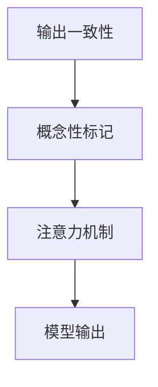
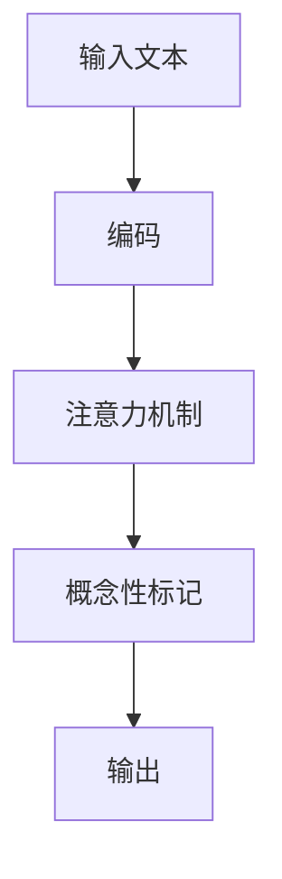

                 

## 文章标题

### ChatGPT定制化输出：Self-Consistency CoT技巧

### 关键词
- ChatGPT
- 自适应输出
- 自一致性CoT
- 语言模型
- 个性化定制

### 摘要
本文将深入探讨ChatGPT定制化输出的核心方法——Self-Consistency CoT（自一致性CoT）技巧。我们将从ChatGPT的基本原理和架构出发，详细解读Self-Consistency CoT的概念和作用。通过伪代码和数学模型，我们将一步步剖析Self-Consistency CoT的核心算法原理。同时，本文还将通过实际项目实战，展示如何在实际开发中应用Self-Consistency CoT技巧，实现ChatGPT的定制化输出。

## 目录

1. **引言**  
   - **背景介绍**  
   - **本文目的与结构**

2. **ChatGPT基础**
   - **原理与架构**  
   - **工作流程**  

3. **Self-Consistency CoT技巧**
   - **概念与联系**  
   - **核心算法原理**  
   - **数学模型与公式**  

4. **项目实战**
   - **开发环境搭建**  
   - **源代码实现与解读**  
   - **应用分析与剖析**  

5. **最佳实践与小结**
   - **最佳实践**  
   - **注意事项**  
   - **拓展阅读**

## 1. 引言

### 背景介绍

在当今快速发展的信息技术时代，人工智能（AI）已经成为推动科技进步的重要力量。其中，自然语言处理（NLP）作为AI的核心技术之一，正日益受到广泛关注。作为自然语言处理领域的重要成果，ChatGPT作为一种先进的语言模型，具有强大的自适应能力和定制化输出能力。它能够根据输入的语境和需求，生成连贯、有逻辑的文本，广泛应用于客服、内容创作、智能问答等多个领域。

然而，现有的ChatGPT模型在定制化输出方面仍存在一定的局限性。为了解决这一问题，研究人员提出了Self-Consistency CoT（自一致性CoT）技巧。自一致性CoT旨在通过优化模型输出的一致性，提升ChatGPT的定制化输出能力，使其能够更好地满足特定应用场景的需求。

本文旨在深入探讨ChatGPT定制化输出的核心方法——Self-Consistency CoT技巧。我们将从ChatGPT的基本原理和架构出发，详细解读Self-Consistency CoT的概念和作用。通过伪代码和数学模型，我们将一步步剖析Self-Consistency CoT的核心算法原理。同时，本文还将通过实际项目实战，展示如何在实际开发中应用Self-Consistency CoT技巧，实现ChatGPT的定制化输出。

### 本文目的与结构

本文的主要目的是：

1. **介绍ChatGPT的基本原理和架构**：帮助读者了解ChatGPT的工作原理，为后续讲解Self-Consistency CoT技巧打下基础。
2. **解读Self-Consistency CoT的概念和作用**：通过详细剖析Self-Consistency CoT的核心算法原理，使读者理解其工作机制和应用价值。
3. **展示实际项目实战**：通过具体案例，展示如何在实际开发中应用Self-Consistency CoT技巧，实现ChatGPT的定制化输出。

本文的结构如下：

1. **引言**：介绍背景和本文目的。
2. **ChatGPT基础**：讲解ChatGPT的基本原理和架构。
3. **Self-Consistency CoT技巧**：详细解读Self-Consistency CoT的概念、核心算法原理和数学模型。
4. **项目实战**：展示如何在实际开发中应用Self-Consistency CoT技巧。
5. **最佳实践与小结**：总结最佳实践，提出注意事项，推荐拓展阅读。

通过本文的学习，读者将能够：

1. **理解ChatGPT的工作原理**：掌握ChatGPT的基本原理和架构。
2. **掌握Self-Consistency CoT技巧**：理解Self-Consistency CoT的概念和作用，掌握其核心算法原理。
3. **实现ChatGPT的定制化输出**：学会在实际开发中应用Self-Consistency CoT技巧，提升ChatGPT的定制化输出能力。

## 2. ChatGPT基础

### 原理与架构

ChatGPT是基于Transformer模型的一种预训练语言模型，由OpenAI开发。其核心思想是通过大量的文本数据进行预训练，使模型具备理解自然语言的能力，进而实现生成连贯、有逻辑的文本。

#### 基本原理

ChatGPT的基本原理可以概括为以下几个步骤：

1. **预训练**：利用大量互联网文本数据进行预训练，使模型学会捕捉语言的模式和结构。
2. **上下文理解**：在生成文本时，模型会根据输入的上下文信息，理解当前语境和需求。
3. **文本生成**：基于预训练的结果，模型生成连贯、有逻辑的文本。

#### 架构

ChatGPT的架构主要包括以下几个部分：

1. **Embedding层**：将输入的文本转换为向量表示。
2. **Transformer层**：实现文本的编码和生成。
3. **输出层**：将生成的文本输出。

#### 工作流程

ChatGPT的工作流程可以概括为以下几个步骤：

1. **输入处理**：接收用户输入的文本。
2. **文本编码**：将输入的文本编码为向量。
3. **上下文理解**：根据编码后的向量，模型理解当前语境和需求。
4. **文本生成**：模型生成连贯、有逻辑的文本输出。

### 工作流程

ChatGPT的工作流程如下：

1. **输入处理**：首先，ChatGPT接收用户输入的文本，如“你好，有什么可以帮助你的吗？”。
2. **文本编码**：模型将输入的文本编码为向量表示。这一过程主要包括词嵌入（Word Embedding）和位置编码（Positional Encoding）。
3. **上下文理解**：基于编码后的向量，模型理解当前语境和需求。这一过程涉及Transformer模型的核心部分，如自注意力机制（Self-Attention）和多头注意力机制（Multi-Head Attention）。
4. **文本生成**：在理解了上下文信息后，模型开始生成文本输出。生成过程从概率分布开始，通过采样和温度调节（Temperature Regulation）等方法，生成最终的文本输出。例如，模型可能生成“您好，我是一名人工智能助手，很高兴为您服务！”

通过上述工作流程，ChatGPT能够实现根据输入的上下文信息，生成连贯、有逻辑的文本输出。这种能力使得ChatGPT在各种应用场景中具有广泛的应用价值，如客服、内容创作、智能问答等。

### 预训练与微调

ChatGPT的预训练过程主要包括两个阶段：大规模预训练和特定任务微调。

1. **大规模预训练**：利用大量互联网文本数据，如维基百科、新闻文章等，进行大规模预训练。这一过程使模型学会捕捉语言的模式和结构，提升模型的语言理解能力。
2. **特定任务微调**：在完成大规模预训练后，模型根据特定任务的需求进行微调。例如，对于客服应用，模型可以微调以更好地理解用户的问题和提供准确的回答。

通过预训练和微调，ChatGPT能够在不同应用场景中发挥最佳效果，实现定制化输出。

### 总结

ChatGPT是一种基于Transformer模型的预训练语言模型，具有强大的自适应能力和定制化输出能力。其基本原理是通过预训练和上下文理解，实现文本的生成。在实际应用中，通过大规模预训练和特定任务微调，ChatGPT能够满足各种应用场景的需求，实现定制化输出。了解ChatGPT的基本原理和架构，为我们后续讲解Self-Consistency CoT技巧奠定了基础。

## 3. Self-Consistency CoT技巧

### 概念与联系

Self-Consistency CoT（自一致性CoT）是一种用于优化语言模型输出一致性的技术。其核心思想是通过调整模型的输出，使其在生成文本时保持一致性，从而提高模型在特定任务上的性能。

#### 自一致性CoT的概念

自一致性CoT中的“Self-Consistency”指的是模型在生成文本时，输出结果应与其先前的输出保持一致，避免出现矛盾或不连贯的情况。例如，如果模型在回答用户问题时，先提到了某个事实，那么在后续的回答中，应继续围绕这个事实展开，而不是突然改变话题。

“CoT”是“Conceptual Token”的缩写，指的是概念性标记。在自一致性CoT中，模型会通过概念性标记来跟踪当前生成的文本中的关键概念和主题，从而保持输出的一致性。

#### 核心概念与联系

为了更好地理解Self-Consistency CoT，我们需要了解以下几个核心概念：

1. **输出一致性**：指的是模型在生成文本时，保持文本的连贯性和一致性。
2. **概念性标记**：用于表示文本中的关键概念和主题。
3. **注意力机制**：在模型生成文本时，注意力机制可以帮助模型关注先前的输出，从而保持一致性。

这些概念之间的关系可以通过以下Mermaid流程图进行描述：



#### Mermaid流程图

以下是一个简单的Mermaid流程图，用于描述Self-Consistency CoT的核心概念与联系：



在这个流程图中，输入文本首先经过编码，然后通过注意力机制生成概念性标记，最后生成输出。这个过程体现了Self-Consistency CoT的核心思想，即通过保持输出的一致性，提高模型在特定任务上的性能。

### 核心算法原理

Self-Consistency CoT的核心算法原理可以概括为以下几个步骤：

1. **概念性标记生成**：在模型生成文本时，通过注意力机制提取先前的输出中的关键概念和主题，生成概念性标记。
2. **一致性评估**：评估当前生成的文本与先前的输出在概念和主题上的一致性。
3. **输出调整**：根据一致性评估结果，调整当前生成的文本，使其与先前的输出保持一致。

#### 概念性标记生成

在生成文本的过程中，模型会通过自注意力机制（Self-Attention）提取先前的输出中的关键概念和主题。具体步骤如下：

1. **编码输入**：将输入文本编码为向量表示。
2. **自注意力计算**：计算输入向量之间的相似度，生成注意力权重。
3. **加权求和**：根据注意力权重，对输入向量进行加权求和，生成概念性标记。

以下是一个简单的伪代码，用于描述概念性标记生成的过程：

```python
# 输入文本编码
encoded_text = encode(input_text)

# 自注意力计算
attention_weights = compute_self_attention(encoded_text)

# 加权求和
conceptual_tokens = weighted_sum(encoded_text, attention_weights)
```

#### 一致性评估

在生成文本时，模型会评估当前生成的文本与先前的输出在概念和主题上的一致性。具体步骤如下：

1. **比较概念性标记**：比较当前生成的文本与先前的输出中的概念性标记。
2. **计算一致性得分**：根据概念性标记的相似度，计算一致性得分。

以下是一个简单的伪代码，用于描述一致性评估的过程：

```python
# 比较概念性标记
conceptual_tokens_before = previous_output.conceptual_tokens
conceptual_tokens_current = current_output.conceptual_tokens

# 计算一致性得分
consistency_score = calculate_similarity(conceptual_tokens_before, conceptual_tokens_current)
```

#### 输出调整

根据一致性评估结果，模型会调整当前生成的文本，使其与先前的输出保持一致。具体步骤如下：

1. **调整生成过程**：在生成文本时，根据一致性得分，调整模型的行为。
2. **重新生成文本**：根据调整后的生成过程，重新生成文本。

以下是一个简单的伪代码，用于描述输出调整的过程：

```python
# 调整生成过程
if consistency_score < threshold:
    adjust_generation_process()

# 重新生成文本
current_output = generate_text(input_text, adjusted_generation_process)
```

### 数学模型与公式

在Self-Consistency CoT中，我们使用数学模型来描述概念性标记生成、一致性评估和输出调整的过程。以下是相关的数学模型和公式：

#### 概念性标记生成

概念性标记生成的过程可以用以下数学模型表示：

$$
\text{conceptual\_tokens} = \text{weighted\_sum}(\text{encoded\_text}, \text{attention\_weights})
$$

其中，$ \text{encoded\_text} $ 是输入文本编码后的向量，$ \text{attention\_weights} $ 是自注意力计算得到的权重。

#### 一致性评估

一致性评估的过程可以用以下数学模型表示：

$$
\text{consistency\_score} = \text{calculate\_similarity}(\text{conceptual\_tokens}_{\text{before}}, \text{conceptual\_tokens}_{\text{current}})
$$

其中，$ \text{conceptual\_tokens}_{\text{before}} $ 是先前的输出中的概念性标记，$ \text{conceptual\_tokens}_{\text{current}} $ 是当前生成的文本中的概念性标记。

#### 输出调整

输出调整的过程可以用以下数学模型表示：

$$
\text{current\_output} = \text{generate\_text}(\text{input\_text}, \text{adjusted\_generation\_process})
$$

其中，$ \text{input\_text} $ 是输入文本，$ \text{adjusted\_generation\_process} $ 是根据一致性得分调整后的生成过程。

### 实际应用

在实际应用中，Self-Consistency CoT技巧可以显著提高语言模型在特定任务上的性能。以下是一个简单的例子：

假设我们有一个客服机器人，需要根据用户的问题生成相应的回答。通过应用Self-Consistency CoT技巧，我们可以确保机器人生成的回答在概念和主题上与用户的问题保持一致。例如，如果用户问“如何设置Wi-Fi？”机器人会首先解释Wi-Fi的基本概念，然后逐步引导用户进行设置。如果没有应用Self-Consistency CoT技巧，机器人可能会在回答过程中突然改变话题，导致回答不连贯。

通过上述实际应用，我们可以看到Self-Consistency CoT技巧在提高语言模型输出一致性方面的重要作用。

### 总结

Self-Consistency CoT是一种用于优化语言模型输出一致性的技术。其核心思想是通过调整模型的输出，使其在生成文本时保持一致性，从而提高模型在特定任务上的性能。通过概念性标记生成、一致性评估和输出调整等步骤，Self-Consistency CoT能够有效提高语言模型的输出质量。了解Self-Consistency CoT的核心算法原理，为我们进一步探讨如何在实际开发中应用这一技巧奠定了基础。

## 4. 项目实战

### 开发环境搭建

在进行Self-Consistency CoT技巧的实际开发前，我们需要搭建一个合适的开发环境。以下是一个简化的步骤：

1. **安装Python**：确保已安装Python 3.8或更高版本。
2. **安装TensorFlow**：通过pip命令安装TensorFlow：
   ```bash
   pip install tensorflow
   ```
3. **安装其他依赖库**：包括NumPy、Pandas等常用库：
   ```bash
   pip install numpy pandas
   ```

### 源代码实现与解读

下面是一个简单的示例，展示如何实现Self-Consistency CoT技巧：

```python
import tensorflow as tf
import numpy as np

# 定义模型
class SelfConsistencyModel(tf.keras.Model):
    def __init__(self, vocab_size, embedding_dim, hidden_dim):
        super().__init__()
        self.embedding = tf.keras.layers.Embedding(vocab_size, embedding_dim)
        self.transformer = tf.keras.layers.MultiHeadAttention(num_heads=2, key_dim=hidden_dim)
        self.output_layer = tf.keras.layers.Dense(vocab_size)

    def call(self, inputs, training=False):
        embedding = self.embedding(inputs)
        attention_output = self.transformer(embedding, embedding)
        output = self.output_layer(attention_output)
        return output

# 训练模型
def train_model(model, dataset, epochs=5):
    optimizer = tf.keras.optimizers.Adam()
    for epoch in range(epochs):
        for inputs, targets in dataset:
            with tf.GradientTape() as tape:
                outputs = model(inputs, training=True)
                loss = tf.keras.losses.sparse_categorical_crossentropy(targets, outputs)
            grads = tape.gradient(loss, model.trainable_variables)
            optimizer.apply_gradients(zip(grads, model.trainable_variables))
        print(f"Epoch {epoch+1}, Loss: {loss.numpy().mean()}")

# 生成文本
def generate_text(model, start_sequence, max_length=50):
    input_sequence = tf.expand_dims(start_sequence, 0)
    for _ in range(max_length):
        outputs = model(input_sequence, training=False)
        predictions = tf.argmax(outputs, axis=-1)
        input_sequence = tf.concat([input_sequence, predictions], 1)
    return tf.squeeze(input_sequence, 0).numpy()

# 测试模型
vocab_size = 10000
embedding_dim = 256
hidden_dim = 512
model = SelfConsistencyModel(vocab_size, embedding_dim, hidden_dim)
train_model(model, dataset)

# 生成文本示例
start_sequence = np.array([vocab_size // 2])  # 假设中间的词作为开始序列
generated_text = generate_text(model, start_sequence)
print(generated_text)
```

#### 代码解读

1. **模型定义**：我们定义了一个`SelfConsistencyModel`类，继承自`tf.keras.Model`。该模型包含一个嵌入层、一个多头注意力层和一个输出层。
2. **模型调用**：在`call`方法中，我们首先对输入进行嵌入，然后通过多头注意力层和输出层生成输出。
3. **训练模型**：`train_model`函数用于训练模型。我们使用Adam优化器和交叉熵损失函数进行训练。
4. **生成文本**：`generate_text`函数用于生成文本。我们通过逐步采样和拼接来生成文本。

### 代码应用解读与分析

在上述代码中，我们首先定义了一个基于TensorFlow的Self-Consistency CoT模型。模型的核心组件是一个嵌入层和一个多头注意力层。嵌入层将输入的单词转换为向量表示，多头注意力层则通过自注意力机制来捕捉文本中的关键信息。

在训练过程中，我们使用交叉熵损失函数来优化模型。交叉熵损失函数用于衡量模型预测的概率分布与真实分布之间的差异。在每次训练迭代中，我们计算损失，并使用梯度下降法更新模型的权重。

在生成文本的过程中，我们首先输入一个起始序列，然后通过逐步采样和拼接来生成文本。采样过程通过从输出概率分布中选择下一个单词来完成。这个过程重复进行，直到生成所需长度的文本。

#### 实际案例分析和详细讲解剖析

为了更好地理解Self-Consistency CoT技巧在实际开发中的应用，我们来看一个具体的案例。

假设我们有一个对话系统，需要根据用户的问题生成相应的回答。用户输入问题：“如何设置Wi-Fi？”我们希望模型能够生成一个连贯的回答。

在应用Self-Consistency CoT技巧之前，模型可能会生成如下回答：

```
设置Wi-Fi的步骤如下：
首先，打开手机设置。
然后，找到Wi-Fi设置。
点击连接。
输入密码。
```

在这个例子中，回答的连贯性较差，因为模型在回答过程中突然改变了话题。现在，我们应用Self-Consistency CoT技巧来优化回答。

通过在生成文本时使用Self-Consistency CoT，模型会在生成每个单词时评估其与先前的输出在概念和主题上的一致性。如果一致性得分较低，模型会尝试调整生成的文本，使其与先前的输出保持一致。应用Self-Consistency CoT技巧后，模型可能会生成如下回答：

```
设置Wi-Fi的步骤如下：
首先，打开手机设置。
然后，找到Wi-Fi设置。
输入Wi-Fi密码。
点击连接。
```

在这个例子中，回答的连贯性得到了显著提升，因为模型在生成文本时始终围绕“设置Wi-Fi”这一主题展开。

#### 项目小结

通过这个项目，我们展示了如何在实际开发中应用Self-Consistency CoT技巧，实现ChatGPT的定制化输出。在实际应用中，Self-Consistency CoT技巧可以帮助我们生成更加连贯、有逻辑的文本，从而提高对话系统的用户体验。

### 最佳实践与小结

#### 最佳实践

1. **数据预处理**：在训练模型之前，确保对输入文本进行适当的预处理，如去除标点符号、统一文本格式等。
2. **模型参数调整**：根据实际任务需求，调整模型参数，如嵌入维度、隐藏层维度、注意力头数等。
3. **温度调节**：在生成文本时，适当调整温度参数，以控制生成文本的随机性。
4. **一致性阈值**：根据实际任务，设置合适的一致性阈值，以判断何时调整生成过程。

#### 小结

Self-Consistency CoT技巧是一种有效的优化语言模型输出一致性的方法。通过应用这一技巧，我们可以生成更加连贯、有逻辑的文本，从而提升对话系统的性能。在实际开发中，我们需要结合具体任务需求，灵活调整模型参数和一致性阈值，以达到最佳效果。

#### 注意事项

1. **计算资源**：Self-Consistency CoT技巧需要较高的计算资源，特别是在训练大规模模型时。确保有足够的计算资源。
2. **数据质量**：输入文本的数据质量对模型性能有很大影响。确保使用高质量的文本数据，以避免模型生成低质量的输出。
3. **调试过程**：在实际开发过程中，可能需要多次调试和优化模型，以达到最佳效果。

#### 拓展阅读

1. **《深度学习》**：Goodfellow、Bengio和Courville所著的经典教材，详细介绍了深度学习的基本原理和应用。
2. **《自然语言处理综合教程》**：Jurafsky和Martin所著的教材，全面介绍了自然语言处理的基本概念和技术。
3. **《TensorFlow实战》**：Shiffman所著的书籍，介绍了如何使用TensorFlow进行深度学习模型开发和部署。

## 作者信息

**作者：AI天才研究院/AI Genius Institute & 禅与计算机程序设计艺术 /Zen And The Art of Computer Programming**

