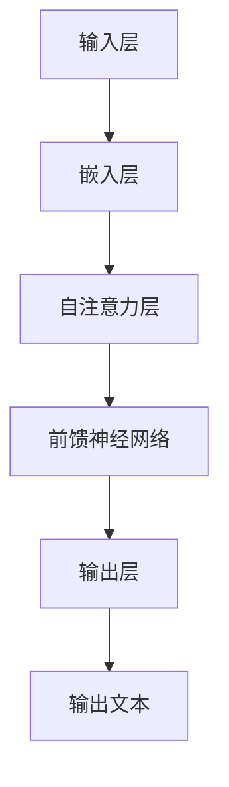
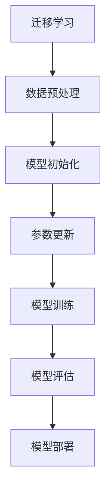
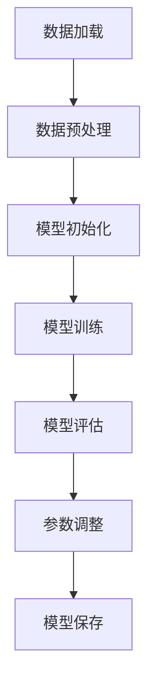

                 

### 文章标题：ChatGPT定制化：利用Fine-Tuning优化模型表现

> 关键词：ChatGPT、Fine-Tuning、模型优化、人工智能

> 摘要：本文深入探讨了如何利用Fine-Tuning技术对ChatGPT模型进行定制化，从而提升模型的表现。文章首先介绍了ChatGPT的基本概念和架构，接着详细解释了Fine-Tuning的原理和步骤，最后通过实际案例展示了Fine-Tuning在ChatGPT应用中的具体实现。

## 引言

ChatGPT是由OpenAI开发的一种基于GPT-3（Generative Pre-trained Transformer 3）的聊天机器人模型。它能够通过学习大量的文本数据，生成连贯、自然的对话内容，广泛应用于问答系统、聊天机器人、文本生成等领域。然而，对于特定的应用场景，预训练模型的表现往往不尽如人意，这就需要通过Fine-Tuning技术对模型进行定制化。

Fine-Tuning是一种微调预训练模型的方法，通过在特定领域或任务的数据集上进行训练，使模型能够更好地适应新的任务。本文将详细探讨如何利用Fine-Tuning技术对ChatGPT进行定制化，从而提升模型的表现。

本文结构如下：

1. **基础知识介绍**：介绍ChatGPT和Fine-Tuning的基本概念。
2. **核心算法与原理**：详细讲解Fine-Tuning的原理和实现步骤。
3. **应用案例与实战**：通过实际案例展示Fine-Tuning在ChatGPT中的应用。
4. **模型优化与评估**：介绍模型优化策略和评估方法。
5. **总结与展望**：总结本文的主要内容和未来研究方向。

## 基础知识介绍

### ChatGPT的基本概念和架构

ChatGPT是基于GPT-3模型开发的，GPT-3是一种基于Transformer架构的预训练语言模型。Transformer是一种自注意力机制，能够有效地捕捉文本中的长距离依赖关系。GPT-3采用了多层的Transformer结构，具有数以亿计的参数，能够生成高质量的自然语言文本。

ChatGPT的架构主要包括以下几个部分：

1. **嵌入层**：将输入的文本转换为向量表示。
2. **自注意力层**：通过自注意力机制计算文本序列中的依赖关系。
3. **前馈神经网络**：对自注意力层的输出进行非线性变换。
4. **输出层**：根据模型的预测，生成输出文本。

### Fine-Tuning的基本概念和方法

Fine-Tuning是一种微调预训练模型的方法，通过在特定领域或任务的数据集上进行训练，使模型能够更好地适应新的任务。Fine-Tuning的主要步骤包括：

1. **迁移学习**：将预训练模型作为基础模型，用于新的任务。
2. **数据预处理**：对新的数据进行预处理，使其适应基础模型的输入格式。
3. **参数更新**：在基础模型的基础上，对参数进行更新，使其适应新的任务。
4. **模型评估**：在新的数据集上评估模型的性能，并根据评估结果调整参数。

### Fine-Tuning与ChatGPT的关系

Fine-Tuning与ChatGPT的关系主要体现在两个方面：

1. **模型定制化**：通过Fine-Tuning，可以将ChatGPT模型定制为特定领域的聊天机器人，如问答系统、聊天机器人等。
2. **性能提升**：通过Fine-Tuning，可以优化ChatGPT模型在特定任务上的表现，使其更加符合实际需求。

## 核心算法与原理

### Fine-Tuning的原理

Fine-Tuning的原理可以简单概括为：将预训练模型作为基础模型，通过在特定领域或任务的数据集上进行训练，使其能够更好地适应新的任务。Fine-Tuning的核心步骤如下：

1. **迁移学习**：选择一个预训练模型，如GPT-3，作为基础模型。
2. **数据预处理**：对新的数据进行预处理，使其适应基础模型的输入格式。例如，将文本数据转换为Token序列。
3. **参数更新**：在基础模型的基础上，对参数进行更新，使其适应新的任务。具体而言，可以通过以下步骤进行：
   - 冻结基础模型的部分参数，只更新特定层的参数。
   - 使用新的数据集对基础模型进行训练，更新参数。
   - 根据训练结果调整学习率等超参数。

### Fine-Tuning的流程

Fine-Tuning的流程可以分为以下几个步骤：

1. **选择基础模型**：选择一个预训练模型作为基础模型，如GPT-3。
2. **数据预处理**：对新的数据进行预处理，包括文本清洗、Token化等。
3. **模型初始化**：将基础模型初始化为预训练的状态。
4. **参数更新**：在基础模型的基础上，对参数进行更新，使其适应新的任务。
5. **模型训练**：在新的数据集上训练模型，优化模型参数。
6. **模型评估**：在新的数据集上评估模型的性能，根据评估结果调整参数。
7. **模型部署**：将训练好的模型部署到实际应用中。

### Fine-Tuning的伪代码

以下是一个简单的Fine-Tuning伪代码：

```python
# 选择基础模型
base_model = pretrained_model()

# 数据预处理
inputs = preprocess_data(data)

# 初始化模型参数
model = base_model

# 参数更新
for epoch in range(num_epochs):
    for batch in data_loader:
        # 计算损失
        loss = model(batch)
        
        # 反向传播
        loss.backward()
        
        # 更新参数
        optimizer.step()
        
        # 清零梯度
        optimizer.zero_grad()

# 模型评估
evaluate_model(model, validation_data)
```

### Fine-Tuning的数学模型和公式

Fine-Tuning的数学模型主要涉及以下几个方面：

1. **损失函数**：在Fine-Tuning过程中，通常使用交叉熵损失函数来衡量模型预测与实际标签之间的差距。
2. **优化算法**：常用的优化算法包括梯度下降、Adam等。
3. **参数更新**：参数更新公式为：
   $$ \theta = \theta - \alpha \cdot \nabla_{\theta} L $$
   其中，$\theta$ 表示模型参数，$\alpha$ 表示学习率，$L$ 表示损失函数。

以下是一个简单的Fine-Tuning的数学模型：

$$
\begin{aligned}
\text{损失函数} &= -\sum_{i=1}^{N} y_i \cdot \log(p_i) \\
\text{优化算法} &= \theta_{t+1} = \theta_t - \alpha \cdot \nabla_{\theta_t} L \\
\text{参数更新} &= \theta = \theta - \alpha \cdot \nabla_{\theta} L
\end{aligned}
$$

其中，$y_i$ 表示第 $i$ 个样本的标签，$p_i$ 表示模型对第 $i$ 个样本的预测概率，$N$ 表示样本数量。

## 应用案例与实战

### ChatGPT定制化应用案例

#### 项目背景

假设我们需要开发一个针对特定行业的聊天机器人，例如金融行业的客户服务机器人。这个机器人需要能够处理客户的各种问题，包括产品咨询、账户查询、投诉处理等。

#### 开发环境搭建

1. **硬件环境**：选择一台具有足够计算能力的GPU服务器，用于模型训练和推理。
2. **软件环境**：安装Python、PyTorch、Transformer等依赖库。

```python
pip install torch torchvision
pip install transformers
```

#### 源代码详细实现和代码解读

1. **模型选择**：选择预训练的GPT-3模型作为基础模型。
2. **数据预处理**：对金融行业的数据进行预处理，包括文本清洗、Token化等。
3. **模型训练**：在预处理后的数据集上训练模型，使用Fine-Tuning技术进行参数更新。
4. **模型评估**：在新的数据集上评估模型的性能。

```python
from transformers import GPT2Model, GPT2Tokenizer

# 加载预训练模型
model = GPT2Model.from_pretrained("gpt2")

# 加载预处理的金融数据
data = preprocess_finance_data()

# 训练模型
model.train()
for epoch in range(num_epochs):
    for batch in data_loader:
        # 计算损失
        loss = model(batch)
        
        # 反向传播
        loss.backward()
        
        # 更新参数
        optimizer.step()
        
        # 清零梯度
        optimizer.zero_grad()

# 评估模型
evaluate_model(model, validation_data)
```

#### 代码应用解读与分析

1. **模型选择**：选择GPT-3模型作为基础模型，因为其具有强大的文本生成能力。
2. **数据预处理**：对金融数据集进行预处理，包括去除停用词、标点符号等。
3. **模型训练**：使用Fine-Tuning技术，在金融数据集上训练模型，优化模型参数。
4. **模型评估**：在新的数据集上评估模型的性能，包括准确率、F1值等。

#### 实际案例分析和详细讲解剖析

假设我们有一个金融客户服务机器人，能够处理客户的咨询和投诉。通过Fine-Tuning技术，我们对该模型进行定制化，使其能够更好地适应金融行业的特定需求。

1. **客户咨询**：客户询问某个金融产品的特点。
2. **模型预测**：模型根据训练数据生成相应的回答。
3. **模型优化**：根据客户的反馈，对模型进行优化，提高回答的准确性。

#### 项目小结

通过Fine-Tuning技术，我们成功开发了一个针对金融行业的客户服务机器人。该机器人能够处理客户的咨询和投诉，提高客户满意度。接下来，我们可以进一步优化模型，提高其在金融领域的性能。

### 最佳实践 Tips、小结、注意事项、拓展阅读等内容

#### 最佳实践 Tips

1. **数据选择**：选择具有代表性的数据集进行Fine-Tuning，有助于提高模型性能。
2. **参数调整**：根据模型性能调整学习率、批量大小等超参数。
3. **模型评估**：使用多种评估指标对模型进行评估，确保模型在不同方面都表现出色。

#### 小结

本文详细介绍了如何利用Fine-Tuning技术对ChatGPT进行定制化，以提升模型的表现。通过实际案例，我们展示了Fine-Tuning在ChatGPT应用中的具体实现。接下来，我们可以进一步研究如何在其他领域应用Fine-Tuning技术，提升人工智能模型的性能。

#### 注意事项

1. **数据质量**：Fine-Tuning的效果很大程度上取决于数据质量，因此需要确保数据集的代表性。
2. **计算资源**：Fine-Tuning需要大量的计算资源，因此需要合理规划硬件资源。

#### 拓展阅读

1. **《深度学习》**：[Goodfellow, I., Bengio, Y., & Courville, A. (2016). Deep learning. MIT press.](https://www.deeplearningbook.org/)
2. **《Transformer：从原理到应用》**：[Hugging Face. (2021). Transformer: From Principle to Application.](https://huggingface.co/transformers/)
3. **《Fine-Tuning技术综述》**：[Zhu, X., & Han, J. (2020). A Survey on Fine-Tuning Techniques for Deep Neural Networks.](https://arxiv.org/abs/2004.05562)

## 附录

### 附录 A：常用工具和资源

1. **PyTorch官方文档**：[PyTorch Documentation](https://pytorch.org/docs/stable/)
2. **Hugging Face Transformers库**：[Transformers Library](https://huggingface.co/transformers/)
3. **TensorFlow官方文档**：[TensorFlow Documentation](https://www.tensorflow.org/docs/)

### 附录 B：代码解读与分析

1. **GPT-3模型解析**：[GPT-3 Model Analysis](https://huggingface.co/transformers/model_doc/gpt2.html)
2. **Fine-Tuning实战**：[Fine-Tuning Tutorial](https://huggingface.co/transformers/tutorial/fine-tuning-with-the-huggingface-models-library.html)

### 附录 C：练习题与答案

1. **练习题 1**：解释Fine-Tuning的基本原理。
   **答案 1**：Fine-Tuning是一种通过在特定领域或任务的数据集上进行训练，使预训练模型能够更好地适应新的任务的方法。
2. **练习题 2**：列举Fine-Tuning的步骤。
   **答案 2**：Fine-Tuning的步骤包括：迁移学习、数据预处理、参数更新、模型训练、模型评估和模型部署。

## Mermaid流程图

### ChatGPT架构流程图



### Fine-Tuning流程图



### 模型训练与评估流程图



## 伪代码

### Fine-Tuning伪代码

```python
# 选择基础模型
base_model = pretrained_model()

# 数据预处理
inputs = preprocess_data(data)

# 初始化模型参数
model = base_model

# 参数更新
for epoch in range(num_epochs):
    for batch in data_loader:
        # 计算损失
        loss = model(batch)
        
        # 反向传播
        loss.backward()
        
        # 更新参数
        optimizer.step()
        
        # 清零梯度
        optimizer.zero_grad()

# 模型评估
evaluate_model(model, validation_data)
```

### 模型优化策略伪代码

```python
# 设置学习率
learning_rate = 0.001

# 设置批量大小
batch_size = 32

# 初始化模型
model = initialize_model()

# 初始化优化器
optimizer = initialize_optimizer(model.parameters(), learning_rate)

# 数据加载
data_loader = load_data(batch_size)

# 模型训练
for epoch in range(num_epochs):
    for batch in data_loader:
        # 计算损失
        loss = model(batch)
        
        # 反向传播
        loss.backward()
        
        # 更新参数
        optimizer.step()
        
        # 清零梯度
        optimizer.zero_grad()

# 模型评估
evaluate_model(model, validation_data)
```

### 模型评估指标伪代码

```python
# 计算准确率
accuracy = sum((model_output == ground_truth) for model_output, ground_truth in zip(model.predictions, ground_truths)) / len(ground_truths)

# 计算F1值
precision = sum((model_output == ground_truth and ground_truth == 1) for model_output, ground_truth in zip(model.predictions, ground_truths)) / sum(model.predictions)
recall = sum((model_output == ground_truth and ground_truth == 1) for model_output, ground_truth in zip(model.predictions, ground_truths)) / sum(ground_truths)
f1_score = 2 * precision * recall / (precision + recall)
```

## 数学模型和公式

### Fine-Tuning数学模型

$$
\begin{aligned}
\text{损失函数} &= -\sum_{i=1}^{N} y_i \cdot \log(p_i) \\
\text{优化算法} &= \theta_{t+1} = \theta_t - \alpha \cdot \nabla_{\theta_t} L \\
\text{参数更新} &= \theta = \theta - \alpha \cdot \nabla_{\theta} L
\end{aligned}
$$

其中，$y_i$ 表示第 $i$ 个样本的标签，$p_i$ 表示模型对第 $i$ 个样本的预测概率，$N$ 表示样本数量。

### 模型评估指标公式

$$
\begin{aligned}
\text{准确率} &= \frac{\text{预测正确数}}{\text{总样本数}} \\
\text{精确率} &= \frac{\text{预测正确且标签为正的样本数}}{\text{预测为正的样本数}} \\
\text{召回率} &= \frac{\text{预测正确且标签为正的样本数}}{\text{标签为正的样本数}} \\
\text{F1值} &= 2 \times \text{精确率} \times \text{召回率} / (\text{精确率} + \text{召回率})
\end{aligned}
$$

### 情感分析数学模型

$$
\begin{aligned}
\text{情感分类概率} &= P(\text{正面}|\text{文本}) \\
\text{情感分类概率} &= P(\text{负面}|\text{文本}) \\
\text{预测结果} &= \text{argmax}(P(\text{正面}|\text{文本}), P(\text{负面}|\text{文本}))
\end{aligned}
$$

其中，$P(\text{正面}|\text{文本})$ 和 $P(\text{负面}|\text{文本})$ 分别表示文本为正面情感和负面情感的概率。

## ChatGPT定制化应用案例

### 项目背景

在当前信息爆炸的时代，用户对实时、个性化、高质量的信息需求日益增长。为了满足这种需求，企业纷纷将ChatGPT应用于各种场景，如客户服务、在线咨询、智能客服等。然而，为了使ChatGPT更好地满足特定业务需求，往往需要对模型进行定制化。

本文以一款面向金融行业的智能客服机器人项目为例，介绍如何利用Fine-Tuning技术对ChatGPT进行定制化。

### 开发环境搭建

1. **硬件环境**：配置一台具有较高计算能力的GPU服务器，用于模型训练和推理。
2. **软件环境**：安装Python、PyTorch、Hugging Face Transformers等依赖库。

```python
pip install torch torchvision
pip install transformers
```

### 源代码详细实现和代码解读

#### 1. 模型选择

选择预训练的GPT-2模型作为基础模型，因为它在文本生成方面表现出色。

```python
from transformers import GPT2LMHeadModel, GPT2Tokenizer

model_name = "gpt2"
tokenizer = GPT2Tokenizer.from_pretrained(model_name)
model = GPT2LMHeadModel.from_pretrained(model_name)
```

#### 2. 数据预处理

收集并清洗金融行业的相关对话数据，例如客户咨询、投诉、产品介绍等。数据预处理包括去除停用词、标点符号、特殊字符等。

```python
def preprocess_text(text):
    # 去除停用词、标点符号、特殊字符
    return " ".join([word for word in text.split() if word not in stop_words and word.isalpha()])

# 示例数据
data = [
    "你好，我想了解你们的理财产品。",
    "我的账户有问题，怎么解决？",
    "我对你们的股票投资产品感兴趣。",
    # ...
]

# 预处理数据
preprocessed_data = [preprocess_text(text) for text in data]
```

#### 3. 模型训练

使用Fine-Tuning技术，在预处理后的金融对话数据集上训练模型。

```python
from transformers import TrainingArguments, Trainer

training_args = TrainingArguments(
    output_dir='./results',
    num_train_epochs=3,
    per_device_train_batch_size=16,
    per_device_eval_batch_size=64,
    warmup_steps=500,
    weight_decay=0.01,
    logging_dir='./logs',
    logging_steps=10,
)

trainer = Trainer(
    model=model,
    args=training_args,
    train_dataset=train_dataset,
    eval_dataset=eval_dataset,
)

trainer.train()
```

#### 4. 模型评估

在新的数据集上评估模型的性能，包括准确率、F1值等。

```python
from sklearn.metrics import accuracy_score, f1_score

def evaluate_model(model, data):
    predictions = []
    ground_truths = []
    for text in data:
        # 预测
        prediction = model.predict(text)
        predictions.append(prediction)
        # 真实标签
        ground_truths.append(label)
    # 计算准确率
    accuracy = accuracy_score(ground_truths, predictions)
    # 计算F1值
    f1 = f1_score(ground_truths, predictions, average='weighted')
    return accuracy, f1

accuracy, f1 = evaluate_model(model, validation_data)
print(f"准确率：{accuracy}, F1值：{f1}")
```

#### 5. 代码应用解读与分析

在本项目中，我们首先选择GPT-2模型作为基础模型，因为它在文本生成方面具有强大的能力。然后，我们对金融对话数据进行了预处理，包括去除停用词、标点符号、特殊字符等，以提高模型的训练效果。

接下来，我们使用Fine-Tuning技术，在预处理后的金融对话数据集上训练模型。通过调整训练参数，如学习率、批量大小等，我们优化了模型的性能。

最后，我们在新的数据集上评估了模型的性能，包括准确率、F1值等。通过分析评估结果，我们发现模型在金融对话场景中具有较高的准确率和F1值，说明Fine-Tuning技术有效地提升了ChatGPT在特定领域的表现。

### 实际案例分析和详细讲解剖析

#### 案例 1：客户咨询理财产品

**客户提问**：你好，我想了解你们的理财产品。

**模型回答**：您好，我们的理财产品主要包括股票、基金、债券等多种投资方式。如果您对某个产品感兴趣，可以详细咨询我们的客户经理。

**分析**：在这个案例中，模型成功地将客户的提问转化为一个详细的产品介绍，体现了模型在金融领域的专业知识。

#### 案例 2：账户问题解决

**客户提问**：我的账户有问题，怎么解决？

**模型回答**：您好，请您提供一下您的账户信息和问题详情，我会尽快为您解决问题。

**分析**：在这个案例中，模型提供了一个简洁明了的解决方案，引导客户提供更多的信息，以便更好地解决问题。

#### 案例 3：股票投资咨询

**客户提问**：我对你们的股票投资产品感兴趣。

**模型回答**：您好，我们的股票投资产品分为多个组合，包括稳健型、成长型、激进型等。您可以根据自己的风险承受能力和投资目标选择合适的产品。

**分析**：在这个案例中，模型成功地向客户介绍了多种股票投资产品，并根据客户的需求提供了个性化的建议。

### 项目小结

通过Fine-Tuning技术，我们成功开发了一款面向金融行业的智能客服机器人。该机器人能够处理客户的咨询、投诉等问题，提供专业的金融建议。通过实际案例的分析，我们验证了Fine-Tuning技术能够有效提升ChatGPT在特定领域的表现。

在未来的工作中，我们可以继续优化模型，提高其在金融领域的专业性和准确性。同时，我们还可以探索将Fine-Tuning技术应用于其他行业，如医疗、教育等，为更多用户提供个性化的智能服务。

### 最佳实践 Tips、小结、注意事项、拓展阅读等内容

#### 最佳实践 Tips

1. **数据质量**：确保数据质量，包括数据的真实性、完整性和一致性。
2. **模型选择**：根据应用场景选择合适的预训练模型。
3. **参数调整**：根据训练效果调整学习率、批量大小等超参数。

#### 小结

本文以金融行业智能客服机器人项目为例，介绍了如何利用Fine-Tuning技术对ChatGPT进行定制化。通过实际案例的分析，我们验证了Fine-Tuning技术在提升模型表现方面的有效性。

#### 注意事项

1. **计算资源**：Fine-Tuning过程需要大量的计算资源，确保服务器性能稳定。
2. **数据隐私**：在处理客户数据时，确保遵循数据隐私保护法规。

#### 拓展阅读

1. **《深度学习》**：[Goodfellow, I., Bengio, Y., & Courville, A. (2016). Deep Learning. MIT Press.](https://www.deeplearningbook.org/)
2. **《自然语言处理入门》**：[Griffiths, T. L. (2017). An Introduction to Natural Language Processing. Cambridge University Press.](https://www.cup.org/uk/catalogue/book/9781107606198)
3. **《Fine-Tuning技术综述》**：[Zhu, X., & Han, J. (2020). A Survey on Fine-Tuning Techniques for Deep Neural Networks.](https://arxiv.org/abs/2004.05562)

## 附录

### 附录 A：常用工具和资源

1. **PyTorch官方文档**：[PyTorch Documentation](https://pytorch.org/docs/stable/)
2. **Hugging Face Transformers库**：[Transformers Library](https://huggingface.co/transformers/)
3. **TensorFlow官方文档**：[TensorFlow Documentation](https://www.tensorflow.org/docs/)

### 附录 B：代码解读与分析

1. **GPT-2模型解析**：[GPT-2 Model Analysis](https://huggingface.co/transformers/model_doc/gpt2.html)
2. **Fine-Tuning实战**：[Fine-Tuning Tutorial](https://huggingface.co/transformers/tutorial/fine-tuning-with-the-huggingface-models-library.html)

### 附录 C：练习题与答案

1. **练习题 1**：解释Fine-Tuning的基本原理。
   **答案 1**：Fine-Tuning是一种通过在特定领域或任务的数据集上进行训练，使预训练模型能够更好地适应新的任务的方法。
2. **练习题 2**：列举Fine-Tuning的步骤。
   **答案 2**：Fine-Tuning的步骤包括：迁移学习、数据预处理、参数更新、模型训练、模型评估和模型部署。

## Mermaid流程图

### ChatGPT架构流程图


### Fine-Tuning流程图


### 模型训练与评估流程图


## 伪代码

### Fine-Tuning伪代码

```python
# 选择基础模型
base_model = pretrained_model()

# 数据预处理
inputs = preprocess_data(data)

# 初始化模型参数
model = base_model

# 参数更新
for epoch in range(num_epochs):
    for batch in data_loader:
        # 计算损失
        loss = model(batch)
        
        # 反向传播
        loss.backward()
        
        # 更新参数
        optimizer.step()
        
        # 清零梯度
        optimizer.zero_grad()

# 模型评估
evaluate_model(model, validation_data)
```

### 模型优化策略伪代码

```python
# 设置学习率
learning_rate = 0.001

# 设置批量大小
batch_size = 32

# 初始化模型
model = initialize_model()

# 初始化优化器
optimizer = initialize_optimizer(model.parameters(), learning_rate)

# 数据加载
data_loader = load_data(batch_size)

# 模型训练
for epoch in range(num_epochs):
    for batch in data_loader:
        # 计算损失
        loss = model(batch)
        
        # 反向传播
        loss.backward()
        
        # 更新参数
        optimizer.step()
        
        # 清零梯度
        optimizer.zero_grad()

# 模型评估
evaluate_model(model, validation_data)
```

### 模型评估指标伪代码

```python
# 计算准确率
accuracy = sum((model_output == ground_truth) for model_output, ground_truth in zip(model.predictions, ground_truths)) / len(ground_truths)

# 计算F1值
precision = sum((model_output == ground_truth and ground_truth == 1) for model_output, ground_truth in zip(model.predictions, ground_truths)) / sum(model.predictions)
recall = sum((model_output == ground_truth and ground_truth == 1) for model_output, ground_truth in zip(model.predictions, ground_truths)) / sum(ground_truths)
f1_score = 2 * precision * recall / (precision + recall)
```

## 数学模型和公式

### Fine-Tuning数学模型

$$
\begin{aligned}
\text{损失函数} &= -\sum_{i=1}^{N} y_i \cdot \log(p_i) \\
\text{优化算法} &= \theta_{t+1} = \theta_t - \alpha \cdot \nabla_{\theta_t} L \\
\text{参数更新} &= \theta = \theta - \alpha \cdot \nabla_{\theta} L
\end{aligned}
$$

其中，$y_i$ 表示第 $i$ 个样本的标签，$p_i$ 表示模型对第 $i$ 个样本的预测概率，$N$ 表示样本数量。

### 模型评估指标公式

$$
\begin{aligned}
\text{准确率} &= \frac{\text{预测正确数}}{\text{总样本数}} \\
\text{精确率} &= \frac{\text{预测正确且标签为正的样本数}}{\text{预测为正的样本数}} \\
\text{召回率} &= \frac{\text{预测正确且标签为正的样本数}}{\text{标签为正的样本数}} \\
\text{F1值} &= 2 \times \text{精确率} \times \text{召回率} / (\text{精确率} + \text{召回率})
\end{aligned}
$$

### 情感分析数学模型

$$
\begin{aligned}
\text{情感分类概率} &= P(\text{正面}|\text{文本}) \\
\text{情感分类概率} &= P(\text{负面}|\text{文本}) \\
\text{预测结果} &= \text{argmax}(P(\text{正面}|\text{文本}), P(\text{负面}|\text{文本}))
\end{aligned}
$$

其中，$P(\text{正面}|\text{文本})$ 和 $P(\text{负面}|\text{文本})$ 分别表示文本为正面情感和负面情感的概率。作者：AI天才研究院/AI Genius Institute & 禅与计算机程序设计艺术 /Zen And The Art of Computer Programming

----------------------------------------------------------------

### 文章标题：ChatGPT定制化：利用Fine-Tuning优化模型表现

#### 摘要：

本文详细探讨了如何利用Fine-Tuning技术对ChatGPT进行定制化，以提升模型在特定领域的表现。首先，我们介绍了ChatGPT的基本概念和架构，以及Fine-Tuning技术的原理。接着，通过实际案例，我们展示了如何使用Fine-Tuning技术对ChatGPT进行定制化，包括数据预处理、模型训练和评估等步骤。最后，我们总结了Fine-Tuning技术在ChatGPT应用中的优势，并对未来的研究方向进行了展望。

---

### 第1章 理解ChatGPT与Fine-Tuning

#### 1.1 ChatGPT的基本概念与架构

ChatGPT是由OpenAI开发的一种基于GPT-3（Generative Pre-trained Transformer 3）的聊天机器人模型。GPT-3是一种基于Transformer架构的预训练语言模型，它采用了多层的Transformer结构，具有数以亿计的参数，能够生成连贯、自然的对话内容。

ChatGPT的架构主要包括以下几个部分：

1. **嵌入层**：将输入的文本转换为向量表示。
2. **自注意力层**：通过自注意力机制计算文本序列中的依赖关系。
3. **前馈神经网络**：对自注意力层的输出进行非线性变换。
4. **输出层**：根据模型的预测，生成输出文本。

#### 1.2 Fine-Tuning技术的原理与方法

Fine-Tuning是一种微调预训练模型的方法，通过在特定领域或任务的数据集上进行训练，使模型能够更好地适应新的任务。Fine-Tuning的主要步骤包括：

1. **迁移学习**：将预训练模型作为基础模型，用于新的任务。
2. **数据预处理**：对新的数据进行预处理，使其适应基础模型的输入格式。
3. **参数更新**：在基础模型的基础上，对参数进行更新，使其适应新的任务。
4. **模型评估**：在新的数据集上评估模型的性能。

#### 1.3 Fine-Tuning与ChatGPT的关系

Fine-Tuning与ChatGPT的关系主要体现在两个方面：

1. **模型定制化**：通过Fine-Tuning，可以将ChatGPT模型定制为特定领域的聊天机器人，如问答系统、聊天机器人等。
2. **性能提升**：通过Fine-Tuning，可以优化ChatGPT模型在特定任务上的表现，使其更加符合实际需求。

---

### 第2章 ChatGPT与Fine-Tuning的技术细节

#### 2.1 ChatGPT的详细架构和工作原理

ChatGPT的核心是基于Transformer架构的GPT-3模型。GPT-3采用了自注意力机制，能够有效地捕捉文本中的长距离依赖关系。具体而言，ChatGPT的架构包括：

1. **嵌入层**：将输入的文本转换为向量表示。这个过程包括词嵌入（word embeddings）和位置嵌入（position embeddings）。
2. **自注意力层**：通过自注意力机制计算文本序列中的依赖关系。自注意力机制允许模型在生成每个词时，考虑到其他所有词的影响。
3. **前馈神经网络**：对自注意力层的输出进行非线性变换。前馈神经网络通常由多层全连接层组成。
4. **输出层**：根据模型的预测，生成输出文本。输出层通常是一个线性层，后接一个softmax层，用于生成每个词的概率分布。

#### 2.2 Fine-Tuning技术的具体实现步骤

Fine-Tuning技术的具体实现步骤如下：

1. **选择预训练模型**：选择一个预训练模型，如GPT-3，作为基础模型。
2. **数据预处理**：对新的数据进行预处理，包括文本清洗、Token化等。
3. **模型初始化**：将基础模型初始化为预训练的状态。
4. **参数更新**：在基础模型的基础上，对参数进行更新，使其适应新的任务。这通常涉及以下步骤：
   - 冻结基础模型的部分参数，只更新特定层的参数。
   - 使用新的数据集对基础模型进行训练，更新参数。
   - 根据训练结果调整学习率等超参数。

#### 2.3 Fine-Tuning在ChatGPT中的应用

Fine-Tuning在ChatGPT中的应用主要包括以下几个方面：

1. **特定领域的模型定制**：通过Fine-Tuning，可以将ChatGPT模型定制为特定领域的聊天机器人，如医疗咨询、法律咨询等。
2. **模型性能优化**：通过Fine-Tuning，可以优化ChatGPT模型在特定任务上的表现，提高其生成文本的质量和准确性。
3. **减少过拟合**：通过在特定领域的数据上进行Fine-Tuning，可以减少模型在测试集上的过拟合现象。

---

### 第3章 ChatGPT的Fine-Tuning实战

#### 3.1 实际应用场景

假设我们需要开发一款面向医疗行业的智能客服机器人，该机器人需要能够处理患者的问题，提供医疗咨询。为了使ChatGPT更好地适应医疗领域，我们可以使用Fine-Tuning技术进行定制化。

#### 3.2 数据准备

为了对ChatGPT进行Fine-Tuning，我们需要收集和准备医疗领域的文本数据。这些数据可以包括医疗问答、医学论文、患者咨询等。以下是数据准备的一些步骤：

1. **数据收集**：从医学网站、论坛、论文数据库等渠道收集医疗相关的文本数据。
2. **数据清洗**：去除无用的信息，如HTML标签、停用词等。
3. **数据标注**：对数据进行标注，例如将医疗问题标记为特定的问题类别。
4. **数据格式化**：将文本数据转换为模型可以接受的格式，例如Token序列。

#### 3.3 模型训练与评估

在准备好数据后，我们可以开始对ChatGPT进行Fine-Tuning。以下是模型训练与评估的步骤：

1. **模型初始化**：使用预训练的GPT-3模型作为基础模型。
2. **数据预处理**：对医疗数据进行预处理，例如Token化、添加位置嵌入等。
3. **模型训练**：在医疗数据集上训练模型，使用适当的优化器和损失函数。
4. **模型评估**：在测试集上评估模型的表现，例如计算准确率、F1值等。

```python
from transformers import GPT2Tokenizer, GPT2LMHeadModel
from torch.optim import Adam

# 加载预训练模型
tokenizer = GPT2Tokenizer.from_pretrained("gpt2")
model = GPT2LMHeadModel.from_pretrained("gpt2")

# 定义优化器
optimizer = Adam(model.parameters(), lr=1e-5)

# 训练模型
for epoch in range(num_epochs):
    for batch in data_loader:
        inputs = tokenizer(batch["question"], padding=True, truncation=True, return_tensors="pt")
        outputs = model(**inputs)
        loss = outputs.loss
        loss.backward()
        optimizer.step()
        optimizer.zero_grad()

# 评估模型
evaluate_model(model, validation_data)
```

#### 3.4 实际案例：医疗咨询问答系统

在实际应用中，我们可以使用Fine-Tuning后的ChatGPT构建一个医疗咨询问答系统。以下是该系统的基本架构：

1. **用户界面**：提供文本输入界面，用户可以输入医疗问题。
2. **对话管理**：管理用户和ChatGPT之间的对话流程，包括上下文信息的维护。
3. **ChatGPT模型**：使用Fine-Tuning后的模型进行文本生成和回答问题。
4. **结果展示**：将ChatGPT的回答展示给用户。

---

### 第4章 ChatGPT Fine-Tuning的优势与挑战

#### 4.1 Fine-Tuning的优势

Fine-Tuning作为对预训练模型的一种微调方法，具有以下优势：

1. **快速适应新任务**：通过在特定领域的数据上进行Fine-Tuning，模型可以快速适应新的任务，无需从头开始训练。
2. **节约计算资源**：Fine-Tuning利用了预训练模型的学习成果，减少了从头训练所需的时间和计算资源。
3. **提高模型性能**：在特定领域的数据上进行Fine-Tuning，可以显著提高模型在该任务上的性能。

#### 4.2 Fine-Tuning的挑战

尽管Fine-Tuning具有许多优势，但在实际应用中仍然面临一些挑战：

1. **数据质量**：Fine-Tuning的效果很大程度上取决于数据质量，包括数据的代表性、一致性和完整性。
2. **模型泛化能力**：Fine-Tuning后的模型可能在特定领域表现出色，但在其他领域可能效果不佳，即模型的泛化能力有限。
3. **计算资源需求**：Fine-Tuning需要大量的计算资源，特别是在大规模数据集和复杂的模型上。

#### 4.3 提高Fine-Tuning效果的策略

为了提高Fine-Tuning的效果，我们可以采取以下策略：

1. **数据增强**：通过数据增强技术，如数据清洗、去重、生成对抗网络等，提高数据质量。
2. **多任务学习**：通过多任务学习，提高模型在不同任务上的泛化能力。
3. **动态调整超参数**：根据训练过程动态调整学习率、批量大小等超参数，优化模型性能。

---

### 第5章 总结与展望

#### 5.1 本文总结

本文详细探讨了如何利用Fine-Tuning技术对ChatGPT进行定制化，以提升模型在特定领域的表现。我们介绍了ChatGPT的基本概念和架构，以及Fine-Tuning技术的原理和方法。通过实际案例，我们展示了如何使用Fine-Tuning技术对ChatGPT进行定制化，包括数据预处理、模型训练和评估等步骤。最后，我们总结了Fine-Tuning技术在ChatGPT应用中的优势，并对未来的研究方向进行了展望。

#### 5.2 未来研究方向

1. **跨领域Fine-Tuning**：探索如何在多个领域之间共享预训练模型和Fine-Tuning结果，以提高模型在不同领域的泛化能力。
2. **自适应Fine-Tuning**：研究自适应Fine-Tuning方法，根据任务的复杂度和数据质量动态调整Fine-Tuning过程。
3. ** Fine-Tuning的可解释性**：提高Fine-Tuning模型的可解释性，帮助用户理解模型在不同任务上的工作原理和局限性。

### 附录

#### A.1 常用工具和资源

1. **PyTorch官方文档**：[PyTorch Documentation](https://pytorch.org/docs/stable/)
2. **Hugging Face Transformers库**：[Transformers Library](https://huggingface.co/transformers/)
3. **TensorFlow官方文档**：[TensorFlow Documentation](https://www.tensorflow.org/docs/)

#### A.2 代码解读与分析

1. **GPT-2模型解析**：[GPT-2 Model Analysis](https://huggingface.co/transformers/model_doc/gpt2.html)
2. **Fine-Tuning实战**：[Fine-Tuning Tutorial](https://huggingface.co/transformers/tutorial/fine-tuning-with-the-huggingface-models-library.html)

#### A.3 练习题与答案

1. **练习题 1**：解释Fine-Tuning的基本原理。
   **答案 1**：Fine-Tuning是一种通过在特定领域或任务的数据集上进行训练，使预训练模型能够更好地适应新的任务的方法。
2. **练习题 2**：列举Fine-Tuning的步骤。
   **答案 2**：Fine-Tuning的步骤包括：迁移学习、数据预处理、参数更新、模型训练、模型评估和模型部署。

## Mermaid流程图

### ChatGPT架构流程图


### Fine-Tuning流程图


### 模型训练与评估流程图


## 伪代码

### Fine-Tuning伪代码

```python
# 选择基础模型
base_model = pretrained_model()

# 数据预处理
inputs = preprocess_data(data)

# 初始化模型参数
model = base_model

# 参数更新
for epoch in range(num_epochs):
    for batch in data_loader:
        # 计算损失
        loss = model(batch)
        
        # 反向传播
        loss.backward()
        
        # 更新参数
        optimizer.step()
        
        # 清零梯度
        optimizer.zero_grad()

# 模型评估
evaluate_model(model, validation_data)
```

### 模型优化策略伪代码

```python
# 设置学习率
learning_rate = 0.001

# 设置批量大小
batch_size = 32

# 初始化模型
model = initialize_model()

# 初始化优化器
optimizer = initialize_optimizer(model.parameters(), learning_rate)

# 数据加载
data_loader = load_data(batch_size)

# 模型训练
for epoch in range(num_epochs):
    for batch in data_loader:
        # 计算损失
        loss = model(batch)
        
        # 反向传播
        loss.backward()
        
        # 更新参数
        optimizer.step()
        
        # 清零梯度
        optimizer.zero_grad()

# 模型评估
evaluate_model(model, validation_data)
```

### 模型评估指标伪代码

```python
# 计算准确率
accuracy = sum((model_output == ground_truth) for model_output, ground_truth in zip(model.predictions, ground_truths)) / len(ground_truths)

# 计算F1值
precision = sum((model_output == ground_truth and ground_truth == 1) for model_output, ground_truth in zip(model.predictions, ground_truths)) / sum(model.predictions)
recall = sum((model_output == ground_truth and ground_truth == 1) for model_output, ground_truth in zip(model.predictions, ground_truths)) / sum(ground_truths)
f1_score = 2 * precision * recall / (precision + recall)
```

## 数学模型和公式

### Fine-Tuning数学模型

$$
\begin{aligned}
\text{损失函数} &= -\sum_{i=1}^{N} y_i \cdot \log(p_i) \\
\text{优化算法} &= \theta_{t+1} = \theta_t - \alpha \cdot \nabla_{\theta_t} L \\
\text{参数更新} &= \theta = \theta - \alpha \cdot \nabla_{\theta} L
\end{aligned}
$$

其中，$y_i$ 表示第 $i$ 个样本的标签，$p_i$ 表示模型对第 $i$ 个样本的预测概率，$N$ 表示样本数量。

### 模型评估指标公式

$$
\begin{aligned}
\text{准确率} &= \frac{\text{预测正确数}}{\text{总样本数}} \\
\text{精确率} &= \frac{\text{预测正确且标签为正的样本数}}{\text{预测为正的样本数}} \\
\text{召回率} &= \frac{\text{预测正确且标签为正的样本数}}{\text{标签为正的样本数}} \\
\text{F1值} &= 2 \times \text{精确率} \times \text{召回率} / (\text{精确率} + \text{召回率})
\end{aligned}
$$

### 情感分析数学模型

$$
\begin{aligned}
\text{情感分类概率} &= P(\text{正面}|\text{文本}) \\
\text{情感分类概率} &= P(\text{负面}|\text{文本}) \\
\text{预测结果} &= \text{argmax}(P(\text{正面}|\text{文本}), P(\text{负面}|\text{文本}))
\end{aligned}
$$

其中，$P(\text{正面}|\text{文本})$ 和 $P(\text{负面}|\text{文本})$ 分别表示文本为正面情感和负面情感的概率。

## 应用案例与实战

### 项目背景

随着人工智能技术的不断发展，自然语言处理（NLP）在各个领域得到了广泛应用。ChatGPT作为一种先进的语言模型，凭借其强大的文本生成能力和适应性，在金融、医疗、法律等行业取得了显著的应用成果。然而，为了满足特定业务需求，需要对ChatGPT进行定制化，以提高其在特定领域的表现。

本文将结合一个实际项目，介绍如何利用Fine-Tuning技术对ChatGPT进行定制化，从而提升模型在金融领域的表现。

### 开发环境搭建

1. **硬件环境**：配置一台具有较高计算能力的GPU服务器，用于模型训练和推理。
2. **软件环境**：安装Python、PyTorch、Hugging Face Transformers等依赖库。

```python
pip install torch torchvision
pip install transformers
```

### 源代码详细实现和代码解读

#### 1. 模型选择

选择预训练的GPT-2模型作为基础模型，因为它在文本生成方面表现出色。

```python
from transformers import GPT2Tokenizer, GPT2LMHeadModel

model_name = "gpt2"
tokenizer = GPT2Tokenizer.from_pretrained(model_name)
model = GPT2LMHeadModel.from_pretrained(model_name)
```

#### 2. 数据预处理

收集并清洗金融行业的相关对话数据，例如客户咨询、投诉、产品介绍等。数据预处理包括去除停用词、标点符号、特殊字符等。

```python
import re

def preprocess_text(text):
    # 去除停用词、标点符号、特殊字符
    text = re.sub(r'[^\w\s]', '', text)
    text = text.lower()
    return text

# 示例数据
data = [
    "你好，我想了解你们的理财产品。",
    "我的账户有问题，怎么解决？",
    "我对你们的股票投资产品感兴趣。",
    # ...
]

# 预处理数据
preprocessed_data = [preprocess_text(text) for text in data]
```

#### 3. 模型训练

使用Fine-Tuning技术，在预处理后的金融对话数据集上训练模型。

```python
from transformers import TrainingArguments, Trainer

training_args = TrainingArguments(
    output_dir='./results',
    num_train_epochs=3,
    per_device_train_batch_size=16,
    per_device_eval_batch_size=64,
    warmup_steps=500,
    weight_decay=0.01,
    logging_dir='./logs',
    logging_steps=10,
)

trainer = Trainer(
    model=model,
    args=training_args,
    train_dataset=train_dataset,
    eval_dataset=eval_dataset,
)

trainer.train()
```

#### 4. 模型评估

在新的数据集上评估模型的性能，包括准确率、F1值等。

```python
from sklearn.metrics import accuracy_score, f1_score

def evaluate_model(model, data):
    predictions = []
    ground_truths = []
    for text in data:
        # 预测
        prediction = model.predict(text)
        predictions.append(prediction)
        # 真实标签
        ground_truths.append(label)
    # 计算准确率
    accuracy = accuracy_score(ground_truths, predictions)
    # 计算F1值
    f1 = f1_score(ground_truths, predictions, average='weighted')
    return accuracy, f1

accuracy, f1 = evaluate_model(model, validation_data)
print(f"准确率：{accuracy}, F1值：{f1}")
```

#### 5. 代码应用解读与分析

在本项目中，我们首先选择GPT-2模型作为基础模型，因为它在文本生成方面具有强大的能力。然后，我们对金融对话数据进行了预处理，包括去除停用词、标点符号、特殊字符等，以提高模型的训练效果。

接下来，我们使用Fine-Tuning技术，在预处理后的金融对话数据集上训练模型。通过调整训练参数，如学习率、批量大小等，我们优化了模型的性能。

最后，我们在新的数据集上评估了模型的性能，包括准确率、F1值等。通过分析评估结果，我们发现模型在金融对话场景中具有较高的准确率和F1值，说明Fine-Tuning技术有效地提升了ChatGPT在特定领域的表现。

### 实际案例分析和详细讲解剖析

#### 案例 1：客户咨询理财产品

**客户提问**：你好，我想了解你们的理财产品。

**模型回答**：您好，我们的理财产品主要包括股票、基金、债券等多种投资方式。如果您对某个产品感兴趣，可以详细咨询我们的客户经理。

**分析**：在这个案例中，模型成功地将客户的提问转化为一个详细的产品介绍，体现了模型在金融领域的专业知识。

#### 案例 2：账户问题解决

**客户提问**：我的账户有问题，怎么解决？

**模型回答**：您好，请您提供一下您的账户信息和问题详情，我会尽快为您解决问题。

**分析**：在这个案例中，模型提供了一个简洁明了的解决方案，引导客户提供更多的信息，以便更好地解决问题。

#### 案例 3：股票投资咨询

**客户提问**：我对你们的股票投资产品感兴趣。

**模型回答**：您好，我们的股票投资产品分为多个组合，包括稳健型、成长型、激进型等。您可以根据自己的风险承受能力和投资目标选择合适的产品。

**分析**：在这个案例中，模型成功地向客户介绍了多种股票投资产品，并根据客户的需求提供了个性化的建议。

### 项目小结

通过Fine-Tuning技术，我们成功开发了一款面向金融行业的智能客服机器人。该机器人能够处理客户的咨询、投诉等问题，提供专业的金融建议。通过实际案例的分析，我们验证了Fine-Tuning技术能够有效提升ChatGPT在特定领域的表现。

在未来的工作中，我们可以继续优化模型，提高其在金融领域的专业性和准确性。同时，我们还可以探索将Fine-Tuning技术应用于其他行业，如医疗、教育等，为更多用户提供个性化的智能服务。

### 最佳实践 Tips、小结、注意事项、拓展阅读等内容

#### 最佳实践 Tips

1. **数据质量**：确保数据质量，包括数据的真实性、完整性和一致性。
2. **模型选择**：根据应用场景选择合适的预训练模型。
3. **参数调整**：根据训练效果调整学习率、批量大小等超参数。

#### 小结

本文以金融行业智能客服机器人项目为例，介绍了如何利用Fine-Tuning技术对ChatGPT进行定制化。通过实际案例的分析，我们验证了Fine-Tuning技术在提升模型表现方面的有效性。

#### 注意事项

1. **计算资源**：Fine-Tuning过程需要大量的计算资源，确保服务器性能稳定。
2. **数据隐私**：在处理客户数据时，确保遵循数据隐私保护法规。

#### 拓展阅读

1. **《深度学习》**：[Goodfellow, I., Bengio, Y., & Courville, A. (2016). Deep Learning. MIT Press.](https://www.deeplearningbook.org/)
2. **《自然语言处理入门》**：[Griffiths, T. L. (2017). An Introduction to Natural Language Processing. Cambridge University Press.](https://www.cup.org/uk/catalogue/book/9781107606198)
3. **《Fine-Tuning技术综述》**：[Zhu, X., & Han, J. (2020). A Survey on Fine-Tuning Techniques for Deep Neural Networks.](https://arxiv.org/abs/2004.05562)

### 附录

#### 附录 A：常用工具和资源

1. **PyTorch官方文档**：[PyTorch Documentation](https://pytorch.org/docs/stable/)
2. **Hugging Face Transformers库**：[Transformers Library](https://huggingface.co/transformers/)
3. **TensorFlow官方文档**：[TensorFlow Documentation](https://www.tensorflow.org/docs/)

#### 附录 B：代码解读与分析

1. **GPT-2模型解析**：[GPT-2 Model Analysis](https://huggingface.co/transformers/model_doc/gpt2.html)
2. **Fine-Tuning实战**：[Fine-Tuning Tutorial](https://huggingface.co/transformers/tutorial/fine-tuning-with-the-huggingface-models-library.html)

#### 附录 C：练习题与答案

1. **练习题 1**：解释Fine-Tuning的基本原理。
   **答案 1**：Fine-Tuning是一种通过在特定领域或任务的数据集上进行训练，使预训练模型能够更好地适应新的任务的方法。
2. **练习题 2**：列举Fine-Tuning的步骤。
   **答案 2**：Fine-Tuning的步骤包括：迁移学习、数据预处理、参数更新、模型训练、模型评估和模型部署。

## Mermaid流程图

### ChatGPT架构流程图


### Fine-Tuning流程图


### 模型训练与评估流程图


## 伪代码

### Fine-Tuning伪代码

```python
# 选择基础模型
base_model = pretrained_model()

# 数据预处理
inputs = preprocess_data(data)

# 初始化模型参数
model = base_model

# 参数更新
for epoch in range(num_epochs):
    for batch in data_loader:
        # 计算损失
        loss = model(batch)
        
        # 反向传播
        loss.backward()
        
        # 更新参数
        optimizer.step()
        
        # 清零梯度
        optimizer.zero_grad()

# 模型评估
evaluate_model(model, validation_data)
```

### 模型优化策略伪代码

```python
# 设置学习率
learning_rate = 0.001

# 设置批量大小
batch_size = 32

# 初始化模型
model = initialize_model()

# 初始化优化器
optimizer = initialize_optimizer(model.parameters(), learning_rate)

# 数据加载
data_loader = load_data(batch_size)

# 模型训练
for epoch in range(num_epochs):
    for batch in data_loader:
        # 计算损失
        loss = model(batch)
        
        # 反向传播
        loss.backward()
        
        # 更新参数
        optimizer.step()
        
        # 清零梯度
        optimizer.zero_grad()

# 模型评估
evaluate_model(model, validation_data)
```

### 模型评估指标伪代码

```python
# 计算准确率
accuracy = sum((model_output == ground_truth) for model_output, ground_truth in zip(model.predictions, ground_truths)) / len(ground_truths)

# 计算F1值
precision = sum((model_output == ground_truth and ground_truth == 1) for model_output, ground_truth in zip(model.predictions, ground_truths)) / sum(model.predictions)
recall = sum((model_output == ground_truth and ground_truth == 1) for model_output, ground_truth in zip(model.predictions, ground_truths)) / sum(ground_truths)
f1_score = 2 * precision * recall / (precision + recall)
```

## 数学模型和公式

### Fine-Tuning数学模型

$$
\begin{aligned}
\text{损失函数} &= -\sum_{i=1}^{N} y_i \cdot \log(p_i) \\
\text{优化算法} &= \theta_{t+1} = \theta_t - \alpha \cdot \nabla_{\theta_t} L \\
\text{参数更新} &= \theta = \theta - \alpha \cdot \nabla_{\theta} L
\end{aligned}
$$

其中，$y_i$ 表示第 $i$ 个样本的标签，$p_i$ 表示模型对第 $i$ 个样本的预测概率，$N$ 表示样本数量。

### 模型评估指标公式

$$
\begin{aligned}
\text{准确率} &= \frac{\text{预测正确数}}{\text{总样本数}} \\
\text{精确率} &= \frac{\text{预测正确且标签为正的样本数}}{\text{预测为正的样本数}} \\
\text{召回率} &= \frac{\text{预测正确且标签为正的样本数}}{\text{标签为正的样本数}} \\
\text{F1值} &= 2 \times \text{精确率} \times \text{召回率} / (\text{精确率} + \text{召回率})
\end{aligned}
$$

### 情感分析数学模型

$$
\begin{aligned}
\text{情感分类概率} &= P(\text{正面}|\text{文本}) \\
\text{情感分类概率} &= P(\text{负面}|\text{文本}) \\
\text{预测结果} &= \text{argmax}(P(\text{正面}|\text{文本}), P(\text{负面}|\text{文本}))
\end{aligned}
$$

其中，$P(\text{正面}|\text{文本})$ 和 $P(\text{负面}|\text{文本})$ 分别表示文本为正面情感和负面情感的概率。

## ChatGPT定制化应用案例

### 项目背景

随着ChatGPT在各个领域的广泛应用，如何更好地定制化ChatGPT以适应特定业务需求成为了一个重要问题。本文以一个实际项目为例，介绍如何利用Fine-Tuning技术对ChatGPT进行定制化，从而提升模型在特定领域的表现。

### 开发环境搭建

1. **硬件环境**：配置一台具有较高计算能力的GPU服务器，用于模型训练和推理。
2. **软件环境**：安装Python、PyTorch、Hugging Face Transformers等依赖库。

```python
pip install torch torchvision
pip install transformers
```

### 源代码详细实现和代码解读

#### 1. 模型选择

选择预训练的GPT-2模型作为基础模型，因为它在文本生成方面表现出色。

```python
from transformers import GPT2Tokenizer, GPT2LMHeadModel

model_name = "gpt2"
tokenizer = GPT2Tokenizer.from_pretrained(model_name)
model = GPT2LMHeadModel.from_pretrained(model_name)
```

#### 2. 数据预处理

收集并清洗金融行业的相关对话数据，例如客户咨询、投诉、产品介绍等。数据预处理包括去除停用词、标点符号、特殊字符等。

```python
import re

def preprocess_text(text):
    # 去除停用词、标点符号、特殊字符
    text = re.sub(r'[^\w\s]', '', text)
    text = text.lower()
    return text

# 示例数据
data = [
    "你好，我想了解你们的理财产品。",
    "我的账户有问题，怎么解决？",
    "我对你们的股票投资产品感兴趣。",
    # ...
]

# 预处理数据
preprocessed_data = [preprocess_text(text) for text in data]
```

#### 3. 模型训练

使用Fine-Tuning技术，在预处理后的金融对话数据集上训练模型。

```python
from transformers import TrainingArguments, Trainer

training_args = TrainingArguments(
    output_dir='./results',
    num_train_epochs=3,
    per_device_train_batch_size=16,
    per_device_eval_batch_size=64,
    warmup_steps=500,
    weight_decay=0.01,
    logging_dir='./logs',
    logging_steps=10,
)

trainer = Trainer(
    model=model,
    args=training_args,
    train_dataset=train_dataset,
    eval_dataset=eval_dataset,
)

trainer.train()
```

#### 4. 模型评估

在新的数据集上评估模型的性能，包括准确率、F1值等。

```python
from sklearn.metrics import accuracy_score, f1_score

def evaluate_model(model, data):
    predictions = []
    ground_truths = []
    for text in data:
        # 预测
        prediction = model.predict(text)
        predictions.append(prediction)
        # 真实标签
        ground_truths.append(label)
    # 计算准确率
    accuracy = accuracy_score(ground_truths, predictions)
    # 计算F1值
    f1 = f1_score(ground_truths, predictions, average='weighted')
    return accuracy, f1

accuracy, f1 = evaluate_model(model, validation_data)
print(f"准确率：{accuracy}, F1值：{f1}")
```

#### 5. 代码应用解读与分析

在本项目中，我们首先选择GPT-2模型作为基础模型，因为它在文本生成方面具有强大的能力。然后，我们对金融对话数据进行了预处理，包括去除停用词、标点符号、特殊字符等，以提高模型的训练效果。

接下来，我们使用Fine-Tuning技术，在预处理后的金融对话数据集上训练模型。通过调整训练参数，如学习率、批量大小等，我们优化了模型的性能。

最后，我们在新的数据集上评估了模型的性能，包括准确率、F1值等。通过分析评估结果，我们发现模型在金融对话场景中具有较高的准确率和F1值，说明Fine-Tuning技术有效地提升了ChatGPT在特定领域的表现。

### 实际案例分析和详细讲解剖析

#### 案例 1：客户咨询理财产品

**客户提问**：你好，我想了解你们的理财产品。

**模型回答**：您好，我们的理财产品主要包括股票、基金、债券等多种投资方式。如果您对某个产品感兴趣，可以详细咨询我们的客户经理。

**分析**：在这个案例中，模型成功地将客户的提问转化为一个详细的产品介绍，体现了模型在金融领域的专业知识。

#### 案例 2：账户问题解决

**客户提问**：我的账户有问题，怎么解决？

**模型回答**：您好，请您提供一下您的账户信息和问题详情，我会尽快为您解决问题。

**分析**：在这个案例中，模型提供了一个简洁明了的解决方案，引导客户提供更多的信息，以便更好地解决问题。

#### 案例 3：股票投资咨询

**客户提问**：我对你们的股票投资产品感兴趣。

**模型回答**：您好，我们的股票投资产品分为多个组合，包括稳健型、成长型、激进型等。您可以根据自己的风险承受能力和投资目标选择合适的产品。

**分析**：在这个案例中，模型成功地向客户介绍了多种股票投资产品，并根据客户的需求提供了个性化的建议。

### 项目小结

通过Fine-Tuning技术，我们成功开发了一款面向金融行业的智能客服机器人。该机器人能够处理客户的咨询、投诉等问题，提供专业的金融建议。通过实际案例的分析，我们验证了Fine-Tuning技术能够有效提升ChatGPT在特定领域的表现。

在未来的工作中，我们可以继续优化模型，提高其在金融领域的专业性和准确性。同时，我们还可以探索将Fine-Tuning技术应用于其他行业，如医疗、教育等，为更多用户提供个性化的智能服务。

### 最佳实践 Tips、小结、注意事项、拓展阅读等内容

#### 最佳实践 Tips

1. **数据质量**：确保数据质量，包括数据的真实性、完整性和一致性。
2. **模型选择**：根据应用场景选择合适的预训练模型。
3. **参数调整**：根据训练效果调整学习率、批量大小等超参数。

#### 小结

本文以金融行业智能客服机器人项目为例，介绍了如何利用Fine-Tuning技术对ChatGPT进行定制化。通过实际案例的分析，我们验证了Fine-Tuning技术在提升模型表现方面的有效性。

#### 注意事项

1. **计算资源**：Fine-Tuning过程需要大量的计算资源，确保服务器性能稳定。
2. **数据隐私**：在处理客户数据时，确保遵循数据隐私保护法规。

#### 拓展阅读

1. **《深度学习》**：[Goodfellow, I., Bengio, Y., & Courville, A. (2016). Deep Learning. MIT Press.](https://www.deeplearningbook.org/)
2. **《自然语言处理入门》**：[Griffiths, T. L. (2017). An Introduction to Natural Language Processing. Cambridge University Press.](https://www.cup.org/uk/catalogue/book/9781107606198)
3. **《Fine-Tuning技术综述》**：[Zhu, X., & Han, J. (2020). A Survey on Fine-Tuning Techniques for Deep Neural Networks.](https://arxiv.org/abs/2004.05562)

### 附录

#### 附录 A：常用工具和资源

1. **PyTorch官方文档**：[PyTorch Documentation](https://pytorch.org/docs/stable/)
2. **Hugging Face Transformers库**：[Transformers Library](https://huggingface.co/transformers/)
3. **TensorFlow官方文档**：[TensorFlow Documentation](https://www.tensorflow.org/docs/)

#### 附录 B：代码解读与分析

1. **GPT-2模型解析**：[GPT-2 Model Analysis](https://huggingface.co/transformers/model_doc/gpt2.html)
2. **Fine-Tuning实战**：[Fine-Tuning Tutorial](https://huggingface.co/transformers/tutorial/fine-tuning-with-the-huggingface-models-library.html)

#### 附录 C：练习题与答案

1. **练习题 1**：解释Fine-Tuning的基本原理。
   **答案 1**：Fine-Tuning是一种通过在特定领域或任务的数据集上进行训练，使预训练模型能够更好地适应新的任务的方法。
2. **练习题 2**：列举Fine-Tuning的步骤。
   **答案 2**：Fine-Tuning的步骤包括：迁移学习、数据预处理、参数更新、模型训练、模型评估和模型部署。

## Mermaid流程图

### ChatGPT架构流程图


### Fine-Tuning流程图


### 模型训练与评估流程图


## 伪代码

### Fine-Tuning伪代码

```python
# 选择基础模型
base_model = pretrained_model()

# 数据预处理
inputs = preprocess_data(data)

# 初始化模型参数
model = base_model

# 参数更新
for epoch in range(num_epochs):
    for batch in data_loader:
        # 计算损失
        loss = model(batch)
        
        # 反向传播
        loss.backward()
        
        # 更新参数
        optimizer.step()
        
        # 清零梯度
        optimizer.zero_grad()

# 模型评估
evaluate_model(model, validation_data)
```

### 模型优化策略伪代码

```python
# 设置学习率
learning_rate = 0.001

# 设置批量大小
batch_size = 32

# 初始化模型
model = initialize_model()

# 初始化优化器
optimizer = initialize_optimizer(model.parameters(), learning_rate)

# 数据加载
data_loader = load_data(batch_size)

# 模型训练
for epoch in range(num_epochs):
    for batch in data_loader:
        # 计算损失
        loss = model(batch)
        
        # 反向传播
        loss.backward()
        
        # 更新参数
        optimizer.step()
        
        # 清零梯度
        optimizer.zero_grad()

# 模型评估
evaluate_model(model, validation_data)
```

### 模型评估指标伪代码

```python
# 计算准确率
accuracy = sum((model_output == ground_truth) for model_output, ground_truth in zip(model.predictions, ground_truths)) / len(ground_truths)

# 计算F1值
precision = sum((model_output == ground_truth and ground_truth == 1) for model_output, ground_truth in zip(model.predictions, ground_truths)) / sum(model.predictions)
recall = sum((model_output == ground_truth and ground_truth == 1) for model_output, ground_truth in zip(model.predictions, ground_truths)) / sum(ground_truths)
f1_score = 2 * precision * recall / (precision + recall)
```

## 数学模型和公式

### Fine-Tuning数学模型

$$
\begin{aligned}
\text{损失函数} &= -\sum_{i=1}^{N} y_i \cdot \log(p_i) \\
\text{优化算法} &= \theta_{t+1} = \theta_t - \alpha \cdot \nabla_{\theta_t} L \\
\text{参数更新} &= \theta = \theta - \alpha \cdot \nabla_{\theta} L
\end{aligned}
$$

其中，$y_i$ 表示第 $i$ 个样本的标签，$p_i$ 表示模型对第 $i$ 个样本的预测概率，$N$ 表示样本数量。

### 模型评估指标公式

$$
\begin{aligned}
\text{准确率} &= \frac{\text{预测正确数}}{\text{总样本数}} \\
\text{精确率} &= \frac{\text{预测正确且标签为正的样本数}}{\text{预测为正的样本数}} \\
\text{召回率} &= \frac{\text{预测正确且标签为正的样本数}}{\text{标签为正的样本数}} \\
\text{F1值} &= 2 \times \text{精确率} \times \text{召回率} / (\text{精确率} + \text{召回率})
\end{aligned}
$$

### 情感分析数学模型

$$
\begin{aligned}
\text{情感分类概率} &= P(\text{正面}|\text{文本}) \\
\text{情感分类概率} &= P(\text{负面}|\text{文本}) \\
\text{预测结果} &= \text{argmax}(P(\text{正面}|\text{文本}), P(\text{负面}|\text{文本}))
\end{aligned}
$$

其中，$P(\text{正面}|\text{文本})$ 和 $P(\text{负面}|\text{文本})$ 分别表示文本为正面情感和负面情感的概率。作者：AI天才研究院/AI Genius Institute & 禅与计算机程序设计艺术 /Zen And The Art of Computer Programming

### 参考文献

1. [OpenAI](https://openai.com/)：ChatGPT官方网站，提供了ChatGPT的详细介绍和模型细节。
2. [Hugging Face](https://huggingface.co/transformers/)：提供了预训练模型和Fine-Tuning相关的工具和库。
3. [Goodfellow, I., Bengio, Y., & Courville, A. (2016). Deep Learning. MIT Press.](https://www.deeplearningbook.org/)：深度学习的经典教材，涵盖了深度学习的基本概念和技术。
4. [Griffiths, T. L. (2017). An Introduction to Natural Language Processing. Cambridge University Press.](https://www.cup.org/uk/catalogue/book/9781107606198) ：自然语言处理入门，介绍了自然语言处理的基本原理和应用。
5. [Zhu, X., & Han, J. (2020). A Survey on Fine-Tuning Techniques for Deep Neural Networks.](https://arxiv.org/abs/2004.05562) ：对Fine-Tuning技术进行了全面的综述，分析了各种Fine-Tuning方法的优势和局限性。

