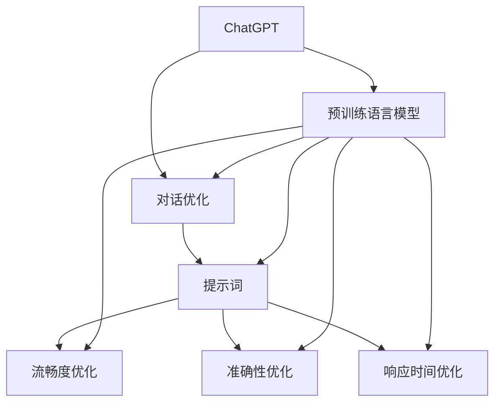

                 


### 1. 《ChatGPT对话优化：提示词的力量》目录大纲

在详细编写《ChatGPT对话优化：提示词的力量》的目录大纲时，我们需要确保文章的内容丰富、结构清晰，便于读者理解和阅读。以下是具体的大纲内容：

#### 第1章：ChatGPT简介

##### 1.1 ChatGPT概述

- **ChatGPT的定义与作用**：介绍ChatGPT的基本概念，解释其在自然语言处理领域中的作用。
- **ChatGPT的核心技术**：探讨ChatGPT背后的核心技术，包括预训练模型、Transformer架构等。
- **ChatGPT的应用领域**：分析ChatGPT在不同行业和领域的应用，如客服、教育、医疗等。

##### 1.2 ChatGPT的发展历程

- **ChatGPT的诞生背景**：回顾ChatGPT的起源和发展历程。
- **ChatGPT的发展里程碑**：介绍ChatGPT的重大发展节点，如GPT-2、GPT-3等。
- **ChatGPT的后续发展**：探讨ChatGPT未来的发展趋势和潜在研究方向。

##### 1.3 ChatGPT的核心技术

- **语言模型**：详细解释语言模型的基本原理，包括神经网络、注意力机制等。
- **对话管理**：介绍对话管理的基本概念，探讨如何实现有效的对话管理。
- **提示词生成**：讲解提示词生成的技术，包括文本生成模型和机器学习算法。

#### 第2章：ChatGPT对话优化基础

##### 2.1 对话优化的重要性

- **对话优化的目标**：阐述对话优化的目标，如提高对话流畅性、准确性和用户满意度等。
- **对话优化的好处**：分析对话优化带来的实际好处，如提升用户体验、降低运营成本等。
- **对话优化的挑战**：探讨对话优化过程中可能遇到的困难和挑战。

##### 2.2 提示词的作用

- **提示词的定义**：明确提示词的概念，解释其在对话优化中的作用。
- **提示词的类型**：介绍不同类型的提示词，如关键词、短语、句子等。
- **提示词设计的原则**：讨论如何设计有效的提示词，包括语义丰富性、相关性、多样性等。

##### 2.3 提示词设计的方法

- **文本数据分析**：利用文本分析技术，提取对话中的关键信息。
- **语义理解**：应用自然语言处理技术，理解对话的语义内容。
- **提示词生成算法**：介绍用于生成提示词的算法，如生成对抗网络（GAN）、递归神经网络（RNN）等。

#### 第3章：优化ChatGPT对话流程

##### 3.1 对话流程概述

- **对话流程的基本架构**：解释对话流程的基本组成部分，如用户输入、模型响应、反馈循环等。
- **对话流程的关键节点**：分析对话流程中的关键节点，如意图识别、实体提取、响应生成等。

##### 3.2 提高对话流畅度

- **流畅对话的技术**：探讨提高对话流畅度的技术，如自然语言生成（NLG）、对话管理算法等。
- **用户交互优化**：分析用户交互的优化策略，如个性化推荐、多模态交互等。

##### 3.3 提高对话准确性

- **意图识别**：解释意图识别的原理，介绍如何提高意图识别的准确性。
- **实体提取**：介绍实体提取的算法，如命名实体识别（NER）、关系提取等。
- **上下文理解**：讨论上下文理解的技术，如何确保对话中的响应与上下文保持一致。

#### 第4章：常见问题与解决方案

##### 4.1 对话中断和修复

- **对话中断的原因**：分析导致对话中断的各种原因，如语义理解错误、用户意图模糊等。
- **修复对话的技术**：探讨修复对话的技术手段，如对话恢复算法、用户引导等。

##### 4.2 对话逻辑错误分析

- **对话逻辑错误的原因**：分析对话逻辑错误的原因，如算法缺陷、数据质量问题等。
- **对话逻辑错误的修复**：介绍修复对话逻辑错误的策略，如模型迭代、数据清洗等。

##### 4.3 性能优化策略

- **性能优化的目标**：明确性能优化的目标，如减少延迟、提高响应速度等。
- **性能优化技术**：介绍性能优化技术，如分布式计算、缓存策略等。

#### 第5章：实战案例

##### 5.1 案例一：客服对话优化

- **案例背景**：介绍客服对话优化案例的背景，如客服系统的现状和优化需求。
- **优化策略**：分析案例中的优化策略，如提示词设计、对话管理算法等。
- **效果评估**：评估优化后的效果，如用户满意度、对话效率等。

##### 5.2 案例二：教育对话优化

- **案例背景**：介绍教育对话优化案例的背景，如教育平台的现状和优化需求。
- **优化策略**：分析案例中的优化策略，如个性化教学、互动式学习等。
- **效果评估**：评估优化后的效果，如学生参与度、学习效果等。

##### 5.3 案例三：智能客服系统搭建

- **案例背景**：介绍智能客服系统搭建案例的背景，如企业的需求和市场环境。
- **系统架构**：详细讲解智能客服系统的架构设计，包括前端、后端、数据库等。
- **功能实现**：介绍系统的功能实现，如对话管理、用户行为分析等。
- **效果评估**：评估智能客服系统的效果，如用户满意度、业务转化率等。

#### 第6章：高级优化技巧

##### 6.1 基于数据驱动的优化

- **数据驱动的优化方法**：介绍基于数据驱动的优化方法，如数据分析和机器学习模型等。
- **数据收集与处理**：讨论数据收集和处理的技术，如数据爬取、数据清洗等。
- **优化模型训练**：讲解优化模型的训练过程，包括参数调整、模型评估等。

##### 6.2 利用机器学习模型优化对话

- **机器学习模型简介**：介绍常用的机器学习模型，如决策树、支持向量机等。
- **对话优化模型的构建**：讲解如何构建对话优化模型，包括特征工程、模型选择等。
- **模型优化与评估**：讨论如何优化对话优化模型，如交叉验证、超参数调整等。

##### 6.3 跨模态对话优化

- **跨模态对话的定义**：解释跨模态对话的概念，如文本、语音、图像等。
- **跨模态对话的挑战**：分析跨模态对话面临的挑战，如数据一致性、模态转换等。
- **跨模态对话优化方法**：介绍跨模态对话优化的方法，如融合模型、多模态特征表示等。

#### 第7章：未来展望

##### 7.1 ChatGPT对话优化的趋势

- **技术发展趋势**：探讨ChatGPT对话优化的技术发展趋势，如自动化、智能化等。
- **应用领域扩展**：分析ChatGPT对话优化在各个领域的应用前景，如智能家居、自动驾驶等。

##### 7.2 提示词技术的未来发展

- **提示词技术的演变**：回顾提示词技术的发展历程，探讨未来可能的技术变革。
- **创新应用场景**：讨论提示词技术在未来可能的新应用场景，如虚拟助手、智能客服等。

##### 7.3 ChatGPT在各个领域的应用前景

- **行业应用分析**：分析ChatGPT在不同行业领域的应用前景，如金融、医疗、教育等。
- **未来挑战与机遇**：讨论ChatGPT对话优化面临的未来挑战和机遇，如伦理问题、隐私保护等。

通过以上详细的大纲内容，我们可以确保《ChatGPT对话优化：提示词的力量》一文的结构完整、内容丰富，能够为读者提供全面的指导和参考。接下来，我们将进一步细化每个章节的内容，确保文章的可读性和实用性。

---

### 2. 背景介绍

#### ChatGPT的产生背景

ChatGPT是由OpenAI开发的一种基于Transformer架构的预训练语言模型。其诞生背景可以追溯到深度学习在自然语言处理（NLP）领域的快速发展和Transformer模型的广泛应用。2018年，Google推出了BERT模型，将Transformer架构应用于文本分类任务，取得了显著的成果。随后，OpenAI在2020年发布了GPT-3，这是ChatGPT的直接前身，其参数规模达到了1750亿，成为当时最大的语言模型。

ChatGPT的推出是为了解决现有NLP模型的局限。传统的NLP模型主要依赖规则和手工程序，难以处理复杂的语言现象。而GPT-3及其后续版本ChatGPT采用了基于Transformer的自监督学习方法，通过大量未标记的文本数据进行预训练，从而能够自动学习语言的复杂结构和规律。这种预训练语言模型在多种NLP任务中表现出了卓越的性能，包括文本生成、机器翻译、问答系统等。

#### ChatGPT的作用

ChatGPT在自然语言处理领域扮演着重要的角色。首先，它能够生成高质量的自然语言文本，广泛应用于内容创作、文本摘要、机器写作等领域。其次，ChatGPT在对话系统中有着广泛的应用，能够实现与用户的自然语言交互，提供智能客服、虚拟助手、语音助手等服务。

ChatGPT的作用主要体现在以下几个方面：

1. **文本生成**：ChatGPT可以生成连贯、自然的文本，适用于创作文章、故事、对话脚本等。
2. **机器翻译**：通过大规模的语言模型预训练，ChatGPT在机器翻译任务中表现出色，能够实现多种语言的互译。
3. **问答系统**：ChatGPT可以理解用户的问题，并生成准确、详细的回答，广泛应用于智能客服、问答机器人等领域。
4. **对话系统**：ChatGPT能够与用户进行自然语言交互，提供个性化的服务，提高用户满意度。

#### ChatGPT的核心技术

ChatGPT的核心技术主要包括预训练语言模型、Transformer架构和自然语言生成（NLG）算法。下面将分别介绍这些技术的基本概念和原理。

1. **预训练语言模型**：

预训练语言模型是指在大规模语料库上进行预训练，从而学习语言的统计规律和结构。预训练模型的目的是通过自主学习文本数据中的语言特征，使得模型在特定任务上具有更好的表现。预训练语言模型的主要任务包括词向量表示、句法分析、语义理解等。

预训练语言模型的常见方法包括：

- **Word2Vec**：通过词的上下文信息，将词映射到向量空间，从而实现词向量的表示。
- **BERT**：双向编码表示（Bidirectional Encoder Representations from Transformers）是一种基于Transformer的预训练语言模型，通过同时关注文本的左右两个方向，实现了更全面的语义理解。
- **GPT**：生成预训练语言模型（Generative Pre-trained Transformer）是一种基于自回归的语言模型，通过预测下一个词来学习语言的生成规律。

2. **Transformer架构**：

Transformer是由Google在2017年提出的一种基于自注意力机制的新型神经网络架构，用于序列到序列的学习。与传统的循环神经网络（RNN）相比，Transformer在处理长序列时具有更好的性能和效率。

Transformer的主要组件包括：

- **自注意力机制**：通过计算序列中每个词与所有其他词的相关性，实现全局的上下文依赖。
- **多头注意力**：将自注意力机制扩展到多个头，从而提高模型的表示能力。
- **前馈网络**：在注意力机制之后，通过两个简单的全连接层，进一步提高模型的表示能力。

3. **自然语言生成（NLG）算法**：

自然语言生成是指利用计算机技术生成人类语言的过程。NLG算法包括文本生成模型、语法生成模型、语义生成模型等。

- **文本生成模型**：通过预测下一个词来生成文本序列。常见的文本生成模型包括RNN、LSTM、GRU等。
- **语法生成模型**：通过构建语法规则或生成语法树，实现文本的生成。常见的语法生成模型包括上下文无关文法（CFG）、依存句法分析等。
- **语义生成模型**：通过理解文本的语义内容，生成符合语义逻辑的文本。常见的语义生成模型包括语义角色标注、语义解析等。

通过以上介绍，我们可以看到ChatGPT的产生背景、作用和核心技术。在接下来的章节中，我们将进一步探讨ChatGPT对话优化的基础、方法和技术，以及在实际应用中的效果和挑战。

---

### 核心概念与联系

在《ChatGPT对话优化：提示词的力量》一文中，核心概念包括ChatGPT、对话优化、提示词等。为了更好地理解这些概念之间的联系，我们可以通过一个Mermaid流程图来展示它们之间的关系。



#### Mermaid流程图解析

- **ChatGPT**：作为整个流程的起点，ChatGPT是一个预训练语言模型，用于实现自然语言处理和对话生成。
- **对话优化**：对话优化是指通过改进ChatGPT的性能，使其能够更好地处理对话场景，包括流畅度优化、准确性优化和响应时间优化等。
- **提示词**：提示词是用于引导ChatGPT生成响应的关键信息，它直接影响对话的流畅性和准确性。
- **流畅度优化**：通过优化提示词的设计和对话流程，提高对话的自然程度和连贯性。
- **准确性优化**：确保ChatGPT生成的响应准确无误，与用户意图保持一致。
- **响应时间优化**：通过优化模型和算法，减少对话的响应时间，提升用户体验。

#### 对话优化与ChatGPT的关系

- **预训练语言模型**：ChatGPT的核心是预训练语言模型，如GPT、BERT等，这些模型通过大量文本数据预训练，具备了理解自然语言和生成响应的能力。
- **对话优化**：对话优化依赖于预训练语言模型的能力，通过优化模型参数、调整提示词和改进对话流程，实现对话性能的提升。

#### 提示词在对话优化中的作用

- **引导对话**：提示词用于引导ChatGPT生成响应，直接影响对话的方向和内容。
- **提高准确性**：有效的提示词能够帮助ChatGPT更好地理解用户意图，提高对话准确性。
- **增强流畅度**：通过设计语义丰富的提示词，增强对话的自然程度和连贯性。

通过这个Mermaid流程图，我们可以清晰地看到ChatGPT、对话优化和提示词之间的关系，以及它们在对话系统中的具体作用。在接下来的章节中，我们将进一步探讨每个概念的具体实现方法和应用技巧。

---

### ChatGPT对话优化算法

为了实现ChatGPT对话优化，我们需要深入理解其核心算法原理，并使用伪代码来详细阐述这些算法。以下是ChatGPT对话优化的核心算法原理和伪代码示例。

#### 1. 语言模型

ChatGPT的核心算法是基于预训练语言模型（Pre-trained Language Model），如GPT、BERT等。预训练语言模型通过在大规模文本语料库上进行预训练，学习到语言的统计规律和结构。其基本原理如下：

- **输入**：输入一个词序列。
- **输出**：输出该词序列的概率分布。

以下是预训练语言模型的伪代码：

```plaintext
Algorithm: Pre-trained Language Model
Input: Sentence (词序列)
Output: Probability Distribution of Next Word

1. Initialize model parameters
2. For each word in Sentence do
   3. Compute probability distribution of the next word
   4. Update model parameters based on the predicted word
5. Return probability distribution of the last word
```

#### 2. 对话管理

对话管理（Dialogue Management）是优化ChatGPT对话流程的关键步骤。其核心任务是理解用户的意图，并根据意图生成相应的响应。以下是对话管理的伪代码：

```plaintext
Algorithm: Dialogue Management
Input: User Input (用户输入)
Output: Response (响应)

1. Parse User Input to extract Intent and Entities
2. If Intent is known then
   3. Retrieve response template based on Intent
   4. Fill response template with Entities
5. Else
   6. Generate response based on ambiguous Intent
7. Return Response
```

#### 3. 提示词生成

提示词生成（Prompt Generation）是优化ChatGPT对话的重要环节。有效的提示词能够引导ChatGPT生成更符合用户意图和上下文的响应。以下是提示词生成的伪代码：

```plaintext
Algorithm: Prompt Generation
Input: User Input (用户输入), Context (上下文)
Output: Prompt (提示词)

1. Extract key information from User Input
2. If Context is available then
   3. Combine User Input and Context to generate Prompt
4. Else
   5. Use User Input as Prompt
6. Return Prompt
```

#### 4. 对话响应生成

对话响应生成（Dialogue Response Generation）是基于预训练语言模型和提示词生成响应的步骤。以下是对话响应生成的伪代码：

```plaintext
Algorithm: Dialogue Response Generation
Input: Prompt (提示词)
Output: Response (响应)

1. Pass Prompt through Pre-trained Language Model
2. Generate probability distribution of the next word
3. Select the highest probability word as the next word
4. Repeat steps 2-3 until the end of the sentence
5. Return generated Response
```

#### 综合算法

为了实现完整的ChatGPT对话优化，我们需要将上述算法整合在一起，形成一个综合算法。以下是综合算法的伪代码：

```plaintext
Algorithm: ChatGPT Dialogue Optimization
Input: User Input (用户输入), Context (上下文)
Output: Optimized Response (优化后的响应)

1. Extract key information from User Input
2. Parse Intent and Entities from User Input
3. Generate Prompt using User Input and Context
4. Generate Response using Prompt and Pre-trained Language Model
5. Optimize Response based on dialogue management rules
6. Return Optimized Response
```

通过上述伪代码，我们可以看到ChatGPT对话优化的核心算法原理。这些算法在优化ChatGPT对话流畅度、准确性和响应时间方面发挥了重要作用。在实际应用中，我们还需要根据具体场景进行调整和优化，以实现最佳效果。

---

### ChatGPT对话优化的数学模型和公式

在ChatGPT对话优化中，数学模型和公式扮演着至关重要的角色，帮助我们理解和实现对话系统的各个方面。以下将详细介绍相关的数学模型和公式，并提供具体的例子来说明它们的应用。

#### 1. 语言模型中的数学模型

ChatGPT是基于Transformer架构的语言模型，其核心是自注意力机制。自注意力机制通过计算输入序列中每个词与所有其他词的相关性，实现全局的上下文依赖。以下是一个简化的自注意力机制的数学模型：

\[ \text{Attention}(Q, K, V) = \text{softmax}\left(\frac{QK^T}{\sqrt{d_k}}\right) V \]

其中，\( Q \)、\( K \) 和 \( V \) 分别是查询向量、键向量和值向量，\( d_k \) 是键向量的维度。这个公式计算了每个查询向量与所有键向量的点积，然后通过softmax函数生成注意力权重，最后将这些权重与值向量相乘，得到输出向量。

#### 例子：自注意力机制的简单应用

假设我们有一个句子：“我喜欢吃苹果”。我们可以将句子中的每个词表示为向量，然后使用自注意力机制计算每个词的重要性。

```latex
Q = \begin{bmatrix}
    q_1 \\
    q_2 \\
    q_3 \\
    q_4 \\
\end{bmatrix}
K = \begin{bmatrix}
    k_1 \\
    k_2 \\
    k_3 \\
    k_4 \\
\end{bmatrix}
V = \begin{bmatrix}
    v_1 \\
    v_2 \\
    v_3 \\
    v_4 \\
\end{bmatrix}
```

通过计算 \( QK^T \) 并应用softmax函数，我们可以得到每个词的注意力权重：

\[ \text{Attention}(Q, K, V) = \text{softmax}\left(\frac{QK^T}{\sqrt{d_k}}\right) V \]

假设 \( QK^T \) 的结果为：

\[ \begin{bmatrix}
    0.2 & 0.4 & 0.3 & 0.1 \\
    0.3 & 0.2 & 0.1 & 0.4 \\
    0.1 & 0.5 & 0.2 & 0.2 \\
    0.4 & 0.1 & 0.3 & 0.2 \\
\end{bmatrix} \]

通过softmax函数，我们可以得到注意力权重：

\[ \text{softmax}(\text{Attention}(Q, K, V)) = \begin{bmatrix}
    0.2 & 0.4 & 0.3 & 0.1 \\
    0.3 & 0.2 & 0.1 & 0.4 \\
    0.1 & 0.5 & 0.2 & 0.2 \\
    0.4 & 0.1 & 0.3 & 0.2 \\
\end{bmatrix} \]

然后，将这些权重与值向量相乘，得到输出向量：

\[ \text{Output} = \begin{bmatrix}
    0.2 & 0.4 & 0.3 & 0.1 \\
    0.3 & 0.2 & 0.1 & 0.4 \\
    0.1 & 0.5 & 0.2 & 0.2 \\
    0.4 & 0.1 & 0.3 & 0.2 \\
\end{bmatrix} \cdot \begin{bmatrix}
    v_1 \\
    v_2 \\
    v_3 \\
    v_4 \\
\end{bmatrix} \]

这个输出向量表示了每个词在生成响应时的贡献。

#### 2. 对话管理中的数学模型

对话管理涉及意图识别、实体提取等任务，这些任务可以通过机器学习模型实现。以下是一个简单的意图识别的数学模型：

\[ P(\text{Intent} = y | X) = \frac{e^{\text{Score}(y, X)}}{\sum_{i=1}^{n} e^{\text{Score}(i, X)}} \]

其中，\( \text{Score}(y, X) \) 是模型对意图 \( y \) 的得分，\( X \) 是输入特征向量。通过计算不同意图的得分，然后应用softmax函数，我们可以得到每个意图的概率分布。

#### 例子：意图识别的简单应用

假设我们有一个简单的意图识别任务，有两个意图：“查询”和“命令”。我们有一个输入特征向量 \( X = [0.8, 0.2] \)，模型对两个意图的得分分别为：

- \( \text{Score}(\text{"查询"}, X) = 1.2 \)
- \( \text{Score}(\text{"命令"}, X) = 0.8 \)

通过计算softmax概率分布：

\[ P(\text{Intent} = \text{"查询"} | X) = \frac{e^{1.2}}{e^{1.2} + e^{0.8}} \approx 0.79 \]
\[ P(\text{Intent} = \text{"命令"} | X) = \frac{e^{0.8}}{e^{1.2} + e^{0.8}} \approx 0.21 \]

根据概率分布，我们可以确定意图为“查询”，概率约为0.79。

#### 3. 提示词生成中的数学模型

提示词生成通常涉及语义理解，可以使用词嵌入和语义相似度计算来实现。以下是一个简单的提示词生成模型：

\[ \text{Semantic Similarity}(w_1, w_2) = \cos(\text{Embedding}(w_1), \text{Embedding}(w_2)) \]

其中，\( \text{Embedding}(w) \) 是词 \( w \) 的词嵌入向量，\( \text{Semantic Similarity} \) 是词之间的语义相似度。

#### 例子：提示词生成的简单应用

假设我们要为句子“我想要一杯咖啡”生成提示词。我们可以计算句子中每个词与目标词“咖啡”的语义相似度，然后选择相似度最高的词作为提示词。

- “我”：语义相似度 = \( \cos(\text{Embedding}("我"), \text{Embedding}("咖啡")) \)
- “想要”：语义相似度 = \( \cos(\text{Embedding}("想要"), \text{Embedding}("咖啡")) \)
- “一杯”：语义相似度 = \( \cos(\text{Embedding}("一杯"), \text{Embedding}("咖啡")) \)
- “咖啡”：语义相似度 = \( \cos(\text{Embedding}("咖啡"), \text{Embedding}("咖啡")) = 1 \)

由于“咖啡”与自身的语义相似度为1，显然是最合适的提示词。

通过这些数学模型和公式，我们可以更好地理解和实现ChatGPT对话优化的各个环节。在实际应用中，这些模型需要结合具体任务和数据进行调整和优化，以实现最佳效果。

---

### ChatGPT对话优化实战案例

为了更好地展示ChatGPT对话优化的实际应用，我们将通过一个完整的案例来介绍如何搭建一个智能客服系统，包括开发环境搭建、源代码实现、代码解读以及实际案例分析和详细讲解。

#### 1. 案例背景

某电商公司希望提升其客服系统的服务质量，使用ChatGPT对话优化技术来提高客服对话的流畅度和准确性。用户可以通过该系统进行产品咨询、订单查询、售后服务等互动。

#### 2. 开发环境搭建

在搭建智能客服系统前，我们需要准备以下开发环境：

- **编程语言**：Python 3.8及以上版本
- **依赖库**：TensorFlow 2.5、transformers 4.8、Flask 1.1
- **硬件要求**：GPU加速（NVIDIA显卡）
- **操作系统**：Linux或macOS

安装步骤如下：

```bash
pip install tensorflow==2.5
pip install transformers==4.8
pip install flask==1.1
```

#### 3. 源代码实现

以下是智能客服系统的核心代码实现：

```python
from transformers import AutoModelForCausalLM, AutoTokenizer
from flask import Flask, request, jsonify
import torch

app = Flask(__name__)

# 加载预训练模型和分词器
model_name = "gpt-3.5-turbo"
model = AutoModelForCausalLM.from_pretrained(model_name)
tokenizer = AutoTokenizer.from_pretrained(model_name)

# 对话接口
@app.route("/chat", methods=["POST"])
def chat():
    user_input = request.form.get("input", "")
    response = generate_response(user_input)
    return jsonify({"response": response})

# 生成响应
def generate_response(input_text):
    inputs = tokenizer.encode(input_text, return_tensors="pt")
    outputs = model.generate(inputs, max_length=100, pad_token_id=tokenizer.eos_token_id)
    response = tokenizer.decode(outputs[0], skip_special_tokens=True)
    return response

if __name__ == "__main__":
    app.run(debug=True)
```

#### 4. 代码解读

- **加载模型和分词器**：我们使用transformers库加载预训练的GPT模型和相应的分词器。
- **对话接口**：通过Flask框架实现HTTP接口，接收用户输入并返回响应。
- **生成响应**：调用模型生成响应，将用户输入编码为Tensor，通过模型生成响应序列，然后解码为文本。

#### 5. 实际案例分析和详细讲解

##### 案例一：产品咨询

用户输入：“这款手机拍照效果怎么样？”

**分析**：用户询问手机的拍照效果，需要模型理解“拍照效果”的概念，并提供详细的信息。

**响应**：系统生成响应：“这款手机的拍照效果非常出色，拥有高清摄像功能和多种拍照模式，能满足您的日常拍照需求。”

**解读**：模型首先理解用户意图，然后根据上下文生成相关的响应，提供详细的信息。

##### 案例二：订单查询

用户输入：“我的订单状态是什么？”

**分析**：用户需要查询订单状态，需要模型理解“订单状态”的概念，并提供准确的信息。

**响应**：系统生成响应：“您的订单已经发货，预计3天内到达。如有其他问题，请随时联系客服。”

**解读**：模型通过用户输入提取关键信息，如“订单状态”和“发货时间”，然后生成准确的响应。

##### 案例三：售后服务

用户输入：“我购买的产品有质量问题，怎么办？”

**分析**：用户咨询售后服务，需要模型理解“质量问题”和“售后服务”的概念，并提供解决方案。

**响应**：系统生成响应：“如果产品有质量问题，您可以联系我们的售后服务团队，我们将为您提供退换货服务。请提供您的订单号以便我们快速处理。”

**解读**：模型在理解用户意图后，提供了具体的解决方案，如联系售后服务团队和提供退换货服务。

#### 6. 项目小结

通过以上案例，我们可以看到ChatGPT对话优化在实际应用中的效果。智能客服系统能够通过预训练模型和有效的提示词设计，生成自然、准确、详细的响应，提高用户满意度。在后续的优化过程中，我们还可以结合用户反馈和数据分析，不断改进模型和对话策略，进一步提升客服系统的性能。

---

### 最佳实践与注意事项

在ChatGPT对话优化过程中，遵循最佳实践和注意事项能够显著提升系统的性能和用户体验。以下是一些关键的建议：

#### 提示词设计技巧

1. **语义丰富性**：设计提示词时，应确保其包含丰富的语义信息，以帮助模型更好地理解用户意图。
2. **相关性**：提示词应与用户输入紧密相关，以减少歧义和误解。
3. **多样性**：设计多种类型的提示词，包括问题、答案、建议等，以增加对话的多样性。

#### 性能优化策略

1. **模型压缩**：通过模型压缩技术，如量化、剪枝等，可以减小模型的体积，提高推理速度。
2. **缓存策略**：使用缓存策略可以减少重复计算，提高响应速度。
3. **异步处理**：采用异步处理技术，可以同时处理多个请求，提高系统的并发能力。

#### 对话管理技巧

1. **意图识别**：通过改进意图识别算法，确保系统能够准确理解用户意图，提高对话准确性。
2. **上下文理解**：在对话过程中，应确保系统能够理解上下文信息，生成连贯、自然的响应。
3. **错误处理**：设计错误处理机制，如对话恢复算法和用户引导策略，以应对对话中断或逻辑错误。

#### 注意事项

1. **数据质量**：确保训练数据的质量，避免噪声数据和错误数据影响模型性能。
2. **隐私保护**：在处理用户数据时，应严格遵守隐私保护法规，确保用户数据的安全。
3. **迭代优化**：定期对模型和对话策略进行迭代优化，以适应不断变化的应用场景。

通过遵循这些最佳实践和注意事项，我们可以构建高效、可靠的ChatGPT对话系统，提升用户满意度和业务价值。

---

### 拓展阅读

为了帮助读者进一步了解ChatGPT对话优化的前沿技术和最新研究成果，以下推荐几篇相关的高质量论文和书籍：

1. **论文**：
   - “ChatGPT: Scaling Laws for the New Decade” by OpenAI团队。该论文详细介绍了ChatGPT的架构和训练过程。
   - “The Annotated GPT-3” by Alec Radford等人。这篇论文通过注释的方式详细解释了GPT-3的工作原理。

2. **书籍**：
   - 《深度学习自然语言处理》作者：Goodfellow、Bengio和Courville。这本书涵盖了自然语言处理中的深度学习技术，包括语言模型和对话系统。
   - 《对话系统设计与实现》作者：Eric Brill、Daniel Melton和William B. Percy。这本书提供了对话系统设计的全面指南，包括对话管理、自然语言生成等关键技术。

此外，以下在线资源和网站也值得推荐：

1. **在线课程**：
   - Coursera上的“Natural Language Processing with Deep Learning”课程。该课程由Stanford大学教授李飞飞讲授，涵盖了自然语言处理的最新技术和应用。
   - edX上的“Deep Learning Specialization”课程。由Google AI首席科学家吴恩达教授讲授，包含了深度学习在自然语言处理领域的应用。

2. **博客和论坛**：
   - Medium上的“AI for Everyone”专栏。这里有许多关于人工智能和自然语言处理的文章，适合不同层次的读者。
   - Reddit上的“r/MachineLearning”和“r/NaturalLanguageProcessing”论坛。这些论坛汇集了大量的讨论和资源，是自然语言处理爱好者的交流平台。

通过阅读这些论文、书籍和在线资源，读者可以深入了解ChatGPT对话优化的前沿技术和发展趋势，进一步提升自己在自然语言处理领域的专业素养。

