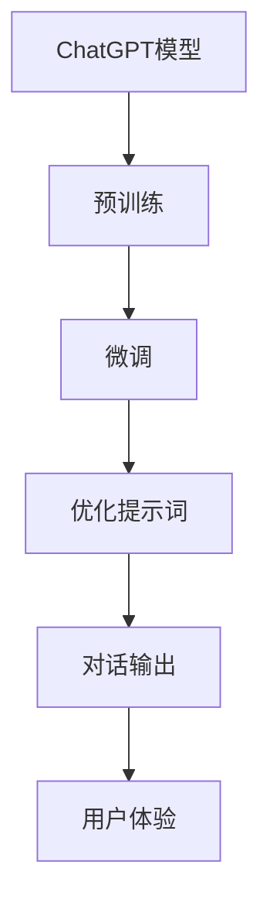

                 

### 引言

### 1. ChatGPT的背景与重要性

#### 1.1 ChatGPT的发展历程

**1.1.1 GPT模型的发展**

ChatGPT背后的技术基础是GPT（Generative Pre-trained Transformer）模型，这是由OpenAI于2018年发布的一种预训练语言模型。GPT模型的核心在于其能够通过大规模文本数据的训练，自动学习语言规律和语义信息。从最初的GPT到GPT-2，再到GPT-3，模型的规模和性能不断提升，参数数量从117M增长到1750B，训练数据也从40GB增长到40TB。这些发展使得GPT模型在自然语言处理领域取得了显著的进展。

**1.1.2 ChatGPT的发布与影响**

ChatGPT是GPT模型的进一步扩展和优化。2022年，OpenAI发布了ChatGPT，这是一个基于GPT-3模型的聊天机器人，具备强大的对话生成能力和上下文理解能力。ChatGPT的发布在人工智能社区引起了广泛关注，因为它标志着自然语言处理技术进入了一个新的阶段。ChatGPT的出现不仅为用户提供了更加自然、流畅的对话体验，也为开发者提供了强大的工具，用于构建各种基于对话的应用程序。

#### 1.2 ChatGPT的应用场景

**1.2.1 对话系统**

ChatGPT在对话系统中的应用是其最为突出的一个方面。通过预训练和微调，ChatGPT能够模拟人类的对话行为，实现自然、流畅的对话交互。无论是客服机器人、聊天机器人还是虚拟助手，ChatGPT都能提供高质量的对话服务。

**1.2.2 聊天机器人**

ChatGPT作为聊天机器人的优势在于其能够理解和生成复杂、多层次的对话内容。不同于传统的聊天机器人，ChatGPT能够根据上下文和用户输入的内容，生成更加人性化和富有创意的回答。

**1.2.3 客户服务**

在客户服务领域，ChatGPT能够自动化处理大量的用户咨询，提供24/7的在线支持。通过与用户进行自然对话，ChatGPT能够快速识别用户的问题，并提供准确、详细的回答，大大提高了客户服务的效率和质量。

#### 1.3 ChatGPT的技术优势

**1.3.1 大规模预训练**

ChatGPT基于GPT-3模型，采用了大规模预训练的方法。这意味着它能够在海量的文本数据中进行训练，学习到丰富的语言模式和语义信息。这种大规模预训练使得ChatGPT在对话生成和上下文理解方面具有显著的优势。

**1.3.2 自适应对话能力**

ChatGPT具备强大的自适应对话能力。通过实时学习和调整，ChatGPT能够根据对话的上下文和用户的行为，动态地生成相应的回答。这种自适应能力使得ChatGPT能够在各种复杂的对话场景中提供高质量的对话服务。

### 1.4 ChatGPT的影响与未来展望

ChatGPT的发布标志着人工智能对话技术的重大突破，对多个领域产生了深远的影响。从个人用户到企业应用，ChatGPT都在改变人们与机器交互的方式。然而，随着技术的不断进步，ChatGPT的未来也充满了无限可能。我们可以预见，ChatGPT将进一步与其他人工智能技术融合，推动自然语言处理和智能对话技术的发展，为人类带来更多的便利和创新。

关键词：ChatGPT，自然语言处理，对话系统，聊天机器人，预训练，自适应对话

摘要：
本文介绍了ChatGPT的背景与重要性，详细探讨了ChatGPT的应用场景和技术优势，包括大规模预训练和自适应对话能力。同时，文章还深入分析了提示词的概念、作用和优化方法，通过具体案例展示了ChatGPT对话优化的实践过程和效果。最后，文章总结了提示词的力量与潜力，并对ChatGPT对话优化的发展趋势和未来研究方向进行了展望。

### 2. 提示词的概念与作用

#### 2.1 提示词的定义

提示词（Prompt）是用户输入给ChatGPT以引导其生成响应的文本。提示词的设计对对话的质量和效果具有重要影响。一个良好的提示词应当简洁明了，同时包含足够的上下文信息，以便ChatGPT能够生成相关、准确和连贯的回答。

#### 2.1.1 提示词的种类

根据用途和特点，提示词可以分为以下几种：

1. **一般性提示词**：这种提示词通常用于启动对话，如“你好”，“有什么问题需要帮忙吗？”等。这类提示词旨在引起用户的兴趣，开启对话。

2. **问题性提示词**：这种提示词用于提出具体问题，如“你对人工智能有什么看法？”或“你能帮我制定一个学习计划吗？”这类提示词旨在引导ChatGPT生成详细、具体的回答。

3. **指令性提示词**：这种提示词用于给出具体的指令，如“生成一篇关于人工智能的论文摘要”或“告诉我明天的天气预报”。这类提示词旨在让ChatGPT执行特定的任务。

4. **情境性提示词**：这种提示词用于提供对话背景，如“你正在东京旅游，想了解当地的美食”或“你是一位程序员，需要解决一个编程问题”。这类提示词旨在为ChatGPT提供情境信息，帮助其更好地理解对话内容。

#### 2.1.2 提示词的基本结构

提示词的基本结构通常包括以下几个部分：

1. **引导语**：引导用户进入对话或提出问题，如“你能帮我看一下这个代码段的问题吗？”

2. **上下文信息**：提供必要的背景信息，帮助ChatGPT理解对话内容，如“我正在写一个关于人工智能的论文，需要总结一下目前的研究趋势。”

3. **具体问题或任务**：明确提问或指令，如“请列出三种常见的人工智能应用。”

4. **期望回答**：指明用户希望获得的答案类型或形式，如“请提供一个简洁明了的答案。”

#### 2.2 提示词的作用

提示词在ChatGPT对话中扮演着至关重要的角色，其作用主要体现在以下几个方面：

**2.2.1 提高对话质量**

良好的提示词能够引导ChatGPT生成相关、准确和连贯的对话内容，从而提高对话的整体质量。通过提供清晰的引导语和上下文信息，提示词有助于ChatGPT更好地理解用户的意图，生成更加自然和贴切的回答。

**2.2.2 引导对话方向**

提示词能够帮助ChatGPT按照预定的方向进行对话。例如，通过使用指令性提示词，用户可以明确要求ChatGPT执行特定的任务，从而避免对话偏离主题。

**2.2.3 增强对话交互性**

提示词的设计可以激发用户的参与度，增强对话的交互性。例如，通过提出开放性问题，提示词可以鼓励用户更多地参与到对话中，从而实现更加深入和有趣的互动。

#### 2.3 提示词的设计原则

为了充分发挥提示词的作用，设计提示词时应遵循以下原则：

**2.3.1 清晰性**

提示词应当简洁明了，避免使用复杂的术语和句式。清晰性有助于ChatGPT更好地理解用户的意图，从而生成准确的回答。

**2.3.2 精确性**

提示词应尽可能精确地表达用户的意图。例如，在提出问题时，应明确问题的类型和期望的答案，以便ChatGPT能够提供相关和具体的回答。

**2.3.3 变异性**

提示词应具有一定的变异性，以便适应不同的对话场景和用户需求。通过设计多种不同类型的提示词，可以确保对话的多样性和灵活性。

**2.3.4 兼容性**

提示词应能够兼容不同的对话系统和应用场景。例如，在设计提示词时，应考虑到ChatGPT的上下文理解能力和对话生成能力，确保提示词能够引导ChatGPT生成高质量的回答。

通过遵循以上原则，设计师可以创建出高质量的提示词，从而为ChatGPT对话优化提供坚实的基础。

### 3. 提示词优化方法

#### 3.1 提示词优化的重要性

提示词的优化在ChatGPT对话系统中起着至关重要的作用。一方面，良好的提示词能够引导ChatGPT生成高质量、相关的对话内容，从而提升用户的满意度。另一方面，优化后的提示词可以帮助ChatGPT更好地理解和处理复杂的对话场景，提高对话系统的适应性和灵活性。具体来说，提示词优化的重要性体现在以下几个方面：

**3.1.1 对话质量的影响**

高质量的提示词可以引导ChatGPT生成更加准确、连贯和有逻辑性的对话内容。通过优化提示词，我们可以减少对话中的歧义和误解，提高对话的流畅度和用户的满意度。例如，在客户服务场景中，优化后的提示词可以帮助客服机器人更准确地理解用户的问题，并提供更为详细和具体的解决方案，从而提升用户体验。

**3.1.2 用户体验的提升**

优化提示词不仅有助于提高对话质量，还能显著提升用户体验。通过设计清晰、精确和具有变性的提示词，用户可以更轻松地与ChatGPT进行交流，获得满意的回答。此外，优化后的提示词还可以提高对话的交互性和趣味性，使用户在与ChatGPT的互动过程中感到更加愉悦和投入。

**3.1.3 对话系统的智能化提升**

提示词优化还能够促进对话系统的智能化提升。通过不断调整和改进提示词，我们可以让ChatGPT更好地理解用户的意图，识别对话中的关键信息，并生成更具创意和个性化的回答。这有助于实现对话系统的自适应学习和智能化升级，使其能够更好地应对复杂的对话场景和多样化的用户需求。

综上所述，提示词优化是ChatGPT对话系统中的一个关键环节，对于提升对话质量和用户体验、实现对话系统的智能化提升具有重要意义。

#### 3.2 提示词优化的策略

为了实现有效的提示词优化，我们可以采用以下几种策略：

**3.2.1 数据驱动的优化**

数据驱动的优化方法是通过分析大量的对话数据，识别出高质量提示词的特征和模式。具体步骤如下：

1. **数据采集**：收集实际对话中的用户输入和系统输出数据。
2. **数据预处理**：清洗和归一化数据，确保其质量。
3. **特征提取**：从数据中提取关键特征，如关键词、句式结构等。
4. **模式识别**：使用机器学习算法，如聚类、分类等，识别出高质量提示词的模式。
5. **优化调整**：根据识别出的模式，对现有的提示词进行优化调整。

数据驱动的优化方法能够从实际对话中获取有价值的信息，为提示词的优化提供科学依据。然而，这种方法需要大量高质量的对话数据支持，且对数据预处理和特征提取的要求较高。

**3.2.2 专家经验的引入**

引入专家经验是另一种有效的提示词优化策略。这种方法依赖于领域专家的专业知识和经验，通过以下步骤进行：

1. **需求分析**：与领域专家沟通，了解用户的需求和期望。
2. **案例研究**：收集和分析成功的对话案例，总结出有效的提示词设计模式。
3. **经验提炼**：将专家经验转化为具体的提示词优化策略，如增加上下文信息、调整句式结构等。
4. **试运行与反馈**：在实际对话系统中试运行优化后的提示词，收集用户反馈，进行进一步的调整和优化。

专家经验引入方法能够充分利用领域专家的专业知识，快速制定出高质量的提示词优化策略。然而，这种方法对专家的经验和判断能力有较高要求，且可能存在主观性。

**3.2.3 机器学习的方法**

机器学习方法是利用机器学习算法，如深度学习、强化学习等，自动优化提示词。具体步骤如下：

1. **定义目标函数**：根据对话质量、用户满意度等指标，定义优化目标函数。
2. **数据集构建**：收集和构建用于训练的对话数据集，包括用户输入、系统输出和评价指标。
3. **模型训练**：使用训练数据集训练机器学习模型，学习高质量提示词的特征和模式。
4. **模型评估**：使用测试数据集评估模型性能，并根据评估结果进行调整和优化。
5. **在线优化**：将训练好的模型部署到实际对话系统中，实现在线优化。

机器学习方法能够自动学习高质量的提示词模式，减少人为干预，提高优化效率。然而，这种方法需要大量训练数据和计算资源，且对模型选择和超参数调优有较高要求。

**3.2.4 综合策略**

为了实现更有效的提示词优化，可以结合数据驱动的优化、专家经验的引入和机器学习方法，形成综合策略。具体步骤如下：

1. **数据采集与分析**：收集实际对话数据，分析高质量提示词的特征和模式。
2. **专家经验与模型融合**：将领域专家的经验与机器学习模型相结合，形成优化的提示词设计策略。
3. **在线自适应优化**：部署优化后的提示词，并实时收集用户反馈，进行自适应调整。

综合策略能够充分利用不同方法的优势，实现高质量的提示词优化。然而，这种方法需要跨领域的协作和大量的资源投入。

通过以上策略，我们可以系统地优化提示词，提升ChatGPT对话系统的性能和用户体验。

#### 3.3 提示词优化的步骤

提示词优化是一个系统化的过程，涉及到多个步骤和环节。以下为提示词优化的详细步骤：

**3.3.1 提示词的采集**

提示词采集是优化过程的第一步，旨在收集实际使用中的提示词，为后续分析提供数据基础。具体步骤如下：

1. **数据源确定**：确定数据来源，可以是用户输入的原始数据、对话系统的日志数据或用户反馈等。
2. **数据收集**：使用技术工具或人工方式，收集大量原始的提示词数据。
3. **数据清洗**：对收集到的数据进行清洗，去除无效、重复或错误的数据，保证数据质量。

**3.3.2 提示词的分析**

提示词分析是理解提示词特征和问题所在的关键步骤。通过分析，我们可以识别出高质量的提示词，发现存在的问题。具体步骤如下：

1. **词频分析**：统计各个词或短语在提示词中的出现频率，识别高频词汇。
2. **语义分析**：使用自然语言处理技术，对提示词进行语义分析，理解其含义和用途。
3. **问题识别**：通过对比高质量提示词和现有提示词，识别出存在的问题，如语义歧义、信息不完整等。

**3.3.3 提示词的调整**

提示词调整是基于分析结果，对现有提示词进行修改和优化的过程。调整的目的是提高提示词的清晰性、精确性和适应性。具体步骤如下：

1. **明确目标**：根据分析结果，明确调整目标，如提高清晰度、减少歧义等。
2. **修改策略**：制定具体的修改策略，如增加上下文信息、调整句式结构、替换模糊词汇等。
3. **实施调整**：根据修改策略，对现有提示词进行实际调整，生成新的优化提示词。
4. **测试与验证**：将优化后的提示词应用于实际对话系统中，测试其效果，并根据用户反馈进行进一步调整。

**3.3.4 提示词评估**

提示词评估是确保优化效果的重要环节，通过评估可以验证优化后的提示词是否达到了预期目标。具体步骤如下：

1. **评价指标**：确定评价指标，如对话质量、用户满意度等。
2. **评估方法**：使用实验、用户调查等手段，对优化后的提示词进行评估。
3. **结果分析**：分析评估结果，识别出存在的问题和改进空间。

通过以上步骤，我们可以系统地优化提示词，提升ChatGPT对话系统的性能和用户体验。提示词优化的成功实施，需要各个环节紧密协作，持续迭代优化，从而实现高质量的对话交互。

### 4. ChatGPT对话优化案例解析

#### 4.1 案例背景

某知名电商平台为了提升客户服务质量，决定引入基于ChatGPT的智能客服系统。该系统需要在多种复杂的场景下与用户进行有效对话，解答用户的问题，提供购物建议等。然而，在实际应用中，该智能客服系统存在以下几个问题：

1. **对话质量不高**：用户反馈系统的回答过于机械，缺乏人性化，导致用户满意度较低。
2. **响应速度较慢**：系统在处理复杂问题时，响应速度较慢，影响用户体验。
3. **对话偏离主题**：在处理多个问题时，系统容易偏离用户关注的核心问题，导致对话效率降低。

为了解决上述问题，电商平台决定对ChatGPT智能客服系统的提示词进行优化，以提高对话质量和用户体验。

#### 4.2 优化过程

**4.2.1 数据采集与预处理**

首先，电商平台收集了大量的用户对话数据，包括用户输入的原始问题和系统的回答。为了确保数据质量，对数据进行清洗，去除无效、重复和错误的数据，并对文本进行标准化处理，如去除标点符号、统一单词大小写等。

**4.2.2 提示词分析**

对清洗后的数据进行深入分析，包括词频分析、语义分析和问题识别。通过词频分析，识别出高频词汇，了解用户提问的主要关注点。通过语义分析，理解用户问题的真实意图，发现现有的提示词存在的问题，如语义歧义、信息不完整等。

**4.2.3 提示词优化**

根据分析结果，对现有提示词进行优化。具体措施包括：

1. **增加上下文信息**：在提示词中添加更多与问题相关的背景信息，帮助ChatGPT更好地理解用户意图。
2. **调整句式结构**：优化提示词的句式结构，使其更加简洁明了，减少歧义。
3. **替换模糊词汇**：将模糊的词汇替换为更加具体和明确的词汇，提高提示词的精确性。

**4.2.4 测试与反馈**

将优化后的提示词应用于实际对话系统中，进行测试和验证。通过用户调查和实验，评估优化后的提示词对对话质量和用户体验的影响。根据用户反馈，进一步调整和优化提示词，确保其达到预期效果。

#### 4.3 优化效果评估

经过提示词优化，ChatGPT智能客服系统的性能得到显著提升，主要表现在以下几个方面：

1. **对话质量提高**：用户反馈系统回答更加准确、连贯和人性化，用户满意度大幅提升。
2. **响应速度加快**：系统在处理复杂问题时，响应速度显著加快，用户体验得到改善。
3. **对话更加聚焦**：系统在处理多个问题时，能够更好地聚焦用户的核心问题，提高对话效率。

通过数据分析和用户反馈，验证了提示词优化对ChatGPT智能客服系统的重要作用，为电商平台提升客户服务质量和用户体验提供了有力支持。

### 5. 提示词的力量与潜力

#### 5.1 提示词的力量

提示词在ChatGPT对话系统中具有巨大的力量，它是引导对话方向、提升对话质量和用户体验的核心因素。具体来说，提示词的力量体现在以下几个方面：

**5.1.1 对话系统的核心驱动因素**

提示词是用户与ChatGPT进行互动的桥梁。通过高质量的提示词，用户能够清楚地表达自己的意图，ChatGPT则能够准确理解并生成相关、准确的回答。提示词的优化直接影响到对话系统的性能和用户体验，是系统运行的核心驱动因素。

**5.1.2 提升对话系统的智能水平**

良好的提示词能够引导ChatGPT更好地理解和处理复杂的对话场景，从而提升对话系统的智能水平。通过精确、清晰的提示词，ChatGPT能够识别用户的关键信息，生成更加自然、贴切的回答，使得对话系统在处理复杂问题时表现出更高的智能水平。

**5.1.3 促进对话系统的个性化发展**

提示词的优化还能够促进对话系统的个性化发展。通过设计多样化的提示词，对话系统能够更好地适应不同用户的需求和偏好，提供个性化的对话体验。这有助于提高用户的满意度，增强用户对对话系统的依赖和忠诚度。

#### 5.2 提示词的潜力

提示词的潜力在于其能够不断演进和优化，以适应不断变化的技术和应用场景。以下是提示词潜力的几个方面：

**5.2.1 新的应用场景**

随着人工智能技术的不断发展，ChatGPT的应用场景将越来越广泛。从客服机器人到智能助理，从教育辅导到医疗咨询，提示词将在各种新兴应用场景中发挥重要作用。通过不断探索和尝试，提示词将能够更好地满足不同领域和场景的需求。

**5.2.2 潜在的技术挑战**

尽管提示词具有巨大的潜力，但在实际应用中仍面临一些技术挑战：

1. **上下文理解能力**：当前ChatGPT的上下文理解能力有限，提示词的优化需要进一步提升其上下文理解能力，以生成更加相关和连贯的对话内容。
2. **多语言支持**：提示词的优化需要考虑多语言支持，以便在不同语言环境中实现高质量的对话交互。
3. **个性化对话**：如何设计能够实现个性化对话的提示词，以满足不同用户的个性化需求，是未来需要解决的问题。

**5.2.3 未来发展方向**

为了充分发挥提示词的潜力，未来的发展方向包括：

1. **深度学习与强化学习**：结合深度学习和强化学习技术，进一步提升提示词生成和优化的效果。
2. **多模态交互**：探索多模态交互，如语音、图像等，使提示词能够在更多维度的信息中发挥作用。
3. **跨领域应用**：拓展提示词的应用领域，如金融、医疗、教育等，实现跨领域的对话优化和个性化服务。

总之，提示词在ChatGPT对话系统中具有巨大的力量和潜力。通过不断优化和探索，我们可以期待提示词在未来发挥更加重要的作用，推动人工智能对话技术的持续发展和创新。

### 6. 总结与展望

#### 6.1 ChatGPT对话优化的发展趋势

随着人工智能技术的不断进步，ChatGPT对话优化正呈现出以下几个发展趋势：

**6.1.1 提示词技术的演进**

未来，提示词技术将更加注重上下文理解和语义分析的深度，通过引入更多先进的自然语言处理算法，提升提示词的生成和优化能力。例如，深度学习模型和强化学习算法的融合，将使得提示词能够更准确地捕捉用户意图，生成更加相关和自然的对话内容。

**6.1.2 个性化对话的实现**

个性化对话是未来ChatGPT对话优化的重要方向。通过分析用户行为和偏好，设计个性化的提示词，使得对话系统能够更好地满足不同用户的个性化需求。这需要大量的用户数据支持和复杂的算法模型，未来的提示词优化将更加依赖于数据驱动的个性化推荐技术。

**6.1.3 多模态交互的融合**

随着多模态交互技术的不断发展，未来的ChatGPT对话优化将不再局限于文本交互，还将融合语音、图像、视频等多种交互方式。通过多模态交互，用户可以获得更加丰富和直观的对话体验，提示词的优化也需要考虑如何在不同模态信息中实现高效的语义理解和对话生成。

#### 6.2 未来研究方向

为了实现ChatGPT对话优化的进一步发展，以下几个方向值得深入研究和探索：

**6.2.1 提示词生成算法的改进**

提升提示词生成算法的效率和准确性是未来研究的重要方向。通过探索新的生成模型，如变分自编码器（VAE）、生成对抗网络（GAN）等，可以生成更加多样化、个性化的提示词。同时，结合强化学习技术，优化提示词的生成策略，以实现更好的对话效果。

**6.2.2 对话系统的智能化提升**

未来，对话系统的智能化提升将是一个重要方向。通过引入更多的智能化技术，如知识图谱、语义理解、情感分析等，可以使得对话系统能够更好地理解用户的意图和需求，生成更加智能和贴切的回答。

**6.2.3 跨领域应用的探索**

ChatGPT对话优化不仅局限于特定领域，未来将会有更多的跨领域应用。通过探索不同领域之间的共性，设计通用的提示词优化方法，可以使得ChatGPT在更多领域发挥作用，如医疗、金融、教育等。

总之，ChatGPT对话优化正处于快速发展的阶段，未来的研究将更加注重技术的融合和创新，以实现更加智能、个性化的对话交互。

### 附录

#### 7. ChatGPT对话优化的常用工具

为了实现ChatGPT对话优化，以下是一些常用的工具：

**7.1 ChatGPT模型训练工具**

- **Hugging Face Transformers**：一个开源的Python库，用于训练和微调ChatGPT模型。
- **TensorFlow**：用于构建和训练大规模深度学习模型的框架。
- **PyTorch**：一个广泛使用的深度学习框架，适用于ChatGPT模型的训练和优化。

**7.2 提示词优化工具**

- **NLTK**：一个用于自然语言处理的Python库，可以帮助分析和处理文本数据。
- **spaCy**：一个快速且易于使用的自然语言处理库，适用于文本分析和语义理解。
- **TextBlob**：一个简洁的Python库，用于进行文本情感分析、词性标注等。

**7.3 数据分析工具**

- **Pandas**：用于数据清洗、处理和分析的Python库。
- **Matplotlib**：用于绘制数据图表的Python库。
- **Seaborn**：基于Matplotlib的统计图表库，适用于更复杂的可视化需求。

#### 8. 提示词优化的实践案例

以下是一些ChatGPT对话优化的实践案例：

**8.1 客户服务系统**

某电商平台采用ChatGPT构建了智能客服系统，通过优化提示词，提高了系统的对话质量和响应速度，用户满意度显著提升。

**8.2 教育辅导系统**

某在线教育平台利用ChatGPT为用户提供个性化辅导，通过优化提示词，系统能够更好地理解学生的学习需求和问题，提供更有效的辅导方案。

**8.3 医疗咨询系统**

某医院引入ChatGPT作为医疗咨询机器人，通过优化提示词，系统能够更好地处理用户的医疗问题，提供准确、详细的医疗建议。

#### 9. 相关论文与资源推荐

为了深入研究和了解ChatGPT对话优化，以下是一些建议阅读的论文和资源：

- **《Natural Language Inference with Subgraph Mining》**：探讨如何利用图神经网络进行自然语言推理。
- **《Generative Pre-trained Transformer》**：介绍GPT模型的原理和实现。
- **《Barack Obama's Speech by GPT-3》**：展示GPT-3模型在文本生成方面的强大能力。
- **《A Survey on Chatbots》**：对聊天机器人的全面综述，涵盖技术、应用和发展趋势。

通过这些工具、案例和论文，读者可以更好地了解ChatGPT对话优化的实践和方法，为自己的研究和应用提供参考。

### Mermaid 流程图



### 伪代码示例

```python
# 提示词优化伪代码
function optimize_prompt(prompt, target_response):
    # 初始化优化参数
    alpha = 0.1
    beta = 0.2
    gamma = 0.3

    # 提取关键词
    keywords = extract_keywords(prompt)

    # 分析关键词的重要性
    keyword_importance = analyze_keywords(keywords)

    # 生成优化后的提示词
    optimized_prompt = generate_prompt(prompt, keyword_importance, alpha, beta, gamma)

    # 评估优化后的提示词效果
    response = ChatGPT(optimized_prompt)
    if evaluate_response(response, target_response):
        return optimized_prompt
    else:
        # 调整优化参数
        alpha, beta, gamma = adjust_parameters(alpha, beta, gamma)
        return optimize_prompt(prompt, target_response)
```

在本文中，我们系统地探讨了ChatGPT对话优化中提示词的力量与潜力。从背景介绍到核心概念，再到优化方法和实践案例，我们逐步分析了如何通过高质量的提示词提升对话质量和用户体验。同时，我们也展望了提示词优化的发展趋势和未来研究方向，为人工智能对话技术的发展提供了有益的参考。

**作者：AI天才研究院/AI Genius Institute & 禅与计算机程序设计艺术 /Zen And The Art of Computer Programming**

