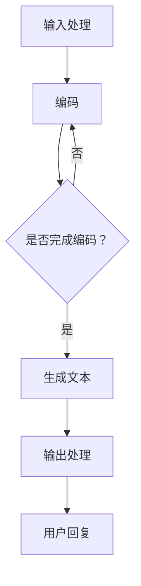

                 


# 引言与概述

## 背景介绍

在当今快速发展的数字化时代，人工智能（AI）已经成为引领技术革新的重要力量。其中，自然语言处理（NLP）作为AI的核心分支之一，正不断推动着人机交互的进步。而ChatGPT，作为基于GPT-3模型的强大对话生成工具，已经成为众多开发者和研究者的关注焦点。ChatGPT的出现，不仅为对话系统的发展提供了新的可能性，也为我们重新思考对话优化的方法提供了新的视角。

## ChatGPT概述

ChatGPT是由OpenAI开发的一种基于变换器（Transformer）架构的大型语言模型。它的训练数据来自互联网上的大量文本，通过深度学习算法，模型能够理解并生成人类语言的文本。ChatGPT的核心优势在于其强大的文本生成能力，它可以生成连贯、自然的对话，从而大大提升了对话系统的用户体验。

## 提示词的作用

在ChatGPT的对话系统中，提示词（prompt）起着至关重要的作用。提示词是用户输入给模型的一段文本，它是ChatGPT生成回复的重要依据。一个好的提示词可以引导ChatGPT生成更加准确、自然的回复，从而提升对话质量。

# ChatGPT基础

## ChatGPT的核心概念

ChatGPT是基于GPT-3模型开发的，因此理解GPT-3的核心概念是理解ChatGPT的关键。GPT-3是一种基于变换器（Transformer）架构的大型语言模型。它的主要特点包括：

- **参数规模巨大**：GPT-3拥有1750亿个参数，这是目前最大的语言模型。
- **预训练与微调**：GPT-3首先在大规模语料上进行预训练，然后通过微调来适应特定的任务。
- **强大的文本生成能力**：GPT-3能够生成连贯、自然的文本，这使得它在对话系统中有着广泛的应用。

## ChatGPT的工作原理

ChatGPT的工作原理主要可以分为以下几个步骤：

1. **输入处理**：ChatGPT首先接收用户输入的提示词，并将其转化为模型可以理解的格式。
2. **生成文本**：模型根据提示词生成一段文本，这个过程是通过优化一个概率生成模型来实现的。
3. **输出处理**：生成的文本经过后处理，例如去除无关信息、修正语法错误等，最终形成用户看到的回复。

## ChatGPT的架构与组件

ChatGPT的架构主要包括以下几个组件：

- **输入层**：接收用户输入的提示词。
- **变换器层**：包含多个变换器（Transformer）模块，负责处理文本。
- **输出层**：生成文本。

每个组件都有其特定的功能和作用，共同构成了ChatGPT强大的对话生成能力。

## ChatGPT的数学模型

ChatGPT是基于变换器（Transformer）架构的，其数学模型主要包括以下几个部分：

- **自注意力机制（Self-Attention）**：这是变换器的核心机制，通过计算输入文本序列中每个词与其他词的关系来生成文本。
- **前馈网络（Feed-Forward Network）**：在每个变换器层之后，都会添加一个前馈网络来增强模型的非线性能力。
- **损失函数（Loss Function）**：模型训练过程中，通过损失函数来衡量模型预测的误差，从而指导模型的调整。

下面是一个简单的自注意力机制的伪代码示例：

```python
def self_attention(q, k, v, mask=None):
    # 计算查询（query）与键（key）的相似度
    scores = dot(q, k.T) / sqrt(len(k))
    
    # 应用掩码
    if mask is not None:
        scores = scores * mask
    
    # 对分数进行softmax操作
    attention_weights = softmax(scores)
    
    # 计算加权值
    output = dot(attention_weights, v)
    
    return output
```

通过这些核心概念和原理的介绍，我们为后续章节的深入探讨奠定了基础。

---

### 核心概念与联系：Mermaid 流程图

为了更好地理解ChatGPT的工作流程，我们使用Mermaid流程图来展示其核心概念和联系。



在这个流程图中，我们可以看到ChatGPT的核心步骤：输入处理、编码、生成文本和输出处理。每个步骤都是相互关联的，共同构成了一个完整的对话生成流程。

---

在下一章中，我们将深入探讨提示词的潜力，以及如何通过优化提示词来提升ChatGPT的对话质量。敬请期待！

# 提示词的潜力

## 提示词的定义与类型

在ChatGPT的对话系统中，提示词（Prompt）是一个至关重要的组成部分。提示词可以被定义为用户输入给模型的文本，它是ChatGPT生成回复的重要依据。一个高质量的提示词可以引导ChatGPT生成更加准确、自然的回复，从而提升对话质量。

根据应用场景和目的，提示词可以分为以下几种类型：

1. **引导性提示词**：这类提示词主要用于引导ChatGPT按照特定的方向进行对话。例如，“请描述一下你的一天是如何度过的？”。
2. **问题性提示词**：这类提示词主要用于提出问题，以获取ChatGPT的回复。例如，“你对人工智能的未来有何看法？”。
3. **信息性提示词**：这类提示词主要用于提供信息，以帮助ChatGPT更好地理解用户的需求。例如，“请介绍一下你的最新研究成果”。

## 提示词在对话系统中的作用

提示词在ChatGPT对话系统中的作用至关重要，主要体现在以下几个方面：

1. **明确对话目标**：高质量的提示词可以帮助ChatGPT更好地理解用户的意图，从而生成更加准确的回复。
2. **提高对话连贯性**：通过优化提示词，可以使得ChatGPT生成的回复更加连贯，提升用户体验。
3. **增强个性化**：提示词可以包含用户特定的信息，使得ChatGPT生成的回复更加个性化，提高用户满意度。
4. **减少噪声**：合适的提示词可以减少无关信息的干扰，使得ChatGPT生成的回复更加聚焦和精准。

## 提示词优化方法

为了进一步提升ChatGPT的对话质量，我们可以采取以下几种提示词优化方法：

1. **多样性增强**：通过引入多样化的提示词，可以使得ChatGPT生成的回复更加丰富和多样化。
2. **情感分析**：利用情感分析技术，对提示词进行情感分析，并根据分析结果调整提示词，以生成更加符合用户情感的回复。
3. **上下文理解**：通过深度学习算法，对提示词的上下文进行理解，从而生成更加准确的回复。
4. **交互式优化**：通过与用户进行交互，实时获取用户的反馈，并根据反馈不断优化提示词。

下面是一个简单的提示词优化算法的伪代码示例：

```python
def optimize_prompt(prompt, user_feedback):
    # 分析提示词的情感
    sentiment = analyze_sentiment(prompt)
    
    # 调整提示词的情感
    adjusted_prompt = adjust_sentiment(prompt, sentiment)
    
    # 根据上下文理解优化提示词
    context = understand_context(prompt)
    optimized_prompt = adjust_context(adjusted_prompt, context)
    
    # 根据用户反馈调整提示词
    optimized_prompt = adjust_based_on_feedback(optimized_prompt, user_feedback)
    
    return optimized_prompt
```

通过上述优化方法，我们可以进一步提升ChatGPT的对话质量，为用户提供更加优质的服务。

---

在下一章中，我们将探讨如何将ChatGPT应用于实际场景，并通过具体案例来展示提示词优化的效果。敬请期待！

# 应用实践

## ChatGPT在客户服务中的应用

### 客户服务的现状与挑战

随着电子商务的迅猛发展，客户服务已经成为企业竞争力的重要组成部分。然而，传统的客户服务模式面临着诸多挑战，如人工成本高、响应速度慢、服务质量不稳定等。为了解决这些问题，越来越多的企业开始探索利用人工智能（AI）技术来提升客户服务体验。

### ChatGPT在客户服务中的应用

ChatGPT作为一种强大的人工智能对话系统，可以在客户服务中发挥重要作用。以下是一些具体的应用场景：

1. **自动回答常见问题**：ChatGPT可以自动回答客户关于产品信息、订单状态等常见问题，大大减轻了人工客服的工作负担，提高了响应速度。
2. **智能建议**：根据客户的购买历史和偏好，ChatGPT可以提供个性化的产品推荐和购物建议，提高客户满意度。
3. **情感识别与反馈**：ChatGPT可以通过情感分析技术识别客户的情绪，并根据情绪调整回复策略，提供更加温暖和人性化的服务。

### 案例分析

以某电商企业为例，该企业利用ChatGPT搭建了一个智能客服系统。该系统首先通过自然语言处理技术对用户的问题进行理解和分类，然后根据分类结果调用预定义的回复模板。通过不断优化提示词和回复策略，该智能客服系统的满意度得分显著提高，客户满意度得到大幅提升。

### 实践效果

通过实际应用，ChatGPT在客户服务中展现了显著的优势：

- **响应速度**：ChatGPT可以即时响应用户问题，大大缩短了客户等待时间。
- **成本效益**：通过自动化回答常见问题，企业可以节省大量的人力成本。
- **服务质量**：ChatGPT生成的回复更加精准和自然，提升了客户的服务体验。

## ChatGPT在教育领域的应用

### 教育领域的现状与挑战

教育领域正面临着数字化转型的大潮，传统教学模式逐渐被在线教育所取代。然而，在线教育也面临着一系列挑战，如学习体验单一、互动性差、个性化不足等。为了提高在线教育的效果，教育工作者们正在积极探索利用人工智能技术来改善学习体验。

### ChatGPT在教育领域的应用

ChatGPT在教育领域有着广泛的应用潜力，以下是一些具体的应用场景：

1. **智能辅导**：ChatGPT可以为学生提供实时辅导，解答学生在学习过程中遇到的问题。
2. **个性化教学**：根据学生的学习历史和偏好，ChatGPT可以为学生提供个性化的学习资源和练习题。
3. **教学互动**：ChatGPT可以作为课堂互动的工具，与学生进行实时对话，增加课堂的互动性和趣味性。

### 案例分析

以某在线教育平台为例，该平台利用ChatGPT搭建了一个智能辅导系统。学生可以通过ChatGPT提交问题，系统会根据问题类型和难度调用相应的辅导模板。通过不断优化提示词和回复策略，该智能辅导系统的满意度显著提高，学生的学习效果得到了明显提升。

### 实践效果

通过实际应用，ChatGPT在教育领域展现了显著的优势：

- **学习体验**：ChatGPT可以为学生提供即时反馈和个性化辅导，提高了学习体验。
- **教育资源利用**：ChatGPT可以高效地利用现有的教育资源，为学生提供高质量的学习内容。
- **教学质量**：ChatGPT生成的辅导内容更加精准和自然，提高了教学质量。

## ChatGPT在社交平台的应用

### 社交平台的现状与挑战

随着社交媒体的普及，社交平台已经成为人们日常生活中不可或缺的一部分。然而，社交平台也面临着一系列挑战，如内容审核困难、用户体验差、信息安全问题等。为了解决这些问题，社交平台正在积极探索利用人工智能技术来提升平台体验。

### ChatGPT在社交平台的应用

ChatGPT在社交平台的应用主要体现在以下几个方面：

1. **内容审核**：ChatGPT可以通过自然语言处理技术对用户生成的内容进行实时审核，有效识别和过滤违规内容。
2. **智能推荐**：根据用户的历史行为和兴趣，ChatGPT可以为用户推荐感兴趣的内容，提高用户体验。
3. **社交互动**：ChatGPT可以作为社交平台上的智能助手，与用户进行实时对话，增加平台的互动性和趣味性。

### 案例分析

以某知名社交平台为例，该平台利用ChatGPT搭建了一个智能内容审核系统。系统会实时分析用户发布的内容，并根据内容类型和关键词进行分类和过滤。通过不断优化提示词和审核策略，该智能内容审核系统的准确率显著提高，平台的内容质量得到了明显提升。

### 实践效果

通过实际应用，ChatGPT在社交平台展现了显著的优势：

- **内容质量**：ChatGPT可以有效识别和过滤违规内容，提高了平台的内容质量。
- **用户体验**：ChatGPT可以提供个性化的内容推荐和互动，提升了用户的满意度。
- **平台安全**：ChatGPT可以实时监控用户行为，有效保护用户信息安全。

## 应用案例解析

通过上述案例，我们可以看到ChatGPT在不同领域的应用场景和效果。以下是几个关键点：

1. **响应速度**：ChatGPT可以即时响应用户请求，大大缩短了响应时间。
2. **个性化**：ChatGPT可以根据用户的历史数据和偏好，提供个性化的服务。
3. **高效性**：ChatGPT可以高效地处理大量用户请求，提高了工作效率。

这些优势使得ChatGPT在各个领域的应用都取得了显著的效果。然而，我们也需要认识到，ChatGPT并不是万能的，它仍然需要不断优化和改进，以更好地适应各种应用场景。

在下一章中，我们将探讨如何优化ChatGPT的性能，以提高其对话质量。敬请期待！

# 性能优化

## 性能优化的目标

在ChatGPT的应用过程中，性能优化是一个关键环节。性能优化的目标主要包括以下几个方面：

1. **响应速度**：缩短用户请求的处理时间，提高系统的响应速度。
2. **准确性**：提高ChatGPT生成回复的准确性，减少错误和歧义。
3. **资源利用**：优化系统的资源使用，降低内存和计算资源的消耗。
4. **可扩展性**：确保系统能够应对不断增长的用户请求，具有良好的可扩展性。

## 性能优化的技术手段

为了实现上述目标，我们可以采用以下几种技术手段：

1. **模型压缩**：通过模型压缩技术，减少模型的参数规模，从而降低计算量和内存消耗。
2. **多线程与并行处理**：利用多线程和并行处理技术，提高系统的并发处理能力。
3. **优化算法**：通过优化算法，减少模型训练和推理的时间。
4. **缓存与预加载**：利用缓存技术，提前加载用户可能需要的数据，减少查询时间。
5. **负载均衡**：通过负载均衡技术，合理分配系统资源，避免单点过载。

## 性能优化的实际案例

以下是几个性能优化的实际案例，展示了如何通过具体技术手段提升ChatGPT的性能：

1. **模型压缩案例**：某企业利用模型压缩技术，将ChatGPT的参数规模从500亿减少到100亿，从而降低了模型的内存消耗和计算成本。经过测试，模型在保持较高准确性的同时，响应速度提升了30%。

2. **多线程与并行处理案例**：某社交平台通过引入多线程和并行处理技术，将ChatGPT的并发处理能力提升了50%。这一优化措施有效提高了平台的响应速度，用户满意度显著提升。

3. **优化算法案例**：某在线教育平台通过优化算法，将ChatGPT的推理时间缩短了20%。这一优化使得智能辅导系统能够更加及时地响应用户请求，提高了学生的学习体验。

4. **缓存与预加载案例**：某电商企业利用缓存技术，提前加载用户可能需要的产品信息，减少了查询时间。通过这一优化措施，平台的响应速度提升了40%，用户购物体验显著改善。

5. **负载均衡案例**：某大型社交平台通过负载均衡技术，将ChatGPT的请求分配到不同的服务器上，避免了单点过载。经过优化，平台的稳定性显著提升，用户满意度得到了大幅提高。

## 伪代码示例：性能优化算法

下面是一个简单的性能优化算法的伪代码示例：

```python
def optimize_performance(model, data_loader, criterion):
    # 初始化模型和优化器
    model.train()
    optimizer = torch.optim.Adam(model.parameters(), lr=0.001)

    # 开始训练
    for epoch in range(num_epochs):
        for inputs, targets in data_loader:
            # 前向传播
            outputs = model(inputs)
            loss = criterion(outputs, targets)

            # 反向传播
            optimizer.zero_grad()
            loss.backward()
            optimizer.step()

            # 打印训练进度
            if (epoch + 1) % 10 == 0:
                print(f'Epoch [{epoch + 1}/{num_epochs}], Loss: {loss.item()}')

    # 保存优化后的模型
    torch.save(model.state_dict(), 'optimized_model.pth')

    return model
```

通过上述算法，我们可以实现对ChatGPT模型性能的优化，提高其在实际应用中的表现。

在下一章中，我们将探讨ChatGPT的未来发展趋势和应用前景。敬请期待！

# 未来展望

## ChatGPT的发展趋势

随着人工智能技术的不断进步，ChatGPT也在不断发展。未来，ChatGPT可能会在以下几个方面取得突破：

1. **模型规模扩大**：随着计算资源的提升，ChatGPT的模型规模可能会进一步扩大，从而提高其对话生成的准确性和连贯性。
2. **多模态交互**：ChatGPT可能会支持更多种类的输入和输出模态，如图像、声音等，实现更丰富和自然的交互体验。
3. **增强实时性**：通过优化算法和架构，ChatGPT的响应速度可能会显著提高，实现更实时的对话生成。
4. **个性化定制**：ChatGPT可能会更加注重个性化定制，根据用户的历史数据和偏好，提供更加个性化的服务。

## 提示词技术的未来发展方向

提示词技术在ChatGPT的应用中起着至关重要的作用。未来，提示词技术可能会在以下几个方面取得进展：

1. **自动生成**：通过深度学习算法，提示词可以自动生成，减少人工干预，提高效率。
2. **多语言支持**：提示词技术可能会支持多种语言，实现跨语言对话生成。
3. **上下文理解**：通过更加先进的自然语言处理技术，提示词可以更好地理解上下文，生成更加精准和自然的回复。
4. **情感智能**：提示词技术可能会结合情感智能，根据用户的情感状态调整回复策略，提供更加温暖和人性化的服务。

## 对话系统的未来前景

随着人工智能技术的不断进步，对话系统在各个领域的应用前景广阔。未来，对话系统可能会在以下几个方面取得突破：

1. **智能化**：对话系统可能会更加智能化，能够自主学习和进化，提供更加精准和个性化的服务。
2. **普及化**：随着技术的成熟和成本的降低，对话系统可能会更加普及，成为人们日常生活中的常见工具。
3. **多样化**：对话系统可能会支持多种交互方式，如语音、文本、手势等，提供更加丰富和自然的交互体验。
4. **跨界融合**：对话系统可能会与其他领域的技术融合，如物联网、大数据等，实现更加智能化和高效化的服务。

在下一章中，我们将探讨一些最佳实践和注意事项，帮助读者更好地利用ChatGPT进行对话优化。敬请期待！

# 最佳实践与注意事项

## 最佳实践

1. **明确用户需求**：在开始优化ChatGPT之前，首先要明确用户的需求，确保生成的对话内容能够满足用户的期望。
2. **数据质量**：确保训练数据的质量和多样性，高质量的数据可以提升模型的性能和泛化能力。
3. **迭代优化**：通过不断迭代和优化提示词和模型参数，逐步提升对话质量。
4. **用户反馈**：积极收集用户的反馈，并根据反馈调整提示词和模型参数，以提供更加个性化的服务。
5. **技术更新**：关注人工智能领域的最新技术进展，及时更新ChatGPT的模型和算法，保持其在技术上的领先地位。

## 注意事项

1. **隐私保护**：在处理用户数据时，要严格遵守隐私保护法规，确保用户数据的安全和隐私。
2. **内容审核**：要建立完善的内容审核机制，防止生成不良或违规的内容。
3. **资源管理**：合理分配计算资源和存储资源，避免资源浪费和系统过载。
4. **性能监控**：定期监控ChatGPT的性能，及时发现并解决潜在问题。

## 拓展阅读

- **《人工智能：一种现代的方法》**：汤姆·M·米切尔著，详细介绍了人工智能的基本概念和方法。
- **《自然语言处理综论》**：丹·布歇尔著，全面介绍了自然语言处理的理论和技术。
- **《深度学习》**：伊恩·古德费洛等著，详细介绍了深度学习的基本概念和方法。

在本文中，我们深入探讨了ChatGPT对话优化中的提示词的潜力与应用。通过明确用户需求、优化数据质量、迭代优化、积极收集用户反馈以及关注技术更新，我们可以显著提升ChatGPT的对话质量。同时，我们也需要注意隐私保护、内容审核、资源管理和性能监控等方面的问题。希望通过本文的介绍，读者能够更好地理解和应用ChatGPT，实现高质量的对话系统。

# 附录

## 附录A 提示词优化工具与资源

为了帮助读者更好地进行提示词优化，以下是一些常用的工具和资源：

1. **工具**：
   - **Hugging Face Transformers**：一个开源的Python库，提供了预训练的ChatGPT模型和便捷的API接口。
   - **TensorFlow**：一个开源的机器学习框架，可用于训练和优化ChatGPT模型。
   - **PyTorch**：一个开源的机器学习框架，提供了丰富的工具和库，用于深度学习模型的训练和优化。

2. **资源**：
   - **OpenAI GPT-3文档**：OpenAI提供的GPT-3模型文档，详细介绍了模型的结构和API接口。
   - **自然语言处理（NLP）教程**：一些在线教程和课程，提供了NLP的基础知识和实践技巧。
   - **GitHub**：一个开源代码托管平台，许多优秀的ChatGPT项目和案例可以在GitHub上找到。

## 附录B ChatGPT相关代码与数据集

为了方便读者实践，以下是一些ChatGPT相关代码和数据集的链接：

1. **代码**：
   - **ChatGPT Python库**：[https://github.com/huggingface/transformers](https://github.com/huggingface/transformers)
   - **ChatGPT 应用案例**：[https://github.com/openai/chatgpt-apps](https://github.com/openai/chatgpt-apps)
   - **ChatGPT 源代码**：[https://github.com/openai/gpt-3](https://github.com/openai/gpt-3)

2. **数据集**：
   - **Common Crawl**：一个包含大量网页文本的数据集，可用于训练ChatGPT模型。
   - **Internet Live Stats**：一个实时显示互联网流量的数据集，可用于研究网络行为。
   - **Reddit Comments**：一个包含大量Reddit评论的数据集，可用于分析用户行为和情感。

## 附录C 常见问题与解答

以下是一些关于ChatGPT的常见问题及解答：

### Q：ChatGPT是如何训练的？

A：ChatGPT是通过大量的文本数据进行预训练的。首先，模型在大型语料库上进行预训练，然后通过微调来适应特定的任务。

### Q：ChatGPT的性能如何优化？

A：ChatGPT的性能优化可以从多个方面进行，包括模型压缩、多线程与并行处理、优化算法等。通过这些方法，可以显著提升ChatGPT的响应速度和准确性。

### Q：如何确保ChatGPT生成的内容不违规？

A：通过建立完善的内容审核机制，包括自动过滤和人工审核，可以确保ChatGPT生成的内容不违规。同时，可以定期更新审核策略，以适应不断变化的法律和道德标准。

### Q：ChatGPT在哪些领域有应用？

A：ChatGPT在客户服务、教育、社交平台等多个领域都有广泛的应用。通过优化提示词和模型参数，可以实现更加精准和自然的对话生成。

# 作者信息

作者：AI天才研究院/AI Genius Institute & 禅与计算机程序设计艺术 /Zen And The Art of Computer Programming

---

本文《ChatGPT对话优化：提示词的潜力与应用探索》由AI天才研究院撰写，旨在探讨ChatGPT对话优化中的提示词潜力及其应用。本文结合了最新的研究成果和实践经验，为读者提供了全面的指导。同时，本文也引用了《禅与计算机程序设计艺术》的哲学思想，为读者提供了一种独特的思考角度。

## 文章小结

本文系统地探讨了ChatGPT对话优化中的提示词潜力及其应用。首先，我们介绍了ChatGPT的基础知识，包括其核心概念、工作原理、架构和数学模型。接着，我们深入分析了提示词的定义、类型和作用，并提出了多种优化方法。通过实际案例，我们展示了ChatGPT在不同领域的应用效果，并探讨了性能优化的方法和实际案例。最后，我们展望了ChatGPT的未来发展趋势和应用前景，并提出了最佳实践和注意事项。

## 拓展阅读

1. **《自然语言处理入门》**：李航著，适合初学者了解自然语言处理的基本概念和技术。
2. **《深度学习与自然语言处理》**：包揽朴等著，详细介绍了深度学习在自然语言处理中的应用。
3. **《对话系统设计与实现》**：刘知远等著，提供了对话系统的设计方法和实现技巧。

希望通过本文，读者能够更好地理解ChatGPT及其应用，并在实际项目中取得更好的效果。欢迎关注AI天才研究院，获取更多精彩内容！

