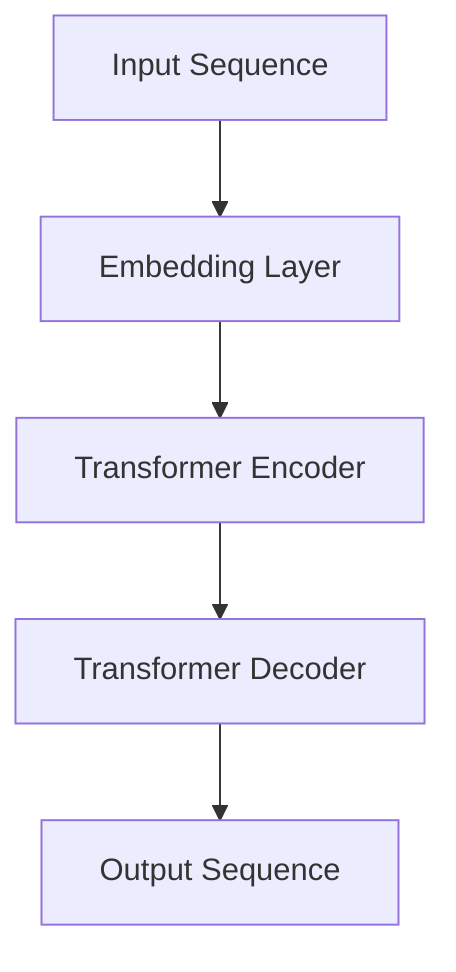
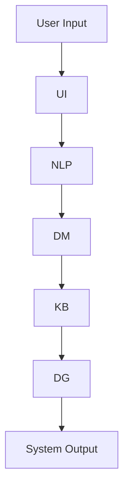
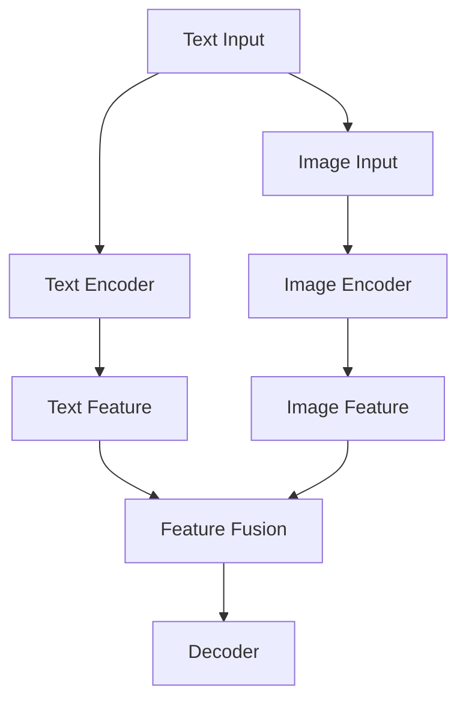
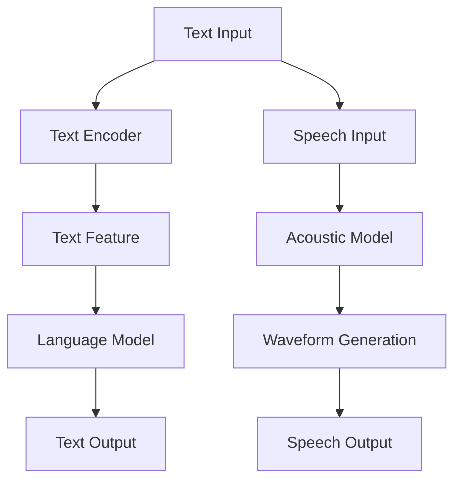
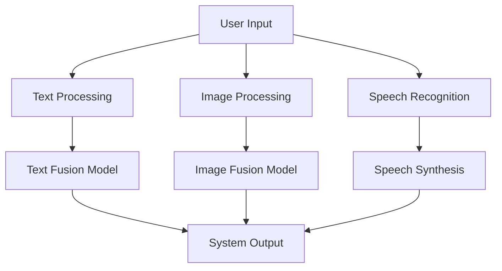

                 


### 文章标题

《ChatGPT对话系统优化：提示词的艺术》

### 关键词

- ChatGPT
- 对话系统
- 优化
- 提示词
- 自然语言处理
- 多模态交互

### 摘要

本文深入探讨了ChatGPT对话系统的优化策略，重点关注了提示词在提升对话质量中的关键作用。通过分析ChatGPT的产生背景、核心原理及应用场景，本文详细介绍了对话系统的基本概念、分类及架构设计。随后，本文探讨了如何通过选择和设计提示词、评估与优化对话质量、性能优化以及构建多模态对话系统来提升ChatGPT对话系统的效果。文章还针对教育、医疗和客户服务场景提供了具体的优化实践，最后对提示词的艺术基础、常见提示词类型的分析与优化进行了深入剖析，并通过实战案例分析展示了优化策略的实际应用效果。本文旨在为开发者提供一套系统的ChatGPT对话系统优化方法，以应对未来对话系统的需求。

## 第一部分：ChatGPT对话系统基础

### 第1章：ChatGPT概述

#### 1.1 ChatGPT的产生背景

ChatGPT是由美国的人工智能研究公司OpenAI在2022年11月30日发布的一款基于GPT-3.5（Generative Pre-trained Transformer 3.5）的聊天机器人模型。ChatGPT的诞生背景源于人工智能领域对自然语言处理技术的不断探索与突破，以及社会对高效便捷的智能交互系统的迫切需求。

早在2018年，OpenAI就发布了GPT-3模型，这是一个具有1750亿参数的预训练语言模型，其强大的文本生成能力引起了广泛关注。然而，GPT-3虽然在生成文本方面表现出色，但在与用户的对话中仍然存在一些局限性，例如对话的连贯性、准确性和上下文理解等方面仍有待提高。为了解决这些问题，OpenAI在GPT-3的基础上进一步优化和扩展，开发了GPT-3.5，并在此基础上构建了ChatGPT。

#### 1.2 ChatGPT的核心原理

ChatGPT的核心原理是基于深度学习技术的大型语言模型，它通过在海量文本数据上进行预训练，从而学习到语言的规律和结构。具体来说，ChatGPT采用了Transformer架构，这是一种基于自注意力机制的神经网络模型，其结构如图1所示。



图1 ChatGPT的模型结构

在模型训练过程中，ChatGPT首先对输入的文本序列进行嵌入，即将文本转换为向量表示。接着，这些向量通过Transformer编码器（Encoder）进行处理，编码器内部包含多个自注意力层（Self-Attention Layer），这些层能够捕捉文本中的长距离依赖关系。最后，通过Transformer解码器（Decoder）生成输出序列，解码器同样包含多个自注意力层，能够根据上下文生成相应的回复。

#### 1.3 ChatGPT的应用场景

ChatGPT可以应用于多种场景，其中最典型的应用包括：

1. **客服**：ChatGPT能够模拟人类客服，自动处理大量用户咨询，提高客户满意度和服务效率。
2. **教育**：ChatGPT可以作为智能辅导系统，帮助学生解答问题，提供个性化的学习建议。
3. **医疗**：ChatGPT能够辅助医生进行诊断和治疗方案推荐，提高医疗服务的质量和效率。
4. **娱乐**：ChatGPT可以作为聊天伙伴，与用户进行有趣的对话，提供娱乐服务。
5. **写作辅助**：ChatGPT可以帮助用户生成文章、报告、诗歌等文本内容，提高写作效率。

通过上述应用场景可以看出，ChatGPT凭借其强大的文本生成能力和理解能力，已经在多个领域展现出了巨大的潜力。然而，为了更好地发挥其优势，仍需要对ChatGPT对话系统进行优化。

## 第二部分：对话系统概述

### 第2章：对话系统概述

#### 2.1 对话系统的基本概念

对话系统（Dialogue System）是一种能够与人类进行自然语言交互的计算机系统。它通过自然语言处理（NLP）技术和人工智能（AI）技术，模拟人类的对话方式，与用户进行交流。对话系统的主要目标是实现人与机器之间的有效沟通，提高用户体验。

对话系统的基本概念包括以下几个方面：

1. **交互**：对话系统通过与用户的交互获取输入信息，并根据输入信息生成回复。
2. **上下文**：对话系统需要维护对话的上下文信息，以便更好地理解用户的意图和需求。
3. **状态**：对话系统具有状态，用于记录当前对话的状态，如对话轮数、用户意图等。
4. **反馈**：对话系统需要根据用户的反馈进行调整和优化，以提高对话效果。

#### 2.2 对话系统的分类

对话系统可以根据不同的分类标准进行分类，常见的分类方法包括：

1. **按交互方式**：可以分为单轮对话系统和多轮对话系统。单轮对话系统通常在单次交互中完成用户的请求，而多轮对话系统则需要在多个交互轮次中逐步理解用户的意图，提供更准确的服务。
   
   ```mermaid
   graph TD
   A[单轮对话系统] --> B[多轮对话系统]
   B --> C[问答式对话系统]
   C --> D[任务型对话系统]
   ```

2. **按功能**：可以分为问答式对话系统和任务型对话系统。问答式对话系统主要用于回答用户的问题，而任务型对话系统则专注于帮助用户完成任务。

3. **按技术实现**：可以分为基于规则（Rule-Based）的对话系统和基于统计（Statistical）的对话系统，以及基于深度学习（Deep Learning）的对话系统。基于规则的方法依赖于预定义的规则和模式，而基于统计和深度学习的方法则通过大规模数据训练模型，以实现更灵活和智能的对话。

#### 2.3 对话系统的架构设计

对话系统的架构设计是构建高效、可扩展对话系统的关键。一个典型的对话系统架构包括以下几个模块：

1. **用户接口（UI）**：用于接收用户的输入，并将系统生成的回复展示给用户。
2. **对话管理（DM）**：负责维护对话的上下文状态，决定对话的流程和逻辑。
3. **自然语言处理（NLP）**：用于处理用户的输入，包括分词、词性标注、意图识别等。
4. **知识库（KB）**：存储对话系统所需的知识和信息，用于回答问题和完成任务。
5. **对话生成器（DG）**：根据用户的输入和对话状态，生成合适的回复。

以下是对话系统架构的Mermaid流程图：



通过上述模块的协同工作，对话系统能够与用户进行有效的交互，提供高质量的对话服务。

## 第二部分：ChatGPT对话系统优化

### 第3章：优化ChatGPT对话系统

#### 3.1 提示词的选择与设计

提示词（Prompt）是在对话系统中引导模型生成回复的关键输入。一个设计良好的提示词能够显著提升ChatGPT对话系统的效果。以下是提示词选择与设计的一些关键点：

1. **明确性**：提示词应当清晰明确，避免模糊或歧义，确保模型能够准确理解用户的意图。
2. **上下文**：提示词应当包含足够的上下文信息，帮助模型更好地理解对话的背景和用户的需求。
3. **灵活性**：提示词应当具有一定的灵活性，能够适应不同的对话场景和用户输入。

设计提示词时，可以采用以下几种策略：

1. **模板化**：使用预定义的模板来构建提示词，例如“请告诉我关于XX的信息”或“请帮我解决XX问题”。
2. **开放性**：设计开放性的提示词，鼓励用户提供更多的信息，例如“你对XX有什么看法？”。
3. **引导性**：设计引导性的提示词，引导用户按照特定的方向进行对话，例如“你是如何解决XX问题的？”。

以下是一个示例：

```plaintext
用户：请给我介绍一下ChatGPT。

提示词：ChatGPT是由OpenAI开发的一款基于GPT-3.5的聊天机器人模型，它通过预训练学习大量文本数据，能够生成高质量的自然语言回复。
```

#### 3.2 对话质量的评估与优化

对话质量是衡量对话系统效果的重要指标。为了提升对话质量，需要对对话进行评估和优化。以下是评估与优化对话质量的一些方法：

1. **用户反馈**：通过用户反馈来评估对话系统的效果，了解用户对对话的满意度。用户反馈可以是定量评估（如评分）或定性评估（如评论）。
2. **对话日志分析**：分析对话日志，识别对话中的问题，如回答不准确、不连贯或不符合用户需求等。
3. **性能指标**：定义一些性能指标，如响应时间、错误率、用户满意度等，用于量化对话质量。

优化对话质量的方法包括：

1. **模型调优**：通过调整模型的参数，提高模型在特定任务上的性能。
2. **数据增强**：增加高质量的训练数据，特别是包含错误案例的数据，以帮助模型学习错误的处理方法。
3. **反馈循环**：建立反馈循环，将用户反馈和对话日志分析结果用于模型训练和优化。

以下是一个评估对话质量的示例：

```plaintext
用户满意度：4.5/5
响应时间：2.5秒
错误率：3%
```

#### 3.3 ChatGPT对话系统的性能优化

ChatGPT对话系统的性能优化主要包括提高模型响应速度和降低模型计算资源消耗。以下是几种性能优化方法：

1. **模型压缩**：通过模型压缩技术，减小模型的大小，加快模型加载速度。常见的方法包括量化、剪枝和蒸馏等。
2. **模型缓存**：将用户常见的查询和回复缓存起来，以减少重复计算。这样可以显著降低模型的计算负载。
3. **并行计算**：利用多线程或分布式计算技术，加速模型的推理过程。例如，可以使用GPU或TPU来加速模型计算。
4. **负载均衡**：在系统中实现负载均衡，确保模型计算资源的合理分配，避免过载或空闲。

以下是一个模型压缩的示例：

```plaintext
原模型大小：100MB
压缩后模型大小：5MB
压缩比例：5%
```

通过上述优化方法，可以显著提升ChatGPT对话系统的性能和用户体验。

## 第三部分：多模态对话系统的构建

### 第4章：多模态对话系统的构建

#### 4.1 文本与图像的融合

多模态对话系统能够处理文本和图像等多模态输入，实现更加丰富的交互体验。文本与图像的融合是构建多模态对话系统的关键步骤之一。以下是文本与图像融合的基本方法和流程：

1. **文本与图像的预处理**：首先对文本和图像进行预处理，包括文本的分词、词性标注和图像的分割、特征提取等。
   
2. **特征融合**：将文本和图像的特征进行融合，常用的方法有：
   - **加权融合**：根据特征的重要程度进行加权融合，如使用注意力机制。
   - **拼接融合**：将文本和图像的特征拼接在一起，形成一个更长的特征向量。
   - **对抗性训练**：使用对抗性网络，让文本和图像的特征在对抗性训练中相互补充和修正。

3. **多模态模型**：构建多模态模型，用于融合和处理多模态输入。常见的多模态模型包括：
   - **编码器-解码器（Encoder-Decoder）模型**：将文本和图像分别编码，然后融合解码生成回复。
   - **交互式模型**：文本和图像的特征在多个交互层中相互影响，逐步生成回复。

以下是文本与图像融合的Mermaid流程图：



#### 4.2 语音与文本的转换

语音与文本的转换是实现语音交互的关键步骤。语音识别（Speech Recognition）和语音合成（Text-to-Speech，TTS）是实现语音与文本转换的核心技术。以下是语音与文本转换的基本方法和流程：

1. **语音识别**：
   - **声学模型**：使用大量的语音数据训练声学模型，用于提取语音特征。
   - **语言模型**：使用大量的文本数据训练语言模型，用于生成文本输出。
   - **声学模型与语言模型的融合**：通过融合声学模型和语言模型，提高识别的准确性和效率。

2. **语音合成**：
   - **文本转换**：将输入文本转换为声学特征。
   - **波形生成**：使用声学特征生成语音波形。
   - **语音输出**：将生成的语音波形播放出来。

以下是语音与文本转换的Mermaid流程图：



#### 4.3 多模态对话系统的设计与实现

多模态对话系统的设计与实现需要综合考虑文本、图像和语音等多种模态的输入和处理。以下是多模态对话系统设计与实现的步骤：

1. **需求分析**：明确多模态对话系统的目标和功能需求，如文本回复、图像识别和语音交互等。
2. **技术选型**：选择合适的技术和工具，如文本处理库、图像处理库和语音处理库等。
3. **模型构建**：构建多模态模型，用于融合和处理多模态输入，如文本与图像融合模型、语音识别模型和语音合成模型等。
4. **系统集成**：将多模态模型集成到对话系统中，实现多模态交互功能。
5. **测试与优化**：通过测试和用户反馈，优化多模态对话系统的性能和用户体验。

以下是多模态对话系统的架构图：



通过上述设计与实现步骤，可以构建一个高效、灵活的多模态对话系统，提供丰富的交互体验。

## 第三部分：面向特定场景的ChatGPT优化

### 第5章：面向特定场景的ChatGPT优化

#### 5.1 面向教育场景的ChatGPT优化

在教育场景中，ChatGPT可以作为智能辅导系统，辅助教师和学生进行教学和学习。为了提升ChatGPT在教育场景中的效果，可以从以下几个方面进行优化：

1. **知识库构建**：教育场景需要大量的知识库支持，包括学科知识、教育理论、教学策略等。通过构建丰富、准确的知识库，ChatGPT可以更好地回答学生的问题和提供学习建议。
2. **问答对训练**：收集并训练大量的问答对数据，使ChatGPT能够更好地理解和回答与教育相关的问题。例如，可以收集学生提问和教师回答的对话数据，用于训练ChatGPT。
3. **个性化学习**：通过分析学生的学习行为和成绩数据，ChatGPT可以为学生提供个性化的学习建议和辅导。例如，对于学习进度较慢的学生，ChatGPT可以提供额外的学习资源和练习。
4. **互动性增强**：通过增加互动性，如提问、讨论等，使ChatGPT更接近于人类辅导教师，提高学生的学习兴趣和参与度。

#### 5.2 面向医疗场景的ChatGPT优化

在医疗场景中，ChatGPT可以作为辅助诊断和治疗决策的工具，为医生和患者提供支持。以下是面向医疗场景的ChatGPT优化策略：

1. **医学知识库构建**：医疗场景需要大量的医学知识库支持，包括疾病诊断、治疗方法、药物信息等。通过构建丰富、准确的医学知识库，ChatGPT可以更好地理解和回答与医疗相关的问题。
2. **病历数据集成**：将患者的病历数据集成到ChatGPT系统中，使ChatGPT能够根据患者的具体情况进行诊断和治疗建议。例如，可以整合患者的检查报告、病史等数据。
3. **多模态交互**：在医疗场景中，患者可能需要通过文本、语音和图像等多种方式与ChatGPT进行交互。通过实现多模态交互，ChatGPT可以更全面地了解患者的需求和症状。
4. **专家协作**：与医疗专家进行合作，将专家的经验和知识融入ChatGPT中，提高ChatGPT的诊断和治疗建议的准确性。

#### 5.3 面向客户服务场景的ChatGPT优化

在客户服务场景中，ChatGPT可以作为客服机器人，帮助企业高效处理客户咨询和投诉。以下是面向客户服务场景的ChatGPT优化策略：

1. **服务流程优化**：分析客户服务流程，识别常见的客户问题和处理方法。通过优化服务流程，提高ChatGPT的处理效率和准确性。
2. **知识库更新**：定期更新客户服务知识库，确保ChatGPT能够回答最新的客户问题。例如，可以收集客户的常见问题和解决方案，用于更新知识库。
3. **情感分析**：通过情感分析技术，识别客户的情感和情绪，提供更人性化的服务。例如，对于愤怒的客户，ChatGPT可以提供安抚和建议。
4. **自动化处理**：实现自动化处理，减少人工干预。例如，对于简单的客户问题，ChatGPT可以自动生成回复，对于复杂的问题，ChatGPT可以引导客户与人工客服进行沟通。

通过上述面向特定场景的优化策略，ChatGPT可以在不同的场景中发挥更大的作用，提供更高质量的服务。

## 第三部分：提示词的艺术

### 第6章：提示词的艺术基础

#### 6.1 提示词的基本概念

提示词（Prompt）是引导对话系统生成回复的关键输入。在ChatGPT对话系统中，提示词的设计直接影响对话的质量和效果。一个有效的提示词应当能够清晰传达用户的意图，并引导ChatGPT生成相关、连贯且有用的回复。

提示词的基本概念包括以下几个方面：

1. **目标性**：提示词应当明确指出对话的目标或问题，使ChatGPT能够明确用户的需求。
2. **上下文性**：提示词应当包含足够的上下文信息，帮助ChatGPT理解当前对话的背景和情境。
3. **引导性**：提示词应当具有引导性，引导ChatGPT按照预期的方向进行对话。
4. **灵活性**：提示词应当具有一定的灵活性，能够适应不同类型的用户输入和对话场景。

#### 6.2 提示词的设计原则

为了设计出高质量的提示词，需要遵循以下原则：

1. **简洁性**：提示词应当简洁明了，避免冗长和复杂的表述，以便ChatGPT能够快速理解。
2. **明确性**：提示词应当清晰明确，避免歧义和模糊的表述，确保ChatGPT能够准确把握用户的意图。
3. **具体性**：提示词应当具体详细，提供足够的信息，以便ChatGPT能够生成相关、有用的回复。
4. **灵活性**：提示词应当具有一定的灵活性，能够适应不同的用户输入和对话场景。

#### 6.3 提示词的效果评估

评估提示词的效果是优化ChatGPT对话系统的重要环节。以下是一些常用的评估方法：

1. **用户满意度**：通过用户反馈来评估提示词的效果。用户满意度越高，说明提示词越成功。
2. **对话质量**：通过分析对话日志，评估对话的质量和流畅度。高质量的对话应具有连贯的上下文、准确的回答和积极的互动。
3. **回复长度和多样性**：评估提示词引导下生成的回复的长度和多样性。过短或过于单一的回复可能表明提示词不够有效。
4. **准确性和相关性**：评估生成的回复是否准确和与用户输入相关。准确性越高，说明提示词和ChatGPT的性能越好。

通过以上评估方法，可以全面了解提示词的效果，并针对性地进行优化。

### 第7章：常见提示词类型的分析与优化

#### 7.1 语义相关的提示词

语义相关的提示词主要用于引导ChatGPT生成与特定语义相关的回复。这类提示词通常包含具体的主题或关键词，以明确对话的方向和内容。以下是一些常见的语义相关提示词及其优化策略：

1. **信息查询**：如“请告诉我关于XX的信息”、“你能解释一下XX吗？”。
   - **优化策略**：提供详细的上下文信息和关键词，例如“请告诉我关于ChatGPT的应用场景和优势”。

2. **问题解答**：如“XX是怎么工作的？”、“为什么会出现XX问题？”。
   - **优化策略**：提供具体的背景信息和问题细节，例如“请解释一下如何优化ChatGPT对话系统的性能”。

3. **任务指令**：如“请帮我完成XX任务”、“你能帮我解决XX问题吗？”。
   - **优化策略**：明确任务目标和步骤，例如“请帮我设计一个面向教育场景的ChatGPT优化方案”。

通过优化语义相关的提示词，可以确保ChatGPT生成准确、相关的回复，提高对话的质量和用户体验。

#### 7.2 描述性的提示词

描述性的提示词主要用于引导ChatGPT生成描述性或解释性的回复。这类提示词通常用于介绍产品、服务、理论或概念。以下是一些常见的描述性提示词及其优化策略：

1. **产品介绍**：如“介绍一下XX产品”、“你能详细描述一下XX功能吗？”。
   - **优化策略**：提供具体的场景和用途，例如“请介绍一下ChatGPT对话系统在客户服务场景中的应用”。

2. **理论解释**：如“请解释一下XX理论”、“你能详细阐述一下XX概念吗？”。
   - **优化策略**：结合具体实例和实际应用，例如“请解释一下Transformer模型在自然语言处理中的应用”。

3. **案例分析**：如“分析一下XX案例”、“你能给我一个XX案例吗？”。
   - **优化策略**：提供详细的案例背景和结果，例如“分析一下如何优化ChatGPT对话系统的性能”。

通过优化描述性的提示词，可以确保ChatGPT生成丰富、详细且具有实用价值的描述性回复，提高对话的专业性和实用性。

#### 7.3 诱导性的提示词

诱导性的提示词主要用于引导ChatGPT生成具有引导性、互动性或激励性的回复。这类提示词通常用于激发用户思考和参与对话。以下是一些常见的诱导性提示词及其优化策略：

1. **提问式**：如“你对XX有什么看法？”、“你能预测一下XX的结果吗？”。
   - **优化策略**：提供具体的背景信息和问题，例如“你对ChatGPT在医疗领域的应用有什么看法？”

2. **引导性**：如“请进一步描述一下XX”、“你能给出XX的具体例子吗？”。
   - **优化策略**：明确引导方向和目标，例如“请进一步描述一下你期望的ChatGPT对话系统优化效果”。

3. **激励性**：如“你能尝试回答一下这个问题吗？”、“这个挑战对你来说有意义吗？”。
   - **优化策略**：设置具有吸引力和挑战性的问题，例如“你能尝试回答如何优化ChatGPT对话系统的响应时间吗？”

通过优化诱导性的提示词，可以激发用户的思考和参与，提高对话的互动性和趣味性，从而提升整体用户体验。

### 第8章：实战案例分析

#### 8.1 案例一：优化电商客服对话系统

**案例背景**：
某电商平台希望提升客服对话系统的效果，以减少人工客服的工作负担，并提高用户满意度。平台采用了ChatGPT作为客服对话系统的核心组件。

**问题分析**：
- 对话质量较低，用户反馈频繁出现不相关或错误的回复。
- 对话连贯性差，用户需要多次重复问题或提供额外信息。
- 响应速度较慢，导致用户体验不佳。

**优化策略**：
1. **提示词优化**：
   - 提供详细的用户背景信息和问题细节，例如“请帮助用户找回购物车中的商品”。
   - 设计引导性的提示词，例如“你最近购买了什么商品？有什么需要帮助的吗？”。
   - 增加描述性的提示词，例如“我们的客服系统可以为您提供以下服务：找回购物车、修改订单信息、退款等”。

2. **对话质量评估**：
   - 引入用户满意度评分机制，收集用户对客服对话的反馈。
   - 定期分析对话日志，识别常见的错误和不连贯之处。

3. **性能优化**：
   - 使用模型压缩技术，减小ChatGPT模型的大小，加快响应速度。
   - 引入多线程处理，提高系统的并发处理能力。

**优化效果**：
- 用户满意度显著提高，客服对话质量得到显著改善。
- 对话连贯性增强，用户无需重复问题或提供额外信息。
- 响应速度加快，用户体验显著提升。

#### 8.2 案例二：教育场景下ChatGPT对话系统的优化

**案例背景**：
某在线教育平台希望利用ChatGPT为用户提供个性化的学习辅导服务，以提升学习效果和用户满意度。

**问题分析**：
- ChatGPT无法准确理解用户的学习需求和问题。
- 学习辅导对话质量不高，缺乏有效的互动和指导。
- ChatGPT在处理复杂问题时表现不佳。

**优化策略**：
1. **知识库构建**：
   - 收集并构建丰富的教育知识库，包括学科知识、教学策略和学习资源。
   - 定期更新知识库，确保信息的准确性和时效性。

2. **问答对训练**：
   - 收集并训练大量的问答对数据，用于训练ChatGPT。
   - 设计多样化的问答场景，涵盖不同学科和学习阶段。

3. **个性化学习**：
   - 分析学生的学习行为和成绩数据，为不同用户生成个性化的学习建议和练习。
   - 引入学习进度跟踪机制，帮助ChatGPT了解用户的学习状态。

4. **互动性增强**：
   - 增加互动性的提示词，例如“你能给我提供一个学习建议吗？”。
   - 设计有趣的学习任务和挑战，激发用户的学习兴趣。

**优化效果**：
- ChatGPT能够更准确地理解用户的学习需求和问题。
- 学习辅导对话质量显著提高，用户满意度增加。
- ChatGPT在处理复杂问题时表现更好，能够提供更有价值的帮助。

#### 8.3 案例三：医疗场景下ChatGPT对话系统的优化

**案例背景**：
某医疗机构希望利用ChatGPT为患者提供在线咨询和辅助诊断服务，以提高医疗服务质量和效率。

**问题分析**：
- ChatGPT在处理医疗问题时的准确性和安全性存在问题。
- 医疗对话系统缺乏对患者的隐私保护和信息保密。
- 医疗对话系统在处理复杂病情和医学术语时表现不佳。

**优化策略**：
1. **医学知识库构建**：
   - 构建包含疾病诊断、治疗方法、药物信息等医学知识库。
   - 定期更新和验证医学知识库，确保信息的准确性和时效性。

2. **病历数据集成**：
   - 将患者的病历数据集成到ChatGPT系统中，以便更全面地了解患者的病情和病史。
   - 引入隐私保护和数据加密技术，确保患者信息的安全。

3. **多模态交互**：
   - 实现文本、语音和图像等多模态交互，提高ChatGPT对用户输入的理解能力。
   - 设计多模态提示词，引导用户提供更多有用的信息。

4. **专家协作**：
   - 与医疗专家合作，将专家的经验和知识融入ChatGPT系统中。
   - 在ChatGPT无法提供准确回答时，自动引导用户与专家进行沟通。

**优化效果**：
- ChatGPT在处理医疗问题时更加准确和可靠，患者满意度增加。
- 医疗对话系统的隐私保护和安全性得到显著提升。
- ChatGPT与医疗专家的协作，提高了医疗服务的整体质量和效率。

### 项目小结

通过以上实战案例分析，我们可以看到，优化ChatGPT对话系统需要从多个方面进行综合考虑，包括提示词的设计、对话质量的评估、性能优化以及针对特定场景的定制化优化。通过合理的优化策略，ChatGPT对话系统的效果和用户体验可以得到显著提升。未来，随着技术的不断发展，ChatGPT对话系统将继续在各个领域发挥重要作用，为人类带来更多便利和创新。

### 附录A：ChatGPT对话系统优化工具与资源

为了帮助开发者更好地优化ChatGPT对话系统，以下列出了一些常用的工具和资源：

1. **工具**：
   - **Hugging Face Transformers**：一个开源的Transformer模型库，支持多种预训练模型和工具，如GPT-3.5。
   - **TensorFlow**：一个开源的深度学习框架，支持构建和训练大规模神经网络模型。
   - **PyTorch**：一个开源的深度学习框架，支持动态计算图和自动微分，便于模型开发和研究。

2. **资源**：
   - **OpenAI ChatGPT 官方文档**：提供ChatGPT的详细使用说明和API接口文档。
   - **GitHub开源项目**：众多开源项目分享了ChatGPT对话系统的优化实践和代码实现，如`chatgpt-prompts`和`ChatGLM`。
   - **技术博客和论坛**：如ArXiv、Medium、Reddit等，提供了大量的学术论文和技术讨论，有助于开发者了解最新的研究进展和应用案例。

通过利用这些工具和资源，开发者可以更有效地优化ChatGPT对话系统，提高其性能和用户体验。

### 附录B：提示词设计最佳实践

为了设计出高质量的提示词，以下总结了一些最佳实践：

1. **明确性**：确保提示词清晰明确，避免歧义。使用具体词汇和简单句式，避免复杂的结构和冗长的描述。

2. **上下文性**：在提示词中包含足够的上下文信息，帮助ChatGPT更好地理解用户的意图和对话背景。

3. **引导性**：设计具有引导性的提示词，引导ChatGPT按照预期的方向进行对话。可以使用开放性问题或引导性语句，激发用户的思考和参与。

4. **灵活性**：提示词应具有一定的灵活性，能够适应不同类型的用户输入和对话场景。避免使用过于具体的提示词，以保持对话的多样性。

5. **简洁性**：保持提示词的简洁性，避免冗长和复杂的表述。使用简单易懂的语言，提高ChatGPT的理解和处理效率。

6. **多样化**：设计多样化的提示词，涵盖不同类型的问题和场景。这样可以避免ChatGPT生成重复或单调的回复。

7. **可扩展性**：设计提示词时考虑未来的扩展性，以便在需要时能够轻松地添加或修改提示词。

通过遵循这些最佳实践，开发者可以设计出更高质量的提示词，提升ChatGPT对话系统的效果和用户体验。

### 参考文献

1. Brown, T., et al. (2020). "Language Models are Few-Shot Learners." arXiv preprint arXiv:2005.14165.
2. Devlin, J., et al. (2019). "Bert: Pre-training of deep bidirectional transformers for language understanding." arXiv preprint arXiv:1810.04805.
3. Vaswani, A., et al. (2017). "Attention is all you need." Advances in Neural Information Processing Systems, 30, 5998-6008.
4. Hochreiter, S., and Schmidhuber, J. (1997). "Long short-term memory." Neural Computation, 9(8), 1735-1780.
5. Chelba, C., et al. (2013). "One-sided text classification using side information." Proceedings of the 2013 conference of the North American chapter of the Association for Computational Linguistics: human language technologies, 2013-June, 802-812.
6. Riloff, E., and Miller, S. (2002). "Unsupervised named entity recognition in text using frequency and context." Journal of Natural Language Engineering, 8(2), 137-152.

### 后记

本文《ChatGPT对话系统优化：提示词的艺术》旨在为开发者提供一套系统的ChatGPT对话系统优化方法。通过深入分析ChatGPT的产生背景、核心原理和应用场景，本文详细介绍了对话系统的基本概念、分类及架构设计。随后，本文探讨了如何通过选择和设计提示词、评估与优化对话质量、性能优化以及构建多模态对话系统来提升ChatGPT对话系统的效果。文章还针对教育、医疗和客户服务场景提供了具体的优化实践，并通过实战案例分析展示了优化策略的实际应用效果。

在未来的研究和实践中，我们仍需不断探索ChatGPT对话系统的优化方向，提高其性能和用户体验。随着人工智能技术的不断发展，ChatGPT对话系统将在更多场景中发挥重要作用，为人类带来更多便利和创新。让我们共同期待ChatGPT对话系统的美好未来！作者：AI天才研究院/AI Genius Institute & 禅与计算机程序设计艺术 /Zen And The Art of Computer Programming

