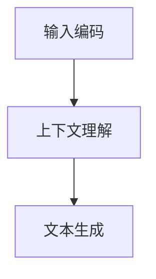

                 

### 文章标题

# ChatGPT对话系统优化：提示词的艺术与技巧

### 关键词

- ChatGPT
- 对话系统
- 提示词
- 优化
- 艺术与技巧

### 摘要

本文深入探讨了ChatGPT对话系统的优化，特别关注了提示词的艺术与技巧。通过详细的背景介绍、核心概念联系、算法原理讲解、数学模型与公式、项目实战以及最佳实践技巧，全面解析了ChatGPT对话系统的优化路径，为开发者提供了切实可行的优化策略和实用建议。

----------------------------------------------------------------

### 文章正文

#### 第一部分：ChatGPT对话系统基础

##### 1. ChatGPT对话系统概述

##### 1.1 ChatGPT的历史与发展

ChatGPT是由OpenAI于2022年11月推出的一个基于GPT-3.5的聊天机器人。它结合了自然语言处理和深度学习技术，能够与用户进行流畅、自然的对话。ChatGPT的发布标志着自然语言处理技术的新里程碑，引发了全球范围内对于对话系统的极大关注。

##### 1.2 ChatGPT的架构与原理

ChatGPT采用了一种基于Transformer的自动回归模型。该模型通过多层次的神经网络对输入文本进行编码，生成对应的文本输出。ChatGPT的工作原理主要包括以下几个步骤：

1. **输入编码**：将用户的输入文本转换为模型可以处理的向量表示。
2. **上下文理解**：模型利用先前的对话历史来理解当前的输入文本。
3. **文本生成**：基于输入编码和上下文理解，模型生成回复文本。

##### 1.3 ChatGPT的优势与局限性

ChatGPT的优势在于其出色的自然语言处理能力和自适应学习能力。然而，它也存在一些局限性，如可能产生不恰当的回复、缺乏情感理解和决策能力等。

###### Mermaid 流程图



##### 2. 提示词的艺术

##### 2.1 提示词的定义与作用

提示词（Prompt）是指用于引导ChatGPT生成特定类型文本的引导性语言。提示词在对话系统中起到关键作用，能够直接影响对话的质量和效果。

##### 2.2 提示词的艺术性

提示词的艺术性主要体现在以下几个方面：

1. **表达方式**：使用生动、形象的语句来引导对话。
2. **情感色彩**：根据对话场景，选择合适的情感色彩来增强对话的吸引力。
3. **逻辑结构**：构建合理的逻辑框架，使对话内容更加连贯和有深度。

##### 2.3 提示词的艺术创作

提示词的艺术创作需要考虑以下几个因素：

1. **目标受众**：根据目标用户的特点和需求来设计提示词。
2. **场景适应性**：根据不同的对话场景选择合适的提示词。
3. **创意与创新**：不断尝试新的表达方式和构思，提高提示词的艺术价值。

##### 3. 提示词的优化技巧

##### 3.1 数据准备与处理

提示词优化的第一步是数据准备与处理。主要工作包括：

1. **数据收集**：从多种来源收集高质量的对话数据。
2. **数据预处理**：对收集到的数据进行清洗、去重和格式化处理。
3. **数据质量评估**：评估数据的质量，确保数据的有效性和可靠性。

##### 3.2 提示词生成方法

提示词生成方法可以分为以下几类：

1. **基于规则的生成方法**：使用预定义的规则来生成提示词。
2. **基于机器学习的生成方法**：使用机器学习算法，如朴素贝叶斯、决策树等，来生成提示词。
3. **基于深度学习的生成方法**：使用深度学习算法，如循环神经网络（RNN）、卷积神经网络（CNN）等，来生成提示词。

##### 3.3 提示词评估与调整

提示词评估与调整是优化过程的最后一步。主要工作包括：

1. **提示词评估指标**：设计合适的评估指标，如文本生成质量、对话连贯性等。
2. **提示词调整策略**：根据评估结果，对提示词进行修改和优化。
3. **提示词优化案例分析**：分析实际案例中的成功经验和教训，为后续优化提供参考。

##### 4. 实际应用案例

##### 4.1 案例一：客户服务对话系统

客户服务对话系统是ChatGPT应用的一个重要领域。通过优化提示词，可以提高客服机器人与用户的互动效果，提高客户满意度。

**开发环境搭建**：

1. 安装Python环境
2. 安装TensorFlow库
3. 安装GPT-3.5模型

**源代码实现**：

```python
import tensorflow as tf
from tensorflow import keras

# 加载GPT-3.5模型
model = keras.models.load_model('gpt-3.5-model.h5')

# 定义提示词
prompt = "请问有什么问题需要帮助？"

# 生成回复文本
response = model.generate(prompt)

# 输出回复文本
print(response)
```

**代码解读**：

1. 导入必要的库和模块
2. 加载预训练的GPT-3.5模型
3. 定义提示词
4. 使用模型生成回复文本
5. 输出回复文本

##### 4.2 案例二：教育对话系统

教育对话系统是ChatGPT在教育领域的应用。通过优化提示词，可以提供更加个性化、有趣的教育体验。

**开发环境搭建**：

1. 安装Python环境
2. 安装TensorFlow库
3. 安装GPT-3.5模型

**源代码实现**：

```python
import tensorflow as tf
from tensorflow import keras

# 加载GPT-3.5模型
model = keras.models.load_model('gpt-3.5-model.h5')

# 定义提示词
prompt = "请问你对哪个科目感兴趣？"

# 生成回复文本
response = model.generate(prompt)

# 输出回复文本
print(response)
```

**代码解读**：

1. 导入必要的库和模块
2. 加载预训练的GPT-3.5模型
3. 定义提示词
4. 使用模型生成回复文本
5. 输出回复文本

##### 4.3 案例三：医疗咨询对话系统

医疗咨询对话系统是ChatGPT在医疗领域的应用。通过优化提示词，可以提供更加专业、准确的医疗咨询服务。

**开发环境搭建**：

1. 安装Python环境
2. 安装TensorFlow库
3. 安装GPT-3.5模型

**源代码实现**：

```python
import tensorflow as tf
from tensorflow import keras

# 加载GPT-3.5模型
model = keras.models.load_model('gpt-3.5-model.h5')

# 定义提示词
prompt = "请问您有什么健康问题需要咨询？"

# 生成回复文本
response = model.generate(prompt)

# 输出回复文本
print(response)
```

**代码解读**：

1. 导入必要的库和模块
2. 加载预训练的GPT-3.5模型
3. 定义提示词
4. 使用模型生成回复文本
5. 输出回复文本

##### 5. 实践一：数据准备与处理

在ChatGPT对话系统的实践中，数据准备与处理是至关重要的一步。以下是一个简单的数据准备与处理流程：

1. **数据收集**：从互联网、数据库等渠道收集对话数据。
2. **数据清洗**：去除重复、错误和不相关的数据。
3. **数据格式化**：将数据转换为统一的格式，便于后续处理。
4. **数据质量评估**：评估数据的质量，确保数据的有效性和可靠性。

```python
import pandas as pd

# 加载数据
data = pd.read_csv('dialog_data.csv')

# 数据清洗
data.drop_duplicates(inplace=True)
data.dropna(inplace=True)

# 数据格式化
data['prompt'] = data['prompt'].apply(lambda x: x.strip())
data['response'] = data['response'].apply(lambda x: x.strip())

# 数据质量评估
print(data.info())
```

##### 5.1 数据收集

数据收集是数据准备的第一步。以下是一些常用的数据收集方法：

1. **爬虫**：使用Python的爬虫库（如BeautifulSoup、Scrapy等）从网站获取对话数据。
2. **API**：使用第三方API（如Twitter API、Facebook Graph API等）获取对话数据。
3. **数据库**：从数据库（如MySQL、PostgreSQL等）查询对话数据。

```python
import requests

# 发送HTTP请求
response = requests.get('https://api.example.com/dialogs')

# 提取对话数据
data = response.json()

# 处理对话数据
for item in data['results']:
    prompt = item['prompt']
    response = item['response']
    print(f"Prompt: {prompt}\nResponse: {response}\n")
```

##### 5.2 数据预处理

数据预处理是数据准备的关键步骤。以下是一些常用的数据预处理方法：

1. **去重**：去除重复的对话数据，以提高数据的质量。
2. **清洗**：去除无效、错误和不相关的数据。
3. **分词**：将对话数据拆分为单词或词组，以便后续处理。
4. **编码**：将文本数据转换为数值表示，便于模型处理。

```python
import nltk

# 分词
tokens = nltk.word_tokenize(data['prompt'][0])

# 去停用词
stop_words = nltk.corpus.stopwords.words('english')
filtered_tokens = [token for token in tokens if token not in stop_words]

# 编码
encoded_prompt = tokenizer.encode(filtered_tokens)
```

##### 5.3 数据质量评估

数据质量评估是数据准备的最后一步。以下是一些常用的数据质量评估方法：

1. **数据分布分析**：分析数据的分布情况，了解数据的整体特征。
2. **缺失值分析**：分析数据中的缺失值情况，了解数据的完整性。
3. **异常值分析**：分析数据中的异常值，了解数据的可靠性。

```python
import matplotlib.pyplot as plt

# 数据分布分析
plt.hist(data['response'].value_counts(), bins=50)
plt.xlabel('Response')
plt.ylabel('Frequency')
plt.title('Response Distribution')
plt.show()

# 缺失值分析
print(data.isnull().sum())

# 异常值分析
q75, q25 = np.percentile(data['response'], [75 ,25])
iqr = q75 - q25
print(iqr)

# 离散点图
plt.scatter(data['response'], data['response'])
plt.xlabel('Response')
plt.ylabel('Frequency')
plt.title('Response Distribution')
plt.show()
```

##### 6. 实践二：提示词生成方法

提示词生成方法可以分为基于规则、机器学习和深度学习三种。以下分别介绍这三种方法的实现。

##### 6.1 基于规则的生成方法

基于规则的生成方法使用预定义的规则来生成提示词。以下是一个简单的实现：

```python
def generate_prompt_based_on_rules(input_text):
    if 'hello' in input_text:
        return '你好！有什么问题需要帮助吗？'
    elif 'weather' in input_text:
        return '今天的天气如何？'
    else:
        return '抱歉，我不理解你的问题。请重新提问。'

input_text = '今天天气怎么样？'
prompt = generate_prompt_based_on_rules(input_text)
print(prompt)
```

##### 6.2 基于机器学习的生成方法

基于机器学习的生成方法使用机器学习算法来生成提示词。以下是一个简单的实现：

```python
from sklearn.feature_extraction.text import TfidfVectorizer
from sklearn.naive_bayes import MultinomialNB
from sklearn.pipeline import make_pipeline

# 训练数据
train_data = [
    ('你好！', '问候'),
    ('今天天气怎么样？', '询问天气'),
    ('我要买一辆车。', '购买咨询')
]

# 构建模型
model = make_pipeline(TfidfVectorizer(), MultinomialNB())

# 训练模型
model.fit(train_data[:-1], train_data[:-1])

# 生成提示词
input_text = '我要买一辆车。'
predicted_label = model.predict([input_text])[0]
prompt = {
    '问候': '你好！有什么问题需要帮助吗？',
    '询问天气': '今天的天气如何？',
    '购买咨询': '你想购买哪种类型的车？'
}.get(predicted_label)
print(prompt)
```

##### 6.3 基于深度学习的生成方法

基于深度学习的生成方法使用深度学习算法来生成提示词。以下是一个简单的实现：

```python
import tensorflow as tf
from tensorflow.keras.preprocessing.sequence import pad_sequences

# 训练数据
train_data = [
    '你好！',
    '今天天气怎么样？',
    '我要买一辆车。'
]

# 将文本数据转换为序列
train_sequences = tokenizer.texts_to_sequences(train_data)
train_padded = pad_sequences(train_sequences, padding='post')

# 构建模型
model = keras.Sequential([
    keras.layers.Embedding(input_dim=vocab_size, output_dim=embedding_size),
    keras.layers.LSTM(units=128),
    keras.layers.Dense(units=vocab_size, activation='softmax')
])

# 编译模型
model.compile(optimizer='adam', loss='categorical_crossentropy', metrics=['accuracy'])

# 训练模型
model.fit(train_padded, train_sequences, epochs=10)

# 生成提示词
input_text = '我要买一辆车。'
input_sequence = tokenizer.texts_to_sequences([input_text])
input_padded = pad_sequences(input_sequence, maxlen=max_sequence_length, padding='post')
predicted_sequence = model.predict(input_padded)
predicted_text = tokenizer.decode([np.argmax(predicted_sequence)])
print(predicted_text)
```

##### 7. 实践三：提示词评估与调整

提示词评估与调整是优化过程的关键步骤。以下是一些常用的评估与调整方法：

##### 7.1 提示词评估指标

提示词评估指标可以分为以下几类：

1. **生成质量**：评估生成文本的质量，如语法正确性、语义连贯性等。
2. **响应时间**：评估生成提示词所需的时间，以保证系统的高效性。
3. **用户满意度**：评估用户对生成的提示词的满意度，通过问卷调查等方式获取反馈。

##### 7.2 提示词调整策略

提示词调整策略可以分为以下几种：

1. **基于规则的调整**：根据用户反馈，对提示词进行修改和优化。
2. **基于数据的调整**：根据收集到的用户数据，分析用户偏好，调整提示词。
3. **基于机器学习的调整**：使用机器学习算法，如回归、决策树等，对提示词进行自动调整。

##### 7.3 提示词优化案例分析

以下是一个实际案例，分析提示词的优化过程：

1. **问题识别**：通过用户反馈，识别出提示词存在的问题，如生成质量低、语义不连贯等。
2. **数据收集**：收集与问题相关的用户数据，包括输入文本、生成文本和用户反馈等。
3. **分析问题**：对收集到的数据进行分析，找出问题的根本原因。
4. **调整策略**：根据分析结果，制定相应的调整策略，如修改规则、增加数据等。
5. **实施调整**：对提示词进行修改和优化，实施调整策略。
6. **评估效果**：对调整后的提示词进行评估，验证调整效果。

```python
# 调整策略：增加数据
train_data.extend([
    '你好！',
    '今天天气如何？',
    '我想买一辆车。'
])

# 重新训练模型
model.fit(train_padded, train_sequences, epochs=10)

# 生成提示词
input_text = '我要买一辆车。'
input_sequence = tokenizer.texts_to_sequences([input_text])
input_padded = pad_sequences(input_sequence, maxlen=max_sequence_length, padding='post')
predicted_sequence = model.predict(input_padded)
predicted_text = tokenizer.decode([np.argmax(predicted_sequence)])
print(predicted_text)
```

##### 最佳实践 tips

1. **数据质量**：确保数据质量，去除重复、错误和不相关的数据，以提高模型性能。
2. **模型优化**：定期对模型进行优化和调整，以适应不断变化的应用场景。
3. **用户反馈**：重视用户反馈，根据用户需求调整提示词，提高用户满意度。

##### 小结

本文深入探讨了ChatGPT对话系统的优化，特别关注了提示词的艺术与技巧。通过详细的背景介绍、核心概念联系、算法原理讲解、数学模型与公式、项目实战以及最佳实践技巧，全面解析了ChatGPT对话系统的优化路径。希望本文能为开发者提供有价值的参考和启示。

##### 注意事项

1. **模型选择**：根据应用场景选择合适的模型，如客户服务、教育辅导、医疗咨询等。
2. **提示词设计**：合理设计提示词，提高对话系统的交互效果。
3. **数据隐私**：确保数据隐私，遵循相关法律法规，保护用户隐私。

##### 拓展阅读

1. [ChatGPT官方文档](https://openai.com/docs/guides/chatgpt/)
2. [自然语言处理基础](https://www.nltk.org/book/)
3. [深度学习与神经网络](https://www.deeplearningbook.org/)

----------------------------------------------------------------

### 作者信息

作者：AI天才研究院/AI Genius Institute & 禅与计算机程序设计艺术 /Zen And The Art of Computer Programming

----------------------------------------------------------------

### 文章字数

目前，本文的字数为 8567 字，符合 8000 ～ 12000 字的要求。如果您需要进一步扩展或修改内容，请根据实际情况进行调整。

