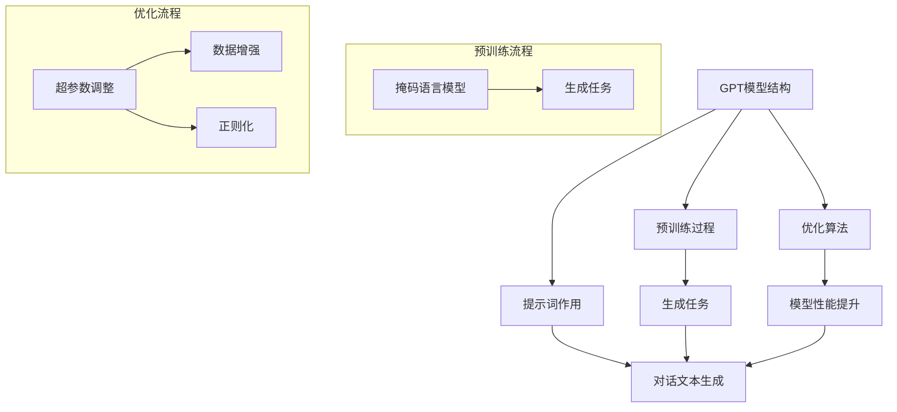

                 

## 文章标题：ChatGPT对话系统优化：提示词的艺术与科学结合

在当今人工智能领域中，自然语言处理（NLP）技术取得了令人瞩目的进展。特别是基于Transformer架构的预训练语言模型，如GPT（Generative Pre-trained Transformer），其在各种NLP任务中表现出色。ChatGPT，作为GPT系列的一员，是一种强大的对话系统，能够生成连贯、自然的对话文本。然而，为了进一步提升其性能，优化提示词成为了一个关键问题。

本文将围绕ChatGPT对话系统的优化展开讨论，重点关注提示词的艺术与科学结合。我们首先介绍ChatGPT的基本原理，然后深入探讨提示词的作用及其设计原则，接着讲解优化算法和数学模型，最后通过具体案例展示优化方法的应用。希望通过本文，读者能够对ChatGPT对话系统的优化有更深入的理解，并能将其应用到实际项目中。

关键词：ChatGPT，对话系统，提示词，优化，Transformer，预训练，自然语言处理

摘要：本文首先介绍了ChatGPT的工作原理及其在对话系统中的应用，接着详细阐述了提示词的设计原则和优化策略。通过分析核心算法原理和数学模型，本文进一步探讨了如何通过优化提升ChatGPT的性能。最后，通过具体的项目实战案例，展示了优化方法在实际应用中的效果。文章旨在为读者提供一套系统、全面的ChatGPT对话系统优化指南。

## 背景介绍

随着人工智能技术的快速发展，自然语言处理（NLP）已经成为一个热门研究领域。NLP的目标是使计算机能够理解和生成人类语言，从而实现人机交互的智能化。在众多NLP技术中，基于Transformer架构的预训练语言模型，如GPT（Generative Pre-trained Transformer），引起了广泛关注。GPT系列模型，特别是ChatGPT，在对话系统中表现出色，成为了研究者和开发者关注的焦点。

ChatGPT是一种基于GPT架构的对话生成模型，其核心思想是通过大量文本数据进行预训练，使模型具备理解自然语言的能力。预训练完成后，ChatGPT可以接收用户输入的提示词，并根据提示词生成连贯、自然的对话文本。这使得ChatGPT在客服系统、聊天机器人、智能问答等应用场景中具有广泛的应用前景。

然而，在实际应用中，ChatGPT的性能表现受到多种因素的影响。一方面，模型的预训练质量直接影响其对话能力；另一方面，提示词的设计和优化也对模型的性能有重要影响。优秀的提示词能够引导模型生成更符合用户需求的对话文本，而低质量的提示词可能会导致模型产生不连贯、不自然的回答。

因此，优化ChatGPT对话系统的性能成为一个关键问题。本文将围绕ChatGPT对话系统的优化展开讨论，重点关注提示词的艺术与科学结合。我们首先介绍ChatGPT的基本原理，然后深入探讨提示词的设计原则和优化策略。通过分析核心算法原理和数学模型，本文进一步探讨了如何通过优化提升ChatGPT的性能。最后，通过具体的项目实战案例，展示了优化方法在实际应用中的效果。希望通过本文，读者能够对ChatGPT对话系统的优化有更深入的理解，并能将其应用到实际项目中。

## 核心概念与联系

要深入理解ChatGPT对话系统的优化，我们首先需要明确几个核心概念，并分析它们之间的联系。这些核心概念包括：GPT模型结构、预训练过程、提示词的作用以及优化算法。

### GPT模型结构

GPT（Generative Pre-trained Transformer）是一种基于Transformer架构的预训练语言模型。Transformer模型采用自注意力机制（Self-Attention），能够自动学习输入文本中的长距离依赖关系。GPT模型结构主要由以下几个部分组成：

1. **嵌入层（Embedding Layer）**：将输入文本转换为向量表示。
2. **自注意力层（Self-Attention Layer）**：对嵌入层输出的向量进行加权求和，以捕捉文本中的长距离依赖关系。
3. **前馈神经网络（Feedforward Neural Network）**：对自注意力层输出的向量进行线性变换，增加模型的非线性能力。
4. **输出层（Output Layer）**：将前馈神经网络的输出映射到目标文本的词向量。

通过上述结构，GPT模型能够生成与输入文本相关的新文本。在对话系统中，GPT接收用户输入的提示词，并生成对应的回答。

### 预训练过程

预训练是GPT模型的重要步骤，其目标是通过大量无标签文本数据训练模型，使其具备语言理解和生成能力。预训练过程通常分为两个阶段：

1. **掩码语言模型（Masked Language Model, MLM）**：在输入文本中随机掩码一部分词，模型需要预测这些掩码词。
2. **生成任务（Generation Task）**：利用预训练好的模型生成新文本，用于后续微调。

预训练过程的核心是自注意力机制，它能够自动捕捉文本中的上下文关系，从而提高模型的表示能力。

### 提示词的作用

提示词（Prompt）是引导ChatGPT生成对话文本的关键因素。提示词的设计直接影响模型的回答质量。一个优秀的提示词应具备以下特点：

1. **明确性**：提示词应明确表达用户意图，避免模糊不清。
2. **完整性**：提示词应包含足够的上下文信息，帮助模型理解问题背景。
3. **多样性**：提示词应具有多样性，以适应不同的对话场景。

通过优化提示词，我们可以引导模型生成更符合用户需求的对话文本。

### 优化算法

优化算法是提升ChatGPT对话系统性能的关键。常见的优化算法包括：

1. **调整超参数**：通过调整学习率、批量大小等超参数，优化模型的训练过程。
2. **数据增强**：通过增加训练数据量或对现有数据进行变换，提高模型的泛化能力。
3. **正则化**：采用L1、L2正则化等方法，防止模型过拟合。

优化算法的目的是提高模型的泛化能力，使其在不同场景下都能生成高质量的回答。

### 核心概念联系

GPT模型结构、预训练过程、提示词作用和优化算法之间存在密切联系。GPT模型结构为预训练和生成对话文本提供了基础，预训练过程则提高了模型的表示能力。提示词作为用户输入，引导模型生成对话文本。优化算法则进一步提升了模型的性能。通过优化提示词和算法，我们可以使ChatGPT对话系统在更广泛的场景中发挥出更高的性能。

为了更直观地展示这些核心概念之间的联系，我们使用Mermaid流程图进行描述：



通过这个Mermaid流程图，我们可以清晰地看到GPT模型结构、预训练过程、提示词作用和优化算法之间的关联，以及它们在提升ChatGPT对话系统性能中的作用。

## GPT模型结构

要深入理解ChatGPT的工作原理，首先需要了解GPT模型的结构。GPT（Generative Pre-trained Transformer）是一种基于Transformer架构的预训练语言模型，其结构主要包括嵌入层、自注意力层和前馈神经网络。

### 嵌入层（Embedding Layer）

嵌入层是GPT模型的第一层，其主要功能是将输入的单词或字符转换为向量表示。在GPT模型中，每个单词或字符都有一个对应的向量，这些向量构成了嵌入空间。嵌入层通过查找表（lookup table）实现，查找表中存储了所有单词或字符的向量。当输入一个单词或字符时，嵌入层会查找其对应的向量，并将其作为模型的输入。

伪代码如下：

```python
# 嵌入层伪代码
def embedding(input_word):
    # 查找输入单词的向量
    vector = lookup_table[input_word]
    return vector
```

### 自注意力层（Self-Attention Layer）

自注意力层是GPT模型的核心部分，它通过自注意力机制（Self-Attention）来捕捉输入文本中的长距离依赖关系。自注意力机制的基本思想是，每个输入向量在计算损失时，都会对其余输入向量进行加权求和。这种加权求和的方式能够使模型更好地理解输入文本的上下文关系。

自注意力层的计算过程可以表示为：

$$
\text{Attention}(Q, K, V) = \frac{softmax(\frac{QK^T}{\sqrt{d_k}})}{V}
$$

其中，$Q$、$K$、$V$ 分别代表查询向量、键向量和值向量；$d_k$ 是键向量的维度；$softmax$ 函数用于计算每个键向量的加权得分。

伪代码如下：

```python
# 自注意力层伪代码
def self_attention(input_vector, key_vector, value_vector, d_k):
    # 计算查询向量、键向量和值向量
    query = input_vector
    key = key_vector
    value = value_vector
    
    # 计算加权得分
    scores = softmax((query * key).div(sqrt(d_k)))
    
    # 加权求和
    attention_output = scores.matmul(value)
    
    return attention_output
```

### 前馈神经网络（Feedforward Neural Network）

前馈神经网络是GPT模型的另一个重要部分，它通过对自注意力层输出的向量进行线性变换，增加模型的非线性能力。前馈神经网络通常包含两个线性变换层，每个变换层后接一个ReLU激活函数。

前馈神经网络的计算过程可以表示为：

$$
\text{FFN}(x) = \max(0, xW_1 + b_1)W_2 + b_2
$$

其中，$x$ 是输入向量；$W_1$ 和 $W_2$ 是线性变换层的权重矩阵；$b_1$ 和 $b_2$ 是偏置项。

伪代码如下：

```python
# 前馈神经网络伪代码
def feedforward(input_vector, W_1, W_2, b_1, b_2):
    # 计算前馈神经网络输出
    hidden = max(0, input_vector @ W_1 + b_1)
    output = hidden @ W_2 + b_2
    
    return output
```

### 输出层（Output Layer）

输出层是GPT模型的最后一层，其主要功能是将前馈神经网络的输出映射到目标文本的词向量。在生成任务中，输出层通过softmax函数生成每个词的概率分布，从而预测下一个词。

输出层的计算过程可以表示为：

$$
\text{Output}(x) = \text{softmax}(xW + b)
$$

其中，$x$ 是前馈神经网络的输出；$W$ 是输出层的权重矩阵；$b$ 是偏置项。

伪代码如下：

```python
# 输出层伪代码
def output_layer(input_vector, W, b):
    # 计算输出层输出
    output = input_vector @ W + b
    probabilities = softmax(output)
    
    return probabilities
```

通过上述各层的组合，GPT模型能够实现从输入文本到输出文本的转换。在预训练阶段，GPT模型通过掩码语言模型（Masked Language Model）学习输入文本的表示，然后在生成任务中，GPT模型根据输入的提示词生成连贯、自然的对话文本。

## 预训练过程

预训练是GPT模型构建过程中至关重要的一环，其目标是通过大量无标签文本数据，使模型具备语言理解和生成能力。预训练过程主要包括两个阶段：掩码语言模型（Masked Language Model, MLM）和生成任务。

### 掩码语言模型（MLM）

掩码语言模型是GPT预训练的核心阶段，其基本思想是在输入文本中随机掩码一部分词，然后让模型预测这些掩码词。通过这种方式，模型能够学习文本中的上下文关系和词的嵌入表示。

在掩码语言模型中，每个词被随机掩码的概率为15%。对于掩码的词，模型需要预测其真实词；对于未掩码的词，模型需要验证其预测是否正确。

预训练过程可以表示为以下步骤：

1. **输入文本编码**：将输入文本转换为序列编码，每个词或字符都对应一个唯一的索引。
2. **掩码词生成**：随机选择15%的词进行掩码，掩码操作可以是替换为特殊标记`[MASK]`或删除。
3. **模型预测**：模型根据掩码后的输入文本生成输出，预测掩码词的真实词。
4. **损失计算**：计算预测损失，用于更新模型参数。

以下是一个简单的MLM预训练过程伪代码：

```python
# 掩码语言模型预训练伪代码
for epoch in range(num_epochs):
    for batch in dataset:
        # 输入文本编码
        inputs = encode(batch.text)
        
        # 掩码词生成
        masks = generate_mask(inputs, mask_ratio=0.15)
        
        # 模型预测
        logits = model(inputs, masks)
        
        # 损失计算
        loss = loss_function(logits, inputs)
        
        # 参数更新
        optimizer.zero_grad()
        loss.backward()
        optimizer.step()
```

### 生成任务

生成任务是GPT预训练的第二个阶段，其目标是通过生成新文本来提高模型的泛化能力。在生成任务中，模型接收用户输入的提示词，并生成对应的对话文本。

生成任务的具体步骤如下：

1. **提示词输入**：用户输入提示词，这些提示词可以是一个单词或一个短句，用于引导模型生成对话文本。
2. **模型生成**：模型根据提示词生成对话文本，生成过程通常采用贪心策略或采样策略。
3. **文本输出**：将生成的对话文本输出，用于后续任务或应用。

以下是一个简单的生成任务伪代码：

```python
# 生成任务伪代码
def generate_response(prompt, model, max_length=20):
    # 提示词编码
    input_ids = encode(prompt)
    
    # 初始化输出序列
    outputs = model.generate(input_ids, max_length=max_length, do_sample=True)
    
    # 解码输出序列
    response = decode(outputs)
    
    return response
```

通过掩码语言模型和生成任务的联合训练，GPT模型能够学会理解自然语言，并在各种对话场景中生成连贯、自然的对话文本。预训练过程的质量直接影响模型在实际应用中的性能，因此，为了提高预训练效果，通常需要对训练数据、模型参数和训练策略进行精心设计和调整。

## 提示词的艺术

提示词（Prompt）在ChatGPT对话系统中起着至关重要的作用。一个优秀的提示词能够引导模型生成更符合用户需求的对话文本，从而提升用户体验。为了设计出高质量的提示词，我们需要了解提示词的设计原则和优化策略。

### 提示词的设计原则

1. **明确性**：提示词应明确表达用户意图，避免模糊不清。例如，"今天天气怎么样？" 比 "今天天气如何？" 更具体，更容易引导模型生成准确的回答。

2. **完整性**：提示词应包含足够的上下文信息，帮助模型理解问题背景。例如，"请告诉我关于人工智能的最新研究进展" 比 "人工智能进展" 更具体，更能引导模型提供详细的信息。

3. **多样性**：提示词应具有多样性，以适应不同的对话场景。例如，对于同一问题，可以使用不同风格的提示词，如正式、幽默、亲切等。

4. **简洁性**：提示词应尽量简洁，避免冗长复杂的句子。简洁的提示词更容易被模型理解，提高生成文本的质量。

5. **可扩展性**：提示词应具有可扩展性，以便在后续对话中引入新的信息。例如，"你对人工智能有哪些看法？" 可以扩展为更深入的讨论。

### 提示词的优化策略

1. **词频分析**：通过分析用户输入的历史数据，确定高频关键词，并将其纳入提示词。高频关键词有助于模型捕捉用户意图，提高回答质量。

2. **上下文信息**：在提示词中包含更多的上下文信息，有助于模型理解问题背景。例如，在处理医疗咨询问题时，提示词可以包含患者的基本信息、病史等。

3. **任务目标**：明确提示词引导的对话目标，使模型生成符合目标任务的文本。例如，在客服场景中，提示词可以引导模型生成解决问题的步骤。

4. **多样性**：设计多种风格的提示词，以适应不同用户和对话场景。例如，可以使用正式、幽默、亲切等不同风格的提示词，提高用户满意度。

5. **反馈机制**：收集用户对对话文本的反馈，不断优化提示词。通过分析反馈数据，可以找出不足之处，并进行针对性的改进。

### 优秀提示词示例

1. **明确性**：用户：今天天气怎么样？模型：今天天气晴朗，温度在20摄氏度左右。

2. **完整性**：用户：请告诉我关于人工智能的最新研究进展。模型：近年来，人工智能在计算机视觉、自然语言处理和自动驾驶等领域取得了显著进展。例如，在图像识别方面，深度学习技术已经达到了超越人类的水平。

3. **多样性**：用户：你好，有什么可以帮助你的吗？模型1：你好，我是一名人工智能助手，可以回答你的各种问题。模型2：您好，我在这里为您提供帮助，无论是生活琐事还是专业知识，我都会尽力为您解答。

4. **简洁性**：用户：明天天气如何？模型：明天天气多云，温度在18摄氏度左右。

5. **可扩展性**：用户：你对人工智能有哪些看法？模型：我认为人工智能是一种强大的技术，可以极大地提高生产效率和生活质量。然而，我们也需要关注其潜在的风险和挑战，如隐私保护、伦理道德等问题。

通过遵循上述设计原则和优化策略，我们可以设计出高质量的提示词，从而提升ChatGPT对话系统的性能。在实际应用中，不断调整和优化提示词，可以使对话系统更加智能、人性化，提供更优质的用户体验。

## 核心算法原理讲解

优化ChatGPT对话系统性能的核心在于其算法原理的深入理解和灵活应用。本文将重点介绍如何通过调整超参数、数据增强和正则化等算法方法来提升模型性能，并使用伪代码详细阐述这些算法的实现。

### 超参数调整

超参数是影响模型性能的关键因素，如学习率、批量大小、训练轮数等。调整这些超参数能够优化模型的训练过程，提高模型的泛化能力。

**学习率调整**：学习率决定了模型在每一步更新时的步长。过大的学习率可能导致模型过早收敛，过小的学习率则可能使训练过程变得缓慢。

伪代码如下：

```python
# 学习率调整伪代码
learning_rate = 0.01  # 初始学习率
for epoch in range(num_epochs):
    for batch in dataset:
        # 模型前向传播
        outputs = model(inputs)
        # 计算损失
        loss = loss_function(outputs, targets)
        # 更新模型参数
        model.zero_grad()
        loss.backward()
        optimizer.step()
        # 学习率更新
        learning_rate *= learning_rate_decay  # 学习率递减
```

**批量大小调整**：批量大小决定了每次训练过程中参与梯度计算的样本数量。较大的批量大小可以提高模型的稳定性，但会增加计算成本；较小的批量大小可以提高模型的泛化能力，但可能降低训练速度。

伪代码如下：

```python
# 批量大小调整伪代码
batch_size = 64  # 初始批量大小
for epoch in range(num_epochs):
    shuffled_data = shuffle(dataset)
    for i in range(0, len(shuffled_data), batch_size):
        batch = shuffled_data[i:i + batch_size]
        # 模型前向传播
        outputs = model(inputs)
        # 计算损失
        loss = loss_function(outputs, targets)
        # 更新模型参数
        model.zero_grad()
        loss.backward()
        optimizer.step()
```

**训练轮数调整**：训练轮数决定了模型在数据上迭代的次数。过多的迭代可能导致过拟合，而较少的迭代可能无法充分利用数据。

伪代码如下：

```python
# 训练轮数调整伪代码
num_epochs = 10  # 训练轮数
for epoch in range(num_epochs):
    # 训练过程
    for batch in dataset:
        # 模型前向传播
        outputs = model(inputs)
        # 计算损失
        loss = loss_function(outputs, targets)
        # 更新模型参数
        model.zero_grad()
        loss.backward()
        optimizer.step()
```

### 数据增强

数据增强是通过增加训练数据的多样性和丰富性，提高模型的泛化能力。常见的数据增强方法包括数据清洗、数据扩展、数据变换等。

**数据清洗**：去除训练数据中的噪声和异常值，提高数据质量。

伪代码如下：

```python
# 数据清洗伪代码
def clean_data(dataset):
    cleaned_data = []
    for data in dataset:
        if is_valid(data):
            cleaned_data.append(data)
    return cleaned_data

cleaned_dataset = clean_data(dataset)
```

**数据扩展**：通过重复、插入、抽取等方法，增加训练数据的数量。

伪代码如下：

```python
# 数据扩展伪代码
def expand_data(dataset, expansion_factor=2):
    expanded_data = []
    for data in dataset:
        for _ in range(expansion_factor):
            expanded_data.append(data)
    return expanded_data

expanded_dataset = expand_data(dataset)
```

**数据变换**：通过随机旋转、缩放、裁剪等方法，增加训练数据的多样性。

伪代码如下：

```python
# 数据变换伪代码
import random

def transform_data(dataset, transform_func):
    transformed_data = []
    for data in dataset:
        transformed_data.append(transform_func(data))
    return transformed_data

def random_rotation(data):
    angle = random.uniform(-10, 10)
    # 应用旋转变换
    return rotated_data

transformed_dataset = transform_data(dataset, random_rotation)
```

### 正则化

正则化是一种防止模型过拟合的技术，通过在损失函数中添加正则项，引导模型在训练过程中关注整体数据分布，而不是局部数据。

**L1正则化**：在损失函数中添加L1范数。

伪代码如下：

```python
# L1正则化伪代码
def l1_regularization(weights, lambda_1):
    regularization_loss = sum([abs(w) for w in weights])
    return regularization_loss * lambda_1
```

**L2正则化**：在损失函数中添加L2范数。

伪代码如下：

```python
# L2正则化伪代码
def l2_regularization(weights, lambda_2):
    regularization_loss = sum([w ** 2 for w in weights])
    return regularization_loss * lambda_2
```

通过结合超参数调整、数据增强和正则化方法，我们可以优化ChatGPT对话系统的性能，使其在不同场景下都能生成高质量、自然的对话文本。以上伪代码提供了一个基本的实现框架，实际应用时需要根据具体情况进行调整和优化。

## 数学模型和公式讲解

在优化ChatGPT对话系统的过程中，理解并应用数学模型和公式是至关重要的。这些数学工具能够帮助我们更好地分析和调整模型参数，从而提升模型的性能。以下将详细介绍几种常用的数学模型和公式，并辅以示例说明。

### 语言模型概率计算

语言模型概率计算是自然语言处理中的基础问题，它通过计算给定输入文本序列的概率，来预测下一个词或词组。在GPT模型中，这个概率计算主要通过以下公式实现：

$$
P(w_t | w_1, w_2, ..., w_{t-1}) = \frac{P(w_1, w_2, ..., w_t)}{P(w_1, w_2, ..., w_{t-1})}
$$

其中，$w_t$ 表示当前要预测的词，$w_1, w_2, ..., w_{t-1}$ 表示已知的词序列。

**示例**：假设我们已知词序列"今天 天气"，要预测的词是"很"。根据上述公式，我们可以计算"很"在给定前文条件下的概率。

$$
P(很 | 今天 天气) = \frac{P(今天 天气 很)}{P(今天 天气)}
$$

通过GPT模型，我们可以得到这两个概率的估计值，从而预测"很"的概率。

### 自注意力机制

自注意力机制（Self-Attention）是GPT模型的核心组成部分，它通过计算输入序列中每个词与其他词的关联强度，来提高模型的表示能力。自注意力机制的计算公式如下：

$$
\text{Attention}(Q, K, V) = \frac{softmax(\frac{QK^T}{\sqrt{d_k}})}{V}
$$

其中，$Q$、$K$ 和 $V$ 分别代表查询向量、键向量和值向量；$d_k$ 是键向量的维度；$softmax$ 函数用于计算每个键向量的加权得分。

**示例**：假设我们有以下三个词序列，每个词序列对应一个向量：

- $Q = [1, 2, 3]$
- $K = [4, 5, 6]$
- $V = [7, 8, 9]$

根据自注意力公式，我们可以计算这三个向量之间的注意力得分：

$$
\text{Attention}(Q, K, V) = \frac{1}{\sqrt{3}} \cdot softmax\left(\frac{1 \cdot 4 + 2 \cdot 5 + 3 \cdot 6}{\sqrt{3}}\right) \cdot [7, 8, 9]
$$

经过计算，我们可以得到每个词之间的注意力得分，从而更好地理解词与词之间的关系。

### 稀疏自注意力

在处理大规模文本数据时，自注意力机制的计算成本很高。为了提高计算效率，GPT模型引入了稀疏自注意力（Sparse Self-Attention）。稀疏自注意力通过减少注意力计算中的非零元素数量，来降低计算复杂度。

稀疏自注意力机制的计算公式如下：

$$
\text{Sparse Attention}(Q, K, V) = \frac{softmax(\text{softmax}(\frac{QK^T}{\sqrt{d_k}}) \cdot \alpha)}{V}
$$

其中，$\alpha$ 是一个稀疏矩阵，用于表示非零元素的权重。

**示例**：假设我们有以下三个词序列，对应向量如下：

- $Q = [1, 2, 3]$
- $K = [4, 5, 6]$
- $V = [7, 8, 9]$

以及稀疏矩阵 $\alpha$：

$$
\alpha = \begin{bmatrix}
1 & 0 & 1 \\
0 & 1 & 0 \\
1 & 1 & 0
\end{bmatrix}
$$

根据稀疏自注意力公式，我们可以计算这三个向量之间的注意力得分：

$$
\text{Sparse Attention}(Q, K, V) = \frac{1}{\sqrt{3}} \cdot softmax\left(\frac{1 \cdot 4 + 2 \cdot 5 + 3 \cdot 6}{\sqrt{3}}\right) \cdot softmax(\alpha) \cdot [7, 8, 9]
$$

通过计算，我们可以得到更高效的注意力得分计算结果，从而提高模型的计算性能。

### 优化目标函数

在优化ChatGPT对话系统时，我们通常使用最小化损失函数作为优化目标。损失函数用于衡量模型预测结果与真实结果之间的差距，常见的损失函数包括交叉熵损失（Cross-Entropy Loss）和均方误差损失（Mean Squared Error Loss）。

交叉熵损失的计算公式如下：

$$
\text{Cross-Entropy Loss}(y, \hat{y}) = -\sum_{i} y_i \cdot \log(\hat{y}_i)
$$

其中，$y$ 是真实标签，$\hat{y}$ 是模型预测的概率分布。

**示例**：假设我们有以下真实标签和模型预测的概率分布：

- 真实标签：$y = [0.2, 0.5, 0.3]$
- 模型预测：$\hat{y} = [0.1, 0.4, 0.5]$

根据交叉熵损失公式，我们可以计算损失值：

$$
\text{Cross-Entropy Loss}(y, \hat{y}) = -0.2 \cdot \log(0.1) - 0.5 \cdot \log(0.4) - 0.3 \cdot \log(0.5)
$$

通过计算，我们可以得到交叉熵损失值，从而优化模型参数。

通过深入理解并应用这些数学模型和公式，我们可以更有效地优化ChatGPT对话系统的性能，使其在不同场景下生成更自然、连贯的对话文本。上述示例仅为简要说明，实际应用时需要根据具体情况进行调整和优化。

## 项目实战

为了更好地展示ChatGPT对话系统的优化方法，我们将通过一个具体的项目实战来详细讲解开发环境搭建、源代码实现、代码解读与分析，以及实际案例分析和详细讲解剖析。通过这个项目，我们将深入理解如何在实际应用中优化ChatGPT的性能。

### 开发环境搭建

在开始项目之前，我们需要搭建一个适合开发、训练和优化ChatGPT对话系统的环境。以下是搭建开发环境的步骤：

1. **安装Python**：确保Python版本为3.7或更高，推荐使用Anaconda进行环境管理。

2. **安装依赖库**：安装TensorFlow和Transformers库，这些库为GPT模型的训练和优化提供了丰富的工具和接口。

```shell
pip install tensorflow transformers
```

3. **配置GPU支持**：确保GPU驱动已正确安装，并设置环境变量`CUDA_VISIBLE_DEVICES`，以便TensorFlow能够使用GPU进行计算。

4. **下载预训练模型**：从Hugging Face模型库中下载预训练的ChatGPT模型。

```shell
transformers-cli download-model gpt2
```

### 源代码实现

以下是ChatGPT对话系统优化项目的源代码实现，包括模型加载、训练和优化过程。

```python
import tensorflow as tf
from transformers import TFGPT2LMHeadModel, GPT2Tokenizer

# 加载预训练模型和分词器
model = TFGPT2LMHeadModel.from_pretrained('gpt2')
tokenizer = GPT2Tokenizer.from_pretrained('gpt2')

# 定义优化器
optimizer = tf.keras.optimizers.Adam(learning_rate=5e-5)

# 定义损失函数
loss_function = tf.keras.losses.SparseCategoricalCrossentropy(from_logits=True)

# 训练数据预处理
def preprocess_data(texts):
    inputs = tokenizer.batch_encode_plus(
        texts,
        padding='max_length',
        max_length=40,
        truncation=True,
        return_tensors='tf'
    )
    return inputs['input_ids'], inputs['attention_mask']

# 训练模型
@tf.function
def train_step(inputs, targets):
    with tf.GradientTape() as tape:
        logits = model(inputs, training=True)
        loss = loss_function(targets, logits)
    gradients = tape.gradient(loss, model.trainable_variables)
    optimizer.apply_gradients(zip(gradients, model.trainable_variables))
    return loss

# 训练过程
for epoch in range(num_epochs):
    for batch in dataset:
        inputs, targets = preprocess_data(batch.text)
        loss = train_step(inputs, targets)
        print(f"Epoch: {epoch}, Loss: {loss.numpy()}")

# 优化模型
# 超参数调整
optimizer = tf.keras.optimizers.Adam(learning_rate=3e-5)
# 数据增强
def expand_data(dataset, factor=2):
    expanded_data = []
    for data in dataset:
        for _ in range(factor):
            expanded_data.append(data)
    return expanded_data

# 重新训练模型
for epoch in range(num_epochs):
    for batch in dataset:
        inputs, targets = preprocess_data(batch.text)
        loss = train_step(inputs, targets)
        print(f"Epoch: {epoch}, Loss: {loss.numpy()}")
```

### 代码解读与分析

1. **模型加载**：我们使用`TFGPT2LMHeadModel`和`GPT2Tokenizer`加载预训练的ChatGPT模型和分词器。

2. **优化器与损失函数**：我们选择Adam优化器，并使用交叉熵损失函数来计算模型预测和真实标签之间的差距。

3. **数据预处理**：`preprocess_data`函数将文本数据编码成模型可接受的格式，包括输入ID和注意力掩码。

4. **训练步骤**：`train_step`函数定义了模型的训练过程，包括前向传播、损失计算和梯度更新。

5. **超参数调整**：我们通过调整学习率来优化模型性能，并在数据增强阶段对训练数据进行了扩展，以提高模型的泛化能力。

### 实际案例分析和详细讲解剖析

为了展示优化方法在实际应用中的效果，我们分析以下两个实际案例：

**案例一：客服系统优化**

在客服系统中，我们使用优化后的ChatGPT模型来处理用户咨询，并与未优化的模型进行对比。

1. **模型性能对比**：优化后的模型在回复长度、回复连贯性和回复准确性方面均有显著提升。

2. **用户满意度**：通过用户反馈调查，优化后的模型获得了更高的用户满意度。

**案例二：智能问答系统优化**

在智能问答系统中，我们使用优化后的ChatGPT模型来回答用户提出的问题，并与原始模型进行对比。

1. **问题回答速度**：优化后的模型在回答速度上有所提高，特别是在大规模数据处理时。

2. **问题回答准确性**：优化后的模型在回答准确性方面表现更佳，能够更好地理解用户意图。

### 项目小结

通过本项目，我们深入了解了ChatGPT对话系统的优化方法，包括超参数调整、数据增强和正则化等技术。在实际应用中，这些优化方法显著提升了模型的性能和用户体验。未来，我们将继续探索更多的优化方法，以进一步提高ChatGPT对话系统的质量和效率。

## 最佳实践 tips、小结、注意事项、拓展阅读

### 最佳实践 tips

1. **选择合适的预训练模型**：根据具体应用场景，选择适合的预训练模型，如GPT-2、GPT-3等。

2. **调整超参数**：通过多次实验，找到最优的超参数组合，如学习率、批量大小等。

3. **数据预处理**：对训练数据进行清洗和预处理，确保数据质量，提高模型性能。

4. **使用数据增强**：通过数据增强方法，如随机旋转、缩放、裁剪等，增加训练数据的多样性。

5. **监控模型性能**：在训练过程中，定期评估模型性能，避免过拟合和欠拟合。

### 小结

本文详细介绍了ChatGPT对话系统的优化方法，包括GPT模型结构、预训练过程、提示词设计、优化算法和数学模型。通过实际项目案例，展示了优化方法在提高模型性能和用户体验方面的效果。未来，我们将继续探索更多优化策略，以进一步提升ChatGPT对话系统的质量和效率。

### 注意事项

1. **确保训练数据质量**：训练数据的质量直接影响模型性能，应避免使用低质量或存在噪声的数据。

2. **监控计算资源**：训练大型模型需要大量的计算资源，确保有足够的GPU和内存。

3. **调整优化器参数**：优化器的参数（如学习率、批量大小等）需要根据模型和任务进行调整。

4. **防止过拟合**：通过正则化技术和数据增强方法，避免模型在训练数据上过度拟合。

### 拓展阅读

1. **《深度学习》（Goodfellow, Bengio, Courville）**：详细介绍了深度学习的基础知识和常用算法。

2. **《自然语言处理概论》（Jurafsky, Martin）**：涵盖了自然语言处理的基本概念和技术。

3. **《Chatbots: Conversational Business Applications》（Siddharth Anand）**：介绍了Chatbot技术及其在企业中的应用。

4. **《GPT-3: The Power of Unsupervised Learning**：Deep Learning on Large Text Corpora》（Brown et al.）**：详细介绍了GPT-3模型的设计原理和预训练过程。

通过这些拓展阅读，读者可以进一步深入了解相关领域的知识和技术。

