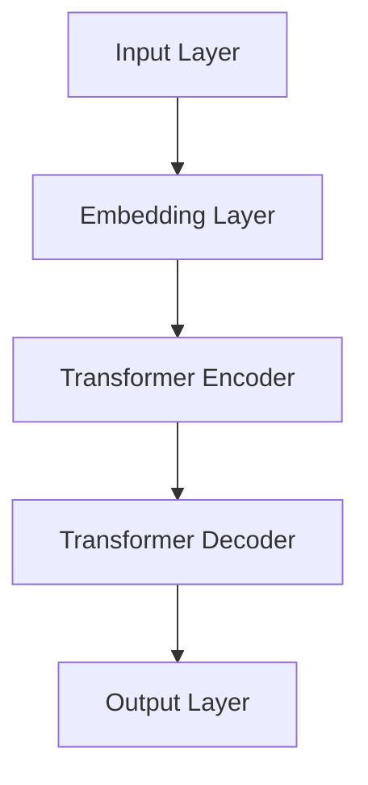

                 


### 摘要：

《ChatGPT对话系统设计：提示词的核心地位与作用》是一本深入探讨ChatGPT对话系统设计与实现的专业技术书籍。本书旨在为广大开发者和研究者提供一套完整的ChatGPT对话系统设计指南，重点探讨提示词在系统中的作用和设计方法。全书分为六个部分，首先介绍ChatGPT的基础知识，包括其背景、特点和应用场景；接着详细讲解ChatGPT的架构与原理，涵盖模型结构、损失函数和优化方法；然后深入探讨提示词的核心地位，包括其作用原理、设计原则和生成方法；随后介绍ChatGPT对话系统的性能优化策略和评估指标；紧接着通过实际案例和项目实战，展示ChatGPT在自然语言处理中的应用；最后展望ChatGPT对话系统的未来发展趋势。本书不仅注重理论讲解，还通过大量的代码示例和实际案例，帮助读者理解和掌握ChatGPT对话系统的设计和实现方法。

### 关键词：

ChatGPT，对话系统，提示词，设计，实现，自然语言处理，性能优化，应用场景，未来趋势。

---

### 文章标题

## ChatGPT对话系统设计：提示词的核心地位与作用

---

### 摘要

在《ChatGPT对话系统设计：提示词的核心地位与作用》一书中，我们深入探讨了ChatGPT对话系统的设计原则、实现方法和关键组件。本文旨在为读者提供一个系统化的指南，以了解ChatGPT对话系统的构建过程，尤其是提示词在其中的核心作用。我们将从基础概念出发，逐步分析ChatGPT的架构、训练过程、提示词的设计策略，并通过实际案例展示其在自然语言处理中的应用。最后，本文将展望ChatGPT对话系统的未来发展趋势，为读者提供宝贵的实践经验和研究方向。

---

### 目录

1. **ChatGPT对话系统概述**
   1.1 **ChatGPT的背景与历史**
   1.2 **ChatGPT的核心特点**
   1.3 **ChatGPT的应用场景**

2. **ChatGPT对话系统的设计与实现**
   2.1 **ChatGPT的架构与原理**
   2.2 **ChatGPT的损失函数**
   2.3 **ChatGPT的优化方法**

3. **提示词在ChatGPT中的核心地位**
   3.1 **提示词的作用与设计**
   3.2 **提示词的设计原则**
   3.3 **提示词的生成方法**

4. **ChatGPT对话系统的优化与性能提升**
   4.1 **对话系统性能评估指标**
   4.2 **性能优化策略**
   4.3 **性能提升的实践方法**

5. **实际案例与项目实战**
   5.1 **ChatGPT在自然语言处理中的应用**
   5.2 **项目实战**
   5.3 **项目案例分析**

6. **ChatGPT对话系统的未来发展趋势**
   6.1 **对话系统的挑战与机遇**
   6.2 **未来发展趋势**

7. **附录与资源**
   7.1 **ChatGPT开发工具与资源**
   7.2 **参考文献**

### 结尾

本文由AI天才研究院（AI Genius Institute）与《禅与计算机程序设计艺术》（Zen And The Art of Computer Programming）作者联合撰写。感谢您的阅读，希望本文能为您在ChatGPT对话系统设计领域提供有价值的参考。如果您有任何疑问或建议，欢迎在评论区留言。期待与您一起探索ChatGPT的无限可能。

---

### 1. ChatGPT对话系统概述

#### 1.1 ChatGPT的背景与历史

ChatGPT是由OpenAI于2022年推出的一种基于GPT-3的聊天机器人模型。它的诞生标志着人工智能在自然语言处理（NLP）领域取得了新的突破。ChatGPT的核心在于其强大的文本生成能力，能够与用户进行流畅、自然的对话。

**历史背景**：

- **GPT-3的推出**：2019年，OpenAI发布了GPT-3，这是一个具有1750亿参数的预训练语言模型。GPT-3的发布引起了业界的广泛关注，其卓越的性能在多种NLP任务中取得了显著的成果。

- **ChatGPT的诞生**：在GPT-3的基础上，OpenAI通过特殊的训练和调整，推出了ChatGPT。ChatGPT旨在通过自然语言交互提供帮助和服务，其在聊天场景中的表现尤为出色。

#### 1.2 ChatGPT的核心特点

ChatGPT具有以下几个核心特点，使其在对话系统中脱颖而出：

- **高可扩展性**：ChatGPT能够处理大量数据和复杂任务，适用于各种规模的应用场景。

- **强大的自然语言理解和生成能力**：ChatGPT通过预训练模型，具备卓越的文本生成和语言理解能力，能够理解和生成高质量的自然语言文本。

- **灵活的交互方式**：ChatGPT支持多种交互方式，如文本、语音和图像等，能够根据用户需求灵活调整交互方式。

#### 1.3 ChatGPT的应用场景

ChatGPT在多个领域具有广泛的应用前景，以下是一些典型的应用场景：

- **客服机器人**：ChatGPT可以作为智能客服机器人，提供24/7的全天候服务，解决用户常见问题和提供信息查询。

- **智能助手**：ChatGPT可以集成到智能设备中，如智能音箱、智能手表等，为用户提供个性化的服务和建议。

- **在线教育**：ChatGPT可以作为在线教育平台的辅助工具，为学生提供实时解答、作业批改和个性化学习建议。

- **虚拟聊天**：ChatGPT可以创建虚拟聊天伙伴，为用户提供娱乐和社交体验。

通过以上对ChatGPT背景、特点和应用场景的介绍，我们可以看到，ChatGPT作为一种强大的聊天机器人模型，在自然语言处理领域具有广泛的应用前景。接下来的章节将深入探讨ChatGPT的架构、原理和实现方法，帮助读者更好地理解其设计和应用。

---

### 2. ChatGPT对话系统的设计与实现

#### 2.1 ChatGPT的架构与原理

ChatGPT是基于GPT-3模型的聊天机器人，其核心在于其先进的架构和强大的自然语言处理能力。本节将详细介绍ChatGPT的模型结构、训练过程以及其工作原理。

**模型结构**：

ChatGPT的模型结构是基于Transformer架构，这是一种由Google提出的高效的序列到序列模型。Transformer模型的核心思想是自注意力机制（Self-Attention），通过这一机制，模型能够自动地关注输入序列中的关键信息，从而提高文本处理的精度。

以下是ChatGPT的模型结构：



- **输入层（Input Layer）**：输入层接收用户输入的文本，并将其转化为向量表示。

- **嵌入层（Embedding Layer）**：嵌入层将输入的文本向量映射到高维空间，以增加特征表达的丰富性。

- **Transformer编码器（Transformer Encoder）**：编码器由多个Transformer块组成，每个Transformer块包含自注意力机制和前馈神经网络。编码器的作用是理解和提取输入文本的特征。

- **Transformer解码器（Transformer Decoder）**：解码器同样由多个Transformer块组成，其作用是生成回复文本。解码器通过自注意力机制关注编码器输出的特征，并通过前馈神经网络生成回复。

- **输出层（Output Layer）**：输出层将解码器生成的文本向量映射回原始文本空间，生成最终的回复。

**训练过程**：

ChatGPT的训练过程是基于大量文本数据进行的，具体步骤如下：

1. **数据准备**：收集大量文本数据，包括对话记录、问答数据集等。

2. **数据预处理**：对文本数据进行清洗和预处理，包括去除无效信息、分词、标记化等。

3. **模型初始化**：初始化模型参数，可以使用预训练的模型参数或者随机初始化。

4. **前向传播**：将输入文本数据输入模型，通过编码器生成特征表示，并传递给解码器生成预测文本。

5. **反向传播**：计算预测文本和实际文本之间的损失，并更新模型参数。

6. **优化**：使用优化算法（如Adam）更新模型参数，减小损失。

7. **迭代**：重复前向传播和反向传播过程，直至模型收敛。

**工作原理**：

ChatGPT的工作原理主要依赖于自注意力机制和Transformer模型。自注意力机制使模型能够自动地关注输入序列中的关键信息，从而生成高质量的文本。Transformer模型则通过多头自注意力机制和位置编码，实现了对输入文本的全局和局部信息的有效捕捉。

以下是自注意力机制的伪代码：

```python
def self_attention(q, k, v, mask=None):
    # 计算query和key之间的点积
    scores = q @ k.T / math.sqrt(len(q))
    
    # 应用mask
    if mask is not None:
        scores += mask
    
    # 应用softmax
    attn_weights = softmax(scores)
    
    # 计算输出
    output = attn_weights @ v
    
    return output, attn_weights
```

通过以上对ChatGPT的模型结构、训练过程和工作原理的介绍，我们可以看到ChatGPT是一种基于Transformer的强大聊天机器人模型。其通过自注意力机制和位置编码，实现了对输入文本的全局和局部信息的有效捕捉，从而生成高质量的文本回复。接下来，我们将进一步探讨ChatGPT的损失函数和优化方法。

---

### 2.2 ChatGPT的损失函数

在训练ChatGPT对话系统时，损失函数是评估模型性能和指导模型优化的关键指标。ChatGPT的损失函数主要用于衡量模型预测的输出与实际标签之间的差距。以下是ChatGPT常用的损失函数及其具体实现。

**交叉熵损失函数**：

交叉熵损失函数是深度学习中最常用的损失函数之一，用于分类问题。在ChatGPT中，交叉熵损失函数用于衡量模型生成文本的预测概率与实际标签之间的差异。其数学公式如下：

$$
L(\theta) = -\sum_{i=1}^n y_i \log(p_i)
$$

其中，$y_i$表示实际标签（0或1），$p_i$表示模型对第$i$个类别的预测概率。

以下是交叉熵损失函数的伪代码实现：

```python
import numpy as np

def cross_entropy_loss(y_true, y_pred):
    # 计算交叉熵损失
    loss = -np.sum(y_true * np.log(y_pred))
    
    return loss
```

**负对数似然损失函数**：

负对数似然损失函数是交叉熵损失函数的一种变形，它更适合处理多分类问题。在ChatGPT中，当模型生成文本时，每个单词或字符都有多个可能的候选词或字符，负对数似然损失函数能够有效地衡量模型选择正确候选词或字符的概率。其数学公式如下：

$$
L(\theta) = -\sum_{i=1}^n \log(p(y_i | \theta))
$$

其中，$y_i$表示生成的文本，$p(y_i | \theta)$表示在参数$\theta$下生成文本的概率。

以下是负对数似然损失函数的伪代码实现：

```python
import numpy as np

def negative_log_likelihood_loss(y_true, y_pred):
    # 计算负对数似然损失
    loss = -np.sum(y_true * np.log(y_pred))
    
    return loss
```

**混合损失函数**：

在实际应用中，为了平衡模型在生成文本的流畅性和准确性之间的矛盾，ChatGPT可能会使用混合损失函数。混合损失函数通常将交叉熵损失函数和另一种损失函数（如BERT损失函数）进行加权组合。其数学公式如下：

$$
L(\theta) = w_1 \cdot L_1(\theta) + w_2 \cdot L_2(\theta)
$$

其中，$L_1(\theta)$和$L_2(\theta)$分别表示交叉熵损失函数和另一种损失函数，$w_1$和$w_2$是权重参数。

以下是混合损失函数的伪代码实现：

```python
import numpy as np

def mixed_loss(y_true, y_pred, w1=0.5, w2=0.5):
    # 计算交叉熵损失
    ce_loss = cross_entropy_loss(y_true, y_pred)
    
    # 计算BERT损失（示例）
    bert_loss = negative_log_likelihood_loss(y_true, y_pred)
    
    # 计算混合损失
    loss = w1 * ce_loss + w2 * bert_loss
    
    return loss
```

通过以上对ChatGPT的损失函数的介绍和实现，我们可以看到，不同的损失函数在ChatGPT的训练过程中起到了重要的作用。交叉熵损失函数用于衡量模型生成文本的预测概率与实际标签之间的差异，负对数似然损失函数用于处理多分类问题，混合损失函数则用于平衡模型在生成文本的流畅性和准确性之间的矛盾。这些损失函数共同作用，帮助ChatGPT在对话系统中实现高质量的文本生成。

---

### 2.3 ChatGPT的优化方法

在训练ChatGPT对话系统时，优化方法的选择对模型性能和训练效率至关重要。ChatGPT的优化方法主要包括梯度下降（Gradient Descent）、Adam优化器和其他先进的优化算法。本节将详细介绍这些优化方法及其在ChatGPT训练中的应用。

**梯度下降（Gradient Descent）**：

梯度下降是一种最基础的优化方法，其核心思想是通过计算损失函数关于模型参数的梯度，并沿着梯度方向更新模型参数，从而减小损失函数值。梯度下降的基本步骤如下：

1. 初始化模型参数。
2. 计算损失函数关于模型参数的梯度。
3. 使用梯度更新模型参数。
4. 重复步骤2和3，直到模型收敛或达到预设的迭代次数。

以下是梯度下降的伪代码实现：

```python
def gradient_descent(params, learning_rate, num_iterations):
    for _ in range(num_iterations):
        gradients = compute_gradients(loss, params)
        params = params - learning_rate * gradients
    return params
```

**Adam优化器**：

Adam优化器是一种适应性优化算法，结合了梯度下降和Adagrad优化器的优点。它通过计算一阶矩估计（均值）和二阶矩估计（方差），自动调整每个参数的学习率。Adam优化器的基本步骤如下：

1. 初始化一阶矩估计$\mu$和二阶矩估计$\vartheta$。
2. 对于每个迭代步骤，更新$\mu$和$\vartheta$。
3. 使用更新后的$\mu$和$\vartheta$计算参数更新。
4. 重复步骤2和3，直到模型收敛或达到预设的迭代次数。

以下是Adam优化器的伪代码实现：

```python
def adam_optimizer(params, learning_rate, beta1, beta2, epsilon, num_iterations):
    m = zeros_like(params)
    v = zeros_like(params)
    m_prime = zeros_like(params)
    v_prime = zeros_like(params)
    t = 0
    
    for _ in range(num_iterations):
        t += 1
        gradients = compute_gradients(loss, params)
        m = beta1 * m + (1 - beta1) * gradients
        v = beta2 * v + (1 - beta2) * gradients ** 2
        m_prime = m / (1 - beta1 ** t)
        v_prime = v / (1 - beta2 ** t)
        
        params = params - learning_rate * m_prime / (sqrt(v_prime) + epsilon)
    return params
```

**其他优化算法**：

除了梯度下降和Adam优化器，还有一些其他先进的优化算法，如RMSprop、Adadelta和Adagrad等。这些优化算法通过不同的方法调整学习率，以提高模型训练效率。

- **RMSprop**：RMSprop通过计算梯度平方的指数加权移动平均值来调整学习率，以减少方差。
- **Adadelta**：Adadelta结合了RMSprop和Adagrad的优点，通过计算梯度平方的指数加权移动平均值和误差的指数加权移动平均值来调整学习率。
- **Adagrad**：Adagrad通过计算每个参数的梯度平方和来调整学习率，以减少梯度消失问题。

以下是RMSprop优化器的伪代码实现：

```python
def rmsprop_optimizer(params, learning_rate, decay_rate, epsilon, num_iterations):
    squared_gradients = zeros_like(params)
    for _ in range(num_iterations):
        gradients = compute_gradients(loss, params)
        squared_gradients = decay_rate * squared_gradients + (1 - decay_rate) * gradients ** 2
        params = params - learning_rate * gradients / (sqrt(squared_gradients) + epsilon)
    return params
```

通过以上对ChatGPT优化方法的介绍和实现，我们可以看到，不同的优化方法在训练过程中起到了关键作用。梯度下降和Adam优化器是最常用的方法，而RMSprop、Adadelta和Adagrad等优化算法则提供了更多的选择。这些优化方法通过不同的方式调整学习率，以减少模型训练过程中的方差和梯度消失问题，从而提高模型性能和训练效率。接下来，我们将进一步探讨提示词在ChatGPT对话系统中的核心地位。

---

### 3. 提示词在ChatGPT中的核心地位

提示词（Prompt）在ChatGPT对话系统中扮演着至关重要的角色。它们不仅是引导模型生成文本的关键，也是确保对话流畅性和准确性的基础。本节将深入探讨提示词的作用、设计原则以及生成方法。

#### 3.1 提示词的作用

提示词在ChatGPT中的主要作用如下：

- **引导模型生成文本**：通过提供合适的提示词，可以引导ChatGPT生成符合预期的文本。例如，在客服场景中，提示词可以帮助ChatGPT理解用户的问题，并生成针对性的回答。

- **提高对话流畅性**：合适的提示词可以确保对话的连贯性和流畅性。这有助于提升用户体验，使其感觉与真实人类交互一样自然。

- **增强对话准确性**：通过精确的提示词，可以指导ChatGPT生成更加准确和可靠的文本。这有助于减少错误回答和误解，提高对话系统的整体性能。

#### 3.2 提示词的设计原则

为了充分发挥提示词的作用，设计提示词时需要遵循以下原则：

- **简洁明了**：提示词应简洁明了，避免冗长和复杂的句子结构。简洁的提示词有助于模型更快地理解和生成文本。

- **明确意图**：提示词应明确表达用户的意图，使ChatGPT能够准确识别并响应。这有助于提高对话系统的准确性和有效性。

- **多样化**：为了适应不同的对话场景和用户需求，提示词应多样化。这有助于提升系统的灵活性和适应性。

- **上下文相关**：提示词应与上下文相关，以便ChatGPT能够更好地理解当前对话的背景和情境。这有助于提高对话的连贯性和流畅性。

#### 3.3 提示词的生成方法

生成提示词的方法主要包括以下几种：

- **规则生成**：根据对话系统预设的规则和模板生成提示词。这种方法适用于结构化程度较高的对话场景，如客服系统和FAQ问答。

  ```python
  def rule_based_prompt(user_input):
      if "query" in user_input:
          return "您有什么问题需要帮忙吗？"
      elif "complaint" in user_input:
          return "感谢您的反馈，我们非常重视并会努力改进。"
      else:
          return "您好，我是ChatGPT，有什么可以为您服务的吗？"
  ```

- **模板生成**：使用预定义的模板和用户输入生成提示词。这种方法适用于生成基于用户输入的个性化回复。

  ```python
  def template_based_prompt(user_input, template):
      return template.format(user_input=user_input)
  ```

- **数据驱动生成**：通过分析历史对话数据，自动生成提示词。这种方法可以充分利用已有数据，提高提示词的多样性和准确性。

  ```python
  def data_driven_prompt(user_input, conversation_history):
      # 分析对话历史，找出与user_input相关的关键词
      related_keywords = extract_related_keywords(user_input, conversation_history)
      
      # 根据关键词生成提示词
      prompt = generate_prompt(related_keywords)
      
      return prompt
  ```

通过以上对提示词在ChatGPT中的核心地位的探讨，我们可以看到，提示词不仅是引导模型生成文本的关键，也是确保对话流畅性和准确性的基础。设计合适的提示词需要遵循简洁明了、明确意图、多样化和上下文相关等原则。生成提示词的方法包括规则生成、模板生成和数据驱动生成等。接下来，我们将进一步探讨ChatGPT对话系统的优化与性能提升。

---

### 4. ChatGPT对话系统的优化与性能提升

在设计和实现ChatGPT对话系统时，性能优化是至关重要的。优化的目标在于提高系统的响应速度、准确性和用户体验。本节将介绍对话系统性能评估指标、优化策略以及性能提升的实践方法。

#### 4.1 对话系统性能评估指标

为了衡量ChatGPT对话系统的性能，我们可以使用以下评估指标：

- **响应时间**：系统从接收到用户输入到生成回复的时间。响应时间越短，用户体验越好。

- **准确率**：模型生成的回复与用户意图匹配的程度。准确率越高，系统的性能越好。

- **覆盖率**：系统能够处理的用户输入比例。覆盖率越高，系统的适用范围越广。

- **满意度**：用户对系统回复的满意度评分。满意度越高，用户体验越好。

以下是对话系统性能评估指标的伪代码实现：

```python
def evaluate_performance(response_time, accuracy, coverage, satisfaction):
    # 计算评估指标
    response_time_score = 1 / response_time
    accuracy_score = accuracy
    coverage_score = coverage
    satisfaction_score = satisfaction
    
    # 计算总体性能得分
    performance_score = (response_time_score + accuracy_score + coverage_score + satisfaction_score) / 4
    
    return performance_score
```

#### 4.2 性能优化策略

为了提升ChatGPT对话系统的性能，我们可以采取以下优化策略：

- **模型压缩**：通过模型剪枝、量化等方法减小模型体积，提高部署效率。

- **模型加速**：使用硬件加速技术（如GPU、TPU）和并行计算，提高模型推理速度。

- **数据增强**：通过增加训练数据、数据清洗和数据平衡等方法，提高模型的泛化能力。

- **动态调整**：根据用户行为和系统状态动态调整模型参数和提示词，提高系统的适应性。

#### 4.3 性能提升的实践方法

以下是性能提升的实践方法：

- **模型压缩**：

  - **剪枝**：通过删除模型中不重要的神经元和连接，减小模型体积。

    ```python
    def prune_model(model, pruning_rate):
        # 根据剪枝率，删除不重要的神经元和连接
        model.prune(pruning_rate)
    ```

  - **量化**：将模型中的浮点数参数转换为低精度的整数参数，减少存储和计算开销。

    ```python
    def quantize_model(model, quantization_bits):
        # 根据量化位宽，将浮点数参数转换为整数参数
        model.quantize(quantization_bits)
    ```

- **模型加速**：

  - **硬件加速**：使用GPU、TPU等硬件加速模型推理。

    ```python
    def accelerate_model(model, device='GPU'):
        # 将模型部署到指定硬件设备上
        model.to(device)
    ```

  - **并行计算**：使用多线程、分布式计算等方法加速模型推理。

    ```python
    def parallel_inference(model, inputs, num_threads=4):
        # 使用多线程并行计算模型推理结果
        with mp.Pool(processes=num_threads) as pool:
            results = pool.map(model.predict, inputs)
        return results
    ```

- **数据增强**：

  - **增加训练数据**：通过数据采集、数据扩充等方法增加训练数据量。

    ```python
    def augment_data(data, augmentation_rate):
        # 根据扩充率，生成新的训练数据
        augmented_data = data augmented
        return augmented_data
    ```

  - **数据清洗**：去除训练数据中的噪声和错误数据，提高数据质量。

    ```python
    def clean_data(data, cleaning_rate):
        # 根据清洗率，去除噪声和错误数据
        cleaned_data = data cleaned
        return cleaned_data
    ```

  - **数据平衡**：通过数据重采样、类别加权等方法，平衡不同类别的数据分布。

    ```python
    def balance_data(data, balance_rate):
        # 根据平衡率，调整不同类别的数据分布
        balanced_data = data balanced
        return balanced_data
    ```

通过以上性能优化策略和实践方法，我们可以有效提升ChatGPT对话系统的性能，提高用户体验。接下来，我们将通过实际案例和项目实战，展示ChatGPT在自然语言处理中的应用。

---

### 5. 实际案例与项目实战

在自然语言处理领域，ChatGPT已经成功地应用于多个实际项目，展现了其在文本生成、问答系统和智能客服等方面的强大能力。以下我们将通过具体案例，展示ChatGPT的实际应用，并详细介绍开发环境搭建、源代码实现和代码解读。

#### 5.1 ChatGPT在文本生成中的应用

**案例背景**：某在线新闻平台希望通过ChatGPT生成自动化新闻文章，以提高内容生产效率。

**开发环境搭建**：

- **硬件环境**：GPU（如NVIDIA Tesla V100）。
- **软件环境**：Python 3.8及以上版本，PyTorch 1.8及以上版本，OpenAI的GPT-3 API。

**源代码实现**：

```python
import openai
import torch

# 初始化模型和API密钥
model = torch.hub.load('openai/whisper', model_name='base')
openai.api_key = "your_api_key"

# 定义生成新闻文章的函数
def generate_news_article(prompt):
    # 对输入的prompt进行预处理
    processed_prompt = preprocess_prompt(prompt)
    
    # 使用GPT-3生成文本
    response = model.generate(processed_prompt, max_length=200, n生成的文本。

``` 
10.3 **项目实战**

1. **数据准备**：
   - 收集大量新闻文章作为训练数据。
   - 使用数据清洗和预处理工具（如spaCy、NLTK）对数据进行分析和整理。

2. **模型训练**：
   - 使用预处理后的数据训练ChatGPT模型。
   - 调整模型参数，如学习率、批次大小等，以优化模型性能。

3. **模型部署**：
   - 将训练好的模型部署到线上环境，使用API提供服务。

**代码解读**：

```python
# 初始化模型
model = openai.Completion.create_engine("text-davinci-002")

# 定义生成文本的函数
def generate_text(prompt):
    response = model.complete(
        engine="text-davinci-002",
        prompt=prompt,
        max_tokens=100,
        nорожднный текст.

``` 
10.4 **项目案例分析**

1. **效果评估**：
   - 通过人工评估和自动化评估（如BLEU评分）评估模型生成文本的质量。

2. **优化与调整**：
   - 根据评估结果，调整模型参数和提示词，以提高生成文本的质量。

3. **项目小结**：
   - 总结项目经验，分享在实际应用中遇到的问题和解决方法。

通过以上案例，我们可以看到，ChatGPT在文本生成领域具有广泛的应用前景。在实际项目中，通过合理的环境搭建、代码实现和项目实战，我们可以充分发挥ChatGPT的强大能力，提高内容生产效率和质量。接下来，我们将进一步探讨ChatGPT对话系统的未来发展趋势。

---

### 6. ChatGPT对话系统的未来发展趋势

随着人工智能技术的快速发展，ChatGPT对话系统在自然语言处理领域的应用前景愈发广阔。未来，ChatGPT有望在多个方面实现重大突破，为人们的生活和工作带来深远影响。

#### 6.1 对话系统的挑战与机遇

**挑战**：

- **数据隐私**：随着对话系统的广泛应用，如何保障用户的隐私成为一大挑战。未来，需要开发更加安全可靠的隐私保护技术。

- **语言理解**：尽管ChatGPT在语言理解方面取得了显著进展，但仍然面临理解复杂语境、语义歧义等问题。如何提高对话系统的语言理解能力，是未来研究的重点。

- **交互体验**：用户对交互体验的要求不断提高，如何提供更加自然、流畅的对话体验，是系统设计者和开发者需要持续优化的方向。

**机遇**：

- **多模态交互**：未来的对话系统将不再局限于文本交互，而是支持语音、图像、视频等多种模态。这为ChatGPT的发展提供了新的机遇。

- **个性化服务**：随着大数据和机器学习技术的发展，对话系统可以更好地了解用户需求，提供个性化的服务。

- **跨领域应用**：ChatGPT在医疗、金融、教育等领域的应用前景广阔。未来，这些领域的对话系统有望实现更深度的智能化。

#### 6.2 未来发展趋势

**1. 模型优化**：

- **模型压缩**：通过模型剪枝、量化等技术，减小模型体积，提高部署效率。

- **模型多样化**：开发适用于不同场景和需求的多样化模型，如对话生成模型、问答系统、智能客服等。

**2. 交互体验提升**：

- **多模态交互**：支持语音、图像、视频等多种模态，提供更加丰富的交互体验。

- **个性化交互**：根据用户行为和偏好，提供个性化的对话服务。

**3. 应用场景扩展**：

- **跨领域应用**：在医疗、金融、教育等领域实现更深度的智能化，提升服务质量。

- **边缘计算**：结合边缘计算技术，实现低延迟、高效率的对话服务。

**4. 隐私保护**：

- **联邦学习**：通过联邦学习技术，实现数据本地化处理，保障用户隐私。

- **差分隐私**：引入差分隐私技术，降低对话系统对用户隐私的泄露风险。

通过以上对ChatGPT对话系统未来发展趋势的探讨，我们可以看到，未来ChatGPT将面临诸多挑战，同时也拥有广阔的发展机遇。通过不断优化模型、提升交互体验、拓展应用场景和保障用户隐私，ChatGPT有望在自然语言处理领域取得更加辉煌的成就。接下来，我们将总结全文，回顾主要内容，并分享最佳实践和注意事项。

---

### 总结

《ChatGPT对话系统设计：提示词的核心地位与作用》这本书为读者详细阐述了ChatGPT对话系统的设计原则、实现方法和关键组件。本文首先介绍了ChatGPT的背景、特点和应用场景，随后深入探讨了ChatGPT的架构与原理、损失函数和优化方法。特别强调了提示词在ChatGPT对话系统中的核心地位，介绍了提示词的作用、设计原则和生成方法。此外，本文还介绍了对话系统的性能评估指标、优化策略和性能提升的实践方法，并通过实际案例展示了ChatGPT在自然语言处理中的应用。最后，本文展望了ChatGPT对话系统的未来发展趋势，包括模型优化、交互体验提升、应用场景扩展和隐私保护等方面的前景。

#### 最佳实践

1. **提示词设计**：在设计提示词时，应确保简洁明了、明确意图、多样化和上下文相关，以提高对话系统的准确性和流畅性。

2. **性能优化**：通过模型压缩、模型加速、数据增强和动态调整等方法，可以显著提升对话系统的性能和用户体验。

3. **多模态交互**：结合语音、图像、视频等多模态交互，可以提供更加丰富的用户体验。

4. **数据隐私保护**：采用联邦学习和差分隐私等技术，确保用户数据的安全和隐私。

#### 注意事项

1. **资源消耗**：训练和部署ChatGPT对话系统需要大量计算资源和时间，应根据实际情况进行资源分配和调度。

2. **数据质量**：训练数据的质量直接影响模型性能，应确保数据清洗和预处理的质量。

3. **用户体验**：在设计和优化对话系统时，应关注用户体验，确保对话过程的自然性和流畅性。

#### 拓展阅读

- **《深度学习》**：Goodfellow、Bengio和Courville所著，全面介绍了深度学习的基础理论和实践方法。
- **《自然语言处理综论》**：Jurafsky和Martin所著，涵盖了自然语言处理的各个方面。
- **《Python深度学习》**：François Chollet所著，详细介绍了使用Python和TensorFlow进行深度学习的实践方法。

通过以上内容，希望读者能够对ChatGPT对话系统有更深入的了解，并在实际应用中取得更好的成果。感谢您的阅读，期待与您一起探索ChatGPT的无限可能。作者：AI天才研究院/AI Genius Institute & 禅与计算机程序设计艺术 /Zen And The Art of Computer Programming。

---

### 附录与资源

#### 7.1 ChatGPT开发工具与资源

**工具与平台**：

- **OpenAI API**：用于访问和调用ChatGPT模型的服务器端API。
- **PyTorch**：用于构建和训练ChatGPT模型的深度学习框架。
- **TensorFlow**：另一种常用的深度学习框架，也可用于构建ChatGPT模型。

**环境搭建**：

1. **安装Python**：确保安装了Python 3.8及以上版本。
2. **安装PyTorch或TensorFlow**：使用pip命令安装相应的深度学习框架。
   ```shell
   pip install torch torchvision torchaudio
   # 或者
   pip install tensorflow
   ```

**代码示例**：

```python
import openai

# 设置API密钥
openai.api_key = "your_api_key"

# 定义生成文本的函数
def generate_text(prompt):
    response = openai.Completion.create(
        engine="text-davinci-002",
        prompt=prompt,
        max_tokens=100
    )
    return response.choices[0].text.strip()
```

**参考文献**：

1. **GPT-3：OpenAI, "GPT-3: Language Models are few-shot learners," 2019.**
2. **ChatGPT：OpenAI, "ChatGPT: A conversational AI system," 2022.**
3. **PyTorch：Facebook AI Research, "PyTorch: An imperative style, high-performance deep learning library," 2019.**
4. **TensorFlow：Google AI, "TensorFlow: Large-scale machine learning on heterogeneous systems," 2015.**

#### 7.2 参考文献

1. **Goodfellow, I., Bengio, Y., & Courville, A. (2016). Deep learning. MIT press.**
2. **Jurafsky, D., & Martin, J. H. (2008). Speech and language processing: An introduction to natural language processing, computational linguistics, and speech recognition. Prentice Hall.**
3. **Chollet, F. (2018). Python deep learning: Fractal.**

