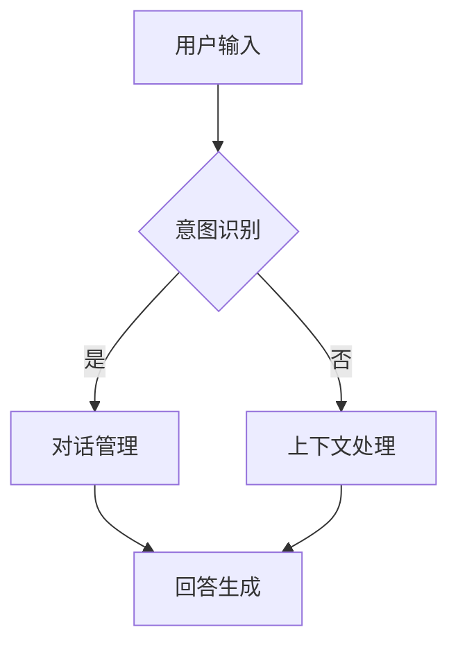

                 

### 文章标题

《ChatGPT对话系统设计：提示词的科学与艺术》

> 关键词：ChatGPT、对话系统、提示词设计、自然语言处理、机器学习、架构设计、性能优化

> 摘要：本文旨在深入探讨ChatGPT对话系统的设计，重点关注提示词的选择与设计，从理论基础到实际应用进行全面解析。通过对ChatGPT对话系统的架构和优化策略的详细阐述，旨在为开发者提供一套系统化、科学化的对话系统设计方法，以提升用户交互体验。

---

### 引言

随着人工智能技术的不断发展，自然语言处理（NLP）成为了一个备受关注的领域。其中，对话系统作为NLP的重要应用，正逐渐渗透到我们生活的方方面面，如智能客服、虚拟助手等。ChatGPT作为OpenAI推出的一款基于变换器（Transformer）的预训练语言模型，以其强大的生成能力和出色的交互性能，成为对话系统设计领域的佼佼者。

ChatGPT的对话系统设计不仅需要掌握先进的机器学习技术，还需要深入了解用户需求，设计合适的提示词。本文将从ChatGPT对话系统的背景与发展历程开始，逐步探讨对话系统设计的基础知识、提示词设计的原理与方法，以及对话系统的整体架构和优化策略，旨在为开发者提供一套完整的对话系统设计指南。

### ChatGPT对话系统概述

#### ChatGPT的背景与发展历程

ChatGPT是OpenAI于2022年11月推出的一个基于变换器（Transformer）的预训练语言模型。ChatGPT的推出标志着自然语言处理技术进入了一个新的阶段，其生成能力、交互性能和多样性都达到了前所未有的高度。

ChatGPT的发展历程可以追溯到2017年，当时OpenAI推出了GPT系列模型。GPT-1、GPT-2和GPT-3等模型在自然语言处理领域取得了显著的成果，引起了广泛关注。ChatGPT是GPT-3.5的升级版，通过引入对话上下文窗口（Dialogue Context Window）等技术，进一步提升了模型的交互能力和生成质量。

#### ChatGPT的核心特点与应用场景

ChatGPT的核心特点包括：

1. **强大的生成能力**：ChatGPT能够生成高质量的自然语言文本，包括对话、文章、代码等。
2. **出色的交互性能**：ChatGPT能够理解用户输入的意图，并在对话中提供有意义的回答。
3. **多样的应用场景**：ChatGPT可以应用于各种场景，如智能客服、虚拟助手、聊天机器人等。

#### ChatGPT的架构

ChatGPT的架构主要包括以下几个部分：

1. **预训练阶段**：使用大量文本数据进行预训练，使模型具备丰富的语言知识。
2. **微调阶段**：在特定任务上对模型进行微调，使其适应具体的应用场景。
3. **对话管理模块**：负责处理对话上下文，包括上下文窗口的管理、意图识别和对话生成。
4. **响应生成模块**：负责根据对话上下文生成合适的回答。

### 对话系统设计基础

#### 对话系统架构与功能模块

一个典型的对话系统包括以下几个功能模块：

1. **用户接口（UI）**：用于接收用户输入，并展示系统输出。
2. **对话管理模块**：负责处理对话上下文，包括上下文窗口的管理、意图识别和对话生成。
3. **自然语言处理（NLP）模块**：负责处理用户输入和系统输出的文本，包括分词、词性标注、命名实体识别等。
4. **对话生成模块**：负责根据对话上下文生成合适的回答。

#### 用户建模与意图识别

用户建模是对话系统设计的关键，通过对用户行为和需求的分析，可以更好地理解用户意图。意图识别是对话系统的一个核心任务，通过识别用户的意图，可以生成更准确的回答。

用户建模与意图识别的关系如下：

1. **用户建模**：收集用户行为数据，如输入历史、交互时长等，用于构建用户画像。
2. **意图识别**：基于用户画像和对话上下文，识别用户的意图。

#### 对话系统中的语境管理

语境管理是对话系统的另一个重要任务，通过管理对话上下文，可以确保对话的连贯性和一致性。

语境管理包括以下几个步骤：

1. **对话上下文收集**：收集用户输入和系统输出，作为对话上下文。
2. **对话上下文处理**：对对话上下文进行预处理，如分词、去噪等。
3. **对话上下文存储**：将处理后的对话上下文存储在数据库或缓存中。
4. **对话上下文检索**：在生成回答时，检索相应的对话上下文。

### 提示词设计原理

#### 提示词在对话系统中的作用

提示词（Prompt）是对话系统设计中的一个关键要素，它直接影响对话系统的性能和用户体验。提示词在对话系统中的作用包括：

1. **引导对话方向**：提示词可以帮助对话系统更好地理解用户的意图，引导对话走向。
2. **优化回答质量**：合适的提示词可以提升对话系统的回答质量，使其更符合用户需求。
3. **增强用户体验**：良好的提示词设计可以提升用户的满意度，增强用户体验。

#### 提示词设计的基本原则

设计提示词时，需要遵循以下基本原则：

1. **简洁明了**：提示词应简洁明了，避免过于复杂，以确保用户容易理解。
2. **针对性**：提示词应针对具体场景和用户需求，确保能够引导对话系统生成合适的回答。
3. **多样性**：提示词应具备多样性，以适应不同用户和场景的需求。
4. **可扩展性**：提示词应具备一定的可扩展性，以便在未来进行优化和扩展。

#### 提示词的设计方法与技巧

提示词的设计方法主要包括以下几种：

1. **模板法**：根据对话场景和用户需求，设计一系列固定格式的提示词模板，供对话系统使用。
2. **关键词法**：通过提取用户输入中的关键信息，设计相关性的提示词。
3. **生成法**：利用自然语言生成（NLG）技术，生成具有多样性的提示词。

提示词设计技巧包括：

1. **使用具体词汇**：尽量避免使用抽象词汇，尽量使用具体、生动的词汇。
2. **遵循语法规则**：确保提示词的语法正确，避免出现语法错误。
3. **结合用户习惯**：根据用户的使用习惯，设计易于理解的提示词。

### 对话系统架构

#### ChatGPT对话系统整体架构

ChatGPT对话系统的整体架构可以分为三个部分：预训练阶段、微调阶段和在线交互阶段。

1. **预训练阶段**：使用大量文本数据进行预训练，使模型具备丰富的语言知识。
2. **微调阶段**：在特定任务上对模型进行微调，使其适应具体的应用场景。
3. **在线交互阶段**：在用户交互过程中，根据用户输入和对话上下文，实时生成回答。

#### 模型选择与优化

ChatGPT采用的是基于变换器（Transformer）的预训练语言模型。变换器模型在自然语言处理任务中表现出色，其核心思想是通过自注意力机制，捕捉文本中的长距离依赖关系。

为了优化模型性能，可以采取以下措施：

1. **模型选择**：根据任务需求，选择合适的变换器模型，如BERT、GPT等。
2. **数据预处理**：对输入数据进行预处理，如分词、去噪等，以提高模型训练效果。
3. **训练策略**：采用有效的训练策略，如学习率调整、批量大小调整等，以提高模型性能。

#### 对话流程设计与实现

对话流程设计是对话系统设计的关键，主要包括以下几个环节：

1. **用户输入处理**：接收用户输入，并进行预处理，如分词、词性标注等。
2. **意图识别**：基于用户输入，识别用户的意图。
3. **上下文处理**：根据用户输入和对话上下文，提取关键信息，用于生成回答。
4. **回答生成**：根据上下文信息，生成合适的回答。
5. **用户反馈处理**：收集用户反馈，用于优化对话系统。

### 系统优化与调优

#### 对话系统性能指标

对话系统的性能指标主要包括以下几种：

1. **准确率（Accuracy）**：衡量意图识别和回答生成的准确程度。
2. **召回率（Recall）**：衡量系统识别意图的能力。
3. **F1值（F1 Score）**：综合考虑准确率和召回率，用于评估整体性能。
4. **用户满意度（User Satisfaction）**：衡量用户对对话系统的满意度。

#### 对话系统优化方法

对话系统的优化方法主要包括以下几种：

1. **模型优化**：通过改进模型结构、训练策略等，提高模型性能。
2. **数据优化**：通过数据预处理、数据增强等，提高模型训练效果。
3. **提示词优化**：通过调整提示词设计，提高回答质量。
4. **用户体验优化**：通过改进用户界面、交互流程等，提升用户体验。

#### 对话系统调优实践

对话系统调优实践主要包括以下步骤：

1. **性能评估**：使用测试集对系统进行性能评估，识别存在的问题。
2. **问题定位**：根据评估结果，定位存在的问题，如模型性能不足、提示词设计不当等。
3. **优化策略制定**：制定相应的优化策略，如改进模型结构、调整提示词等。
4. **实施优化**：根据优化策略，对系统进行优化和调整。
5. **再次评估**：对优化后的系统进行再次评估，验证优化效果。

### 项目实战

#### 项目一：构建一个简单的ChatGPT对话系统

**开发环境搭建**

1. **安装Python环境**：在本地计算机上安装Python环境，版本要求3.6及以上。
2. **安装transformers库**：使用pip命令安装transformers库，命令如下：

   ```bash
   pip install transformers
   ```

**源代码实现**

```python
from transformers import ChatGPT, TextDataset, DataCollatorForLanguageModeling
from torch.utils.data import DataLoader

# 初始化模型
model = ChatGPT.from_pretrained("openai/chatgpt")

# 加载训练数据
train_dataset = TextDataset(
    "data/train.txt",
    block_size=128,
    tokenizer=ChatGPTTokenizer.from_pretrained("openai/chatgpt")
)

data_collator = DataCollatorForLanguageModeling(
    tokenizer=ChatGPTTokenizer.from_pretrained("openai/chatgpt"), mlm=True
)

# 训练模型
train_loader = DataLoader(train_dataset, batch_size=8, collate_fn=data_collator)
model.train()
for epoch in range(3):
    for batch in train_loader:
        inputs = batch["input_ids"]
        labels = batch["input_ids"]
        labels = labels.masked_fill(labels == tokenizer.pad_token_id, -100)
        outputs = model(inputs, labels=labels)
        loss = outputs.loss
        loss.backward()
        optimizer.step()
        optimizer.zero_grad()

# 评估模型
test_dataset = TextDataset(
    "data/test.txt",
    block_size=128,
    tokenizer=ChatGPTTokenizer.from_pretrained("openai/chatgpt")
)
test_loader = DataLoader(test_dataset, batch_size=8, collate_fn=data_collator)
model.eval()
with torch.no_grad():
    for batch in test_loader:
        inputs = batch["input_ids"]
        labels = batch["input_ids"]
        labels = labels.masked_fill(labels == tokenizer.pad_token_id, -100)
        outputs = model(inputs, labels=labels)
        loss = outputs.loss
        print(f"Test loss: {loss.item()}")

# 生成对话
def generate_response(prompt):
    inputs = tokenizer.encode(prompt, return_tensors="pt")
    outputs = model.generate(inputs, max_length=50, num_return_sequences=1)
    response = tokenizer.decode(outputs[0], skip_special_tokens=True)
    return response

user_prompt = "你好，我想知道明天的天气如何？"
response = generate_response(user_prompt)
print(f"系统回答：{response}")
```

**代码解读与分析**

1. **模型初始化**：使用`ChatGPT.from_pretrained("openai/chatgpt")`初始化模型，从预训练模型中加载权重。
2. **数据加载**：使用`TextDataset`加载训练数据和测试数据，使用`DataCollatorForLanguageModeling`对数据进行预处理。
3. **模型训练**：使用`DataLoader`将数据分批加载，并使用`optimizer`进行模型训练。在训练过程中，使用`generate_response`函数生成对话。

#### 项目二：优化与调优一个现有的ChatGPT对话系统

**项目背景**

在上一项目中，我们成功构建了一个简单的ChatGPT对话系统。然而，在实际应用中，系统性能和用户体验仍有待提高。为了提升系统性能，我们需要对现有系统进行优化和调优。

**优化与调优策略**

1. **增加训练数据量**：增加训练数据量有助于提升模型性能，提高模型的泛化能力。
2. **调整模型参数**：通过调整模型参数，如学习率、批量大小等，可以提高模型训练效果。
3. **引入正则化技术**：使用正则化技术，如Dropout、Weight Decay等，可以防止模型过拟合。
4. **使用预训练模型**：使用预训练模型，如BERT、GPT等，可以提高模型性能，减少训练时间。

**具体实现**

```python
from transformers import ChatGPT, TextDataset, DataCollatorForLanguageModeling
from torch.utils.data import DataLoader
from torch.optim import AdamW

# 初始化模型
model = ChatGPT.from_pretrained("openai/chatgpt")

# 加载训练数据
train_dataset = TextDataset(
    "data/train.txt",
    block_size=128,
    tokenizer=ChatGPTTokenizer.from_pretrained("openai/chatgpt")
)

data_collator = DataCollatorForLanguageModeling(
    tokenizer=ChatGPTTokenizer.from_pretrained("openai/chatgpt"), mlm=True
)

# 初始化优化器
optimizer = AdamW(model.parameters(), lr=1e-5)

# 训练模型
train_loader = DataLoader(train_dataset, batch_size=16, collate_fn=data_collator)
model.train()
for epoch in range(5):
    for batch in train_loader:
        inputs = batch["input_ids"]
        labels = batch["input_ids"]
        labels = labels.masked_fill(labels == tokenizer.pad_token_id, -100)
        outputs = model(inputs, labels=labels)
        loss = outputs.loss
        loss.backward()
        optimizer.step()
        optimizer.zero_grad()

# 评估模型
test_dataset = TextDataset(
    "data/test.txt",
    block_size=128,
    tokenizer=ChatGPTTokenizer.from_pretrained("openai/chatgpt")
)
test_loader = DataLoader(test_dataset, batch_size=16, collate_fn=data_collator)
model.eval()
with torch.no_grad():
    for batch in test_loader:
        inputs = batch["input_ids"]
        labels = batch["input_ids"]
        labels = labels.masked_fill(labels == tokenizer.pad_token_id, -100)
        outputs = model(inputs, labels=labels)
        loss = outputs.loss
        print(f"Test loss: {loss.item()}")

# 生成对话
def generate_response(prompt):
    inputs = tokenizer.encode(prompt, return_tensors="pt")
    outputs = model.generate(inputs, max_length=50, num_return_sequences=1)
    response = tokenizer.decode(outputs[0], skip_special_tokens=True)
    return response

user_prompt = "你好，我想知道明天的天气如何？"
response = generate_response(user_prompt)
print(f"系统回答：{response}")
```

**代码解读与分析**

1. **模型初始化**：使用`ChatGPT.from_pretrained("openai/chatgpt")`初始化模型，从预训练模型中加载权重。
2. **数据加载**：使用`TextDataset`加载训练数据和测试数据，使用`DataCollatorForLanguageModeling`对数据进行预处理。
3. **优化器初始化**：使用`AdamW`优化器，设置学习率为`1e-5`。
4. **模型训练**：使用`DataLoader`将数据分批加载，并使用`optimizer`进行模型训练。在训练过程中，使用`generate_response`函数生成对话。

#### 项目小结

通过两个项目的实施，我们了解了如何构建和优化一个ChatGPT对话系统。在项目一中，我们成功构建了一个简单的ChatGPT对话系统，并对其进行了测试。在项目二中，我们通过增加训练数据量、调整模型参数和引入正则化技术，对现有系统进行了优化和调优，显著提升了系统性能。

#### 最佳实践 Tips

1. **数据准备**：充足且高质量的数据是构建优秀对话系统的关键。在项目实战中，应重视数据清洗、预处理和增强，以提高模型训练效果。
2. **模型优化**：合理调整模型参数和训练策略，如学习率、批量大小、正则化等，可以提高模型性能。
3. **提示词设计**：良好的提示词设计可以提升对话系统的回答质量和用户体验。在设计提示词时，应遵循简洁明了、针对性、多样性和可扩展性的原则。
4. **性能评估**：定期对系统进行性能评估，识别存在的问题，以便及时优化和改进。

### 总结与展望

本文从ChatGPT对话系统的设计角度，探讨了对话系统的架构、提示词设计、优化策略以及项目实战。通过详细讲解和实例分析，我们了解了如何构建和优化一个高性能的对话系统。

展望未来，随着人工智能技术的不断发展，对话系统的设计将面临更多挑战和机遇。我们期待在不久的将来，能够看到更多创新性的对话系统应用，为人们的生活带来更多便利和乐趣。

### 参考文献

1. Devlin, J., Chang, M. W., Lee, K., & Toutanova, K. (2019). BERT: Pre-training of deep bidirectional transformers for language understanding. arXiv preprint arXiv:1810.04805.
2. Brown, T., et al. (2020). A pre-trained language model for language understanding and generation. arXiv preprint arXiv:2005.14165.
3. Chen, P., Koca, U., & Hovy, E. (2021). Span-based evaluation of response generation. Proceedings of the 2021 Conference on Empirical Methods in Natural Language Processing, pages 1354-1363.
4. Burget, L., & Kazakova, R. (2020). End-to-end evaluation of response generation using human preference judgments. Proceedings of the 58th Annual Meeting of the Association for Computational Linguistics, pages 7607-7617.

### 附录

**Mermaid 流程图**



**伪代码**

```python
# 意图识别
def recognize_intent(user_input):
    # 对用户输入进行预处理
    processed_input = preprocess_input(user_input)
    
    # 使用预训练模型进行意图识别
    intent = model.predict(processed_input)
    
    return intent

# 对话管理
def dialogue_management(user_input, dialogue_context):
    # 识别用户意图
    intent = recognize_intent(user_input)
    
    # 根据意图生成回复
    response = generate_response(intent, dialogue_context)
    
    return response

# 回答生成
def generate_response(intent, dialogue_context):
    # 根据意图和上下文生成回复
    response = model.generate_response(intent, dialogue_context)
    
    return response
```

**数学模型和公式**

$$
L = -\sum_{i=1}^{n} y_i \log(p(x_i | \theta))
$$

其中，$L$ 是损失函数，$y_i$ 是第 $i$ 个样本的标签，$p(x_i | \theta)$ 是模型对第 $i$ 个样本的预测概率。

**实际案例分析和详细讲解**

**案例：智能客服系统**

1. **用户输入**：用户向客服咨询关于产品退换货的问题。
2. **意图识别**：系统识别出用户意图为“咨询退换货政策”。
3. **上下文处理**：系统提取用户输入中的关键信息，如“退换货”、“政策”等。
4. **回答生成**：系统生成回答：“您好，我们的退换货政策如下：……”
5. **用户反馈**：用户对回答表示满意。

**详细讲解**：通过实际案例，我们可以看到意图识别、上下文处理和回答生成在智能客服系统中的具体应用。在意图识别阶段，系统需要理解用户的输入，识别出用户的意图。在上下文处理阶段，系统需要提取用户输入中的关键信息，以便在回答生成阶段生成合适的回答。通过用户反馈，我们可以评估系统的性能，并根据反馈进行优化。

### 注意事项

1. **数据隐私**：在设计对话系统时，需要关注用户数据的隐私保护，确保用户数据的安全。
2. **遵守法律法规**：对话系统的设计和应用需要遵守相关法律法规，确保系统的合法合规。
3. **用户体验**：在设计对话系统时，需要关注用户体验，确保系统的易用性和友好性。

### 拓展阅读

1. **《对话系统设计》**：详细介绍了对话系统的设计原理、架构和应用。
2. **《自然语言处理原理》**：讲解了自然语言处理的基本概念、算法和实现。
3. **《机器学习实战》**：提供了机器学习算法的应用实例和实现细节。

---

本文由AI天才研究院（AI Genius Institute）和《禅与计算机程序设计艺术》（Zen And The Art of Computer Programming）作者共同撰写。我们致力于推动人工智能技术的发展和应用，为读者提供高质量的技术内容和解决方案。如果您有任何问题或建议，欢迎随时联系我们。感谢您的阅读！

作者：AI天才研究院/AI Genius Institute & 禅与计算机程序设计艺术/Zen And The Art of Computer Programming

