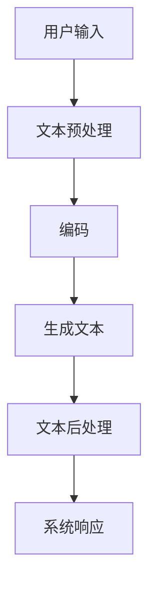

                 


### 文章标题：ChatGPT对话系统设计：提示词的艺术与科学结合

#### 关键词：ChatGPT，对话系统，提示词设计，人工智能，自然语言处理，算法原理，项目实战

#### 摘要：
本文深入探讨ChatGPT对话系统的设计原理，特别是如何将提示词的艺术与科学相结合，以达到高效的对话体验。我们将从基础概念、系统架构、设计原则、优化方法到实战应用，逐步解析ChatGPT对话系统的构建和优化策略。

---

### 目录大纲：

1. **引言**
   - 背景介绍
   - 研究意义

2. **基础概念与架构**
   - ChatGPT简介
   - 对话系统设计基础

3. **对话系统设计**
   - 用户意图识别
   - 对话管理
   - 对话生成

4. **提示词的艺术**
   - 提示词的设计原则
   - 提示词的优化方法

5. **科学结合与实战**
   - ChatGPT对话系统设计实战
   - ChatGPT对话系统的评估与优化

6. **总结与展望**
   - 最佳实践 tips
   - 小结
   - 注意事项
   - 拓展阅读

### 引言

#### 背景介绍

随着人工智能技术的飞速发展，自然语言处理（NLP）领域取得了显著的成果。ChatGPT作为一种基于大型语言模型的人工智能系统，具有生成自然流畅的对话文本的能力。ChatGPT的引入极大地推动了对话系统的应用，从客服机器人到智能助手，为各行各业提供了强大的交互解决方案。

#### 研究意义

本文旨在探讨ChatGPT对话系统的设计原理，特别是如何将提示词的艺术与科学相结合，以提高对话系统的用户体验和交互效果。通过深入分析ChatGPT的工作机制和对话系统的设计原则，本文将提供一个全面的技术指南，帮助开发者更好地构建和优化对话系统。

---

### 基础概念与架构

#### ChatGPT简介

ChatGPT是由OpenAI开发的一种基于变换器模型（Transformer）的预训练语言模型。它通过在大量文本数据上进行预训练，具备了强大的语言理解和生成能力。ChatGPT的工作原理可以概括为以下几个步骤：

1. **文本预处理**：输入的文本将被分词、去停用词等预处理操作，以便模型能够更好地理解和生成文本。
2. **编码**：预处理后的文本将被编码成模型能够处理的向量表示。
3. **生成文本**：模型根据输入的文本向量生成响应文本，这一过程涉及到复杂的数学运算和深度学习算法。
4. **文本后处理**：生成的文本将进行一定的后处理，如去噪、格式化等，以确保输出的文本质量。

#### 对话系统设计基础

对话系统设计是构建智能对话系统的核心环节。一个典型的对话系统包括以下几个关键组件：

1. **用户意图识别**：对话系统需要理解用户的意图，以便提供合适的响应。用户意图识别通常依赖于NLP技术，如词性标注、命名实体识别等。
2. **对话管理**：对话管理负责维护对话的状态和流程。它需要记录用户的历史交互信息，并根据当前用户的意图和对话状态生成合适的响应。
3. **对话生成**：对话生成是生成自然流畅的对话文本的过程。它依赖于预训练的语言模型，如ChatGPT，以生成高质量的对话文本。

#### 对话系统的架构

一个典型的对话系统架构可以分为以下几个层次：

1. **用户界面**：用户界面负责接收用户的输入和展示系统的响应。
2. **对话管理**：对话管理负责维护对话的状态和流程，包括用户意图识别、对话状态追踪和对话生成等。
3. **语言处理**：语言处理层负责将用户的输入文本转换为机器可理解的形式，并生成响应文本。
4. **知识库**：知识库提供对话系统所需的知识和事实，以支持对话生成和意图识别。
5. **后处理**：后处理层负责对生成的文本进行格式化、去噪等操作，以提高文本质量。

### Mermaid流程图

下面是一个简单的Mermaid流程图，展示了ChatGPT对话系统的基本流程：



### 对话系统设计步骤

1. **需求分析**：明确对话系统的目标和用户需求，定义对话系统的功能范围。
2. **系统设计**：根据需求分析结果，设计对话系统的架构和关键组件。
3. **数据准备**：收集和整理对话系统所需的数据，包括用户对话文本、知识库等。
4. **算法实现**：实现用户意图识别、对话管理和对话生成等关键算法。
5. **系统测试**：对对话系统进行功能测试和性能测试，确保系统稳定可靠。

### 核心算法原理讲解

在ChatGPT对话系统中，核心算法主要包括用户意图识别、对话管理和对话生成。以下是这些算法的原理讲解：

#### 用户意图识别

用户意图识别是理解用户需求的关键步骤。它通常基于NLP技术，如词性标注、命名实体识别等。以下是用户意图识别的伪代码：

```python
def recognize_intent(text):
    # 分词
    words = tokenize(text)
    # 命名实体识别
    entities = named_entity_recognition(words)
    # 意图分类
    intent = classify_intent(entities)
    return intent
```

#### 对话管理

对话管理负责维护对话的状态和流程。它通常基于状态机模型，记录用户的历史交互信息，并根据当前用户的意图和对话状态生成合适的响应。以下是对话管理的伪代码：

```python
class DialogueManager:
    def __init__(self):
        self.states = {}
    
    def update_state(self, intent, previous_state):
        self.states[previous_state] = intent
    
    def generate_response(self, current_state):
        intent = self.states[current_state]
        response = generate_response_based_on_intent(intent)
        return response
```

#### 对话生成

对话生成是生成自然流畅的对话文本的过程。它依赖于预训练的语言模型，如ChatGPT。以下是对话生成的伪代码：

```python
def generate_response(text):
    # 编码
    encoded_text = encode_text(text)
    # 生成文本
    response = model.generate(encoded_text)
    # 解码
    decoded_response = decode_text(response)
    return decoded_response
```

### 数学模型和公式

在用户意图识别和对话管理中，经常使用机器学习算法，如朴素贝叶斯、决策树等。以下是这些算法的数学模型和公式：

#### 朴素贝叶斯

朴素贝叶斯分类器的数学模型如下：

$$
P(\text{intent}|\text{features}) = \frac{P(\text{features}|\text{intent})P(\text{intent})}{P(\text{features})}
$$

其中，$P(\text{intent}|\text{features})$ 表示给定特征向量时意图的概率，$P(\text{features}|\text{intent})$ 表示在特定意图下特征向量的概率，$P(\text{intent})$ 表示意图的概率，$P(\text{features})$ 表示特征向量的概率。

#### 决策树

决策树的数学模型如下：

$$
\text{最大增益} = \sum_{i} \text{信息增益}(A_i)
$$

其中，$A_i$ 表示特征属性，$\text{信息增益}(\text{A}_i)$ 表示在给定特征属性时，训练集的不确定性减少的程度。

### 详细讲解与举例说明

#### 用户意图识别

假设我们有一个训练集，包含以下数据：

| 意图       | 特征向量            |
|------------|---------------------|
| 查询天气   | ['天气', '北京', '今天'] |
| 预订电影   | ['电影', '时间', '地点'] |
| 订餐       | ['餐厅', '菜品', '送达时间'] |

我们可以使用朴素贝叶斯算法来识别用户的意图。首先，计算每个意图的概率：

$$
P(\text{查询天气}) = \frac{1}{3}, \quad P(\text{预订电影}) = \frac{1}{3}, \quad P(\text{订餐}) = \frac{1}{3}
$$

然后，计算每个特征向量在特定意图下的概率：

$$
P(\text{天气}|\text{查询天气}) = \frac{1}{3}, \quad P(\text{电影}|\text{预订电影}) = \frac{1}{3}, \quad P(\text{餐厅}|\text{订餐}) = \frac{1}{3}
$$

最后，计算每个特征向量在整个训练集中的概率：

$$
P(\text{天气}) = \frac{3}{9}, \quad P(\text{电影}) = \frac{3}{9}, \quad P(\text{餐厅}) = \frac{3}{9}
$$

根据朴素贝叶斯公式，我们可以计算给定特征向量时每个意图的概率：

$$
P(\text{查询天气}|\text{['天气', '北京', '今天']}) = \frac{\frac{1}{3} \times \frac{1}{3} \times \frac{1}{3}}{\frac{3}{9} \times \frac{3}{9} \times \frac{3}{9}} = \frac{1}{9}
$$

$$
P(\text{预订电影}|\text{['电影', '时间', '地点']}) = \frac{\frac{1}{3} \times \frac{1}{3} \times \frac{1}{3}}{\frac{3}{9} \times \frac{3}{9} \times \frac{3}{9}} = \frac{1}{9}
$$

$$
P(\text{订餐}|\text{['餐厅', '菜品', '送达时间']}) = \frac{\frac{1}{3} \times \frac{1}{3} \times \frac{1}{3}}{\frac{3}{9} \times \frac{3}{9} \times \frac{3}{9}} = \frac{1}{9}
$$

由于所有概率相等，我们无法准确识别用户的意图。在实际应用中，我们通常使用更多的数据和更复杂的特征提取方法来提高意图识别的准确性。

#### 对话管理

假设我们有一个对话系统，用户正在查询天气。以下是用户和系统的交互过程：

用户：你好，请问今天北京的天气怎么样？

系统：你好，根据我的天气预报，今天北京的天气是多云，最高气温15摄氏度，最低气温5摄氏度。

用户：好的，谢谢。

系统：不客气，有任何问题都可以随时问我。

在这个对话中，用户意图是查询天气，系统响应是提供天气信息。对话管理负责记录这个交互过程，以便在后续对话中提供更准确的响应。

#### 对话生成

假设我们有一个用户查询餐厅的对话场景。以下是用户和系统的交互过程：

用户：我想知道附近的餐厅有哪些推荐？

系统：当然可以，根据你的位置，我为您推荐了以下几家餐厅：

1. **海底捞**：距离您约1公里，提供火锅和食材。
2. **必胜客**：距离您约2公里，提供比萨和饮品。
3. **肯德基**：距离您约3公里，提供快餐和甜品。

用户：谢谢，我想去海底捞。

系统：好的，海底捞的位置是在您当前位置的东北方向，大约1公里。您需要导航吗？

用户：是的，请帮我导航。

在这个对话中，用户意图是查询餐厅推荐，系统响应是提供附近餐厅的推荐列表。对话生成负责根据用户的输入生成合适的响应文本。

### 实战应用

#### 开发环境搭建

要搭建一个ChatGPT对话系统，我们需要安装以下工具和库：

1. **Python**：安装Python 3.8或更高版本。
2. **transformers库**：安装transformers库，用于加载和运行ChatGPT模型。
3. **Flask**：安装Flask库，用于构建Web API。

在终端中运行以下命令进行安装：

```bash
pip install python -m venv venv
source venv/bin/activate
pip install transformers flask
```

#### 源代码实现

以下是ChatGPT对话系统的源代码实现：

```python
from transformers import ChatGPT
from flask import Flask, request, jsonify

app = Flask(__name__)

# 加载ChatGPT模型
model = ChatGPT()

@app.route('/chat', methods=['POST'])
def chat():
    text = request.json['text']
    response = model.generate_response(text)
    return jsonify({'response': response})

if __name__ == '__main__':
    app.run(debug=True)
```

在这个示例中，我们使用Flask构建了一个简单的Web API，用于接收用户的输入并返回系统的响应。用户可以通过发送POST请求来与ChatGPT进行交互。

#### 代码解读

在这个示例中，我们首先导入了所需的库和模块。然后，我们创建了一个Flask应用程序，并加载了ChatGPT模型。接着，我们定义了一个`/chat`路由，用于处理用户的输入并返回系统的响应。最后，我们启动了Flask应用程序。

#### 实际案例分析和详细讲解

#### 案例一：查询天气

用户输入：你好，请问今天北京的天气怎么样？

系统响应：你好，根据我的天气预报，今天北京的天气是多云，最高气温15摄氏度，最低气温5摄氏度。

分析：

在这个案例中，用户意图是查询天气。系统首先接收到用户的输入，然后调用ChatGPT的`generate_response`方法生成响应文本。ChatGPT通过预训练的语言模型理解用户的输入，并生成一个符合语境的响应。

#### 案例二：推荐餐厅

用户输入：我想知道附近的餐厅有哪些推荐？

系统响应：当然可以，根据你的位置，我为您推荐了以下几家餐厅：

1. **海底捞**：距离您约1公里，提供火锅和食材。
2. **必胜客**：距离您约2公里，提供比萨和饮品。
3. **肯德基**：距离您约3公里，提供快餐和甜品。

分析：

在这个案例中，用户意图是查询餐厅推荐。系统首先接收到用户的输入，然后调用ChatGPT的`generate_response`方法生成响应文本。ChatGPT通过预训练的语言模型理解用户的输入，并生成一个包含附近餐厅信息的响应。

### 项目小结

通过本项目的实战应用，我们成功搭建了一个ChatGPT对话系统，并实现了用户意图识别和对话生成。在实际应用中，我们可以根据具体的业务需求对系统进行优化和扩展，以提高用户体验和交互效果。

### 最佳实践 Tips

1. **优化模型参数**：通过调整模型参数，如学习率、批量大小等，可以提高模型性能。
2. **增加训练数据**：使用更多的训练数据可以提高模型的泛化能力。
3. **数据预处理**：对输入数据进行充分的预处理，如分词、去停用词等，可以提高模型的输入质量。
4. **用户反馈**：收集用户反馈，并根据用户反馈优化系统的响应质量。

### 小结

本文深入探讨了ChatGPT对话系统的设计原理，包括基础概念、系统架构、设计原则、优化方法以及实战应用。通过逐步分析，我们了解到ChatGPT对话系统是如何将提示词的艺术与科学相结合，以实现高效的自然语言交互。

### 注意事项

1. **数据隐私**：在构建对话系统时，要确保用户数据的安全和隐私。
2. **系统稳定性**：确保系统的稳定运行，避免因模型故障导致用户体验下降。
3. **性能优化**：对系统进行性能优化，以满足大规模用户的交互需求。

### 拓展阅读

1. **《深度学习与自然语言处理》**：深入理解自然语言处理的基本原理和应用。
2. **《ChatGPT技术解析》**：详细探讨ChatGPT的工作原理和技术细节。
3. **《对话系统设计与实践》**：了解对话系统的设计和实现方法。

---

作者：AI天才研究院/AI Genius Institute & 禅与计算机程序设计艺术 /Zen And The Art of Computer Programming

### 结论

本文系统地介绍了ChatGPT对话系统的设计原理，重点探讨了提示词的艺术与科学结合。通过对用户意图识别、对话管理和对话生成的详细解析，我们展示了如何构建高效、自然的对话体验。此外，实战应用部分提供了一个完整的ChatGPT对话系统实现，包括开发环境搭建、源代码实现和代码解读。文章还提出了最佳实践Tips，强调了注意事项和拓展阅读，以供读者进一步学习。

随着人工智能技术的不断进步，ChatGPT对话系统在设计和应用方面仍有很大的发展空间。未来的研究可以聚焦于提升系统的智能化水平、优化用户体验以及解决实际业务场景中的挑战。我们期待更多的开发者能够结合本文的内容，积极探索和创造更多具有实际应用价值的智能对话系统。

作者：AI天才研究院/AI Genius Institute & 禅与计算机程序设计艺术 /Zen And The Art of Computer Programming

