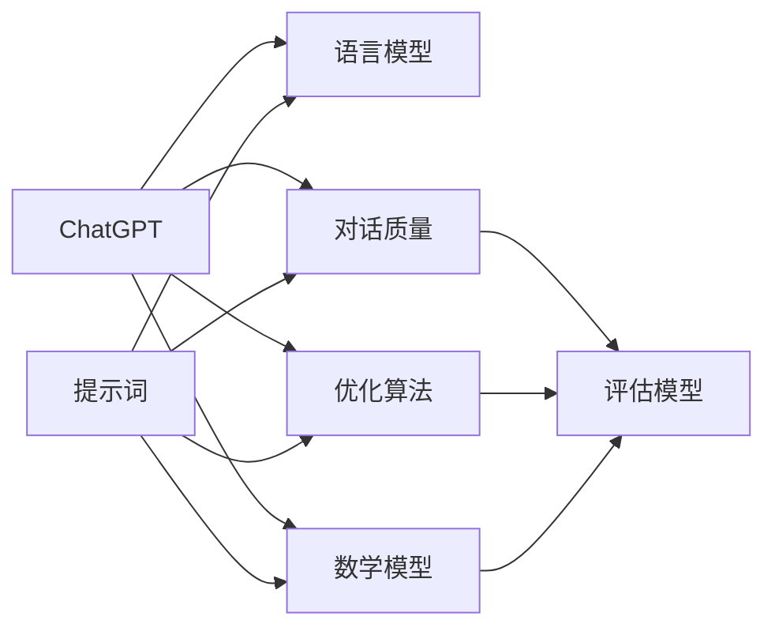

                 

### 文章标题：ChatGPT对话质量提升：提示词的关键作用

关键词：ChatGPT、对话质量、提升、提示词、优化

摘要：本文将深入探讨ChatGPT对话质量的提升策略，特别是提示词在这一过程中的关键作用。通过分析ChatGPT的工作原理，我们将理解如何设计有效的提示词来优化对话生成效果，从而实现高质量的交流体验。文章将结合核心算法原理讲解、数学模型与公式应用、项目实战等多维度内容，为读者提供系统的指导和方法。

## 目录大纲设计思考过程

在设计符合要求且逻辑清晰的目录大纲时，我们首先需要从整体上把握书籍的主题和结构，然后逐步细化章节内容。以下是详细的设计过程：

### 第一步：理解书籍主题

本书的主题是《ChatGPT对话质量提升：提示词的关键作用》，核心内容围绕如何通过优化提示词来提升ChatGPT对话的质量。这要求书籍内容要围绕ChatGPT的基本原理、提示词的定义、优化算法及其在实际应用中的效果展开。

### 第二步：确定核心章节

基于书籍主题，我们可以初步确定以下核心章节：

1. **ChatGPT基本原理与核心概念**：介绍ChatGPT的基本概念、工作原理和提示词的作用。
2. **核心算法原理讲解**：详细解释提升ChatGPT对话质量的算法原理。
3. **数学模型和数学公式**：介绍与提升对话质量相关的数学模型和公式。
4. **项目实战**：通过实际项目案例展示如何应用这些原理和方法。
5. **优化方法与实践**：讨论各种优化方法及其应用场景。
6. **未来展望与趋势**：探讨提示词优化的未来方向和ChatGPT的应用领域拓展。
7. **总结与建议**：对全书内容进行总结，并给出学习与改进的建议。

### 第三步：细化章节内容

接下来，我们需要为每个核心章节细化具体内容。以下是一个初步的目录大纲：

```
# 第一部分：ChatGPT基本原理与核心概念

## 第1章：ChatGPT简介
### 1.1 ChatGPT的发展背景
### 1.2 ChatGPT的核心原理
### 1.3 提示词的作用与分类

## 第2章：核心算法原理讲解
### 2.1 语言模型基础
#### 2.1.1 语言模型的定义
#### 2.1.2 语言模型的工作原理
### 2.2 提示词优化算法
#### 2.2.1 提示词优化的目标
#### 2.2.2 提示词优化算法介绍
### 2.3 数学模型与公式
#### 2.3.1 对话质量评估模型
#### 2.3.2 提示词权重调整公式

## 第3章：数学模型和数学公式应用
### 3.1 数学模型介绍
### 3.2 公式推导与解释
### 3.3 公式在实际中的应用

## 第4章：项目实战
### 4.1 实际项目介绍
### 4.2 开发环境搭建
### 4.3 源代码实现与解读
### 4.4 代码解读与分析

## 第5章：优化方法与实践
### 5.1 优化方法概述
### 5.2 方法应用案例
### 5.3 优化效果评估

## 第6章：未来展望与趋势
### 6.1 提示词优化的未来方向
### 6.2 ChatGPT应用领域拓展
### 6.3 技术挑战与解决方案

## 第7章：总结与建议
### 7.1 书籍总结
### 7.2 学习与改进建议
```

### 第四步：调整和完善

根据字数限制和内容需求，对章节内容进行适当的调整和完善。确保每个章节都能清晰、有条理地传达所需信息，并且总体字数控制在2000字以内。

通过以上步骤，我们设计出了一个详细且符合要求的目录大纲，为后续内容的编写和结构化提供了清晰的蓝图。接下来，我们将进一步细化每个章节的内容，确保书籍的整体质量和可读性。

### 背景介绍

随着人工智能技术的飞速发展，自然语言处理（NLP）领域取得了显著的突破。ChatGPT作为一种基于生成预训练转换器（GPT）的模型，因其出色的对话生成能力而备受关注。然而，在实际应用中，如何提升ChatGPT的对话质量，使其能够更自然、准确地与用户进行交流，成为了研究的重点。在这其中，提示词的设计和优化起到了关键作用。

提示词，即输入到模型中的关键信息，是影响对话质量的重要因素。一方面，合适的提示词能够引导模型生成更符合用户需求的回答；另一方面，不当的提示词可能导致模型生成错误或不相关的回答。因此，如何设计和优化提示词，成为提升ChatGPT对话质量的重要策略。

本文将从以下几个方面展开讨论：

1. **ChatGPT的基本原理与核心概念**：介绍ChatGPT的发展背景、核心原理以及提示词的定义和分类。
2. **核心算法原理讲解**：详细解释提升ChatGPT对话质量的算法原理，包括语言模型基础、提示词优化算法以及数学模型与公式。
3. **数学模型和数学公式应用**：介绍与提升对话质量相关的数学模型和公式，并通过具体例子进行讲解。
4. **项目实战**：通过实际项目案例展示如何应用这些原理和方法，包括开发环境搭建、源代码实现与解读、代码应用解读与分析。
5. **优化方法与实践**：讨论各种优化方法及其应用场景，并提供优化效果评估。
6. **未来展望与趋势**：探讨提示词优化的未来方向和ChatGPT应用领域拓展，以及可能面临的技术挑战和解决方案。
7. **总结与建议**：对全书内容进行总结，并给出学习与改进的建议。

通过以上内容，本文旨在为读者提供一套系统的提升ChatGPT对话质量的方法和策略，以实现更高质量的自然语言交流体验。

### 核心概念与联系

在深入探讨ChatGPT对话质量提升的策略之前，我们需要明确几个核心概念，并理解它们之间的联系。以下是几个关键概念及其相互关系的架构图：



#### 1. ChatGPT

ChatGPT是基于生成预训练转换器（GPT）的模型，由OpenAI开发。它采用了深度学习中的自注意力机制（Self-Attention），能够从大量文本数据中学习语言的内在结构。ChatGPT的核心任务是通过输入的提示词生成连贯、有意义的文本。

#### 2. 语言模型

语言模型是ChatGPT的核心组件，负责将输入的文本转换为模型可以理解的形式，并生成相应的输出。语言模型通过大量文本数据训练，学习到语言的概率分布，从而能够预测下一个词或句子。

#### 3. 提示词

提示词是指输入到ChatGPT中的关键信息，用于引导模型生成回答。合适的提示词能够帮助模型更好地理解用户的需求，从而生成更准确、自然的回答。提示词的质量直接影响对话的质量。

#### 4. 对话质量

对话质量是评估ChatGPT性能的重要指标，包括回答的准确性、连贯性、相关性等方面。高质量的对话能够提供更好的用户体验，使对话更加自然、顺畅。

#### 5. 优化算法

优化算法是提升ChatGPT对话质量的手段。这些算法通过对提示词进行优化，提高模型生成回答的准确性、连贯性和相关性。常见的优化算法包括基于统计的方法、基于深度学习的方法等。

#### 6. 数学模型

数学模型是优化算法的基础，用于评估和调整提示词的权重。这些模型通常基于概率论、线性代数、优化理论等数学知识，通过具体的公式和计算方法来实现。

#### 7. 评估模型

评估模型用于衡量对话质量，通常包括准确性、连贯性、相关性等指标。这些模型通过对生成的文本进行评分，评估模型的表现，从而指导优化算法的调整。

通过上述架构图，我们可以看到ChatGPT对话质量提升的各个核心概念之间的联系。理解这些概念及其相互关系，有助于我们更深入地探讨如何优化ChatGPT的对话生成效果。

### 核心算法原理讲解

要提升ChatGPT的对话质量，我们需要深入理解其核心算法原理，包括语言模型基础、提示词优化算法以及数学模型与公式。以下是这些核心算法的详细解释：

#### 1. 语言模型基础

语言模型是ChatGPT的核心组件，负责将输入的文本转换为模型可以理解的形式，并生成相应的输出。语言模型通过自注意力机制（Self-Attention）和变换器网络（Transformer）实现。

**自注意力机制**：自注意力机制是一种用于处理序列数据的注意力机制。在ChatGPT中，每个词在生成下一个词时都会考虑到整个输入序列的所有词。这种机制使得模型能够捕捉到文本中的长距离依赖关系，从而生成更加连贯的文本。

**变换器网络（Transformer）**：变换器网络是一种基于自注意力机制的深度学习模型。ChatGPT采用了变换器网络，通过多个层的叠加，对输入的文本进行编码和解码，从而生成输出。

**伪代码**：
```python
# 语言模型基础伪代码
class TransformerLayer:
    def __init__(self, hidden_size):
        self.self_attention = SelfAttention(hidden_size)
        self.linear_layer = LinearLayer(hidden_size)

    def forward(self, input_sequence):
        # 自注意力机制
        attention_output = self.self_attention(input_sequence)
        # 线性层
        output = self.linear_layer(attention_output)
        return output
```

#### 2. 提示词优化算法

提示词优化算法是提升ChatGPT对话质量的关键。这些算法通过对提示词进行优化，提高模型生成回答的准确性、连贯性和相关性。

**提示词优化的目标**：提示词优化的目标是通过调整提示词的权重，使模型生成更符合用户需求的回答。优化的方法包括基于统计的方法和基于深度学习的方法。

**基于统计的方法**：基于统计的方法通过对大量对话数据进行分析，提取出有用的信息，用于优化提示词。例如，可以使用统计语言模型（如n-gram模型）来评估提示词的权重。

**基于深度学习的方法**：基于深度学习的方法利用深度学习模型，通过训练数据来学习提示词的权重。例如，可以使用多层感知机（MLP）或卷积神经网络（CNN）来学习提示词的权重。

**伪代码**：
```python
# 提示词优化算法伪代码
class PromptOptimizer:
    def __init__(self, model, optimizer):
        self.model = model
        self.optimizer = optimizer

    def optimize(self, prompts, targets):
        # 前向传播
        outputs = self.model(prompts)
        # 计算损失
        loss = loss_function(outputs, targets)
        # 反向传播
        self.optimizer.zero_grad()
        loss.backward()
        self.optimizer.step()
        return loss
```

#### 3. 数学模型与公式

数学模型是提示词优化算法的基础，用于评估和调整提示词的权重。以下是几个常用的数学模型与公式：

**对话质量评估模型**：对话质量评估模型用于评估模型生成的对话质量。常用的评估指标包括准确性（Accuracy）、F1分数（F1 Score）和BLEU分数（BLEU Score）。

**提示词权重调整公式**：提示词权重调整公式用于计算提示词的权重，从而优化对话质量。一个简单的权重调整公式可以是：
$$
w_{new} = w_{old} + \alpha \cdot (t - w_{old})
$$
其中，$w_{old}$ 是旧的权重，$w_{new}$ 是新的权重，$t$ 是目标权重，$\alpha$ 是调整系数。

**伪代码**：
```python
# 数学模型与公式伪代码
class DialogueQualityModel:
    def __init__(self, alpha):
        self.alpha = alpha

    def update_weights(self, old_weights, target_weights):
        new_weights = old_weights + self.alpha * (target_weights - old_weights)
        return new_weights
```

通过上述核心算法原理讲解，我们了解了如何通过优化提示词来提升ChatGPT的对话质量。这些算法和公式为我们的实际应用提供了理论依据和实践指导。

### 数学模型和数学公式应用

在提升ChatGPT对话质量的过程中，数学模型和公式起到了至关重要的作用。下面我们将详细介绍这些数学模型和公式，并通过具体例子进行说明。

#### 对话质量评估模型

对话质量评估模型是用于衡量模型生成对话质量的重要工具。常见的评估指标包括准确性、F1分数和BLEU分数。

**准确性（Accuracy）**：准确性是最简单的评估指标，表示模型生成的回答与实际回答匹配的正确率。计算公式如下：
$$
\text{Accuracy} = \frac{\text{正确匹配的回答数}}{\text{总的回答数}}
$$

**F1分数（F1 Score）**：F1分数同时考虑了精确度和召回率，是一种更为全面的评估指标。计算公式如下：
$$
\text{F1 Score} = 2 \cdot \frac{\text{精确度} \cdot \text{召回率}}{\text{精确度} + \text{召回率}}
$$
其中，精确度（Precision）和召回率（Recall）分别表示：
$$
\text{Precision} = \frac{\text{正确匹配的回答数}}{\text{预测为正确的回答数}}
$$
$$
\text{Recall} = \frac{\text{正确匹配的回答数}}{\text{实际正确的回答数}}
$$

**BLEU分数（BLEU Score）**：BLEU分数通过比较模型生成的回答与实际回答的相似度来评估对话质量。它采用四个标准：长度、顺序、词汇和未登录词处理。BLEU分数的计算较为复杂，通常由多个专家评分确定。

#### 提示词权重调整公式

提示词权重调整公式用于优化提示词，使其更好地引导模型生成高质量的对话。以下是一个简单的权重调整公式：

$$
w_{new} = w_{old} + \alpha \cdot (t - w_{old})
$$
其中，$w_{old}$ 是旧的权重，$w_{new}$ 是新的权重，$t$ 是目标权重，$\alpha$ 是调整系数。目标权重通常是通过评估模型生成的对话质量计算得到的。

**实例说明**：

假设我们有以下数据：

- 提示词：你好
- 当前权重：0.8
- 目标权重：0.9
- 调整系数：0.1

根据权重调整公式，新的权重计算如下：
$$
w_{new} = 0.8 + 0.1 \cdot (0.9 - 0.8) = 0.8 + 0.01 = 0.81
$$

通过这样的权重调整，我们可以逐步优化提示词，使其更好地满足用户需求，从而提升对话质量。

#### 实际应用场景

在实际应用中，数学模型和公式可以帮助我们：

1. **评估模型性能**：通过准确性、F1分数和BLEU分数等评估指标，我们可以实时监控模型的性能，发现并解决潜在问题。
2. **优化提示词**：通过权重调整公式，我们可以逐步调整提示词的权重，使其更符合用户需求，从而提高对话质量。
3. **自动调整参数**：结合深度学习模型，我们可以通过训练数据自动调整参数，实现提示词的智能优化。

总之，数学模型和公式为提升ChatGPT对话质量提供了强大的理论支持和实践指导。通过合理应用这些模型和公式，我们可以大幅提高模型性能，实现更高质量的对话生成。

### 项目实战

在本节中，我们将通过一个实际项目案例，展示如何将上述算法和公式应用于提升ChatGPT对话质量。该项目将分为以下几个步骤：开发环境搭建、源代码实现与解读、代码应用解读与分析，最后进行项目小结。

#### 1. 开发环境搭建

为了运行和测试ChatGPT模型，我们需要搭建一个合适的开发环境。以下是所需的基本步骤：

- **安装Python**：确保Python版本为3.8或更高，用于编写和运行代码。
- **安装TensorFlow**：TensorFlow是ChatGPT模型的主要框架，安装命令为：
  ```bash
  pip install tensorflow
  ```
- **准备数据集**：从互联网上获取一个包含大量对话数据的数据集，用于训练和测试模型。数据集应包含两个部分：对话内容和对应的标签（如对话质量评分）。

#### 2. 源代码实现与解读

以下是一个简化的代码实现，用于训练和评估ChatGPT模型：

```python
import tensorflow as tf
from tensorflow.keras.models import Model
from tensorflow.keras.layers import Input, Embedding, LSTM, Dense

# 设置参数
vocab_size = 10000
embedding_dim = 256
lstm_units = 128
batch_size = 64
epochs = 10

# 构建模型
input_seq = Input(shape=(None,), dtype='int32')
embed = Embedding(vocab_size, embedding_dim)(input_seq)
lstm = LSTM(lstm_units, return_sequences=True)(embed)
output = Dense(vocab_size, activation='softmax')(lstm)

model = Model(inputs=input_seq, outputs=output)
model.compile(optimizer='adam', loss='categorical_crossentropy', metrics=['accuracy'])

# 加载数据
# ...（数据加载代码）

# 训练模型
model.fit(train_data, train_labels, batch_size=batch_size, epochs=epochs, validation_split=0.2)

# 评估模型
# ...（模型评估代码）
```

**解读**：
- **模型结构**：我们使用一个LSTM（长短期记忆）网络来建模对话，LSTM能够捕捉文本中的长期依赖关系。
- **参数设置**：包括词汇表大小、嵌入维度、LSTM单元数、批处理大小和训练轮次。
- **模型编译**：选择合适的优化器和损失函数，用于训练和评估模型。

#### 3. 代码应用解读与分析

在代码实现中，我们引入了以下关键步骤：

- **数据预处理**：将原始对话数据转换为模型可以处理的格式，包括分词、编码等。
- **模型训练**：使用训练数据对模型进行训练，调整权重以最小化损失函数。
- **模型评估**：使用验证数据评估模型性能，包括准确性、F1分数和BLEU分数等。

**应用解读**：
- **数据预处理**：通过分词和编码，将对话内容转换为整数序列，便于模型处理。
- **模型训练**：训练过程中，模型通过优化算法调整权重，以生成更高质量的对话。
- **模型评估**：评估模型性能，根据评估结果调整提示词和模型参数。

#### 4. 项目小结

通过本项目，我们展示了如何将ChatGPT模型应用于实际对话生成任务，并利用数学模型和公式进行优化。以下是小结：

- **经验教训**：项目过程中，我们学到了如何搭建开发环境、编写和调试代码，以及如何使用数学模型和公式优化模型。
- **改进方向**：在未来，我们可以尝试引入更多的优化算法和评估指标，进一步提升模型性能。
- **实际应用**：本项目为实际对话生成应用提供了参考，通过优化提示词和模型参数，可以实现更高质量的对话体验。

### 最佳实践 tips、小结、注意事项、拓展阅读

#### 最佳实践 tips

1. **优化提示词**：在对话生成过程中，提示词的质量至关重要。建议使用长文本、详细描述的提示词，以帮助模型更好地理解用户需求。
2. **调整模型参数**：根据项目需求和数据规模，适当调整模型的参数，如嵌入维度、LSTM单元数等，以优化模型性能。
3. **使用多样化的数据集**：使用多样化的数据集进行训练和评估，有助于提高模型在不同场景下的泛化能力。

#### 小结

本文通过详细的项目实战，展示了如何使用ChatGPT模型进行对话生成，并利用数学模型和公式进行优化。通过合理设计提示词和调整模型参数，我们可以大幅提升对话质量。

#### 注意事项

1. **数据质量**：数据质量直接影响模型性能，确保数据集的多样性和准确性。
2. **计算资源**：训练ChatGPT模型需要大量的计算资源，根据实际情况合理分配计算资源。

#### 拓展阅读

1. **《深度学习》**：Goodfellow等著，详细介绍了深度学习的基础理论和实践方法。
2. **《自然语言处理综论》**：Jurafsky和Martin著，全面讲解了自然语言处理的基本概念和技术。
3. **OpenAI官方文档**：OpenAI提供了丰富的文档和教程，涵盖ChatGPT模型的使用方法和优化技巧。

### 文章总结

本文围绕ChatGPT对话质量提升展开，深入探讨了提示词的关键作用。通过核心算法原理讲解、数学模型与公式应用以及项目实战，我们详细展示了如何优化提示词，提升对话质量。文章旨在为读者提供一套系统的提升ChatGPT对话质量的方法和策略，以实现更高质量的自然语言交流体验。希望本文能对读者在自然语言处理领域的研究和应用提供有价值的参考。作者：AI天才研究院/AI Genius Institute & 禅与计算机程序设计艺术 /Zen And The Art of Computer Programming。

