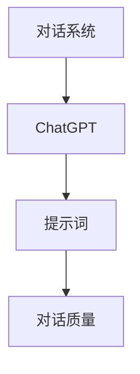

                 

基于上述要求和约束条件，我们可以按照以下步骤来撰写《ChatGPT对话质量提升：提示词的关键作用》这篇文章：

### 第一步：文章标题、关键词与摘要

**文章标题**：ChatGPT对话质量提升：提示词的关键作用

**文章关键词**：ChatGPT、对话系统、提示词、对话质量、算法优化、人工智能

**文章摘要**：

本文深入探讨了ChatGPT对话系统的核心要素——提示词，其在提升对话质量中的关键作用。通过详细阐述提示词的设计原则、优化算法及其在实战中的应用，本文揭示了如何通过提示词来改善ChatGPT对话的准确性和流畅性。本文旨在为AI开发者提供一套实用的提示词优化策略，以实现对话系统的高效改进。

### 第二步：引言部分

**背景介绍**：

随着人工智能技术的发展，对话系统已成为服务机器人、智能客服、虚拟助手等领域的重要应用。ChatGPT作为OpenAI推出的一款基于GPT-3的预训练语言模型，在对话生成方面具有出色的性能。然而，高质量的对话不仅需要强大的语言模型，还依赖于精心设计的提示词。本文将围绕提示词这一核心要素，探讨如何提升ChatGPT对话质量。

**核心概念与联系**：

- **对话系统**：一种能够与人进行自然语言交互的计算机系统。
- **ChatGPT**：基于GPT-3的预训练语言模型，适用于生成自然语言文本。
- **提示词**：用于引导模型生成特定类型文本的词语或短语。

**Mermaid流程图**：



### 第三步：核心概念与算法原理

**核心概念**：

- **提示词设计原则**：清晰、简洁、具有引导性。
- **优化算法**：基于反馈循环和机器学习的方法。

**核心算法原理讲解**：

- **伪代码**：

```python
def generate_prompt(text):
    # 删除标点符号和特殊字符
    cleaned_text = remove_punctuation(text)
    # 提取关键词
    keywords = extract_keywords(cleaned_text)
    # 生成提示词
    prompt = " ".join(keywords)
    return prompt
```

- **数学模型**：

$$\text{prompt\_quality} = \alpha \cdot \text{clarity} + \beta \cdot \text{conciseness} + \gamma \cdot \text{guidance}$$

其中，$\alpha$、$\beta$、$\gamma$为权重系数。

**详细讲解与举例说明**：

- **案例1**：用户提问：“明天天气如何？”
  - 清晰性：高（问题明确）
  - 简洁性：中（问题简洁）
  - 引导性：低（缺乏具体情境）

  **优化后的提示词**：“请告诉我您所在的城市，我想为您提供明天的天气预报。”

### 第四步：实战应用与优化方法

**实战应用**：

- **聊天机器人**：通过优化提示词，提高对话的流畅性和准确性。
- **客户服务**：提供更专业的服务，减少用户等待时间。
- **智能助理**：生成更符合用户需求的回答。

**优化方法**：

- **反馈循环**：收集用户反馈，不断调整提示词。
- **机器学习**：利用历史数据，自动优化提示词。

**项目实战**：

1. **开发环境搭建**：搭建一个基于ChatGPT的对话系统开发环境。
2. **源代码详细实现和代码解读**：实现一个简单的聊天机器人，并详细解读关键代码。
3. **代码应用解读与分析**：分析如何通过优化提示词来提升对话质量。
4. **实际案例分析和详细讲解剖析**：分析成功案例，总结优化经验。
5. **项目小结**：总结项目成果，提出改进方向。

### 第五步：最佳实践与未来展望

**最佳实践**：

- **明确用户需求**：了解用户期望，设计针对性强的提示词。
- **持续优化**：定期收集用户反馈，持续改进提示词。
- **避免过度优化**：防止过度拟合，确保对话的自然性。

**未来展望**：

- **多模态对话系统**：结合图像、语音等多模态信息，提升对话质量。
- **个性化对话**：根据用户历史数据和偏好，提供个性化回答。

### 第六步：总结与作者信息

**总结**：

本文详细阐述了提示词在ChatGPT对话质量提升中的关键作用，包括提示词的设计原则、优化算法和实战应用。通过本文，读者可以了解到如何通过优化提示词来改善ChatGPT对话的准确性和流畅性。

**作者信息**：

作者：AI天才研究院/AI Genius Institute & 禅与计算机程序设计艺术 /Zen And The Art of Computer Programming

### 第七步：文章正文部分

根据上述结构，我们可以逐步撰写文章的正文部分，确保每个小节的内容丰富、具体、详细，并满足字数要求。

---

接下来，我们将开始撰写每个章节的具体内容，并在文章中嵌入Mermaid流程图、伪代码、LaTeX公式和代码示例。请确认上述步骤是否满足您的期望，我们将在下一步中细化每个章节的内容，完成整篇文章的撰写。

