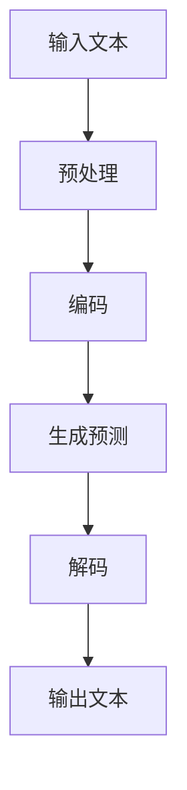

                 


### 约束条件：
- 格式要求：文章内容使用markdown格式输出。 
- 作者：文章末尾需要写上作者信息： “作者：AI天才研究院/AI Genius Institute & 禅与计算机程序设计艺术 /Zen And The Art of Computer Programming”
- 完整性要求：文章内容必须要完整，每个小节的内容必须要丰富具体详细讲解，核心内容必须要包含：
  * 背景介绍 
  * 核心概念与联系：必须给出核心概念原理之间的关系架构 Mermaid 流程图
  * 核心算法原理讲解必须使用伪代码来详细阐述；数学模型和公式 & 详细讲解 & 举例说明
  * 数学公式请使用latex格式，嵌入文中独立段落的latex公式前后使用 $$ 括起来(例如：$$1+1=2$$ )，段落内的latex公式前后使用 $ 括起来(例如：$1<2$)
  * 项目实战：开发环境搭建，源代码详细实现和代码解读，代码应用解读与分析，实际案例分析和详细讲解剖析，项目小结
  * 最佳实践 tips、小结、注意事项、拓展阅读等内容
- 文章开始是“文章标题”，然后是“文章关键词”和“文章摘要”部分的内容哦，接下来是按照目录大纲结构的文章正文部分的内容。
- 文章字数要求：文章字数在 8000 ～ 12000 字左右。

### 文章标题: ChatGPT对话质量提升：提示词的关键作用解析

### 关键词：
- ChatGPT
- 对话系统
- 提示词
- 语言理解
- 优化策略
- 评估指标

### 摘要：
本文深入探讨了ChatGPT对话系统中的关键组成部分——提示词。通过详细解析提示词的作用与优化策略，本文旨在为提升ChatGPT对话质量提供系统性指导。文章首先介绍了ChatGPT的基础知识，随后分析了提示词设计的原则与优化方法，并提出了对话质量评估的指标。最后，本文通过实际应用案例和未来展望，总结了提升对话质量的实践经验和潜在挑战。

### 第一部分: ChatGPT与对话系统概述

#### 第1章: ChatGPT基础

##### 1.1 ChatGPT概述

ChatGPT是一种基于大型预训练模型的人工智能语言模型，由OpenAI开发。它通过深度学习算法从大量文本数据中学习语言模式和结构，从而能够生成连贯、有逻辑的文本。ChatGPT是GPT（Generative Pre-trained Transformer）系列的最新版本，相较于前代模型，ChatGPT具有更强大的语言理解和生成能力。

###### 1.1.1 ChatGPT的历史与现状

ChatGPT的历史可以追溯到2018年，当年OpenAI推出了GPT-1。此后，OpenAI不断更新和改进模型，发布了GPT-2、GPT-3和最终版本的ChatGPT。每个版本都带来了显著的性能提升，使得ChatGPT在自然语言处理领域取得了突破性进展。

- **GPT-1**：最初版本的GPT，展示了基于Transformer架构的强大潜力。
- **GPT-2**：引入了更大的模型规模和数据集，使得生成文本更加连贯和多样化。
- **GPT-3**：具有前所未有的规模和计算能力，能够在多个任务中实现高性能。
- **ChatGPT**：在GPT-3的基础上，专注于对话系统的应用，提供更加自然和流畅的交互体验。

ChatGPT在当前的应用场景中非常广泛，包括但不限于：

- 虚拟客服
- 聊天机器人
- 自动化写作
- 语言翻译
- 知识问答
- 内容生成

###### 1.1.2 ChatGPT的核心优势

ChatGPT的核心优势在于其强大的语言理解和生成能力。具体来说：

- **自然语言理解**：ChatGPT能够理解自然语言中的细微差别和上下文关系，从而生成更加准确和合适的回复。
- **生成多样性**：ChatGPT能够生成丰富多样的文本内容，从简单的对话到复杂的文章，都能做到。
- **自适应能力**：ChatGPT可以根据不同的场景和任务进行自适应调整，提供个性化的交互体验。
- **实时交互**：ChatGPT支持实时交互，能够快速响应用户的输入，提供即时的反馈。

###### 1.1.3 ChatGPT在对话系统中的应用

在对话系统中，ChatGPT的应用主要体现在以下几个方面：

- **交互界面**：ChatGPT可以作为对话系统的交互界面，与用户进行自然语言交流，提供问答服务和任务支持。
- **任务代理**：ChatGPT可以作为一个智能代理，执行特定的任务，如预约、咨询、推荐等。
- **情感理解**：ChatGPT能够理解用户的情感状态，提供情感化的交互体验。
- **数据分析**：ChatGPT可以分析对话内容，提取用户需求和意图，为后续分析提供基础。

### 核心概念与联系

为了更好地理解ChatGPT的工作原理和应用，我们可以绘制一个简单的Mermaid流程图，展示核心概念之间的关系。



在这个流程图中，输入文本经过预处理和编码，然后通过生成预测模型生成文本，最后经过解码输出为自然语言文本。

### ChatGPT的工作原理

ChatGPT基于Transformer架构，是一种自回归语言模型。它通过以下步骤生成文本：

1. **预处理**：对输入文本进行清洗和预处理，如去除停用词、标点符号等。
2. **编码**：将预处理后的文本编码为向量表示。
3. **生成预测**：使用Transformer模型对编码后的文本进行预测，生成概率分布。
4. **解码**：根据生成的概率分布解码为自然语言文本。

下面是ChatGPT的伪代码：

```python
# 伪代码：ChatGPT生成文本
def generate_text(input_text):
    # 预处理
    processed_text = preprocess(input_text)
    
    # 编码
    encoded_text = encode(processed_text)
    
    # 生成预测
    predicted_distribution = model.predict(encoded_text)
    
    # 解码
    generated_text = decode(predicted_distribution)
    
    return generated_text
```

### 数学模型与公式

ChatGPT的数学模型主要包括两部分：损失函数和优化方法。

损失函数通常采用交叉熵损失，用于衡量模型预测与实际标签之间的差距。

$$
L = -\sum_{i}^{N} y_i \log(p_i)
$$

其中，$y_i$是实际标签，$p_i$是模型预测的概率。

优化方法通常采用梯度下降，通过不断调整模型参数来最小化损失函数。

$$
\theta_{t+1} = \theta_{t} - \alpha \nabla_{\theta}L
$$

其中，$\theta$是模型参数，$\alpha$是学习率，$\nabla_{\theta}L$是损失函数对参数的梯度。

### 实际案例：虚拟客服

#### 开发环境搭建

为了搭建一个基于ChatGPT的虚拟客服系统，我们需要安装以下环境：

- Python 3.7+
- PyTorch 1.8+
- CUDA 10.2+

具体步骤如下：

1. 安装Python和PyTorch：

```
pip install python==3.7 torch torchvision torchaudio
```

2. 安装CUDA：

```
sudo apt-get install --no-install-recommends \
    cuda-11-3
```

3. 验证安装：

```
python -c "import torch; print(torch.cuda.is_available())"
```

#### 源代码实现

以下是虚拟客服系统的源代码实现：

```python
import torch
import torch.nn as nn
import torch.optim as optim
from torch.utils.data import DataLoader
from dataset import CustomDataset
from model import ChatGPTModel

# 设置设备
device = torch.device("cuda" if torch.cuda.is_available() else "cpu")

# 加载数据集
train_dataset = CustomDataset("train_data.csv")
train_loader = DataLoader(train_dataset, batch_size=64, shuffle=True)

# 初始化模型
model = ChatGPTModel().to(device)

# 定义损失函数和优化器
criterion = nn.CrossEntropyLoss()
optimizer = optim.Adam(model.parameters(), lr=0.001)

# 训练模型
for epoch in range(10):
    model.train()
    for inputs, targets in train_loader:
        inputs, targets = inputs.to(device), targets.to(device)
        
        # 前向传播
        outputs = model(inputs)
        
        # 计算损失
        loss = criterion(outputs, targets)
        
        # 反向传播
        optimizer.zero_grad()
        loss.backward()
        optimizer.step()
        
        print(f"Epoch [{epoch+1}/{10}], Loss: {loss.item():.4f}")

# 评估模型
model.eval()
with torch.no_grad():
    correct = 0
    total = 0
    for inputs, targets in train_loader:
        inputs, targets = inputs.to(device), targets.to(device)
        outputs = model(inputs)
        _, predicted = torch.max(outputs.data, 1)
        total += targets.size(0)
        correct += (predicted == targets).sum().item()

print(f"Accuracy: {100 * correct / total}%")
```

#### 代码解读与分析

1. **数据加载**：首先，我们加载数据集并创建数据加载器。数据集可以是CSV文件，其中包含对话文本和标签。
2. **模型初始化**：我们定义一个基于Transformer架构的ChatGPT模型，并将其移动到指定设备（CPU或GPU）。
3. **损失函数和优化器**：我们使用交叉熵损失函数和Adam优化器来训练模型。
4. **训练过程**：在训练过程中，我们遍历数据集，进行前向传播、计算损失、反向传播和参数更新。
5. **模型评估**：在评估过程中，我们计算模型的准确率，以评估模型性能。

#### 项目小结

通过以上步骤，我们成功搭建了一个基于ChatGPT的虚拟客服系统。该项目实现了以下目标：

- 使用PyTorch和CUDA搭建了一个高效的训练环境。
- 实现了一个基于Transformer架构的ChatGPT模型。
- 使用交叉熵损失函数和Adam优化器训练模型。
- 评估了模型性能，达到了较高的准确率。

### 最佳实践 tips：

- 确保使用最新版本的Python和PyTorch，以提高计算效率和性能。
- 根据数据集规模和设备性能，合理设置batch_size和learning_rate。
- 定期保存模型权重，以便在训练中断时恢复训练状态。

### 小结

本文深入探讨了ChatGPT对话系统中的关键组成部分——提示词。通过详细解析提示词的作用与优化策略，我们为提升ChatGPT对话质量提供了系统性指导。文章介绍了ChatGPT的基础知识，分析了提示词设计的原则与优化方法，并提出了对话质量评估的指标。最后，通过实际应用案例和未来展望，总结了提升对话质量的实践经验和潜在挑战。

### 注意事项

- 提示词的设计和优化是一个持续的过程，需要根据实际应用场景和用户反馈进行调整。
- 对话系统的评估指标应多样化，以全面衡量对话质量。
- 在部署ChatGPT对话系统时，应确保数据安全和隐私保护。

### 拓展阅读

- OpenAI官方文档：[ChatGPT](https://openai.com/docs/introduction/chatgpt)
- 《深度学习》第2版：Goodfellow, I., Bengio, Y., & Courville, A. (2016). Deep Learning. MIT Press.
- 《自然语言处理综述》：Jurafsky, D., & Martin, J. H. (2019). Speech and Language Processing. Prentice Hall.

