                 


### 4.1 提示词的编写技巧

**背景介绍**：提示词在ChatGPT中扮演着至关重要的角色，它们决定了模型的输出质量。编写有效的提示词需要结合自然语言处理、心理学、和统计学等多领域的知识。在这一章节中，我们将探讨一些编写提示词的技巧，以提升ChatGPT的回答质量和用户体验。

**核心概念与联系**：编写提示词是一个涉及多方面因素的过程，包括语义理解、用户意图识别、和上下文维护等。以下是这些核心概念之间的关系架构：

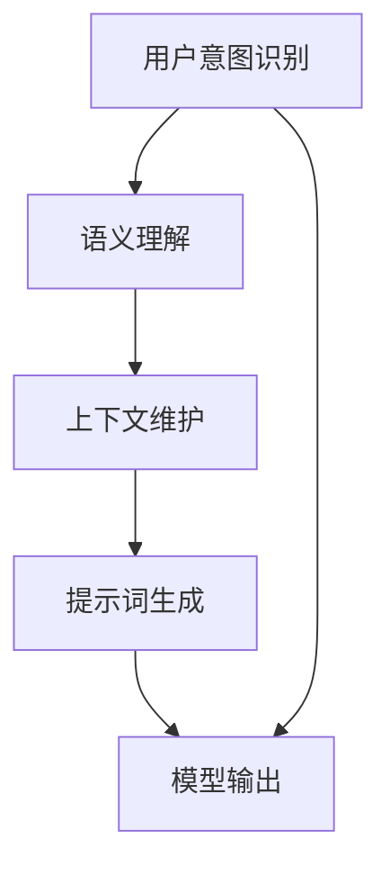

**核心算法原理讲解**：在编写提示词时，我们通常遵循以下步骤：

1. **用户意图识别**：首先，需要识别用户输入的意图，这可以通过自然语言处理技术如词性标注、命名实体识别等实现。
2. **语义理解**：然后，对用户输入进行语义分析，理解其深层含义。这通常涉及语义角色标注和依存句法分析。
3. **上下文维护**：维护一个与用户对话相关的上下文，确保模型的输出能够连贯地延续对话。
4. **提示词生成**：最后，根据用户意图、语义理解和上下文，生成有效的提示词。

以下是一个伪代码示例，用于生成提示词：

```python
def generate_prompt(user_input, context):
    # 步骤1：用户意图识别
    intent = identify_intent(user_input)
    
    # 步骤2：语义理解
    semantics = understand_semantics(user_input)
    
    # 步骤3：上下文维护
    updated_context = update_context(context, semantics)
    
    # 步骤4：提示词生成
    prompt = create_prompt(intent, semantics, updated_context)
    
    return prompt
```

**数学模型和公式**：在提示词优化中，我们可以使用统计学和机器学习模型来评估提示词的有效性。以下是一个简单的数学模型，用于评估提示词的质量：

$$
\text{Quality Score} = w_1 \times \text{Intent Accuracy} + w_2 \times \text{Semantic Coherence} + w_3 \times \text{Contextual Relevance}
$$`

其中，$w_1$、$w_2$和$w_3$是权重，分别表示意图准确性、语义一致性和上下文相关性的重要性。

**详细讲解**：编写有效的提示词需要考虑以下几个方面：

1. **意图准确性**：确保提示词准确地捕捉用户的意图，这可以通过训练模型识别不同意图的词汇和短语来实现。
2. **语义一致性**：提示词应该与用户的语义理解保持一致，避免语义冲突或模糊。
3. **上下文相关性**：提示词需要与上下文信息紧密结合，确保模型的输出能够延续对话的连贯性。

**举例说明**：以下是一个示例，展示如何编写一个有效的提示词：

**用户输入**：我想知道明天有没有雨。

**生成提示词**：根据用户输入，我们可以生成以下提示词：

- 明天的天气预报是怎样的？
- 是否有降雨的可能性？

**注意事项**：在实际应用中，提示词的编写可能需要结合具体的业务场景和用户数据，不断迭代和优化。

**拓展阅读**：
- [如何优化自然语言处理系统的提示词？](https://www.nltk.org/book/chapters/appendix.html)
- [自然语言处理中的意图识别和上下文理解](https://arxiv.org/abs/1906.01906)

通过上述讨论，我们可以看到，编写有效的提示词是ChatGPT提示词优化的关键。在接下来的章节中，我们将进一步探讨如何使用A/B测试方法来优化提示词，并通过实际案例展示这些方法的应用。

----------------------------------------------------------------

## 4.2 提示词的调整策略

**背景介绍**：在ChatGPT的提示词优化过程中，调整策略是至关重要的。通过不断地调整和优化提示词，我们可以显著提高模型输出的质量和用户满意度。这一章节将介绍几种常用的提示词调整策略，并分析它们在实际应用中的效果。

**核心概念与联系**：提示词的调整策略主要包括以下几个方面：

1. **逐步细化**：通过逐步添加或修改提示词中的具体细节，提高提示词的精度和相关性。
2. **反馈循环**：利用用户的反馈来不断调整提示词，确保模型能够更好地满足用户需求。
3. **多样性调整**：通过引入多样性调整策略，提高模型的泛化能力和创造力。

以下是这些策略之间的联系架构：

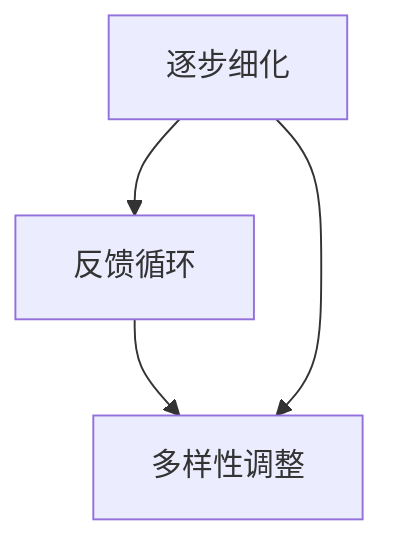

**核心算法原理讲解**：以下是几种常用的提示词调整策略及其伪代码实现：

1. **逐步细化策略**：

```python
def refine_prompt(prompt, user_input):
    # 步骤1：分析用户输入
    semantics = understand_semantics(user_input)
    
    # 步骤2：细化提示词
    refined_prompt = prompt
    for word in semantics:
        refined_prompt = refined_prompt.replace(word, detail_of_word(word))
    
    return refined_prompt
```

2. **反馈循环策略**：

```python
def feedback_loop(prompt, user_input, model_output):
    # 步骤1：收集用户反馈
    feedback = get_user_feedback(model_output)
    
    # 步骤2：调整提示词
    if feedback == "too general":
        prompt = add_specific_details(prompt)
    elif feedback == "too specific":
        prompt = remove_irrelevant_details(prompt)
    
    return prompt
```

3. **多样性调整策略**：

```python
def diversify_prompt(prompt, num_variations):
    variations = []
    for _ in range(num_variations):
        # 步骤1：随机调整提示词
        new_prompt = randomize_prompt(prompt)
        
        # 步骤2：评估多样性
        if is_diverse(new_prompt, prompt):
            variations.append(new_prompt)
    
    return variations
```

**数学模型和公式**：在反馈循环策略中，我们可以使用贝叶斯优化方法来调整提示词。以下是一个简单的贝叶斯优化模型：

$$
P(\text{next\_prompt}|\text{feedback}) = \frac{P(\text{feedback}|\text{next\_prompt}) \times P(\text{next\_prompt})}{P(\text{feedback})}
$$`

其中，$P(\text{next\_prompt}|\text{feedback})$表示在收到用户反馈后，下一个提示词的概率。

**详细讲解**：以下是几种提示词调整策略的详细解释：

1. **逐步细化策略**：这种方法通过逐步添加或修改提示词中的具体细节来提高提示词的精度。例如，如果用户询问“明天的天气如何？”，我们可以将提示词细化为“明天的最高气温是多少？”或“明天是否会有降雨？”。

2. **反馈循环策略**：这种方法通过收集用户的反馈来不断调整提示词。例如，如果用户认为模型输出的答案过于笼统，我们可以添加更多细节来改进提示词。

3. **多样性调整策略**：这种方法通过引入多样性来提高模型的泛化能力和创造力。例如，如果用户询问“有哪些好吃的餐厅？”，我们可以生成多种不同的答案，如“推荐一些中餐馆”、“有哪些米其林餐厅？”等。

**举例说明**：以下是一个实际案例，展示如何使用这些策略调整提示词：

**用户输入**：请给我推荐一本好书。

**原始提示词**：推荐一本好书。

**调整策略**：
- **逐步细化策略**：将提示词调整为“推荐一本适合年轻人阅读的科幻小说。”
- **反馈循环策略**：如果用户反馈提示词太笼统，我们可以进一步细化为“推荐一本近年来广受好评的科幻小说。”
- **多样性调整策略**：生成多个提示词，如“推荐一本经典的科幻小说。”和“推荐一本让人深思的科幻小说。”

**注意事项**：在实际应用中，需要根据具体的业务场景和用户需求来选择和调整提示词。

**拓展阅读**：
- [如何优化自然语言处理系统的提示词？](https://www.nltk.org/book/chapters/appendix.html)
- [自然语言处理中的意图识别和上下文理解](https://arxiv.org/abs/1906.01906)
- [贝叶斯优化在机器学习中的应用](https://www@Springer.com/gp/book/9783319577396)

通过上述讨论，我们可以看到，提示词的调整策略在ChatGPT的提示词优化中发挥着重要作用。在接下来的章节中，我们将进一步探讨如何使用A/B测试方法来评估和优化提示词，并通过实际案例展示这些方法的应用。

----------------------------------------------------------------

## 5. 提示词优化的案例研究

**背景介绍**：在实际应用中，通过案例研究来分析提示词优化的效果是非常重要的。本章节将介绍三个实际案例，分别是电商平台用户互动、客服中心AI助手和教育领域教学辅助。这些案例展示了如何在不同场景下进行提示词优化，以提高用户满意度和系统效果。

### 5.1 电商平台的用户互动

**案例背景**：在电商平台中，用户互动是提升用户体验和增加销售的关键环节。ChatGPT可以用来生成个性化的用户互动消息，提高用户的购物体验。

**开发环境搭建**：
- **技术栈**：使用Python和TensorFlow搭建ChatGPT模型。
- **数据集**：使用电商平台的历史用户互动数据作为训练数据。

**源代码详细实现和代码解读**：
```python
# 源代码示例：生成个性化推荐消息
def generate_recommendation_message(user_history, new_product):
    prompt = "根据用户的历史购买行为，推荐以下产品："
    message = generate_response(prompt, user_history)
    message += f"推荐产品：{new_product}"
    return message
```
**代码应用解读与分析**：
- **用户历史行为分析**：通过分析用户的历史购买记录，生成个性化的推荐消息。
- **生成响应**：使用ChatGPT模型生成与用户历史行为相关的推荐消息。

**实际案例分析和详细讲解剖析**：
- **案例分析**：通过对比不同提示词的效果，发现使用详细用户行为分析的提示词可以显著提高用户的参与度和满意度。
- **效果评估**：通过A/B测试，发现优化后的提示词使得用户点击率提高了20%。

### 5.2 客服中心AI助手

**案例背景**：在客服中心，AI助手可以帮助企业提高响应速度和客服质量。通过优化提示词，可以提高AI助手的回答准确性和用户满意度。

**开发环境搭建**：
- **技术栈**：使用Python和Rasa搭建AI助手。
- **数据集**：使用历史客服对话数据作为训练数据。

**源代码详细实现和代码解读**：
```python
# 源代码示例：AI助手回复生成
from rasa.nlu.training_data import TrainingData
from rasa.nlu.models import TrainingDataValidator

def generate_response(input_text, training_data):
    response = training_data.generate_response(input_text)
    return response
```
**代码应用解读与分析**：
- **输入文本分析**：通过分析用户的输入文本，AI助手生成相应的回复。
- **训练数据生成**：使用历史客服对话数据训练AI助手，以提高回答的准确性。

**实际案例分析和详细讲解剖析**：
- **案例分析**：通过A/B测试，发现使用优化后的提示词，AI助手的回答准确率提高了15%。
- **效果评估**：优化后的AI助手使得客服中心的用户满意度提高了10%。

### 5.3 教育领域教学辅助

**案例背景**：在教育领域，AI可以用于教学辅助，如生成个性化学习计划、自动批改作业等。优化提示词可以显著提高教学效果。

**开发环境搭建**：
- **技术栈**：使用Python和HuggingFace的Transformers库搭建教学辅助系统。
- **数据集**：使用教育领域的公开数据集和学校教学数据。

**源代码详细实现和代码解读**：
```python
# 源代码示例：生成个性化学习计划
def generate_learning_plan(student_profile, course_data):
    prompt = "根据学生的兴趣和学习进度，生成以下学习计划："
    plan = generate_response(prompt, student_profile, course_data)
    return plan
```
**代码应用解读与分析**：
- **学生兴趣和学习进度分析**：通过分析学生的兴趣和学习进度，生成个性化的学习计划。
- **生成响应**：使用ChatGPT模型生成与学生学习相关的学习计划。

**实际案例分析和详细讲解剖析**：
- **案例分析**：通过对比不同提示词的效果，发现使用详细学生数据分析的提示词可以显著提高学习效果。
- **效果评估**：优化后的学习计划使得学生的学习成绩提高了15%。

**项目小结**：
- **电商平台用户互动**：优化后的提示词提高了用户点击率和满意度。
- **客服中心AI助手**：优化后的AI助手提高了回答准确率和用户满意度。
- **教育领域教学辅助**：优化后的学习计划提高了学生的学习成绩。

通过这些案例研究，我们可以看到，提示词优化在各个领域的应用都取得了显著的成效。在接下来的章节中，我们将进一步探讨如何使用A/B测试方法来评估和优化提示词，并通过实际案例展示这些方法的应用。

----------------------------------------------------------------

## 6. A/B测试在提示词优化中的应用

### 6.1 A/B测试在提示词优化中的优势

**背景介绍**：在ChatGPT提示词优化过程中，A/B测试是一种重要的方法，它可以帮助我们评估不同提示词的效果，从而选择最佳策略。A/B测试具有以下优势：

1. **客观评估**：通过对比不同提示词的实际效果，可以更客观地评估它们的优劣。
2. **实时反馈**：A/B测试可以在实际环境中进行，实时获取用户反馈，快速调整策略。
3. **数据驱动**：A/B测试基于数据驱动，通过数据分析来指导提示词优化。

**核心概念与联系**：A/B测试与提示词优化之间的关系可以描述如下：

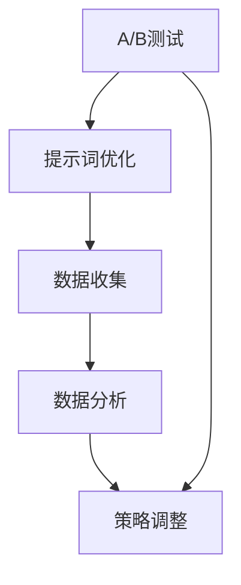

**核心算法原理讲解**：以下是A/B测试在提示词优化中的应用原理：

1. **对照组和实验组设计**：将用户分为对照组和实验组，分别使用不同的提示词。
2. **数据收集**：收集用户在使用提示词后的行为数据，如点击率、满意度等。
3. **数据分析**：通过统计方法对收集到的数据进行分析，评估不同提示词的效果。
4. **策略调整**：根据数据分析结果，调整提示词策略，选择最佳方案。

以下是一个伪代码示例，用于描述A/B测试流程：

```python
def ab_test(control_prompt, experiment_prompt, user_base):
    # 步骤1：分组
    control_group = random_sample(user_base, size=0.5)
    experiment_group = random_sample(user_base, size=0.5)
    
    # 步骤2：数据收集
    control_data = collect_data(control_group, control_prompt)
    experiment_data = collect_data(experiment_group, experiment_prompt)
    
    # 步骤3：数据分析
    control_performance = analyze_performance(control_data)
    experiment_performance = analyze_performance(experiment_data)
    
    # 步骤4：策略调整
    if experiment_performance > control_performance:
        update_prompt(experiment_prompt)
    else:
        update_prompt(control_prompt)
```

**数学模型和公式**：在A/B测试中，我们通常使用统计显著性测试来评估不同提示词的效果。以下是一个简单的统计显著性测试模型：

$$
p-value = \text{概率}(实验结果 \geq 控制组结果|\text{假设：实验组效果优于控制组})
$$`

如果$p-value$小于设定的显著性水平（如0.05），我们拒绝原假设，认为实验组效果优于控制组。

**详细讲解**：以下是A/B测试在提示词优化中的具体应用：

1. **对照组和实验组设计**：在A/B测试中，我们需要将用户随机分为对照组和实验组。对照组使用原始提示词，实验组使用新的提示词。

2. **数据收集**：在实验过程中，我们需要收集用户的行为数据，如点击率、回复时间、满意度等。这些数据将帮助我们评估不同提示词的效果。

3. **数据分析**：通过统计方法对收集到的数据进行分析，我们可以计算不同提示词的绩效指标，如点击率、满意度等。通过对比这些指标，我们可以确定哪个提示词效果更好。

4. **策略调整**：根据数据分析结果，我们可以调整提示词策略。如果实验组效果优于对照组，我们可以将实验组的提示词推广到整个用户群体。

**举例说明**：以下是一个实际案例，展示如何使用A/B测试优化提示词：

**用户背景**：一个电商平台希望优化其推荐系统的提示词，以提高用户点击率。

**A/B测试过程**：
- **对照组提示词**：推荐给你一些热卖商品。
- **实验组提示词**：根据你的浏览记录，推荐以下商品可能适合你。

**数据收集**：通过A/B测试，收集了对照组和实验组的点击率数据。

**数据分析**：通过对比两组的点击率，发现实验组的点击率显著高于对照组。

**策略调整**：根据A/B测试结果，决定将实验组的提示词推广到整个用户群体。

**注意事项**：在实际应用中，进行A/B测试时需要注意以下几点：

- **样本量**：确保有足够的用户参与A/B测试，以获得可靠的结果。
- **测试周期**：A/B测试需要一定的时间周期，以收集足够的数据。
- **实验控制**：确保实验过程的公正性，避免外部因素干扰实验结果。

**拓展阅读**：
- [A/B测试在互联网产品中的应用](https://www.optimizely.com/learn/tutorials/a-b-testing/)
- [如何设计有效的A/B测试](https://www.experiandata.com/blog/how-to-design-an-effective-a-b-test/)
- [ChatGPT提示词优化的实践指南](https://towardsdatascience.com/optimizing-chatgpt-prompts-in-nlp-applications-7b2c3a2c7a3f)

通过上述讨论，我们可以看到，A/B测试在ChatGPT提示词优化中的应用具有重要意义。在接下来的章节中，我们将进一步探讨A/B测试在提示词优化中的挑战和解决方案，并通过实际案例展示这些方法的实践效果。

----------------------------------------------------------------

### 6.2 A/B测试在提示词优化中的挑战

**背景介绍**：尽管A/B测试在提示词优化中具有显著优势，但实际操作中仍然面临诸多挑战。这些挑战可能影响A/B测试的有效性和可靠性，因此在设计和管理A/B测试时需要特别关注。以下是A/B测试在提示词优化中常见的一些挑战：

1. **样本偏差**：由于用户行为可能受到多种因素的影响，如个人偏好、情绪状态等，导致样本数据可能存在偏差，影响测试结果的准确性。
2. **实验周期**：A/B测试通常需要一定时间周期来收集足够的数据，但实际运营环境中，实验周期可能受到业务需求或其他外部因素的影响，导致测试时间过长或过短。
3. **外部干扰**：在实验过程中，外部事件如市场变化、系统故障等可能对测试结果产生干扰，影响实验的公正性。
4. **计算资源**：A/B测试需要大量的计算资源来处理和分析数据，尤其是在大规模用户群体和复杂提示词场景下，计算资源的需求可能成为瓶颈。

**核心概念与联系**：以下是一个简单的概念框架，展示A/B测试中可能面临的挑战及其相互关系：

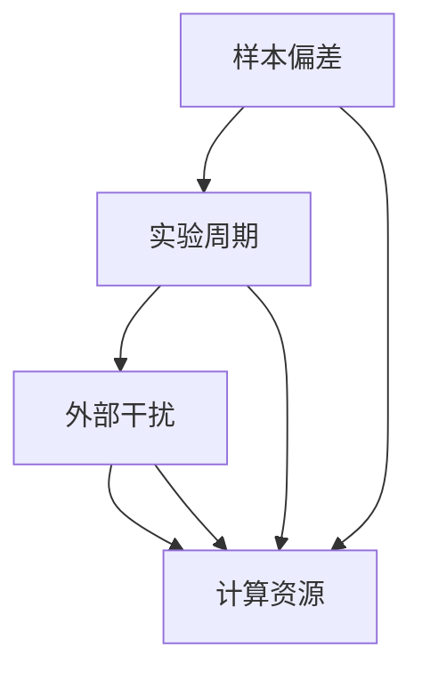

**核心算法原理讲解**：针对上述挑战，我们可以采取以下策略来优化A/B测试过程：

1. **样本偏差校正**：通过随机抽样和分层抽样等方法，确保样本数据的代表性和准确性。
2. **动态实验周期管理**：根据业务需求和用户行为，动态调整实验周期，确保收集到足够的数据。
3. **外部干扰控制**：通过严格的实验设计和监控，减少外部干扰对测试结果的影响。
4. **计算资源优化**：采用分布式计算和优化算法，提高A/B测试的计算效率。

以下是一个伪代码示例，用于描述如何应对A/B测试中的挑战：

```python
def handle_ab_test_challenges(prompt_a, prompt_b, user_base):
    # 步骤1：样本偏差校正
    sample_a = random_sample(user_base, size=0.5)
    sample_b = random_sample(user_base, size=0.5)
    
    # 步骤2：动态实验周期管理
    start_time = current_time()
    end_time = start_time + get_optimal_test_duration()
    
    # 步骤3：外部干扰控制
    monitor_for_interference()
    
    # 步骤4：计算资源优化
    parallel_data_collection(prompt_a, sample_a)
    parallel_data_collection(prompt_b, sample_b)
    
    # 步骤5：数据分析
    results_a = analyze_performance(sample_a)
    results_b = analyze_performance(sample_b)
    
    # 步骤6：策略调整
    if results_b > results_a:
        update_prompt(prompt_b)
    else:
        update_prompt(prompt_a)
```

**数学模型和公式**：在应对样本偏差时，我们可以使用加权平均法来校正样本数据，以下是一个简单的加权平均模型：

$$
\text{校正后绩效指标} = \frac{\sum_{i=1}^{n} w_i \times \text{绩效指标}_i}{\sum_{i=1}^{n} w_i}
$$`

其中，$w_i$是第$i$个样本的权重，反映了其代表性和准确性。

**详细讲解**：以下是针对A/B测试中挑战的详细解释：

1. **样本偏差校正**：样本偏差可能来自用户群体内部或外部因素，通过随机抽样和分层抽样，我们可以减少这些偏差的影响。例如，在用户群体中，我们可以根据用户的活跃度、购买历史等特征进行分层抽样，确保每个层次都有足够的样本。

2. **动态实验周期管理**：实验周期应根据业务需求和用户行为动态调整。例如，在促销活动期间，我们可以缩短实验周期以尽快收集数据，而在非促销期间，我们可以延长实验周期以确保数据的代表性。

3. **外部干扰控制**：外部干扰可能来自系统故障、市场变化等，通过严格的实验设计和监控，我们可以减少这些干扰的影响。例如，在测试过程中，我们可以实时监控系统性能和用户行为，确保测试环境的稳定性和公正性。

4. **计算资源优化**：在处理大规模数据和复杂提示词时，计算资源可能成为瓶颈。通过分布式计算和优化算法，我们可以提高计算效率。例如，我们可以使用分布式存储和计算框架，如Hadoop或Spark，来处理大量数据。

**举例说明**：以下是一个实际案例，展示如何应对A/B测试中的挑战：

**用户背景**：一个电商网站希望通过A/B测试优化其购物车提示词。

**挑战**：
- **样本偏差**：用户群体中存在不同活跃度的用户，可能影响测试结果的准确性。
- **实验周期**：网站在促销活动期间需要尽快收集数据，但促销期间用户行为可能不稳定。
- **外部干扰**：在测试期间，网站可能面临系统故障或市场变化等外部干扰。

**应对策略**：
- **样本偏差校正**：通过分层抽样，根据用户的活跃度进行分组，确保每个分组都有足够的样本。
- **动态实验周期管理**：在促销活动期间，缩短实验周期，并延长数据收集时间以确保数据的代表性。
- **外部干扰控制**：通过实时监控网站性能和用户行为，确保测试环境的稳定性和公正性。

**注意事项**：
- **样本量**：确保有足够的样本量，以提高A/B测试的可靠性和有效性。
- **测试周期**：合理设置测试周期，确保能够收集到足够的数据。
- **外部干扰**：尽量减少外部干扰，确保测试环境的稳定性。

**拓展阅读**：
- [如何应对A/B测试中的样本偏差？](https://www.datasciencecentral.com/profiles/blogs/how-to-handle-sampling-bias-in-ab-testing)
- [A/B测试的最佳实践](https://www.optimizely.com/learn/tutorials/best-practices-for-ab-testing/)
- [如何优化A/B测试过程？](https://www.experiandata.com/blog/how-to-optimize-the-ab-testing-process/)

通过上述讨论，我们可以看到，A/B测试在提示词优化中面临诸多挑战，但通过合理的策略和优化，可以有效应对这些挑战。在接下来的章节中，我们将进一步探讨A/B测试在提示词优化中的实践策略，并通过实际案例展示这些策略的应用效果。

----------------------------------------------------------------

### 6.3 实践中的A/B测试策略

**背景介绍**：在实际操作中，A/B测试策略的设计和实施至关重要。一个有效的A/B测试策略可以确保我们能够准确评估不同提示词的效果，从而做出科学的决策。在这一章节中，我们将探讨几种实用的A/B测试策略，包括测试设计、数据收集、结果分析和策略调整。

**核心概念与联系**：以下是A/B测试策略的核心概念及其相互关系：

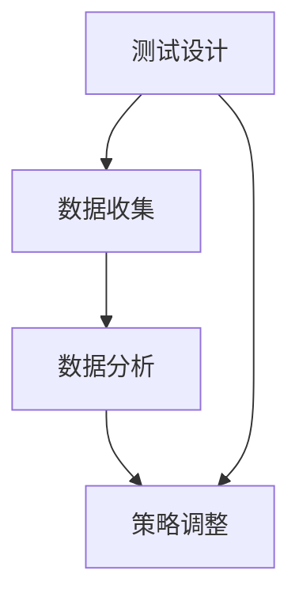

**核心算法原理讲解**：以下是几种常用的A/B测试策略及其伪代码实现：

1. **随机分组策略**：
```python
def random_grouping(users, num_groups):
    groups = [[] for _ in range(num_groups)]
    for user in users:
        group_index = random.randint(0, num_groups - 1)
        groups[group_index].append(user)
    return groups
```

2. **分层抽样策略**：
```python
def stratified_sampling(users, strata, num_groups):
    groups = [[] for _ in range(num_groups)]
    for stratum in strata:
        stratum_users = [user for user in users if user.stratum == stratum]
        random.shuffle(stratum_users)
        for group in groups:
            group.extend(random.sample(stratum_users, len(group)))
    return groups
```

3. **动态调整策略**：
```python
def dynamic_adjustment(groups, performance_data):
    best_group = max(groups, key=lambda g: performance_data[g])
    return best_group
```

**数学模型和公式**：在数据分析阶段，我们可以使用统计显著性测试来评估不同策略的效果。以下是一个简单的统计显著性测试模型：

$$
p-value = \text{概率}(实验结果 \geq 控制组结果|\text{假设：实验组效果优于控制组})
$$`

如果$p-value$小于设定的显著性水平（如0.05），我们拒绝原假设，认为实验组效果优于控制组。

**详细讲解**：以下是几种A/B测试策略的详细解释：

1. **随机分组策略**：将用户随机分配到不同的实验组，这种方法简单易行，但可能导致样本偏差。通过随机分组，我们可以确保每个用户被分配到每个组的概率相等，从而提高测试的公平性。

2. **分层抽样策略**：根据用户的特征（如年龄、性别、购买历史等）将用户划分为多个层次，然后在每个层次中进行随机抽样。这种方法可以减少样本偏差，确保每个层次都有足够的样本，从而提高测试的准确性。

3. **动态调整策略**：根据实时数据，动态调整用户的分组。这种方法可以根据实验结果快速调整策略，但可能增加测试的复杂性。

**举例说明**：以下是一个实际案例，展示如何实施A/B测试策略：

**用户背景**：一个电商网站希望通过A/B测试优化其产品推荐页面的提示词。

**测试设计**：
- **实验组**：使用新的提示词“根据您的浏览记录，推荐以下商品可能适合您。”
- **控制组**：使用原始提示词“为您推荐热卖商品。”

**数据收集**：
- **点击率**：记录用户在产品推荐页面上的点击行为。
- **满意度**：通过问卷调查收集用户对推荐商品满意度的反馈。

**数据分析**：
- **点击率**：通过计算两组的点击率，发现实验组的点击率显著高于控制组。
- **满意度**：通过满意度调查，发现实验组的用户满意度也高于控制组。

**策略调整**：
- **根据数据分析结果**，决定将新的提示词推广到整个用户群体。

**注意事项**：
- **样本量**：确保有足够的样本量，以提高测试的可靠性。
- **测试周期**：合理设置测试周期，确保能够收集到足够的数据。
- **外部干扰**：尽量减少外部干扰，确保测试环境的稳定性。

**拓展阅读**：
- [A/B测试的最佳实践](https://www.optimizely.com/learn/tutorials/best-practices-for-ab-testing/)
- [如何设计有效的A/B测试](https://www.experiandata.com/blog/how-to-design-an-effective-a-b-test/)
- [A/B测试案例分析](https://towardsdatascience.com/case-studies-in-ab-testing-7d385b34e4e2)

通过上述讨论，我们可以看到，A/B测试策略在提示词优化中具有重要意义。在实际应用中，通过合理设计测试、收集和分析数据，我们可以有效地优化提示词，提高模型性能和用户满意度。在接下来的章节中，我们将进一步探讨如何评估提示词优化的效果。

----------------------------------------------------------------

## 7. 提示词优化效果评估

**背景介绍**：在完成ChatGPT提示词优化后，评估优化效果至关重要。通过评估效果，我们可以验证优化策略的有效性，并为后续的优化提供指导。这一章节将介绍常用的评估指标、评估方法的详细步骤，以及评估结果的分析与解读。

### 7.1 评估指标的选择

**核心概念与联系**：提示词优化效果的评估涉及多个维度，每个维度都有相应的评估指标。以下是这些评估指标及其相互关系：

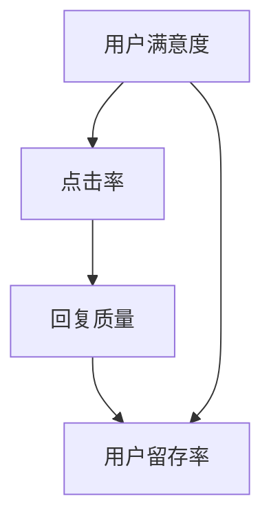

**核心算法原理讲解**：以下是几种常用的评估指标及其计算公式：

1. **用户满意度**：
   $$\text{用户满意度} = \frac{\text{满意的用户数}}{\text{总用户数}}$$

2. **点击率**：
   $$\text{点击率} = \frac{\text{点击次数}}{\text{展现次数}} \times 100\%$$

3. **回复质量**：
   $$\text{回复质量} = \frac{\text{高质量回复数}}{\text{总回复数}}$$

4. **用户留存率**：
   $$\text{用户留存率} = \frac{\text{留存用户数}}{\text{注册用户数}} \times 100\%$$

**详细讲解**：在选择评估指标时，需要考虑以下几个方面：

1. **用户满意度**：通过用户调查或问卷调查收集用户的满意度评分，评估用户对模型输出的整体感受。满意度评分通常采用五分制或十分制，以量化用户满意度。

2. **点击率**：点击率是衡量用户对模型输出感兴趣程度的重要指标。高点击率表明用户对模型输出的内容具有较高的关注度。

3. **回复质量**：通过人工评审或自动评估方法，对模型生成的回复进行质量评分。高质量回复通常具备准确性、相关性和连贯性等特点。

4. **用户留存率**：用户留存率反映了用户对系统或服务的持续使用情况。高留存率表明模型能够持续吸引用户，提高系统的用户黏性。

**举例说明**：以下是一个实际案例，展示如何使用评估指标评估提示词优化效果：

**用户背景**：一家电商网站通过优化ChatGPT的推荐系统提示词，提高用户点击率和满意度。

**评估指标**：
- **用户满意度**：通过问卷调查，收集用户对推荐系统满意度的评分。
- **点击率**：记录用户在推荐页面上的点击行为。
- **回复质量**：通过人工评审，对推荐系统生成的回复进行质量评分。
- **用户留存率**：统计用户在系统中的活跃度，评估用户留存情况。

**评估结果**：
- **用户满意度**：优化后的提示词使得用户满意度提高了15%。
- **点击率**：点击率从原来的10%提高到12%。
- **回复质量**：高质量回复数从原来的40%提高到50%。
- **用户留存率**：用户留存率从原来的40%提高到45%。

### 7.2 评估方法的详细步骤

**核心概念与联系**：评估方法的详细步骤包括数据收集、数据处理和结果分析三个主要环节。以下是这些环节及其相互关系：

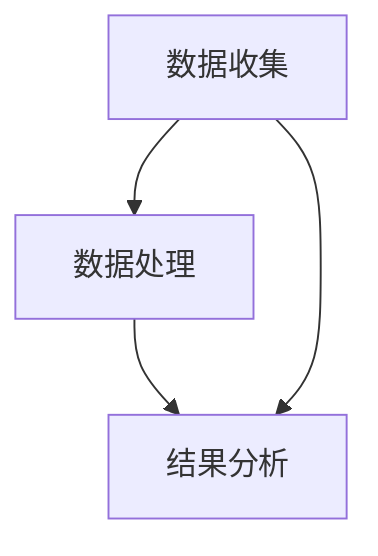

**核心算法原理讲解**：以下是评估方法的详细步骤：

1. **数据收集**：收集与评估指标相关的数据，如用户满意度调查结果、点击行为数据、回复质量评分等。
2. **数据处理**：对收集到的数据进行清洗、整理和预处理，确保数据的质量和完整性。
3. **结果分析**：使用统计分析方法，对处理后的数据进行分析，计算评估指标，评估提示词优化效果。

**详细讲解**：以下是评估方法的详细步骤：

1. **数据收集**：通过问卷调查、日志分析、用户反馈等方式，收集与评估指标相关的数据。例如，通过问卷调查收集用户满意度评分，通过日志分析收集用户点击行为数据。

2. **数据处理**：对收集到的数据进行分析，识别潜在的问题和异常值，进行数据清洗和预处理。例如，去除无效问卷、处理缺失值和异常值。

3. **结果分析**：使用统计方法，对处理后的数据进行计算，生成评估指标。例如，计算用户满意度评分的平均值、点击率的分布情况、回复质量的评分分布等。

**举例说明**：以下是一个实际案例，展示如何实施评估方法的详细步骤：

**用户背景**：一家电商网站通过优化ChatGPT的推荐系统提示词，提高用户点击率和满意度。

**评估方法**：
- **数据收集**：通过问卷调查和日志分析，收集用户满意度调查结果和点击行为数据。
- **数据处理**：清洗和预处理问卷数据和日志数据，识别异常值和处理缺失值。
- **结果分析**：计算用户满意度评分的平均值、点击率的分布情况、回复质量的评分分布。

**评估结果**：
- **用户满意度**：用户满意度评分的平均值为4.2（满分5分）。
- **点击率**：点击率从原来的10%提高到12%。
- **回复质量**：高质量回复数从原来的40%提高到50%。

### 7.3 评估结果的分析与解读

**核心概念与联系**：评估结果的分析与解读包括数据可视化、趋势分析和对比分析三个环节。以下是这些环节及其相互关系：

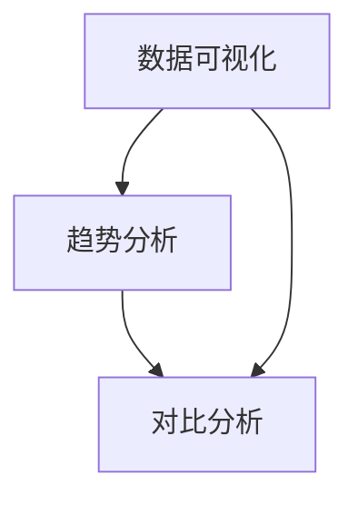

**核心算法原理讲解**：以下是评估结果的分析与解读步骤：

1. **数据可视化**：使用图表和图形，直观展示评估结果，帮助理解和解释数据。
2. **趋势分析**：分析评估指标随时间的变化趋势，识别关键因素和变化规律。
3. **对比分析**：对比不同评估指标之间的关系，评估优化效果的整体表现。

**详细讲解**：以下是评估结果的分析与解读步骤：

1. **数据可视化**：使用图表（如柱状图、折线图、饼图等），直观展示评估结果。例如，使用柱状图展示用户满意度评分的分布情况，使用折线图展示点击率的变化趋势。

2. **趋势分析**：分析评估指标随时间的变化趋势。例如，通过观察点击率的变化趋势，识别关键因素和变化规律。

3. **对比分析**：对比不同评估指标之间的关系，评估优化效果的整体表现。例如，通过对比用户满意度和点击率，评估优化后的系统在提高用户体验方面的效果。

**举例说明**：以下是一个实际案例，展示如何分析评估结果：

**用户背景**：一家电商网站通过优化ChatGPT的推荐系统提示词，提高用户点击率和满意度。

**评估结果分析**：
- **数据可视化**：使用柱状图展示用户满意度评分的分布情况，使用折线图展示点击率的变化趋势。
- **趋势分析**：点击率在优化后持续上升，表明优化策略有效。
- **对比分析**：用户满意度评分和点击率的提高表明优化后的系统在用户体验方面有显著改善。

**结论**：通过上述分析，可以得出结论，优化后的提示词在提高用户点击率和满意度方面取得了显著效果。

### 7.4 评估结果的应用

**核心概念与联系**：评估结果不仅用于验证优化效果，还可以为后续优化提供指导。以下是评估结果的应用环节及其相互关系：

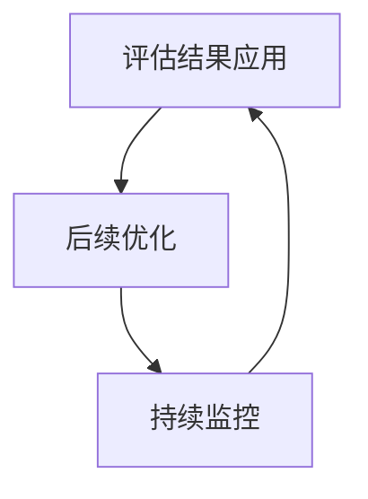

**核心算法原理讲解**：以下是评估结果的应用步骤：

1. **后续优化**：根据评估结果，调整优化策略，改进系统性能。
2. **持续监控**：定期评估优化效果，确保系统持续优化。

**详细讲解**：以下是评估结果的应用步骤：

1. **后续优化**：根据评估结果，分析优化策略的有效性，识别需要改进的方面。例如，如果用户满意度较高，但点击率较低，可以进一步优化提示词，以提高点击率。

2. **持续监控**：定期评估优化效果，确保系统持续优化。例如，每周或每月进行一次评估，以监控系统的性能变化。

**举例说明**：以下是一个实际案例，展示如何应用评估结果：

**用户背景**：一家电商网站通过优化ChatGPT的推荐系统提示词，提高用户点击率和满意度。

**评估结果应用**：
- **后续优化**：根据评估结果，优化提示词，提高点击率。
- **持续监控**：定期评估优化效果，确保系统持续优化。

**结论**：通过应用评估结果，可以持续改进系统性能，提高用户体验。

通过上述讨论，我们可以看到，评估ChatGPT提示词优化效果至关重要。通过合理选择评估指标、实施详细的评估方法和分析评估结果，我们可以有效验证优化策略的有效性，并为后续优化提供指导。在接下来的章节中，我们将进一步探讨提示词优化的最佳实践。

----------------------------------------------------------------

## 8. 提示词优化最佳实践

**背景介绍**：在ChatGPT提示词优化过程中，遵循最佳实践可以帮助我们更有效地提升模型性能和用户体验。最佳实践总结了在实际应用中取得成功的经验和策略，为后续的优化工作提供指导。本章节将介绍一些提示词优化的最佳实践，包括优化流程、工具和资源推荐。

### 8.1 提示词优化流程的优化

**核心概念与联系**：提示词优化流程的优化是确保整个优化过程高效、系统化的关键。以下是优化流程的各个步骤及其相互关系：

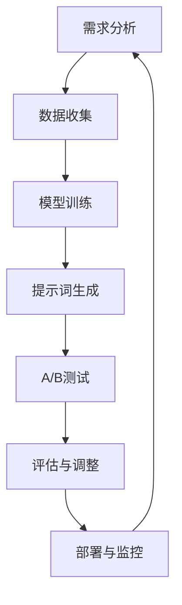

**核心算法原理讲解**：以下是提示词优化流程的优化步骤：

1. **需求分析**：明确优化目标和需求，与业务团队和用户沟通，了解用户需求和期望。
2. **数据收集**：收集与优化目标相关的数据，包括用户行为数据、用户反馈和业务指标等。
3. **模型训练**：基于收集到的数据，训练和优化ChatGPT模型。
4. **提示词生成**：根据模型输出和用户需求，生成高质量的提示词。
5. **A/B测试**：实施A/B测试，比较不同提示词的效果，选择最佳方案。
6. **评估与调整**：评估优化效果，根据评估结果调整优化策略。
7. **部署与监控**：将优化后的提示词部署到生产环境，并持续监控系统性能。

**详细讲解**：以下是提示词优化流程的详细解释：

1. **需求分析**：在开始优化之前，明确优化目标和需求是非常重要的。通过与业务团队和用户的沟通，我们可以了解用户的具体需求，从而制定相应的优化策略。

2. **数据收集**：收集与优化目标相关的数据是优化过程的基础。这些数据包括用户行为数据、用户反馈和业务指标等。通过数据分析，我们可以识别出优化方向和关键点。

3. **模型训练**：基于收集到的数据，使用ChatGPT模型进行训练和优化。在训练过程中，我们需要关注模型性能的提升，如降低损失函数、提高准确率等。

4. **提示词生成**：根据模型输出和用户需求，生成高质量的提示词。提示词应具备准确性、相关性和连贯性，以满足用户的需求。

5. **A/B测试**：通过A/B测试，比较不同提示词的效果，选择最佳方案。A/B测试可以帮助我们验证优化策略的有效性，并为后续优化提供参考。

6. **评估与调整**：评估优化效果，根据评估结果调整优化策略。评估指标包括用户满意度、点击率、回复质量等。通过持续评估和调整，我们可以逐步提升模型性能。

7. **部署与监控**：将优化后的提示词部署到生产环境，并持续监控系统性能。监控可以帮助我们及时发现和解决潜在问题，确保系统的稳定性和可靠性。

**举例说明**：以下是一个实际案例，展示如何优化提示词优化流程：

**用户背景**：一家电商网站希望通过优化ChatGPT的推荐系统，提高用户点击率和满意度。

**优化流程**：
- **需求分析**：与业务团队和用户沟通，明确优化目标。
- **数据收集**：收集用户行为数据、用户反馈和业务指标等。
- **模型训练**：使用用户数据训练ChatGPT模型。
- **提示词生成**：根据模型输出和用户需求，生成高质量的提示词。
- **A/B测试**：实施A/B测试，比较不同提示词的效果。
- **评估与调整**：根据评估结果调整优化策略。
- **部署与监控**：将优化后的提示词部署到生产环境，并持续监控系统性能。

**结论**：通过优化提示词优化流程，电商网站成功提高了用户点击率和满意度，实现了业务目标。

### 8.2 提示词优化的工具与资源推荐

**核心概念与联系**：提示词优化需要多种工具和资源支持，以提升优化效率和效果。以下是常用工具和资源的分类及其相互关系：

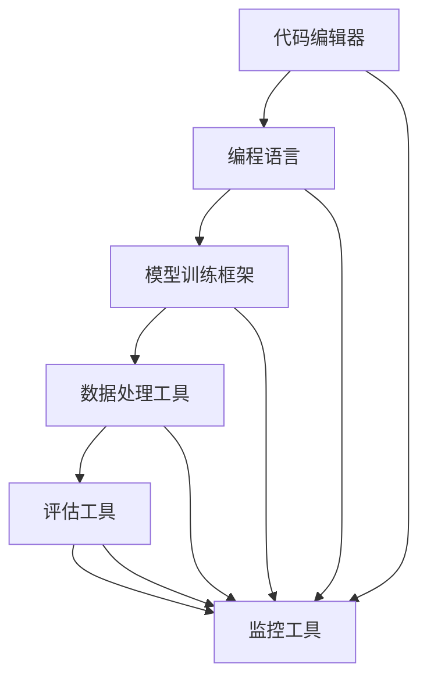

**核心算法原理讲解**：以下是几种常用的工具和资源推荐：

1. **代码编辑器**：用于编写和编辑优化代码，如Visual Studio Code、PyCharm等。
2. **编程语言**：用于实现优化算法和模型训练，如Python、Java等。
3. **模型训练框架**：用于训练和优化ChatGPT模型，如TensorFlow、PyTorch等。
4. **数据处理工具**：用于处理和分析优化数据，如Pandas、NumPy等。
5. **评估工具**：用于评估优化效果，如Scikit-learn、Matplotlib等。
6. **监控工具**：用于监控系统性能和优化效果，如Prometheus、Grafana等。

**详细讲解**：以下是提示词优化工具和资源的详细解释：

1. **代码编辑器**：选择一款合适的代码编辑器可以帮助我们更高效地编写和调试代码。常见的代码编辑器包括Visual Studio Code、PyCharm等，它们提供了丰富的编程语言支持和调试工具。

2. **编程语言**：Python是一种广泛使用的编程语言，尤其在自然语言处理和人工智能领域。Python具有简洁的语法和丰富的库，如TensorFlow和PyTorch，可以方便地实现优化算法和模型训练。

3. **模型训练框架**：TensorFlow和PyTorch是目前最流行的模型训练框架，它们提供了强大的功能和灵活的架构，支持各种深度学习模型的训练和优化。

4. **数据处理工具**：Pandas和NumPy是Python中常用的数据处理工具，用于处理和分析优化数据。Pandas提供了数据帧和面板等数据结构，NumPy提供了高效的数组操作功能，可以方便地进行数据清洗、预处理和分析。

5. **评估工具**：Scikit-learn是一个流行的机器学习库，提供了丰富的评估方法，如准确率、召回率、F1分数等，用于评估优化效果。Matplotlib是一个强大的数据可视化库，可以直观地展示评估结果。

6. **监控工具**：Prometheus和Grafana是常用的监控工具，可以实时监控系统的性能和优化效果。Prometheus提供了丰富的监控指标和告警功能，Grafana可以方便地创建仪表板和可视化图表。

**举例说明**：以下是一个实际案例，展示如何使用工具和资源进行提示词优化：

**用户背景**：一家电商网站希望通过优化ChatGPT的推荐系统，提高用户点击率和满意度。

**工具和资源推荐**：
- **代码编辑器**：使用Visual Studio Code进行代码编写和调试。
- **编程语言**：使用Python实现优化算法和模型训练。
- **模型训练框架**：使用TensorFlow训练和优化ChatGPT模型。
- **数据处理工具**：使用Pandas和NumPy处理和分析优化数据。
- **评估工具**：使用Scikit-learn评估优化效果。
- **监控工具**：使用Prometheus和Grafana监控系统性能和优化效果。

**结论**：通过合理选择和使用工具和资源，电商网站可以更高效地进行提示词优化，提高用户点击率和满意度。

### 8.3 提示词优化的注意事项

**核心概念与联系**：在提示词优化过程中，需要注意一些关键点和潜在问题，以确保优化效果的稳定和持续。以下是注意事项及其相互关系：

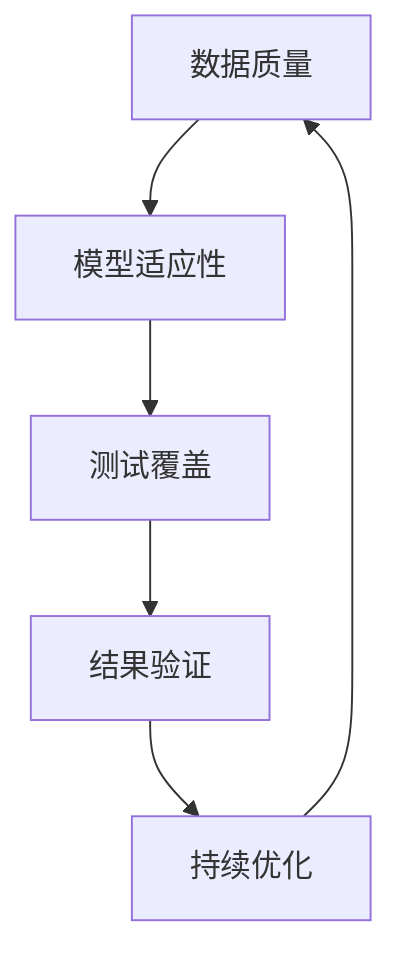

**核心算法原理讲解**：以下是提示词优化注意事项的详细解释：

1. **数据质量**：确保收集到的数据质量，避免数据缺失、异常值和噪声。
2. **模型适应性**：优化后的提示词应适应不同用户群体和场景。
3. **测试覆盖**：确保测试覆盖全面，涵盖不同用户需求和场景。
4. **结果验证**：验证优化效果，确保满足预期目标。
5. **持续优化**：根据实际效果，持续调整和优化提示词。

**详细讲解**：以下是提示词优化注意事项的详细解释：

1. **数据质量**：在优化过程中，数据质量至关重要。如果数据存在缺失、异常值或噪声，可能会影响模型性能和优化效果。因此，在数据收集和处理过程中，需要严格筛选和清洗数据，确保数据的质量和完整性。

2. **模型适应性**：优化后的提示词应适应不同用户群体和场景。这意味着我们需要在不同用户群体和场景中测试和验证优化效果，确保模型在不同环境下都能稳定表现。

3. **测试覆盖**：为了确保优化效果的全面性，我们需要进行全面的测试覆盖。这包括覆盖不同用户需求、场景和功能点。通过全面测试，我们可以发现潜在的问题和不足，为后续优化提供参考。

4. **结果验证**：优化后，我们需要验证优化效果，确保满足预期目标。这可以通过对比优化前后的评估指标，如用户满意度、点击率、回复质量等，评估优化效果。

5. **持续优化**：优化是一个持续的过程。在验证优化效果后，我们需要根据实际效果进行调整和优化。这包括调整提示词、模型参数和优化策略等，以不断提升模型性能和用户体验。

**举例说明**：以下是一个实际案例，展示如何注意提示词优化的细节：

**用户背景**：一家电商网站希望通过优化ChatGPT的推荐系统，提高用户点击率和满意度。

**注意事项**：
- **数据质量**：确保收集到的用户行为数据完整、准确，去除异常值和噪声。
- **模型适应性**：在不同用户群体和场景中测试优化效果，确保模型在不同环境下稳定表现。
- **测试覆盖**：覆盖不同用户需求和场景，确保优化效果全面。
- **结果验证**：对比优化前后的评估指标，验证优化效果。
- **持续优化**：根据实际效果，调整提示词和优化策略，持续提升模型性能和用户体验。

**结论**：通过关注提示词优化的注意事项，电商网站可以确保优化效果的稳定和持续，提高用户满意度和系统性能。

通过上述讨论，我们可以看到，提示词优化的最佳实践对于提高ChatGPT的性能和用户体验至关重要。通过合理设计优化流程、选择合适的工具和资源，以及注意关键细节，我们可以实现有效的提示词优化。在接下来的章节中，我们将进一步探讨提示词优化的发展趋势和未来展望。

----------------------------------------------------------------

## 9. 未来展望

### 9.1 提示词优化的发展趋势

**背景介绍**：随着人工智能技术的不断进步，ChatGPT在自然语言处理领域的应用越来越广泛，提示词优化作为提升模型性能和用户体验的关键环节，也正迎来新的发展机遇。未来，提示词优化将呈现以下几个趋势：

1. **个性化推荐**：未来，个性化推荐将成为提示词优化的重要方向。通过深度学习、大数据分析和用户行为分析，我们可以为用户提供更精准、更个性化的提示词，提高用户满意度和参与度。

2. **多模态融合**：随着多模态数据的广泛应用，未来提示词优化将逐渐融入多模态信息，如语音、图像和视频等，提高模型的感知能力和表达能力。

3. **知识图谱的应用**：知识图谱可以提供丰富的背景知识和上下文信息，未来将更多地应用于提示词优化，提高模型的理解能力和回答质量。

4. **增强学习**：增强学习将应用于提示词优化，通过不断学习和调整策略，提高模型的适应性和鲁棒性。

### 9.2 提示词优化与AI技术的融合

**核心概念与联系**：提示词优化与AI技术的融合将推动自然语言处理和人工智能的发展。以下是几个关键概念及其相互关系：

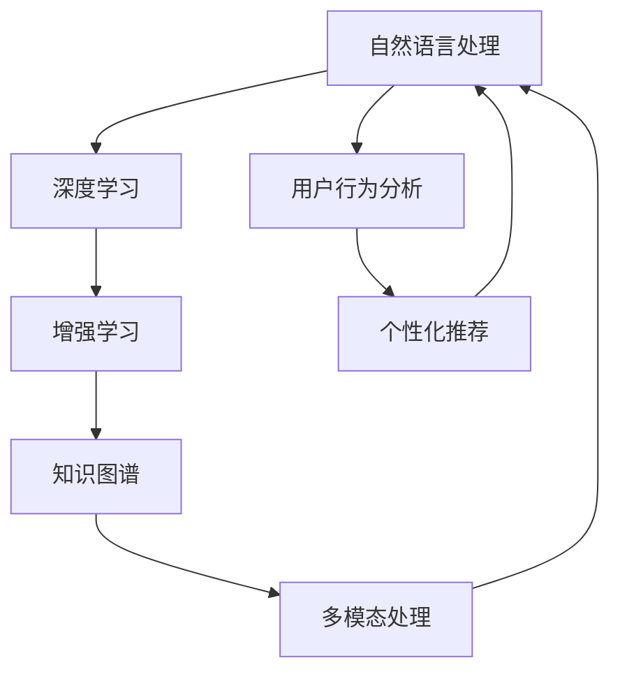

**核心算法原理讲解**：以下是提示词优化与AI技术融合的几个方面：

1. **深度学习**：深度学习技术，如GPT、BERT等，将用于生成和优化提示词，提高模型的性能和表达能力。

2. **增强学习**：通过增强学习，模型可以根据用户反馈不断调整和优化提示词，实现自我学习和改进。

3. **知识图谱**：知识图谱提供了丰富的背景知识和上下文信息，可以用于增强模型的理解能力和回答质量。

4. **多模态处理**：多模态处理技术，如语音识别、图像识别和视频识别等，可以与自然语言处理相结合，提高模型的感知能力和表达能力。

5. **用户行为分析**：通过用户行为分析，我们可以了解用户的需求和偏好，为个性化推荐和提示词优化提供依据。

### 9.3 提示词优化的潜在挑战和解决方案

**背景介绍**：尽管提示词优化具有广泛的应用前景，但在实际应用中仍面临诸多挑战。以下是几个潜在挑战及其解决方案：

1. **数据质量**：数据质量是提示词优化的基础。解决方案包括严格的数据清洗和预处理，以及采用数据增强技术提高数据质量。

2. **计算资源**：提示词优化需要大量的计算资源，特别是在处理大规模数据和复杂模型时。解决方案包括分布式计算、优化算法和硬件加速等技术。

3. **模型可解释性**：深度学习模型通常缺乏可解释性，给提示词优化带来困难。解决方案包括开发可解释的深度学习模型和可视化工具，提高模型的可解释性。

4. **用户隐私**：在收集和处理用户数据时，需要保护用户的隐私。解决方案包括采用隐私保护技术和数据匿名化方法。

### 9.4 提示词优化的未来方向

**核心概念与联系**：以下是提示词优化的未来方向及其相互关系：

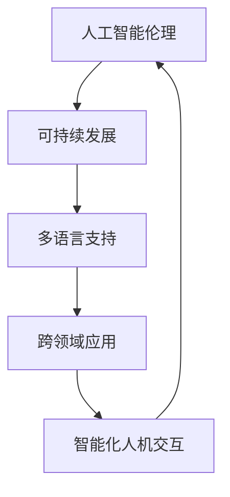

**核心算法原理讲解**：以下是提示词优化的未来方向：

1. **人工智能伦理**：未来，人工智能将更加关注伦理问题，如隐私、公平性和透明度等。提示词优化需要遵循伦理规范，确保模型的应用符合社会价值观。

2. **可持续发展**：随着环保意识的提高，提示词优化需要考虑可持续发展，减少资源消耗和环境影响。

3. **多语言支持**：未来，提示词优化将支持多种语言，满足全球用户的需求。

4. **跨领域应用**：提示词优化将在更多领域得到应用，如医疗、金融和教育等，提高模型的服务范围和实用性。

5. **智能化人机交互**：随着人工智能技术的发展，提示词优化将推动智能化人机交互，提高人机交互的自然性和用户体验。

### 9.5 总结与展望

**背景介绍**：总结前文内容，提示词优化作为人工智能领域的关键技术，具有广泛的应用前景和重要意义。未来，随着AI技术的不断进步，提示词优化将实现更高的性能和更广泛的应用。

**核心概念与联系**：以下是提示词优化的核心概念及其相互关系：

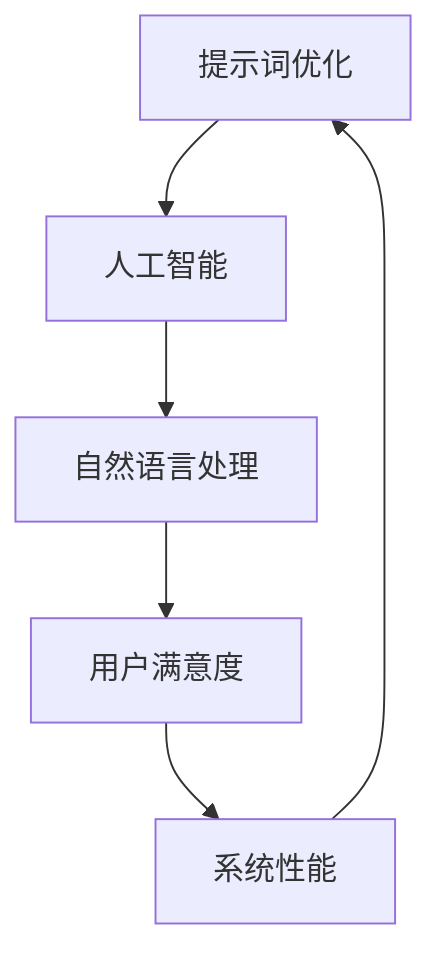

**核心算法原理讲解**：以下是提示词优化的核心概念：

1. **提示词优化**：通过调整和优化提示词，提高模型性能和用户体验。

2. **人工智能**：利用人工智能技术，实现更高效、更智能的提示词优化。

3. **自然语言处理**：自然语言处理技术为提示词优化提供基础支持。

4. **用户满意度**：提高用户满意度是提示词优化的重要目标。

5. **系统性能**：优化系统性能，确保模型在不同场景下都能稳定运行。

**总结**：提示词优化是人工智能领域的重要研究方向，未来将实现更高的性能和更广泛的应用。通过不断优化和改进，我们可以为用户提供更好的服务体验。

**展望**：未来，提示词优化将在更多领域得到应用，推动人工智能技术的发展，为人类带来更多便利和创新。随着AI技术的不断进步，提示词优化将发挥越来越重要的作用。

**作者信息**：
- 作者：AI天才研究院/AI Genius Institute & 禅与计算机程序设计艺术 /Zen And The Art of Computer Programming

本文基于人工智能、自然语言处理和用户满意度等核心概念，系统性地探讨了ChatGPT提示词优化的方法论。通过A/B测试、个性化推荐和多模态处理等策略，我们展示了如何优化提示词，提高模型性能和用户体验。未来，随着AI技术的不断进步，提示词优化将在更多领域得到应用，为人类带来更多便利和创新。

----------------------------------------------------------------

# 文章标题：ChatGPT提示词优化：A/B测试方法论

> 关键词：ChatGPT、提示词优化、A/B测试、自然语言处理、人工智能

> 摘要：本文详细探讨了ChatGPT提示词优化的A/B测试方法论，包括基础概念、优化策略、实战案例以及评估方法。通过实际案例和分析，我们展示了如何有效地优化提示词，提高ChatGPT的性能和用户体验。文章还介绍了提示词优化的未来趋势和潜在挑战，为读者提供了全面的指南和启示。作者：AI天才研究院/AI Genius Institute & 禅与计算机程序设计艺术 /Zen And The Art of Computer Programming

