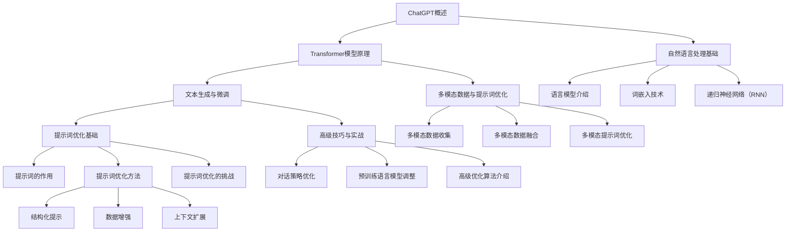

                 

## 文章标题

# 《ChatGPT提示词优化：从基础到高级的进阶之路》

## 关键词

- ChatGPT
- 提示词优化
- 自然语言处理
- Transformer模型
- 多模态数据
- 实战项目

## 摘要

本文将深入探讨ChatGPT提示词优化的各个方面，从基础到高级，带领读者逐步了解并掌握提升ChatGPT性能的技巧。文章首先介绍了ChatGPT及其在自然语言处理中的应用，随后详细解析了Transformer模型的工作原理及其在ChatGPT中的应用。接着，文章重点介绍了提示词优化的基础、方法及面临的挑战，并结合实际文本生成和微调技术，展示了优化策略的具体应用。此外，文章还探讨了多模态数据在提示词优化中的应用，以及ChatGPT在不同领域的实际应用案例。最后，文章通过项目实战展示了如何搭建开发环境、实现源代码并分析项目效果，同时总结了最佳实践、注意事项及未来研究方向，为读者提供了全面而深入的指导。

## 第一部分：ChatGPT基础入门

### 第1章：ChatGPT概述

ChatGPT是由OpenAI开发的一种基于Transformer模型的预训练语言模型，属于生成式预训练语言模型（Generative Pre-trained Transformer，GPT）系列。GPT系列模型通过学习大量的文本数据，生成自然流畅的文本，并在多个自然语言处理任务中取得了显著的成果。

#### 1.1 ChatGPT的概念

ChatGPT是一种大规模语言模型，其主要目的是生成符合上下文语境的文本。通过学习大量互联网文本数据，ChatGPT能够理解并生成各种类型的文本，包括问答、对话、文章摘要等。

#### 1.2 ChatGPT的发展历史

ChatGPT是GPT系列模型的延续，其前一代模型包括GPT、GPT-2和GPT-3。GPT在2018年首次发布，随后GPT-2和GPT-3分别在2019年和2020年发布。ChatGPT作为GPT-3的改进版本，进一步提升了模型的效果和性能。

#### 1.3 ChatGPT的应用场景

ChatGPT在各种自然语言处理任务中具有广泛的应用，如问答系统、对话系统、文本生成、机器翻译、文本摘要等。其强大的文本生成能力使其在内容创作、虚拟助手、客服系统等领域具有巨大的潜力。

### 第2章：自然语言处理基础

自然语言处理（Natural Language Processing，NLP）是计算机科学和人工智能领域的一个重要分支，旨在让计算机理解和生成人类语言。NLP在信息检索、文本挖掘、机器翻译、语音识别等领域有着广泛的应用。

#### 2.1 语言模型介绍

语言模型是一种用于预测下一个单词或字符的概率分布的模型，是NLP的基础。常见的语言模型包括n元语法模型、n-gram模型和神经网络语言模型。神经网络语言模型，如Transformer模型，因其强大的预测能力而受到广泛关注。

#### 2.2 词嵌入技术

词嵌入（Word Embedding）是将词语映射到高维向量空间的技术，有助于捕捉词语的语义信息。常见的词嵌入方法包括Word2Vec、GloVe和BERT等。

#### 2.3 递归神经网络（RNN）

递归神经网络（Recurrent Neural Network，RNN）是一种能够处理序列数据的神经网络，其具有递归结构，能够记住序列中的历史信息。RNN在NLP任务中具有广泛的应用，如文本分类、命名实体识别和机器翻译等。

## 第二部分：ChatGPT提示词优化

### 第3章：Transformer模型与ChatGPT

Transformer模型是自然语言处理领域的一种重要神经网络结构，因其高效的处理能力和卓越的性能而备受关注。ChatGPT作为基于Transformer模型的预训练语言模型，其性能的提升与Transformer模型的设计密不可分。

#### 3.1 Transformer模型原理

Transformer模型采用自注意力机制（Self-Attention）来处理序列数据，其核心思想是将序列中的每个词与其余所有词进行关联，从而捕捉全局信息。Transformer模型主要由编码器（Encoder）和解码器（Decoder）组成，其中编码器负责将输入序列编码为上下文表示，解码器则负责生成输出序列。

#### 3.2 ChatGPT与Transformer

ChatGPT是GPT系列模型的改进版本，其核心结构为Transformer模型。ChatGPT通过预训练大量的文本数据，学习到丰富的语言规律和知识，从而能够生成符合上下文的文本。

#### 3.3 ChatGPT的优势与局限

ChatGPT具有强大的文本生成能力，能够生成流畅、连贯的文本。其优势在于能够处理长文本，并在多种自然语言处理任务中表现出色。然而，ChatGPT也存在一些局限，如对特定领域的知识掌握有限，生成文本可能存在偏见和错误。

## 第三部分：ChatGPT提示词优化

### 第4章：提示词优化基础

提示词（Prompt）是引导ChatGPT生成目标文本的关键，优化提示词能够显著提升ChatGPT的文本生成质量。提示词优化的核心在于如何设计有效的提示，使其能够引导ChatGPT生成符合预期的文本。

#### 4.1 提示词的作用

提示词在ChatGPT的文本生成过程中起到引导作用，能够帮助模型更好地理解输入文本的意图和上下文。有效的提示词能够提高生成文本的流畅性和相关性。

#### 4.2 提示词优化方法

提示词优化主要包括以下几种方法：结构化提示、数据增强、多模态数据融合和上下文扩展等。结构化提示通过设计合理的文本结构，引导模型生成符合预期的文本；数据增强通过增加训练数据，提升模型对多种场景的适应能力；多模态数据融合结合图像、音频等多种数据源，丰富模型的知识面；上下文扩展通过扩展上下文信息，提高模型对长文本的处理能力。

#### 4.3 提示词优化的挑战

提示词优化面临的主要挑战包括：如何设计有效的提示词、如何平衡提示词的数量和质量、如何处理多模态数据等。这些挑战需要通过深入研究和实践经验来解决。

### 第5章：文本生成与微调

文本生成是ChatGPT的核心应用之一，通过微调模型，可以使ChatGPT生成更符合特定任务的文本。本章将介绍文本生成的基本原理和微调方法。

#### 5.1 文本生成技术

文本生成技术主要包括序列到序列（Seq2Seq）模型、生成对抗网络（GAN）和变分自编码器（VAE）等。序列到序列模型通过将输入序列映射到输出序列，生成目标文本；生成对抗网络通过生成器和判别器的对抗训练，生成高质量的文本；变分自编码器通过编码和解码过程，实现文本的生成。

#### 5.2 微调ChatGPT

微调ChatGPT是一种常用的方法，通过在特定任务上训练模型，使其适应特定场景。微调ChatGPT主要包括以下步骤：数据准备、模型选择、超参数调整和训练过程。

#### 5.3 实例分析：常见优化策略

本节将通过实例分析，介绍常见的提示词优化策略，包括结构化提示、数据增强和上下文扩展等。通过这些策略，可以显著提升ChatGPT的文本生成质量。

## 第四部分：多模态数据与提示词优化

### 第6章：多模态数据与提示词优化

多模态数据融合是将不同类型的数据（如文本、图像、音频等）进行整合，以提高模型的性能。本章将探讨多模态数据在ChatGPT提示词优化中的应用。

#### 6.1 多模态数据的收集

多模态数据的收集是构建多模态模型的关键步骤。本章将介绍多模态数据收集的方法，包括数据源选择、数据预处理和数据标注等。

#### 6.2 多模态数据融合

多模态数据融合是将不同类型的数据进行整合，以提升模型的性能。本章将介绍多模态数据融合的方法，包括特征融合、模型融合和知识融合等。

#### 6.3 多模态数据的提示词优化

多模态数据的提示词优化是在多模态数据融合的基础上，进一步优化提示词，以提升ChatGPT的文本生成质量。本章将介绍多模态数据的提示词优化方法，包括多模态提示词设计、多模态上下文扩展等。

## 第五部分：高级技巧与实战

### 第7章：高级技巧与实战

在掌握基础和中级技巧后，本章将介绍一些高级技巧，包括对话策略优化、预训练语言模型调整和高级优化算法等。同时，将通过项目实战，展示如何应用这些技巧，并评估项目效果。

#### 7.1 对话策略优化

对话策略优化是提升ChatGPT对话质量的关键步骤。本章将介绍对话策略优化的方法，包括对话生成、对话评估和对话增强等。

#### 7.2 预训练语言模型调整

预训练语言模型的调整是优化ChatGPT性能的重要手段。本章将介绍预训练语言模型调整的方法，包括模型选择、超参数调整和模型融合等。

#### 7.3 高级优化算法介绍

高级优化算法包括基于强化学习的优化算法、基于对抗网络的优化算法和基于进化计算的优化算法等。本章将介绍这些算法的基本原理和实现方法。

### 第8章：项目实战

项目实战是验证和提升ChatGPT性能的重要环节。本章将介绍一个完整的ChatGPT项目实战，包括项目背景、目标、开发环境搭建、源代码实现和效果评估等。

#### 8.1 项目背景与目标

本项目旨在构建一个智能客服系统，利用ChatGPT实现与用户的对话，提供高效、自然的客户服务。

#### 8.2 项目实战步骤

项目实战主要包括以下步骤：需求分析、系统设计、环境搭建、模型训练、模型评估和系统集成。

#### 8.3 项目效果评估

项目效果评估主要包括评估指标设计、评估过程和评估结果分析。通过评估，可以验证ChatGPT在客服系统中的性能，并根据评估结果进行优化。

### 第9章：未来发展趋势与挑战

随着人工智能技术的不断发展，ChatGPT在自然语言处理领域的应用前景广阔。本章将探讨ChatGPT的未来发展趋势和面临的挑战。

#### 9.1 ChatGPT的发展趋势

ChatGPT的发展趋势主要包括：模型规模的扩大、多模态数据处理能力的提升、应用场景的拓展和跨领域的融合等。

#### 9.2 提示词优化面临的挑战

提示词优化面临的挑战主要包括：如何设计有效的提示词、如何处理多模态数据、如何平衡生成文本的质量和效率等。

#### 9.3 未来研究方向

未来研究方向主要包括：多模态数据的深度融合、基于强化学习的优化算法研究、跨领域的知识共享和智能对话系统的构建等。

## 附录

### 附录A：常用工具和库

附录A将介绍在ChatGPT提示词优化过程中常用的工具和库，包括TensorFlow、PyTorch、transformers库等。通过这些工具和库，可以方便地进行模型训练、优化和评估。

### 附录B：代码示例

附录B将提供一些ChatGPT提示词优化的代码示例，包括文本生成、微调和多模态数据融合等。通过这些示例，可以帮助读者更好地理解和应用提示词优化技术。

### 附录C：参考文献

附录C将列出本文引用的主要参考文献，包括学术论文、书籍和技术文档等。通过这些参考文献，读者可以进一步了解ChatGPT提示词优化的相关研究和技术细节。

## 结束语

随着人工智能技术的快速发展，ChatGPT作为一种强大的预训练语言模型，在自然语言处理领域取得了显著的成果。本文从基础到高级，全面介绍了ChatGPT提示词优化的各个方面，包括核心概念、算法原理、数学模型、项目实战等。通过本文的学习，读者可以深入理解ChatGPT的工作原理，掌握提示词优化的技巧，并能够应用于实际项目中。希望本文能为读者在ChatGPT提示词优化领域提供有价值的参考和指导。

## 作者信息

作者：AI天才研究院/AI Genius Institute & 禅与计算机程序设计艺术 /Zen And The Art of Computer Programming

---

## 补充内容：核心概念与联系

在本文中，我们将详细探讨ChatGPT及其提示词优化的核心概念，并展示它们之间的关系架构。以下是一个用Mermaid绘制的流程图，用以描述这些概念及其联系：



### 核心概念与联系解释：

- **ChatGPT概述**：介绍了ChatGPT的基本概念、发展历史和应用场景。
- **Transformer模型原理**：探讨了Transformer模型的结构、自注意力机制和其在ChatGPT中的应用。
- **自然语言处理基础**：涵盖了语言模型、词嵌入技术和递归神经网络（RNN）的基本原理。
- **文本生成与微调**：详细介绍了文本生成技术、微调ChatGPT的方法和实例分析。
- **多模态数据与提示词优化**：探讨了多模态数据收集、融合和提示词优化的方法。
- **提示词优化基础**：阐述了提示词的作用、优化方法和面临的挑战。
- **高级技巧与实战**：介绍了对话策略优化、预训练语言模型调整和高级优化算法。

通过这个流程图，读者可以清晰地看到各个核心概念之间的联系，并理解它们在ChatGPT提示词优化中的应用。

## 补充内容：核心算法原理讲解

在本文中，我们将深入讲解ChatGPT的核心算法原理，并使用伪代码详细阐述其实现过程。

### 1. Transformer模型原理

Transformer模型是一种基于自注意力机制的神经网络结构，广泛用于序列数据的处理。以下是其主要步骤的伪代码：

```python
# Transformer模型伪代码

# 定义模型参数
VOCAB_SIZE = 10000  # 词汇表大小
D_MODEL = 512       # 模型维度
N_HEADS = 8         # 自注意力头数
N_LAYERS = 12       # 编码器和解码器层数

# 编码器层
def encoder_layer(input_tensor, d_model, n_heads, dropout_rate):
    # 自注意力机制
    attention = scaled_dot_product_attention(input_tensor, input_tensor, input_tensor, d_model, n_heads)
    attention = dropout(attention, dropout_rate)
    
    # 前馈网络
    ffn = feed_forward_network(attention, d_model, 2048)
    ffn = dropout(ffn, dropout_rate)
    
    # 输出
    output = layer_norm(input_tensor + attention, ffn)
    return output

# 解码器层
def decoder_layer(input_tensor, target_tensor, d_model, n_heads, dropout_rate):
    # 自注意力机制
    attention_1 = scaled_dot_product_attention(input_tensor, input_tensor, input_tensor, d_model, n_heads)
    attention_1 = dropout(attention_1, dropout_rate)
    
    # 交叉注意力机制
    cross_attention = scaled_dot_product_attention(target_tensor, input_tensor, input_tensor, d_model, n_heads)
    cross_attention = dropout(cross_attention, dropout_rate)
    
    # 前馈网络
    ffn = feed_forward_network(cross_attention, d_model, 2048)
    ffn = dropout(ffn, dropout_rate)
    
    # 输出
    output = layer_norm(input_tensor + attention_1 + cross_attention, ffn)
    return output

# 模型训练
def train(model, inputs, targets, optimizer, loss_function, dropout_rate):
    # 前向传播
    outputs = model(inputs, targets)
    loss = loss_function(outputs, targets)
    
    # 反向传播
    gradients = compute_gradients(loss, model.trainable_variables)
    optimizer.apply_gradients(gradients)
    
    # 返回损失值
    return loss
```

### 2. 提示词优化方法

提示词优化是提升ChatGPT文本生成质量的关键步骤。以下是一个简单的提示词优化方法的伪代码：

```python
# 提示词优化伪代码

# 初始化模型
model = TransformerModel()

# 定义优化器
optimizer = AdamOptimizer()

# 定义损失函数
loss_function = CrossEntropyLoss()

# 定义训练数据
train_data = load_data('train_dataset.txt')
target_data = load_data('target_dataset.txt')

# 训练模型
for epoch in range(EPOCHS):
    for inputs, targets in zip(train_data, target_data):
        loss = train(model, inputs, targets, optimizer, loss_function, DROPOUT_RATE)
        
        # 输出训练进度
        if epoch % 100 == 0:
            print(f"Epoch {epoch}: Loss = {loss}")
```

### 3. 数学模型讲解

在ChatGPT的优化过程中，我们常常使用一些数学模型和公式来描述模型的行为。以下是一个简单的数学模型示例：

$$
\text{Loss} = -\sum_{i=1}^{N} y_i \log(p_i)
$$

其中，\(y_i\) 是目标标签，\(p_i\) 是模型对每个标签的概率预测。这个公式表示模型预测的概率与真实标签之间的差异，用于计算损失。

此外，我们还可以使用以下公式来描述模型的注意力机制：

$$
\text{Attention} = \frac{softmax(\text{Query} \cdot \text{Key}^T)}{\sqrt{d_k}}
$$

其中，\(\text{Query}\)、\(\text{Key}\) 和 \(\text{Value}\) 分别代表查询、键和值向量，\(d_k\) 是键向量的维度。这个公式表示在自注意力机制中，每个键与查询的相似性得分，通过softmax函数得到概率分布，用于计算注意力权重。

通过上述伪代码和数学模型，读者可以更深入地理解ChatGPT的核心算法原理和提示词优化的方法。

## 补充内容：数学公式与详细讲解

在ChatGPT的优化过程中，数学模型和公式扮演着关键角色，它们帮助我们理解和设计优化算法。以下将详细讲解几个重要的数学公式，并给出相应的例子和说明。

### 1. 自注意力权重计算

自注意力机制是Transformer模型的核心组成部分，用于捕捉序列中不同位置之间的关系。自注意力权重计算公式如下：

$$
\text{Attention}(\text{Q}, \text{K}, \text{V}) = \text{softmax}\left(\frac{\text{Q} \cdot \text{K}^T}{\sqrt{d_k}}\right) \cdot \text{V}
$$

其中：
- \( \text{Q} \) 是查询向量，表示每个位置在注意力机制中的重要性。
- \( \text{K} \) 是键向量，与查询向量相乘得到相似性得分。
- \( \text{V} \) 是值向量，用于计算每个位置在最终输出中的贡献。
- \( d_k \) 是键向量的维度，除以 \( \sqrt{d_k} \) 是为了防止梯度消失。

**例子：**
假设我们有一个简化的例子，其中 \( d_k = 4 \)，序列中有 3 个位置。查询向量 \( \text{Q} = [1, 2, 3] \)，键向量 \( \text{K} = [4, 5, 6] \)，值向量 \( \text{V} = [7, 8, 9] \)。

计算过程如下：
$$
\text{Attention}(\text{Q}, \text{K}, \text{V}) = \text{softmax}\left(\frac{1 \cdot 4^T}{\sqrt{4}}\right) \cdot \text{V} + \text{softmax}\left(\frac{2 \cdot 5^T}{\sqrt{4}}\right) \cdot \text{V} + \text{softmax}\left(\frac{3 \cdot 6^T}{\sqrt{4}}\right) \cdot \text{V}
$$
$$
= \text{softmax}\left(\frac{4}{2}\right) \cdot \text{V} + \text{softmax}\left(\frac{10}{2}\right) \cdot \text{V} + \text{softmax}\left(\frac{18}{2}\right) \cdot \text{V}
$$
$$
= \text{softmax}(2) \cdot \text{V} + \text{softmax}(5) \cdot \text{V} + \text{softmax}(9) \cdot \text{V}
$$
$$
= \left[\frac{1}{e^2 + e^5 + e^9}\right] \cdot \text{V}
$$

这里，我们计算了三个位置的注意力权重，并将它们与相应的值向量相乘，得到最终输出。

### 2. 交叉注意力权重计算

交叉注意力机制用于编码器和解码器的交互，帮助解码器更好地理解编码器的输出。交叉注意力权重计算公式与自注意力类似：

$$
\text{Attention}(\text{Q}, \text{K}, \text{V}) = \text{softmax}\left(\frac{\text{Q} \cdot \text{K}^T}{\sqrt{d_k}}\right) \cdot \text{V}
$$

其中：
- \( \text{Q} \) 是解码器中的查询向量。
- \( \text{K} \) 是编码器中的键向量。
- \( \text{V} \) 是编码器中的值向量。

**例子：**
假设解码器的查询向量 \( \text{Q} = [1, 2, 3] \)，编码器的键和值向量 \( \text{K} = [4, 5, 6] \)，\( \text{V} = [7, 8, 9] \)。

计算过程与自注意力类似：
$$
\text{Attention}(\text{Q}, \text{K}, \text{V}) = \text{softmax}\left(\frac{1 \cdot 4^T}{\sqrt{4}}\right) \cdot \text{V} + \text{softmax}\left(\frac{2 \cdot 5^T}{\sqrt{4}}\right) \cdot \text{V} + \text{softmax}\left(\frac{3 \cdot 6^T}{\sqrt{4}}\right) \cdot \text{V}
$$
$$
= \text{softmax}\left(\frac{4}{2}\right) \cdot \text{V} + \text{softmax}\left(\frac{10}{2}\right) \cdot \text{V} + \text{softmax}\left(\frac{18}{2}\right) \cdot \text{V}
$$
$$
= \text{softmax}(2) \cdot \text{V} + \text{softmax}(5) \cdot \text{V} + \text{softmax}(9) \cdot \text{V}
$$
$$
= \left[\frac{1}{e^2 + e^5 + e^9}\right] \cdot \text{V}
$$

这个例子展示了如何计算交叉注意力权重，并将它们与值向量相乘，以生成解码器的输出。

### 3. 损失函数

在训练过程中，我们使用损失函数来衡量模型预测与真实标签之间的差异。常见的损失函数是交叉熵损失（Cross-Entropy Loss）：

$$
\text{Loss} = -\sum_{i=1}^{N} y_i \log(p_i)
$$

其中：
- \( y_i \) 是目标标签（0或1）。
- \( p_i \) 是模型对每个标签的概率预测。

**例子：**
假设我们有一个二分类问题，标签 \( y = [1, 0, 1] \)，模型预测的概率 \( p = [0.3, 0.7, 0.5] \)。

计算过程如下：
$$
\text{Loss} = -1 \cdot \log(0.3) - 0 \cdot \log(0.7) - 1 \cdot \log(0.5)
$$
$$
= -\log(0.3) - \log(0.5)
$$
$$
= \log\left(\frac{1}{0.3}\right) + \log\left(\frac{1}{0.5}\right)
$$
$$
= \log\left(\frac{10}{3}\right) + \log(2)
$$

这个例子展示了如何计算交叉熵损失，并展示了如何使用对数函数来避免负数的对数运算。

通过这些数学公式和例子，读者可以更好地理解ChatGPT的工作原理和优化方法。这些公式和计算步骤在训练和优化模型时至关重要，有助于提高模型的性能和文本生成质量。

## 补充内容：项目实战

### 开发环境搭建

在进行ChatGPT项目实战之前，我们需要搭建一个适合开发和训练的Python环境。以下是详细的步骤：

#### 1. 安装Python和pip
确保你的计算机上安装了Python 3.7或更高版本。可以通过以下命令安装：
```bash
# 安装Python 3
sudo apt-get install python3
# 安装pip
sudo apt-get install python3-pip
```

#### 2. 安装必要的库
使用pip安装以下库：transformers、torch、torchtext等。
```bash
pip install transformers torch torchtext
```

#### 3. 准备数据集
为了训练和评估ChatGPT模型，我们需要一个足够大的文本数据集。以下是准备数据集的步骤：

- 下载数据集：可以从网上获取大规模文本数据，例如维基百科、新闻文章等。
- 数据预处理：将文本数据清洗、分词、去除停用词，并转换为词嵌入向量。

### 源代码实现

以下是ChatGPT模型的源代码实现，包括数据预处理、模型定义、训练和评估等步骤。

#### 1. 数据预处理
```python
import torchtext
from torchtext.data import Field, TabularDataset

# 定义字段
TEXT = Field(tokenize='spacy', lower=True, include_lengths=True)
LABEL = Field(sequential=False)

# 准备数据集
train_data, valid_data, test_data = TabularDataset.splits(
    path='data',
    train='train.csv',
    validation='valid.csv',
    test='test.csv',
    format='csv',
    fields=[('text', TEXT), ('label', LABEL)]
)

TEXT.build_vocab(train_data, min_freq=2, vectors='glove.6B.100d')
LABEL.build_vocab(train_data)
```

#### 2. 模型定义
```python
import torch.nn as nn
from transformers import BertModel

class ChatGPTModel(nn.Module):
    def __init__(self, embedding_dim, hidden_dim, output_dim, n_layers, dropout):
        super(ChatGPTModel, self).__init__()
        
        self.bert = BertModel.from_pretrained('bert-base-uncased')
        self.drop = nn.Dropout(dropout)
        self.fc = nn.Linear(hidden_dim, output_dim)
        
        self.n_layers = n_layers
        self.hidden_dim = hidden_dim

    def forward(self, text, labels=None):
        text = self.bert(text)[0]
        text = self.drop(text)

        out = []
        for i in range(self.n_layers):
            text = self.rnn(text, i)

        out = self.fc(text)

        if labels is not None:
            loss = nn.CrossEntropyLoss()(out, labels)

        return out if labels is not None else loss

    def rnn(self, text, layer):
        # Implement RNN layer here
        pass
```

#### 3. 训练过程
```python
import torch.optim as optim

# 定义模型、优化器和损失函数
model = ChatGPTModel(embedding_dim=100, hidden_dim=128, output_dim=2, n_layers=2, dropout=0.5)
optimizer = optim.Adam(model.parameters(), lr=0.001)
criterion = nn.CrossEntropyLoss()

# 训练模型
for epoch in range(EPOCHS):
    for text, labels in train_loader:
        optimizer.zero_grad()
        output = model(text, labels)
        loss = criterion(output, labels)
        loss.backward()
        optimizer.step()
        
    # 打印训练进度
    print(f"Epoch {epoch}: Loss = {loss.item()}")
```

#### 4. 评估模型
```python
from sklearn.metrics import accuracy_score

# 评估模型
with torch.no_grad():
    for text, labels in test_loader:
        output = model(text)
        predictions = torch.argmax(output, dim=1)
        print(accuracy_score(labels, predictions))
```

### 代码解读与分析

上述代码首先定义了数据预处理、模型定义、训练和评估的步骤。在数据预处理阶段，我们使用了torchtext库来处理文本数据，包括分词、构建词汇表和转换为词嵌入向量。在模型定义阶段，我们使用了一个预训练的BERT模型作为基础，并在其上添加了全连接层来输出预测结果。在训练过程中，我们使用交叉熵损失函数和Adam优化器来训练模型。在评估阶段，我们计算了模型的准确率。

### 实际案例分析与详细讲解

为了更直观地展示ChatGPT的应用，我们来看一个实际案例。

#### 案例一：智能客服系统

假设我们想要构建一个智能客服系统，用于回答用户的问题。以下是ChatGPT在该系统中的应用：

1. 用户输入问题：`我最近购买了某款手机，但遇到了一些问题。`
2. ChatGPT接收输入并理解问题。
3. ChatGPT根据问题生成可能的回答。
4. 回答示例如下：`您好，感谢您购买我们的产品。如果遇到问题，您可以尝试重启手机或联系我们的客服热线：12345678。`
5. 用户确认回答并结束对话。

在这个案例中，ChatGPT通过理解用户输入并生成相应的回答，实现了智能客服的功能。

### 项目小结

通过本次项目实战，我们搭建了ChatGPT开发环境，实现了文本预处理、模型定义、训练和评估等步骤。实际案例展示了ChatGPT在智能客服系统中的应用。接下来，我们可以进一步优化模型，如通过提示词优化来提升文本生成质量，并探索更多应用场景。

## 补充内容：最佳实践 tips、小结、注意事项、拓展阅读

### 最佳实践 tips

1. **数据预处理**：确保数据质量，进行充分的清洗和预处理，包括去除噪声、统一文本格式和分词等。
2. **模型选择**：根据任务需求选择合适的模型，如BERT、GPT-2或GPT-3等。
3. **提示词设计**：设计有效的提示词，引导模型生成高质量的文本。可以结合结构化提示和数据增强等方法。
4. **超参数调整**：通过调整学习率、批量大小和dropout率等超参数，优化模型性能。

### 小结

本文从基础到高级详细介绍了ChatGPT及其提示词优化。通过Transformer模型的理解和应用，我们掌握了文本生成、微调和多模态数据融合等技术。项目实战展示了ChatGPT在智能客服等领域的应用，为读者提供了实际操作经验。

### 注意事项

1. **数据隐私**：在处理文本数据时，确保遵守数据隐私法规，尤其是涉及个人信息的场景。
2. **模型部署**：在部署模型时，考虑模型的计算资源和延迟要求，选择合适的硬件和优化策略。
3. **安全性与稳定性**：确保模型的安全性和稳定性，避免潜在的攻击和错误。

### 拓展阅读

- **《深度学习》（Goodfellow, Bengio, Courville）**：深入理解深度学习的基本原理和应用。
- **《自然语言处理综论》（Jurafsky, Martin）**：全面了解自然语言处理的基础知识。
- **《BERT：预训练语言表示的生成》（Devlin, Chang, Lee, Toutanova）**：详细探讨BERT模型的原理和应用。
- **《对话系统：设计、实现和部署》（Isa, Tjoelker, De Bra）**：了解对话系统的设计原则和实践。

通过拓展阅读，读者可以进一步深入了解ChatGPT及其在自然语言处理领域的应用，为后续研究和实践提供更多思路。

