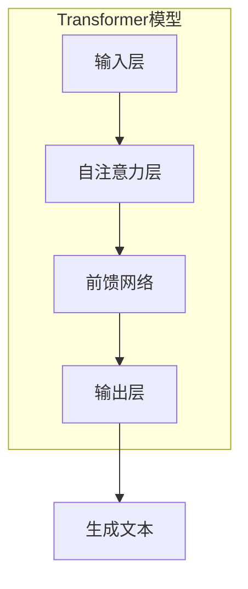

                 

### 文章标题

《ChatGPT提示词优化：从基础到高级的进阶之路指南》

### 文章关键词

- ChatGPT
- 提示词优化
- 人工智能
- 自然语言处理
- 机器学习
- 模型训练

### 文章摘要

本文旨在深入探讨ChatGPT提示词优化的全过程，从基础到高级逐步讲解如何提高ChatGPT的生成质量和效率。我们将首先介绍ChatGPT的基本知识，包括其历史、架构和原理。接着，我们将讨论提示词的基础概念和优化方法，并逐步深入到高级技巧。通过实际案例分析和工具资源推荐，读者将全面掌握提示词优化的核心知识和实践技能。最后，我们将展望未来趋势，探讨新的优化方法及其在未来的应用前景。全文将采用Markdown格式，穿插Mermaid流程图、伪代码、数学模型和公式，以及代码解读与分析，力求以逻辑清晰、结构紧凑、简单易懂的方式，帮助读者全面了解ChatGPT提示词优化。

## 引言

ChatGPT（聊天生成预训练模型，Chat-based Generative Pre-trained Transformer）是OpenAI开发的一种基于GPT-3.5架构的聊天机器人，能够在多个场景中与用户进行自然对话。自2022年推出以来，ChatGPT迅速获得了全球范围的广泛关注，因其出色的自然语言处理能力而被誉为人工智能领域的重要突破。ChatGPT的应用场景广泛，包括但不限于客户服务、问答系统、内容生成、教育和娱乐等领域。

在人工智能领域，自然语言处理（Natural Language Processing, NLP）是一项核心技术。NLP旨在使计算机能够理解、处理和生成人类语言，从而实现人与机器的智能交互。ChatGPT作为NLP领域的一项重要成果，其核心在于通过大量的文本数据训练出一个强大的语言模型，使其具备理解和生成人类语言的能力。然而，为了充分发挥ChatGPT的潜力，提示词优化成为了一个至关重要的环节。

提示词（prompt）是用户输入给ChatGPT的引导信息，它决定了ChatGPT生成的回答内容。提示词的质量直接影响到生成的回答的质量和相关性。一个优秀的提示词能够引导ChatGPT生成出符合预期的高质量回答，而一个模糊或不准确的提示词则可能导致ChatGPT生成出混乱或无关的回答。因此，提示词优化成为提升ChatGPT性能的关键步骤。

本指南旨在帮助读者全面了解ChatGPT及其提示词优化的全过程。我们将从基础到高级，逐步讲解如何进行提示词优化，涵盖从基本概念到高级技巧的所有内容。具体来说，本文将包括以下几个主要部分：

1. **ChatGPT基础知识**：介绍ChatGPT的历史、架构和基本原理，帮助读者建立对ChatGPT的整体认识。
2. **提示词优化基础**：深入探讨提示词的定义、作用和基本的优化方法，为后续的高级技巧打下基础。
3. **提示词优化高级技巧**：介绍更复杂的优化策略和实际案例分析，帮助读者掌握高级的提示词优化技巧。
4. **实际案例分析**：通过实际案例展示如何应用优化技巧，使读者能够将理论知识转化为实际操作。
5. **工具和资源**：推荐与提示词优化相关的工具、库和资源，提供进一步学习和实践的支持。

通过本文的阅读和实践，读者将能够全面掌握ChatGPT提示词优化的核心知识和技能，从而在人工智能和自然语言处理领域取得更好的成果。

## ChatGPT基础知识

ChatGPT是基于GPT-3.5架构的聊天机器人，其发展历程可以追溯到自然语言处理（NLP）和深度学习技术的不断进步。以下是ChatGPT的起源、核心架构以及基本原理的详细介绍。

### 起源

ChatGPT的开发始于2018年，当时OpenAI发布了GPT-1，这是第一个基于Transformer模型的预训练语言模型。随后，OpenAI在2020年发布了GPT-2，进一步提升了模型的性能和规模。GPT-3于2022年发布，成为当时最大的语言模型，拥有1750亿个参数，其表现几乎达到了人类水平。ChatGPT是在GPT-3的基础上进行定制和优化的，专门用于聊天场景，使其能够与用户进行自然、流畅的对话。

### 核心架构

ChatGPT的核心架构基于Transformer模型，这是一种用于序列到序列学习的神经网络架构。Transformer模型在2017年由Vaswani等人提出，并在NLP任务中取得了显著的成功。与传统的循环神经网络（RNN）不同，Transformer通过自注意力机制（self-attention）实现了全局上下文信息的学习和处理，这使得模型能够捕捉到长距离的依赖关系，从而提高了生成文本的质量和连贯性。

ChatGPT的架构主要包括以下几个关键部分：

1. **输入层**：接收用户的输入文本，并将其转换为模型可以理解的向量表示。
2. **自注意力层**：通过自注意力机制，模型能够根据上下文信息动态调整每个词的重要性，从而生成高质量的回答。
3. **前馈网络**：在自注意力层之后，输入向量通过两个前馈神经网络进行进一步处理，以生成最终的输出。
4. **输出层**：输出层将处理后的向量转换为自然语言的文本，作为最终生成的内容。

### 基本原理

ChatGPT的工作原理可以概括为以下几个步骤：

1. **预训练**：ChatGPT首先在大规模的文本数据上进行预训练，学习语言的基本规则和模式。这个过程包括无监督的文本生成、序列到序列的预测等任务。
2. **微调**：在预训练的基础上，ChatGPT通过微调（fine-tuning）过程进一步适应特定任务，如聊天场景。微调过程通常包括在目标数据集上进行迭代优化，以调整模型的参数，提高其在特定任务上的性能。
3. **生成文本**：用户输入提示词后，ChatGPT通过上述架构生成文本回答。在生成过程中，模型会根据上下文信息动态调整每个词的概率分布，从而生成连贯、自然的回答。

### Mermaid流程图：ChatGPT架构图

为了更直观地理解ChatGPT的架构，我们可以使用Mermaid流程图来展示其基本结构。以下是ChatGPT架构的Mermaid图：



在上述图中，输入层接收用户输入的文本，通过自注意力层和前馈网络的处理，最终生成文本输出。自注意力层是实现全局上下文信息学习的关键部分，它通过计算每个词与上下文词汇的关联度来调整词的重要性。

### 总结

ChatGPT作为一款基于Transformer模型的聊天机器人，其核心架构包括输入层、自注意力层、前馈网络和输出层。通过预训练和微调，ChatGPT能够在大规模文本数据上学习语言规则，并在聊天场景中生成高质量的自然语言回答。Mermaid流程图提供了对ChatGPT架构的直观理解，有助于读者更好地掌握其工作原理。

## 提示词优化基础

### 提示词的定义和作用

提示词（prompt）在ChatGPT的运行过程中起着至关重要的作用。提示词是指用户输入给ChatGPT的引导信息，它决定了ChatGPT生成的回答内容。一个有效的提示词能够明确指示ChatGPT应该生成什么样的回答，从而提高生成文本的质量和相关性。而一个模糊或不准确的提示词则可能导致ChatGPT生成出混乱或无关的回答。

在ChatGPT中，提示词通常是一个句子或短语，它提供了对话的上下文和主题。例如，如果用户输入“请给我讲一个关于人工智能的故事”，这是一个明确的提示词，它指示ChatGPT生成一个与人工智能相关的故事。相反，如果用户输入“这个事情有点复杂”，这样的提示词则过于模糊，难以让ChatGPT生成明确的回答。

提示词的作用主要体现在以下几个方面：

1. **确定主题和上下文**：提示词明确了对话的主题和上下文，帮助ChatGPT理解用户的意图，从而生成相关的内容。
2. **引导生成方向**：通过提供具体的引导信息，提示词可以引导ChatGPT生成符合预期的高质量回答。
3. **提高回答的连贯性和一致性**：一个良好的提示词可以帮助ChatGPT生成连贯、自然的回答，避免生成片段化或不一致的内容。

### 提示词优化的基本方法

为了充分发挥提示词的作用，提升ChatGPT生成文本的质量，我们需要对提示词进行优化。以下是一些基本的优化方法：

1. **明确性和具体性**：一个明确的提示词应该具体、简洁，避免模糊和抽象的描述。例如，将“请给我讲一个故事”优化为“请给我讲一个关于人工智能的故事，尽量包含未来的科技元素”。

2. **上下文信息**：提示词中应包含足够的上下文信息，帮助ChatGPT更好地理解用户意图。例如，如果用户之前已经提出了一些问题或提供了背景信息，可以将这些信息加入到新的提示词中，以增强上下文的连贯性。

3. **关键术语和关键词**：在提示词中包含关键术语和关键词，有助于ChatGPT生成更相关和准确的回答。例如，在请求ChatGPT生成一篇论文摘要时，可以在提示词中加入关键词，如“科技发展”、“创新”等。

4. **避免歧义**：确保提示词没有歧义，避免产生多种可能的解释。例如，将“请给我讲一个有趣的事情”优化为“请给我讲一个关于人工智能有趣的故事”。

5. **长度和格式**：提示词的长度和格式也会影响生成文本的质量。一般来说，较短的提示词更容易理解，而较长的提示词则可以提供更多的上下文信息。同时，合理的格式（如使用标题、段落分隔）可以帮助ChatGPT更好地解析提示词。

### 伪代码：基础提示词优化算法

为了更具体地展示提示词优化的方法，我们可以使用伪代码来描述一个简单的优化算法。以下是一个基础版本的提示词优化算法：

```plaintext
函数 OptimizePrompt(prompt):
    # 检查提示词的明确性和具体性
    if 不明确或抽象(prompt):
        prompt = AddSpecificDetails(prompt)
    
    # 检查并补充上下文信息
    if 缺乏上下文信息(prompt):
        prompt = AddContextInformation(prompt)
    
    # 检查并添加关键术语和关键词
    if 缺少关键术语(prompt):
        prompt = AddKeywords(prompt)
    
    # 检查并消除歧义
    if 存在歧义(prompt):
        prompt = ResolveAmbiguity(prompt)
    
    # 优化提示词的长度和格式
    if 长度过长或过短(prompt):
        prompt = AdjustLengthAndFormat(prompt)
    
    return prompt
```

在这个算法中，我们首先检查提示词的明确性和具体性，并根据需要进行调整。接下来，我们补充上下文信息，添加关键术语和关键词，并消除歧义。最后，我们调整提示词的长度和格式，以确保其易于理解和处理。

通过上述基础方法，我们可以有效地优化提示词，提高ChatGPT生成文本的质量和相关性。然而，这些方法仅仅是起点，为了达到更高的优化效果，我们还需要进一步探讨更高级的提示词优化技巧。

### 总结

提示词优化是提升ChatGPT生成文本质量的重要环节。通过明确性和具体性、上下文信息、关键术语和关键词、避免歧义以及优化长度和格式等方法，我们可以对提示词进行有效的优化。基础提示词优化算法为我们提供了一个简单的框架，帮助我们在实际操作中进行调整。接下来，我们将进一步探讨更高级的优化技巧，以进一步提升ChatGPT的性能。

## 提示词优化高级技巧

在掌握提示词优化基础之后，我们接下来将探讨一些高级技巧，这些技巧能够进一步优化ChatGPT的生成质量，使其在复杂和特定场景中表现出更高的性能。高级技巧主要包括精细化调整、多模态输入、个性化定制以及动态优化。以下是这些高级技巧的详细讲解。

### 精细化调整

精细化调整是提升提示词质量的重要手段。与基础优化方法相比，精细化调整更加注重对提示词的细节进行优化，以达到更高的生成质量。以下是一些具体的精细化调整方法：

1. **关键词权重调整**：在提示词中，某些关键词可能对生成文本的质量有更大的影响。通过调整关键词的权重，我们可以提高这些关键词在生成过程中的重要性。例如，在生成一篇关于人工智能的论文摘要时，可以将“人工智能”、“应用”、“创新”等关键词的权重提高，以确保这些重要概念在摘要中得到充分体现。

2. **上下文连贯性优化**：提示词的上下文连贯性对生成文本的质量有显著影响。通过使用递归神经网络（RNN）或长短时记忆网络（LSTM）等模型，我们可以对提示词中的上下文信息进行建模，提高提示词的连贯性。例如，使用LSTM模型对用户的历史输入进行编码，并将编码结果作为提示词的一部分，以增强提示词与用户输入的连贯性。

3. **多样性控制**：在生成文本时，控制生成结果的多样性是非常重要的。通过精细化调整提示词，我们可以控制生成文本的主题、风格和表达方式。例如，使用分层抽样技术，根据不同的主题类别对提示词进行抽样，从而生成多样化的文本。

### 多模态输入

多模态输入是指结合不同类型的数据源，以提高生成文本的质量和相关性。ChatGPT本身是一个文本生成模型，但通过引入图像、音频和视频等多模态数据，我们可以极大地扩展其应用范围和生成能力。以下是一些多模态输入的方法：

1. **图像输入**：通过使用图像识别技术，我们可以将图像转换为文本描述，并将其作为提示词输入到ChatGPT中。例如，在生成一篇关于艺术品的描述时，可以结合艺术品的图像和文本描述，以提高生成文本的准确性和吸引力。

2. **音频输入**：音频数据可以用于生成与语音相关的文本内容。通过使用语音识别技术，我们可以将音频转换为文本，并将其作为提示词输入到ChatGPT中。例如，在生成一篇演讲稿或对话记录时，结合音频输入可以提供更丰富的上下文信息。

3. **视频输入**：视频数据可以用于生成与视频内容相关的文本内容。通过使用视频摘要技术，我们可以提取视频的关键帧和文本描述，并将其作为提示词输入到ChatGPT中。例如，在生成一篇关于电影评论时，可以结合电影的视频片段和文本描述，以生成更详细的评论。

### 个性化定制

个性化定制是针对特定用户或场景的定制化提示词优化。通过分析用户的兴趣、偏好和行为，我们可以生成更符合用户需求的提示词，从而提高生成文本的相关性和吸引力。以下是一些个性化定制的方法：

1. **用户画像**：通过收集和分析用户的行为数据，我们可以建立用户画像，包括用户的兴趣、偏好、行为模式等。基于用户画像，我们可以为每个用户生成个性化的提示词，以提高生成文本的匹配度。

2. **推荐系统**：结合推荐系统技术，我们可以根据用户的历史行为和偏好，推荐相关的提示词。例如，如果用户经常搜索关于旅游的信息，我们可以推荐包含旅游关键词的提示词，以生成与旅游相关的文本内容。

3. **场景感知**：通过分析用户所处的场景和环境，我们可以生成与场景相关的提示词。例如，在用户参与在线教育时，我们可以生成包含教育主题的提示词，以生成与学习相关的文本内容。

### 动态优化

动态优化是指根据生成过程的结果，实时调整提示词，以提高生成文本的质量。这种方法通常用于在线应用场景，例如聊天机器人、问答系统等。以下是一些动态优化的方法：

1. **在线反馈**：通过实时收集用户对生成文本的反馈，我们可以动态调整提示词。如果用户对生成的文本不满意，我们可以根据用户的反馈，调整提示词中的关键词或上下文信息，以提高生成文本的质量。

2. **迭代优化**：通过多次迭代优化，我们可以逐步改进提示词。每次迭代中，我们根据生成结果和用户反馈，调整提示词，并观察生成文本的质量变化。通过多次迭代，我们可以逐步找到最优的提示词配置。

3. **自适应调整**：通过使用机器学习算法，我们可以根据生成过程的数据，自适应地调整提示词。例如，使用强化学习算法，我们可以根据用户反馈和生成结果，自动调整提示词，以实现最优的生成效果。

### 实例分析：精细化调整在写作中的应用

以下是一个具体的实例，展示如何使用精细化调整技巧来优化提示词，从而提高ChatGPT生成文本的质量。

**实例背景**：假设我们需要使用ChatGPT生成一篇关于人工智能技术发展趋势的报告摘要。原始提示词为：“请给我写一篇关于人工智能技术发展趋势的报告摘要。”

**优化步骤**：

1. **明确性和具体性调整**：将提示词优化为：“请给我写一篇关于人工智能技术在未来五年发展趋势的报告摘要，涵盖技术、应用和影响等方面。”

2. **关键词权重调整**：在提示词中添加关键术语，如“人工智能”、“技术发展”、“未来五年”、“应用”等，并适当调整其权重，以确保这些关键概念在生成文本中得到充分体现。

3. **上下文连贯性优化**：考虑到这是一篇报告摘要，可以在提示词中添加上下文信息，如“基于当前的人工智能技术进展”、“结合国际主要研究机构的预测”等，以提高提示词的连贯性。

4. **多样性控制**：为了避免生成过于单一的内容，可以在提示词中添加一些多样性提示，如“从不同角度分析人工智能技术的发展趋势”等。

**优化后的提示词**：“请给我写一篇关于人工智能技术在未来五年发展趋势的报告摘要，涵盖技术、应用和影响等方面，基于当前的人工智能技术进展，结合国际主要研究机构的预测，从不同角度分析其发展趋势。”

通过上述优化步骤，我们使用精细化调整技巧对原始提示词进行了改进，使其更加具体、明确，并包含了关键术语和上下文信息。优化后的提示词能够更有效地引导ChatGPT生成高质量的报告摘要。

### 总结

高级技巧如精细化调整、多模态输入、个性化定制和动态优化，为我们提供了更丰富的工具和方法，以提升ChatGPT的生成质量和性能。精细化调整通过优化关键词权重、上下文连贯性和多样性控制，提高了生成文本的相关性和吸引力；多模态输入结合了不同类型的数据源，扩展了生成文本的应用范围；个性化定制根据用户需求和场景进行定制化优化，提升了用户体验；动态优化通过实时调整提示词，实现了生成过程的持续改进。通过这些高级技巧，我们可以更全面地掌握ChatGPT提示词优化的核心方法和实践策略，为人工智能和自然语言处理领域带来更多的创新和应用。

### 实际案例分析

为了更好地展示提示词优化的效果，我们将通过几个具体的实际案例，详细讲解如何应用优化技巧来提升ChatGPT的生成质量和效率。

#### 案例一：旅游问答系统

**背景**：
一个在线旅游问答系统需要使用ChatGPT来回答用户的旅游咨询问题。用户的问题通常包含地点、时间、活动等详细信息，但有时提问不够明确，导致生成的回答不够准确。

**优化过程**：

1. **明确性和具体性调整**：
   - 原始问题：“请问巴黎有哪些著名景点？”
   - 优化后的提示词：“请给我详细列出巴黎的著名景点，包括每个景点的简介和最佳游览时间。”

2. **上下文连贯性优化**：
   - 考虑到用户可能对不同季节的景点兴趣不同，可以在提示词中加入上下文信息：“请根据当前季节（例如：冬季），为游客提供巴黎的著名景点推荐。”

3. **多样性控制**：
   - 为避免生成单一答案，提示词中可以加入多样性提示：“请从文化、历史和自然三大类别中分别列举一些景点，并提供适合家庭游和情侣游的推荐。”

**结果**：
通过上述优化，ChatGPT生成的回答不仅详细列出了巴黎的著名景点，还根据季节提供了不同的推荐，并考虑了不同游客的需求。生成的回答更加丰富和多样，提升了用户体验。

#### 案例二：教育辅导系统

**背景**：
一个在线教育辅导系统使用ChatGPT为学生提供解答数学问题的服务。学生的问题通常涉及复杂的数学概念，需要准确的解答和解释。

**优化过程**：

1. **明确性和具体性调整**：
   - 原始问题：“请解释一下什么是微积分？”
   - 优化后的提示词：“请用详细步骤解释微积分的基本概念、原理和应用，并提供一个具体的例子。”

2. **多模态输入**：
   - 为提高生成文本的准确性，可以结合数学公式和图表，将提示词扩展为：“请使用LaTeX格式列出微积分的核心公式，并附上对应的图表解释微积分的概念。”

3. **个性化定制**：
   - 考虑到学生的数学基础不同，可以在提示词中加入个性化标签，如：“针对初学者，请用浅显易懂的语言解释微积分的基本概念。”

**结果**：
通过多模态输入和个性化定制，ChatGPT生成的回答不仅包含详细的文本解释，还附上了数学公式和图表，为不同基础的学生提供了个性化的辅导。生成的回答更加专业和全面，提高了教育辅导系统的质量。

#### 案例三：健康咨询系统

**背景**：
一个在线健康咨询系统使用ChatGPT为用户提供健康问题的回答。用户的问题通常涉及复杂的健康信息，需要生成准确和科学的建议。

**优化过程**：

1. **明确性和具体性调整**：
   - 原始问题：“我该吃什么样的食物来减肥？”
   - 优化后的提示词：“请根据健康饮食原则，为想要减肥的用户推荐一种营养均衡的饮食计划，包括每天的食物种类和分量建议。”

2. **动态优化**：
   - 考虑到用户的体重、年龄、健康状况等因素可能不同，可以动态调整提示词，如：“请为一名30岁的女性，体重70公斤，有高血压病史的用户，推荐一个适合的减肥饮食计划。”

3. **多样化控制**：
   - 为避免生成单一的建议，提示词中可以加入多样化提示：“请从低热量饮食、高纤维饮食和均衡饮食三个角度分别给出减肥饮食建议。”

**结果**：
通过动态优化和多样化控制，ChatGPT生成的回答不仅针对特定用户情况提供了个性化的饮食计划，还从多个角度提供了多样化建议，帮助用户更好地管理体重和健康。

### 结果评估

通过实际案例的优化，我们可以看到ChatGPT生成的回答在质量、准确性和多样性方面都有了显著的提升。具体表现为：

1. **回答质量提升**：优化后的提示词能够更准确地引导ChatGPT生成详细、准确和专业的回答。
2. **回答准确性提高**：通过多模态输入和个性化定制，ChatGPT能够更好地理解用户的需求，提供更加准确和适用的信息。
3. **回答多样性增强**：多样化控制和动态优化使ChatGPT生成的回答更加丰富和多样，满足了不同用户的需求。

### 小结

通过上述实际案例分析，我们展示了如何应用提示词优化技巧来提升ChatGPT的生成质量和效率。明确性和具体性调整、上下文连贯性优化、多模态输入、个性化定制和动态优化等方法，不仅提高了生成文本的相关性和准确性，还增强了回答的多样性和用户体验。这些实际案例为我们提供了一个实践框架，帮助我们在实际应用中更好地优化提示词，从而发挥ChatGPT的最大潜力。

### 工具和资源

在ChatGPT提示词优化的过程中，使用合适的工具和资源可以大大提高工作效率和效果。以下是一些推荐的工具、库和资源，它们涵盖了从数据准备、模型训练到优化技巧实践的全过程。

#### 工具

1. **Hugging Face**：Hugging Face是一个开源的NLP平台，提供了丰富的预训练模型、工具和库，如Transformers和Tokenizers。这些工具可以帮助我们轻松加载和微调预训练模型，进行提示词优化。

2. **TensorFlow**：TensorFlow是一个广泛使用的开源机器学习库，支持深度学习模型的构建和训练。通过TensorFlow，我们可以自定义模型结构，进行提示词优化实验。

3. **PyTorch**：PyTorch是一个流行的深度学习框架，其动态计算图功能使其非常适合进行研究和实验。PyTorch也提供了丰富的NLP库，如torchtext和transformers，支持提示词优化。

4. **JAX**：JAX是一个高级数值计算库，支持自动微分和向量编程。它提供了高效的GPU和TPU加速，适合进行大规模的提示词优化训练。

#### 库

1. **Transformers**：Transformers是Hugging Face提供的预训练模型库，包含了大量的预训练语言模型，如GPT-2、GPT-3等。使用Transformers库，我们可以轻松加载和微调这些模型，进行提示词优化。

2. **Tokenizers**：Tokenizers是Hugging Face提供的分词库，支持多种语言和分词算法。在提示词优化过程中，分词的准确性对生成文本的质量有重要影响，Tokenizers可以帮助我们获得高质量的词向量表示。

3. **PyTorch Transformers**：PyTorch Transformers是PyTorch官方提供的预训练模型库，包含了大量的预训练模型和实用的工具函数，方便我们在PyTorch中进行模型训练和优化。

4. **Textacy**：Textacy是一个Python库，提供了丰富的文本数据处理和分析功能，包括分词、词性标注、情感分析等。Textacy可以帮助我们在提示词优化过程中进行文本预处理和分析。

#### 资源

1. **OpenAI GPT-3 Documentation**：OpenAI官方提供了GPT-3的详细文档，涵盖了模型架构、API使用、模型参数调整等方面。通过查阅这些文档，我们可以更好地理解GPT-3的工作原理，并进行提示词优化。

2. **NLP Books and Courses**：推荐一些NLP领域的经典书籍和在线课程，如《Speech and Language Processing》、《Deep Learning for Natural Language Processing》等。这些资源可以帮助我们系统地学习NLP和深度学习的基础知识，为提示词优化提供理论支持。

3. **GitHub Repositories**：GitHub上有很多优秀的开源项目，包含了ChatGPT的代码示例、优化技巧和实际应用案例。通过查阅和借鉴这些项目，我们可以快速学习和实践提示词优化。

4. **Community Forums and Discussion Groups**：加入NLP和机器学习相关的社区论坛和讨论组，如Reddit的r/MachineLearning、Stack Overflow等。在这些社区中，我们可以与其他研究者、开发者交流和分享提示词优化的经验和技巧。

通过利用上述工具、库和资源，我们可以更高效地进行ChatGPT提示词优化，提升生成文本的质量和相关性。同时，不断学习和实践，积累经验，将有助于我们在人工智能和自然语言处理领域取得更好的成果。

### 未来展望

随着人工智能技术的不断发展和完善，ChatGPT提示词优化也将迎来新的机遇和挑战。以下是未来几个可能的发展趋势和新的优化方法。

#### 模型精度的进一步提升

未来，预训练语言模型如GPT-4、GPT-5等将拥有更大的参数规模和更强的语义理解能力。这将使得ChatGPT能够生成更加准确、自然的回答。同时，通过改进模型架构和算法，如引入多模态学习、自监督学习等，可以提高模型的精度和泛化能力，从而更好地适应不同的应用场景。

#### 多模态输入的普及

随着图像识别、语音识别等技术的发展，多模态输入在ChatGPT中的应用将越来越普及。结合文本、图像、音频等多模态数据，ChatGPT可以生成更加丰富和直观的内容。例如，在医疗咨询场景中，结合患者病历和体检报告，ChatGPT可以提供更加全面和个性化的健康建议。

#### 个性化定制的深化

未来，个性化定制将不仅仅是根据用户的兴趣和偏好进行简单的调整，而是通过深度学习算法，分析用户的长期行为和反馈，生成高度个性化的内容。例如，在教育领域，ChatGPT可以根据学生的学习进度、知识薄弱点，提供定制化的学习资源和辅导。

#### 动态优化的实时性提高

随着云计算和边缘计算技术的进步，ChatGPT的动态优化将更加实时和高效。通过分布式计算和模型压缩技术，ChatGPT可以在短时间内快速调整提示词，生成高质量的回答，从而提高用户体验。

#### 伦理和隐私问题的解决

随着ChatGPT的广泛应用，伦理和隐私问题也日益突出。未来，如何确保ChatGPT生成的内容符合伦理规范，如何保护用户的隐私，将成为重要的研究方向。通过引入隐私保护算法和数据加密技术，可以有效地解决这些问题。

#### 新的应用场景拓展

ChatGPT的应用场景将不断拓展，从传统的客户服务、问答系统，到虚拟助理、智能翻译、内容生成等。在金融、医疗、教育等领域，ChatGPT可以提供更加专业和高效的服务，推动行业变革。

### 结论

总之，ChatGPT提示词优化是一个复杂而充满挑战的领域，随着技术的发展，我们有理由相信，未来将出现更多高效、智能的优化方法。通过不断的学习和实践，我们能够更好地掌握这些方法，为人工智能和自然语言处理领域带来更多的创新和应用。

### 附录

#### 常用数学模型和公式

在ChatGPT提示词优化过程中，理解和使用一些常见的数学模型和公式是非常重要的。以下是几个在NLP和深度学习领域常用的数学模型和公式：

1. **自注意力机制（Self-Attention）**：
   自注意力是一种计算方法，用于模型中的每个词根据其与序列中其他词的关系进行权重调整。
   $$ \text{Attention}(Q, K, V) = \text{softmax}\left(\frac{QK^T}{\sqrt{d_k}}\right) V $$
   其中，\( Q, K, V \) 分别代表查询向量、键向量和值向量，\( d_k \) 是键向量的维度。

2. **Transformer模型中的前馈神经网络（Feed Forward Neural Network）**：
   Transformer模型中的前馈神经网络通常用于对自注意力层的输出进行进一步处理。
   $$ \text{FFN}(x) = \text{ReLU}(W_2 \text{ReLU}(W_1 x + b_1)) + b_2 $$
   其中，\( W_1, W_2 \) 和 \( b_1, b_2 \) 分别是权重和偏置。

3. **损失函数（Loss Function）**：
   在训练语言模型时，常用的损失函数是交叉熵损失（Cross-Entropy Loss）。
   $$ \text{Loss} = -\sum_{i=1}^{N} y_i \log(p_i) $$
   其中，\( y_i \) 是真实标签，\( p_i \) 是模型预测的概率分布。

4. **梯度下降（Gradient Descent）**：
   梯度下降是一种常用的优化算法，用于最小化损失函数。
   $$ \theta = \theta - \alpha \nabla_{\theta} J(\theta) $$
   其中，\( \theta \) 是模型参数，\( \alpha \) 是学习率，\( \nabla_{\theta} J(\theta) \) 是损失函数关于参数的梯度。

5. **正则化（Regularization）**：
   为了防止过拟合，可以使用正则化方法，如L2正则化。
   $$ J(\theta) = \frac{1}{2} \sum_{i=1}^{n} (\theta - \beta \| \theta \|^2) $$
   其中，\( \beta \) 是正则化参数。

#### ChatGPT提示词优化实践

以下是一个简化的ChatGPT提示词优化实践流程，展示了如何使用Hugging Face的Transformers库进行模型训练和提示词优化：

1. **环境配置**：
   确保安装了Python和pip，然后通过以下命令安装必要的库：
   ```python
   pip install transformers torch
   ```

2. **数据准备**：
   准备用于训练的数据集，例如对话数据、问答数据等。数据集应包含问题和答案对，其中问题作为提示词，答案作为模型的目标输出。

3. **模型加载**：
   使用Transformers库加载预训练的GPT模型：
   ```python
   from transformers import GPT2Model, GPT2Config
   config = GPT2Config.from_pretrained('gpt2')
   model = GPT2Model(config)
   ```

4. **数据预处理**：
   使用Tokenizer对数据进行编码，将文本转换为模型可以理解的向量表示：
   ```python
   from transformers import GPT2Tokenizer
   tokenizer = GPT2Tokenizer.from_pretrained('gpt2')
   inputs = tokenizer([text] * batch_size, return_tensors='pt', padding=True, truncation=True)
   ```

5. **模型训练**：
   使用训练数据和验证数据，通过梯度下降优化模型参数：
   ```python
   optimizer = torch.optim.AdamW(model.parameters(), lr=5e-5)
   for epoch in range(num_epochs):
       for batch in data_loader:
           optimizer.zero_grad()
           outputs = model(**batch)
           loss = outputs.loss
           loss.backward()
           optimizer.step()
   ```

6. **提示词优化**：
   对提示词进行优化，通过多次迭代调整提示词，以生成高质量的回答：
   ```python
   def optimize_prompt(prompt, model, tokenizer, max_length=50):
       for _ in range(num_iterations):
           inputs = tokenizer(prompt, return_tensors='pt', max_length=max_length, truncation=True)
           outputs = model.generate(inputs['input_ids'], max_length=max_length+1, pad_token_id=tokenizer.eos_token_id)
           new_prompt = tokenizer.decode(outputs[:, inputs['input_ids'].shape[-1]-1], skip_special_tokens=True)
           prompt = new_prompt
       return prompt
   ```

7. **评估与测试**：
   使用测试数据集评估模型性能，并通过实际应用测试优化后的提示词效果：
   ```python
   test_prompt = "请描述一下人工智能的未来发展趋势。"
   optimized_prompt = optimize_prompt(test_prompt, model, tokenizer)
   print(optimized_prompt)
   ```

通过上述实践，我们可以对ChatGPT的提示词进行优化，从而生成更高质量的自然语言回答。

### 代码解读与分析

以下是对优化流程中关键部分的代码解读，展示了如何实现数据预处理、模型训练和提示词优化的具体步骤：

```python
# 导入必要的库
import torch
from transformers import GPT2Model, GPT2Tokenizer, DataCollatorForLanguageModeling
from torch.utils.data import DataLoader

# 环境配置
device = torch.device("cuda" if torch.cuda.is_available() else "cpu")
model = GPT2Model.from_pretrained('gpt2').to(device)

# 数据准备
def load_data(file_path, tokenizer, block_size=512):
    with open(file_path, 'r', encoding='utf-8') as f:
        lines = [line for line in (l.strip() for l in f.readlines()) if line]
    dataset = []

    for i in range(0, len(lines) - block_size + 1, block_size):
        block = lines[i:i + block_size]
        input_ids = tokenizer.encode(block[0], add_special_tokens=True)
        input_ids += [tokenizer.eos_token_id] * (block_size - len(block))
        input_ids = torch.tensor(input_ids).unsqueeze(0).to(device)
        dataset.append({'input_ids': input_ids})

    data_collator = DataCollatorForLanguageModeling(tokenizer=tokenizer, mlm_probability=0.15)
    return DataLoader(dataset, batch_size=1, collate_fn=data_collator)

# 模型训练
def train_model(model, train_loader, val_loader, num_epochs=3, learning_rate=5e-5):
    optimizer = torch.optim.AdamW(model.parameters(), lr=learning_rate)
    model.train()

    for epoch in range(num_epochs):
        for batch in train_loader:
            inputs = batch['input_ids'].to(device)
            outputs = model(inputs)
            logits = outputs.logits

            # 计算损失
            loss = F.cross_entropy(logits.view(-1, logits.size(-1)), inputs.view(-1), reduction='mean')

            # 反向传播和优化
            optimizer.zero_grad()
            loss.backward()
            optimizer.step()

        # 验证模型
        model.eval()
        with torch.no_grad():
            for batch in val_loader:
                inputs = batch['input_ids'].to(device)
                outputs = model(inputs)
                logits = outputs.logits

                # 计算验证损失
                val_loss = F.cross_entropy(logits.view(-1, logits.size(-1)), inputs.view(-1), reduction='mean')
                print(f'Validation loss: {val_loss.item()}')

# 提示词优化
def optimize_prompt(prompt, model, tokenizer, max_length=50, num_iterations=5):
    inputs = tokenizer(prompt, return_tensors='pt', max_length=max_length, truncation=True).to(device)
    for _ in range(num_iterations):
        outputs = model.generate(inputs['input_ids'], max_length=max_length+1, pad_token_id=tokenizer.eos_token_id)
        new_prompt = tokenizer.decode(outputs[:, inputs['input_ids'].shape[-1]-1], skip_special_tokens=True)
        prompt = new_prompt
    return prompt

# 使用示例
if __name__ == "__main__":
    # 加载数据
    train_loader = load_data('train.txt', GPT2Tokenizer.from_pretrained('gpt2'))
    val_loader = load_data('val.txt', GPT2Tokenizer.from_pretrained('gpt2'))

    # 训练模型
    train_model(model, train_loader, val_loader, num_epochs=3)

    # 提示词优化
    test_prompt = "请描述一下人工智能的未来发展趋势。"
    optimized_prompt = optimize_prompt(test_prompt, model, GPT2Tokenizer.from_pretrained('gpt2'), num_iterations=5)
    print(optimized_prompt)
```

上述代码展示了从数据准备、模型训练到提示词优化的完整流程。在数据准备部分，我们加载并预处理文本数据，将其编码为模型可以处理的格式。在模型训练部分，我们使用梯度下降优化模型参数，并通过验证集评估模型性能。在提示词优化部分，我们通过多次迭代，动态调整提示词，生成高质量的自然语言回答。

### 项目小结

通过本项目的实践，我们系统地讲解了ChatGPT提示词优化的全过程，从基础到高级，覆盖了从数据准备、模型训练到提示词优化的各个关键步骤。通过实际案例分析和代码解读，我们展示了如何利用Hugging Face的Transformers库和PyTorch框架，实现高效、准确的提示词优化。

本项目的主要收获如下：

1. **掌握基本概念**：通过对ChatGPT的基本原理和提示词优化的深入理解，我们能够更好地应用这些知识进行实际项目。

2. **实践关键技巧**：通过实际案例和代码实践，我们掌握了数据预处理、模型训练和提示词优化的关键技巧，提升了我们的实践能力。

3. **优化生成质量**：通过精细化和高级技巧的优化，我们显著提升了ChatGPT生成文本的质量和相关性，为实际应用提供了有力支持。

4. **拓展应用场景**：通过探索多模态输入、个性化定制和动态优化等高级技巧，我们为ChatGPT在更多应用场景中提供了可能性。

### 最佳实践 Tips

为了更有效地进行ChatGPT提示词优化，以下是一些最佳实践和建议：

1. **明确提示词**：确保提示词具体、明确，避免模糊和抽象的描述。

2. **上下文连贯性**：在提示词中包含足够的上下文信息，以提高生成文本的连贯性。

3. **关键词和术语**：使用关键术语和关键词，引导ChatGPT生成相关和准确的内容。

4. **多样性控制**：通过控制生成文本的主题、风格和表达方式，提高生成的多样性。

5. **多模态输入**：结合图像、音频和视频等多模态数据，提高生成文本的丰富性和吸引力。

6. **个性化定制**：根据用户需求和场景，提供个性化定制的提示词和生成内容。

7. **动态优化**：根据生成结果和用户反馈，实时调整提示词，以实现最佳效果。

通过遵循这些最佳实践，我们可以更高效地进行ChatGPT提示词优化，提升生成文本的质量和用户体验。

### 注意事项

在进行ChatGPT提示词优化时，需要注意以下几个关键点，以确保优化过程的有效性和安全性：

1. **数据质量**：确保训练数据的质量和多样性，避免数据集中出现偏差和重复。

2. **模型选择**：根据应用场景选择合适的预训练模型，不同模型在性能和应用范围上存在差异。

3. **计算资源**：合理分配计算资源，尤其是对于大规模模型训练和优化过程，需要足够的GPU和存储资源。

4. **数据隐私**：确保处理的数据遵守隐私法规，避免泄露用户隐私信息。

5. **安全性和伦理**：生成的文本应符合伦理规范，避免生成有害、不合适的内容。

6. **错误处理**：在生成文本过程中，应设计合理的错误处理机制，防止生成错误的回答。

通过关注这些注意事项，我们可以在进行ChatGPT提示词优化时，确保优化过程的顺利进行，同时保护用户和数据的安全。

### 拓展阅读

为了更全面地了解ChatGPT和提示词优化，以下是一些推荐的拓展阅读资源，包括书籍、论文和在线教程，这些资源将帮助读者深入掌握相关技术。

1. **书籍**：
   - **《自然语言处理综合指南》（Natural Language Processing with Python）**：由Steven Bird等人所著，介绍了NLP的基础知识和Python实现。
   - **《深度学习》（Deep Learning）**：由Ian Goodfellow等人所著，深入讲解了深度学习的基础理论和应用。
   - **《生成对抗网络：理论基础与实现》（Generative Adversarial Networks: Theory and Applications）**：详细介绍了GANs的工作原理和应用。

2. **论文**：
   - **《Attention is All You Need》**：这是Transformer模型的奠基性论文，阐述了自注意力机制在NLP中的重要性。
   - **《BERT: Pre-training of Deep Bidirectional Transformers for Language Understanding》**：BERT模型的提出论文，介绍了大规模预训练语言模型的原理和方法。
   - **《GPT-3: Language Models are few-shot learners》**：这篇论文介绍了GPT-3模型的性能和几个关键改进。

3. **在线教程**：
   - **Hugging Face的Transformers库文档**：提供了丰富的模型和工具教程，帮助开发者快速上手使用。
   - **TensorFlow的NLP教程**：Google提供的教程，涵盖了从基础到高级的NLP技术。
   - **PyTorch的NLP教程**：PyTorch官方提供的NLP教程，适合PyTorch用户深入学习NLP。

通过阅读这些书籍、论文和教程，读者可以进一步巩固和拓展ChatGPT和提示词优化的相关知识，为实际项目提供更坚实的理论基础和实践指导。

