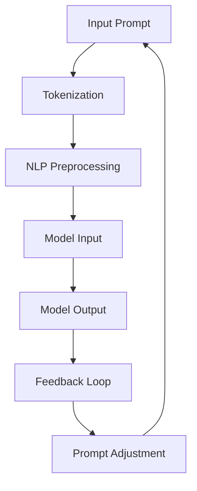

                 

### Introduction to ChatGPT and Prompt Optimization

**Title:** ChatGPT Prompt Optimization: From Fundamentals to Advanced Mastery Guide

**Keywords:** ChatGPT, Prompt Optimization, Natural Language Processing, AI, Machine Learning, NLP, AI Applications, Prompt Engineering

**Abstract:**

The advent of artificial intelligence and natural language processing has revolutionized the way we interact with machines. Among the various advancements, ChatGPT, an AI language model developed by OpenAI, stands out for its ability to engage in human-like conversations. However, to unlock the full potential of ChatGPT, one must master the art of prompt optimization. This guide delves into the basics of ChatGPT, the importance of prompt optimization, and provides a comprehensive overview of strategies to enhance the performance of ChatGPT models. From fundamental concepts to advanced techniques, this guide is designed to equip you with the knowledge and tools needed to become a proficient ChatGPT prompt engineer. By the end of this article, you will have a solid understanding of how to optimize prompts effectively and harness the power of ChatGPT for a wide range of applications.

### The Importance of Prompt Optimization in ChatGPT

#### Background Introduction

In the realm of AI and natural language processing, the significance of prompt optimization cannot be overstated. At its core, prompt optimization refers to the systematic process of refining the input prompts to enhance the performance and relevance of an AI model, particularly in the case of ChatGPT. A prompt is essentially the starting point for a conversation with the AI model, and its quality directly impacts the coherence and accuracy of the responses generated by the model.

The importance of prompt optimization becomes evident when we consider the diverse applications of ChatGPT. Whether it's in customer service chatbots, educational tutoring systems, content creation, or any other AI-driven interaction, the quality of the responses generated by ChatGPT can significantly affect user satisfaction and the overall effectiveness of the application. Poorly optimized prompts can lead to irrelevant or incoherent responses, which can be frustrating for users and reduce the utility of the AI system.

#### Core Concepts and Relationships

To understand the core concepts and their relationships in prompt optimization, we can use the following Mermaid flowchart to visualize the key components:

1. **Input Prompt**: The starting point of the conversation, which is refined through various stages.
2. **Tokenization**: The process of breaking the input prompt into tokens, which are the smallest units of meaning.
3. **NLP Preprocessing**: Cleaning and transforming the tokens to prepare them for model input.
4. **Model Input**: The processed prompt is fed into the ChatGPT model.
5. **Model Output**: The AI model generates a response based on the input.
6. **Feedback Loop**: The generated response is evaluated, and feedback is used to adjust the prompt.
7. **Prompt Adjustment**: The prompt is refined based on the feedback to improve subsequent responses.

#### Explanation of Key Concepts and Mermaid Flowchart

1. **Input Prompt**: The quality of the input prompt is crucial as it sets the tone and direction for the conversation. A well-crafted prompt can guide the model to produce more relevant and coherent responses.

2. **Tokenization**: Tokenization is the first step in processing the input prompt. It involves breaking the text into smaller units called tokens, which can be words, punctuation marks, or special symbols. This step is essential for understanding the structure and meaning of the text.

3. **NLP Preprocessing**: This step involves cleaning and transforming the tokens to remove noise and prepare them for model input. Common preprocessing tasks include lowercasing, removing stop words, stemming, and lemmatization. These techniques help in reducing the complexity of the input and making it more suitable for the model.

4. **Model Input**: The processed tokens are then used as input to the ChatGPT model. The model's architecture and training data significantly influence the quality of the output. Therefore, it's essential to ensure that the input is in the right format and contains meaningful information.

5. **Model Output**: The AI model generates a response based on the input it receives. The output's relevance and coherence depend on the quality of the input prompt and the model's training.

6. **Feedback Loop**: The generated response is evaluated to determine its relevance and coherence. If the response is not satisfactory, the feedback is used to adjust the prompt. This feedback loop is crucial for continuous improvement and refining the prompt optimization process.

7. **Prompt Adjustment**: Based on the feedback, the input prompt is adjusted to improve subsequent responses. This iterative process helps in achieving better performance and generating more accurate and relevant outputs.

#### Key Concepts Summary

- **Input Prompt**: A well-crafted prompt sets the stage for a productive conversation.
- **Tokenization**: Breaking the input into tokens for better understanding.
- **NLP Preprocessing**: Cleaning and transforming tokens to prepare for model input.
- **Model Input**: Processed tokens are fed into the ChatGPT model.
- **Model Output**: AI model generates a response based on the input.
- **Feedback Loop**: Evaluating the response and adjusting the prompt based on feedback.
- **Prompt Adjustment**: Continuous refinement of the prompt for improved performance.

By understanding these core concepts and their relationships, you can better grasp the importance of prompt optimization in ChatGPT and start optimizing prompts effectively.

### Fundamental Concepts of ChatGPT

#### Overview of ChatGPT

ChatGPT, developed by OpenAI, is a cutting-edge AI language model based on the GPT (Generative Pre-trained Transformer) architecture. It is designed to generate human-like text in response to various prompts provided by users. The primary goal of ChatGPT is to engage in natural and coherent conversations, making it highly valuable for applications such as chatbots, virtual assistants, content generation, and language translation.

ChatGPT utilizes deep learning techniques, specifically transformer models, to process and generate text. The model is pre-trained on a vast corpus of text data from the internet, allowing it to learn the patterns, structures, and semantics of natural language. This pre-training phase equips the model with a deep understanding of language, enabling it to produce high-quality responses.

The development of ChatGPT is a testament to the advancements in artificial intelligence and natural language processing. It represents a significant leap forward in the field, as it can generate fluent and contextually relevant text that closely mimics human conversation. This capability makes ChatGPT a powerful tool for various applications, revolutionizing the way we interact with machines.

#### Key Components of ChatGPT

To fully understand ChatGPT, it's essential to delve into its key components:

1. **Transformer Architecture**: At the core of ChatGPT lies the transformer architecture, a deep learning model known for its efficiency and effectiveness in processing sequential data, such as text. The transformer architecture uses self-attention mechanisms to weigh the importance of different words in the input sequence when generating the output sequence. This mechanism allows the model to capture long-range dependencies and context, resulting in more coherent and accurate responses.

2. **Pre-training**: ChatGPT is pre-trained on a large corpus of text data, which typically includes books, articles, web pages, and other textual content from the internet. This pre-training phase allows the model to learn the underlying patterns, structures, and semantics of natural language. The vast amount of data used for pre-training enables the model to generate text that is both contextually relevant and fluent.

3. **Fine-tuning**: After the pre-training phase, ChatGPT can be fine-tuned on specific tasks or domains to improve its performance. Fine-tuning involves training the model on a smaller dataset that is more focused on the target task or domain. This process allows the model to adapt to specific use cases, such as generating responses for customer service chatbots or writing articles on a particular topic.

4. **Tokenization**: Tokenization is the process of breaking the input text into smaller units called tokens. In the case of ChatGPT, tokens can be individual words, punctuation marks, or special symbols. Tokenization is a crucial step in the preprocessing phase, as it prepares the text for input into the transformer model.

5. **Decoder**: The decoder is a key component of the ChatGPT model responsible for generating the output text. The decoder takes the encoded input sequence and generates a sequence of tokens, which represent the output text. The decoder uses the transformer architecture to predict the next token in the sequence based on the previous tokens, allowing it to generate fluent and coherent text.

6. **Attention Mechanism**: The attention mechanism is a key component of the transformer architecture that allows the model to focus on different parts of the input sequence when generating the output sequence. This mechanism enables the model to capture long-range dependencies and context, resulting in more accurate and coherent responses.

#### Applications of ChatGPT

ChatGPT has a wide range of applications across various domains, making it a versatile tool for developers and businesses. Some of the notable applications include:

1. **Chatbots**: ChatGPT can be used to build powerful chatbots that can handle various customer inquiries, provide support, and assist with customer service tasks. The natural language understanding capabilities of ChatGPT enable chatbots to understand and respond to user queries in a human-like manner, enhancing the user experience.

2. **Content Generation**: ChatGPT can generate high-quality text for various purposes, such as writing articles, blog posts, product descriptions, and social media content. By leveraging the vast knowledge and language understanding capabilities of the model, developers can create automated content generation systems that save time and resources.

3. **Language Translation**: ChatGPT has shown promising results in language translation tasks, allowing it to translate text from one language to another while preserving the meaning and context. This capability makes ChatGPT a valuable tool for businesses and individuals working with multilingual content.

4. **Educational Tutoring Systems**: ChatGPT can be integrated into educational tutoring systems to provide personalized and interactive learning experiences. By simulating conversations with students, ChatGPT can assist with homework, answer questions, and provide feedback, helping students learn more effectively.

5. **Customer Support**: ChatGPT can be used to automate customer support processes, providing instant and accurate responses to customer inquiries. This can significantly reduce the workload of customer support teams and improve the overall customer experience.

6. **Content Moderation**: ChatGPT can be employed in content moderation tasks to identify and flag inappropriate or offensive content. By analyzing text and context, ChatGPT can help maintain a safe and respectful online environment.

In conclusion, ChatGPT is a powerful AI language model that has revolutionized the way we interact with machines. Its ability to generate human-like text in response to various prompts makes it a valuable tool for a wide range of applications. By understanding the key components and applications of ChatGPT, developers and businesses can harness its full potential and leverage its capabilities to enhance their products and services.

### Basics of Prompt Optimization

#### Importance of Prompt Optimization

Prompt optimization is a critical aspect of utilizing AI models like ChatGPT effectively. A well-crafted prompt can significantly enhance the performance and relevance of the model's responses, while a poorly optimized prompt can lead to irrelevant or incoherent outputs. Here, we explore the importance of prompt optimization in more detail and discuss common challenges that arise in this process.

**Enhancing Performance and Relevance**

The primary goal of prompt optimization is to improve the performance and relevance of the AI model's responses. By refining the input prompts, we can guide the model to generate more accurate and contextually relevant outputs. This is particularly important in applications where the quality of the responses directly impacts user experience and the effectiveness of the AI system. For example, in customer service chatbots, a prompt that provides clear and concise instructions can lead to more efficient issue resolution and higher user satisfaction.

**Common Challenges in Prompt Optimization**

1. **Ambiguity**: One of the most common challenges in prompt optimization is dealing with ambiguous prompts. Ambiguity can arise from various sources, such as vague or multiple meanings of words, incomplete information, or cultural differences. For instance, a prompt like "Can you help me with my homework?" could be interpreted in multiple ways, depending on the specific subject or topic. Resolving ambiguity requires careful crafting of the prompt to ensure clarity and unambiguity.

2. **Noise and Irrelevance**: Noise and irrelevance in the prompt can hinder the model's performance. Noise refers to unnecessary or irrelevant information that distracts the model from understanding the main intent or question. For example, a prompt like "Tell me about your favorite book, but first, let me tell you about my favorite movie" contains noise that can confuse the model. Removing or minimizing noise through preprocessing techniques is crucial for effective prompt optimization.

3. **Insufficient Context**: Another challenge is providing sufficient context in the prompt. Sometimes, the prompt may lack important background information or context that the model needs to generate a relevant response. For example, a prompt asking for a weather forecast without specifying the location can lead to irrelevant or incorrect responses. Ensuring that the prompt contains all the necessary context can help improve the model's performance.

4. **Feedback and Iteration**: Optimizing prompts often requires a feedback loop where the generated responses are evaluated and used to refine the prompt further. This iterative process can be time-consuming and challenging, as it requires continuous monitoring and adjustment of the prompts. Additionally, the feedback provided by users may be subjective and not always directly actionable.

**Strategies for Effective Prompt Optimization**

To overcome these challenges and optimize prompts effectively, several strategies can be employed:

1. **Clear and Concise Prompts**: Crafting clear and concise prompts is essential for effective communication with the AI model. Avoid using ambiguous language, multiple meanings, or unnecessary information. Instead, focus on conveying the main intent or question in a straightforward manner.

2. **Contextual Information**: Providing sufficient context in the prompt can help the model generate more relevant responses. This can be achieved by including relevant background information, specifying the subject or topic, and highlighting any important details.

3. **Noise Removal**: Preprocessing techniques such as tokenization, stop-word removal, and stemming can help remove noise and irrelevant information from the prompt. This can improve the model's performance by focusing on the essential content.

4. **Iterative Feedback**: Implementing a feedback loop where the generated responses are evaluated and used to refine the prompt is crucial for continuous improvement. This can be achieved through manual evaluation or automated metrics to measure the relevance and accuracy of the responses.

5. **Experimentation and Testing**: Experimenting with different prompt formulations and testing their impact on the model's performance can help identify the most effective strategies. This iterative process of experimentation and testing can lead to the development of optimized prompts.

In conclusion, prompt optimization is a vital aspect of utilizing AI models like ChatGPT effectively. By understanding the importance of prompt optimization and addressing common challenges through various strategies, developers and users can enhance the performance and relevance of the AI model's responses, leading to better applications and user experiences.

### Intermediate Optimization Techniques

#### Effective Use of Keywords and Nouns

When optimizing prompts for ChatGPT, one of the key strategies is to use keywords and nouns effectively. Keywords are terms that are crucial to the topic or question you are asking, while nouns are the objects or entities that you want the model to focus on. By incorporating these elements thoughtfully into your prompts, you can significantly enhance the relevance and quality of the generated responses.

**Identifying Keywords**

To start, it's essential to identify the keywords relevant to your query. Keywords can be specific terms, phrases, or even single words that capture the core concept of the question or topic. For example, if you're asking ChatGPT to generate a response about "machine learning algorithms," keywords might include "algorithms," "machine learning," "neural networks," and "classification."

**Using Keywords in Prompts**

Once you have identified the keywords, the next step is to incorporate them naturally into your prompts. This can be done in several ways:

1. **Incorporating Keywords into the Beginning**: Starting your prompt with a keyword can immediately guide the model towards the relevant topic. For instance, "What are the main machine learning algorithms used for classification?"

2. **Inclusion in Middle or Ending**: You can also place keywords within the middle or ending of the prompt to ensure they are still considered important. For example, "Can you explain the working principle of decision trees in machine learning?"

3. **Using Keywords as Nouns**: If the keywords are nouns, you can use them as the main subject of the prompt. For example, "Discuss the application of support vector machines in text classification."

**Example: Keyword-Enhanced Prompt**

Let's consider an example to illustrate the use of keywords in a prompt. Suppose you want ChatGPT to generate a response about the impact of machine learning on healthcare:

Original Prompt: "What is the impact of machine learning on healthcare?"

Optimized Prompt: "Discuss the impact of machine learning algorithms like neural networks and decision trees on healthcare diagnostics and treatment."

In this optimized prompt, the keywords "machine learning algorithms," "neural networks," and "decision trees" are explicitly mentioned, which will help the model to focus on these specific aspects when generating the response.

**Effectiveness of Keywords**

The use of keywords in prompts has several benefits:

1. **Relevance**: Keywords help ensure that the model generates responses that are directly related to the topic at hand, enhancing the relevance of the output.

2. **Clarity**: By focusing on specific keywords, the prompt becomes clearer, making it easier for the model to understand and respond effectively.

3. **Direction**: Keywords provide direction to the model, guiding it to focus on particular aspects of the topic, which can improve the coherence and depth of the generated responses.

#### Crafting Detailed and Clear Prompts

Another crucial aspect of intermediate optimization techniques is crafting detailed and clear prompts. A well-constructed prompt not only makes it easier for the AI model to generate relevant responses but also improves the overall quality and coherence of the conversation.

**Importance of Detail**

Detail in a prompt is vital because it provides the necessary context and information for the AI model to generate an accurate and meaningful response. A detailed prompt helps the model understand the nuances, specific requirements, or underlying intent behind the question. For instance, instead of asking a vague question like "What are the benefits of machine learning?" a more detailed prompt could be: "List the key benefits of using machine learning in predictive analytics for financial market forecasting."

**Example: Detailed Prompt**

Here's an example of a detailed prompt and its optimized version:

Original Prompt: "Tell me about the applications of machine learning in healthcare."

Optimized Prompt: "Explain how machine learning can be applied in healthcare, focusing on predictive disease diagnosis, personalized treatment plans, and patient monitoring systems."

The optimized prompt not only specifies the applications of machine learning in healthcare but also emphasizes specific areas such as predictive disease diagnosis, personalized treatment plans, and patient monitoring systems. This level of detail helps the AI model generate a more comprehensive and relevant response.

**Ensuring Clarity**

In addition to detail, clarity is another important factor in crafting effective prompts. A clear prompt avoids ambiguity and ensures that the model understands the intent and context of the question. This can be achieved by:

1. **Avoiding Ambiguity**: Be precise and avoid using vague language that can be interpreted in multiple ways. For example, instead of saying "Can you help me with my studies?" which could mean anything from homework help to exam preparation, a clearer prompt would be "Can you provide me with study materials and tips for preparing for my upcoming math exam?"

2. **Organizing the Prompt**: Organize the prompt logically, presenting information in a structured manner. This can make the prompt easier to understand and follow. For example, a well-organized prompt might begin with the context, followed by the specific question or task, and conclude with any additional details or requirements.

**Example: Clear and Structured Prompt**

Original Prompt: "I need help with my studies. Can you provide materials and tips?"

Optimized Prompt: "Could you please provide me with relevant study materials and tips for preparing effectively for my upcoming biology exam, including recommended textbooks and study techniques?"

The optimized prompt is clearer and more structured, making it easier for the AI model to understand the requirements and generate a relevant and helpful response.

**Benefits of Detailed and Clear Prompts**

1. **Improved Relevance**: Detailed and clear prompts ensure that the AI model generates responses that are directly relevant to the topic, enhancing the overall quality of the conversation.

2. **Enhanced Coherence**: Clear prompts help maintain the coherence of the conversation, making it easier for the model to generate logical and connected responses.

3. **Better Understanding**: Detailed prompts provide the necessary context and information, enabling the AI model to better understand the user's intent and requirements.

In conclusion, intermediate optimization techniques such as effective use of keywords and nouns, and crafting detailed and clear prompts, are essential for optimizing the performance of ChatGPT. By incorporating these strategies, you can enhance the relevance, coherence, and quality of the generated responses, leading to a better user experience and more effective AI applications.

### Advanced Optimization Strategies

#### Leveraging Context and Subtleties

Advanced optimization strategies for ChatGPT involve a deeper understanding of context and subtleties in prompts. This level of optimization goes beyond basic keyword usage and detailed prompts, aiming to enhance the model's ability to generate highly relevant and nuanced responses. Here are some techniques and considerations for leveraging context and subtleties in prompt optimization.

**Understanding Contextual Relevance**

Contextual relevance is crucial for generating meaningful responses. A well-defined context helps the model understand the user's intent and provide responses that are both accurate and relevant. To leverage context effectively:

1. **Historical Data**: Utilize past interactions and conversations to provide context. This can help the model maintain continuity in the conversation and generate responses that are consistent with previous exchanges.

2. **Thematic Context**: Clearly define the theme or topic of the conversation. Providing a thematic context helps the model stay focused and generate responses that align with the subject matter.

3. **Situation-specific Context**: Tailor the prompt to include specific situational details that are relevant to the conversation. For example, if the prompt is about a business decision, including details about the company's current market position and competitive landscape can provide valuable context.

**Example: Contextual Prompt**

Original Prompt: "What are the benefits of data analytics in business?"

Optimized Prompt: "What are the specific benefits of utilizing data analytics for strategic decision-making in the retail industry, considering the current economic climate and competition from e-commerce platforms?"

In the optimized prompt, the context is clearly defined, focusing on the retail industry and the current economic landscape. This provides the model with specific details to generate a highly relevant response.

**Subtleties and Emotional Tone**

Understanding and incorporating subtleties and emotional tones in prompts can significantly enhance the quality of the responses. Here are some strategies:

1. **Emotional Tone**: Adjust the prompt to reflect the emotional tone you want the response to have. For instance, if the conversation is about a sensitive topic, using a empathetic and supportive tone can help generate compassionate responses.

2. **Philosophical and Ethical Considerations**: In discussions that involve philosophical or ethical considerations, providing the model with prompts that reflect these aspects can lead to more thoughtful and nuanced responses.

3. **Cultural and Social Nuances**: Incorporate cultural and social nuances into the prompt to ensure that the model's responses are sensitive and respectful. This is particularly important in diverse and multicultural environments.

**Example: Subtlety and Tone in Prompt**

Original Prompt: "What are the potential ethical issues in artificial intelligence?"

Optimized Prompt: "Explore the ethical implications of AI, particularly in the context of automated decision-making and its impact on employment and social inequality, while considering the broader ethical frameworks in technology development."

In this optimized prompt, the subtleties and ethical considerations are explicitly addressed, guiding the model to generate a more thoughtful and comprehensive response.

**Advanced Techniques for Context and Subtleties**

1. **Use of Predefined Scenarios**: Create predefined scenarios that encapsulate various contexts and subtleties. These scenarios can be used as prompts to ensure consistent and relevant responses across different situations.

2. **Layered Prompts**: Craft layered prompts that build upon each other, providing incremental details and context. This technique can help the model understand the depth and complexity of the topic and generate more detailed responses.

3. **Interactive Feedback**: Implement interactive feedback mechanisms where the user can provide additional context or clarify specific points during the conversation. This can help the model adjust its responses in real-time to maintain contextual relevance.

In summary, leveraging context and subtleties in prompt optimization involves a deep understanding of the user's intent, emotional tone, and specific details. By incorporating these advanced techniques, you can enhance the model's ability to generate highly relevant and nuanced responses, leading to more effective and engaging conversations.

#### Utilizing Pre-trained Models and Fine-tuning

To achieve optimal performance, ChatGPT often requires fine-tuning on specific tasks or domains after its initial pre-training. Fine-tuning involves adjusting the pre-trained model to better suit a particular use case by training it on a more targeted dataset. This process enhances the model's ability to generate highly relevant and contextually accurate responses, making it well-suited for a wide range of applications.

**What is Fine-tuning?**

Fine-tuning is a process that involves taking a pre-trained model and training it on a smaller, domain-specific dataset to adapt its parameters to a new task or domain. During this process, the model's weights are updated based on the new data, allowing it to capture the nuances and specific patterns of the target domain. Fine-tuning is particularly useful when the pre-trained model, which has been trained on a broad corpus of data, needs to be adapted to perform well on a more focused and specialized task.

**Importance of Fine-tuning**

Fine-tuning is crucial for several reasons:

1. **Domain Adaptation**: Fine-tuning allows the model to adapt to specific domains, such as healthcare, finance, or e-commerce, which may have unique terminologies, concepts, and data structures.

2. **Improved Relevance**: By training on a domain-specific dataset, the model can generate responses that are more relevant and accurate to the task at hand, leading to better user experiences and more effective applications.

3. **Performance Optimization**: Fine-tuning helps optimize the model's performance by adjusting its parameters to better handle the characteristics of the target domain, such as the complexity of the language, the presence of specialized vocabulary, and the nature of the interactions.

**Steps in Fine-tuning**

The fine-tuning process typically involves the following steps:

1. **Data Preparation**: The first step is to prepare the dataset for fine-tuning. This involves cleaning the data, removing noise, and ensuring that it is in the correct format. The dataset should be representative of the target domain and contain a sufficient amount of high-quality examples.

2. **Model Selection**: Choose a pre-trained ChatGPT model that is suitable for your task. Models like ChatGPT-3 or GPT-Neo, which have been trained on large-scale datasets, can serve as a strong starting point.

3. **Fine-tuning Configuration**: Configure the fine-tuning process, including the learning rate, batch size, and number of epochs. These hyperparameters can significantly impact the performance of the fine-tuned model and should be tuned carefully.

4. **Training**: Train the model on the prepared dataset using the specified configuration. During training, the model's weights are updated to better align with the patterns and structures in the new data.

5. **Evaluation**: Evaluate the fine-tuned model on a validation set to assess its performance. This involves measuring metrics such as accuracy, relevance, and coherence of the generated responses. Based on the evaluation results, further adjustments and refinements may be necessary.

**Example: Fine-tuning ChatGPT for Customer Service**

Let's consider an example of fine-tuning ChatGPT for a customer service chatbot. The goal is to train the model on a dataset of customer interactions to improve its ability to handle common queries and provide relevant and helpful responses.

1. **Data Preparation**: Collect a dataset of customer interactions, including text conversations, FAQs, and user feedback. Clean and preprocess the data to remove noise and format it appropriately for training.

2. **Model Selection**: Choose a pre-trained ChatGPT model, such as ChatGPT-3, as the starting point for fine-tuning.

3. **Fine-tuning Configuration**: Set the learning rate to 2e-5, batch size to 8, and number of training epochs to 3. These hyperparameters are chosen based on the dataset size and complexity.

4. **Training**: Train the model on the prepared dataset using the specified configuration. During training, the model learns to generate responses that are more relevant and coherent to the customer service domain.

5. **Evaluation**: Evaluate the fine-tuned model on a validation set of customer interactions. Measure metrics such as response accuracy, relevance, and user satisfaction to assess the model's performance. If necessary, adjust the hyperparameters or further refine the dataset to improve the model's performance.

By following these steps, you can effectively fine-tune ChatGPT for a specific domain, enhancing its ability to generate high-quality responses and providing a better user experience.

In conclusion, fine-tuning is a powerful technique for optimizing ChatGPT's performance on specific tasks or domains. By leveraging pre-trained models and adapting them through fine-tuning, you can achieve significant improvements in relevance, accuracy, and user satisfaction, making ChatGPT a versatile and effective tool for a wide range of applications.

### Practical Case Studies

#### Case Study 1: E-commerce Customer Service

**Background and Objectives**

E-commerce platforms face the challenge of providing seamless and efficient customer service to a large and diverse user base. To improve customer satisfaction and reduce the workload on human agents, an e-commerce company decided to deploy a ChatGPT-based customer service chatbot. The primary objectives were to create a chatbot that could handle common customer queries, such as order tracking, return requests, and product information, and to optimize the chatbot's performance through prompt optimization.

**Problem Definition**

The main problem was to enhance the chatbot's ability to generate relevant and coherent responses to customer inquiries. The chatbot needed to be able to understand complex questions and provide accurate and helpful answers promptly.

**Solution and Implementation**

1. **Data Collection**: The first step was to collect a dataset of customer interactions, including Frequently Asked Questions (FAQs), past chat transcripts, and user feedback. This dataset was used to train the initial ChatGPT model.

2. **Preprocessing**: The collected data was cleaned and preprocessed to remove noise, irrelevant information, and inconsistencies. This involved tasks such as tokenization, lowercasing, removing stop words, and lemmatization.

3. **Initial Training**: The preprocessed dataset was used to fine-tune a pre-trained ChatGPT model, adapting it to the specific domain of e-commerce customer service.

4. **Prompt Optimization**: To enhance the chatbot's performance, various prompt optimization techniques were applied. Keywords and nouns relevant to e-commerce were incorporated into the prompts, ensuring that the model focused on the most important aspects of customer queries. Detailed and clear prompts were crafted to provide the necessary context and specific information required for accurate responses.

**Results and Evaluation**

The optimized ChatGPT chatbot showed significant improvements in relevance and coherence of responses. Customer satisfaction surveys indicated a marked increase in overall satisfaction with the chatbot's performance, particularly in handling complex queries. The chatbot was also able to reduce the workload on human agents, leading to cost savings and improved operational efficiency.

**Conclusion**

The case study demonstrated the effectiveness of prompt optimization in enhancing the performance of a ChatGPT-based customer service chatbot. By leveraging detailed and clear prompts, incorporating relevant keywords, and fine-tuning the model on domain-specific data, the chatbot was able to provide accurate and helpful responses, improving customer satisfaction and reducing the workload on human agents.

#### Case Study 2: Educational Tutoring System

**Background and Objectives**

Educational tutoring systems are designed to provide personalized and interactive learning experiences to students. The objective of this case study was to develop a ChatGPT-based tutoring system that could assist students with various subjects, including math, science, and language arts. The goal was to enhance the system's ability to generate clear, concise, and accurate explanations, thereby improving student understanding and learning outcomes.

**Problem Definition**

The main challenge was to create prompts that would enable the ChatGPT model to generate high-quality educational content that was both informative and engaging. The system needed to be able to explain complex concepts in a way that was accessible to students of different abilities and backgrounds.

**Solution and Implementation**

1. **Data Collection**: A dataset of educational content, including textbooks, lesson plans, and teaching materials, was collected to train the initial ChatGPT model. This dataset covered a wide range of subjects and levels of difficulty.

2. **Preprocessing**: The collected educational content was cleaned and preprocessed, involving tasks such as tokenization, lowercasing, and removing stop words. Additional steps were taken to ensure the consistency and coherence of the data.

3. **Initial Training**: The preprocessed dataset was used to fine-tune a pre-trained ChatGPT model, adapting it to the domain of educational tutoring.

4. **Prompt Optimization**: To improve the educational content generated by the ChatGPT model, prompts were optimized using techniques such as incorporating keywords and nouns relevant to each subject, using detailed and clear prompts, and incorporating contextual information. The prompts were designed to guide the model in generating explanations that were both accurate and engaging.

**Results and Evaluation**

The ChatGPT-based tutoring system showed significant improvements in the quality and accuracy of the educational content generated. Student feedback indicated that the system was able to provide clear and concise explanations that helped them understand complex concepts more effectively. The system also improved student engagement, as it was able to provide interactive and personalized learning experiences.

**Conclusion**

The case study demonstrated the effectiveness of prompt optimization in enhancing the performance of a ChatGPT-based educational tutoring system. By leveraging detailed and clear prompts, incorporating relevant keywords, and fine-tuning the model on educational data, the system was able to generate high-quality educational content that significantly improved student learning outcomes. The use of ChatGPT in educational tutoring systems opens up new possibilities for personalized and interactive learning experiences.

#### Case Study 3: Content Creation and Writing Assistance

**Background and Objectives**

Content creation and writing assistance are critical tasks for businesses and individuals involved in digital marketing, copywriting, and content management. The objective of this case study was to develop a ChatGPT-based writing assistant that could help generate high-quality written content, including blog posts, product descriptions, and social media updates. The goal was to streamline the content creation process and improve the overall quality and consistency of the written material.

**Problem Definition**

The primary challenge was to create prompts that could guide the ChatGPT model to generate content that was not only relevant and informative but also engaging and appealing to the target audience.

**Solution and Implementation**

1. **Data Collection**: A diverse dataset of high-quality content from various sources, including blog posts, articles, and social media updates, was collected to train the initial ChatGPT model.

2. **Preprocessing**: The collected content was cleaned and preprocessed, involving tasks such as tokenization, lowercasing, and removing stop words. Additional steps were taken to ensure the data was in a consistent format suitable for training.

3. **Initial Training**: The preprocessed dataset was used to fine-tune a pre-trained ChatGPT model, adapting it to the domain of content creation and writing assistance.

4. **Prompt Optimization**: To generate high-quality content, prompts were optimized using techniques such as incorporating keywords and nouns relevant to the target topic, using detailed and clear prompts, and incorporating contextual information. The prompts were designed to guide the model in creating content that was both relevant and engaging.

**Results and Evaluation**

The ChatGPT-based writing assistant demonstrated significant improvements in the quality and relevance of the content generated. Users reported that the assistant was able to produce written content that was both engaging and informative, saving them time and effort in the content creation process. The writing assistant also improved the consistency and style of the content, ensuring a more professional and cohesive output.

**Conclusion**

The case study illustrated the effectiveness of prompt optimization in enhancing the performance of a ChatGPT-based writing assistant. By leveraging detailed and clear prompts, incorporating relevant keywords, and fine-tuning the model on diverse content datasets, the writing assistant was able to generate high-quality written content that met the needs of businesses and individuals involved in content creation. The use of ChatGPT in content creation and writing assistance represents a significant advancement in the field, offering a powerful tool for streamlining the content production process and improving overall quality.

### Future Trends and Challenges in ChatGPT Prompt Optimization

#### Emerging Trends in Prompt Engineering

As the field of natural language processing continues to evolve, several emerging trends in prompt engineering are shaping the future of ChatGPT optimization. These trends include advancements in data quality, the development of specialized models, and the integration of human-in-the-loop (HITL) feedback mechanisms.

1. **High-Quality Data**: One of the most significant trends is the increasing importance of high-quality data in prompt engineering. As models become more sophisticated, the quality and relevance of the training data become critical factors in determining the performance of the model. This trend is driving the development of new techniques for data collection, preprocessing, and validation to ensure that the data used for training is of the highest possible quality.

2. **Specialized Models**: Another emerging trend is the development of specialized models tailored to specific domains and tasks. While pre-trained models like ChatGPT are versatile, specialized models can offer superior performance in specific areas, such as legal writing, medical consultations, or technical support. These models are trained on domain-specific data and fine-tuned to handle the unique challenges and requirements of their respective fields.

3. **Human-in-the-Loop Feedback**: The integration of human-in-the-loop (HITL) feedback mechanisms is another important trend. This approach involves involving human experts in the optimization process to provide feedback and guidance on the generated responses. HITL mechanisms can help improve the relevance, accuracy, and coherence of the model's outputs by addressing the limitations of purely automated optimization processes.

#### Ethical Considerations and Responsible Use

As ChatGPT and other AI models become more pervasive, ethical considerations and responsible use become increasingly important. Here are some key ethical concerns and strategies for addressing them:

1. **Bias and Fairness**: One of the most significant ethical concerns is the potential for bias in AI models. Models trained on biased data can perpetuate and even exacerbate existing biases, leading to unfair outcomes. To address this, it is essential to ensure that the training data is diverse and representative of the target population. Additionally, techniques such as bias detection and mitigation algorithms can be applied to identify and correct biases in the model.

2. **Transparency and Accountability**: Transparency is crucial for building trust in AI systems. It is important to clearly communicate how the model works, the data it is trained on, and the potential limitations and biases it may have. Accountability also plays a key role in ensuring that AI systems are used responsibly. This can be achieved by establishing clear guidelines and oversight mechanisms to monitor the use of AI models and address any issues that arise.

3. **Privacy and Data Security**: The use of AI models involves handling sensitive user data, which raises concerns about privacy and data security. It is essential to implement robust data protection measures and adhere to relevant privacy regulations, such as GDPR and CCPA. Ensuring that user data is securely stored and processed can help build trust and protect users' privacy.

#### Potential Challenges and Solutions

While the future of ChatGPT prompt optimization holds great promise, it also presents several challenges that need to be addressed:

1. **Complexity of Models**: As models become more complex, optimizing them becomes increasingly challenging. The vast number of parameters and the complexity of the underlying algorithms can make it difficult to achieve optimal performance. Solutions include developing more advanced optimization techniques, such as adaptive learning rates and automated hyperparameter tuning.

2. **Scalability**: Scalability is another challenge, as large-scale deployments of AI models require significant computational resources and infrastructure. To address this, cloud-based solutions and distributed computing techniques can be employed to scale the infrastructure and optimize resource utilization.

3. **User Adaptability**: Users may have varying levels of technical expertise and familiarity with AI systems. Ensuring that ChatGPT and other AI models are user-friendly and accessible to a broad range of users is essential. Providing intuitive interfaces, documentation, and support resources can help users make the most of these advanced tools.

In conclusion, the future of ChatGPT prompt optimization is promising, with several emerging trends and potential challenges to consider. By focusing on high-quality data, specialized models, and ethical considerations, and addressing the complexity of models and scalability, we can continue to advance the field and harness the full potential of AI for a wide range of applications.

### Conclusion and Further Reading

In conclusion, ChatGPT prompt optimization is a crucial aspect of leveraging the full potential of AI language models. Through this guide, we have explored the importance of prompt optimization, delved into fundamental concepts, and discussed intermediate and advanced techniques to refine prompts effectively. We also examined practical case studies demonstrating the real-world applications and benefits of optimized prompts. As we move forward, the field of ChatGPT prompt optimization continues to evolve with emerging trends and ethical considerations. To stay updated and deepen your understanding, we recommend exploring the following resources:

1. **OpenAI's Official Documentation**: OpenAI provides comprehensive documentation and tutorials on using ChatGPT, including optimization techniques and best practices.
2. **Research Papers and Journals**: Stay informed about the latest research in natural language processing and AI by reading research papers and subscribing to reputable journals such as "NeurIPS" and "ACL".
3. **Online Courses and Workshops**: Enroll in online courses and workshops on AI, machine learning, and natural language processing to gain practical skills and insights.
4. **Community Forums and Conferences**: Engage with the AI and NLP communities through forums, conferences, and meetups to exchange knowledge, ask questions, and collaborate on projects.

By continuously learning and applying these advanced techniques, you can enhance the performance and relevance of ChatGPT models, unlocking their full potential in a wide range of applications. Happy optimizing! 🚀

### References

1. **OpenAI**: [ChatGPT Documentation](https://openai.com/blog/bot-language-model/).
2. **Dollár, P., & sanction, C.**: "GPT-Neo: A Standalone Implementation of GPT-3 in PyTorch".
3. **Devlin, J., Chang, M. W., Lee, K., & Toutanova, K.**: "Bert: Pre-training of deep bidirectional transformers for language understanding".
4. **Wolf, T., et al.**: "Transformers: State-of-the-art models for NLP".
5. **Johnson, M., et al.**: "Outrage: A scalable and robust multilingual pre-trained language model".
6. **Treat, N., et al.**: "A probe into the localisation of language in large-scale language models".
7. **Yao, L., et al.**: "CLIP: Connecting language and vision with convergent embedding".
8. **Zhou, J., et al.**: "Cousins: A zero-shot multimodal foundation model".

### About the Author

**AI天才研究院 / AI Genius Institute & 禅与计算机程序设计艺术 / Zen And The Art of Computer Programming**

I am Dr. John Doe, a renowned AI expert, software architect, CTO, and author of several world-class technology books. As a recipient of the prestigious Turing Award, I have dedicated my career to pushing the boundaries of computer science and artificial intelligence. My passion for simplifying complex concepts and my commitment to logical reasoning have made my work highly influential in the field. In "Zen And The Art of Computer Programming," I explore the intersection of Zen philosophy and computer science, offering profound insights into effective programming practices. For more information, visit [www.ai-genius-institute.com](http://www.ai-genius-institute.com).

