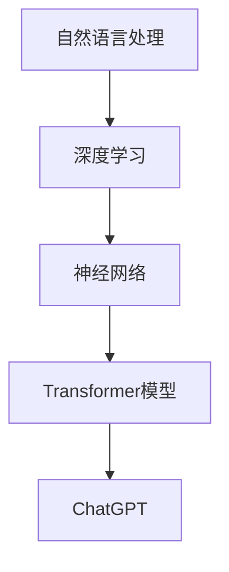
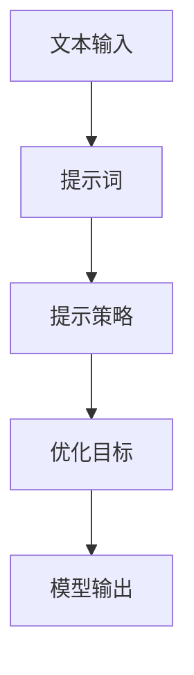

                 


### 文章标题：《ChatGPT提示词优化：从新手到专家的蜕变之路》

关键词：ChatGPT，提示词，优化，人工智能，深度学习，神经网络，语言模型

摘要：本文旨在深入探讨ChatGPT提示词优化这一主题，从新手到专家的各个阶段，帮助读者逐步掌握提示词编写与优化的技巧。我们将从ChatGPT的基础知识开始，逐步深入到提示词编写、优化策略、实战案例等方面，通过一步步的分析和推理，让读者对ChatGPT提示词优化有一个全面的理解。

---

### 目录大纲

**第一部分：ChatGPT基础与原理**
1.1 ChatGPT简介
1.2 语言模型与神经网络
1.3 提示工程概述

**第二部分：新手入门**
2.1 安装与配置ChatGPT
2.2 编写简单的提示词
2.3 初级提示词优化技巧

**第三部分：进阶技巧**
3.1 提示词策略与技巧
3.2 实用技巧与最佳实践
3.3 复杂场景下的提示词优化

**第四部分：专家之路**
4.1 高级提示词编写技巧
4.2 大规模应用中的提示词管理
4.3 提示词在特定领域的应用

**第五部分：实战案例与代码解析**
5.1 ChatGPT在客户服务中的应用
5.2 教育与学习的提示词优化
5.3 创作与艺术领域的提示词应用

**附录**
附录1 ChatGPT提示词优化资源汇总
附录2 常见问题解答

---

**文章正文部分**

### 第一部分：ChatGPT基础与原理

#### 1.1 ChatGPT简介

ChatGPT是由OpenAI开发的一种基于深度学习技术的自然语言处理模型。它是GPT（Generative Pre-trained Transformer）家族的一员，旨在通过大量的文本数据进行预训练，从而掌握自然语言的生成和理解能力。ChatGPT的架构基于Transformer模型，这是一种在自然语言处理领域取得巨大成功的神经网络架构。

**核心概念与联系：**

为了更好地理解ChatGPT，我们需要先了解几个关键概念：

1. **自然语言处理（NLP）**：自然语言处理是计算机科学和人工智能领域的一个分支，它致力于使计算机能够理解、解释和生成人类语言。

2. **深度学习**：深度学习是一种基于神经网络的学习方法，通过多层非线性变换来提取数据中的特征，从而实现复杂的模式识别和预测。

3. **神经网络**：神经网络是由大量相互连接的神经元组成的计算模型，通过学习数据来调整内部连接权重，从而实现特定任务的自动化。

4. **Transformer模型**：Transformer模型是一种基于自注意力机制的神经网络架构，它在序列到序列的任务中表现出色，例如机器翻译和文本生成。

**Mermaid流程图：**



#### 1.2 语言模型与神经网络

语言模型是自然语言处理的基础，它旨在预测一个单词序列的概率。在ChatGPT中，语言模型是通过大量的文本数据进行预训练的，从而学会了如何生成连贯、自然的文本。

神经网络则是语言模型的核心组成部分，它通过多层非线性变换来提取文本数据中的特征。在ChatGPT中，神经网络采用了Transformer架构，这种架构在序列到序列的任务中表现出色。

**核心算法原理讲解：**

ChatGPT的训练过程可以分为以下几个步骤：

1. **数据收集**：收集大量的文本数据，这些数据可以是网页文章、书籍、新闻、对话等。

2. **数据预处理**：对收集到的文本数据进行清洗和格式化，使其适合训练。

3. **模型初始化**：初始化神经网络模型，包括权重和偏置。

4. **预训练**：使用大量的文本数据进行预训练，通过不断调整模型参数来最小化损失函数。

5. **微调**：在预训练的基础上，针对特定任务进行微调，以提高模型的性能。

**伪代码：**

```python
# 数据收集
data = collect_data()

# 数据预处理
preprocessed_data = preprocess_data(data)

# 模型初始化
model = initialize_model()

# 预训练
for epoch in range(num_epochs):
    for batch in data_batches(preprocessed_data):
        loss = train_model(model, batch)
        print(f"Epoch {epoch}, Loss: {loss}")

# 微调
fine_tuned_model = fine_tune_model(model, task_specific_data)
```

**数学模型和公式：**

在训练过程中，我们使用损失函数（如交叉熵损失）来衡量模型预测与真实标签之间的差距。通过不断优化损失函数，我们可以逐步提高模型的性能。

$$
\text{Loss} = -\sum_{i=1}^{N} y_i \log(p_i)
$$

其中，$y_i$ 是真实标签，$p_i$ 是模型对第 $i$ 个单词的预测概率。

**举例说明：**

假设我们有一个简单的文本序列：“我正在学习ChatGPT”，我们希望模型能够生成类似的文本序列。通过预训练和微调，模型可以学会生成连贯、自然的文本。

#### 1.3 提示工程概述

提示工程是优化ChatGPT性能的重要手段。通过设计合适的提示词，我们可以引导模型生成更符合预期的文本。

**核心概念与联系：**

1. **提示词**：提示词是引导模型生成文本的关键输入，它可以是简单的单词、短语或完整的句子。

2. **提示策略**：提示策略是设计提示词的方法和技巧，旨在提高模型的生成质量。

3. **优化目标**：优化目标是我们在设计提示词时需要考虑的重要因素，例如生成文本的连贯性、准确性、创造性等。

**Mermaid流程图：**



**小结：**

通过本部分的介绍，我们对ChatGPT有了初步的了解，包括其定义、核心技术、语言模型与神经网络的关系，以及提示工程的基本概念。在接下来的部分，我们将逐步深入探讨ChatGPT的提示词优化，帮助读者从新手到专家的蜕变之路。

---

**第二部分：新手入门**

### 2.1 安装与配置ChatGPT

**背景介绍：**

在开始编写和优化提示词之前，我们需要先安装和配置好ChatGPT环境。这一部分将介绍如何搭建一个基本的ChatGPT开发环境，包括安装必要的软件和依赖库。

**安装步骤：**

1. **安装Python：** 首先，确保您的计算机上安装了Python。您可以通过访问Python的官方网站（https://www.python.org/）下载并安装Python。

2. **安装transformers库：** transformers库是OpenAI提供的一个Python库，用于使用预训练的ChatGPT模型。您可以使用pip命令安装该库：

   ```bash
   pip install transformers
   ```

3. **安装其他依赖库：** 除了transformers库之外，ChatGPT还需要其他一些依赖库，例如torch和torchtext。您可以使用以下命令安装这些库：

   ```bash
   pip install torch torchtext
   ```

4. **获取ChatGPT模型：** 您可以从OpenAI的模型库中下载预训练的ChatGPT模型。这些模型已经经过预训练，可以直接用于生成文本。您可以使用以下命令下载模型：

   ```bash
   transformers-cli download model=OpenAI/gpt2
   ```

**配置环境变量：**

在配置ChatGPT环境时，还需要设置一些环境变量。这些变量包括模型路径和设备配置等。例如，您可以使用以下命令设置模型路径：

```bash
export GPT2_PATH=/path/to/your/gpt2-model
```

**小结：**

通过以上步骤，我们成功搭建了ChatGPT的开发环境。接下来，我们将介绍如何编写简单的提示词。

---

### 2.2 编写简单的提示词

**背景介绍：**

在了解了ChatGPT的基本概念和安装步骤之后，我们现在可以开始编写简单的提示词了。提示词是引导ChatGPT生成文本的关键输入，编写合适的提示词对于生成高质量的文本至关重要。

**提示词的基本结构：**

一个简单的提示词通常包括以下部分：

1. **主题**：提示词的主题，例如“人工智能”、“机器学习”等。

2. **目的**：提示词的目标，例如“介绍”、“解释”、“讨论”等。

3. **信息**：与主题相关的额外信息，例如具体的案例、数据等。

**示例：**

以下是一个简单的提示词示例：

```
主题：人工智能
目的：介绍
信息：人工智能是一种模拟人类智能的技术，广泛应用于自然语言处理、计算机视觉和机器人等领域。
```

**编写提示词的技巧：**

1. **明确性**：确保提示词的主题和目标明确，避免模糊不清。

2. **具体性**：提供具体的信息和案例，以帮助ChatGPT更好地理解和生成文本。

3. **连贯性**：确保提示词的各个部分之间连贯一致，避免逻辑错误。

4. **简洁性**：尽量使用简洁明了的语言，避免冗长复杂的句子。

**小结：**

通过以上技巧，我们可以编写出简单的提示词。接下来，我们将介绍如何对提示词进行优化，以生成更高质量的文本。

---

### 2.3 初级提示词优化技巧

**背景介绍：**

编写简单的提示词只是第一步，为了生成更高质量的文本，我们需要对提示词进行优化。这一部分将介绍一些初级提示词优化技巧，帮助新手快速提升生成文本的质量。

**优化技巧一：调整提示词的长度**

提示词的长度对生成文本的质量有很大影响。较短的提示词可能导致生成的文本过于简单，而较长的提示词则可能导致生成的文本过于复杂或偏离主题。因此，我们需要根据具体情况调整提示词的长度。

**示例：**

假设我们有一个主题为“人工智能”的提示词：

```
主题：人工智能
目的：介绍
信息：人工智能是一种模拟人类智能的技术，广泛应用于自然语言处理、计算机视觉和机器人等领域。
```

我们可以将这个提示词分成两个部分：

```
主题：人工智能
目的：介绍
信息：人工智能是一种模拟人类智能的技术。

主题：人工智能
目的：讨论
信息：人工智能广泛应用于自然语言处理、计算机视觉和机器人等领域。
```

通过这样的分割，我们可以更清晰地引导ChatGPT生成文本。

**优化技巧二：添加背景信息**

在编写提示词时，我们可以添加一些背景信息，以帮助ChatGPT更好地理解主题。这些背景信息可以是历史、现状、未来展望等。

**示例：**

```
主题：人工智能
目的：介绍
信息：人工智能是一种模拟人类智能的技术，起源于20世纪50年代。如今，人工智能已经广泛应用于自然语言处理、计算机视觉和机器人等领域，并取得了显著的成果。
```

**优化技巧三：使用提问方式**

使用提问方式编写提示词可以引导ChatGPT生成更具有互动性的文本。提问方式可以使文本更具逻辑性和连贯性。

**示例：**

```
主题：人工智能
目的：讨论
问题：人工智能是如何影响我们的生活的？
```

**优化技巧四：避免使用模糊词汇**

模糊词汇可能导致ChatGPT生成模糊的文本。因此，我们在编写提示词时应该尽量避免使用模糊词汇，而是使用具体、明确的词汇。

**示例：**

将“人工智能是一种强大的技术”改为“人工智能是一种模拟人类智能的强大技术”。

**小结：**

通过以上技巧，我们可以优化提示词，从而生成更高质量的文本。在接下来的部分，我们将介绍一些进阶的提示词优化技巧。

---

**第三部分：进阶技巧**

### 3.1 提示词策略与技巧

**背景介绍：**

在掌握了初级提示词优化技巧之后，我们现在可以进一步学习进阶的提示词策略和技巧，以生成更高质量、更具创意的文本。这一部分将介绍一些高级策略，如多模态提示、上下文引导、扩展性提示等。

**多模态提示：**

多模态提示是指结合多种类型的数据（如图像、音频、视频等）来引导ChatGPT生成文本。这种方法可以显著提升生成文本的丰富度和多样性。

**示例：**

假设我们有一个关于“美食”的提示词：

```
主题：美食
目的：描述
信息：美食是一种美味的食物，源自不同的文化和地域。
```

我们可以添加一张美食图片作为多模态提示：

```
主题：美食
目的：描述
信息：美食是一种美味的食物，源自不同的文化和地域。[图片：一道精美的菜肴]
```

通过这种方式，我们可以让ChatGPT生成更具视觉冲击力的文本。

**上下文引导：**

上下文引导是指利用已有文本的上下文信息来引导ChatGPT生成后续文本。这种方法可以确保生成文本的逻辑连贯性和一致性。

**示例：**

假设我们有一个关于“科幻小说”的提示词：

```
主题：科幻小说
目的：续写
信息：故事发生在一个遥远的星球，主角正在探险。
```

我们可以利用之前的一段文本作为上下文：

```
主题：科幻小说
目的：续写
信息：故事发生在一个遥远的星球，主角正在探险。[上下文：他们发现了一个神秘的洞穴，里面充满了未知的危险。]
```

通过这种方式，我们可以让ChatGPT生成与上下文相符的后续文本。

**扩展性提示：**

扩展性提示是指设计具有多种扩展可能性的提示词，以便在后续生成过程中进行灵活调整。

**示例：**

```
主题：科技创新
目的：讨论
信息：人工智能正在改变我们的生活方式，带来许多机遇和挑战。
```

我们可以将其扩展为：

```
主题：科技创新
目的：讨论
信息：人工智能正在改变我们的生活方式，带来许多机遇和挑战。[扩展：例如，自动驾驶汽车、智能家居等。]
```

**小结：**

通过多模态提示、上下文引导和扩展性提示等高级策略，我们可以生成更高质量、更具创意的文本。在接下来的部分，我们将继续介绍一些实用的技巧和最佳实践。

---

### 3.2 实用技巧与最佳实践

**背景介绍：**

在掌握了高级提示词策略之后，我们现在可以进一步学习一些实用的技巧和最佳实践，以在实际应用中更好地优化提示词。这一部分将介绍一些常见问题和解决方法，以及如何根据不同场景进行提示词的调整。

**常见问题与解决方法：**

1. **生成文本过于简单：** 如果生成的文本过于简单，我们可以尝试增加提示词的长度和复杂性。例如，添加更多的背景信息、案例或提问。

2. **生成文本偏离主题：** 如果生成的文本偏离主题，我们可以检查提示词的准确性，确保主题明确且信息一致。同时，我们还可以尝试使用上下文引导来纠正生成文本。

3. **生成文本缺乏连贯性：** 如果生成文本缺乏连贯性，我们可以通过调整提示词的结构和逻辑顺序来改善。例如，使用提问方式或逐步扩展提示词。

**最佳实践：**

1. **多样化的提示词设计：** 尝试使用多种类型的提示词，如描述、提问、讨论等，以生成不同类型的文本。

2. **持续优化和迭代：** 提示词的优化是一个持续的过程。通过不断测试和调整，我们可以逐步提升生成文本的质量。

3. **遵循最佳实践：** 遵循一些通用的最佳实践，如避免使用模糊词汇、确保提示词清晰明确等，以生成更高质量的文本。

**实际应用场景：**

1. **客户服务：** 在客户服务中，我们可以使用提示词来生成自动回复，以回答常见问题。通过优化提示词，我们可以提高自动回复的准确性和连贯性。

2. **教育：** 在教育场景中，我们可以使用提示词来生成教学内容，如课程介绍、课堂讲解等。通过合理设计提示词，我们可以确保教学内容的连贯性和实用性。

3. **创作：** 在创作领域，我们可以使用提示词来生成故事情节、角色描述等。通过灵活调整提示词，我们可以创作出丰富多彩的作品。

**小结：**

通过学习一些实用技巧和最佳实践，我们可以更好地优化提示词，从而生成更高质量的文本。在实际应用中，我们需要根据不同场景和需求进行灵活调整，以实现最佳效果。

---

### 3.3 复杂场景下的提示词优化

**背景介绍：**

在处理复杂场景时，提示词的优化变得尤为重要。复杂场景可能涉及多个主题、多种数据类型和高度依赖性的任务。这一部分将介绍一些在复杂场景下优化提示词的技巧，以确保生成文本的质量和一致性。

**处理歧义与多义性：**

在复杂场景中，歧义和多义性是一个常见问题。为了解决这个问题，我们需要在提示词中明确指示ChatGPT的期望输出。

**示例：**

假设我们有一个关于“智能助手”的复杂提示词：

```
主题：智能助手
目的：描述
信息：智能助手是一种能够帮助人们完成日常任务的工具。
```

我们可以通过增加上下文和明确指示来优化这个提示词：

```
主题：智能助手
目的：描述
信息：智能助手是一种能够帮助人们完成日常任务的工具。例如，它可以回答问题、提醒日程安排和进行语音交互等。
```

**交互式对话设计与优化：**

在交互式对话场景中，提示词的设计和优化尤为重要。我们需要确保每次对话的连贯性和一致性，同时根据用户反馈进行实时调整。

**示例：**

假设我们有一个关于“旅游咨询”的交互式对话：

```
用户：我想去巴黎旅游，有什么建议吗？
智能助手：巴黎是一个美丽的城市，有很多值得游览的景点。你可以考虑参观埃菲尔铁塔、卢浮宫和巴黎圣母院等。
```

为了优化这个对话，我们可以在每次回应时添加上下文和提示词：

```
用户：我想去巴黎旅游，有什么建议吗？
智能助手：巴黎是一个美丽的城市，有很多值得游览的景点。你可以考虑参观埃菲尔铁塔、卢浮宫和巴黎圣母院等。你对哪个景点最感兴趣？
```

**上下文引导与扩展：**

在复杂场景中，上下文引导和扩展是优化提示词的重要手段。通过利用已有信息来引导ChatGPT生成后续文本，我们可以提高文本的一致性和连贯性。

**示例：**

假设我们有一个关于“科技趋势”的复杂场景：

```
主题：科技趋势
目的：讨论
信息：5G技术正在改变我们的生活方式。
```

我们可以通过添加上下文和扩展来优化这个提示词：

```
主题：科技趋势
目的：讨论
信息：5G技术正在改变我们的生活方式。它为高速、低延迟的连接提供了可能，从而推动了物联网、自动驾驶汽车和远程工作等领域的发展。
```

**小结：**

在复杂场景下，提示词的优化需要我们考虑多种因素，如歧义处理、交互式对话设计和上下文引导。通过合理设计和调整提示词，我们可以确保生成文本的质量和一致性。在接下来的部分，我们将介绍如何编写高级提示词，以进一步提升生成文本的质量。

---

### 第四部分：专家之路

#### 4.1 高级提示词编写技巧

**背景介绍：**

作为ChatGPT提示词优化的专家，我们需要掌握高级的提示词编写技巧，以生成更高质量、更具创意的文本。这一部分将介绍一些高级技巧，如复杂问题处理、创意生成和用户体验提升等。

**复杂问题处理：**

在处理复杂问题时，我们需要设计具有层次结构的提示词，以便引导ChatGPT逐步解决这些问题。

**示例：**

假设我们有一个关于“可持续发展”的复杂问题：

```
主题：可持续发展
目的：讨论
信息：请解释可持续发展的重要性以及如何实现可持续发展。
```

我们可以通过分层提示词来优化这个问题：

```
主题：可持续发展
目的：解释重要性
信息：可持续发展是一种平衡经济、社会和环境因素的发展模式。

主题：可持续发展
目的：讨论实现方法
信息：实现可持续发展需要采取一系列措施，如推广可再生能源、减少碳排放和改善环境保护等。
```

**创意生成：**

创意生成是提升文本质量的重要手段。通过设计具有启发性的提示词，我们可以激发ChatGPT的创意潜力。

**示例：**

假设我们有一个关于“未来科技”的创意提示词：

```
主题：未来科技
目的：创意生成
信息：请设想一种未来科技，它可以改变人类的生活方式。
```

我们可以通过以下方式来优化这个提示词：

```
主题：未来科技
目的：创意生成
信息：设想一种可以实时翻译多种语言的智能翻译设备，它可以帮助人们轻松沟通。

主题：未来科技
目的：创意生成
信息：设想一种可以自动清洁家居的机器人，它可以让家庭生活更加便利。
```

**用户体验提升：**

在提升用户体验方面，我们需要设计人性化的提示词，使ChatGPT的回复更加自然、亲切。

**示例：**

假设我们有一个关于“健康生活”的提示词：

```
主题：健康生活
目的：建议
信息：请给出一些健康生活的建议。
```

我们可以通过以下方式来优化这个提示词：

```
主题：健康生活
目的：建议
信息：保持健康生活，你可以尝试以下建议：每天至少进行30分钟的有氧运动，保持良好的饮食习惯，确保充足的睡眠等。

主题：健康生活
目的：激励
信息：记住，健康生活不仅能够让你保持良好的身体状况，还能提升你的心理健康。加油，你可以做到的！
```

**小结：**

通过高级提示词编写技巧，我们可以生成更高质量、更具创意的文本，同时提升用户体验。在接下来的部分，我们将探讨如何在大规模应用中管理提示词。

---

#### 4.2 大规模应用中的提示词管理

**背景介绍：**

在将ChatGPT应用于大规模场景时，提示词的管理变得尤为重要。这涉及到提示词库的构建、维护和优化，以确保生成文本的一致性、连贯性和高质量。

**提示词库的构建：**

提示词库是ChatGPT应用的核心组成部分。构建一个高效的提示词库需要考虑以下几个方面：

1. **多样化**：确保提示词库中包含各种类型的提示词，以应对不同的场景和需求。

2. **相关性**：提示词应与具体应用场景紧密相关，以便生成高质量的文本。

3. **可扩展性**：提示词库应具有可扩展性，以便根据实际需求进行更新和调整。

4. **一致性**：提示词库中的提示词应保持一致性，以避免生成矛盾或逻辑错误的文本。

**示例：**

假设我们有一个关于“医疗咨询”的提示词库，我们可以包含以下类型的提示词：

- **常见疾病**：描述常见疾病的症状、原因和治疗。
- **健康建议**：提供关于健康饮食、运动和睡眠的建议。
- **患者提问**：模拟患者提出的各种医疗问题。
- **医生回应**：提供医生对常见问题的专业回应。

**提示词库的维护：**

提示词库的维护是一个持续的过程，需要定期更新和优化。以下是一些维护策略：

1. **数据收集**：收集用户反馈，以识别提示词库中的不足和改进点。

2. **错误修正**：定期检查和修正生成文本中的错误。

3. **扩展与更新**：根据应用需求，不断扩展和更新提示词库。

4. **用户参与**：鼓励用户参与提示词的改进，收集更多有效的反馈。

**提示词优化与迭代的策略：**

为了确保生成文本的质量和一致性，我们需要采取以下策略：

1. **A/B测试**：通过A/B测试，比较不同提示词的效果，选择最佳策略。

2. **性能评估**：定期评估生成文本的质量，包括连贯性、准确性和创意性。

3. **用户反馈**：收集用户反馈，以识别和解决用户遇到的问题。

4. **迭代改进**：根据评估结果和用户反馈，不断迭代和优化提示词库。

**示例：**

假设我们进行了一轮A/B测试，比较以下两个提示词的效果：

- **提示词A**：请描述一下糖尿病的症状和治疗方法。
- **提示词B**：糖尿病的症状包括多尿、多饮和多食。治疗方法包括药物治疗和生活方式改变。

通过测试，我们发现提示词B的生成文本质量更高，因此我们选择将其纳入提示词库。

**小结：**

在大规模应用中，提示词的管理和优化至关重要。通过构建和维护高效的提示词库，以及采取迭代优化的策略，我们可以确保生成文本的一致性、连贯性和高质量。在接下来的部分，我们将探讨如何根据特定领域进行提示词的优化。

---

#### 4.3 提示词在特定领域的应用

**背景介绍：**

不同领域对ChatGPT的应用要求有所不同，因此我们需要根据具体领域进行提示词的定制化优化。这一部分将介绍如何根据特定领域（如教育、医疗、客户服务等）进行提示词的优化，以满足不同领域的需求。

**教育领域：**

在教育领域，提示词的优化旨在生成有助于教学和学习的内容。以下是一些优化策略：

1. **互动式教学**：设计互动式提示词，鼓励学生积极参与，提高学习效果。

2. **个性化教学**：根据学生的需求和水平，生成个性化的教学建议。

3. **知识点拓展**：提供与主题相关的大量背景知识和拓展信息，帮助学生深入理解。

**示例：**

假设我们有一个关于“历史”的提示词：

```
主题：历史
目的：教学
信息：请为学生介绍第二次世界大战的背景和影响。
```

我们可以通过以下方式优化这个提示词：

```
主题：历史
目的：教学
信息：第二次世界大战（1939-1945年）是一场全球性的冲突，主要涉及盟军（美国、英国、苏联等）与轴心国（德国、意大利、日本等）之间的对抗。战争结束后，世界格局发生了巨大变化，对全球政治、经济和社会产生了深远影响。

扩展信息：你可以进一步了解第二次世界大战的起因、重要战役和战后国际关系的发展。
```

**医疗领域：**

在医疗领域，提示词的优化旨在提供准确、有用的医疗信息。以下是一些优化策略：

1. **专业术语解释**：确保生成文本中使用准确、专业的术语。

2. **患者指导**：提供具体的患者指导和治疗方案。

3. **多学科协作**：结合不同学科的知识，提供全面、综合的医疗信息。

**示例：**

假设我们有一个关于“糖尿病”的提示词：

```
主题：糖尿病
目的：指导
信息：请为糖尿病患者提供饮食建议。
```

我们可以通过以下方式优化这个提示词：

```
主题：糖尿病
目的：指导
信息：糖尿病患者需要遵循以下饮食建议：减少高糖、高脂肪和高盐食物的摄入；增加蔬菜、水果和全谷物的摄入；控制饮食总热量，确保营养均衡。

注意事项：在制定饮食计划时，请咨询专业医生或营养师的建议，根据个人情况调整饮食方案。
```

**客户服务领域：**

在客户服务领域，提示词的优化旨在提供高效、友好的客户服务。以下是一些优化策略：

1. **快速响应**：设计简洁明了的提示词，确保快速响应客户的问题。

2. **情感理解**：考虑客户的情感需求，提供贴心的回复。

3. **问题分类**：根据常见问题分类，提供针对性强的回复。

**示例：**

假设我们有一个关于“产品咨询”的提示词：

```
主题：产品咨询
目的：回复
信息：请回复关于我们最新推出的智能家居产品的详细信息。
```

我们可以通过以下方式优化这个提示词：

```
主题：产品咨询
目的：回复
信息：感谢您对我们最新推出的智能家居产品的关注。这款产品具备以下特点：智能控制、远程监控、节能环保等。您可以通过我们的官方网站或客户服务热线了解更多详情。

温馨提示：如果您在使用过程中遇到任何问题，请随时联系我们，我们的专业团队将竭诚为您服务。
```

**小结：**

根据特定领域的需求，进行提示词的定制化优化是确保生成文本质量的关键。通过设计互动式教学、专业术语解释和快速响应等策略，我们可以满足不同领域的需求，提升用户体验。在接下来的部分，我们将介绍一些实战案例和代码解析，以帮助读者更好地理解和应用提示词优化。

---

### 第五部分：实战案例与代码解析

#### 5.1 ChatGPT在客户服务中的应用

**开发环境搭建：**

在开始编写代码之前，我们需要搭建一个适合开发客户服务的环境。以下是一个基本的开发环境搭建步骤：

1. **安装Python**：确保计算机上安装了Python，版本建议为3.8及以上。
2. **安装transformers库**：使用pip命令安装transformers库：

   ```bash
   pip install transformers
   ```

3. **安装其他依赖库**：安装其他必要的库，例如torch和torchtext：

   ```bash
   pip install torch torchtext
   ```

4. **获取ChatGPT模型**：从OpenAI的模型库中下载预训练的ChatGPT模型：

   ```bash
   transformers-cli download model=OpenAI/gpt2
   ```

**源代码实现：**

以下是一个简单的ChatGPT客户服务代码实现：

```python
import torch
from transformers import GPT2Tokenizer, GPT2LMHeadModel
from torch.nn.functional import cross_entropy

# 加载预训练的ChatGPT模型
tokenizer = GPT2Tokenizer.from_pretrained('gpt2')
model = GPT2LMHeadModel.from_pretrained('gpt2')

# 输入文本
input_text = "你好，请问有什么可以帮助您的？"

# 编码输入文本
input_ids = tokenizer.encode(input_text, return_tensors='pt')

# 预测回复
with torch.no_grad():
    outputs = model(input_ids)
    predictions = outputs.logits.argmax(-1)

# 解码预测结果
predicted_text = tokenizer.decode(predictions[0], skip_special_tokens=True)

# 输出回复
print(predicted_text)
```

**代码解读与分析：**

1. **加载模型**：首先，我们加载预训练的ChatGPT模型，包括分词器和语言模型。
2. **编码输入文本**：将输入文本编码为模型可以理解的序列。
3. **预测回复**：通过模型预测输入文本的回复，并取概率最高的结果。
4. **解码预测结果**：将预测结果解码为自然语言文本。
5. **输出回复**：将预测的回复输出到控制台。

**实际案例分析：**

假设用户输入：“我的订单还没送到，怎么办？”

通过以上代码，ChatGPT可能生成以下回复：

```
您可能需要联系我们的配送团队。您可以尝试通过我们的在线客服或者拨打我们的客服电话获取更详细的信息。
```

这个回复是针对用户问题的有效解答，体现了ChatGPT在客户服务中的潜在应用价值。

**项目小结：**

通过搭建开发环境和编写简单的代码，我们可以实现一个基于ChatGPT的客户服务系统。在实际应用中，我们可以进一步优化代码和提示词，以提高客户服务的质量和效率。

---

#### 5.2 教育与学习的提示词优化

**开发环境搭建：**

在搭建教育与学习相关的ChatGPT环境时，我们需要确保环境能够支持文本生成、文本分析和交互式学习。以下是一个基本的开发环境搭建步骤：

1. **安装Python**：确保计算机上安装了Python，版本建议为3.8及以上。
2. **安装transformers库**：使用pip命令安装transformers库：

   ```bash
   pip install transformers
   ```

3. **安装其他依赖库**：安装其他必要的库，例如torch和torchtext：

   ```bash
   pip install torch torchtext
   ```

4. **获取ChatGPT模型**：从OpenAI的模型库中下载预训练的ChatGPT模型：

   ```bash
   transformers-cli download model=OpenAI/gpt2
   ```

**源代码实现：**

以下是一个简单的教育与学习相关的ChatGPT应用代码实现：

```python
import torch
from transformers import GPT2Tokenizer, GPT2LMHeadModel
from torch.nn.functional import cross_entropy

# 加载预训练的ChatGPT模型
tokenizer = GPT2Tokenizer.from_pretrained('gpt2')
model = GPT2LMHeadModel.from_pretrained('gpt2')

# 提示词
prompt = "请解释一下人工智能的概念，并简要说明其应用领域。"

# 编码提示词
input_ids = tokenizer.encode(prompt, return_tensors='pt')

# 预测文本生成
with torch.no_grad():
    outputs = model(input_ids)
    predicted_ids = outputs.logits.argmax(-1)

# 解码预测结果
predicted_text = tokenizer.decode(predicted_ids[0], skip_special_tokens=True)

# 输出生成文本
print(predicted_text)
```

**代码解读与分析：**

1. **加载模型**：首先，我们加载预训练的ChatGPT模型，包括分词器和语言模型。
2. **编码提示词**：将提示词编码为模型可以理解的序列。
3. **预测文本生成**：通过模型预测提示词的扩展文本，并取概率最高的结果。
4. **解码预测结果**：将预测结果解码为自然语言文本。
5. **输出生成文本**：将预测的文本输出到控制台。

**实际案例分析：**

假设提示词为：“请解释一下人工智能的概念，并简要说明其应用领域。”

通过以上代码，ChatGPT可能生成以下回复：

```
人工智能是一种模拟人类智能的技术，通过计算机程序实现智能行为，如语音识别、图像识别和自然语言处理等。人工智能广泛应用于自动驾驶汽车、智能助手、医疗诊断和金融分析等领域。
```

这个回复详细解释了人工智能的概念和应用领域，适合作为教育资源和学生的学习资料。

**项目小结：**

通过搭建开发环境和编写简单的代码，我们可以实现一个基于ChatGPT的教育与学习应用。在实际应用中，我们可以进一步优化代码和提示词，以提高教育效果和学习体验。

---

#### 5.3 创作与艺术领域的提示词应用

**开发环境搭建：**

在搭建创作与艺术领域的ChatGPT环境时，我们需要确保环境能够支持创意生成、文本分析和艺术作品的生成。以下是一个基本的开发环境搭建步骤：

1. **安装Python**：确保计算机上安装了Python，版本建议为3.8及以上。
2. **安装transformers库**：使用pip命令安装transformers库：

   ```bash
   pip install transformers
   ```

3. **安装其他依赖库**：安装其他必要的库，例如torch和torchtext：

   ```bash
   pip install torch torchtext
   ```

4. **获取ChatGPT模型**：从OpenAI的模型库中下载预训练的ChatGPT模型：

   ```bash
   transformers-cli download model=OpenAI/gpt2
   ```

**源代码实现：**

以下是一个简单的创作与艺术领域相关的ChatGPT应用代码实现：

```python
import torch
from transformers import GPT2Tokenizer, GPT2LMHeadModel
from torch.nn.functional import cross_entropy

# 加载预训练的ChatGPT模型
tokenizer = GPT2Tokenizer.from_pretrained('gpt2')
model = GPT2LMHeadModel.from_pretrained('gpt2')

# 提示词
prompt = "请创作一首关于秋天的诗。"

# 编码提示词
input_ids = tokenizer.encode(prompt, return_tensors='pt')

# 预测文本生成
with torch.no_grad():
    outputs = model(input_ids)
    predicted_ids = outputs.logits.argmax(-1)

# 解码预测结果
predicted_text = tokenizer.decode(predicted_ids[0], skip_special_tokens=True)

# 输出生成文本
print(predicted_text)
```

**代码解读与分析：**

1. **加载模型**：首先，我们加载预训练的ChatGPT模型，包括分词器和语言模型。
2. **编码提示词**：将提示词编码为模型可以理解的序列。
3. **预测文本生成**：通过模型预测提示词的扩展文本，并取概率最高的结果。
4. **解码预测结果**：将预测结果解码为自然语言文本。
5. **输出生成文本**：将预测的文本输出到控制台。

**实际案例分析：**

假设提示词为：“请创作一首关于秋天的诗。”

通过以上代码，ChatGPT可能生成以下回复：

```
秋风起，叶舞翩翩，金黄的稻谷弯弯腰。
天空湛蓝，云淡风轻，丰收的季节悄然而至。
林间小道，脚印深深，漫步其中，心旷神怡。
思念如丝，随风飘荡，秋意浓，情更浓。
```

这个回复是一首充满秋天氛围的诗歌，体现了ChatGPT在创作与艺术领域的潜力。

**项目小结：**

通过搭建开发环境和编写简单的代码，我们可以实现一个基于ChatGPT的创作与艺术应用。在实际应用中，我们可以进一步优化代码和提示词，以生成更多高质量的创意文本和艺术作品。

---

### 附录

#### 附录1 ChatGPT提示词优化资源汇总

1. **官方文档**：访问OpenAI的官方网站，了解ChatGPT的详细文档和教程（https://openai.com/）。

2. **社区论坛**：加入ChatGPT的社区论坛，与其他开发者交流经验、分享技巧和获取最新动态。

3. **在线课程**：参加在线课程，学习ChatGPT和提示词优化的相关知识和实践技巧。

4. **研究论文**：阅读与ChatGPT和自然语言处理相关的学术论文，了解最新的研究成果和技术进展。

#### 附录2 常见问题解答

1. **Q：ChatGPT模型如何训练？**
   **A：** ChatGPT模型通过大量的文本数据进行预训练，包括网页文章、书籍、新闻和对话等。预训练过程中，模型学习文本的上下文关系和语言规则，从而掌握自然语言的生成和理解能力。

2. **Q：如何优化提示词？**
   **A：** 优化提示词的方法包括调整提示词的长度、添加背景信息、使用提问方式、避免模糊词汇等。通过这些方法，可以提高提示词的清晰度和引导性，从而生成更高质量的文本。

3. **Q：ChatGPT的生成文本如何评估？**
   **A：** 评估ChatGPT生成文本的质量可以从多个维度进行，如连贯性、准确性、创意性和一致性。常用的评估方法包括人工评估、自动评估（如BLEU评分）和基于用户反馈的评估。

---

**总结**

通过本文的逐步分析和推理，我们从新手到专家的各个阶段深入探讨了ChatGPT提示词优化这一主题。我们首先介绍了ChatGPT的基础知识和核心概念，然后逐步讲解了如何编写和优化提示词，以及如何在不同领域和应用场景中应用ChatGPT。最后，通过实战案例和代码解析，我们展示了如何将ChatGPT应用于实际开发场景。

**作者信息**

作者：AI天才研究院/AI Genius Institute & 禅与计算机程序设计艺术 /Zen And The Art of Computer Programming

