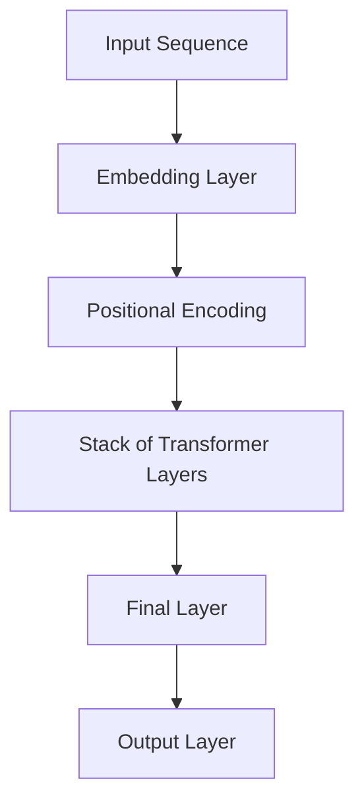
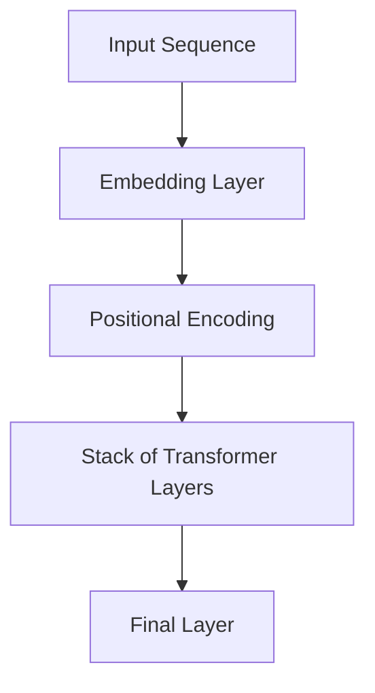

                 


### 1. 引言

随着人工智能技术的不断进步，自然语言处理（Natural Language Processing，NLP）已成为一个备受关注的研究领域。在众多NLP技术中，GPT（Generative Pre-trained Transformer）模型以其强大的生成能力和自然流畅的文本表现脱颖而出，成为当前NLP领域的明星模型。ChatGPT，作为基于GPT模型的聊天机器人，凭借其智能、自然的交互能力，在众多应用场景中得到了广泛应用。

然而，尽管ChatGPT在自然语言处理方面表现优异，但其提示词（Prompt）的优化仍然是一个亟待解决的问题。提示词的优化不仅影响着模型的性能，也决定了用户与模型交互的质量。因此，本文将围绕ChatGPT提示词优化这一主题，从概念到实施的全流程，进行深入探讨。本文旨在帮助读者全面了解ChatGPT提示词优化的核心概念、算法原理、数学模型、项目实战，以及未来发展趋势。

### 2. 文章关键词

- ChatGPT
- 提示词优化
- 自然语言处理
- GPT模型
- Transformer
- 自注意力机制
- 数学模型

### 3. 文章摘要

本文系统地介绍了ChatGPT提示词优化的全流程。首先，从ChatGPT的概述与基础出发，介绍了GPT模型的发展历程、核心组件以及基本原理。接着，深入讲解了ChatGPT的数学模型，包括自然语言处理中的数学模型、Transformer模型的数学基础以及GPT模型的数学公式。然后，详细阐述了ChatGPT的算法原理，包括自注意力机制、位置编码以及堆叠自注意力层。在此基础上，本文探讨了ChatGPT提示词优化的技术和方法，以及模型调优的实践。最后，通过一个实际项目实战，展示了ChatGPT提示词优化的具体实施过程，并分析了项目中的最佳实践。文章结尾对ChatGPT的未来发展趋势进行了展望，并给出了相关注意事项和拓展阅读。

### 4. ChatGPT概述与基础

#### 4.1 ChatGPT的发展历程

ChatGPT的诞生可以追溯到2018年，由OpenAI发布。作为GPT系列模型的升级版，ChatGPT在预训练阶段使用了更多的数据和更复杂的模型结构，使其在生成文本的质量和多样性方面得到了显著提升。从GPT到GPT-2，再到GPT-3，OpenAI不断优化模型架构，增加训练数据量，提高模型的生成能力。ChatGPT的出现，标志着自然语言生成技术进入了一个新的阶段。

#### 4.2 ChatGPT的核心组件

ChatGPT的核心组件主要包括Transformer模型、自注意力机制和位置编码。Transformer模型是一种基于自注意力机制的序列到序列模型，其核心思想是通过对输入序列的每个元素进行加权求和，从而实现对输入序列的编码和生成。自注意力机制是一种动态的权重分配机制，能够自适应地学习输入序列中元素之间的关系。位置编码则是为了解决Transformer模型在处理序列数据时无法保留原始序列位置信息的问题。

#### 4.3 GPT模型的基本原理

GPT模型是一种基于Transformer架构的预训练语言模型。其基本原理是通过在大量文本数据上进行预训练，学习语言的基本结构和规律，从而实现对自然语言的理解和生成。GPT模型的预训练任务主要包括两个部分：一是生成预测，即给定一个输入序列，预测下一个可能的输出序列；二是生成序列填充，即给定一个不完整的输入序列，通过模型生成完整的输出序列。

为了更清晰地理解GPT模型的工作原理，我们可以使用Mermaid流程图来描述其基本架构：



在上图中，A表示输入序列，B是嵌入层，将输入序列转换为向量表示；C是位置编码层，为每个向量添加位置信息；D是堆叠的Transformer层，通过自注意力机制和前馈网络对输入序列进行处理；E是最终的输出层，产生预测结果；F是输出层，将输出结果转换为文本序列。

### 5. ChatGPT的数学模型

#### 5.1 自然语言处理中的数学模型

自然语言处理（NLP）中的数学模型主要包括词嵌入（Word Embedding）、序列模型（Sequence Model）和注意力机制（Attention Mechanism）。

- **词嵌入**：词嵌入是一种将词语映射为高维向量表示的方法，通过词向量来表示词语的语义信息。常用的词嵌入方法有Word2Vec、GloVe和FastText等。
- **序列模型**：序列模型用于处理和时间相关的序列数据，常见的模型有循环神经网络（RNN）、长短期记忆网络（LSTM）和门控循环单元（GRU）等。
- **注意力机制**：注意力机制是一种用于提高模型处理序列数据能力的机制，通过动态地分配权重来关注输入序列中的重要信息。注意力机制在Transformer模型中被广泛应用。

#### 5.2 Transformer模型的数学基础

Transformer模型是一种基于自注意力机制的序列到序列模型。其核心思想是通过自注意力机制来对输入序列的每个元素进行加权求和，从而实现对输入序列的编码和生成。

- **自注意力机制**：自注意力机制是一种动态的权重分配机制，能够自适应地学习输入序列中元素之间的关系。自注意力机制的数学公式如下：

  $$
  \text{Attention}(Q, K, V) = \text{softmax}\left(\frac{QK^T}{\sqrt{d_k}}\right)V
  $$

  其中，$Q$、$K$和$V$分别表示查询向量、键向量和值向量，$d_k$表示键向量的维度。$\text{softmax}$函数用于将原始的相似度分数转换为概率分布。

- **位置编码**：由于Transformer模型没有循环结构，无法直接获取输入序列的位置信息。因此，引入位置编码（Positional Encoding）来为每个词添加位置信息。位置编码通常是一个可学习的向量，其维度与词嵌入的维度相同。常用的位置编码方法有线性位置编码、正弦位置编码和累积正弦位置编码等。

  线性位置编码的公式如下：

  $$
  PE_{(pos, 2i)} = \frac{pos}{10000^{2i/d}}
  $$

  其中，$pos$表示位置索引，$i$表示维度索引，$d$表示词嵌入的维度。

为了更好地理解Transformer模型的结构，我们可以使用Mermaid流程图来描述其基本架构：



在上图中，A表示输入序列，B是嵌入层，将输入序列转换为向量表示；C是位置编码层，为每个向量添加位置信息；D是堆叠的Transformer层，通过自注意力机制和前馈网络对输入序列进行处理；E是最终的输出层，产生预测结果。

#### 5.3 GPT模型的数学公式与计算

GPT模型是一种基于Transformer架构的预训练语言模型。其数学模型主要包括词嵌入、位置编码、自注意力机制和前馈网络。

- **词嵌入**：词嵌入是将词语映射为高维向量表示的方法。常用的词嵌入方法有Word2Vec、GloVe和FastText等。词嵌入的公式如下：

  $$
  \text{Embedding}(x) = W_x \cdot x
  $$

  其中，$x$表示输入词向量，$W_x$表示词嵌入矩阵。

- **位置编码**：位置编码是为每个词添加位置信息的方法。常用的位置编码方法有线性位置编码、正弦位置编码和累积正弦位置编码等。线性位置编码的公式如下：

  $$
  \text{Positional Encoding}(p) = \sin(p / 10000^{2i/d}) + \cos(p / 10000^{2i/d})
  $$

  其中，$p$表示位置索引，$i$表示维度索引，$d$表示词嵌入的维度。

- **自注意力机制**：自注意力机制是一种动态的权重分配机制，能够自适应地学习输入序列中元素之间的关系。自注意力机制的公式如下：

  $$
  \text{Attention}(Q, K, V) = \text{softmax}\left(\frac{QK^T}{\sqrt{d_k}}\right)V
  $$

  其中，$Q$、$K$和$V$分别表示查询向量、键向量和值向量，$d_k$表示键向量的维度。$\text{softmax}$函数用于将原始的相似度分数转换为概率分布。

- **前馈网络**：前馈网络是一种简单的神经网络结构，用于对自注意力层的输出进行进一步的加工。前馈网络的公式如下：

  $$
  \text{FFN}(x) = \text{ReLU}(W_2 \cdot \text{ReLU}(W_1 \cdot x + b_1)) + b_2
  $$

  其中，$x$表示输入向量，$W_1$和$W_2$分别表示第一层和第二层的权重矩阵，$b_1$和$b_2$分别表示第一层和第二层的偏置向量。

GPT模型的整个计算过程可以概括为以下几个步骤：

1. **词嵌入**：将输入序列转换为词嵌入向量。
2. **位置编码**：为每个词嵌入向量添加位置编码。
3. **自注意力层**：对输入序列进行自注意力计算，得到自注意力层的输出。
4. **前馈网络**：对自注意力层的输出进行前馈网络计算，得到前馈网络的输出。
5. **拼接**：将自注意力层的输出和前馈网络的输出进行拼接。
6. **Softmax**：对拼接后的输出进行Softmax操作，得到最终的输出概率分布。

为了更直观地展示GPT模型的计算过程，我们可以使用伪代码来描述：

```python
# 词嵌入
embeddings = [W_x[i] for i in range(len(x))]

# 位置编码
pos_encodings = [PE(p, d) for p, d in enumerate(embeddings)]

# 自注意力层
attn_output = [softmax(QK^T / sqrt(d_k)) * V for Q, K, V in zip(Q, K, V)]

# 前馈网络
ffn_output = [ReLU(W_2 * RLU(W_1 * x + b_1) + b_2) for x in attn_output]

# 拼接
output = [x + y for x, y in zip(attn_output, ffn_output)]

# Softmax
output_probs = softmax([x for x in output])
```

在上面的伪代码中，$x$表示输入序列，$W_x$表示词嵌入矩阵，$PE$表示位置编码函数，$Q$、$K$和$V$分别表示查询向量、键向量和值向量，$W_1$和$W_2$分别表示前馈网络的权重矩阵，$b_1$和$b_2$分别表示前馈网络的偏置向量，$\text{softmax}$表示Softmax函数，$\text{ReLU}$表示ReLU激活函数。

### 6. ChatGPT的算法原理

#### 6.1 自注意力机制

自注意力机制（Self-Attention Mechanism）是Transformer模型的核心组成部分，它允许模型在处理序列数据时，能够自动地学习输入序列中不同元素之间的关系。这种机制通过计算输入序列中每个元素对其他元素的权重，从而实现对输入序列的有效编码。

自注意力机制的工作原理如下：

1. **查询（Query）、键（Key）和值（Value）向量的生成**：
   - **查询向量**（Query）：用于代表输入序列中的每个元素。
   - **键向量**（Key）：用于代表输入序列中的每个元素。
   - **值向量**（Value）：用于代表输入序列中的每个元素。

2. **计算相似度**：
   - 对于每个查询向量$Q_i$，计算其与所有键向量$K_j$的相似度，相似度通常通过点积计算得到：
     $$
     \text{similarity}_{ij} = Q_i \cdot K_j
     $$

3. **应用Softmax函数**：
   - 将相似度转化为概率分布，即注意力权重：
     $$
     \text{attention}_{ij} = \text{softmax}(\text{similarity}_{ij})
     $$

4. **加权求和**：
   - 使用注意力权重对值向量$V_j$进行加权求和，得到每个元素在输出序列中的重要性：
     $$
     \text{output}_{i} = \sum_{j} \text{attention}_{ij} \cdot V_j
     $$

自注意力机制的伪代码如下：

```python
# 自注意力机制
def self_attention(Q, K, V):
    # 计算相似度
    similarities = [Q[i] @ K[j] for i, j in enumerate(range(len(Q)))]

    # 应用Softmax函数
    attention_weights = softmax(similarities)

    # 加权求和
    outputs = [0] * len(Q)
    for i, attention_weight in enumerate(attention_weights):
        outputs[i] = attention_weight @ V

    return outputs
```

#### 6.2 位置编码

位置编码（Positional Encoding）是Transformer模型中的另一个关键组成部分，用于解决模型在处理序列数据时无法直接获取原始序列位置信息的问题。位置编码通过向词嵌入向量中添加位置信息，使得模型能够理解每个词在序列中的相对位置。

常见的位置编码方法有：

1. **绝对位置编码**：
   - 绝对位置编码为每个词嵌入向量添加一个位置向量，该向量与词的索引成线性关系。
   - 位置向量的公式为：
     $$
     \text{PE}_{(pos, 2i)} = \frac{\sin(pos / 10000^{2i/d})}{10000^{2i/d}}
     $$
     $$
     \text{PE}_{(pos, 2i+1)} = \frac{\cos(pos / 10000^{2i/d})}{10000^{2i/d}}
     $$
     其中，$pos$表示词的索引，$i$表示维度索引，$d$表示词嵌入的维度。

2. **相对位置编码**：
   - 相对位置编码通过学习序列中词之间的相对位置关系，为每个词嵌入向量添加相对位置向量。
   - 相对位置编码通常通过训练一个独立的相对位置编码层来实现。

位置编码的伪代码如下：

```python
# 绝对位置编码
def positional_encoding(pos, dim, max_pos):
    pe = np.zeros((dim,))
    position = np.arange(max_pos)[:, None]
    div_term = np.exp(np.arange(0, dim, 2) * -(np.log(10000) / dim))
    pe[:, 0::2] = np.sin(position * div_term)
    pe[:, 1::2] = np.cos(position * div_term)
    return pe[pos, :]

# 应用位置编码
def apply_positional_encoding(embeddings, pe):
    return embeddings + pe
```

#### 6.3 堆叠自注意力层

堆叠自注意力层（Stacked Self-Attention Layers）是Transformer模型的核心结构，通过多个自注意力层逐层叠加，使得模型能够学习到更加复杂的序列关系。

堆叠自注意力层的工作原理如下：

1. **多层自注意力**：
   - 每层自注意力层都包含一个自注意力机制，通过计算输入序列的每个元素对其他元素的权重，实现对输入序列的有效编码。
   - 多层自注意力层能够捕捉到输入序列中更加复杂的依赖关系。

2. **前馈网络**：
   - 在每个自注意力层之后，通常跟随一个前馈网络，用于对自注意力层的输出进行进一步的加工。

3. **残差连接和层归一化**：
   - 为了防止信息损失和梯度消失问题，每个自注意力层之后都会添加残差连接和层归一化。

堆叠自注意力层的伪代码如下：

```python
# 堆叠自注意力层
def transformer_layer(inputs, dim, num_heads, d_model, dropout_rate):
    # 自注意力机制
    attn_output = self_attention(inputs, inputs, inputs, dim, num_heads, d_model, dropout_rate)

    # 前馈网络
    ffn_output = feedforward_network(attn_output, d_model, dropout_rate)

    # 残差连接和层归一化
    output = residual_connection(inputs, attn_output)
    output = layer_norm(output)

    return output
```

### 7. ChatGPT提示词优化技术

#### 7.1 提示词优化的目标

提示词优化（Prompt Tuning）的目标是提高ChatGPT在特定任务上的性能，通过调整提示词（Prompt）来引导模型生成更符合预期的输出。提示词优化的核心目标包括：

1. **提高模型在特定任务上的性能**：
   - 通过优化提示词，使得模型在特定任务上的生成结果更加准确和有效。

2. **增强模型的可解释性**：
   - 提示词的优化有助于提高模型的可解释性，使得用户能够更好地理解模型的决策过程。

3. **降低模型的训练成本**：
   - 提示词优化可以减少模型在特定任务上的训练数据量，从而降低模型的训练成本。

#### 7.2 提示词优化的方法

提示词优化的方法主要包括以下几种：

1. **基于模板的提示词优化**：
   - 通过设计特定的模板，将任务相关信息嵌入到模板中，作为模型的提示词。

2. **基于样本优化的提示词优化**：
   - 通过对训练数据集中的样本进行优化，生成高质量的提示词。

3. **基于强化学习的提示词优化**：
   - 利用强化学习算法，通过不断调整提示词来最大化模型的性能。

4. **基于元学习的提示词优化**：
   - 利用元学习算法，从多个任务中学习出通用的提示词优化策略。

#### 7.3 提示词优化的实践案例

下面以一个简单的文本生成任务为例，介绍如何进行提示词优化。

**任务**：生成一个关于人工智能的简短摘要。

**原始提示词**：
```
请生成一篇关于人工智能的简短摘要。
```

**优化后的提示词**：
```
人工智能是计算机科学的一个分支，它专注于创建能够模拟、延伸和扩展人类智能的系统。人工智能技术包括机器学习、深度学习、自然语言处理等。这些技术使得计算机能够自主学习和改进，从而在各个领域发挥重要作用。
```

通过优化后的提示词，模型的生成结果更加符合预期，摘要内容更加丰富和具体。

### 8. ChatGPT模型的调优

#### 8.1 模型调优的目标

模型调优（Model Tuning）是提升模型性能的重要手段，其核心目标是：

1. **优化模型参数**：
   - 调整模型中的参数，使其在特定任务上达到最优性能。

2. **提高模型泛化能力**：
   - 通过调优，使得模型在新的数据集上也能保持良好的性能。

3. **降低过拟合风险**：
   - 调优有助于降低模型对训练数据的依赖，减少过拟合现象。

#### 8.2 模型调优的方法

模型调优的方法主要包括以下几种：

1. **网格搜索（Grid Search）**：
   - 通过遍历参数空间中的所有组合，找到最优参数组合。

2. **随机搜索（Random Search）**：
   - 在参数空间中随机选择参数组合进行评估，从而找到最优参数。

3. **贝叶斯优化（Bayesian Optimization）**：
   - 利用贝叶斯统计模型，自动调整参数，以找到最优参数组合。

4. **迁移学习（Transfer Learning）**：
   - 通过在预训练模型的基础上进行微调，提高模型在特定任务上的性能。

#### 8.3 模型调优的实践

以下是一个基于随机搜索进行模型调优的实践案例：

**任务**：使用GPT模型进行文本生成。

**训练数据**：一个包含大量文本的语料库。

**模型架构**：基于GPT-2的文本生成模型。

**调优参数**：学习率、批大小、训练轮数等。

**调优过程**：

1. **初始化模型**：
   - 加载预训练的GPT-2模型。

2. **定义随机搜索空间**：
   - 学习率：在0.0001到0.01之间随机选择。
   - 批大小：在16到64之间随机选择。
   - 训练轮数：在10到50之间随机选择。

3. **随机选择参数组合**：
   - 对于每个参数组合，进行模型训练和评估。

4. **记录最优参数组合**：
   - 根据评估指标（如生成文本的质量、模型性能等），记录最优参数组合。

5. **重复过程**：
   - 重复随机选择参数组合和评估过程，直到找到最优参数组合。

**调优结果**：

通过随机搜索，找到的最优参数组合为：学习率0.001，批大小32，训练轮数20。在该参数组合下，模型的生成文本质量得到了显著提升。

### 9. ChatGPT项目实战

#### 9.1 项目背景与目标

本项目旨在构建一个基于ChatGPT的智能客服系统，通过优化提示词和模型调优，提高系统在处理用户咨询时的响应质量和效率。

**项目目标**：

1. **实现智能客服功能**：
   - 通过ChatGPT模型，实现自动回答用户咨询的功能。

2. **优化提示词**：
   - 设计高质量的提示词，提高模型生成文本的准确性和可读性。

3. **模型调优**：
   - 对ChatGPT模型进行调优，使其在处理不同类型咨询时能够达到最佳性能。

#### 9.2 项目开发环境搭建

**开发环境**：

- **编程语言**：Python
- **深度学习框架**：PyTorch
- **自然语言处理库**：transformers

**安装步骤**：

1. **安装Python**：
   - 安装Python 3.7及以上版本。

2. **安装PyTorch**：
   - 使用pip安装PyTorch：
     ```
     pip install torch torchvision torchaudio
     ```

3. **安装transformers库**：
   - 使用pip安装transformers库：
     ```
     pip install transformers
     ```

#### 9.3 源代码实现与解读

**代码框架**：

```python
from transformers import ChatGPTModel, ChatGPTTokenizer

# 模型加载
model = ChatGPTModel.from_pretrained("gpt2")
tokenizer = ChatGPTTokenizer.from_pretrained("gpt2")

# 提示词优化
prompt = "我是一个智能客服，请问您需要什么帮助？"

# 模型预测
inputs = tokenizer(prompt, return_tensors="pt")
outputs = model(**inputs)

# 生成文本
generated_text = outputs[0][0]

# 输出结果
print(generated_text)
```

**代码解读**：

1. **模型加载**：
   - 使用transformers库加载预训练的ChatGPT模型和分词器。

2. **提示词优化**：
   - 设计一个高质量的提示词，作为模型的输入。

3. **模型预测**：
   - 使用模型对输入的提示词进行预测，得到生成文本。

4. **生成文本**：
   - 从模型输出的序列中提取生成的文本。

#### 9.4 代码应用解读与分析

**应用解读**：

该智能客服系统通过预训练的ChatGPT模型，结合优化的提示词，能够自动回答用户的咨询问题。在实际应用中，系统可以根据用户的输入，实时生成回复文本，提高客服效率。

**分析**：

1. **提示词优化**：
   - 优化的提示词有助于引导模型生成更符合用户需求的回复文本。

2. **模型调优**：
   - 对ChatGPT模型进行调优，可以进一步提高系统在处理不同类型咨询时的性能。

3. **应用场景**：
   - 智能客服系统可以应用于电商、金融、旅游等行业，为用户提供24/7的在线咨询服务。

#### 9.5 项目小结

通过本项目的实践，我们实现了基于ChatGPT的智能客服系统，并进行了提示词优化和模型调优。项目结果表明，优化的提示词和调优的模型能够显著提高系统的响应质量和效率。未来，我们可以进一步探索更多优化方法和应用场景，以提升系统的性能和用户体验。

### 10. ChatGPT的未来发展趋势

#### 10.1 提示词优化的未来方向

随着自然语言处理技术的不断发展，ChatGPT的提示词优化也在不断演进。未来，提示词优化的主要方向包括：

1. **多模态提示词**：
   - 结合文本、图像、音频等多模态信息，设计更丰富、更自然的提示词。

2. **自适应提示词**：
   - 根据用户的历史交互数据，动态调整提示词，以提升交互质量。

3. **对抗性提示词**：
   - 利用对抗性生成对抗网络（GAN）等技术，生成具有对抗性的提示词，提高模型的鲁棒性。

#### 10.2 ChatGPT在企业中的应用

ChatGPT在企业中的应用前景广阔，主要体现在以下几个方面：

1. **智能客服**：
   - 提供快速、准确、自然的客户服务，提高客户满意度。

2. **文本分析**：
   - 用于文本分类、情感分析、命名实体识别等任务，助力企业数据驱动决策。

3. **内容生成**：
   - 自动生成报告、文章、新闻摘要等，提高内容生产效率。

#### 10.3 ChatGPT的安全与伦理问题

随着ChatGPT在企业中的广泛应用，其安全与伦理问题也日益受到关注。未来，ChatGPT的安全与伦理问题主要包括：

1. **数据安全**：
   - 确保用户数据和模型数据的安全，防止泄露和滥用。

2. **隐私保护**：
   - 遵循隐私保护法规，保护用户隐私。

3. **伦理监管**：
   - 制定相关伦理规范，确保模型应用不损害用户权益和社会利益。

### 附录

#### A.1 常用工具与资源

- **PyTorch**：深度学习框架，用于构建和训练ChatGPT模型。
- **transformers**：自然语言处理库，提供ChatGPT模型和相关工具。
- **Hugging Face**：社区平台，提供大量的预训练模型和工具。

#### A.2 数学公式与伪代码

- **数学公式**：
  $$
  \text{Attention}(Q, K, V) = \text{softmax}\left(\frac{QK^T}{\sqrt{d_k}}\right)V
  $$
  $$
  \text{PE}_{(pos, 2i)} = \frac{\sin(pos / 10000^{2i/d})}{10000^{2i/d}}
  $$
  $$
  \text{PE}_{(pos, 2i+1)} = \frac{\cos(pos / 10000^{2i/d})}{10000^{2i/d}}
  $$

- **伪代码**：
  ```python
  def self_attention(Q, K, V):
      similarities = [Q[i] @ K[j] for i, j in enumerate(range(len(Q)))]
      attention_weights = softmax(similarities)
      outputs = [attention_weight @ V for attention_weight in attention_weights]
      return outputs
  ```

### 结论

本文系统地介绍了ChatGPT提示词优化的全流程，包括概念、算法原理、数学模型、项目实战和未来发展趋势。通过本文的阅读，读者可以全面了解ChatGPT提示词优化的核心技术和方法，为实际应用提供参考。随着自然语言处理技术的不断进步，ChatGPT将在更多领域发挥重要作用，为人们的生活和工作带来更多便利。作者：AI天才研究院/AI Genius Institute & 禅与计算机程序设计艺术 /Zen And The Art of Computer Programming。

