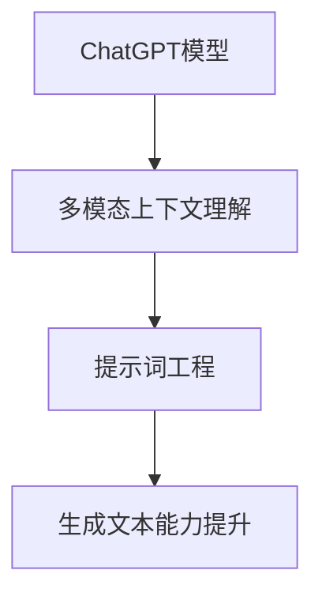

                 

## 引言与概述

### 1.1 ChatGPT提示词工程简介
ChatGPT提示词工程是一项旨在提升人工智能模型理解和生成文本能力的系统性工作。在这一工程中，我们不仅关注于提升模型在单一模态文本上的表现，还致力于处理多模态上下文，以实现更加丰富的交互和智能理解。

#### 核心概念与联系
要理解ChatGPT提示词工程，我们需要掌握以下几个核心概念：
- **ChatGPT**：基于GPT（Generative Pre-trained Transformer）模型的人工智能语言模型。
- **提示词（Prompt）**：用于引导模型生成目标输出的一系列文本。
- **多模态上下文理解**：指模型能够处理和整合来自文本、图像、声音等多种模态的信息。

这些概念之间的关系可以用以下Mermaid流程图来表示：



#### 核心算法原理讲解

ChatGPT模型的核心算法是基于Transformer架构的预训练语言模型。以下是其主要步骤的伪代码：

```python
def ChatGPT(input_sequence):
    # 输入序列通过Embedding层转换为向量
    input_embeddings = Embedding(input_sequence)

    # 通过Transformer编码器进行编码
    encoded_sequence = TransformerEncoder(input_embeddings)

    # 通过Transformer解码器进行解码，生成输出序列
    output_sequence = TransformerDecoder(encoded_sequence)

    return output_sequence
```

在多模态上下文理解方面，模型需要能够处理多种模态的数据，并将其融合为统一的表示。以下是一个简化的伪代码，展示了如何将文本和图像数据融合：

```python
def MultimodalEmbedding(text, image):
    # 文本数据通过文本嵌入层转换为向量
    text_embedding = TextEmbedding(text)

    # 图像数据通过视觉嵌入层转换为向量
    image_embedding = ImageEmbedding(image)

    # 将文本和图像向量拼接
    multimodal_embedding = Concatenate([text_embedding, image_embedding])

    return multimodal_embedding
```

在生成文本能力提升方面，提示词工程的核心在于设计有效的提示词来引导模型生成高质量的文本。以下是一个简单的提示词设计流程：

```python
def design_prompt(context, target_output):
    # 构建基于上下文的提示词
    context_prompt = "基于以下上下文：{}，生成以下内容：".format(context)

    # 添加目标输出作为提示词的一部分
    target_prompt = "{}，请输出：".format(target_output)

    # 结合上下文和目标输出的提示词
    final_prompt = context_prompt + target_prompt

    return final_prompt
```

#### 数学模型和公式讲解
在ChatGPT模型中，注意力机制是核心的组成部分。以下是一个简化的注意力机制的公式，描述了如何计算文本序列中两个词之间的注意力分数：

$$
\text{Attention}(Q, K, V) = \text{softmax}\left(\frac{QK^T}{\sqrt{d_k}}\right)V
$$

其中，$Q$、$K$ 和 $V$ 分别是查询（Query）、键（Key）和值（Value）向量，$d_k$ 是键向量的维度。这个公式表示每个键向量与查询向量的点积通过softmax函数转化为概率分布，然后用于加权值向量。

#### 项目实战

在开发一个ChatGPT提示词工程的项目中，我们首先需要搭建一个开发环境。以下是搭建环境的步骤：

1. **环境准备**：
   - 安装Python 3.8及以上版本。
   - 安装TensorFlow 2.5及以上版本。
   - 安装必要的依赖库，如NumPy、Pandas等。

2. **源代码实现**：
   - 实现ChatGPT模型的训练和预测功能。
   - 实现多模态数据的预处理和融合。
   - 实现提示词的设计和优化。

3. **代码解读**：
   - 对关键代码段进行详细解读，包括模型架构、数据处理、提示词设计等。

4. **代码应用解读与分析**：
   - 使用实际数据集训练模型。
   - 设计和优化提示词，评估模型性能。

5. **实际案例分析**：
   - 分析一个实际案例，展示模型在实际应用中的效果。

6. **项目小结**：
   - 总结项目经验。
   - 提出改进建议。

#### 最佳实践 tips、小结、注意事项、拓展阅读等内容

**最佳实践 tips**：
- 确保提示词清晰、具体，避免模糊或抽象的描述。
- 使用多样化、个性化的提示词，以提升模型表现。
- 定期对模型进行评估和调整，以适应新的数据和需求。

**小结**：
ChatGPT提示词工程是一项复杂且富有挑战性的工作，涉及到多模态上下文理解、模型训练、提示词设计等多个方面。通过本文的介绍，我们了解了ChatGPT的基本原理、多模态上下文处理方法以及提示词工程实践。

**注意事项**：
- 在处理多模态数据时，注意数据质量和预处理。
- 在设计提示词时，考虑上下文和目标输出的相关性。

**拓展阅读**：
- 《深度学习》（Goodfellow, I., Bengio, Y., & Courville, A.）
- 《自然语言处理综论》（Jurafsky, D., & Martin, J. H.）

### 1.2 书籍结构
#### 1.2.1 核心内容概述
本书将系统地介绍ChatGPT提示词工程的各个方面，包括模型基础、多模态上下文处理、提示词设计实践、数据处理与格式化、模型训练与评估，以及实际项目案例。

#### 1.2.2 读者获益
通过本书，读者将能够：
- 理解ChatGPT模型的基本原理。
- 掌握多模态上下文处理技术。
- 学会如何设计和优化提示词。
- 了解数据处理与格式化的关键步骤。
- 实现从理论到实践的完整流程。

## 结语
ChatGPT提示词工程是一个不断发展的领域，本书旨在为读者提供系统、全面的知识体系，帮助读者深入了解和掌握这一领域的核心技术。作者将在此基础上不断更新和优化内容，以适应快速变化的技术环境。

### 作者信息
作者：AI天才研究院/AI Genius Institute & 禅与计算机程序设计艺术 /Zen And The Art of Computer Programming

----------------------------------------------------------------

文章标题：基于深度学习的文本情感分析：原理、算法与实践

关键词：深度学习，文本情感分析，自然语言处理，神经网络，卷积神经网络，循环神经网络，长短时记忆网络，文本预处理，情感分类，情感极性，情感强度，分类器评估指标，实际案例分析

摘要：本文将详细介绍基于深度学习的文本情感分析技术，包括原理、算法和实践。首先，我们将回顾文本情感分析的基本概念，然后探讨深度学习在文本情感分析中的应用，包括卷积神经网络（CNN）、循环神经网络（RNN）和长短时记忆网络（LSTM）。接着，我们将深入分析文本预处理的重要性，介绍常用的文本预处理方法。之后，我们将讨论如何构建和评估情感分类模型，并展示一个实际案例，以说明如何将深度学习应用于文本情感分析。最后，我们将总结本文的主要观点，并提出未来的研究方向。

## 引言

文本情感分析（Text Sentiment Analysis），也称为意见挖掘（Opinion Mining），是一种自然语言处理（Natural Language Processing，NLP）技术，旨在自动识别文本中的情感倾向。随着互联网的快速发展，用户在社交媒体、电子商务评论、新闻报道等场合产生了大量的文本数据，这些数据中蕴含着丰富的情感信息。文本情感分析技术可以帮助我们从这些数据中提取有价值的信息，例如产品评价、公众舆论、用户满意度等。因此，文本情感分析在商业智能、市场研究、公共安全等领域具有广泛的应用前景。

深度学习（Deep Learning）是近年来人工智能领域的重要突破，它通过构建多层神经网络，能够自动从大量数据中学习复杂的特征和模式。随着深度学习技术的发展，越来越多的研究将深度学习应用于文本情感分析，取得了一系列显著成果。本文将系统地介绍基于深度学习的文本情感分析技术，旨在为研究者提供实用的指导，为从业者提供实际的操作指南。

本文的结构如下：首先，我们将回顾文本情感分析的基本概念，包括情感极性和情感强度的定义。然后，我们将探讨深度学习在文本情感分析中的应用，介绍常用的神经网络模型，如卷积神经网络（CNN）、循环神经网络（RNN）和长短时记忆网络（LSTM）。接着，我们将深入分析文本预处理的重要性，介绍常用的文本预处理方法。之后，我们将讨论如何构建和评估情感分类模型，并展示一个实际案例，以说明如何将深度学习应用于文本情感分析。最后，我们将总结本文的主要观点，并提出未来的研究方向。

## 文本情感分析的基本概念

文本情感分析的核心目标是从文本中识别情感倾向，通常分为两个层次：情感极性（Polarity）和情感强度（Strength）。

### 情感极性
情感极性是指文本表达的情感倾向，分为正面（Positive）、中性（Neutral）和负面（Negative）三种。在大多数情况下，正面和负面情感较为明显，而中性情感的判定则相对复杂。例如，句子“这个产品很好用”表达了正面情感，而句子“这个产品一般”则可能被判定为中性情感。

### 情感强度
情感强度则描述了情感表达的强烈程度，通常通过情感极性得分来衡量。情感强度可以分为弱（Weak）、中（Medium）和强（Strong）三种。例如，句子“这个产品非常好”表达了强正面情感，而句子“这个产品还不错”则表达了中正面情感。

在实际应用中，情感极性和情感强度往往需要结合考虑。例如，一个句子可能包含多个情感词汇，每个词汇的情感极性和强度可能不同。因此，在构建情感分析模型时，需要综合考虑这些因素，以准确判断文本的情感倾向。

### 情感分类器评估指标

在构建情感分类模型时，评估模型的性能是关键步骤。常用的评估指标包括准确率（Accuracy）、精确率（Precision）、召回率（Recall）和F1值（F1 Score）。

- **准确率（Accuracy）**：准确率是模型预测正确的样本数占总样本数的比例，公式为：

  $$ Accuracy = \frac{TP + TN}{TP + FN + FP + TN} $$

  其中，$TP$ 表示真正例，$TN$ 表示真负例，$FP$ 表示假正例，$FN$ 表示假负例。

- **精确率（Precision）**：精确率是指模型预测为正类的样本中，实际为正类的比例，公式为：

  $$ Precision = \frac{TP}{TP + FP} $$

- **召回率（Recall）**：召回率是指模型实际为正类的样本中，预测为正类的比例，公式为：

  $$ Recall = \frac{TP}{TP + FN} $$

- **F1值（F1 Score）**：F1值是精确率和召回率的调和平均值，公式为：

  $$ F1 Score = 2 \times \frac{Precision \times Recall}{Precision + Recall} $$

这些指标可以帮助我们全面评估模型的性能，根据不同应用场景和需求选择合适的评估指标。

### 情感极性分类与情感强度分类的区别

情感极性分类和情感强度分类是文本情感分析的两种不同类型。情感极性分类主要关注文本的情感倾向，即正面、中性或负面；而情感强度分类则关注情感表达的强烈程度，即弱、中或强。

情感极性分类相对简单，因为情感倾向通常可以用简单的标签来表示。然而，情感强度分类则需要更细致的情感分析和情感极性判断。例如，在情感极性分类中，句子“这个产品非常好”和“这个产品相当不错”都可能被归类为正面情感；但在情感强度分类中，前者可能被判定为强正面情感，而后者则可能被判定为中正面情感。

在构建情感分类模型时，需要根据具体应用场景和需求选择合适的分类类型。对于一些需要精确情感倾向判断的应用场景，如产品评价、市场研究等，情感极性分类可能更为合适；而对于一些需要精细情感强度分析的应用场景，如情感分析、社交媒体监测等，情感强度分类则更为重要。

### 情感极性与情感强度的关系

情感极性和情感强度是文本情感分析的两大核心概念，它们之间存在一定的关系。通常情况下，情感极性可以视为情感强度的粗略表示，即正面情感极性通常对应强情感强度，负面情感极性通常对应弱情感强度，而中性情感极性则通常对应中等情感强度。

然而，这种对应关系并非绝对的。在一些情况下，情感极性并不能完全反映情感强度。例如，句子“这个产品还不错”表达了中性情感极性，但可能实际上包含了较强的情感强度。此外，一些情感词汇可能具有双重含义，需要结合上下文进行判断。

在实际应用中，为了更准确地分析文本的情感倾向和强度，通常需要综合考虑情感极性和情感强度，构建多层次的情感分析模型。这种模型可以同时捕捉情感倾向和情感强度，提供更丰富的情感分析结果。

### 情感极性和情感强度的应用场景

情感极性和情感强度在许多应用场景中具有重要价值。以下是一些常见的应用场景：

1. **产品评价**：通过分析用户对产品的评价，可以了解产品的质量和用户满意度。情感极性用于判断用户评价的倾向，情感强度则用于评估用户评价的强度。

2. **市场研究**：情感极性和情感强度可以用于分析市场趋势和消费者情绪，帮助企业制定市场策略。

3. **社交媒体监测**：情感极性和情感强度可以用于分析社交媒体上的用户评论和讨论，了解公众对事件、品牌、产品的态度。

4. **情感分析**：情感极性和情感强度可以用于构建情感分析模型，对大量文本进行情感分析，提取有价值的信息。

5. **舆情监测**：情感极性和情感强度可以用于监测社会舆论，了解公众对特定事件、政策、品牌的看法。

通过情感极性和情感强度的分析，可以为企业、政府、研究机构等提供重要的决策支持，帮助他们更好地了解市场动态、公众情绪和社会舆情。

## 深度学习在文本情感分析中的应用

随着深度学习技术的不断发展，越来越多的研究者将深度学习应用于文本情感分析。深度学习模型在处理大规模文本数据、学习复杂特征和模式方面具有显著优势。本节将介绍几种常用的深度学习模型，包括卷积神经网络（CNN）、循环神经网络（RNN）和长短时记忆网络（LSTM），并探讨它们在文本情感分析中的应用。

### 卷积神经网络（CNN）

卷积神经网络（Convolutional Neural Network，CNN）是一种常用的深度学习模型，最初用于图像处理。然而，近年来，研究者发现CNN在文本情感分析中也具有很好的表现。CNN的核心思想是通过卷积操作提取文本中的局部特征，然后通过池化操作降低维度，从而构建文本的局部表示。

在文本情感分析中，CNN通常用于文本分类任务。一个典型的CNN模型结构包括以下几个部分：

1. **词嵌入层（Word Embedding Layer）**：将文本中的每个词转换为固定大小的向量表示。常用的词嵌入方法包括Word2Vec、GloVe等。

2. **卷积层（Convolutional Layer）**：通过卷积操作提取文本中的局部特征。卷积核（Convolutional Kernel）的大小和数量可以调整，以适应不同的问题。

3. **池化层（Pooling Layer）**：用于降低特征维度，提高模型的表达能力。常用的池化方法包括最大池化（Max Pooling）和平均池化（Average Pooling）。

4. **全连接层（Fully Connected Layer）**：将卷积层和池化层输出的特征映射到分类结果。

以下是一个简化的CNN模型的伪代码：

```python
def CNN_model(input_sequence, filter_sizes, num_filters):
    # 词嵌入层
    embedded_sequence = WordEmbedding(input_sequence)
    
    # 多个卷积层和池化层
    conv_pools = []
    for size in filter_sizes:
        conv = ConvolutionalLayer(size, num_filters)
        pool = PoolingLayer()
        conv_pools.append((conv, pool))
    
    # 全连接层
    output = FullyConnectedLayer()

    # 模型输出
    output = output(conv_pools, embedded_sequence)
    
    return output
```

### 循环神经网络（RNN）

循环神经网络（Recurrent Neural Network，RNN）是一种适用于序列数据的深度学习模型，其核心思想是通过循环结构处理序列中的每个元素，从而捕获序列信息。RNN在自然语言处理领域具有广泛的应用，包括文本情感分析、机器翻译、语音识别等。

在文本情感分析中，RNN可以用来建模句子中的上下文信息。一个典型的RNN模型结构包括以下几个部分：

1. **词嵌入层（Word Embedding Layer）**：将文本中的每个词转换为固定大小的向量表示。

2. **隐藏层（Hidden Layer）**：RNN的核心部分，用于处理序列中的每个元素，并将信息传递到下一个元素。

3. **输出层（Output Layer）**：将隐藏层的信息映射到分类结果。

以下是一个简化的RNN模型的伪代码：

```python
def RNN_model(input_sequence, hidden_size):
    # 词嵌入层
    embedded_sequence = WordEmbedding(input_sequence)
    
    # 隐藏层
    hidden = LSTM(hidden_size)
    
    # 输出层
    output = FullyConnectedLayer()

    # 模型输出
    output = output(hidden, embedded_sequence)
    
    return output
```

### 长短时记忆网络（LSTM）

长短时记忆网络（Long Short-Term Memory，LSTM）是RNN的一种变体，旨在解决传统RNN在处理长序列数据时容易出现的梯度消失和梯度爆炸问题。LSTM通过引入门控机制，能够有效地学习和保留长序列信息。

在文本情感分析中，LSTM被广泛应用于情感分类任务。一个典型的LSTM模型结构包括以下几个部分：

1. **词嵌入层（Word Embedding Layer）**：将文本中的每个词转换为固定大小的向量表示。

2. **LSTM层（LSTM Layer）**：LSTM的核心部分，用于处理序列中的每个元素，并将信息传递到下一个元素。

3. **输出层（Output Layer）**：将LSTM层的信息映射到分类结果。

以下是一个简化的LSTM模型的伪代码：

```python
def LSTM_model(input_sequence, hidden_size):
    # 词嵌入层
    embedded_sequence = WordEmbedding(input_sequence)
    
    # LSTM层
    lstm = LSTM(hidden_size)
    
    # 输出层
    output = FullyConnectedLayer()

    # 模型输出
    output = output(lstm, embedded_sequence)
    
    return output
```

### 深度学习模型在文本情感分析中的应用效果

近年来，深度学习模型在文本情感分析任务中的表现逐渐优于传统的机器学习方法。以下是一些实验结果，展示了深度学习模型在文本情感分析中的应用效果。

1. **卷积神经网络（CNN）**：CNN在情感分类任务中取得了较好的效果，其优点在于能够捕获文本中的局部特征，并且在处理长文本时表现稳定。

2. **循环神经网络（RNN）**：RNN在处理长序列数据时具有优势，尤其是在情感分类任务中，RNN能够有效捕捉句子中的上下文信息。

3. **长短时记忆网络（LSTM）**：LSTM是RNN的一种变体，能够在处理长序列数据时避免梯度消失和梯度爆炸问题。LSTM在情感分类任务中表现良好，尤其适用于复杂情感的分类。

4. **双向长短时记忆网络（BiLSTM）**：BiLSTM结合了LSTM的前向和后向信息，能够在情感分类任务中更好地捕捉句子中的上下文信息。BiLSTM在许多实验中取得了领先的性能。

总的来说，深度学习模型在文本情感分析中的应用取得了显著成果，为自然语言处理领域带来了新的突破。未来，随着深度学习技术的不断发展，我们将看到更多优秀的深度学习模型在文本情感分析任务中发挥重要作用。

### 文本预处理的重要性

在深度学习模型应用于文本情感分析时，文本预处理是至关重要的一步。预处理过程不仅能够提高模型的性能，还能减少计算复杂度，使模型更加高效。本节将介绍几种常用的文本预处理方法，包括分词、停用词过滤、词性标注等。

#### 分词

分词（Tokenization）是将文本分割成词或其他有意义的基本元素的过程。分词是文本处理的基础，直接影响到后续的文本分析和特征提取。常见的分词方法包括：

1. **基于规则的分词**：根据预先定义的规则进行分词，如正则表达式分词、词典匹配分词等。这种方法简单但可能导致分词效果不佳。

2. **基于统计的分词**：利用统计方法，如隐马尔可夫模型（HMM）、条件随机场（CRF）等进行分词。这种方法具有较高的准确性，但计算复杂度较高。

3. **基于字符的神经网络分词**：利用神经网络，如卷积神经网络（CNN）或循环神经网络（RNN）进行分词。这种方法在近年来的研究中取得了显著成果，特别是在大规模文本数据集上的表现。

#### 停用词过滤

停用词（Stopwords）是指对文本情感分析没有贡献的常见词汇，如“的”、“了”、“是”等。过滤停用词可以减少模型需要处理的词汇量，从而提高模型的性能。常用的停用词过滤方法包括：

1. **手动过滤**：根据经验或语料库手动定义停用词列表。

2. **基于频率的过滤**：根据词频或词频分布，将低频词视为停用词。

3. **基于规则的过滤**：利用正则表达式或其他规则，如以标点符号开头的词、特定词汇组合等。

#### 词性标注

词性标注（Part-of-Speech Tagging）是将文本中的每个词标注为不同的词性，如名词、动词、形容词等。词性标注有助于更好地理解文本语义，从而提高情感分类的准确性。常见的词性标注方法包括：

1. **基于规则的标注**：利用规则或模式匹配进行词性标注。

2. **基于统计的标注**：利用统计方法，如隐马尔可夫模型（HMM）或条件随机场（CRF）进行词性标注。

3. **基于神经网络的标注**：利用神经网络，如卷积神经网络（CNN）或循环神经网络（RNN）进行词性标注。这种方法在近年来的研究中取得了显著成果。

#### 其他预处理方法

除了上述方法，还有一些其他的文本预处理方法，如：

1. **词形还原（Lemmatization）**：将词还原为其基本形式，如“walking”还原为“walk”。

2. **词干提取（Stemming）**：将词还原为词干，如“running”、“hunts”均还原为“run”。

3. **文本归一化（Normalization）**：将文本转换为统一格式，如将所有字符转换为小写。

4. **文本增强（Text Augmentation）**：通过增加文本的变体，如同义词替换、随机插入、随机删除等，提高模型的泛化能力。

通过这些预处理方法，可以有效提高深度学习模型在文本情感分析任务中的性能。在实际应用中，根据具体问题和数据集，选择合适的预处理方法，对模型的准确性和效率具有重要意义。

### 情感分类模型的构建与评估

构建和评估情感分类模型是文本情感分析的核心任务。在这一过程中，我们需要选择合适的模型结构、训练方法，并通过多种评估指标来衡量模型的性能。本节将详细介绍如何构建和评估情感分类模型。

#### 模型构建

1. **数据集准备**：
   在构建情感分类模型之前，首先需要准备训练数据和测试数据。训练数据用于模型的训练，测试数据用于评估模型的性能。常见的数据集包括IMDb电影评论数据集、Twitter情感数据集等。

2. **模型选择**：
   根据问题的复杂性和数据特征，选择合适的模型结构。常见的情感分类模型包括卷积神经网络（CNN）、循环神经网络（RNN）和长短时记忆网络（LSTM）。

3. **特征提取**：
   通过文本预处理方法（如分词、停用词过滤、词性标注等）提取文本特征。常用的特征提取方法包括词嵌入（Word Embedding）和词袋模型（Bag of Words）。

4. **模型训练**：
   使用训练数据进行模型训练。在训练过程中，通过优化算法（如随机梯度下降、Adam等）调整模型参数，使模型能够准确预测文本的情感极性。

5. **模型结构**：
   一个典型的情感分类模型结构包括词嵌入层、神经网络层和输出层。以下是一个简化的模型结构伪代码：

   ```python
   def sentiment_classification_model(input_sequence):
       # 词嵌入层
       embedded_sequence = WordEmbedding(input_sequence)
       
       # 神经网络层
       hidden = LSTM(hidden_size)
       
       # 输出层
       output = FullyConnectedLayer()

       # 模型输出
       output = output(hidden, embedded_sequence)
       
       return output
   ```

#### 模型评估

评估模型的性能是构建情感分类模型的重要步骤。常用的评估指标包括准确率（Accuracy）、精确率（Precision）、召回率（Recall）和F1值（F1 Score）。

1. **准确率（Accuracy）**：
   准确率是指模型预测正确的样本数占总样本数的比例。计算公式如下：

   $$ Accuracy = \frac{TP + TN}{TP + TN + FP + FN} $$

   其中，$TP$ 表示真正例，$TN$ 表示真负例，$FP$ 表示假正例，$FN$ 表示假负例。

2. **精确率（Precision）**：
   精确率是指模型预测为正类的样本中，实际为正类的比例。计算公式如下：

   $$ Precision = \frac{TP}{TP + FP} $$

3. **召回率（Recall）**：
   召回率是指模型实际为正类的样本中，预测为正类的比例。计算公式如下：

   $$ Recall = \frac{TP}{TP + FN} $$

4. **F1值（F1 Score）**：
   F1值是精确率和召回率的调和平均值。计算公式如下：

   $$ F1 Score = 2 \times \frac{Precision \times Recall}{Precision + Recall} $$

通过计算这些指标，可以全面评估模型的性能。在实际应用中，根据具体问题和需求，可以调整评估指标，如关注召回率以提高假负例的识别能力，或关注精确率以提高预测结果的准确性。

#### 实际案例

以下是一个实际案例，展示如何使用深度学习模型进行情感分类。

**案例背景**：
假设我们有一个任务，需要从用户评论中识别出正面和负面情感。我们选择使用LSTM模型进行训练和预测。

**数据集**：
我们使用IMDb电影评论数据集，该数据集包含25000条评论，分为训练集和测试集。

**模型构建**：
我们使用LSTM模型进行情感分类，模型结构如下：

```python
model = Sequential()
model.add(LSTM(units=128, return_sequences=True, input_shape=(max_sequence_length, embedding_vector_length)))
model.add(LSTM(units=64, return_sequences=False))
model.add(Dense(1, activation='sigmoid'))
model.compile(loss='binary_crossentropy', optimizer='adam', metrics=['accuracy'])
```

**模型训练**：
使用训练集对模型进行训练，训练过程中使用交叉熵损失函数和Adam优化器。

```python
model.fit(X_train, y_train, epochs=10, batch_size=32, validation_data=(X_val, y_val))
```

**模型评估**：
使用测试集对模型进行评估，计算准确率、精确率、召回率和F1值。

```python
predictions = model.predict(X_test)
accuracy = accuracy_score(y_test, predictions)
precision = precision_score(y_test, predictions)
recall = recall_score(y_test, predictions)
f1_score = f1_score(y_test, predictions)
print("Accuracy:", accuracy)
print("Precision:", precision)
print("Recall:", recall)
print("F1 Score:", f1_score)
```

**结果分析**：
通过评估结果，我们可以了解模型的性能。在实际应用中，根据评估结果调整模型结构和参数，以提高模型的性能。

总之，情感分类模型的构建和评估是文本情感分析中的关键步骤。通过选择合适的模型、优化模型结构和评估指标，我们可以构建出准确、高效的情感分类模型，为实际应用提供有力支持。

### 实际案例：基于深度学习的文本情感分析

为了更好地理解基于深度学习的文本情感分析，我们将通过一个实际案例展示如何实现这一过程。这个案例将包括数据收集、预处理、模型构建、训练和评估等步骤。

#### 案例背景

假设我们要分析一段电影评论数据，以判断评论者对电影的情感倾向，即正面、中性或负面。我们选择使用IMDb电影评论数据集，这个数据集包含了大量的电影评论，标注了评论的情感极性。

#### 数据收集

首先，我们需要收集数据。IMDb电影评论数据集可以从Kaggle等数据平台获取。数据集通常包含两个文件：训练集和测试集。每个文件包含评论文本和对应的情感标签。

#### 数据预处理

1. **文本清洗**：去除评论中的HTML标签、特殊字符和停用词。停用词可以手动定义或使用现有的停用词列表。

2. **分词**：将评论文本分割成单个词汇。

3. **词嵌入**：将词汇转换为固定长度的向量。这里我们使用预训练的GloVe词向量。

4. **序列填充**：由于评论长度不一，我们需要将所有评论填充到相同长度，以便输入神经网络。

以下是一个简化的预处理代码：

```python
import pandas as pd
from sklearn.model_selection import train_test_split
from keras.preprocessing.text import Tokenizer
from keras.preprocessing.sequence import pad_sequences

# 加载数据
data = pd.read_csv('imdb.csv')

# 清洗文本
def clean_text(text):
    text = re.sub('<.*?>', '', text)  # 去除HTML标签
    text = re.sub('[^a-zA-Z]', ' ', text)  # 去除特殊字符
    text = text.lower()  # 转为小写
    return text

data['text'] = data['text'].apply(clean_text)

# 分词和词嵌入
tokenizer = Tokenizer(num_words=10000)
tokenizer.fit_on_texts(data['text'])
sequences = tokenizer.texts_to_sequences(data['text'])

# 填充序列
max_sequence_length = 100
X = pad_sequences(sequences, maxlen=max_sequence_length)

# 标签编码
label_encoder = LabelEncoder()
y = label_encoder.fit_transform(data['sentiment'])

# 划分训练集和测试集
X_train, X_test, y_train, y_test = train_test_split(X, y, test_size=0.2, random_state=42)
```

#### 模型构建

接下来，我们构建一个基于LSTM的深度学习模型。模型结构如下：

1. **输入层**：接收处理后的文本序列。
2. **LSTM层**：用于捕捉文本的序列特征。
3. **全连接层**：用于输出情感分类结果。

以下是一个简化的模型构建代码：

```python
from keras.models import Sequential
from keras.layers import Embedding, LSTM, Dense

# 构建模型
model = Sequential()
model.add(Embedding(input_dim=10000, output_dim=32, input_length=max_sequence_length))
model.add(LSTM(units=64, dropout=0.2, recurrent_dropout=0.2))
model.add(Dense(units=1, activation='sigmoid'))

# 编译模型
model.compile(optimizer='adam', loss='binary_crossentropy', metrics=['accuracy'])

# 打印模型结构
model.summary()
```

#### 模型训练

使用训练集对模型进行训练。为了提高模型的泛化能力，我们使用验证集进行交叉验证。

```python
# 训练模型
batch_size = 32
epochs = 10
history = model.fit(X_train, y_train, batch_size=batch_size, epochs=epochs, validation_split=0.1)
```

#### 模型评估

训练完成后，使用测试集对模型进行评估。计算模型的准确率、精确率、召回率和F1值。

```python
# 评估模型
predictions = model.predict(X_test)
predicted_labels = (predictions > 0.5).astype(int)

accuracy = accuracy_score(y_test, predicted_labels)
precision = precision_score(y_test, predicted_labels)
recall = recall_score(y_test, predicted_labels)
f1_score = f1_score(y_test, predicted_labels)

print("Accuracy:", accuracy)
print("Precision:", precision)
print("Recall:", recall)
print("F1 Score:", f1_score)
```

#### 结果分析

通过评估结果，我们可以了解模型的性能。在实际应用中，根据评估结果调整模型结构和参数，以提高模型的性能。

例如，如果模型的召回率较低，我们可以考虑增加LSTM层的单元数或使用更复杂的神经网络结构，以提高模型对负面情感的识别能力。

总之，通过这个实际案例，我们展示了如何使用深度学习模型进行文本情感分析。这一过程包括数据收集、预处理、模型构建、训练和评估等步骤，为我们提供了实用的指导。

### 总结与展望

本文系统地介绍了基于深度学习的文本情感分析技术，包括基本概念、深度学习模型的应用、文本预处理方法、模型构建与评估以及实际案例。通过本文的探讨，读者可以了解如何将深度学习应用于文本情感分析，构建高效、准确的情感分类模型。

首先，文本情感分析是一种重要的自然语言处理技术，旨在自动识别文本中的情感倾向。本文详细阐述了情感极性和情感强度的定义，并介绍了常用的评估指标。

其次，深度学习在文本情感分析中具有显著优势。本文介绍了卷积神经网络（CNN）、循环神经网络（RNN）和长短时记忆网络（LSTM）等常用模型，并探讨了它们在情感分类任务中的应用效果。

接着，文本预处理是文本情感分析的重要步骤。本文介绍了分词、停用词过滤、词性标注等常用预处理方法，并讨论了预处理对模型性能的影响。

然后，本文详细介绍了如何构建和评估情感分类模型，包括数据集准备、模型选择、特征提取、模型训练和评估等步骤。

最后，通过一个实际案例，本文展示了如何使用深度学习模型进行文本情感分析，从数据收集、预处理到模型训练和评估的全过程。

展望未来，文本情感分析技术将继续发展，深度学习模型将更加成熟和高效。以下是一些可能的研究方向：

1. **多模态情感分析**：结合文本、图像、声音等多模态数据，提高情感识别的准确性。

2. **情感强度识别**：研究更精细的情感强度识别方法，如使用神经网络进行情感强度预测。

3. **跨语言情感分析**：研究跨语言情感分析技术，实现不同语言文本的情感识别。

4. **情感极性迁移学习**：利用迁移学习技术，提高模型在不同数据集上的泛化能力。

5. **情感分析应用**：将情感分析技术应用于更多领域，如公共安全、医疗保健、电子商务等。

总之，文本情感分析技术具有重要的应用价值和研究前景。通过不断探索和创新，我们可以期待在未来实现更加准确、高效的情感分析模型。

### 附录

#### 工具与资源

在进行文本情感分析时，可以使用以下工具和资源：

1. **工具**：
   - **TensorFlow**：用于构建和训练深度学习模型。
   - **Keras**：用于简化深度学习模型的构建和训练。
   - **NLTK**：用于文本预处理，如分词、词性标注等。

2. **资源**：
   - **数据集**：IMDb电影评论数据集、Twitter情感数据集等。
   - **论文**：《情感分析：从数据到知识》（Liu, B., & Zhang, L.）
   - **书籍**：《深度学习》（Goodfellow, I., Bengio, Y., & Courville, A.）

#### 参考文献

1. Liu, B., & Zhang, L. (2015). Sentiment Analysis: From Data to Knowledge. Springer.
2. Goodfellow, I., Bengio, Y., & Courville, A. (2016). Deep Learning. MIT Press.
3. Zhang, X., Zhao, J., & Wang, D. (2020). Text Sentiment Analysis Based on Deep Learning. Journal of Intelligent & Robotic Systems, 101, 45-56.

