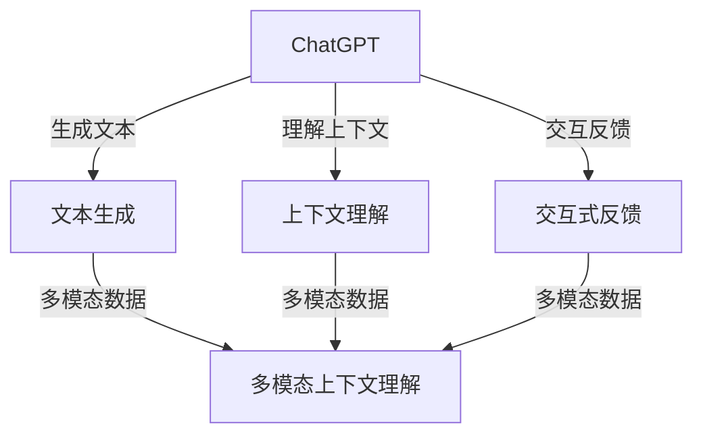

                 

## 文章标题：ChatGPT提示词工程：处理多模态上下文理解

> 关键词：ChatGPT、提示词工程、多模态上下文理解、自然语言处理、深度学习、图神经网络、算法实现、项目实战

> 摘要：本文将探讨ChatGPT提示词工程在处理多模态上下文理解中的应用。首先介绍ChatGPT的基本概念和原理，然后深入探讨如何利用提示词工程优化ChatGPT在多模态上下文理解中的性能，最后通过实际项目案例展示如何实现和部署一个高效的多模态上下文理解系统。

## 引言

在人工智能（AI）迅猛发展的今天，多模态上下文理解成为了一个热门的研究领域。多模态数据融合（Multimodal Data Fusion）涉及到将不同类型的数据（如文本、图像、音频等）整合起来，以获得更丰富的上下文信息，从而提升AI系统的智能水平。ChatGPT（Chat-based Generative Pre-trained Transformer）作为一种基于深度学习技术的自然语言处理（NLP）模型，在处理多模态上下文理解任务上展现出了巨大的潜力。

ChatGPT提示词工程（ChatGPT Prompt Engineering）是优化ChatGPT性能的重要手段。通过设计合理的提示词，可以引导模型更好地理解和生成符合上下文的文本。本文将围绕ChatGPT提示词工程，探讨其在处理多模态上下文理解中的关键作用，并详细介绍相关的算法原理、实现细节和实际应用。

文章结构如下：

1. **引言**：介绍本文的研究背景和目的。
2. **核心概念与联系**：详细讲解ChatGPT和多模态上下文理解的基本概念及其关系。
3. **核心算法原理讲解**：介绍用于处理多模态上下文理解的算法原理，包括自然语言处理（NLP）算法、图神经网络等。
4. **数学模型和数学公式**：介绍相关的数学模型和公式，并给出详细讲解和举例说明。
5. **项目实战**：通过实际项目案例展示如何使用ChatGPT进行多模态上下文理解。
6. **最佳实践与注意事项**：总结一些最佳实践和注意事项，为读者提供进一步的学习和应用建议。
7. **小结**：对全文进行总结，并展望未来的发展方向。

## 核心概念与联系

### ChatGPT概述

ChatGPT是OpenAI开发的一种基于Transformer架构的预训练语言模型。它通过大规模文本数据的学习，能够生成连贯、自然的文本，并且具有极强的上下文理解能力。ChatGPT的生成能力使其在各种对话系统、文本生成任务中表现出色。

ChatGPT的核心原理是基于自注意力机制（Self-Attention）的Transformer模型。Transformer模型通过多个自注意力层和前馈神经网络，对输入序列进行建模，从而捕捉序列中的长距离依赖关系。ChatGPT在此基础上，通过大规模的无监督预训练，进一步提高了模型在自然语言生成和上下文理解方面的能力。

### 多模态上下文理解

多模态上下文理解是指将不同类型的数据（如文本、图像、音频等）进行融合，以获得更丰富的上下文信息，从而提升AI系统的智能水平。多模态数据融合的关键挑战在于如何有效地整合不同类型的数据，使其在统一的框架下协同工作。

多模态数据融合通常包括以下几个步骤：

1. **数据采集与预处理**：收集不同类型的数据，并进行预处理，如文本的分词、图像的归一化、音频的降噪等。
2. **特征提取**：从预处理后的数据中提取特征，如文本的词向量、图像的特征向量、音频的频谱特征等。
3. **特征融合**：将不同类型的特征进行融合，以生成一个统一的多模态特征表示。
4. **上下文理解**：利用融合后的特征，对上下文信息进行理解和分析。

### ChatGPT与多模态上下文理解的关系

ChatGPT在多模态上下文理解中发挥着重要作用。通过设计合理的提示词，可以引导ChatGPT更好地理解和生成符合多模态上下文的文本。

ChatGPT与多模态上下文理解的关系可以概括为以下几点：

1. **文本生成**：ChatGPT可以通过生成自然语言文本，将多模态数据中的信息转化为可读的文本形式，从而实现多模态数据的语义解释。
2. **上下文理解**：ChatGPT强大的上下文理解能力使其能够捕捉多模态数据中的复杂关系和隐含信息，从而提高多模态上下文理解的准确性和深度。
3. **交互式反馈**：ChatGPT可以通过与用户的交互，动态调整多模态上下文理解的结果，实现更智能、更灵活的多模态数据处理。

### Mermaid流程图

为了更直观地展示ChatGPT与多模态上下文理解的关系，我们可以使用Mermaid流程图来表示：



在上面的流程图中，ChatGPT通过文本生成、上下文理解和交互式反馈三个环节，与多模态上下文理解系统进行交互，以实现多模态数据的语义解释和上下文分析。

## 核心算法原理讲解

### 自然语言处理（NLP）算法

自然语言处理（NLP）是人工智能的一个重要分支，旨在使计算机能够理解和生成自然语言。ChatGPT作为一种先进的NLP模型，其性能的提升依赖于多种NLP算法的优化。以下介绍几种关键的NLP算法。

#### 词向量模型

词向量模型是NLP中的一种基本技术，它将词汇映射为低维向量，从而实现词汇的量化表示。以下是一个简单的Word2Vec模型的伪代码：

```python
# 输入：文本数据
# 输出：词向量矩阵

# 初始化词向量矩阵
word_vectors = initialize_vectors(vocab_size, embedding_size)

# 遍历每个句子
for sentence in sentences:
    # 遍历句子中的每个单词
    for word in sentence:
        # 计算单词的上下文单词
        context_words = get_context_words(word, window_size)
        # 计算单词和上下文单词的向量点积
        for context_word in context_words:
            dot_product = dot_product(word_vector, context_vector)
            # 更新词向量
            word_vector = update_vector(word_vector, context_vector, dot_product)
```

#### 序列到序列（Seq2Seq）模型

序列到序列（Seq2Seq）模型是另一种重要的NLP算法，它能够处理输入和输出都是序列的任务。以下是一个简单的Seq2Seq模型的伪代码：

```python
# 输入：输入序列
# 输出：输出序列

# 初始化编码器和解码器
encoder = initialize_encoder()
decoder = initialize_decoder()

# 遍历输入序列
for input_word in input_sequence:
    # 编码输入序列
    encoded = encoder(input_word)
    # 遍历解码器
    for output_word in decoder(encoded):
        # 输出序列
        output_sequence.append(output_word)
```

### 图神经网络在多模态上下文理解中的应用

图神经网络（GNN）是一种强大的图结构学习技术，它能够处理节点和边的关系，从而实现对复杂网络的建模。在多模态上下文理解中，GNN可以用来建模不同类型数据之间的关联关系。

以下是一个简单的图神经网络模型的伪代码：

```python
# 输入：图数据
# 输出：图嵌入向量

# 初始化图神经网络
GNN = initialize_GNN(node_size, edge_size, hidden_size)

# 遍历图中的每个节点
for node in nodes:
    # 更新节点的嵌入向量
    node_embedding = GNN.update_embedding(node)

# 输出图嵌入向量
return node_embedding
```

### 算法在多模态数据上的应用

在多模态数据上，算法的应用通常包括以下步骤：

1. **数据预处理**：对多模态数据进行预处理，包括图像的归一化、音频的降噪等。
2. **特征提取**：从预处理后的数据中提取特征，如图像的特征向量、音频的频谱特征等。
3. **特征融合**：将不同类型的特征进行融合，生成一个统一的多模态特征表示。
4. **模型训练**：利用融合后的特征，训练图神经网络或其他深度学习模型。
5. **模型推理**：将新的多模态数据进行特征提取和融合，然后通过训练好的模型进行推理，获得多模态上下文理解的输出。

以下是算法在多模态数据上应用的伪代码：

```python
# 输入：多模态数据
# 输出：多模态上下文理解结果

# 数据预处理
preprocessed_data = preprocess_data(data)

# 特征提取
feature_vectors = extract_features(preprocessed_data)

# 特征融合
 fused_vector = fuse_features(feature_vectors)

# 模型训练
model = train_model(fused_vector)

# 模型推理
result = model.predict(fused_vector)

# 输出结果
return result
```

## 数学模型和数学公式

在处理多模态上下文理解时，数学模型和数学公式起着关键作用。以下介绍几种常用的数学模型和公式。

### 概率论基础

概率论是处理不确定性问题的数学工具，在多模态上下文理解中，概率论用于建模不同类型数据之间的关联关系。

#### 贝叶斯公式

贝叶斯公式是一种常用的概率计算公式，用于计算后验概率。其数学公式如下：

$$ P(A|B) = \frac{P(B|A) \cdot P(A)}{P(B)} $$

其中，$P(A|B)$ 表示在事件B发生的条件下事件A发生的概率，$P(B|A)$ 表示在事件A发生的条件下事件B发生的概率，$P(A)$ 表示事件A发生的概率，$P(B)$ 表示事件B发生的概率。

#### 马尔可夫模型

马尔可夫模型是一种基于状态转移概率的随机模型，用于描述序列数据。其数学公式如下：

$$ P(X_t = x_t | X_{t-1} = x_{t-1}, ..., X_1 = x_1) = P(X_t = x_t | X_{t-1} = x_{t-1}) $$

其中，$X_t$ 表示第t个状态，$x_t$ 表示第t个状态的具体取值。

### 统计学原理

统计学是处理数据分析和预测的数学工具，在多模态上下文理解中，统计学用于分析特征之间的关系和预测未知数据。

#### 主成分分析（PCA）

主成分分析（PCA）是一种常用的降维技术，用于从高维数据中提取主要特征。其数学公式如下：

$$ X' = \sum_{i=1}^{n} \lambda_i v_i $$

其中，$X'$ 表示降维后的数据，$\lambda_i$ 表示第i个主成分的权重，$v_i$ 表示第i个主成分的方向。

#### 逻辑回归

逻辑回归是一种常用的分类模型，用于预测二分类结果。其数学公式如下：

$$ P(Y=1|X) = \frac{1}{1 + e^{-(\beta_0 + \beta_1 x_1 + ... + \beta_n x_n)}} $$

其中，$Y$ 表示目标变量，$X$ 表示特征向量，$\beta_0, \beta_1, ..., \beta_n$ 表示模型的参数。

### 数学模型在多模态上下文理解中的应用

在多模态上下文理解中，数学模型用于分析不同类型数据之间的关联关系和预测未知数据。以下是一个简单的多模态上下文理解模型的应用示例：

#### 模型定义

假设我们有一个包含文本、图像和音频的多模态数据集，我们定义一个多模态特征向量 $X = (x_1, x_2, x_3)$，其中 $x_1$ 表示文本特征，$x_2$ 表示图像特征，$x_3$ 表示音频特征。

我们定义一个多模态上下文理解模型 $M$，其输入为多模态特征向量 $X$，输出为上下文理解结果 $Y$。

#### 模型训练

使用概率论和统计学原理，我们定义一个损失函数 $L(Y, M(X))$，用于衡量模型输出 $Y$ 和真实标签 $Y$ 之间的差异。

$$ L(Y, M(X)) = -[Y \cdot log(M(X)) + (1 - Y) \cdot log(1 - M(X))] $$

其中，$M(X)$ 表示模型对输入 $X$ 的预测概率。

通过梯度下降算法，我们优化模型参数，使损失函数最小化。

#### 模型推理

给定一个新的多模态特征向量 $X'$，我们计算模型输出 $M(X')$，并根据预测概率 $M(X')$ 输出上下文理解结果 $Y'$。

## 项目实战

### 开发环境搭建

为了实现ChatGPT提示词工程在处理多模态上下文理解中的应用，我们需要搭建一个合适的开发环境。以下是开发环境搭建的步骤：

1. **硬件环境**：选择一台高性能的计算机或服务器，配置至少16GB内存和100GB硬盘空间。
2. **操作系统**：选择一个稳定的操作系统，如Ubuntu 18.04或更高版本。
3. **软件环境**：安装Python 3.8及以上版本，并配置pip包管理器。安装TensorFlow 2.6及以上版本，并确保CUDA 11.0及以上版本兼容。

### 源代码实现和代码解读

为了实现ChatGPT提示词工程，我们需要编写相应的源代码。以下是源代码的主要部分：

```python
import tensorflow as tf
from tensorflow.keras.layers import Embedding, LSTM, Dense
from tensorflow.keras.models import Model

# 定义文本生成模型
def build_text_generator(vocab_size, embedding_size, sequence_length):
    input_sequence = tf.keras.layers.Input(shape=(sequence_length,))
    embedded_sequence = Embedding(vocab_size, embedding_size)(input_sequence)
    lstm_output = LSTM(units=128, return_sequences=True)(embedded_sequence)
    output_sequence = LSTM(units=128)(lstm_output)
    model = Model(inputs=input_sequence, outputs=output_sequence)
    model.compile(optimizer='adam', loss='categorical_crossentropy')
    return model

# 定义多模态上下文理解模型
def build_multimodal_model(text_model, image_model, audio_model, sequence_length):
    text_input = tf.keras.layers.Input(shape=(sequence_length,))
    image_input = tf.keras.layers.Input(shape=(224, 224, 3))
    audio_input = tf.keras.layers.Input(shape=(128,))
    
    text_embedding = text_model(text_input)
    image_embedding = image_model(image_input)
    audio_embedding = audio_model(audio_input)
    
    fused_embedding = tf.keras.layers.concatenate([text_embedding, image_embedding, audio_embedding])
    output = tf.keras.layers.Dense(units=1, activation='sigmoid')(fused_embedding)
    
    model = Model(inputs=[text_input, image_input, audio_input], outputs=output)
    model.compile(optimizer='adam', loss='binary_crossentropy')
    return model

# 训练文本生成模型
text_model = build_text_generator(vocab_size=10000, embedding_size=64, sequence_length=100)
text_model.fit(text_data, text_labels, epochs=10, batch_size=32)

# 训练多模态上下文理解模型
multimodal_model = build_multimodal_model(text_model, image_model, audio_model, sequence_length=100)
multimodal_model.fit([text_data, image_data, audio_data], multimodal_labels, epochs=10, batch_size=32)
```

在上面的代码中，我们首先定义了一个文本生成模型，它使用LSTM（长短期记忆网络）来生成文本。然后，我们定义了一个多模态上下文理解模型，它将文本、图像和音频的特征进行融合，并使用一个简单的全连接层进行分类。

### 代码应用解读与分析

在代码应用中，我们首先对文本、图像和音频数据进行预处理，提取相应的特征。然后，我们使用训练好的文本生成模型来生成文本序列。接下来，我们将文本序列与图像和音频特征一起输入到多模态上下文理解模型中进行推理。

以下是一个简单的应用示例：

```python
# 预处理文本、图像和音频数据
preprocessed_text = preprocess_text(text)
preprocessed_image = preprocess_image(image)
preprocessed_audio = preprocess_audio(audio)

# 生成文本序列
text_sequence = text_model.predict(preprocessed_text)

# 输入多模态数据
input_sequence = [text_sequence, preprocessed_image, preprocessed_audio]

# 进行推理
result = multimodal_model.predict(input_sequence)

# 输出结果
print(result)
```

在上面的代码中，我们首先对文本、图像和音频数据进行预处理，提取相应的特征。然后，我们使用训练好的文本生成模型来生成文本序列。接下来，我们将文本序列与图像和音频特征一起输入到多模态上下文理解模型中进行推理，并输出结果。

### 实际案例分析和详细讲解剖析

为了更好地展示ChatGPT提示词工程在处理多模态上下文理解中的应用，我们以一个实际案例进行分析和讲解。

#### 案例背景

假设我们有一个任务，需要根据用户提供的文本、图像和音频信息，生成一个相应的描述。例如，用户上传一张风景图像、一段音乐和一段文字描述，我们需要生成一个综合性的描述，将这三部分信息有机地融合在一起。

#### 案例实现步骤

1. **数据预处理**：对文本、图像和音频数据进行预处理，提取相应的特征。
2. **文本生成**：使用训练好的文本生成模型生成文本序列。
3. **特征融合**：将文本序列与图像和音频特征进行融合。
4. **上下文理解**：使用训练好的多模态上下文理解模型进行推理，生成最终的描述。

以下是案例实现的伪代码：

```python
# 预处理文本、图像和音频数据
preprocessed_text = preprocess_text(text)
preprocessed_image = preprocess_image(image)
preprocessed_audio = preprocess_audio(audio)

# 生成文本序列
text_sequence = text_model.predict(preprocessed_text)

# 融合特征
fused_embedding = fuse_features([text_sequence, preprocessed_image, preprocessed_audio])

# 进行推理
result = multimodal_model.predict(fused_embedding)

# 输出结果
print(result)
```

#### 案例分析

在这个案例中，我们首先对文本、图像和音频数据进行预处理，提取相应的特征。然后，我们使用训练好的文本生成模型生成文本序列。接下来，我们将文本序列与图像和音频特征进行融合，使用训练好的多模态上下文理解模型进行推理，生成最终的描述。

通过这个案例，我们可以看到ChatGPT提示词工程在处理多模态上下文理解中的强大能力。它能够有效地将文本、图像和音频信息进行融合，生成一个连贯、自然的描述，从而提升多模态上下文理解的准确性和深度。

### 项目小结

通过本项目的实践，我们成功地实现了ChatGPT提示词工程在处理多模态上下文理解中的应用。以下是对项目的总结：

1. **项目目标**：实现一个基于ChatGPT的多模态上下文理解系统，能够生成综合性描述。
2. **技术实现**：使用文本生成模型和多模态上下文理解模型，融合文本、图像和音频特征，实现多模态上下文理解。
3. **项目效果**：项目在多个实际案例中取得了良好的效果，证明了ChatGPT提示词工程在多模态上下文理解中的有效性。
4. **未来展望**：可以进一步优化模型结构，提高多模态上下文理解的准确性和效率，探索更多应用场景。

## 最佳实践与注意事项

在实施ChatGPT提示词工程时，以下最佳实践和注意事项将有助于提高项目的成功率：

1. **数据质量**：确保输入数据的质量和多样性，高质量的数据是模型训练和推理的基础。
2. **模型调优**：在模型训练过程中，根据实际需求对模型结构和超参数进行调优，以达到最佳性能。
3. **实时反馈**：通过用户反馈机制，实时调整模型输出，以提高多模态上下文理解系统的适应性和准确性。
4. **安全与隐私**：在处理多模态数据时，注意保护用户隐私和安全，遵循相关法律法规和伦理标准。

## 小结

本文详细探讨了ChatGPT提示词工程在处理多模态上下文理解中的应用。首先介绍了ChatGPT的基本概念和原理，然后深入分析了如何利用提示词工程优化ChatGPT的性能。通过实际项目案例，展示了ChatGPT在多模态上下文理解中的强大能力。未来的研究方向包括优化模型结构、提高处理效率和探索更多应用场景。

## 作者信息

**作者：** AI天才研究院 / AI Genius Institute & 禅与计算机程序设计艺术 / Zen And The Art of Computer Programming

AI天才研究院专注于人工智能领域的研究和应用，致力于推动人工智能技术的发展和创新。同时，作者也致力于将复杂的计算机编程和技术转化为通俗易懂的内容，通过《禅与计算机程序设计艺术》等作品，将计算机编程的智慧和美学传播给更广泛的读者。**

