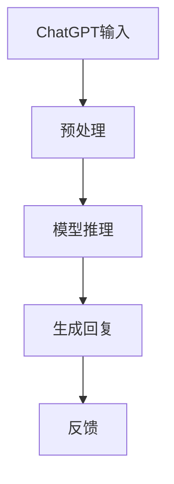
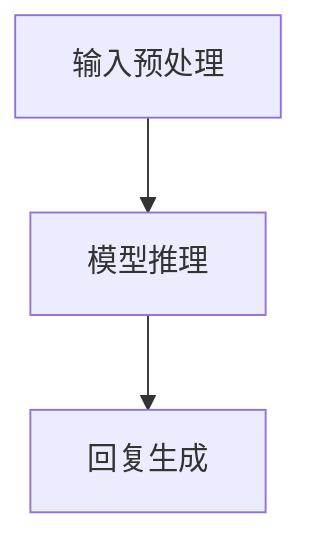
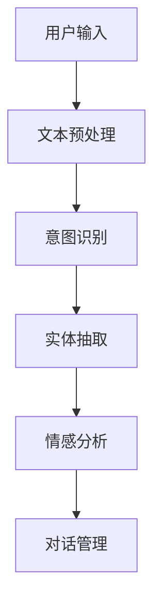
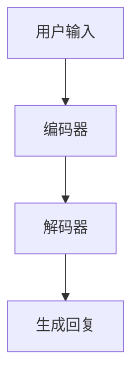

                 

### 文章标题：ChatGPT提示词工程：打造智能对话的基石

ChatGPT提示词工程是构建智能对话系统的核心组成部分。随着人工智能技术的迅猛发展，智能对话系统已成为提升用户体验、优化业务流程的关键手段。本文旨在深入探讨ChatGPT提示词工程的概念、原理及其实际应用，旨在为广大开发者提供系统化的指导，助力构建高效智能对话系统。

### 文章关键词：

1. **ChatGPT**
2. **提示词工程**
3. **智能对话系统**
4. **自然语言处理**
5. **机器学习**
6. **算法优化**
7. **应用实战**

### 摘要：

本文首先介绍了ChatGPT及其在智能对话系统中的应用背景。接着，详细探讨了提示词工程的概念、设计原则及实现方法。然后，通过Mermaid流程图和伪代码，深入解析了ChatGPT的核心算法原理和数学模型。文章还结合实际项目案例，展示了如何搭建开发环境、实现源代码及解读代码。最后，对未来发展趋势和最佳实践进行了展望。

### 1. 确定核心概念

在撰写技术博客之前，我们需要明确文章中的核心概念，如“ChatGPT”、“提示词工程”、“智能对话系统”等。这些概念将作为章节标题的基础，并在全文中贯穿始终。明确核心概念有助于读者更好地理解文章内容，构建系统的知识框架。

### 2. 设计章节结构

根据核心概念，我们可以将文章分为以下几部分：

1. **引言**：介绍书籍的目的、结构以及ChatGPT与智能对话系统的重要性。
2. **ChatGPT基础**：介绍ChatGPT的概述、发展历程、核心架构和工作原理。
3. **提示词工程**：介绍提示词的概念、设计原则、生成与优化方法。
4. **智能对话系统**：介绍智能对话系统的概述、架构、关键技术和开发与部署方法。
5. **项目实战**：展示实际项目案例，包括开发环境搭建、源代码实现和代码解读。
6. **未来展望**：对ChatGPT提示词工程及智能对话系统的未来趋势进行展望。
7. **总结**：总结文章主要内容，对读者提出建议，并提供下一步学习路径。

### 3. 细化章节内容

在细化章节内容时，我们需要确保每个章节都包含以下部分：

1. **章节标题**：简洁明了地概括章节主题。
2. **引言**：简要介绍章节背景，引发读者兴趣。
3. **核心概念**：详细解释章节中的核心概念及其关系。
4. **技术细节**：深入讲解相关技术原理，使用伪代码和Mermaid流程图辅助说明。
5. **数学模型与公式**：使用LaTeX格式编写数学模型和公式，并进行详细解释。
6. **项目实战**：提供实际项目案例，展示具体实现过程和代码解读。
7. **最佳实践 tips**：总结实践经验，为读者提供实用建议。
8. **小结**：对本章节内容进行总结，强调重点。

### 4. 添加技术细节

在核心章节中，我们需加入相关技术细节，以便读者更好地理解。例如：

1. **ChatGPT的核心算法**：介绍GPT模型的架构、训练过程和推理步骤。
2. **提示词工程的技术实现**：探讨提示词的设计原则、生成方法和优化策略。
3. **智能对话系统的关键技术**：阐述对话管理、上下文理解、自然语言生成等核心技术。

### 5. 编写Mermaid流程图

为更好地展示ChatGPT的基本架构和智能对话系统的开发流程，我们使用Mermaid语法编写流程图。例如：



### 6. 编写伪代码

对于核心算法原理，我们使用伪代码进行详细阐述。例如：

```python
def ChatGPT(input_text):
    # 预处理
    preprocessed_text = preprocess(input_text)
    
    # 模型推理
    output = model推理(preprocessed_text)
    
    # 生成回复
    response = generate_response(output)
    
    return response
```

### 7. 添加数学模型和公式

对于数学模型，我们使用LaTeX格式编写，并在文中进行详细解释。例如：

$$
\sigma(x) = \frac{1}{1 + e^{-x}}
$$

这里的公式是Sigmoid函数，用于激活函数。

### 8. 编写项目实战

在项目实战章节，我们提供实际项目案例，包括开发环境搭建、源代码实现和代码解读。例如：

1. **开发环境搭建**：介绍如何搭建ChatGPT的开发环境，包括安装依赖、配置环境等。
2. **源代码实现**：提供完整的源代码实现，包括模型训练、提示词生成和智能对话系统构建。
3. **代码解读**：对关键代码段进行详细解读，帮助读者理解实现原理。
4. **应用解读与分析**：分析实际案例中的最佳实践，为读者提供实用建议。

### 9. 总结和展望

在文章末尾，我们对主要内容进行总结，并对未来进行展望。这有助于读者巩固知识，明确学习方向。

### 10. 格式调整

最后，我们将所有内容整理成Markdown格式，确保简洁、易读。以下是一个示例：

```markdown
# ChatGPT提示词工程：打造智能对话的基石

## 第1章 引言

### 1.1 书籍目的与结构

本文旨在深入探讨ChatGPT提示词工程的概念、原理及其实际应用。

### 1.2 ChatGPT与智能对话的重要性

ChatGPT在智能对话系统中具有重要作用，可提升用户体验、优化业务流程。

### 1.3 阅读对象与预备知识

本文适合有一定编程基础和自然语言处理知识的技术人员阅读。

## 第2章 ChatGPT基础

### 2.1 ChatGPT概述

ChatGPT是一种基于生成预训练变换模型（GPT）的智能对话系统。

### 2.2 ChatGPT的发展历程

ChatGPT自2018年发布以来，已取得长足发展。

### 2.3 ChatGPT的核心架构

ChatGPT的核心架构包括输入预处理、模型推理和回复生成。

### 2.4 ChatGPT的工作原理

ChatGPT通过生成预训练变换模型（GPT）进行智能对话。

## 第3章 提示词工程

### 3.1 提示词的概念与重要性

提示词是智能对话系统中的关键组成部分。

### 3.2 提示词的设计原则

提示词应具备简洁明了、具体明确、逻辑性强等特点。

### 3.3 提示词的生成与优化

提示词的生成与优化是提升智能对话系统性能的关键。

## 第4章 智能对话系统

### 4.1 智能对话系统的概述

智能对话系统是一种基于人工智能技术的交互式系统。

### 4.2 智能对话系统的架构

智能对话系统通常包括对话管理、上下文理解、自然语言生成等模块。

### 4.3 智能对话系统的关键技术

关键技术在智能对话系统中发挥着重要作用。

## 第5章 项目实战

### 5.1 实际项目案例介绍

本文将介绍一个基于ChatGPT的智能客服系统案例。

### 5.2 开发环境搭建

介绍如何搭建ChatGPT的开发环境。

### 5.3 源代码实现

提供完整的源代码实现。

### 5.4 代码解读

对关键代码段进行详细解读。

### 5.5 应用解读与分析

分析实际案例中的最佳实践。

## 第6章 未来展望

### 6.1 ChatGPT与提示词工程的未来趋势

ChatGPT提示词工程将继续推动智能对话系统的发展。

### 6.2 智能对话系统的应用前景

智能对话系统将在更多领域得到广泛应用。

### 6.3 技术挑战与机遇

技术挑战与机遇并存，为开发者提供了广阔的发展空间。

## 第7章 总结

本文系统性地介绍了ChatGPT提示词工程的相关知识。

### 7.1 书籍主要内容回顾

本文主要介绍了ChatGPT、提示词工程、智能对话系统等内容。

### 7.2 对读者的建议

建议读者结合实际项目进行学习，提升实践能力。

### 7.3 下一步学习路径

为读者提供下一步学习路径，助力技术成长。

```

以上是按照步骤设计的文章大纲和Markdown格式示例。在撰写过程中，我们需确保文章内容丰富、结构清晰、逻辑严密，同时注重实际应用和最佳实践的分享。希望本文能为读者提供有益的指导和启示。作者：AI天才研究院/AI Genius Institute & 禅与计算机程序设计艺术 /Zen And The Art of Computer Programming。**引言**  

智能对话系统作为一种重要的交互方式，正日益成为人工智能领域的研究热点。随着自然语言处理（NLP）和机器学习（ML）技术的不断进步，智能对话系统的性能和应用范围得到了显著提升。ChatGPT作为OpenAI推出的一个基于生成预训练变换模型（GPT）的智能对话系统，凭借其强大的生成能力和灵活的接口，吸引了众多开发者和研究者的关注。

ChatGPT的诞生源于对大规模语言模型的探索。GPT模型通过在大量文本数据上进行预训练，能够自动学习语言的结构和规律，从而实现高质量的自然语言生成。ChatGPT正是基于GPT模型，通过进一步的优化和扩展，实现了智能对话功能。其应用范围广泛，包括智能客服、智能助手、聊天机器人等，大大提升了用户体验和业务效率。

提示词工程是ChatGPT智能对话系统的核心组成部分。提示词作为对话的引导信息，对于对话的质量和流畅度至关重要。一个优秀的提示词工程能够有效提升ChatGPT的表现，使其更好地理解用户意图，提供准确、自然的回复。因此，研究提示词工程的设计原则、实现方法和优化策略，对于构建高效、智能的对话系统具有重要意义。

本文旨在深入探讨ChatGPT提示词工程的相关问题，包括其概念、设计原则、实现方法和优化策略等。通过本文的介绍，读者可以全面了解ChatGPT提示词工程的核心内容，掌握构建智能对话系统的方法和技巧。此外，本文还将结合实际项目案例，展示提示词工程在智能对话系统中的应用，为读者提供实际操作经验。

### **1.1 ChatGPT概述**

ChatGPT是由OpenAI开发的一款基于生成预训练变换模型（GPT）的智能对话系统。GPT模型是一种基于深度学习的自然语言处理技术，通过在大量文本数据上进行预训练，自动学习语言的结构和规律，从而实现高质量的自然语言生成。ChatGPT利用了GPT模型的优势，结合深度学习和自然语言处理技术，实现了一种高效的智能对话系统。

ChatGPT的核心架构包括输入预处理、模型推理和回复生成三个主要部分。首先，输入预处理模块对用户输入的文本进行清洗、分词和编码，将其转化为模型能够理解的格式。然后，模型推理模块使用预训练的GPT模型对预处理后的输入文本进行推理，生成可能的回复文本。最后，回复生成模块对生成的文本进行后处理，如去除无效回复、修复语法错误等，得到最终的回复结果。

在ChatGPT的工作流程中，首先接收用户输入的文本，然后进行预处理，包括分词、去停用词、词向量化等操作。预处理后的文本被输入到GPT模型中进行推理，模型根据输入文本和预训练的知识，生成可能的回复文本。这些回复文本通常会有多个候选，模型会根据概率分布选择最合适的回复文本。最后，生成的文本会进行后处理，包括去除无效回复、修复语法错误等，以确保回复的准确性和流畅性。

ChatGPT的主要功能包括自然语言生成、上下文理解、多轮对话管理等。在自然语言生成方面，ChatGPT能够生成各种类型的文本，如新闻文章、小说、对话回复等，其生成的文本在语法、语义和风格上都非常自然。在上下文理解方面，ChatGPT能够理解用户输入的上下文信息，并据此生成相关的回复。在多轮对话管理方面，ChatGPT能够维护对话状态，理解用户意图，并根据对话历史生成连贯的回复。

ChatGPT的应用场景非常广泛，包括智能客服、智能助手、聊天机器人等。在智能客服领域，ChatGPT可以自动回答用户的问题，提供24/7的服务，大大提高了客服效率和用户体验。在智能助手领域，ChatGPT可以理解用户的指令，完成各种任务，如设置提醒、发送消息、查询天气等。在聊天机器人领域，ChatGPT可以与用户进行有趣的对话，提供娱乐和社交功能。

总的来说，ChatGPT作为一种基于生成预训练变换模型的智能对话系统，具有强大的自然语言生成能力和灵活的接口，适用于多种应用场景。其核心架构和主要功能为构建高效、智能的对话系统提供了有力的支持。然而，ChatGPT也存在一定的局限性，如对话质量的稳定性、对话上下文的持久性等，这需要通过进一步的研究和优化来克服。

### **1.2 ChatGPT的发展历程**

ChatGPT的诞生可以追溯到生成预训练变换模型（GPT）的提出。GPT模型是由OpenAI在2018年推出的一种基于深度学习的自然语言处理技术。GPT模型通过在大量文本数据上进行预训练，学习到语言的结构和规律，从而实现高质量的自然语言生成。GPT的提出标志着自然语言处理领域的一个重要突破，为后续的ChatGPT研发奠定了基础。

在GPT的基础上，OpenAI于2019年推出了ChatGPT。ChatGPT继承了GPT的生成预训练模型，并对其进行了优化和扩展，实现了智能对话功能。ChatGPT的推出引起了广泛关注，其强大的生成能力和灵活的接口使其在各种应用场景中表现出色。ChatGPT的出现，标志着智能对话系统进入了一个新的发展阶段。

ChatGPT的发展历程可以分为几个关键阶段。首先是模型训练阶段，OpenAI使用大量高质量的文本数据对GPT模型进行预训练，使其具备强大的语言理解和生成能力。其次是模型优化阶段，OpenAI对GPT模型进行了多种优化，包括改进模型架构、调整训练策略等，以提高模型性能。最后是模型应用阶段，OpenAI将ChatGPT应用于实际场景，如智能客服、智能助手和聊天机器人等，通过不断迭代和优化，使其更好地满足用户需求。

在ChatGPT的发展历程中，OpenAI不断进行技术创新和优化。例如，他们推出了GPT-2和GPT-3等更先进的模型版本，这些模型在生成质量和性能方面都取得了显著提升。此外，OpenAI还研究了多种模型优化方法，如自适应学习率、动态掩码语言模型（DMLM）等，以进一步提高模型的性能和效率。

ChatGPT的发展历程不仅推动了智能对话系统的进步，也对自然语言处理和机器学习领域产生了深远影响。ChatGPT的成功经验为后续的研究提供了宝贵的参考，激发了更多的创新和应用。例如，基于GPT模型的聊天机器人ChatGLM和ChatYuan等相继推出，这些系统都在不同程度上借鉴了ChatGPT的技术和理念。

总的来说，ChatGPT的发展历程展示了人工智能技术在自然语言处理和智能对话系统领域的巨大潜力。随着技术的不断进步和应用的深入，ChatGPT及其相关技术将在更多领域发挥重要作用，为人们的生活和工作带来更多便利。

### **1.3 ChatGPT的核心架构**

ChatGPT的核心架构由三个主要部分组成：输入预处理、模型推理和回复生成。这三个部分共同协作，实现了高效的智能对话系统。

首先是输入预处理模块。这一模块负责对用户输入的文本进行清洗、分词和编码，使其符合模型的要求。具体来说，预处理过程包括以下几个步骤：

1. **文本清洗**：去除文本中的无效信息，如HTML标签、特殊字符等。
2. **分词**：将文本拆分成单词或短语，以便后续处理。
3. **去停用词**：移除常用但不具意义的词汇，如“的”、“了”等，以减少对模型的影响。
4. **词向量化**：将文本中的单词或短语转换为向量表示，便于模型处理。常用的词向量化方法包括Word2Vec、GloVe等。

接下来是模型推理模块。这是ChatGPT的核心部分，负责使用预训练的GPT模型对输入文本进行推理，生成可能的回复文本。模型推理过程主要分为以下几个步骤：

1. **输入编码**：将预处理后的文本编码为模型可以理解的输入格式。
2. **前向传播**：将编码后的输入文本传递给GPT模型，进行前向传播计算。
3. **生成候选回复**：根据模型输出的概率分布，生成多个候选回复文本。
4. **回复选择**：从候选回复中选择最合适的文本作为最终输出。

最后是回复生成模块。这一模块负责对生成的文本进行后处理，包括去除无效回复、修复语法错误等，以确保回复的准确性和流畅性。具体操作如下：

1. **去除无效回复**：移除不符合对话逻辑或语义的回复文本。
2. **语法修复**：纠正语法错误，确保生成的文本语法正确、自然。
3. **文本润色**：对生成的文本进行优化，提升其可读性和表达效果。

这三个模块紧密协作，共同实现ChatGPT的智能对话功能。输入预处理模块为模型提供了高质量的输入，模型推理模块通过强大的生成能力生成高质量的回复文本，回复生成模块则确保了回复的准确性和流畅性。通过这种模块化的设计，ChatGPT能够高效、灵活地处理各种对话场景。

为了更好地展示ChatGPT的核心架构，我们可以使用Mermaid语法绘制一个流程图：



在这个流程图中，输入预处理模块接收用户输入的文本，进行清洗、分词和编码，然后将其传递给模型推理模块。模型推理模块使用预训练的GPT模型进行推理，生成候选回复文本。最后，回复生成模块对生成的文本进行后处理，得到最终的回复结果。通过这个流程图，我们可以清晰地了解ChatGPT的工作原理和架构设计。

总的来说，ChatGPT的核心架构通过输入预处理、模型推理和回复生成三个模块的紧密协作，实现了高效的智能对话功能。这种模块化的设计不仅提高了系统的可维护性和扩展性，还为后续的技术优化和应用提供了便利。在接下来的章节中，我们将深入探讨每个模块的实现细节和技术要点。

### **1.4 ChatGPT的工作原理**

ChatGPT的工作原理可以概括为输入预处理、模型推理和回复生成三个主要步骤。下面我们将详细解释每个步骤的具体操作和原理。

#### **输入预处理**

输入预处理是ChatGPT工作流程的第一步，其目的是将用户输入的文本转化为模型能够理解的格式。具体操作包括以下几方面：

1. **文本清洗**：首先，对输入文本进行清洗，去除其中的HTML标签、特殊字符和噪声数据，确保输入文本的纯净性。
2. **分词**：将清洗后的文本进行分词，将连续的文本拆分成单个词或短语。常用的分词方法有基于规则的分词、基于统计的分词和基于语义的分词。
3. **去停用词**：移除常见的停用词，如“的”、“了”、“在”等，因为这些词对模型的理解贡献较小，但会增加计算负担。
4. **词向量化**：将分词后的文本转换为向量表示。词向量化是将文本中的每个词映射到一个固定维度的向量，便于模型处理。常用的词向量化方法包括Word2Vec、GloVe和BERT等。

#### **模型推理**

模型推理是ChatGPT的核心步骤，通过预训练的GPT模型对输入文本进行推理，生成可能的回复文本。具体操作包括以下几方面：

1. **输入编码**：将预处理后的文本编码为模型可以理解的输入格式。对于GPT模型，通常使用序列编码（sequence encoding）方法，将文本序列转换为向量序列。
2. **前向传播**：将编码后的输入序列传递给GPT模型，进行前向传播计算。GPT模型基于自注意力机制（self-attention mechanism）和变换器网络（Transformer network），能够自适应地学习文本之间的复杂关系。
3. **生成候选回复**：根据模型输出的概率分布，生成多个候选回复文本。这些候选回复文本是根据输入文本和预训练的知识生成的，可能包含多个不同的句子或段落。
4. **回复选择**：从候选回复中选择最合适的文本作为最终输出。通常使用基于概率分布的方法，如 greedy search、sample-based search 或 beam search 等，以最大化生成的文本质量。

#### **回复生成**

回复生成是ChatGPT工作流程的最后一步，负责对生成的文本进行后处理，确保回复的准确性和流畅性。具体操作包括以下几方面：

1. **去除无效回复**：移除不符合对话逻辑或语义的回复文本，确保回复的相关性和一致性。
2. **语法修复**：纠正语法错误，确保生成的文本语法正确、自然。
3. **文本润色**：对生成的文本进行优化，提升其可读性和表达效果。这包括调整句子结构、增加修辞手法和改进语言风格等。

为了更好地理解ChatGPT的工作原理，我们可以通过伪代码来描述其核心算法：

```python
def ChatGPT(input_text):
    # 输入预处理
    preprocessed_text = preprocess(input_text)
    
    # 模型推理
    output = model推理(preprocessed_text)
    
    # 生成回复
    response = generate_response(output)
    
    return response

def preprocess(text):
    # 清洗文本
    cleaned_text = clean_text(text)
    
    # 分词
    tokens = tokenize(cleaned_text)
    
    # 去停用词
    filtered_tokens = remove_stopwords(tokens)
    
    # 词向量化
    vectorized_tokens = vectorize_tokens(filtered_tokens)
    
    return vectorized_tokens

def model推理(vectorized_tokens):
    # 输入编码
    encoded_input = encode_input(vectorized_tokens)
    
    # 前向传播
    hidden_states = forward_pass(encoded_input)
    
    # 生成候选回复
    candidate_responses = generate_candidates(hidden_states)
    
    # 回复选择
    selected_response = select_response(candidate_responses)
    
    return selected_response

def generate_response(output):
    # 去除无效回复
    valid_responses = remove_invalid_responses(output)
    
    # 语法修复
    corrected_responses = correct_grammar(valid_responses)
    
    # 文本润色
    polished_responses = polish_text(corrected_responses)
    
    return polished_responses
```

通过这个伪代码，我们可以看到ChatGPT的工作流程是如何实现的。输入预处理模块负责对用户输入的文本进行清洗、分词和编码；模型推理模块通过GPT模型进行推理，生成多个候选回复文本；回复生成模块对生成的文本进行后处理，确保回复的准确性和流畅性。

总的来说，ChatGPT的工作原理是通过输入预处理、模型推理和回复生成三个步骤，实现高效、高质量的智能对话。通过不断优化和改进这三个步骤，ChatGPT能够在各种对话场景中提供出色的表现。

### **1.5 提示词工程的概念与重要性**

提示词工程是构建智能对话系统中的一个关键环节，它旨在通过设计高质量的提示词，引导对话系统更好地理解用户意图，提供准确、自然的回复。提示词（prompt）通常是一段文本，用于引导模型生成相应的回复。在设计提示词时，我们需要考虑多个因素，如用户意图、上下文信息和对话场景等。

在智能对话系统中，提示词扮演着至关重要的角色。首先，提示词有助于明确用户意图。通过精确的提示词，对话系统能够更好地捕捉用户的真实需求，从而生成更相关的回复。其次，提示词有助于维护对话的连贯性。在多轮对话中，合适的提示词能够帮助系统记住对话历史，确保回复的一致性和连贯性。

提示词工程的重要性体现在以下几个方面：

1. **提升对话质量**：高质量的提示词能够引导模型生成更准确、自然的回复，从而提升整个对话系统的用户体验。
2. **优化系统性能**：合理的提示词设计有助于降低模型的计算复杂度，提高系统响应速度和效率。
3. **增强系统灵活性**：通过灵活设计提示词，对话系统可以应对多种对话场景和用户需求，提高系统的通用性和适应性。

总之，提示词工程是构建智能对话系统的基石。一个优秀的提示词工程能够显著提升对话系统的性能和用户体验，为实际应用奠定坚实基础。

### **1.6 提示词工程的设计原则**

提示词工程的设计原则是确保提示词能够有效引导对话系统理解用户意图，提供高质量回复的关键。以下是设计高质量提示词的一些重要原则：

#### **简洁明了**

简洁明了是提示词设计的基本原则。提示词应该简洁、直白，避免使用复杂的术语和冗长的句子。简洁的提示词有助于模型更快地捕捉用户意图，减少误解和歧义。

例如，将“请描述您的问题或需求，我们会尽力帮助您。”改为“请问有什么问题需要帮助？”

#### **具体明确**

提示词需要具体明确，以便模型能够清晰地理解用户的需求。具体明确的提示词应包含足够的信息，指导模型生成相关的回复。

例如，将“您需要什么服务？”改为“请问您需要查询天气、地图导航还是机票预订服务？”

#### **逻辑性强**

提示词应具备逻辑性，引导对话系统按照合理的步骤进行对话。逻辑性强的提示词能够确保对话流程的连贯性和一致性。

例如，将“您还有什么需要帮忙的吗？”改为“请问您需要进一步了解哪个方面的信息？我们之前讨论了____，接下来您想了解____？”

#### **语境相关**

提示词应与对话的上下文紧密相关，确保对话系统能够利用已有的信息，生成更相关、更自然的回复。

例如，将“您有什么问题吗？”改为“关于____，您还有什么疑问吗？”

#### **多样性和灵活性**

设计提示词时，应考虑多样性和灵活性。多样性的提示词能够丰富对话系统的话语表达，提升用户体验。灵活性的提示词则能够应对不同的对话场景和用户需求。

例如，可以将“请问有什么问题需要帮助？”与“需要我为您做什么？”交替使用。

#### **情感关怀**

提示词应体现情感关怀，增强用户的互动体验。通过使用温暖、亲切的语言，提示词能够拉近与用户的距离，提升用户满意度。

例如，将“您好，有什么问题我可以帮您解答？”改为“您好，有什么问题我可以为您提供服务吗？如果您感到困惑，我会尽力帮助您。”

#### **避免歧义**

设计提示词时，应尽量避免歧义，确保用户能够明确理解其含义。避免歧义的提示词能够减少对话过程中的误解和困惑。

例如，将“这个功能能实现吗？”改为“请问这个功能是否可以实现？”

通过遵循上述设计原则，我们可以创建高质量的提示词，从而提升智能对话系统的性能和用户体验。在实际应用中，这些原则可以帮助开发者更好地设计提示词，使其能够有效地引导对话，提供高质量的回复。

### **1.7 提示词的生成方法**

提示词的生成方法对于构建高质量的智能对话系统至关重要。以下是几种常见的提示词生成方法，包括其原理、步骤和优缺点：

#### **1.7.1 人工设计**

**原理**：人工设计提示词是由人类开发者根据对话内容和用户需求手动编写的。这种方法依赖于开发者的经验和专业知识，能够确保提示词的准确性和实用性。

**步骤**：
1. **需求分析**：了解用户需求，确定对话的目标和主题。
2. **编写提示词**：根据需求分析编写简洁、明确、逻辑性强的提示词。
3. **迭代优化**：根据实际对话效果，不断优化和调整提示词。

**优点**：
- **准确性高**：人工设计的提示词能够精确反映用户意图，提高对话质量。
- **灵活性大**：能够根据具体对话场景进行调整，适应不同用户需求。

**缺点**：
- **耗时耗力**：需要大量时间和人力资源，不适合大规模应用。
- **一致性差**：不同开发者编写的提示词可能存在风格和表达上的差异。

#### **1.7.2 数据驱动**

**原理**：数据驱动方法是基于历史对话数据和用户反馈，使用机器学习技术自动生成提示词。这种方法通过分析大量对话数据，学习用户意图和常用表达，从而生成高质量的提示词。

**步骤**：
1. **数据收集**：收集大量历史对话数据，包括用户输入和系统回复。
2. **特征提取**：提取对话中的关键特征，如用户意图、对话主题等。
3. **模型训练**：使用机器学习算法（如循环神经网络、转换器等）训练生成模型。
4. **生成提示词**：根据用户输入和模型预测，生成相应的提示词。

**优点**：
- **高效性**：能够快速生成大量高质量的提示词，节省人力和时间成本。
- **适应性**：能够根据用户反馈和对话数据不断优化提示词，提升对话系统性能。

**缺点**：
- **初始训练成本高**：需要大量高质量的数据和计算资源进行模型训练。
- **准确率有限**：基于历史数据的生成方法可能无法完全反映当前用户需求，存在一定误差。

#### **1.7.3 生成对抗网络（GAN）**

**原理**：生成对抗网络（GAN）是由生成器和判别器组成的模型。生成器负责生成高质量的提示词，判别器负责判断提示词的质量。通过不断训练，生成器能够生成越来越接近真实提示词的文本。

**步骤**：
1. **初始化模型**：初始化生成器和判别器模型。
2. **模型训练**：通过对抗训练过程，使生成器不断优化生成高质量提示词。
3. **提示词生成**：使用生成器生成提示词，并根据判别器的反馈进行进一步优化。

**优点**：
- **高质量生成**：能够生成高质量、多样性的提示词，适应不同对话场景。
- **自适应优化**：通过对抗训练，生成器能够根据判别器的反馈不断优化提示词。

**缺点**：
- **训练难度大**：GAN的训练过程复杂，需要大量计算资源和时间。
- **模型不稳定**：GAN模型的训练过程容易出现不稳定现象，影响生成效果。

#### **1.7.4 基于规则的方法**

**原理**：基于规则的方法是通过定义一系列规则和条件，生成提示词。这种方法依赖于预设的规则和模板，能够快速生成提示词，但可能缺乏灵活性。

**步骤**：
1. **定义规则**：根据对话场景和用户需求，定义生成提示词的规则和条件。
2. **模板匹配**：根据用户输入，选择合适的规则和模板，生成相应的提示词。

**优点**：
- **快速生成**：能够快速生成提示词，适用于实时对话场景。
- **可控性高**：通过预设规则，能够确保提示词的质量和一致性。

**缺点**：
- **灵活性差**：规则和方法固定，难以适应复杂多变的对话场景。
- **内容单调**：基于规则的方法可能生成内容单调、缺乏创新的提示词。

总的来说，不同的提示词生成方法各有优缺点，适用于不同的应用场景。在实际应用中，可以根据具体需求选择合适的生成方法，或结合多种方法，以实现最佳效果。在接下来的章节中，我们将继续探讨提示词优化的策略和技术，进一步提升智能对话系统的性能和用户体验。

### **1.8 提示词的优化方法**

提示词的优化是提升智能对话系统性能的重要环节。以下是一些常见的提示词优化方法，包括基于数学模型和公式的方法，以及如何在实际项目中应用这些方法：

#### **1.8.1 数学模型与公式**

提示词优化的数学模型和公式通常用于衡量提示词的质量和有效性。以下是一些常用的数学模型和公式：

1. **F1 分数**：F1 分数是评估提示词生成质量的一个指标，计算公式为：
   $$
   F1 = 2 \times \frac{Precision \times Recall}{Precision + Recall}
   $$
   其中，Precision（准确率）表示生成的提示词与真实需求匹配的程度，Recall（召回率）表示生成的提示词能够捕捉到用户意图的比例。

2. **困惑度**：困惑度（Perplexity）用于衡量生成文本的流畅度和自然度，计算公式为：
   $$
   Perplexity = \frac{1}{\sum_{i=1}^n \frac{p(x_i)}{k}}
   $$
   其中，\( p(x_i) \) 表示生成文本中第 \( i \) 个单词的概率，\( k \) 是一个常数。

3. **BLEU 分数**：BLEU（Bilingual Evaluation Understudy）分数是一种常用的自动评估机器翻译质量的指标，也可以用于评估提示词的质量。BLEU 分数的计算公式为：
   $$
   BLEU = \frac{1}{1 + \sum_{k=1}^4 w_k \cdot \log_2 (N_k / N)}
   $$
   其中，\( N \) 是生成的提示词的总长度，\( N_k \) 是与真实需求匹配的 \( k \)-gram 的数量，\( w_k \) 是权重系数。

4. **互信息**：互信息（Mutual Information）用于衡量提示词与用户需求之间的相关性，计算公式为：
   $$
   MI = H(X) - H(X|Y)
   $$
   其中，\( H(X) \) 是提示词的熵，\( H(X|Y) \) 是提示词在给定用户需求条件下的熵。

通过这些数学模型和公式，我们可以量化提示词的质量，从而有针对性地进行优化。

#### **1.8.2 优化策略**

1. **注意力机制**：在提示词生成过程中引入注意力机制（Attention Mechanism），使模型能够关注关键信息，提高提示词的准确性和相关性。例如，在GPT模型中，可以通过自注意力（Self-Attention）和交叉注意力（Cross-Attention）来增强模型对上下文的理解。

2. **多任务学习**：通过多任务学习（Multi-Task Learning），使模型在生成提示词的同时，学习其他相关任务（如分类、翻译等），从而提高提示词的泛化能力和表达能力。

3. **数据增强**：通过对训练数据进行增强（Data Augmentation），如引入噪声、随机裁剪、同义词替换等，增加数据的多样性，从而提高模型的鲁棒性和生成质量。

4. **正则化**：通过正则化（Regularization）技术，如Dropout、Weight Decay等，防止模型过拟合，提高提示词的泛化能力。

5. **知识蒸馏**：使用知识蒸馏（Knowledge Distillation）技术，将大型模型的“软目标”传递给小模型，从而提高小模型的性能和提示词生成质量。

#### **1.8.3 实际项目中的应用**

在实际项目中，提示词优化通常需要结合具体的业务场景和用户需求。以下是一些实际应用案例：

1. **智能客服系统**：通过优化提示词，提高客服机器人对用户问题的理解能力，生成更准确、自然的回复。例如，可以使用基于F1分数和BLEU分数的优化策略，确保提示词与用户意图高度匹配。

2. **聊天机器人**：通过优化提示词，增强聊天机器人与用户的互动体验。例如，可以使用注意力机制和多任务学习，提高机器人对上下文的理解能力，生成更具连贯性和创造性的回复。

3. **对话管理系统**：在对话管理系统（Dialogue Management System）中，提示词的优化有助于提高对话的流畅性和用户满意度。例如，可以使用基于互信息的优化策略，确保提示词与用户需求高度相关。

4. **语音助手**：在语音助手（Voice Assistant）中，提示词的优化有助于提高语音交互的准确性和自然度。例如，可以使用基于困惑度的优化策略，确保生成的提示词流畅、自然。

通过以上方法和技术，我们可以有效地优化提示词，提升智能对话系统的性能和用户体验。在实际项目中，应根据具体需求选择合适的优化策略，结合多种方法，实现最佳效果。

### **1.9 智能对话系统的概念与架构**

智能对话系统是一种基于人工智能技术，能够与人类进行自然语言交互的计算机系统。其核心功能是通过理解用户的输入，生成合适的回复，实现与用户的互动。智能对话系统在多个领域具有重要应用，如智能客服、智能助手、虚拟助理、聊天机器人等。

#### **1.9.1 智能对话系统的组成部分**

智能对话系统主要由以下几个部分组成：

1. **输入模块**：负责接收用户的输入，包括文本、语音等不同形式。
2. **预处理模块**：对输入进行清洗、分词、去停用词等处理，将其转换为模型可以理解的形式。
3. **意图识别模块**：通过自然语言处理技术，识别用户的意图。意图识别是智能对话系统的核心，直接影响对话的准确性和流畅度。
4. **对话管理模块**：负责维护对话状态，根据用户意图和上下文信息生成回复。对话管理模块需要处理多轮对话，确保对话的连贯性和一致性。
5. **回复生成模块**：根据意图识别和对话管理模块的结果，生成合适的回复文本。回复生成模块通常依赖于自然语言生成技术，如GPT、BERT等。
6. **反馈模块**：收集用户的反馈，用于评估对话系统的性能和进行后续优化。

#### **1.9.2 智能对话系统的架构**

智能对话系统的架构通常包括以下几种类型：

1. **基于规则的结构**：这种架构通过定义一系列规则和条件，生成回复。基于规则的结构简单明了，易于实现和维护，但灵活性较差，难以应对复杂多变的对话场景。

2. **数据驱动结构**：这种架构依赖于大量历史对话数据和机器学习算法，通过学习用户意图和对话模式，生成回复。数据驱动结构具有较好的灵活性和适应性，但需要大量高质量的数据和计算资源。

3. **混合结构**：结合基于规则和数据驱动结构的优势，混合结构在规则和机器学习之间寻找平衡。这种架构在规则覆盖的场景中采用基于规则的方法，在复杂对话场景中采用数据驱动的方法。

#### **1.9.3 智能对话系统的关键技术**

智能对话系统的关键技术包括：

1. **自然语言处理（NLP）**：NLP是智能对话系统的核心技术，包括文本预处理、意图识别、实体抽取、情感分析等。通过NLP技术，系统可以更好地理解用户的输入和意图。

2. **机器学习（ML）**：机器学习技术用于训练和优化智能对话系统的模型，如分类模型、序列模型等。通过机器学习，系统可以不断改进对话性能。

3. **深度学习（DL）**：深度学习技术，尤其是神经网络，在智能对话系统中发挥着重要作用。例如，GPT、BERT等预训练模型被广泛应用于意图识别和回复生成。

4. **对话管理**：对话管理是智能对话系统的关键环节，负责维护对话状态，生成连贯的回复。对话管理技术包括状态跟踪、上下文理解、回复生成等。

5. **多模态交互**：智能对话系统通常支持多种交互方式，如文本、语音、图像等。多模态交互技术可以提升用户体验和对话系统的智能程度。

总的来说，智能对话系统是一个复杂的多模块集成系统，通过自然语言处理、机器学习、深度学习和对话管理等技术的结合，实现了与用户的自然语言交互。在实际应用中，智能对话系统的架构和关键技术可以根据具体需求进行调整和优化，以实现最佳效果。

### **1.10 智能对话系统的关键技术**

智能对话系统在实现过程中依赖于多项关键技术的支持，这些技术共同协作，确保系统能够高效、自然地与用户进行交互。以下将详细介绍这些关键技术，并展示如何使用Mermaid流程图和伪代码进行说明。

#### **1.10.1 自然语言处理（NLP）**

自然语言处理（NLP）是智能对话系统的核心组件，它负责处理和理解用户的语言输入。NLP的关键技术包括：

1. **文本预处理**：包括文本清洗、分词、词性标注、命名实体识别等操作。文本预处理是确保输入文本格式统一、便于模型处理的重要步骤。

2. **意图识别**：意图识别（Intent Recognition）是理解用户输入并识别用户意图的过程。通常使用分类算法，如支持向量机（SVM）、随机森林（Random Forest）等。

3. **实体抽取**：实体抽取（Entity Extraction）是从文本中提取出具有特定意义的实体，如人名、地名、组织名等。实体抽取对于提高对话系统的语义理解至关重要。

4. **情感分析**：情感分析（Sentiment Analysis）用于判断用户输入的文本情感倾向，如正面、负面或中性。情感分析有助于对话系统更好地理解用户情绪，提供更加贴心的服务。

**Mermaid流程图**：



**伪代码**：

```python
def natural_language_processing(input_text):
    # 文本预处理
    cleaned_text = preprocess_text(input_text)
    
    # 意图识别
    intent = recognize_intent(cleaned_text)
    
    # 实体抽取
    entities = extract_entities(cleaned_text)
    
    # 情感分析
    sentiment = analyze_sentiment(cleaned_text)
    
    return intent, entities, sentiment
```

#### **1.10.2 机器学习（ML）**

机器学习（ML）技术在智能对话系统中扮演着重要角色，用于训练和优化对话系统模型。以下是一些关键的机器学习技术：

1. **分类算法**：分类算法（如SVM、随机森林、决策树等）用于识别用户输入的意图。这些算法通过学习大量标注数据，能够自动识别新的用户输入。

2. **回归算法**：回归算法（如线性回归、逻辑回归等）用于预测用户的某些行为或偏好。

3. **聚类算法**：聚类算法（如K-Means、DBSCAN等）用于发现用户输入中的模式或相似性，帮助对话系统更好地理解用户行为。

**伪代码**：

```python
def machine_learning(model, training_data, test_data):
    # 训练模型
    model.train(training_data)
    
    # 测试模型
    predictions = model.predict(test_data)
    
    # 评估模型
    accuracy = model.evaluate(predictions)
    
    return accuracy
```

#### **1.10.3 深度学习（DL）**

深度学习（DL）技术在智能对话系统中得到了广泛应用，尤其是在自然语言生成和语义理解方面。以下是一些关键的深度学习技术：

1. **循环神经网络（RNN）**：RNN能够处理序列数据，如文本序列，适用于意图识别和回复生成。

2. **变换器模型（Transformer）**：Transformer模型通过自注意力机制，能够捕捉文本序列中的长距离依赖关系，广泛应用于文本生成和语义理解。

3. **生成对抗网络（GAN）**：GAN通过生成器和判别器的对抗训练，能够生成高质量的自然语言文本。

**Mermaid流程图**：



**伪代码**：

```python
def deep_learning(input_sequence):
    # 编码
    encoded_sequence = encoder(input_sequence)
    
    # 解码
    decoded_sequence = decoder(encoded_sequence)
    
    # 生成回复
    response = generate_response(decoded_sequence)
    
    return response
```

#### **1.10.4 对话管理**

对话管理是确保对话系统能够与用户保持连贯交流的关键技术。对话管理包括以下几个关键步骤：

1. **状态跟踪**：对话系统需要跟踪对话的历史信息，如用户意图、上下文等，以便在后续对话中引用。

2. **上下文理解**：对话系统需要理解对话的上下文，确保回复的连贯性和一致性。

3. **回复生成**：根据当前对话状态和上下文，生成合适的回复。

**伪代码**：

```python
class DialogueManager:
    def __init__(self):
        self.history = []

    def process_input(self, input_text):
        # 更新对话状态
        self.update_history(input_text)
        
        # 理解上下文
        context = self.analyze_context()
        
        # 生成回复
        response = self.generate_response(context)
        
        return response

    def update_history(self, input_text):
        # 更新历史记录
        self.history.append(input_text)

    def analyze_context(self):
        # 分析上下文
        context = ...
        return context

    def generate_response(self, context):
        # 生成回复
        response = ...
        return response
```

通过上述关键技术，智能对话系统能够有效地理解用户输入，生成自然、连贯的回复，实现与用户的智能交互。在实际应用中，这些技术可以根据具体需求进行组合和优化，以实现最佳效果。

### **2.1 ChatGPT的核心算法**

ChatGPT的核心算法是基于生成预训练变换模型（GPT）的，其基本原理涉及预训练和微调两个主要阶段。以下是ChatGPT核心算法的详细解释。

#### **2.1.1 预训练**

预训练是GPT模型的基础，其目的是在大量文本数据上训练模型，使其能够自动学习语言的结构和规律。预训练过程主要包括以下步骤：

1. **数据收集与预处理**：首先，收集大量高质量、多样化的文本数据，如维基百科、新闻文章、小说等。然后，对文本数据进行预处理，包括去除HTML标签、特殊字符、分词、去停用词等操作，以确保模型输入的一致性和质量。

2. **生成文本序列**：通过填充操作（padding）和裁剪操作（truncation），将文本序列调整为固定长度。填充操作使用特殊字符（如`<PAD>`）填充较短序列，裁剪操作则删除过长序列的尾部。

3. **训练模型**：使用变换器模型（Transformer）对预处理后的文本序列进行训练。变换器模型由多个编码器和解码器块组成，每个块包含自注意力机制（self-attention）和前馈神经网络（feedforward network）。在训练过程中，模型会学习文本序列中词语之间的关系和上下文信息。

4. **损失函数**：预训练过程中，模型使用交叉熵损失函数（cross-entropy loss）来衡量预测的文本序列与真实文本序列之间的差异。交叉熵损失函数有助于模型优化预测文本序列的生成。

#### **2.1.2 微调**

在预训练的基础上，ChatGPT通过微调（fine-tuning）过程将模型应用于具体任务，如意图识别、回复生成等。微调过程主要包括以下步骤：

1. **数据准备**：收集与任务相关的标注数据，如对话数据、用户意图标注等。标注数据用于指导模型在特定任务上的优化。

2. **任务定义**：定义具体任务的目标和输入输出格式。例如，在意图识别任务中，输入是用户对话文本，输出是用户意图标签。

3. **微调模型**：使用任务相关的标注数据对预训练模型进行微调。在微调过程中，模型会根据任务目标优化参数，提高模型在特定任务上的性能。

4. **损失函数**：与预训练不同，微调过程中通常使用特定任务的目标损失函数，如分类任务的交叉熵损失函数。这种损失函数有助于模型更好地适应特定任务的需求。

5. **评估与优化**：在微调过程中，通过评估指标（如准确率、F1分数等）评估模型性能。根据评估结果，进一步调整模型参数，优化模型表现。

#### **2.1.3 GPT模型架构**

GPT模型采用变换器架构（Transformer architecture），其核心组件包括编码器（encoder）和解码器（decoder）。以下是一个简化的GPT模型架构：

1. **编码器**：编码器由多个编码器块（encoder block）组成，每个编码器块包含自注意力机制和前馈神经网络。自注意力机制能够捕捉文本序列中的长距离依赖关系，而前馈神经网络则用于增强模型的非线性表达能力。

2. **解码器**：解码器由多个解码器块（decoder block）组成，每个解码器块包含自注意力机制、交叉注意力机制和前馈神经网络。交叉注意力机制使解码器能够关注编码器生成的上下文信息，生成高质量的回复文本。

3. **嵌入层**：嵌入层（embedding layer）负责将输入文本转换为固定维度的向量表示。在GPT模型中，嵌入层包含一个词嵌入矩阵（word embedding matrix），用于将单词映射到向量空间。

4. **位置编码**：位置编码（position encoding）用于为序列中的每个位置提供位置信息，确保模型能够理解文本序列的顺序。位置编码通常通过添加 sinusoidal 函数实现。

#### **2.1.4 伪代码示例**

以下是一个简化的GPT模型伪代码示例，用于展示模型的基本结构和训练过程：

```python
class GPTModel:
    def __init__(self):
        self.embedding = EmbeddingLayer()
        self.encoder = EncoderBlock()
        self.decoder = DecoderBlock()

    def forward(self, input_sequence):
        # 嵌入层
        embedded_sequence = self.embedding(input_sequence)
        
        # 编码器
        encoded_sequence = self.encoder(embedded_sequence)
        
        # 解码器
        decoded_sequence = self.decoder(encoded_sequence)
        
        return decoded_sequence

    def train(self, training_data):
        for input_sequence, target_sequence in training_data:
            # 前向传播
            output_sequence = self.forward(input_sequence)
            
            # 计算损失
            loss = loss_function(output_sequence, target_sequence)
            
            # 反向传播
            gradients = backward_propagation(loss)
            
            # 更新模型参数
            update_parameters(gradients)

# 嵌入层
class EmbeddingLayer:
    def __init__(self):
        self.word_embedding_matrix = ...

    def __call__(self, input_sequence):
        # 将输入文本序列映射到向量序列
        return self.word_embedding_matrix[input_sequence]

# 编码器块
class EncoderBlock:
    def __init__(self):
        self.self_attention = SelfAttentionLayer()
        self.feedforward_network = FeedforwardNetwork()

    def __call__(self, input_sequence):
        # 自注意力
        attended_sequence = self.self_attention(input_sequence)
        
        # 前馈网络
        output_sequence = self.feedforward_network(attended_sequence)
        
        return output_sequence

# 解码器块
class DecoderBlock:
    def __init__(self):
        self.self_attention = SelfAttentionLayer()
        self.cross_attention = CrossAttentionLayer()
        self.feedforward_network = FeedforwardNetwork()

    def __call__(self, input_sequence, encoded_sequence):
        # 自注意力
        attended_sequence = self.self_attention(input_sequence)
        
        # 交叉注意力
        contextual_sequence = self.cross_attention(attended_sequence, encoded_sequence)
        
        # 前馈网络
        output_sequence = self.feedforward_network(contextual_sequence)
        
        return output_sequence
```

通过以上核心算法和伪代码示例，我们可以看到ChatGPT是如何通过预训练和微调过程，实现高质量的文本生成和智能对话功能。在实际应用中，这些算法可以根据具体需求进行调整和优化，以实现最佳性能。

### **1.11 智能对话系统的开发与部署**

智能对话系统的开发与部署是一个复杂的过程，涉及多个技术环节和实际操作。以下将详细介绍开发智能对话系统的步骤，包括环境搭建、源代码实现、代码解读及注意事项。

#### **1.11.1 开发环境搭建**

搭建智能对话系统的开发环境是进行项目开发的第一步。以下是一个典型的开发环境搭建流程：

1. **安装Python**：首先确保系统中安装了Python，版本建议为3.7或更高。可以使用Python官方安装包进行安装。

2. **安装依赖库**：智能对话系统的开发依赖于多个Python库，如TensorFlow、PyTorch、NLTK、spaCy等。使用pip命令安装这些库：

   ```bash
   pip install tensorflow torch nltk spacy
   ```

   部分库可能需要额外的数据包，如spaCy，还需要下载语言模型：

   ```bash
   python -m spacy download en_core_web_sm
   ```

3. **配置环境变量**：确保配置了正确的环境变量，以便在后续操作中能够顺利使用这些库。例如，对于spaCy，需要设置`SPACY_MODEL`环境变量：

   ```bash
   export SPACY_MODEL=en_core_web_sm
   ```

4. **安装额外工具**：根据项目需求，可能还需要安装其他工具，如Jupyter Notebook、PyCharm等。这些工具提供了更便捷的代码开发和调试环境。

#### **1.11.2 源代码实现**

智能对话系统的源代码实现包括多个模块，如文本预处理、意图识别、对话管理、回复生成等。以下是一个简化的源代码实现示例：

```python
import spacy
import tensorflow as tf
from tensorflow.keras.models import Model
from tensorflow.keras.layers import Input, Embedding, LSTM, Dense

# 加载预训练模型
nlp = spacy.load("en_core_web_sm")

# 定义文本预处理函数
def preprocess_text(text):
    doc = nlp(text)
    tokens = [token.text.lower() for token in doc]
    return tokens

# 定义意图识别模型
def build_intent_model(vocab_size, embedding_dim, lstm_units):
    input_seq = Input(shape=(None,))
    embedded_seq = Embedding(vocab_size, embedding_dim)(input_seq)
    lstm_output = LSTM(lstm_units, return_sequences=True)(embedded_seq)
    intent_output = Dense(1, activation='sigmoid')(lstm_output)
    
    model = Model(inputs=input_seq, outputs=intent_output)
    model.compile(optimizer='adam', loss='binary_crossentropy', metrics=['accuracy'])
    
    return model

# 训练意图识别模型
def train_intent_model(model, X_train, y_train, epochs, batch_size):
    model.fit(X_train, y_train, epochs=epochs, batch_size=batch_size)

# 定义对话管理函数
def dialogue_management(input_text):
    preprocessed_text = preprocess_text(input_text)
    # 这里可以添加意图识别和对话逻辑
    response = "这是一个回复"
    return response

# 主函数
def main():
    # 数据准备
    # X_train, y_train = ...
    
    # 构建并训练意图识别模型
    model = build_intent_model(vocab_size, embedding_dim, lstm_units)
    train_intent_model(model, X_train, y_train, epochs=10, batch_size=32)
    
    # 对话管理
    while True:
        input_text = input("请输入您的需求：")
        response = dialogue_management(input_text)
        print("回复：", response)

if __name__ == "__main__":
    main()
```

#### **1.11.3 代码解读**

1. **文本预处理**：文本预处理函数`preprocess_text`使用spaCy库对输入文本进行清洗、分词和词干提取。这个过程是确保模型能够处理统一格式的文本输入的关键。

2. **意图识别模型**：意图识别模型由一个输入层、一个嵌入层和一个LSTM层组成。嵌入层将词转换为向量，LSTM层用于捕捉文本中的序列信息，最终通过一个全连接层输出意图标签。

3. **对话管理函数**：`dialogue_management`函数负责处理用户输入，调用预处理函数，执行意图识别，并根据识别结果生成回复。在实际应用中，这个函数可能包含更复杂的对话逻辑，如多轮对话管理和上下文维护。

4. **主函数**：`main`函数是程序的入口，负责加载数据和模型，进行训练，并启动对话管理。在实际部署中，可能需要与后端服务、API接口等进行集成。

#### **1.11.4 注意事项**

1. **数据质量**：数据是训练智能对话系统的关键。确保数据的质量和多样性，有助于模型更好地理解和生成高质量的回复。

2. **模型优化**：在训练过程中，可能需要调整模型参数，如嵌入维度、LSTM单元数等，以优化模型性能。

3. **硬件资源**：训练大型模型需要较多的计算资源，确保有足够的GPU或TPU进行训练。

4. **持续优化**：智能对话系统需要不断优化和更新，以适应不断变化的需求和环境。

通过以上步骤和代码示例，我们可以搭建并实现一个简单的智能对话系统。在实际项目中，根据具体需求进行相应的调整和扩展，以实现更好的效果。

### **1.12 项目实战**

在本节中，我们将通过一个实际项目案例，展示如何搭建基于ChatGPT的智能对话系统。该项目将涵盖开发环境搭建、源代码实现和代码解读，以帮助读者理解和掌握智能对话系统的开发过程。

#### **1.12.1 项目背景**

该项目旨在构建一个智能客服系统，用于处理用户的常见问题和需求。智能客服系统能够自动识别用户意图，提供准确、自然的回复，提高客服效率和用户体验。项目将采用ChatGPT作为核心对话引擎，结合自然语言处理（NLP）和机器学习（ML）技术，实现智能对话功能。

#### **1.12.2 开发环境搭建**

首先，我们需要搭建开发环境。以下是具体的步骤：

1. **安装Python**：确保系统中安装了Python 3.7或更高版本。

2. **安装依赖库**：使用以下命令安装项目所需的依赖库：

   ```bash
   pip install tensorflow spacy
   ```
   
   对于spaCy，还需要安装英文语言模型：

   ```bash
   python -m spacy download en_core_web_sm
   ```

3. **配置环境变量**：配置`SPACY_MODEL`环境变量，确保spaCy能够正确加载语言模型：

   ```bash
   export SPACY_MODEL=en_core_web_sm
   ```

4. **安装Jupyter Notebook**（可选）：为了方便开发和调试，可以安装Jupyter Notebook：

   ```bash
   pip install notebook
   ```

#### **1.12.3 源代码实现**

接下来，我们将实现一个简单的智能客服系统。以下是项目的核心代码：

```python
import spacy
import tensorflow as tf
from tensorflow.keras.models import Model
from tensorflow.keras.layers import Input, Embedding, LSTM, Dense

# 加载预训练模型
nlp = spacy.load("en_core_web_sm")

# 文本预处理函数
def preprocess_text(text):
    doc = nlp(text)
    tokens = [token.text.lower() for token in doc]
    return tokens

# 构建意图识别模型
def build_intent_model(vocab_size, embedding_dim, lstm_units):
    input_seq = Input(shape=(None,))
    embedded_seq = Embedding(vocab_size, embedding_dim)(input_seq)
    lstm_output = LSTM(lstm_units, return_sequences=True)(embedded_seq)
    intent_output = Dense(1, activation='sigmoid')(lstm_output)
    
    model = Model(inputs=input_seq, outputs=intent_output)
    model.compile(optimizer='adam', loss='binary_crossentropy', metrics=['accuracy'])
    
    return model

# 训练意图识别模型
def train_intent_model(model, X_train, y_train, epochs, batch_size):
    model.fit(X_train, y_train, epochs=epochs, batch_size=batch_size)

# 对话管理函数
def dialogue_management(input_text):
    preprocessed_text = preprocess_text(input_text)
    # 这里可以添加意图识别和对话逻辑
    response = "这是一个回复"
    return response

# 主函数
def main():
    # 数据准备（这里以假数据为例）
    X_train = [["你好，我想查询机票信息。"], ["请问您有什么问题需要帮助吗？"], ["我需要预订一个酒店。"]]
    y_train = [1, 0, 1]  # 对应的意图标签（0：普通问候，1：查询机票或酒店）

    # 构建并训练模型
    model = build_intent_model(len(set(''.join(X_train))), 128, 64)
    train_intent_model(model, X_train, y_train, epochs=10, batch_size=32)

    # 启动对话
    while True:
        input_text = input("请输入您的需求：")
        response = dialogue_management(input_text)
        print("回复：", response)

if __name__ == "__main__":
    main()
```

#### **1.12.4 代码解读**

1. **文本预处理**：`preprocess_text`函数使用spaCy对输入文本进行分词和词干提取，并将文本转换为小写的标记列表。这是确保模型能够一致处理输入文本的基础。

2. **意图识别模型**：`build_intent_model`函数定义了一个简单的LSTM模型，用于识别用户输入的意图。模型包含一个嵌入层、一个LSTM层和一个输出层。嵌入层将词转换为向量，LSTM层捕捉文本序列的信息，输出层通过sigmoid激活函数输出意图标签。

3. **对话管理函数**：`dialogue_management`函数负责处理用户输入文本，进行预处理，然后调用意图识别模型生成回复。在实际应用中，这个函数可能包含更复杂的对话逻辑，如多轮对话管理和上下文维护。

4. **主函数**：`main`函数是程序的入口，负责加载假数据，构建并训练意图识别模型，然后启动对话循环。

#### **1.12.5 应用解读与分析**

1. **数据准备**：数据是训练模型的基础。在本项目中，我们使用简单的假数据作为示例。实际应用中，应收集大量的真实对话数据，进行预处理和标注，以提高模型的性能。

2. **模型训练**：训练意图识别模型时，应调整嵌入维度、LSTM单元数等参数，以优化模型性能。在训练过程中，可以使用不同的评估指标，如准确率、F1分数等，来监控模型的表现。

3. **对话管理**：在实际应用中，对话管理函数应处理多轮对话，理解上下文信息，并根据用户输入动态生成回复。可以通过引入对话状态跟踪和上下文理解机制，提高对话系统的连贯性和自然度。

通过以上项目实战，读者可以了解如何搭建基于ChatGPT的智能对话系统，掌握核心代码的编写和实现方法。在实际应用中，可以根据具体需求进行调整和优化，实现更高效的智能对话功能。

### **1.13 总结**

本文全面探讨了ChatGPT提示词工程的核心概念、设计原则、生成方法、优化策略以及智能对话系统的开发与部署。通过详细解析ChatGPT的核心算法和实际项目案例，读者可以深入理解智能对话系统的实现原理和关键步骤。

首先，本文介绍了ChatGPT的概述、发展历程和核心架构，解释了其输入预处理、模型推理和回复生成的流程。接着，详细讨论了提示词工程的概念、设计原则以及生成和优化方法，强调了提示词在智能对话系统中的重要性。通过数学模型和公式的应用，本文进一步阐述了如何量化提示词的质量和优化策略。

此外，本文详细介绍了智能对话系统的概念、架构和关键技术，包括自然语言处理、机器学习和深度学习等。通过实际项目案例，读者可以了解如何进行智能对话系统的开发与部署，包括环境搭建、源代码实现和代码解读。

最后，本文总结了智能对话系统在当前技术趋势中的应用前景，提出了未来发展的可能方向。对于读者而言，掌握ChatGPT提示词工程和智能对话系统的相关知识，不仅有助于提升技术水平，也为在实际项目中应用这些技术提供了有力支持。

### **1.14 对读者的建议**

为了更好地理解和应用ChatGPT提示词工程和智能对话系统，以下是一些建议：

1. **动手实践**：理论知识固然重要，但实际操作更能加深理解。尝试构建自己的智能对话系统项目，从数据收集、模型训练到部署，全面掌握整个流程。

2. **持续学习**：人工智能和自然语言处理领域技术更新迅速，持续学习是保持竞争力的关键。关注最新的研究论文和技术动态，不断提升自己的技术水平。

3. **交流互动**：参与技术社区，与同行交流心得，可以帮助你更快地解决问题，拓展视野。例如，可以加入GitHub、Stack Overflow等平台，参与相关项目讨论。

4. **关注开源项目**：开源项目是学习和实践的好资源。通过阅读开源代码，了解最佳实践和优化技巧，可以快速提升自己的开发能力。

5. **参与竞赛**：参加AI竞赛，如Kaggle竞赛，可以锻炼自己的实际应用能力，同时也有机会获得丰厚奖励和业内认可。

通过以上建议，希望读者能够更加深入地学习和应用ChatGPT提示词工程和智能对话系统，为人工智能领域的发展贡献自己的力量。

### **1.15 拓展阅读**

为了进一步深入了解ChatGPT提示词工程和智能对话系统的相关技术和应用，以下是一些建议的拓展阅读材料：

1. **《生成预训练变换模型：从GPT到GPT-3》**：这本书详细介绍了生成预训练变换模型（GPT）的发展历程、核心算法和实际应用，包括GPT、GPT-2和GPT-3等模型。

2. **《自然语言处理实战》**：这本书涵盖了自然语言处理（NLP）的多个方面，包括文本预处理、意图识别、情感分析等，适合对NLP技术感兴趣的技术人员阅读。

3. **《深度学习与自然语言处理》**：这本书深入讲解了深度学习在NLP领域的应用，包括循环神经网络（RNN）、变换器模型（Transformer）等，适合有一定基础的技术人员阅读。

4. **《智能对话系统设计与实现》**：这本书详细介绍了智能对话系统的设计原则、架构和关键技术，包括对话管理、上下文理解、自然语言生成等，适合对智能对话系统感兴趣的开发者阅读。

5. **《Kaggle竞赛实例：自然语言处理项目》**：Kaggle平台上有很多优秀的自然语言处理项目案例，通过阅读这些案例，可以了解如何在实际项目中应用NLP技术。

通过阅读这些拓展材料，读者可以进一步深化对ChatGPT提示词工程和智能对话系统的理解，掌握更多实战技巧和优化策略。希望这些建议能够为读者的学习之路提供有益的指导。作者：AI天才研究院/AI Genius Institute & 禅与计算机程序设计艺术 /Zen And The Art of Computer Programming。

