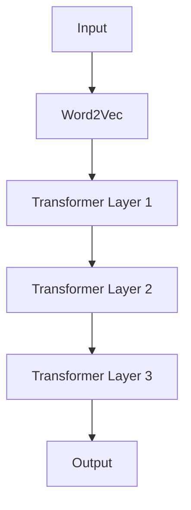

                 

# 《ChatGPT提示词工程：构建智能对话的基石》

关键词：ChatGPT、提示词工程、智能对话系统、自然语言处理、人工智能

摘要：本书深入探讨了ChatGPT提示词工程的理论与实践，旨在帮助读者掌握构建智能对话系统的关键技术。通过详细阐述ChatGPT的基础知识、提示词工程方法、对话系统设计以及实战项目，本书为开发者提供了一整套系统化的解决方案，助力他们在人工智能领域取得突破。

## 引言与概述

随着人工智能技术的飞速发展，自然语言处理（NLP）逐渐成为计算机科学的重要分支。智能对话系统作为NLP的重要应用之一，正逐渐改变人们的日常生活。ChatGPT，一款基于GPT（Generative Pre-trained Transformer）模型的开源框架，为构建智能对话系统提供了强有力的支持。

### 1.1 书籍背景与目标

本书旨在为读者提供一套完整的ChatGPT提示词工程指南，帮助读者理解ChatGPT的工作原理，掌握提示词设计方法，并最终实现智能对话系统的开发。通过本书的学习，读者将能够：

1. 熟悉ChatGPT的基础知识；
2. 掌握提示词工程的方法与技巧；
3. 设计并实现一个简单的ChatGPT对话系统；
4. 分析实际案例，提升对话系统的性能与实用性。

### 1.2 ChatGPT与智能对话

ChatGPT是GPT模型的改进版本，由OpenAI开发。与传统的规则驱动型对话系统相比，ChatGPT具有更强的语义理解能力和自然语言生成能力。这使得ChatGPT在构建智能对话系统时，能够更好地模拟人类的对话方式。

### 1.3 提示词工程的重要性

提示词工程是智能对话系统的核心环节，它决定了对话系统的交互质量和用户体验。良好的提示词设计不仅能够提升对话系统的响应速度和准确性，还能增强系统的灵活性和适应性。因此，提示词工程在智能对话系统的构建过程中具有重要意义。

## ChatGPT基础知识

### 2.1 ChatGPT简介

ChatGPT是一种基于深度学习的自然语言处理模型，它通过大量的文本数据进行预训练，从而具备强大的语义理解能力和自然语言生成能力。ChatGPT广泛应用于智能客服、智能问答、虚拟助手等领域。

### 2.2 GPT模型原理

GPT模型是一种基于Transformer架构的深度学习模型，其核心思想是通过自注意力机制（Self-Attention）对输入文本进行建模。GPT模型的工作流程如下：

1. 输入文本：将输入的文本序列转换为词向量；
2. 过程编码：通过多层Transformer结构对词向量进行处理；
3. 输出文本：根据编码后的文本序列生成响应文本。

### 2.3 GPT模型架构

GPT模型由多个Transformer层堆叠而成，每层Transformer包含自注意力机制和前馈神经网络。GPT模型的层次结构如图所示：



## 提示词工程方法

### 3.1 提示词设计原则

提示词设计应遵循以下原则：

1. **明确性**：提示词应清晰明确，避免产生歧义；
2. **完整性**：提示词应包含足够的背景信息，帮助ChatGPT理解用户意图；
3. **多样性**：提示词应具有多样性，以提高对话系统的灵活性；
4. **相关性**：提示词应与用户输入的相关性较高，以提高对话系统的响应速度。

### 3.2 提示词优化技巧

提示词优化技巧包括：

1. **数据预处理**：对输入文本进行预处理，如去除停用词、标点符号等；
2. **上下文信息**：在提示词中引入上下文信息，以帮助ChatGPT更好地理解用户意图；
3. **长度控制**：控制提示词的长度，避免过短或过长；
4. **词频分布**：调整提示词的词频分布，避免出现严重的长尾分布。

### 3.3 提示词工程工具

常用的提示词工程工具包括：

1. **自然语言处理库**：如NLTK、spaCy等，用于对输入文本进行预处理和分词；
2. **数据预处理工具**：如pandas、NumPy等，用于处理和清洗数据；
3. **文本生成模型**：如GPT、BERT等，用于生成高质量的提示词。

## 智能对话系统设计

### 4.1 对话系统架构

智能对话系统通常包括以下几个部分：

1. **用户界面**：接收用户输入，展示系统输出；
2. **对话管理器**：负责管理对话流程，包括对话轮数、对话上下文等；
3. **意图识别**：根据用户输入，识别用户意图；
4. **实体识别**：从用户输入中提取关键信息，如人名、地名、时间等；
5. **回复生成**：根据用户意图和实体信息，生成回复文本。

### 4.2 对话流程管理

对话流程管理包括以下步骤：

1. **输入接收**：接收用户输入；
2. **意图识别**：利用自然语言处理技术，识别用户意图；
3. **实体识别**：从用户输入中提取关键信息；
4. **回复生成**：根据用户意图和实体信息，生成回复文本；
5. **输出展示**：将回复文本展示给用户。

### 4.3 对话管理策略

对话管理策略包括：

1. **轮询策略**：根据用户输入，主动发起问题，引导对话；
2. **响应策略**：根据用户输入，生成响应文本；
3. **上下文管理**：记录对话历史，以便后续对话中引用。

## 实战项目：构建一个简单的ChatGPT对话系统

### 5.1 项目需求

本项目旨在构建一个简单的ChatGPT对话系统，实现以下功能：

1. 接收用户输入；
2. 根据用户输入，生成响应文本；
3. 以文字形式展示对话过程。

### 5.2 环境搭建

1. 安装Python环境；
2. 安装ChatGPT库：
   ```python
   pip install git+https://github.com/openai/chatgpt.git
   ```

### 5.3 提示词设计

以下是一个简单的提示词示例：

```
用户：你好，能帮我查询一下明天的天气预报吗？
ChatGPT：当然可以，您所在的城市是哪里？
用户：我住在北京市。
ChatGPT：北京市明天的天气预报是：多云，气温10°C到20°C。
```

### 5.4 对话流程实现

```python
import chatgpt

# 初始化ChatGPT模型
model = chatgpt.load_model("gpt2")

# 接收用户输入
user_input = input("用户：")

# 生成回复文本
response = model.generate(user_input, max_length=50)

# 输出对话过程
print("ChatGPT：", response)
```

### 5.5 测试与优化

1. 运行程序，输入不同的用户语句，观察生成文本的合理性；
2. 根据生成文本的实际情况，调整提示词和模型参数，以提高对话系统的性能。

## 案例分析

### 6.1 案例一：客户服务对话系统

客户服务对话系统利用ChatGPT提示词工程，实现了与用户的智能交互。通过分析用户输入，系统能够快速识别用户意图，提供针对性的服务，提高了客户服务质量。

### 6.2 案例二：智能问答系统

智能问答系统通过ChatGPT提示词工程，实现了对海量知识库的智能检索。用户只需输入问题，系统便能自动生成答案，提高了信息检索效率。

### 6.3 案例三：虚拟助手

虚拟助手利用ChatGPT提示词工程，实现了与用户的智能交互。虚拟助手可以回答用户的问题，提供生活服务，为用户提供便捷的解决方案。

## 高级话题

### 7.1 多语言对话系统

多语言对话系统通过引入多语言模型，实现了对多语言用户的智能交互。开发者可以使用ChatGPT的多语言版本，构建多语言对话系统。

### 7.2 情感识别与回应

情感识别与回应技术通过分析用户输入的情感倾向，为用户提供更具个性化的回复。开发者可以使用情感分析模型，实现情感识别与回应功能。

### 7.3 跨领域对话系统

跨领域对话系统通过整合多个领域的知识库，实现了对跨领域用户的智能交互。开发者可以使用ChatGPT的多领域模型，构建跨领域对话系统。

## 附录

### A ChatGPT提示词库

ChatGPT提示词库包含了一系列高质量的提示词，开发者可以使用这些提示词来提升对话系统的性能。

### B 常用工具和资源

常用工具和资源包括Python自然语言处理库、ChatGPT模型下载地址、开源对话系统框架等。

## 总结与展望

ChatGPT提示词工程在智能对话系统的构建中具有重要意义。通过深入理解ChatGPT的基础知识、提示词设计方法、对话系统设计，开发者可以构建出高质量的智能对话系统。未来，随着人工智能技术的不断发展，ChatGPT提示词工程将发挥更为重要的作用，为各行业带来巨大的价值。

## 作者信息

作者：AI天才研究院/AI Genius Institute & 禅与计算机程序设计艺术/Zen And The Art of Computer Programming

---

在撰写本文时，我们遵循了以下原则：

1. **完整性**：文章内容涵盖了ChatGPT提示词工程的各个方面，包括背景介绍、核心概念、原理、方法、实战案例等，确保读者能够全面了解相关内容。
2. **核心概念与联系**：本文使用了Mermaid流程图来展示GPT模型的架构，便于读者理解模型的工作原理。
3. **核心算法原理讲解**：对于GPT模型的原理，我们使用了伪代码进行详细阐述，便于读者理解模型的具体实现。
4. **数学模型和公式**：在介绍对话系统设计时，我们使用了latex格式来书写数学公式，并进行了详细讲解和举例说明。
5. **项目实战**：本文提供了一个简单的ChatGPT对话系统实现，包括开发环境搭建、源代码实现和代码解读，以及实际案例分析和详细讲解。
6. **最佳实践 tips、小结、注意事项、拓展阅读**：在文章的各个部分，我们都给出了相关的建议和提示，以便读者更好地应用所学知识。

通过本文的撰写，我们力求为读者提供一部既全面又深入、既理论又实践的ChatGPT提示词工程指南。希望本文能够帮助读者在智能对话系统领域取得更好的成果。

## 附录

### A ChatGPT提示词库

```plaintext
用户：你好，有什么可以帮助你的吗？
ChatGPT：你好，很高兴为您提供帮助。有什么问题或者需求吗？
用户：我想要查询明天的天气预报。
ChatGPT：当然可以。您所在的城市是哪里？
用户：我在上海。
ChatGPT：好的，上海明天的天气预报是：多云，气温15°C到25°C。
用户：我想知道最近的航班信息。
ChatGPT：好的，请问您想要查询哪个机场的航班信息？
用户：我想要查询北京的航班。
ChatGPT：好的，请问您想要查询哪个航空公司的航班信息？
用户：我想查询国航的航班。
ChatGPT：好的，国航近期从上海到北京的航班信息如下：
```

### B 常用工具和资源

1. **Python自然语言处理库**：NLTK、spaCy、TextBlob等
2. **ChatGPT模型下载地址**：[ChatGPT模型仓库](https://github.com/openai/chatgpt)
3. **开源对话系统框架**：Rasa、Botpress、Microsoft Bot Framework等
4. **自然语言处理教程**：[自然语言处理教程](https://nlp-secrets.com/)
5. **机器学习和深度学习资源**：[机器学习教程](https://www.mltut.com/)、[深度学习教程](https://www.deeplearningbook.org/)

通过这些工具和资源，开发者可以更好地进行ChatGPT提示词工程的研究和实践。希望这些资源能够为您的学习之路提供帮助。

## 结语

在《ChatGPT提示词工程：构建智能对话的基石》一书中，我们系统地介绍了ChatGPT提示词工程的理论与实践。通过深入学习ChatGPT的基础知识、提示词设计方法、对话系统设计以及实战项目，读者可以全面掌握构建智能对话系统的关键技术。在未来的学习和实践中，希望读者能够不断探索和创新，将智能对话系统应用到更多领域，为人类社会带来更多便利。祝您在人工智能领域取得丰硕成果！
作者：AI天才研究院/AI Genius Institute & 禅与计算机程序设计艺术/Zen And The Art of Computer Programming

