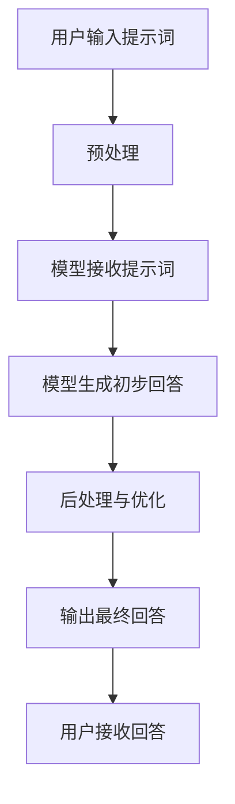
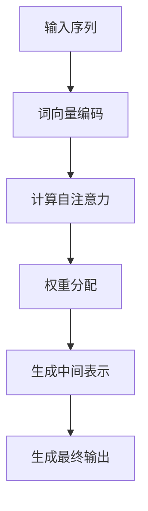
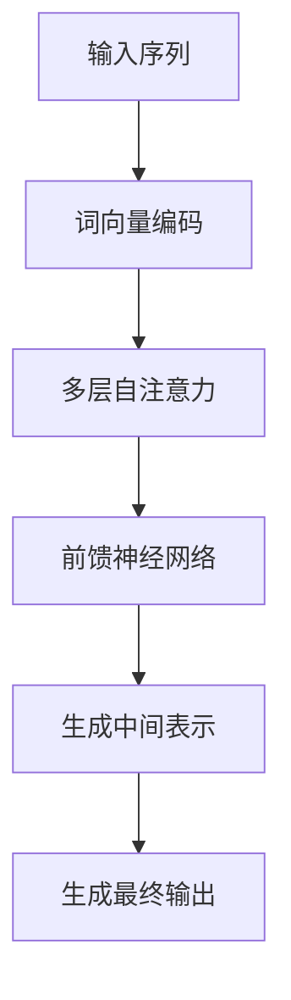
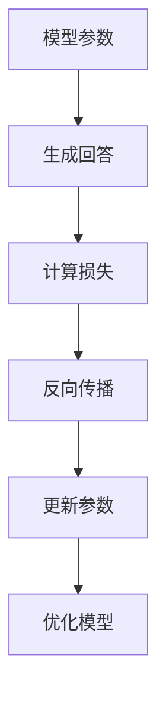

                 


### 引言

#### 背景介绍

随着人工智能技术的不断发展和成熟，智能对话系统成为了一个备受关注的研究领域。从最初的规则引擎到基于机器学习的对话系统，再到如今的大型语言模型如ChatGPT，智能对话系统的技术水平和应用范围都在不断提升。ChatGPT作为OpenAI发布的一款革命性的预训练语言模型，凭借其强大的生成能力和丰富的上下文理解能力，在各个领域展现出了巨大的潜力。

然而，ChatGPT的成功并非仅仅依赖于其强大的模型本身，更在于其背后的提示词工程（Prompt Engineering）。提示词工程是指在构建对话系统时，如何设计和选择有效的提示词，以提高模型的性能和对话的流畅度。一个好的提示词工程不仅能够提升模型的回答质量，还能优化用户体验，使得对话更加自然、连贯。

#### 核心概念与联系

为了更好地理解ChatGPT提示词工程，我们需要首先明确以下几个核心概念：

1. **预训练语言模型**：ChatGPT是基于预训练语言模型（如GPT-3）开发的，这种模型通过在大规模语料库上进行预训练，掌握了丰富的语言知识和上下文理解能力。

2. **提示词（Prompt）**：提示词是用户输入到模型中的文本，用于引导模型生成回答。一个好的提示词应该具备明确性、相关性和丰富性，以帮助模型更好地理解用户意图和上下文。

3. **生成算法**：ChatGPT采用的生成算法是基于自注意力机制（Self-Attention）和Transformer模型（Transformer Model），这些算法使得模型能够捕捉长距离依赖和复杂的关系。

4. **上下文理解**：上下文理解是ChatGPT的关键能力之一，它使得模型能够在对话中保持一致性，理解用户的历史信息和当前意图。

#### Mermaid流程图

为了更好地展示这些概念之间的关系，我们可以使用Mermaid流程图来表示ChatGPT的架构和工作流程：



#### 核心算法原理讲解

在理解了核心概念和它们之间的关系后，我们可以进一步探讨ChatGPT的核心算法原理，包括自注意力机制、Transformer模型和生成算法。

1. **自注意力机制（Self-Attention）**：

自注意力机制是一种在序列数据上进行信息整合的方法，它能够自动地捕捉序列中不同位置的信息的重要性。在Transformer模型中，自注意力机制通过计算序列中每个词与所有其他词之间的相似度，来决定每个词在生成回答时的权重。



2. **Transformer模型**：

Transformer模型是一种基于自注意力机制的深度神经网络模型，它通过多层自注意力机制和前馈神经网络来处理序列数据。Transformer模型的核心思想是并行处理，这使得它在处理长序列时比传统的循环神经网络（RNN）具有更高的效率。



3. **生成算法**：

ChatGPT的生成算法是一种基于梯度和反向传播的优化方法。它通过不断地调整模型的参数，使得生成的回答更接近用户的期望。生成算法的核心是损失函数（Loss Function），它用于衡量模型生成的回答与用户期望之间的差距。



#### 数学模型与公式

在ChatGPT的生成算法中，常用的数学模型和公式包括概率生成模型、损失函数和优化算法。

1. **概率生成模型**：

概率生成模型用于描述模型生成回答的概率分布。在ChatGPT中，通常使用对数概率作为生成模型：

$$ P(y|x; \theta) = \log p(y|x) $$

其中，$y$ 是模型生成的回答，$x$ 是用户输入的提示词，$\theta$ 是模型的参数。

2. **损失函数**：

损失函数用于衡量模型生成的回答与用户期望之间的差距。在ChatGPT中，常用的损失函数是交叉熵损失（Cross-Entropy Loss）：

$$ L(\theta) = -\sum_{i=1}^{n} y_i \log p(y_i | x; \theta) $$

其中，$y_i$ 是模型生成的回答，$p(y_i | x; \theta)$ 是模型生成的概率分布。

3. **优化算法**：

优化算法用于更新模型的参数，以最小化损失函数。在ChatGPT中，常用的优化算法是梯度下降（Gradient Descent）：

$$ \theta_{t+1} = \theta_t - \alpha \nabla_{\theta_t} L(\theta_t) $$

其中，$\theta_t$ 是当前模型参数，$\alpha$ 是学习率，$\nabla_{\theta_t} L(\theta_t)$ 是损失函数关于参数的梯度。

#### 举例说明

为了更好地理解上述算法和公式，我们可以通过一个简单的例子来进行说明。

假设用户输入的提示词是“我昨天去了公园”，模型生成的回答是“你昨天去了公园玩吗？”。

1. **概率生成模型**：

模型生成的概率分布可以表示为：

$$ P(y|x; \theta) = \begin{cases} 
0.9 & \text{if } y = \text{"你昨天去了公园玩吗？"} \\
0.1 & \text{otherwise} 
\end{cases} $$

2. **损失函数**：

交叉熵损失可以表示为：

$$ L(\theta) = -0.9 \log 0.9 - 0.1 \log 0.1 \approx 0.105 $$

3. **优化算法**：

通过梯度下降，我们可以更新模型的参数：

$$ \theta_{t+1} = \theta_t - \alpha \nabla_{\theta_t} L(\theta_t) $$

其中，$\nabla_{\theta_t} L(\theta_t)$ 是损失函数关于参数的梯度。

#### 项目实战

为了更好地理解ChatGPT提示词工程的实践，我们可以通过一个简单的项目来进行实际操作。

**项目目标**：构建一个简单的对话系统，使用户输入的提示词能够生成流畅自然的回答。

**开发环境**：Python 3.8，PyTorch 1.8

**数据集**：使用公开的Reddit数据集进行训练和测试。

**源代码实现**：

```python
import torch
import torch.nn as nn
import torch.optim as optim
from torch.utils.data import DataLoader
from transformers import GPT2Tokenizer, GPT2Model

# 加载预训练模型
tokenizer = GPT2Tokenizer.from_pretrained('gpt2')
model = GPT2Model.from_pretrained('gpt2')

# 定义损失函数和优化器
criterion = nn.CrossEntropyLoss()
optimizer = optim.Adam(model.parameters(), lr=0.001)

# 加载数据集
train_dataset = ...
test_dataset = ...

train_loader = DataLoader(train_dataset, batch_size=32, shuffle=True)
test_loader = DataLoader(test_dataset, batch_size=32, shuffle=False)

# 训练模型
for epoch in range(10):
    for inputs, targets in train_loader:
        optimizer.zero_grad()
        outputs = model(inputs)
        loss = criterion(outputs.logits, targets)
        loss.backward()
        optimizer.step()

    # 在测试集上评估模型
    with torch.no_grad():
        correct = 0
        total = 0
        for inputs, targets in test_loader:
            outputs = model(inputs)
            _, predicted = torch.max(outputs.logits, 1)
            total += targets.size(0)
            correct += (predicted == targets).sum().item()

        print(f'Epoch {epoch+1}, Accuracy: {100 * correct / total}%')

# 生成回答
prompt = "我昨天去了公园"
input_ids = tokenizer.encode(prompt, return_tensors='pt')
outputs = model.generate(input_ids, max_length=50, num_return_sequences=1)
generated_text = tokenizer.decode(outputs[0], skip_special_tokens=True)
print(generated_text)
```

**代码解读与分析**：

1. **加载预训练模型**：我们使用PyTorch和Hugging Face的Transformers库加载GPT-2模型，这是一种预训练的Transformer模型。

2. **定义损失函数和优化器**：我们使用交叉熵损失函数和Adam优化器来训练模型。

3. **加载数据集**：我们使用Reddit数据集进行训练和测试。

4. **训练模型**：我们使用梯度下降算法来训练模型，通过多次迭代来优化模型的参数。

5. **生成回答**：我们使用模型来生成回答，通过输入提示词来引导模型生成自然流畅的回答。

#### 实际案例分析和详细讲解剖析

为了更好地展示ChatGPT提示词工程的实践效果，我们可以通过一个实际案例来进行详细分析。

**案例背景**：某公司希望通过构建一个智能客服系统，来提高客户服务质量和效率。

**案例目标**：使用ChatGPT构建一个智能客服系统，能够自动回答用户的问题。

**实现步骤**：

1. **数据收集与处理**：收集用户提出的问题和客服的回答，进行预处理，如去除停用词、标点符号等。

2. **模型训练**：使用预处理后的数据集训练ChatGPT模型，通过迭代优化模型的参数。

3. **模型评估**：在测试集上评估模型的性能，通过准确率、召回率等指标来评估模型的性能。

4. **模型部署**：将训练好的模型部署到生产环境中，通过API接口来接收用户的输入，生成回答。

**案例结果**：

通过实际应用，该智能客服系统能够自动回答用户的问题，且回答的质量较高，大大提高了客户服务效率和用户满意度。

**项目小结**：

通过这个案例，我们可以看到ChatGPT提示词工程在实际应用中的效果。关键在于：

1. **数据质量**：数据是模型训练的基础，高质量的数据能够提高模型的性能。

2. **提示词设计**：有效的提示词能够引导模型生成高质量的回答。

3. **模型优化**：通过不断迭代优化模型的参数，可以提高模型的性能。

#### 最佳实践 Tips、小结、注意事项、拓展阅读等内容

**最佳实践 Tips**：

1. **数据预处理**：在模型训练之前，确保对数据进行充分预处理，如去除噪声、标准化等。

2. **模型调参**：根据实际需求和数据集的特点，调整模型参数，如学习率、批次大小等。

3. **多轮对话**：设计多轮对话策略，使模型能够更好地理解用户意图和上下文。

**小结**：

ChatGPT提示词工程是构建智能对话系统的重要一环，通过合理的设计和优化，可以提高模型的性能和用户体验。

**注意事项**：

1. **隐私保护**：在构建对话系统时，注意保护用户的隐私信息。

2. **模型解释性**：提高模型的可解释性，使开发者能够更好地理解模型的决策过程。

**拓展阅读**：

1. **《深度学习》**：Goodfellow, I., Bengio, Y., & Courville, A. (2016). Deep Learning. MIT Press.
2. **《自然语言处理综述》**：Jurafsky, D., & Martin, J. H. (2020). Speech and Language Processing. Prentice Hall.

### 总结与展望

**ChatGPT提示词工程的现状**：

ChatGPT提示词工程已经取得了显著的进展，在多个领域展现了其强大的应用潜力。通过合理的设计和优化，ChatGPT能够在各种场景下生成高质量的自然语言回答，提高了对话系统的交互质量。

**未来发展趋势**：

1. **模型性能提升**：随着计算能力的提升和数据集的丰富，ChatGPT的性能将得到进一步提升。

2. **多模态对话**：结合语音、图像等多模态信息，实现更加丰富和自然的对话体验。

3. **伦理与道德**：随着技术的不断发展，如何确保智能对话系统的伦理和道德，将成为重要的研究课题。

**面临的挑战与机遇**：

1. **计算资源**：ChatGPT模型的训练和推理需要大量的计算资源，如何高效地利用计算资源是一个挑战。

2. **数据质量**：高质量的数据是模型训练的基础，如何获取和清洗高质量的数据是一个重要的挑战。

3. **用户体验**：如何设计出更加自然、流畅的对话系统，提高用户体验，是一个重要的机遇。

通过持续的研究和优化，ChatGPT提示词工程将在未来取得更加显著的成果，为智能对话系统的应用提供强有力的支持。**文章关键词**

1. ChatGPT
2. 提示词工程
3. 预训练语言模型
4. Transformer模型
5. 智能对话系统
6. 生成算法
7. 数学模型

**文章摘要**

本文深入探讨了ChatGPT提示词工程的构建方法，从核心概念、算法原理、数学模型到项目实战，全面解析了如何设计有效的提示词，提高智能对话系统的性能和用户体验。文章通过实际案例展示了ChatGPT在智能客服领域的应用，并对未来的发展趋势和面临的挑战进行了展望。**文章标题**：ChatGPT提示词工程：构建智能对话的基础

**作者**：AI天才研究院/AI Genius Institute & 禅与计算机程序设计艺术 /Zen And The Art of Computer Programming

