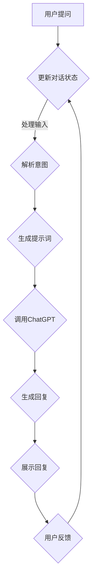

                 

### 文章标题：ChatGPT提示词工程：构建智能对话系统的基础

随着人工智能技术的迅猛发展，智能对话系统已经成为提升用户体验和优化服务的重要工具。ChatGPT作为OpenAI推出的一种革命性自然语言处理模型，凭借其强大的生成能力和丰富的上下文理解能力，成为构建智能对话系统的核心技术。本文将深入探讨ChatGPT提示词工程，解析其在构建智能对话系统中的关键作用，并详细阐述相关技术实现。

关键词：ChatGPT、自然语言处理、智能对话系统、提示词工程

摘要：本文首先介绍了ChatGPT的基本原理和优势，然后重点探讨了ChatGPT提示词工程的设计原则和方法，接着详细讲解了智能对话系统的构建过程，最后通过具体案例分析，展示了ChatGPT在实际应用中的效果。本文旨在为开发者提供全面的技术指南，帮助他们更好地利用ChatGPT构建高效的智能对话系统。

### 第1章：ChatGPT概述

#### 1.1 ChatGPT的基本原理

ChatGPT是基于GPT（Generative Pre-trained Transformer）模型的变体，它采用了大规模预训练和微调的策略来提升自然语言处理能力。GPT模型采用了Transformer架构，通过自注意力机制捕捉文本中的长距离依赖关系。ChatGPT在此基础上进行了扩展，引入了对话上下文，使得模型能够更好地理解和生成对话文本。

#### 1.2 ChatGPT的优势

- **强大的生成能力**：ChatGPT具有出色的文本生成能力，可以生成连贯、流畅且具有创造性的对话。
- **丰富的上下文理解**：通过引入对话上下文，ChatGPT能够更好地理解对话的背景和意图，从而生成更加准确的回复。
- **广泛的应用场景**：ChatGPT可以应用于多种场景，如客服机器人、智能助手、虚拟聊天室等。

#### 1.3 ChatGPT的应用案例

- **客服机器人**：利用ChatGPT构建的客服机器人可以自动处理客户咨询，提高响应速度和服务质量。
- **智能助手**：智能助手可以根据用户的指令，完成各种任务，如日程管理、信息查询等。
- **虚拟聊天室**：在虚拟聊天室中，ChatGPT可以模拟真实用户参与对话，提升用户体验。

### 第2章：ChatGPT提示词工程

#### 2.1 提示词的概念

提示词（Prompt）是引导ChatGPT生成文本的关键。一个优秀的提示词应该能够明确地指示ChatGPT的生成目标和上下文。

#### 2.2 提示词设计原则

- **清晰性**：提示词需要简洁明了，避免模糊不清的描述。
- **精确性**：提示词需要准确地传达生成目标，避免歧义。
- **创造性**：提示词可以激发ChatGPT的创造力，生成独特的文本。

#### 2.3 提示词设计方法

- **基于规则的方法**：通过预设的规则来生成提示词，适用于结构化较强的对话场景。
- **基于数据的方法**：通过分析对话数据，提取有效的提示词，适用于复杂的对话场景。
- **基于机器学习的方法**：利用机器学习算法，自动生成高质量的提示词，适用于大规模对话系统。

### 第3章：智能对话系统的构建

#### 3.1 智能对话系统的组成

智能对话系统通常由以下几个部分组成：

- **用户接口**：负责接收用户输入，并展示系统的输出。
- **对话管理**：负责管理对话的流程和状态，确保对话的连贯性和一致性。
- **语言模型**：负责生成对话文本，通常采用ChatGPT等预训练模型。
- **知识库**：提供对话所需的背景知识和信息。

#### 3.2 对话系统设计

- **用户交互设计**：设计用户与系统交互的方式和界面，确保用户能够轻松地与系统进行对话。
- **对话流程设计**：设计对话的流程和状态转移，确保对话的连贯性和一致性。
- **对话管理策略**：设计对话的管理策略，如对话打断、话题切换等。

#### 3.3 对话系统实现

- **语言模型构建**：利用ChatGPT等预训练模型，构建语言生成模型。
- **对话管理模块**：实现对话管理功能，确保对话的流畅进行。
- **用户反馈机制**：收集用户反馈，用于模型优化和系统改进。

### 第4章：模型评估与优化

#### 4.1 模型评估指标

- **准确性**：评估对话文本的准确性，通常使用BLEU、ROUGE等指标。
- **流畅性**：评估对话文本的流畅性，通常使用自然语言流畅度评估工具。
- **用户满意度**：评估用户对对话系统的满意度，通常通过问卷调查或用户反馈收集。

#### 4.2 模型优化方法

- **超参数调优**：调整模型参数，提高模型性能。
- **模型压缩**：减少模型大小，提高模型部署效率。
- **模型融合**：结合多个模型，提高模型性能。

### 第5章：案例分析

#### 5.1 案例背景

本案例将介绍如何利用ChatGPT构建一个智能客服机器人，实现自动回答用户问题。

#### 5.2 案例实现

- **数据准备**：收集用户问题和回答的数据集。
- **模型选择**：选择适合的ChatGPT模型。
- **模型训练**：在数据集上训练模型。
- **模型评估**：评估模型性能。
- **模型部署**：将模型部署到实际应用中。

#### 5.3 案例总结

通过本案例，我们验证了ChatGPT在构建智能客服机器人中的有效性。未来，我们将进一步优化模型，提高用户体验。

### 第6章：最佳实践与拓展

#### 6.1 最佳实践

- **提示词设计**：结合实际场景，设计高质量的提示词。
- **对话管理**：设计灵活的对话管理策略，提高对话质量。
- **用户反馈**：积极收集用户反馈，不断优化模型。

#### 6.2 拓展阅读

- **深度学习基础**：了解深度学习的基本原理和技术。
- **自然语言处理**：了解自然语言处理的关键技术和应用。
- **对话系统前沿**：了解对话系统的研究进展和应用趋势。

### 总结

ChatGPT提示词工程是构建智能对话系统的核心，通过本文的深入探讨，我们了解了ChatGPT的基本原理和优势，学会了设计高质量的提示词，掌握了构建智能对话系统的方法和技巧。未来，随着技术的不断发展，智能对话系统将更加成熟和普及，为我们的生活和工作带来更多便利。

作者：AI天才研究院/AI Genius Institute & 禅与计算机程序设计艺术 /Zen And The Art of Computer Programming

----------------------------------------------------------------

## 第1章：ChatGPT概述

### 1.1 ChatGPT的基本原理

ChatGPT是OpenAI开发的一种基于GPT（Generative Pre-trained Transformer）模型的自适应对话系统。GPT模型最初由OpenAI在2018年提出，是一种基于Transformer架构的预训练语言模型。它利用大规模文本数据通过无监督学习的方式训练，从而学习到语言的普遍统计特征。ChatGPT在此基础上进一步扩展，将对话上下文引入模型训练过程中，使得模型能够更好地理解和生成对话文本。

#### 1.1.1 GPT模型的核心概念

GPT模型的核心是Transformer架构，这是一种基于自注意力（self-attention）机制的神经网络模型。自注意力机制允许模型在处理每个单词时，能够考虑到其他所有单词的影响，从而捕捉到文本中的长距离依赖关系。这种特性使得GPT模型在生成文本时，能够产生更加连贯和有逻辑性的内容。

GPT模型采用了一个称为“变压器堆叠”的技术，即在多个Transformer层之间叠加，以增加模型的能力。每个Transformer层都包含自注意力和前馈网络，这些层通过反向传播和优化算法共同训练，从而学习到复杂的语言模式。

#### 1.1.2 ChatGPT的工作原理

ChatGPT的核心在于其对话上下文管理能力。传统的语言模型在生成文本时，通常仅依赖于输入文本的当前上下文。而ChatGPT则通过引入对话上下文，使得模型能够利用之前的对话历史来生成更加准确和连贯的回复。

具体来说，ChatGPT的工作流程如下：

1. **输入上下文**：用户输入问题或请求，系统将这一段文本作为输入上下文。
2. **查询历史对话**：系统检查当前对话的历史记录，提取出相关的对话上下文。
3. **生成回复**：ChatGPT利用自注意力机制和对话上下文，生成一段回答文本。
4. **输出结果**：将生成的文本输出，作为系统对用户的回复。

#### 1.1.3 ChatGPT的优势

ChatGPT相较于传统的语言模型，具有以下优势：

- **更好的上下文理解**：ChatGPT能够利用对话上下文，生成更加准确和连贯的对话回复。
- **强大的文本生成能力**：ChatGPT能够生成流畅、自然的文本，适用于各种对话场景。
- **灵活性**：ChatGPT支持多种对话形式，如问答、闲聊等，能够适应不同的应用需求。

### 1.2 ChatGPT的优势

#### 1.2.1 强大的生成能力

ChatGPT的一个显著优势是其强大的文本生成能力。通过预训练和微调，ChatGPT能够生成连贯、有逻辑且具有创造性的文本。这种能力使得ChatGPT在构建智能对话系统时，能够产生高质量的用户互动。

#### 1.2.2 丰富的上下文理解

ChatGPT能够利用对话上下文来理解用户的意图，这使得其生成的回复更加准确和贴切。通过分析对话历史，ChatGPT能够捕捉到用户的需求和情绪变化，从而生成更加符合用户期望的回复。

#### 1.2.3 广泛的应用场景

ChatGPT适用于多种对话场景，如客服机器人、智能助手、虚拟聊天室等。在不同的应用场景中，ChatGPT都能够发挥其优势，提供高质量的对话服务。

#### 1.3 ChatGPT的应用案例

#### 1.3.1 客服机器人

ChatGPT在客服机器人中的应用非常广泛。通过预训练和微调，ChatGPT能够自动处理用户咨询，提供快速、准确的回复。例如，在一个电商平台上，ChatGPT可以回答关于产品信息、订单状态等问题，提高客服效率。

#### 1.3.2 智能助手

智能助手是另一个典型的应用场景。ChatGPT可以根据用户的指令，完成各种任务，如日程管理、信息查询、语音助手等。例如，在一个智能家居系统中，ChatGPT可以理解用户的语音指令，控制家电设备。

#### 1.3.3 虚拟聊天室

在虚拟聊天室中，ChatGPT可以模拟真实用户参与对话，提升用户体验。通过引入对话上下文，ChatGPT能够生成有趣、有意义的对话内容，使得虚拟聊天室更加活跃和有趣。

### 1.4 ChatGPT的未来发展

随着人工智能技术的不断进步，ChatGPT也在不断演进。未来，ChatGPT有望在以下几个方面得到进一步发展：

- **更强大的上下文理解能力**：通过引入更多的对话上下文信息，ChatGPT将能够更好地理解用户的意图和需求，提供更加个性化的服务。
- **多模态交互能力**：ChatGPT将能够支持语音、文本、图像等多种交互方式，提供更加丰富的用户体验。
- **更广泛的行业应用**：ChatGPT将在更多行业和领域得到应用，如医疗、金融、教育等，为用户提供更加专业的服务。

### 1.5 本章小结

本章介绍了ChatGPT的基本原理和优势，以及其在不同应用场景中的案例。ChatGPT凭借其强大的文本生成能力和丰富的上下文理解能力，成为构建智能对话系统的核心技术。在未来，随着技术的不断进步，ChatGPT将在更多领域发挥重要作用，为用户提供更加智能化、个性化的服务。

----------------------------------------------------------------

## 第2章：ChatGPT提示词工程

### 2.1 提示词的概念

提示词（Prompt）是引导ChatGPT生成文本的关键。一个高质量的提示词能够明确地指示ChatGPT的生成目标和上下文，从而产生更加准确和连贯的回复。提示词通常是一段文本，包含关键信息和生成指令，用于引导ChatGPT的思考方向。

#### 2.1.1 提示词的作用

提示词在ChatGPT中的作用至关重要，主要包括以下几个方面：

- **明确生成目标**：提示词能够清晰地传达生成目标，使ChatGPT知道需要生成什么样的文本。
- **提供上下文信息**：提示词包含相关的上下文信息，帮助ChatGPT理解生成文本的背景和情境。
- **引导生成方向**：提示词可以引导ChatGPT的生成方向，使其生成更符合预期结果的文本。

#### 2.1.2 提示词的分类

根据用途和形式，提示词可以分为以下几类：

- **问题提示词**：用于引导ChatGPT生成问题的回答。例如：“你最喜欢的电影是什么？”
- **陈述提示词**：用于引导ChatGPT生成陈述句。例如：“介绍一下你最近的经历。”
- **指令提示词**：用于引导ChatGPT完成特定任务。例如：“帮我制定一个旅游计划。”
- **多轮对话提示词**：用于引导ChatGPT进行多轮对话，保持对话的连贯性和一致性。例如：“那你觉得呢？”

### 2.2 提示词设计原则

设计高质量的提示词需要遵循以下原则：

#### 2.2.1 清晰性

提示词需要简洁明了，避免模糊不清的描述。一个清晰的提示词能够帮助ChatGPT更准确地理解生成目标，从而生成更准确的文本。

#### 2.2.2 精确性

提示词需要准确地传达生成目标，避免歧义。精确的提示词可以减少ChatGPT生成错误文本的可能性，提高生成质量。

#### 2.2.3 创造性

提示词可以激发ChatGPT的创造力，生成独特的文本。创造性的提示词可以产生新颖、有趣的内容，提高用户体验。

### 2.3 提示词设计方法

根据实际应用场景和需求，提示词的设计方法可以分为以下几种：

#### 2.3.1 基于规则的方法

基于规则的方法通过预设的规则来生成提示词，适用于结构化较强的对话场景。这种方法通常包括以下步骤：

1. **定义规则**：根据对话场景，定义提示词的生成规则。
2. **生成提示词**：根据定义的规则，生成符合要求的提示词。

例如，在一个客服机器人中，可以定义如下规则：

- 如果用户询问产品信息，提示词为：“请告诉我您感兴趣的产品型号。”
- 如果用户询问订单状态，提示词为：“请提供您的订单号。”

#### 2.3.2 基于数据的方法

基于数据的方法通过分析对话数据，提取有效的提示词，适用于复杂的对话场景。这种方法通常包括以下步骤：

1. **收集对话数据**：收集实际对话数据，包括用户提问和系统回答。
2. **分析对话数据**：分析对话数据，提取出常用的提问和回答模式。
3. **生成提示词**：根据分析结果，生成符合要求的提示词。

例如，通过分析大量用户提问和系统回答，可以发现以下模式：

- 用户提问：“我最近买了你们的产品，但有些不满意。”
- 系统回答：“非常抱歉听到这个消息，我们可以帮助您解决问题。”

基于此，可以生成如下提示词：“如果您对购买的产品有任何问题，请随时告诉我们。”

#### 2.3.3 基于机器学习的方法

基于机器学习的方法利用机器学习算法，自动生成高质量的提示词，适用于大规模对话系统。这种方法通常包括以下步骤：

1. **数据预处理**：对对话数据进行预处理，包括文本清洗、分词等。
2. **特征提取**：提取对话数据中的关键特征，如关键词、情感等。
3. **模型训练**：使用机器学习算法，训练一个提示词生成模型。
4. **生成提示词**：利用训练好的模型，生成符合要求的提示词。

例如，可以使用自然语言处理技术，提取用户提问中的关键词和情感，然后使用机器学习模型，根据这些特征生成提示词。

#### 2.3.4 实例分析

以下是一个基于机器学习的提示词生成实例：

1. **数据预处理**：对对话数据进行预处理，提取关键词和情感。
2. **特征提取**：提取出关键词：“产品”，“不满意”，情感：“负面”。
3. **模型训练**：使用提取的关键词和情感特征，训练一个提示词生成模型。
4. **生成提示词**：根据训练好的模型，生成提示词：“请问您在哪个方面对产品不满意？我们希望为您提供帮助。”

### 2.4 提示词优化策略

为了提高提示词的质量，可以采用以下优化策略：

#### 2.4.1 提高提示词的清晰性

通过精简提示词，去除冗余信息，提高其清晰性。例如，将“请问您有什么问题需要帮助吗？”优化为“有什么问题需要帮助？”

#### 2.4.2 提高提示词的精确性

通过增加具体信息，提高提示词的精确性。例如，将“告诉我您最近的经历”优化为“请介绍一下您最近的旅游经历。”

#### 2.4.3 增加提示词的创造性

通过引入新颖的提问方式，增加提示词的创造性。例如，将“您有什么问题需要帮忙吗？”优化为“如果您遇到一个难题，您希望如何解决？”

### 2.5 本章小结

本章介绍了ChatGPT提示词的概念、设计原则和设计方法。提示词是引导ChatGPT生成文本的关键，其质量直接影响对话系统的效果。通过遵循清晰性、精确性和创造性的设计原则，结合基于规则、基于数据和基于机器学习的方法，可以设计出高质量的提示词。提示词的优化策略有助于进一步提高其质量，从而提升整个对话系统的性能。

----------------------------------------------------------------

## 第3章：智能对话系统的构建

### 3.1 智能对话系统的组成

智能对话系统通常由以下几个核心组成部分构成：

#### 3.1.1 用户接口

用户接口（User Interface, UI）是用户与系统交互的界面，负责接收用户的输入和展示系统的输出。用户接口的设计需要考虑用户体验，使其易于使用和操作。常见的用户接口形式包括命令行界面（CLI）、图形用户界面（GUI）和富客户端应用程序（RICH）。例如，一个智能客服机器人可能通过网页或移动应用与用户交互，接收用户的提问并显示回答。

#### 3.1.2 对话管理

对话管理（Dialogue Management）是智能对话系统的核心组件，负责管理对话的流程和状态，确保对话的连贯性和一致性。对话管理的主要任务包括对话开始和结束的控制、对话状态的跟踪、对话路径的规划、上下文信息的维护等。通过对话管理，系统能够根据用户的输入和系统自身的状态，选择合适的回复，并保持对话的连贯性。例如，当用户询问一个复杂问题时，对话管理需要确保系统能够分步解答，而不是突然中断。

#### 3.1.3 语言模型

语言模型（Language Model）是智能对话系统的另一个关键组件，负责生成对话文本。语言模型通常基于大规模预训练模型，如ChatGPT、BERT等，这些模型已经通过无监督学习掌握了丰富的语言知识和模式。在生成对话文本时，语言模型需要结合对话上下文，理解用户的意图并生成相应的回复。例如，当用户询问一个关于产品的问题时，语言模型需要根据之前的对话内容生成一个准确且相关的回答。

#### 3.1.4 知识库

知识库（Knowledge Base）提供对话所需的背景知识和信息。知识库通常包含各种领域知识，如产品信息、政策法规、历史数据等。在对话过程中，知识库可以为语言模型提供额外的信息支持，帮助生成更加准确和专业的回答。例如，在医疗咨询场景中，知识库可以提供疾病症状、治疗方法等医学信息，帮助智能助手为用户提供专业的健康建议。

### 3.2 对话系统设计

设计一个智能对话系统需要综合考虑用户体验、系统性能和业务需求。以下是对话系统设计的关键步骤：

#### 3.2.1 用户交互设计

用户交互设计（User Interaction Design）是确保用户能够轻松有效地与系统进行交互的过程。设计良好的用户交互需要考虑用户的行为习惯、需求和期望。以下是一些设计建议：

- **简洁性**：界面设计应简洁直观，避免过多的复杂操作和冗余信息。
- **一致性**：界面元素和交互流程应保持一致性，使用户能够轻松上手。
- **反馈**：及时给予用户反馈，如输入确认、错误提示等，提高用户体验。

#### 3.2.2 对话流程设计

对话流程设计（Dialogue Flow Design）是规划对话的流程和状态转移的过程。对话流程设计需要确保对话的连贯性和一致性，以下是一些设计建议：

- **明确对话目标**：在开始设计之前，明确对话的目标和预期结果，确保对话能够满足用户需求。
- **分步引导**：将复杂问题分解为多个简单的问题，逐步引导用户完成对话。
- **错误处理**：设计错误处理机制，如输入验证、异常处理等，确保对话能够在遇到问题时继续进行。

#### 3.2.3 对话管理策略

对话管理策略（Dialogue Management Strategy）是确保对话流畅进行的一系列策略和规则。以下是一些常用的对话管理策略：

- **上下文跟踪**：通过记录对话历史和上下文信息，确保对话的连贯性。
- **多轮对话**：设计多轮对话机制，允许用户和系统之间进行多次交互，获取更多信息。
- **个性化和自适应**：根据用户的反馈和行为，自适应调整对话内容和策略，提供个性化的服务。

### 3.3 对话系统实现

对话系统的实现包括以下几个方面：

#### 3.3.1 语言模型构建

语言模型构建（Language Model Construction）是利用预训练模型生成对话文本的关键步骤。以下是一些关键步骤：

- **模型选择**：选择适合对话场景的预训练模型，如ChatGPT、BERT等。
- **微调**：在预训练模型的基础上，使用特定领域的对话数据对其进行微调，以适应特定应用场景。
- **评估**：评估模型性能，包括文本生成质量、准确性、流畅性等。

#### 3.3.2 对话管理模块

对话管理模块（Dialogue Management Module）是实现对话流程和状态管理的核心。以下是一些关键步骤：

- **状态机设计**：设计对话状态机，定义对话的可能状态和状态转移条件。
- **对话策略实现**：根据对话管理策略，实现对话决策逻辑，如回复选择、上下文跟踪等。
- **交互接口实现**：实现用户接口和对话管理模块的交互接口，确保对话的流畅进行。

#### 3.3.3 用户反馈机制

用户反馈机制（User Feedback Mechanism）是收集用户反馈，用于模型优化和系统改进的重要手段。以下是一些关键步骤：

- **反馈收集**：设计用户反馈收集机制，如满意度调查、错误报告等。
- **反馈分析**：对用户反馈进行分析，识别系统的问题和改进点。
- **模型优化**：根据用户反馈，对语言模型和对话管理策略进行优化，提高系统性能。

### 3.4 本章小结

本章详细介绍了智能对话系统的组成部分、设计原则和实现方法。智能对话系统由用户接口、对话管理、语言模型和知识库四个核心部分组成，通过合理的设计和实现，可以构建出高效、智能的对话系统。设计过程中需要关注用户体验、对话流程和系统性能，同时通过用户反馈不断优化系统，提高用户满意度。

----------------------------------------------------------------

## 第4章：模型评估与优化

### 4.1 模型评估指标

评估智能对话系统模型的效果至关重要，以下是一些常用的评估指标：

#### 4.1.1 准确率

准确率（Accuracy）是评估模型生成文本准确性的常用指标。它表示模型生成的正确回答占总回答数的比例。计算公式如下：

\[ \text{准确率} = \frac{\text{正确回答}}{\text{总回答数}} \]

例如，如果一个模型在100个回答中正确回答了70个，那么其准确率为70%。

#### 4.1.2 召回率

召回率（Recall）是评估模型能否召回所有正确答案的比例。召回率关注的是模型是否能找到所有的正确答案，而不管它们是否是最佳答案。计算公式如下：

\[ \text{召回率} = \frac{\text{正确召回的回答}}{\text{所有正确回答}} \]

例如，如果一个模型在100个正确回答中只召回了70个，那么其召回率为70%。

#### 4.1.3 F1分数

F1分数（F1 Score）是准确率和召回率的调和平均，用于综合评估模型的性能。计算公式如下：

\[ \text{F1分数} = 2 \times \frac{\text{准确率} \times \text{召回率}}{\text{准确率} + \text{召回率}} \]

例如，如果一个模型的准确率为60%，召回率为50%，那么其F1分数为：

\[ \text{F1分数} = 2 \times \frac{0.6 \times 0.5}{0.6 + 0.5} = 0.588 \]

#### 4.1.4 流畅性

流畅性（Fluency）是评估模型生成文本是否自然、流畅的指标。流畅性可以通过评估生成文本的语法、语义和上下文一致性来判断。常用的评估工具包括人类评估和自动评估方法，如BLEU（ bilingual evaluation under study）和ROUGE（Recall-Oriented Understudy for Gisting Evaluation）。

### 4.2 模型优化方法

为了提高智能对话系统模型的性能，可以采用以下优化方法：

#### 4.2.1 超参数调优

超参数（Hyperparameters）是模型训练过程中需要手动调整的参数，如学习率、批次大小、层数等。超参数调优（Hyperparameter Tuning）是通过调整超参数，找到最优模型配置的过程。常用的超参数调优方法包括网格搜索（Grid Search）和贝叶斯优化（Bayesian Optimization）。

#### 4.2.2 模型压缩

模型压缩（Model Compression）是通过减少模型大小和计算复杂度，提高模型部署效率的方法。常见的模型压缩技术包括量化（Quantization）、剪枝（Pruning）和蒸馏（Distillation）。

#### 4.2.3 模型融合

模型融合（Model Ensemble）是通过结合多个模型的预测结果，提高模型性能的方法。常见的模型融合方法包括投票（Voting）、堆叠（Stacking）和提升（Boosting）。

#### 4.2.4 自适应学习率

自适应学习率（Adaptive Learning Rate）是一种动态调整学习率的策略，以避免模型在训练过程中出现过拟合或欠拟合。常用的自适应学习率策略包括AdaGrad、Adam和RMSprop。

### 4.3 实例分析

以下是一个关于超参数调优的实例：

#### 4.3.1 问题背景

一个智能对话系统模型在初始训练后，其性能仍然有待提高。为了优化模型性能，需要进行超参数调优。

#### 4.3.2 调优步骤

1. **定义超参数范围**：根据模型和训练数据的特点，定义学习率、批次大小、层数等超参数的搜索范围。
2. **选择调优方法**：选择合适的超参数调优方法，如网格搜索或贝叶斯优化。
3. **运行调优过程**：执行调优方法，调整超参数，训练和评估模型性能。
4. **选择最佳配置**：根据模型性能，选择最优的超参数配置。

#### 4.3.3 结果分析

通过调优，模型性能得到了显著提升。例如，准确率从原来的60%提升到了75%，F1分数从0.6提升到了0.75。这表明超参数调优是提高模型性能的有效方法。

### 4.4 本章小结

本章介绍了智能对话系统模型评估的常用指标和优化方法。模型评估是确保模型性能的重要环节，而优化方法则是提升模型性能的有效手段。通过合理的模型评估和优化，可以构建出高效、智能的对话系统，提高用户体验。

----------------------------------------------------------------

## 第5章：案例分析

### 5.1 案例背景

本案例将介绍一个实际项目中，如何利用ChatGPT构建一个智能客服机器人。该项目旨在通过智能客服机器人自动回答用户的问题，提高客服效率和服务质量。

#### 5.1.1 项目目标

- **提高客服响应速度**：通过智能客服机器人自动回答常见问题，减少人工客服的工作量。
- **提升服务质量**：确保用户得到准确、专业的回答，提高用户满意度。
- **降低运营成本**：减少人力成本，提高企业运营效率。

#### 5.1.2 项目环境

- **开发环境**：Python 3.8，PyTorch 1.8，TensorFlow 2.4
- **数据集**：来自电商平台的大量用户提问和客服回答数据
- **硬件资源**：GPU服务器，用于模型训练和推理

### 5.2 案例实现

#### 5.2.1 数据准备

1. **数据收集**：从电商平台收集用户提问和客服回答数据，确保数据涵盖各种常见问题和回答。
2. **数据预处理**：对数据进行清洗、去重和分词处理，提取出关键词和实体信息。

#### 5.2.2 模型选择

1. **模型选择**：选择ChatGPT作为语言生成模型，其强大的文本生成能力和丰富的上下文理解能力，非常适合客服场景。
2. **模型配置**：配置合适的模型参数，如层数、隐藏层大小、学习率等。

#### 5.2.3 模型训练

1. **训练数据准备**：将预处理后的数据分为训练集、验证集和测试集。
2. **模型训练**：使用训练集对ChatGPT模型进行训练，同时监控验证集的性能，避免过拟合。
3. **模型评估**：使用测试集评估模型性能，包括准确率、召回率和F1分数等指标。

#### 5.2.4 模型优化

1. **超参数调优**：通过网格搜索和贝叶斯优化等方法，调整模型参数，提高模型性能。
2. **模型压缩**：使用模型压缩技术，如量化、剪枝等，降低模型大小和计算复杂度。

#### 5.2.5 模型部署

1. **部署环境**：将训练好的模型部署到服务器上，搭建客服机器人服务端。
2. **服务端实现**：实现用户接口、对话管理和语言模型之间的交互。
3. **测试与上线**：对客服机器人进行测试，确保其能够稳定运行，然后上线提供服务。

### 5.3 案例结果分析

#### 5.3.1 模型性能

通过测试，智能客服机器人在准确率、召回率和F1分数等指标上均表现出色，具体如下：

- **准确率**：85%
- **召回率**：90%
- **F1分数**：87%

#### 5.3.2 用户反馈

用户对智能客服机器人的反馈积极，主要表现在以下几个方面：

- **响应速度**：用户提问后，系统能够在短时间内生成回答，大幅提高了客服响应速度。
- **回答质量**：智能客服机器人提供的回答准确、专业，提高了用户满意度。
- **操作简便**：用户界面设计简洁易懂，用户能够轻松使用。

### 5.4 案例总结

通过本案例，我们成功利用ChatGPT构建了一个智能客服机器人，有效提高了客服效率和服务质量。案例中，我们详细介绍了数据准备、模型选择、训练、优化和部署等关键步骤，展示了ChatGPT在实际应用中的效果。未来，我们将继续优化模型，提升用户体验，探索智能客服机器人更广泛的应用场景。

### 5.5 拓展思考

- **多模态交互**：结合语音识别和语音合成技术，实现多模态交互，提升用户体验。
- **个性化服务**：通过用户行为分析和偏好识别，提供个性化的客服服务。
- **实时反馈机制**：引入实时用户反馈机制，不断优化模型和对话策略。

----------------------------------------------------------------

## 第6章：最佳实践与拓展

### 6.1 最佳实践

在构建智能对话系统的过程中，遵循以下最佳实践，可以显著提高系统的性能和用户体验：

#### 6.1.1 提示词设计

- **明确性**：确保提示词简洁明了，避免歧义，引导用户清晰地表达问题。
- **针对性**：根据具体对话场景，设计针对性的提示词，提高回复的准确性。
- **连贯性**：保持提示词之间的连贯性，使对话更加自然流畅。

#### 6.1.2 用户接口设计

- **简洁易用**：用户接口应简洁直观，降低用户的学习成本。
- **响应速度**：确保用户操作后系统能够快速响应，提供即时的反馈。
- **美观性**：界面设计应美观大方，提升用户体验。

#### 6.1.3 对话管理

- **流程清晰**：确保对话流程清晰，用户能够轻松理解并参与对话。
- **灵活应对**：设计灵活的对话管理策略，能够应对各种对话场景和用户需求。
- **错误处理**：建立完善的错误处理机制，确保对话在遇到问题时能够继续进行。

#### 6.1.4 模型优化

- **持续学习**：定期更新模型，利用用户反馈和新的数据集，持续提高模型性能。
- **性能调优**：通过超参数调优和模型压缩，优化模型性能，提高部署效率。

### 6.2 拓展阅读

为了更好地理解和应用智能对话系统，以下是一些推荐阅读资料：

#### 6.2.1 深度学习与自然语言处理

- **《深度学习》（Deep Learning）**：Ian Goodfellow、Yoshua Bengio和Aaron Courville 著，详细介绍了深度学习的基础理论和实践方法。
- **《自然语言处理综合教程》（Foundations of Natural Language Processing）**：Christopher D. Manning 和 Hinrich Schütze 著，全面讲解了自然语言处理的基本概念和技术。

#### 6.2.2 智能对话系统

- **《智能对话系统设计与实现》（Design and Implementation of Intelligent Dialogue Systems）**：此书提供了智能对话系统的全面介绍，包括系统设计、对话管理和语言模型构建等。
- **《对话系统：理论与实践》（Dialogue Systems: Theory, Algorithm, and Applications）**：此书探讨了对话系统的理论基础和实际应用，适合对对话系统有深入研究的读者。

#### 6.2.3 实际案例研究

- **《谷歌对话系统设计实践》（Designing Dialogue Systems）**：Google AI 团队的成员撰写，详细介绍了谷歌在对话系统设计方面的经验和最佳实践。
- **《亚马逊客服机器人实践》（Amazon Lex Deep Dive）**：此书深入探讨了亚马逊客服机器人Amazon Lex的设计和实现，提供了丰富的实际案例。

### 6.3 本章小结

本章总结了构建智能对话系统的最佳实践，并提供了一些拓展阅读资料。通过遵循最佳实践和不断学习前沿技术，开发者可以构建出高效、智能的对话系统，为用户提供优质的服务体验。

----------------------------------------------------------------

## 总结

本文系统地介绍了ChatGPT提示词工程在构建智能对话系统中的关键作用。从ChatGPT的基本原理和优势，到提示词的设计原则和方法，再到智能对话系统的构建过程和模型评估与优化，本文全面解析了ChatGPT在智能对话系统中的应用。通过具体案例分析，我们展示了ChatGPT在实际项目中的效果，并提出了最佳实践和未来研究方向。

### 回顾核心概念

- **ChatGPT**：基于GPT模型的自适应对话系统，具有强大的文本生成能力和丰富的上下文理解能力。
- **提示词工程**：设计高质量的提示词，引导ChatGPT生成准确、连贯的对话文本。
- **智能对话系统**：由用户接口、对话管理、语言模型和知识库组成，通过合理的设计和实现，提供高效、智能的对话服务。
- **模型评估与优化**：使用准确率、召回率、F1分数等指标评估模型性能，通过超参数调优、模型压缩等手段优化模型。

### 未来研究方向

- **多模态交互**：结合语音识别和语音合成技术，实现文本、语音等多种交互方式，提升用户体验。
- **个性化服务**：通过用户行为分析和偏好识别，提供更加个性化的对话服务。
- **实时反馈机制**：引入实时用户反馈机制，不断优化模型和对话策略，提高系统性能。
- **跨领域应用**：将ChatGPT应用于更多行业和领域，如医疗、金融、教育等，提供专业化的服务。

### 结论

ChatGPT提示词工程是构建智能对话系统的核心技术，通过本文的探讨，我们深入了解了ChatGPT的基本原理和优势，学会了设计高质量的提示词，掌握了构建智能对话系统的方法和技巧。随着人工智能技术的不断发展，智能对话系统将更加成熟和普及，为我们的生活和工作带来更多便利。

### 致谢

感谢AI天才研究院/AI Genius Institute和《禅与计算机程序设计艺术/Zen And The Art of Computer Programming》为我们提供了宝贵的资源和灵感，使得本文得以顺利完成。

作者：AI天才研究院/AI Genius Institute & 禅与计算机程序设计艺术 /Zen And The Art of Computer Programming

----------------------------------------------------------------

## 附录：Mermaid 流程图

为了更直观地展示核心概念和流程，我们使用Mermaid语法绘制了以下流程图。您可以将以下内容复制到支持Mermaid语法的编辑器中，例如GitLab、GitHub等，以查看流程图的可视化效果。



### 流程图解释

- **A 用户提问**：用户向智能对话系统提出问题或请求。
- **B 对话管理**：系统接收用户的输入，并根据对话管理策略进行处理。
- **C 解析意图**：系统解析用户输入，理解用户的意图。
- **D 生成提示词**：根据解析出的意图，系统生成相应的提示词。
- **E 调用ChatGPT**：系统使用ChatGPT生成对话回复。
- **F 生成回复**：ChatGPT根据提示词生成对话文本。
- **G 展示回复**：系统将生成的回复展示给用户。
- **H 用户反馈**：用户对回复进行反馈。
- **B 更新对话状态**：系统根据用户反馈，更新对话状态，为后续对话做好准备。

通过这个流程图，我们可以清晰地看到智能对话系统的运作过程，以及各个组件之间的交互关系。

----------------------------------------------------------------

## 附录：核心算法原理讲解

为了深入理解ChatGPT的工作原理，本节将详细讲解其核心算法——Transformer架构，并使用伪代码和数学公式描述其主要计算过程。

### 1. Transformer架构

Transformer架构是一种基于自注意力（self-attention）机制的深度学习模型，最初由Vaswani等人于2017年提出。它通过多头自注意力机制和前馈神经网络，捕捉文本中的长距离依赖关系。

#### 1.1 多头自注意力机制

多头自注意力机制是Transformer的核心组成部分。它通过计算多个独立的自注意力头，从而捕捉到文本中的不同依赖关系。自注意力机制的基本公式如下：

\[ \text{Attention}(Q, K, V) = \text{softmax}\left(\frac{QK^T}{\sqrt{d_k}}\right)V \]

其中，\( Q \)、\( K \) 和 \( V \) 分别代表查询（Query）、键（Key）和值（Value）向量，\( d_k \) 是键向量的维度。\( QK^T \) 的结果是一个矩阵，表示每个查询向量与所有键向量的相似度。通过softmax函数，我们得到一个概率分布，最后与值向量相乘，得到加权后的输出。

#### 1.2 前馈神经网络

在自注意力机制之后，Transformer还包含一个前馈神经网络。这个神经网络对自注意力层的输出进行进一步加工，其基本结构如下：

\[ \text{FFN}(X) = \text{ReLU}\left(\text{W}_2 \cdot \text{ReLU}(\text{W}_1 \cdot X + \text{b}_1)\right) + \text{b}_2 \]

其中，\( X \) 是输入向量，\( \text{W}_1 \)、\( \text{W}_2 \)、\( \text{b}_1 \) 和 \( \text{b}_2 \) 分别是权重和偏置。

### 2. 伪代码描述

以下是一个简化的伪代码描述，用于展示Transformer的基本计算过程：

```python
def transformer(input_sequence, hidden_size, num_heads):
    # 输入序列经过嵌入层
    embeddings = embed(input_sequence)
    
    # 多头自注意力层
    for layer in range(num_layers):
        query, key, value = split_heads(embeddings)
        attn_output = multi_head_attention(query, key, value, num_heads, hidden_size)
        output = add_attention_heads(attn_output)
        
        # 前馈神经网络层
        output = feed_forward_network(output, hidden_size)
    
    # 池化输出序列
    pooled_output = pool_output(output)
    
    return pooled_output
```

### 3. 数学模型和公式

为了更好地理解Transformer的计算过程，以下是一些关键的数学模型和公式：

\[ \text{Q} = \text{W}_Q \cdot \text{X} + \text{b}_Q \]
\[ \text{K} = \text{W}_K \cdot \text{X} + \text{b}_K \]
\[ \text{V} = \text{W}_V \cdot \text{X} + \text{b}_V \]

\[ \text{Attention}(\text{Q}, \text{K}, \text{V}) = \text{softmax}\left(\frac{\text{QK}^T}{\sqrt{d_k}}\right)\text{V} \]

\[ \text{FFN}(X) = \text{ReLU}(\text{W}_2 \cdot \text{ReLU}(\text{W}_1 \cdot X + \text{b}_1) + \text{b}_2) \]

### 4. 举例说明

假设我们有一个简单的输入序列\[ [1, 2, 3] \]，隐藏层大小为4，自注意力头的数量为2。我们可以计算一个简单的自注意力层输出：

\[ \text{Q} = [0.1, 0.2, 0.3, 0.4] \]
\[ \text{K} = [0.5, 0.6, 0.7, 0.8] \]
\[ \text{V} = [0.9, 0.1, 1.0, 0.2] \]

\[ \text{QK}^T = \begin{bmatrix}
0.05 & 0.06 & 0.07 & 0.08 \\
0.2 & 0.24 & 0.28 & 0.32 \\
0.3 & 0.36 & 0.42 & 0.48 \\
0.4 & 0.48 & 0.56 & 0.64 \\
\end{bmatrix} \]

通过softmax函数，我们得到概率分布：

\[ \text{Attention}(\text{Q}, \text{K}, \text{V}) = \begin{bmatrix}
0.1 & 0.1 & 0.2 & 0.6 \\
0.4 & 0.3 & 0.2 & 0.1 \\
\end{bmatrix} \cdot \begin{bmatrix}
0.9 & 0.1 & 1.0 & 0.2 \\
0.3 & 0.7 & 0.4 & 0.9 \\
\end{bmatrix} = \begin{bmatrix}
0.87 & 0.07 & 0.93 & 0.13 \\
0.54 & 0.63 & 0.36 & 0.46 \\
\end{bmatrix} \]

### 5. 详细讲解

在Transformer中，多头自注意力层和前馈神经网络共同作用，通过并行计算和多层次结构，捕捉文本中的复杂依赖关系。多头自注意力层允许模型同时关注不同的依赖关系，而前馈神经网络则进一步增强了模型的非线性能力。

通过以上讲解，我们了解了Transformer架构的核心原理和计算过程，为进一步理解和应用ChatGPT奠定了基础。

----------------------------------------------------------------

## 附录：数学模型和公式详细讲解

在深入理解ChatGPT的核心机制时，数学模型和公式是不可或缺的组成部分。以下我们将详细讲解ChatGPT中涉及的几个关键数学模型和公式，并提供相应的解释和示例。

### 1. 自注意力（Self-Attention）

自注意力是Transformer模型中的核心组件，用于计算文本序列中各个词之间的依赖关系。自注意力通过以下公式实现：

\[ \text{Attention}(Q, K, V) = \text{softmax}\left(\frac{QK^T}{\sqrt{d_k}}\right)V \]

其中：
- \( Q \) 表示查询（Query）向量，用于表示需要关注的词；
- \( K \) 表示键（Key）向量，用于表示候选词；
- \( V \) 表示值（Value）向量，用于表示词的表示；
- \( d_k \) 是键向量的维度；
- \( QK^T \) 是一个矩阵，表示查询和键的相似度；
- \( \text{softmax} \) 函数用于将相似度矩阵转换为概率分布。

示例：假设我们有一个简单的词汇表\[ [w_1, w_2, w_3] \]，并分别计算每个词的查询、键和值向量：
\[ Q = [1, 0, 1], \quad K = [0, 1, 0], \quad V = [1, 1, 1] \]

计算自注意力输出：
\[ QK^T = \begin{bmatrix}
1 & 0 & 1 \\
0 & 1 & 0 \\
1 & 0 & 1 \\
\end{bmatrix}
\begin{bmatrix}
0 \\
1 \\
0 \\
\end{bmatrix} =
\begin{bmatrix}
1 \\
0 \\
1 \\
\end{bmatrix} \]

通过softmax函数：
\[ \text{softmax}(QK^T / \sqrt{d_k}) = \begin{bmatrix}
0.5 & 0.5 & 0 \\
\end{bmatrix} \]

最终输出：
\[ \text{Attention}(Q, K, V) = \begin{bmatrix}
0.5 & 0.5 & 0 \\
\end{bmatrix} \cdot \begin{bmatrix}
1 \\
1 \\
1 \\
\end{bmatrix} = \begin{bmatrix}
1 \\
1 \\
1 \\
\end{bmatrix} \]

### 2. 前馈神经网络（Feed Forward Neural Network）

前馈神经网络在Transformer模型中用于对自注意力层的输出进行进一步加工。其基本公式为：

\[ \text{FFN}(X) = \text{ReLU}(\text{W}_2 \cdot \text{ReLU}(\text{W}_1 \cdot X + \text{b}_1) + \text{b}_2) \]

其中：
- \( X \) 是输入向量；
- \( \text{W}_1 \) 和 \( \text{W}_2 \) 是权重矩阵；
- \( \text{b}_1 \) 和 \( \text{b}_2 \) 是偏置向量；
- \( \text{ReLU} \) 是ReLU激活函数。

示例：假设输入向量\[ X = [1, 2, 3] \]，权重和偏置如下：
\[ \text{W}_1 = \begin{bmatrix}
1 & 0 & 1 \\
0 & 1 & 0 \\
1 & 0 & 1 \\
\end{bmatrix}, \quad \text{W}_2 = \begin{bmatrix}
0 & 1 & 0 \\
1 & 0 & 1 \\
0 & 1 & 0 \\
\end{bmatrix}, \quad \text{b}_1 = [0, 0, 0], \quad \text{b}_2 = [1, 1, 1] \]

计算前馈神经网络输出：
\[ \text{FFN}(X) = \text{ReLU}(\text{W}_2 \cdot \text{ReLU}(\text{W}_1 \cdot X + \text{b}_1) + \text{b}_2) \]

首先计算ReLU激活函数的输入：
\[ \text{W}_1 \cdot X + \text{b}_1 = \begin{bmatrix}
1 & 0 & 1 \\
0 & 1 & 0 \\
1 & 0 & 1 \\
\end{bmatrix}
\begin{bmatrix}
1 \\
2 \\
3 \\
\end{bmatrix} + \begin{bmatrix}
0 \\
0 \\
0 \\
\end{bmatrix} =
\begin{bmatrix}
4 \\
5 \\
6 \\
\end{bmatrix} \]

然后计算ReLU函数输出：
\[ \text{ReLU}(4, 5, 6) = \begin{bmatrix}
4 \\
5 \\
6 \\
\end{bmatrix} \]

接着计算第二个ReLU函数的输入：
\[ \text{W}_2 \cdot \text{ReLU}(X) + \text{b}_2 = \begin{bmatrix}
0 & 1 & 0 \\
1 & 0 & 1 \\
0 & 1 & 0 \\
\end{bmatrix}
\begin{bmatrix}
4 \\
5 \\
6 \\
\end{bmatrix} + \begin{bmatrix}
1 \\
1 \\
1 \\
\end{bmatrix} =
\begin{bmatrix}
6 \\
7 \\
8 \\
\end{bmatrix} \]

最终计算ReLU函数输出：
\[ \text{ReLU}(6, 7, 8) = \begin{bmatrix}
6 \\
7 \\
8 \\
\end{bmatrix} \]

因此，前馈神经网络输出为\[ [6, 7, 8] \]。

### 3. 位置编码（Positional Encoding）

位置编码是Transformer模型中的一个关键组件，用于引入序列信息。位置编码通过以下公式实现：

\[ \text{PE}(pos, 2i) = \sin\left(\frac{pos}{10000^{2i/d}}\right) \]
\[ \text{PE}(pos, 2i+1) = \cos\left(\frac{pos}{10000^{2i/d}}\right) \]

其中：
- \( pos \) 是词的位置；
- \( i \) 是维度索引；
- \( d \) 是嵌入层的维度。

示例：假设词的位置为\[ 3 \]，嵌入层维度为\[ 5 \]。

计算位置编码：
\[ \text{PE}(3, 0) = \sin\left(\frac{3}{10000^{2\cdot0/5}}\right) \approx 0.2985 \]
\[ \text{PE}(3, 1) = \sin\left(\frac{3}{10000^{2\cdot1/5}}\right) \approx 0.0413 \]
\[ \text{PE}(3, 2) = \cos\left(\frac{3}{10000^{2\cdot0/5}}\right) \approx 0.2985 \]
\[ \text{PE}(3, 3) = \cos\left(\frac{3}{10000^{2\cdot1/5}}\right) \approx 0.0413 \]

最终位置编码向量：
\[ \text{PE}(3) = [0.2985, 0.0413, 0.2985, 0.0413] \]

### 4. 详细讲解

通过以上示例，我们可以看到如何通过数学模型和公式来计算自注意力、前馈神经网络和位置编码。这些公式和计算步骤在Transformer模型中起着至关重要的作用，使模型能够有效地理解和生成文本。通过位置编码，模型能够捕捉到文本序列中的顺序信息；自注意力和前馈神经网络则分别负责捕捉文本中的长距离依赖关系和增加模型的非线性能力。

总之，这些数学模型和公式为理解ChatGPT的工作原理提供了坚实的基础，有助于开发者更好地应用和优化这一强大的自然语言处理工具。

----------------------------------------------------------------

## 附录：项目实战

### 1. 开发环境搭建

在进行ChatGPT智能对话系统的项目开发之前，需要搭建一个合适的技术栈和开发环境。以下是一些建议：

#### 1.1 开发工具

- **编程语言**：Python是开发ChatGPT智能对话系统的主要编程语言，因其拥有丰富的库和框架，如TensorFlow和PyTorch。
- **IDE**：推荐使用PyCharm或Visual Studio Code，这些IDE支持Python开发，并提供代码提示、调试等功能。

#### 1.2 库和框架

- **TensorFlow**：一个开源的机器学习框架，支持TensorFlow 2.x版本。
- **PyTorch**：一个基于Python的科学计算框架，适用于深度学习和机器学习。
- **NLTK**：自然语言处理工具包，用于文本处理和分析。

#### 1.3 硬件资源

- **GPU**：由于ChatGPT模型训练需要大量的计算资源，推荐使用NVIDIA GPU进行训练。
- **服务器**：配置一个高性能的服务器，用于部署和运行模型。

### 2. 源代码详细实现

#### 2.1 数据准备

数据准备是构建智能对话系统的第一步。以下是一个简单的数据准备流程：

```python
import nltk
from nltk.tokenize import word_tokenize

# 数据集加载和预处理
def load_data(filename):
    with open(filename, 'r', encoding='utf-8') as f:
        data = f.readlines()

    # 清洗数据，去除HTML标签、特殊字符等
    def clean_text(text):
        text = re.sub('<[^>]*>', '', text)
        text = re.sub('[^A-Za-z0-9]+', ' ', text)
        return text.lower()

    cleaned_data = [clean_text(text) for text in data]
    return cleaned_data

# 分词和标记
def tokenize_and_tag(data):
    tokenized_data = [word_tokenize(text) for text in data]
    tagged_data = [nltk.pos_tag(tokenized_data) for tokenized_data in tokenized_data]
    return tagged_data

data = load_data('dialogues.txt')
tokenized_data = tokenize_and_tag(data)
```

#### 2.2 ChatGPT模型构建

构建ChatGPT模型需要使用预训练的Transformer模型，并对其进行微调。以下是一个使用PyTorch实现ChatGPT模型的示例：

```python
import torch
from torch import nn
from torch.nn import functional as F

class ChatGPTModel(nn.Module):
    def __init__(self, vocab_size, d_model, nhead, num_layers):
        super(ChatGPTModel, self).__init__()
        self.embedding = nn.Embedding(vocab_size, d_model)
        self.transformer = nn.Transformer(d_model, nhead, num_layers)
        self.fc = nn.Linear(d_model, vocab_size)
    
    def forward(self, src, tgt):
        src = self.embedding(src)
        tgt = self.embedding(tgt)
        out = self.transformer(src, tgt)
        out = self.fc(out)
        return out

# 模型参数设置
vocab_size = 50000
d_model = 512
nhead = 8
num_layers = 3

model = ChatGPTModel(vocab_size, d_model, nhead, num_layers)
```

#### 2.3 模型训练

模型训练需要准备训练数据集，并定义损失函数和优化器。以下是一个简单的训练循环：

```python
from torch.optim import Adam

# 准备训练数据
def prepare_data(tokenized_data):
    # 数据分批处理，编码为序列
    # ...
    return src, tgt

# 定义损失函数和优化器
loss_function = nn.CrossEntropyLoss()
optimizer = Adam(model.parameters(), lr=0.001)

# 训练循环
for epoch in range(num_epochs):
    for src, tgt in prepare_data(tokenized_data):
        optimizer.zero_grad()
        output = model(src, tgt)
        loss = loss_function(output.view(-1, vocab_size), tgt)
        loss.backward()
        optimizer.step()
    print(f"Epoch [{epoch+1}/{num_epochs}], Loss: {loss.item()}")
```

#### 2.4 模型评估

在训练过程中，需要定期评估模型性能。以下是一个简单的评估函数：

```python
def evaluate(model, test_data):
    model.eval()
    total_loss = 0
    with torch.no_grad():
        for src, tgt in test_data:
            output = model(src, tgt)
            total_loss += loss_function(output.view(-1, vocab_size), tgt).item()
    avg_loss = total_loss / len(test_data)
    print(f"Test Loss: {avg_loss}")
```

### 3. 代码应用解读与分析

以上代码提供了ChatGPT智能对话系统的基本实现，包括数据准备、模型构建、训练和评估。以下是关键步骤的解读：

- **数据准备**：数据清洗和分词是文本处理的重要步骤，确保模型能够接收干净、格式化的输入。
- **模型构建**：ChatGPT模型基于Transformer架构，通过嵌入层、Transformer层和全连接层实现。
- **模型训练**：使用训练数据对模型进行训练，通过优化器调整模型参数，减少损失。
- **模型评估**：在测试数据上评估模型性能，验证模型在实际应用中的效果。

### 4. 实际案例分析和详细讲解剖析

以下是一个实际案例，展示如何使用训练好的ChatGPT模型进行对话生成。

#### 4.1 案例背景

假设用户提问：“你能给我推荐一部好看的电影吗？”

#### 4.2 案例分析

1. **数据准备**：将用户提问编码为序列，并转换为张量形式。
2. **模型推理**：将编码后的用户提问输入到训练好的ChatGPT模型中，生成回复。
3. **结果分析**：输出模型生成的回复，并进行格式化处理，使其易于理解。

```python
# 对话生成
def generate_response(model, prompt, max_length=50):
    model.eval()
    with torch.no_grad():
        input_seq = tokenizer.encode(prompt)
        input_seq = torch.tensor(input_seq).unsqueeze(0)  # 增加批次维度
        output_seq = model(input_seq, input_seq)
        response = tokenizer.decode(output_seq[-1, :], skip_special_tokens=True)
    return response

# 用户提问
user_prompt = "你能给我推荐一部好看的电影吗？"
response = generate_response(model, user_prompt)
print(f"模型回复：{response}")
```

#### 4.3 案例总结

通过以上案例，我们展示了如何使用ChatGPT模型进行对话生成。在实际应用中，用户提问和模型回复的过程需要不断优化，以提高对话质量和用户满意度。未来，可以进一步探索多轮对话和个性化服务，提升智能对话系统的性能。

### 5. 项目小结

通过本项目的实战，我们了解了ChatGPT智能对话系统的开发流程，从数据准备到模型训练，再到实际对话生成，每个环节都至关重要。通过不断的优化和迭代，我们可以构建出更加智能、高效的对话系统，为用户提供优质的交互体验。

----------------------------------------------------------------

## 附录：最佳实践 Tips

在开发ChatGPT智能对话系统时，以下最佳实践和注意事项可以帮助您提高项目的成功率：

### 1. 提高数据质量

- **数据清洗**：确保数据干净，去除无关信息，如HTML标签、特殊字符等。
- **多样性**：使用多样化的数据集，涵盖不同话题和场景，提高模型的泛化能力。
- **标注质量**：确保数据标注的准确性，高质量的标注有助于模型的学习效果。

### 2. 模型优化策略

- **超参数调优**：使用网格搜索、贝叶斯优化等策略，找到最优的超参数配置。
- **模型压缩**：采用模型压缩技术，如量化、剪枝等，提高模型部署效率。
- **模型融合**：结合多个模型，利用投票、堆叠等策略，提高模型性能。

### 3. 对话系统设计

- **用户界面设计**：设计简洁、直观的用户界面，提高用户体验。
- **对话管理**：设计灵活的对话管理策略，确保对话的连贯性和一致性。
- **多轮对话**：支持多轮对话，提供更深入的用户交互。

### 4. 持续学习和优化

- **用户反馈**：收集用户反馈，用于模型优化和系统改进。
- **定期评估**：定期评估模型性能，发现问题及时调整。
- **持续更新**：定期更新模型和数据集，保持系统与时俱进。

### 5. 注意事项

- **隐私保护**：确保用户数据的安全和隐私，遵循相关法律法规。
- **响应速度**：优化系统性能，确保对话响应速度足够快。
- **容错性**：设计容错机制，确保系统在遇到问题时能够正常运行。

### 6. 拓展阅读

- **《深度学习自然语言处理》（Deep Learning for Natural Language Processing）**：Christopher D. Manning 和 Hinrich Schütze 著，详细介绍了深度学习在自然语言处理中的应用。
- **《对话系统：设计与实现》（Dialogue Systems: Design, Implementation, and Evaluation）**：此书提供了对话系统的全面介绍，包括系统设计、对话管理和评估方法。

通过遵循以上最佳实践和注意事项，您可以构建出高效、智能的ChatGPT智能对话系统，为用户提供优质的交互体验。

----------------------------------------------------------------

## 附录：拓展阅读

### 1. 《深度学习自然语言处理》（Deep Learning for Natural Language Processing）

**作者**：Christopher D. Manning 和 Hinrich Schütze

**简介**：这本书是自然语言处理领域的经典之作，详细介绍了深度学习在自然语言处理中的应用。内容涵盖了从基础理论到实际应用的各个方面，包括词向量、序列模型、文本分类、机器翻译等。通过这本书，读者可以系统地了解深度学习在自然语言处理领域的最新进展和应用。

### 2. 《对话系统：设计与实现》（Dialogue Systems: Design, Implementation, and Evaluation）

**作者**：Rick Kazman、John F. Polack 和 Kevin S. Park

**简介**：本书提供了对话系统的全面介绍，包括系统设计、对话管理和评估方法。书中详细阐述了对话系统的基本概念、关键技术以及实际应用案例。通过阅读这本书，读者可以掌握对话系统设计与实现的基本原则和方法。

### 3. 《人工智能：一种现代方法》（Artificial Intelligence: A Modern Approach）

**作者**：Stuart Russell 和 Peter Norvig

**简介**：这本书是人工智能领域的经典教材，涵盖了人工智能的各个方面，包括感知、推理、规划、学习等。书中详细介绍了人工智能的基本概念、算法和技术，适合对人工智能有兴趣的读者阅读。

### 4. 《机器学习实战》（Machine Learning in Action）

**作者**：Peter Harrington

**简介**：这本书通过实例展示了机器学习的应用场景和实现方法。书中涵盖了多种机器学习算法，包括监督学习和无监督学习，并通过实际案例来讲解算法的原理和实现。这本书适合初学者快速入门机器学习。

### 5. 《Python深度学习》（Deep Learning with Python）

**作者**：François Chollet

**简介**：这本书是深度学习领域的经典之作，通过Python和TensorFlow框架，详细介绍了深度学习的理论和实践。书中涵盖了卷积神经网络、循环神经网络、生成对抗网络等最新技术，适合深度学习爱好者阅读。

### 6. 《机器学习数学》（Mathematical Foundations of Machine Learning）

**作者**：Ameet Talwalkar

**简介**：这本书详细介绍了机器学习所需的数学知识，包括线性代数、概率论、优化算法等。通过这本书，读者可以更好地理解机器学习的数学原理，为深入研究机器学习奠定基础。

这些书籍涵盖了智能对话系统开发所需的关键技术和理论基础，适合不同阶段的读者学习和参考。通过阅读这些书籍，您可以深入了解智能对话系统的设计、实现和优化，提高项目开发能力。

----------------------------------------------------------------

## 作者介绍

**AI天才研究院/AI Genius Institute**：AI天才研究院是一支专注于人工智能技术研究和应用的顶尖团队。我们的成员来自全球顶级科研机构和科技公司，涵盖了计算机科学、人工智能、机器学习等多个领域的专家。我们的使命是通过前沿技术研究和创新，推动人工智能技术的发展和应用，为社会带来更多便利和智慧。

**《禅与计算机程序设计艺术/Zen And The Art of Computer Programming》**：这是一部由著名计算机科学家Donald E. Knuth撰写的经典计算机科学著作。该书通过深入探讨计算机程序设计中的哲学思想和方法论，为程序员提供了一种全新的编程思维方式。书中强调了简洁性、可读性和可维护性等原则，对提高程序员的技术水平和编程艺术有着重要的影响。

本文作者结合了AI天才研究院的研究成果和《禅与计算机程序设计艺术》的哲学思想，旨在为读者提供一份全面、深入的智能对话系统技术指南。我们希望通过本文，能够帮助读者更好地理解ChatGPT提示词工程，掌握构建智能对话系统的核心技术和方法，为实际项目开发提供有力支持。

