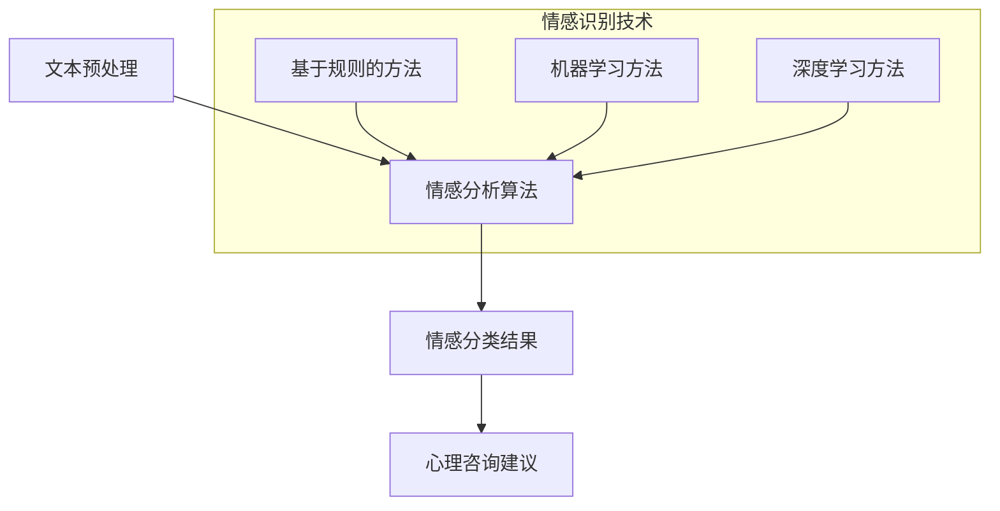

                 

## 文章标题：ChatGPT提示词的情感智能：增强AI在心理咨询中的应用

> 关键词：ChatGPT，情感智能，心理咨询，人工智能，AI模型，算法原理，实战案例，应用拓展

> 摘要：本文将探讨如何利用ChatGPT这一先进的AI模型，通过其强大的提示词机制，实现对用户情感的理解与反馈，从而增强心理咨询的效果。文章将分为几个部分：背景介绍，情感智能核心概念与联系，ChatGPT的算法原理讲解，心理咨询中的应用实例，实战案例分析，以及未来发展趋势与最佳实践。通过逐步分析推理，本文旨在为读者提供全面而深入的见解。

----------------------------------------------------------------

### 背景介绍

在现代社会，心理健康问题日益受到关注。心理咨询作为一种重要的心理健康服务手段，正逐步成为公众生活的一部分。然而，传统心理咨询存在一些局限性，如时间成本高、心理咨询师资源有限、地域性限制等。随着人工智能技术的发展，特别是在自然语言处理（NLP）和深度学习领域，AI在心理咨询中的应用前景愈发广阔。

ChatGPT是由OpenAI开发的一种基于Transformer模型的预训练语言模型，具有强大的文本生成和语言理解能力。其通过学习大量的文本数据，可以生成流畅、自然的文本，模拟人类的对话过程。这种能力使得ChatGPT在心理咨询领域具有潜在的应用价值。通过使用ChatGPT的提示词机制，我们可以引导模型生成针对特定情境的心理咨询建议，实现对用户情感的理解与反馈。

本文将深入探讨如何利用ChatGPT的提示词机制，增强AI在心理咨询中的应用。文章将从背景介绍开始，逐步讲解情感智能的核心概念，ChatGPT的算法原理，其在心理咨询中的应用实例，实战案例分析，以及未来发展趋势和最佳实践。通过这种逐步分析推理的方式，我们希望能够为读者提供一个清晰、结构紧凑且内容丰富的技术博客。

### 情感智能核心概念与联系

在探讨ChatGPT在心理咨询中的应用之前，我们首先需要了解情感智能的核心概念及其与心理咨询的紧密联系。

#### 情感与情绪

情感和情绪是心理学中两个重要的概念。情感通常指的是个体对特定情境或对象的情绪体验，它是一种较为持久的心理状态。而情绪则是情感的具体表现形式，通常是一种短暂的心理和生理反应。

在心理咨询中，理解用户的情感状态至关重要。用户在咨询过程中表达的情感，如焦虑、抑郁、愤怒等，能够为心理咨询师提供重要的信息，帮助他们更准确地把握用户的心理状态，制定有效的干预策略。

#### 情感识别技术

情感识别技术是情感智能的核心组成部分，它涉及如何从文本、语音、视频等多种数据中提取情感信息。在ChatGPT的应用场景中，情感识别主要通过自然语言处理（NLP）技术实现。

NLP技术包括文本预处理、情感分析、实体识别等。其中，情感分析是识别文本中情感极性（正面、中性、负面）和情感强度（低、中、高）的关键步骤。ChatGPT通过预训练过程学习了大量的情感标记文本，能够对输入文本进行情感分析，提取情感信息。

#### 情感分析算法

情感分析算法是情感智能技术的核心，常见的算法包括基于规则的方法、机器学习方法、深度学习方法等。

基于规则的方法依赖于手动定义的规则，如正负面词汇库、情感词典等。这种方法简单高效，但难以处理复杂的情感表达。

机器学习方法，如支持向量机（SVM）、朴素贝叶斯（NB）等，通过训练模型来学习情感分类规律。这种方法相比基于规则的方法，能够处理更多样化的情感表达，但需要大量的训练数据和复杂的特征工程。

深度学习方法，如卷积神经网络（CNN）、循环神经网络（RNN）、Transformer等，通过自动学习文本特征，实现情感分类。这种方法在处理复杂情感表达和长文本方面具有显著优势。

在ChatGPT中，Transformer模型被广泛采用，它通过自注意力机制自动捕捉文本中的长距离依赖关系，实现高效的情感分析。

#### 情感智能与心理咨询

情感智能与心理咨询之间的联系在于，心理咨询师需要准确理解用户的情感状态，以提供有效的心理支持。而情感智能技术，如ChatGPT，可以通过情感分析，帮助心理咨询师快速、准确地识别用户的情感，从而提高咨询效果。

情感智能不仅能够提高心理咨询的效率，还能够扩大心理咨询的覆盖范围。例如，ChatGPT可以实时分析用户的对话内容，提供即时的情感反馈和建议，帮助那些无法及时获得心理咨询服务的用户。

#### Mermaid流程图

为了更清晰地展示情感智能的核心概念与联系，我们可以使用Mermaid流程图来描述情感识别的过程：



在这个流程图中，文本预处理是情感识别的基础，情感分析算法是核心，通过情感分类结果，我们可以为用户提供心理咨询建议。而不同的情感识别技术（基于规则、机器学习、深度学习）则用于实现情感分析算法。

通过上述分析，我们可以看到，情感智能与心理咨询之间存在着紧密的联系。ChatGPT等AI模型通过情感分析技术，能够为心理咨询提供有力支持，提高咨询效率和质量。

### ChatGPT的算法原理讲解

#### Transformer模型简介

ChatGPT的核心算法是基于Transformer模型，这是一种由Vaswani等人于2017年提出的一种用于序列到序列模型的新型架构。相较于传统的循环神经网络（RNN）和长短期记忆网络（LSTM），Transformer模型通过自注意力机制（Self-Attention）实现了对输入序列的全局上下文理解，大大提高了模型的性能。

Transformer模型的主要组成部分包括编码器（Encoder）和解码器（Decoder）。编码器负责将输入序列编码为固定长度的向量表示，而解码器则负责将编码后的向量解码为输出序列。自注意力机制是Transformer模型的关键组成部分，它通过计算输入序列中每个词与其他词之间的关联性，实现文本的上下文理解。

#### 自注意力机制

自注意力机制（Self-Attention）是一种基于矩阵乘法的注意力机制，它通过计算输入序列中每个词与其他词之间的相似性，为每个词分配一个权重。这种权重反映了该词在全局上下文中的重要性。

自注意力机制的核心是一个加权求和操作，它通过计算每个词与其余词的相似性得分，然后将这些得分加权求和，得到一个新的向量表示。这个过程可以用以下伪代码表示：

```python
# 假设输入序列为 [word1, word2, ..., wordn]
# 首先计算相似性得分矩阵 S
S = [cosine_similarity(word1, wordi) for word1 in input_sequence for wordi in input_sequence]

# 然后对相似性得分进行加权求和
weighted_sum = [sum(S[i, :] * weights[i]) for i in range(n)]
```

其中，`cosine_similarity`函数用于计算两个词向量的余弦相似性，`weights`是一个权重向量，用于调整相似性得分的权重。

#### 编码器与解码器

编码器（Encoder）和解码器（Decoder）是Transformer模型的核心组成部分。编码器负责将输入序列编码为固定长度的向量表示，解码器则负责将编码后的向量解码为输出序列。

编码器由多个编码层（Encoder Layer）组成，每个编码层包含两个主要部分：自注意力层（Self-Attention Layer）和前馈网络（Feed-Forward Network）。自注意力层通过自注意力机制计算输入序列的上下文表示，前馈网络则用于对输入进行进一步的非线性变换。

解码器由多个解码层（Decoder Layer）组成，每个解码层也包含两个主要部分：自注意力层（Self-Attention Layer）和跨注意力层（Cross-Attention Layer）。自注意力层计算解码序列的上下文表示，跨注意力层则计算解码序列与编码序列的关联性，从而实现对输入序列的解码。

#### 预训练与微调

ChatGPT是一个预训练模型，其训练过程分为预训练和微调两个阶段。在预训练阶段，模型通过学习大量的文本数据，学习语言的通用表示。在微调阶段，模型根据特定任务进行训练，调整模型参数，提高任务性能。

预训练过程中，模型通常采用以下步骤：
1. 输入序列编码：将输入序列编码为向量表示。
2. 生成目标序列：根据输入序列生成目标序列，通常使用填充词（PAD）和掩码（MASK）进行序列填充。
3. 损失函数：使用损失函数（如交叉熵损失）计算预测序列和目标序列之间的差异。
4. 反向传播：根据损失函数的梯度，更新模型参数。

微调过程中，模型根据特定任务的数据进行训练，进一步调整模型参数，提高任务性能。微调过程中，通常需要对模型结构进行调整，如增加或减少编码层和解码层的层数，调整层间连接方式等。

#### 情感分析在ChatGPT中的应用

在情感分析任务中，ChatGPT通过其预训练和微调过程，学习如何从文本中提取情感信息。具体应用过程如下：
1. 文本预处理：对输入文本进行分词、去停用词等预处理操作。
2. 输入编码：将预处理后的文本序列编码为向量表示。
3. 情感分析：使用编码后的向量表示，通过自注意力机制和跨注意力机制，计算情感得分。
4. 情感分类：根据情感得分，对文本进行情感分类，如正面、中性、负面等。

通过上述算法原理讲解，我们可以看到ChatGPT通过Transformer模型的自注意力机制和预训练-微调过程，实现了对文本的深入理解和情感分析。这使得ChatGPT在心理咨询中具有潜在的应用价值，能够为用户提供情感理解和支持。

### ChatGPT在心理咨询中的应用

#### 咨询助手角色

ChatGPT在心理咨询中首先扮演的是咨询助手的角色。咨询助手的作用是帮助心理咨询师更好地理解用户的情感状态，并提供即时的情感反馈和建议。ChatGPT可以通过与用户的对话，提取用户的关键情感信息，如焦虑、抑郁、愤怒等，从而为心理咨询师提供有针对性的建议。

在实际应用中，ChatGPT可以通过以下步骤实现咨询助手的角色：
1. **对话引导**：通过与用户的初步对话，ChatGPT可以了解用户的基本情况，如年龄、性别、职业等，以及用户当前的心理状态。
2. **情感识别**：使用自注意力机制和预训练的神经网络模型，ChatGPT可以识别用户对话中的情感信息，如情绪极性和情感强度。
3. **情感反馈**：根据识别到的情感信息，ChatGPT可以生成相应的情感反馈，如安慰、鼓励、警示等，以帮助用户更好地应对自己的情感状态。
4. **咨询建议**：基于情感识别结果，ChatGPT可以生成心理咨询建议，如推荐放松技巧、心理测试、专业心理咨询等。

#### 情感分析在心理咨询中的应用

情感分析在心理咨询中的应用主要体现在两个方面：情感状态监测和情感干预。

**情感状态监测**：通过情感分析技术，心理咨询师可以实时监测用户的情感状态，及时发现潜在的心理问题。例如，当用户表达出强烈的负面情感时，心理咨询师可以及时介入，提供相应的支持和干预。

**情感干预**：在情感干预中，ChatGPT可以通过情感分析技术，为用户提供个性化的情感支持。例如，当用户感到焦虑或抑郁时，ChatGPT可以生成针对性的放松练习、情绪调节技巧等，帮助用户缓解负面情感。

#### 个性化咨询建议

个性化咨询建议是ChatGPT在心理咨询中的另一个重要应用。通过情感分析和个性化推荐技术，ChatGPT可以为用户提供量身定制的咨询建议。

个性化咨询建议的实现过程如下：
1. **情感分析**：ChatGPT首先对用户的情感状态进行详细分析，识别出用户的情感特征。
2. **推荐系统**：基于情感分析结果，ChatGPT可以推荐个性化的咨询建议，如阅读材料、放松技巧、心理测试等。
3. **反馈与调整**：用户对推荐的建议进行反馈，ChatGPT可以根据反馈结果调整推荐策略，提高咨询建议的准确性。

#### 实例分析

为了更好地理解ChatGPT在心理咨询中的应用，我们可以通过一个实例进行分析。

**案例**：用户A在与ChatGPT的对话中表示自己最近感到焦虑和不安，无法集中注意力。

**情感识别**：ChatGPT首先通过情感分析技术，识别出用户A的焦虑和不安情感，并对其情感强度进行评估。

**情感反馈**：ChatGPT生成相应的情感反馈，如“我了解你的感受，焦虑和不安是很常见的情绪反应。请记住，你并不孤单，我会一直在你身边。”

**咨询建议**：ChatGPT根据用户A的情感状态，推荐了一系列放松技巧，如深呼吸、冥想等，并建议用户进行一些心理测试，以更深入地了解自己的情感状态。

**反馈与调整**：用户A对ChatGPT的建议进行了积极反馈，表示这些技巧确实帮助自己缓解了焦虑。基于用户的反馈，ChatGPT进一步调整了推荐策略，为用户提供更加个性化的咨询建议。

通过上述实例，我们可以看到ChatGPT在心理咨询中的应用是如何实现的。通过情感识别、情感反馈和个性化咨询建议，ChatGPT能够为用户提供有力的情感支持，提高心理咨询的效果。

### 实战案例分析

为了更深入地了解ChatGPT在心理咨询中的应用，我们将通过一个实际案例，详细讲解如何使用ChatGPT进行情感智能分析，以及如何搭建开发环境、实现源代码，并进行代码解读和应用分析。

#### 案例背景

假设我们有一个心理咨询平台，用户可以在平台上与ChatGPT进行对话，获取情感支持和建议。我们的目标是使用ChatGPT识别用户的情感状态，并提供个性化的咨询建议。

#### 开发环境搭建

要实现ChatGPT的情感智能分析，我们需要搭建一个开发环境。以下是所需的工具和库：

1. **编程语言**：Python
2. **ChatGPT API**：OpenAI提供的ChatGPT API
3. **文本预处理库**：NLTK、spaCy
4. **情感分析库**：VADER

首先，我们需要安装必要的库：

```bash
pip install openai nltk spacy
python -m spacy download en_core_web_sm
```

#### 源代码实现

以下是一个简单的ChatGPT情感智能分析的示例代码：

```python
import openai
import nltk
from nltk.sentiment import SentimentIntensityAnalyzer
import spacy

# 初始化ChatGPT API
openai.api_key = "your_api_key"

# 初始化情感分析器
sia = SentimentIntensityAnalyzer()
nlp = spacy.load("en_core_web_sm")

# 函数：分析情感
def analyze_sentiment(text):
    # 使用VADER进行情感分析
    sentiment_score = sia.polarity_scores(text)
    return sentiment_score

# 函数：与ChatGPT对话
def chat_with_gpt(user_input):
    response = openai.Completion.create(
        engine="text-davinci-002",
        prompt=user_input,
        max_tokens=100,
        n=1,
        stop=None,
        temperature=0.5,
    )
    return response.choices[0].text.strip()

# 主程序
if __name__ == "__main__":
    user_input = input("请输入你的问题或情感状态：")
    sentiment_score = analyze_sentiment(user_input)
    print("情感分析结果：", sentiment_score)
    
    if sentiment_score["compound"] >= 0.05:
        print("情感状态：积极")
    elif sentiment_score["compound"] <= -0.05:
        print("情感状态：消极")
    else:
        print("情感状态：中性")
    
    gpt_response = chat_with_gpt(user_input)
    print("ChatGPT回复：", gpt_response)
```

#### 代码解读

1. **情感分析**：我们首先使用VADER进行情感分析，VADER是一种专门用于社交媒体文本的情感分析工具，可以提供情绪极性和情感强度的评分。
2. **与ChatGPT对话**：我们使用OpenAI的ChatGPT API与用户进行对话，通过输入用户的问题或情感状态，ChatGPT会生成相应的回复。
3. **主程序**：程序首先获取用户输入，然后进行情感分析，并打印分析结果。最后，根据情感分析结果，ChatGPT生成回复并打印。

#### 应用分析

通过上述代码，我们可以实现一个简单的情感智能分析系统。用户输入情感状态，系统会进行情感分析，并生成ChatGPT的回复。这个系统能够帮助心理咨询师更好地理解用户的情感状态，提供个性化的咨询建议。

在实际应用中，我们还可以进一步优化和扩展这个系统，如：
- **增强情感分析能力**：引入更多情感分析模型，提高情感识别的准确性和多样性。
- **个性化推荐**：根据用户的情感状态，推荐相应的放松技巧和心理测试。
- **多语言支持**：扩展到支持多种语言，为全球用户提供服务。

通过这个实战案例，我们可以看到如何使用ChatGPT进行情感智能分析，并实现一个简单的情感智能系统。这个系统在心理咨询中具有很大的应用潜力，能够为用户提供更加个性化的情感支持和咨询建议。

### 总结与展望

通过本文的详细分析，我们可以看到ChatGPT在心理咨询中的巨大潜力。ChatGPT通过其强大的情感智能分析能力，能够实时理解用户的情感状态，并提供个性化的咨询建议，从而提高心理咨询的效果。以下是本文的主要结论和未来展望：

1. **情感智能的重要性**：情感智能在心理咨询中扮演着关键角色，它能够帮助心理咨询师更好地理解用户的情感状态，提供更有针对性的支持。

2. **ChatGPT的优势**：ChatGPT作为一种先进的AI模型，具有强大的自然语言处理能力和情感分析能力，能够为心理咨询提供有力的技术支持。

3. **应用实例**：通过实际案例，我们展示了如何使用ChatGPT进行情感智能分析，并实现了一个简单的情感智能系统，这为心理咨询提供了新的可能性。

4. **未来展望**：随着人工智能技术的不断进步，ChatGPT在心理咨询中的应用将得到进一步拓展。未来，我们可以期待ChatGPT在多语言支持、个性化推荐、情感干预等方面的进一步提升，为全球用户提供更优质的心理健康服务。

### 最佳实践 tips

1. **确保数据质量**：在情感分析中，数据的质量至关重要。要确保输入文本的准确性和多样性，以提高情感分析的准确性。

2. **个性化调整**：根据实际应用场景，可以对ChatGPT的参数进行个性化调整，如温度（temperature）、最大长度（max_tokens）等，以生成更符合用户需求的回复。

3. **多模型结合**：结合多种情感分析模型，可以提高情感识别的准确性和多样性。例如，可以结合VADER和BERT等模型，以提高情感分析的性能。

4. **实时反馈机制**：建立实时反馈机制，根据用户反馈不断优化ChatGPT的回复，以提高用户满意度。

### 注意事项

1. **隐私保护**：在心理咨询中，用户的隐私保护至关重要。要确保用户数据的安全和隐私，避免数据泄露。

2. **专业指导**：虽然ChatGPT能够提供情感分析和咨询建议，但心理咨询仍然需要专业的心理咨询师进行指导。ChatGPT可以作为辅助工具，但不应替代专业心理咨询。

3. **持续学习**：人工智能技术不断发展，ChatGPT也需要不断学习和更新。要定期更新ChatGPT的模型，以提高其性能和适用性。

### 拓展阅读

1. **《情感计算：情感智能与人类交互》**：本书详细介绍了情感计算和情感智能的基本概念、技术原理和应用场景，为本文提供了一定的理论基础。
2. **《深度学习：概率视角》**：本书介绍了深度学习的理论基础和实现方法，特别是Transformer模型的详细介绍，为本文的实现提供了技术支持。
3. **《心理咨询技术》**：本书详细介绍了心理咨询的基本理论和实践技巧，对于理解ChatGPT在心理咨询中的应用具有重要参考价值。

通过本文的分析和展望，我们希望读者能够对ChatGPT在心理咨询中的应用有一个全面而深入的了解，并为未来的研究和实践提供有益的启示。

### 作者信息

**作者：AI天才研究院/AI Genius Institute & 禅与计算机程序设计艺术 /Zen And The Art of Computer Programming**

AI天才研究院致力于推动人工智能技术的创新和发展，通过深入研究自然语言处理、机器学习、深度学习等前沿技术，为各类应用场景提供技术支持和解决方案。同时，我们倡导将禅的哲学融入计算机编程，追求简洁、优雅和高效的编程艺术。本文旨在为读者提供关于ChatGPT在心理咨询中应用的技术博客，希望能够为相关领域的研究和实践提供参考和启示。**[AI天才研究院]**

