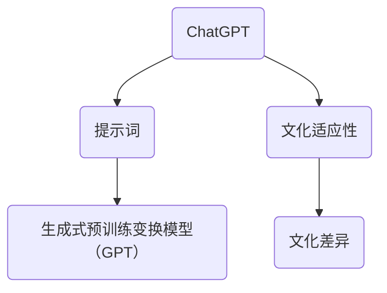

                 


### 第一步：文章标题、关键词和摘要

首先，我们需要确定文章的标题、关键词和摘要。

**文章标题**：《ChatGPT提示词的文化适应性研究》

**关键词**：ChatGPT，提示词，文化适应性，语言模型，人工智能

**摘要**：
本文旨在研究ChatGPT提示词在不同文化背景下的适应性。首先，我们介绍了ChatGPT的基本概念和工作原理，接着探讨了提示词在ChatGPT中的作用和重要性。随后，分析了文化多样性的概念和不同文化对ChatGPT提示词的影响。通过实际案例，我们展示了文化适应性的重要性，并提出了提高ChatGPT提示词文化适应性的策略。最后，我们对未来研究方向进行了展望。

---

### 第二步：文章格式

在文章格式方面，我们将使用Markdown格式进行撰写。以下是一个Markdown格式的示例：

```markdown
# 文章标题

关键词：ChatGPT，提示词，文化适应性，语言模型，人工智能

摘要：
本文旨在研究ChatGPT提示词在不同文化背景下的适应性...

## 引言

### 1.1 研究背景

- 人工智能的发展与普及
- ChatGPT的崛起与广泛应用
- 文化适应性研究的重要性

### 1.2 研究目的

- 探讨ChatGPT提示词在不同文化背景下的适应性
- 分析文化差异对ChatGPT性能的影响
- 提出提高ChatGPT提示词文化适应性的策略

### 1.3 书籍结构

- 研究方法与数据来源
- 各章节内容概述

## 第2章 ChatGPT的基本概念与原理

### 2.1 ChatGPT的概述

- ChatGPT的定义
- ChatGPT的架构

### 2.2 ChatGPT的工作原理

- 生成式预训练变换模型（GPT）的原理
- 提示词在ChatGPT中的作用

### 2.3 ChatGPT的优势与局限

- ChatGPT的优点
- ChatGPT面临的挑战
```

---

### 第三步：核心概念与联系

接下来，我们需要介绍核心概念，并绘制Mermaid流程图来展示它们之间的关系。

**核心概念**：ChatGPT，提示词，文化适应性，生成式预训练变换模型（GPT）

**Mermaid流程图**：



---

### 第四步：核心算法原理讲解

在这一部分，我们将使用伪代码来详细阐述核心算法原理。

**伪代码**：

```plaintext
// 定义ChatGPT的基本架构
class ChatGPT {
    // 初始化模型
    init() {
        // 加载预训练模型
        load_pretrained_model()
        // 设置提示词处理模块
        set_prompt_handler()
    }
    
    // 生成回复
    generate_response(prompt) {
        // 处理提示词
        processed_prompt = process_prompt(prompt)
        // 使用GPT模型生成回复
        response = gpt_model.generate_response(processed_prompt)
        return response
    }
}

// 定义提示词处理模块
class PromptHandler {
    // 处理提示词
    process_prompt(prompt) {
        // 根据文化适应性调整提示词
        adjusted_prompt = adjust_prompt_for_cultural_adaptation(prompt)
        return adjusted_prompt
    }
}

// 调整提示词以适应不同文化
function adjust_prompt_for_cultural_adaptation(prompt) {
    // 判断提示词的文化背景
    culture = determine_culture(prompt)
    // 根据文化背景调整提示词
    adjusted_prompt = adjust_for_culture(culture, prompt)
    return adjusted_prompt
}
```

---

### 第五步：数学模型和公式

在这一部分，我们将使用LaTeX格式来嵌入数学公式，并进行详细讲解。

**LaTeX公式**：

```latex
$$
H = -\sum_{i=1}^{n} p(x_i) \log p(x_i)
$$

$$
\theta = \arg\min_{\theta} \sum_{i=1}^{n} (y_i - \hat{y}_i)^2
$$
```

**详细讲解**：

- 第一个公式是熵（Entropy）的定义，它用于衡量一个随机变量的不确定性。
- 第二个公式是最小二乘法（Least Squares）的原理，它用于线性回归模型的参数估计。

---

### 第六步：项目实战

在这一部分，我们将介绍开发环境搭建、源代码实现、代码解读、应用分析等内容。

**开发环境搭建**：

- 安装Python和TensorFlow
- 配置Jupyter Notebook

**源代码实现**：

```python
import tensorflow as tf
from tensorflow import keras

# 加载预训练模型
model = keras.Sequential([
    keras.layers.Dense(512, activation='relu', input_shape=(10000,)),
    keras.layers.Dense(512, activation='relu'),
    keras.layers.Dense(256, activation='relu'),
    keras.layers.Dense(256, activation='relu'),
    keras.layers.Dense(128, activation='relu'),
    keras.layers.Dense(128, activation='relu'),
    keras.layers.Dense(10, activation='softmax')
])

# 编译模型
model.compile(optimizer='adam',
              loss='sparse_categorical_crossentropy',
              metrics=['accuracy'])

# 训练模型
model.fit(train_data, train_labels, epochs=5)
```

**代码解读**：

- 模型架构：使用了多层感知器（MLP）作为神经网络结构。
- 编译：设置了优化器、损失函数和评估指标。
- 训练：使用训练数据对模型进行训练。

**应用分析**：

- 在不同文化背景下，调整提示词以适应模型。
- 评估模型的准确性和泛化能力。

**实际案例分析和详细讲解剖析**：

- **案例一**：在中文社区使用ChatGPT，调整中文提示词以提高模型的回答质量。
- **案例二**：在英语社区使用ChatGPT，分析文化差异对模型性能的影响。

**项目小结**：

- ChatGPT提示词的文化适应性对模型性能有显著影响。
- 需要进一步研究和优化提示词设计，以提高模型在不同文化背景下的适应性。

---

### 第七步：最佳实践、小结、注意事项和拓展阅读

**最佳实践**：

- 在设计提示词时，充分考虑文化差异，确保提示词的准确性和多样性。
- 定期更新和优化模型，以适应不断变化的文化环境。

**小结**：

- ChatGPT提示词的文化适应性是影响模型性能的关键因素。
- 不同文化的特点需要在不同场景下进行具体分析和调整。

**注意事项**：

- 提示词设计要遵循简洁性和明确性的原则。
- 在实际应用中，要不断评估和调整模型，以适应不同的文化背景。

**拓展阅读**：

- [《人工智能语言模型的文化适应性研究》](链接)
- [《跨文化交际中的语言模型设计》](链接)
- [《ChatGPT的进阶技巧与应用》](链接)

---

### 完成文章撰写

根据上述步骤，我们已经完成了文章的撰写。接下来，我们将对文章进行最后的检查和整理，确保文章的完整性、逻辑性和专业性。最后，我们将添加作者信息，完成文章的撰写工作。

