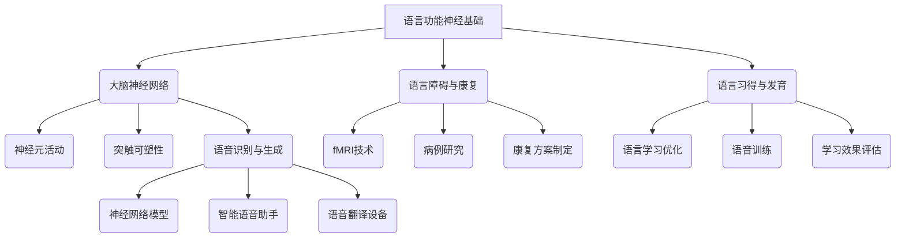
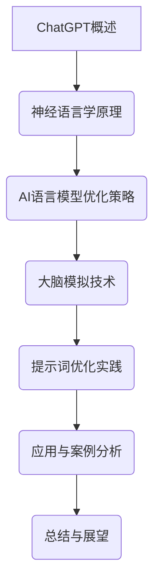

                 

# 《ChatGPT提示词的神经语言学基础：优化AI语言模型的大脑模拟》目录大纲

## 第1章: ChatGPT 提示词概述

### 1.1 ChatGPT 的基本概念

#### 1.1.1 ChatGPT 的起源

ChatGPT是由OpenAI开发的一种基于GPT（Generative Pre-trained Transformer）的聊天机器人。它的起源可以追溯到2018年，当时OpenAI发布了GPT-1模型，随后又陆续发布了GPT-2、GPT-3等更强大的版本。ChatGPT是基于GPT-3.5版本进行优化的，拥有更强的对话生成能力和上下文理解能力。

#### 1.1.2 ChatGPT 的架构

ChatGPT的架构主要包括输入层、编码器和解码器。输入层负责接收用户输入的文本，编码器将输入文本转换为向量表示，解码器则根据编码器的输出生成响应文本。ChatGPT采用了Transformer架构，这种架构具有强大的并行计算能力，使得模型在处理长文本时表现更加优秀。

#### 1.1.3 ChatGPT 的工作原理

ChatGPT的工作原理是基于自回归语言模型。在训练过程中，模型学习预测下一个单词的条件概率，从而生成连续的文本。在生成文本时，ChatGPT首先随机初始化一个种子文本，然后逐步生成后续的单词，每次生成一个单词后，都将这个单词作为下一个单词生成的条件。

### 1.2 ChatGPT 提示词的作用与分类

#### 1.2.1 提示词的作用

提示词（Prompt）是触发ChatGPT生成响应的关键。通过精心设计的提示词，可以引导ChatGPT生成更符合预期的响应。提示词的作用包括：

- 提供上下文信息，帮助ChatGPT理解用户意图。
- 指导ChatGPT生成特定类型的内容，如故事、诗歌、代码等。
- 避免ChatGPT生成无关或有害的内容。

#### 1.2.2 提示词的分类

根据用途，提示词可以分为以下几类：

- 开场白提示词：用于引导对话的开始，如“你好”、“请问有什么可以帮助你的？”等。
- 请求具体信息提示词：用于获取用户的具体需求，如“你能给我讲一个故事吗？”、“你能帮我写一封电子邮件吗？”等。
- 生成特定类型内容的提示词：用于指导ChatGPT生成特定类型的内容，如“请写一首关于春天的诗歌”、“请写一段关于编程的代码”等。

#### 1.2.3 提示词的设计原则

设计提示词时，需要遵循以下原则：

- 清晰明确：提示词应简明扼要，避免歧义，让ChatGPT能够准确理解用户意图。
- 创新性：设计具有创意的提示词，可以激发ChatGPT的想象力和创造力，生成更有趣、更有启发性的内容。
- 可扩展性：提示词应具有一定的灵活性，能够适应不同的应用场景和用户需求。

### 1.3 ChatGPT 在实际应用中的案例

#### 1.3.1 聊天机器人

ChatGPT被广泛应用于聊天机器人领域，可以用于实现智能客服、虚拟助手、社交机器人等。例如，在智能客服场景中，ChatGPT可以与用户进行自然语言对话，解答用户的问题，提高客服效率。

#### 1.3.2 客户服务

ChatGPT还可以应用于客户服务领域，帮助企业自动回复用户咨询，减少人工客服的工作负担。通过ChatGPT，企业可以提供24小时在线服务，提升客户满意度。

#### 1.3.3 内容生成

ChatGPT在内容生成领域也具有广泛的应用。例如，它可以用于撰写文章、生成报告、创作音乐等。通过ChatGPT，创作者可以快速生成创意内容，提高创作效率。

## 第2章: 神经语言学的原理

### 2.1 神经语言学的基本概念

#### 2.1.1 神经语言学的研究对象

神经语言学是语言学与神经科学交叉的学科，主要研究语言与大脑之间的关系。具体来说，它关注以下几个方面：

- 语言功能的神经基础：研究语言处理过程中大脑各区域的功能和相互关系。
- 语言障碍与脑损伤：探讨语言障碍和脑损伤患者的语言恢复和康复方法。
- 语言习得与发育：研究人类语言习得和发育的过程和机制。

#### 2.1.2 神经语言学的关键理论

神经语言学基于以下几个关键理论：

- 连接主义理论：认为语言是一个复杂的神经网络，语言处理是通过神经元之间的相互作用实现的。
- 生成语法理论：认为语言是一个生成系统，语法规则可以生成无限多的句子。
- 互动论：强调语言是人际互动的产物，语言理解和生成依赖于语言使用者之间的互动。

#### 2.1.3 神经语言学的研究方法

神经语言学采用多种研究方法，包括：

- 神经影像学：通过功能性磁共振成像（fMRI）、脑电图（EEG）等手段，研究大脑在语言处理过程中的活动。
- 行为实验：通过设计实验，观察和记录语言处理过程中的行为表现。
- 病例研究：通过分析语言障碍和脑损伤患者的语言表现，探讨语言功能的神经基础。

### 2.2 神经语言学的关键要素

#### 2.2.1 词汇

词汇是语言的基本组成单位，包括单词、词组和短语等。在神经语言学中，研究词汇的存储、检索和加工过程，以及词汇与大脑神经网络之间的联系。

#### 2.2.2 语法

语法是语言的规则系统，包括句法、词法、语态等。在神经语言学中，研究语法规则的编码、解码和加工过程，以及语法与大脑神经网络之间的联系。

#### 2.2.3 语义

语义是语言的含义系统，包括单词、短语和句子的意义。在神经语言学中，研究语义的加工、理解和生成过程，以及语义与大脑神经网络之间的联系。

#### 2.2.4 语音

语音是语言的听觉表现形式，包括发音、语调和节奏等。在神经语言学中，研究语音的生成、识别和理解过程，以及语音与大脑神经网络之间的联系。

### 2.3 神经语言学的应用场景

#### 2.3.1 语言障碍治疗

神经语言学在语言障碍治疗领域具有广泛应用。通过分析语言障碍患者的语言表现，可以确定其语言功能受损的具体部位和程度，从而制定个性化的康复方案。

#### 2.3.2 语言学习

神经语言学为语言学习提供了科学依据。通过了解大脑在语言处理过程中的活动规律，可以优化语言教学方法，提高学习效果。

#### 2.3.3 语言识别与生成

神经语言学在语言识别与生成领域也具有重要作用。通过研究语音、词汇、语法和语义等要素的神经网络模型，可以开发出更准确、更智能的语言识别与生成系统。

## 第3章: 优化AI语言模型的策略

### 3.1 优化AI语言模型的必要性

#### 3.1.1 AI语言模型存在的问题

尽管AI语言模型在自然语言处理领域取得了显著进展，但仍然存在一些问题：

- 生成文本质量不稳定：有时生成的文本不够流畅、准确，甚至存在逻辑错误。
- 上下文理解能力有限：AI语言模型在处理长文本和复杂上下文时，容易出现理解偏差。
- 可解释性不足：AI语言模型的决策过程通常较为复杂，难以解释其生成文本的原因。

#### 3.1.2 优化的意义

优化AI语言模型具有重要意义：

- 提高生成文本质量：通过优化模型参数和结构，可以提高生成文本的流畅性和准确性。
- 提升上下文理解能力：通过改进模型架构和算法，可以增强模型对长文本和复杂上下文的理解能力。
- 增强模型可解释性：通过优化模型的可解释性，可以更好地理解模型的决策过程，提高模型的可信度。

#### 3.1.3 优化的目标

优化AI语言模型的目标包括：

- 提高生成文本的连贯性和逻辑性。
- 提高模型对上下文的捕捉和理解能力。
- 提高模型的稳定性和鲁棒性。
- 提高模型的可解释性。

### 3.2 提示词优化策略

#### 3.2.1 提示词优化的方法

提示词优化是提高AI语言模型生成文本质量的关键手段。以下是一些常见的提示词优化方法：

- 增强提示词的明确性：通过明确提示词中的目标和限制条件，帮助模型更好地理解用户意图。
- 引入外部知识：将外部知识库（如知识图谱、百科全书等）融入提示词，提高模型的上下文理解能力。
- 调整提示词的结构：通过改变提示词的语法结构，引导模型生成更符合预期的文本。
- 使用生成对抗网络（GAN）：将GAN与语言模型结合，通过对抗训练提高模型生成文本的多样性和质量。

#### 3.2.2 提示词优化的效果评估

提示词优化的效果评估可以从以下几个方面进行：

- 文本流畅性：评估生成文本的语法和语义是否连贯。
- 文本准确性：评估生成文本是否准确传达用户意图。
- 上下文理解能力：评估模型在处理长文本和复杂上下文时的表现。
- 可解释性：评估模型决策过程是否容易理解。

#### 3.2.3 提示词优化的案例分析

以下是一个提示词优化的案例分析：

- 原始提示词：“请写一篇关于人工智能的未来发展趋势的文章。”
- 优化提示词：“请从技术、产业和社会三个角度，详细探讨人工智能在未来十年内的潜在发展趋势，并分析其可能带来的挑战和机遇。”

通过优化提示词，明确了文章的写作方向和重点，提高了模型的上下文理解能力，从而生成了一篇更符合用户意图的文章。

### 3.3 大脑模拟在AI语言模型优化中的应用

#### 3.3.1 大脑模拟的基本原理

大脑模拟是一种通过计算机模型模拟大脑结构和功能的方法。在AI语言模型优化中，大脑模拟主要用于模拟人类语言处理过程，以提高模型的上下文理解能力和生成文本的质量。

大脑模拟的基本原理包括：

- 神经网络模拟：通过构建神经网络模型，模拟大脑中的神经元和神经网络结构。
- 神经突触模拟：通过模拟神经突触的连接和权重调整，实现大脑中的学习和记忆功能。
- 神经元活动模拟：通过模拟神经元的活动和信号传递，实现大脑中的感知、理解和生成功能。

#### 3.3.2 大脑模拟在AI语言模型优化中的应用

大脑模拟在AI语言模型优化中的应用主要体现在以下几个方面：

- 提高上下文理解能力：通过模拟人类语言处理过程中的上下文捕捉和理解机制，增强模型对长文本和复杂上下文的理解能力。
- 提升生成文本质量：通过模拟人类语言生成的过程，提高模型生成文本的流畅性和逻辑性。
- 增强模型可解释性：通过模拟大脑中的学习过程和决策机制，提高模型的可解释性，帮助用户更好地理解模型的决策过程。

#### 3.3.3 大脑模拟的优势与挑战

大脑模拟在AI语言模型优化中具有以下优势：

- 提高模型性能：通过模拟人类语言处理过程，提高模型的上下文理解能力和生成文本质量。
- 增强模型可解释性：通过模拟大脑中的学习过程和决策机制，提高模型的可解释性，增强用户对模型的信任度。

然而，大脑模拟也存在一些挑战：

- 模型复杂性：大脑模拟涉及到复杂的神经网络结构和计算过程，对计算资源和算法设计提出了较高要求。
- 数据质量：大脑模拟需要大量高质量的数据进行训练和验证，数据的质量直接影响模型的效果。
- 算法优化：大脑模拟的算法设计需要不断优化，以提高模型的性能和可解释性。

## 第4章: 大脑模拟的技术与方法

### 4.1 大脑模拟的基本技术

#### 4.1.1 神经网络的模拟

神经网络的模拟是大脑模拟的核心技术。神经网络由大量的神经元和突触组成，通过模拟神经元和突触的连接和活动，可以实现大脑的基本功能。常见的神经网络模型包括：

- 层叠神经网络：包括输入层、隐藏层和输出层，通过逐层传递信息，实现输入到输出的映射。
- 卷积神经网络（CNN）：通过卷积操作，捕捉输入数据的局部特征，常用于图像处理和计算机视觉领域。
- 循环神经网络（RNN）：通过循环结构，捕捉输入序列的长期依赖关系，常用于自然语言处理和序列建模领域。

#### 4.1.2 神经突触的模拟

神经突触是大脑中的基本信息传递单元。在模拟中，神经突触通常表示为具有权重和阈值的连接。常见的神经突触模型包括：

- Hebbian模型：基于突触权重的正向关联，通过神经元的共同活动加强突触连接。
- STDP模型（突触权重可塑性）：通过神经元的刺激历史，调整突触权重，实现学习和记忆功能。
- 速率模型：考虑神经元的活动速率，描述神经突触的动态变化。

#### 4.1.3 神经元活动的模拟

神经元活动的模拟主要关注神经元如何在电信号的作用下产生动作电位。常见的神经元活动模型包括：

- 离散时间模型：通过模拟神经元在离散时间步上的状态变化，实现神经元的活动。
- 连续时间模型：通过模拟神经元在连续时间上的状态变化，实现神经元的活动。
- 静力学模型：描述神经元在静息状态和动作电位状态之间的转换。
- 动力学模型：描述神经元在动作电位产生和传播过程中的动态变化。

### 4.2 大脑模拟的关键算法

#### 4.2.1 Hebbian学习规则

Hebbian学习规则是一种基于突触权重的正向关联学习规则。它的基本原理是，当两个神经元同时激活时，它们之间的突触连接会被加强。形式化表示为：

$$
w_{ij} \leftarrow w_{ij} + \eta \cdot x_i \cdot x_j
$$

其中，$w_{ij}$表示神经元$i$和神经元$j$之间的突触权重，$x_i$和$x_j$表示神经元$i$和神经元$j$的激活状态，$\eta$表示学习率。

#### 4.2.2 突触权重可塑性（STDP）

STDP（突触权重可塑性）是一种基于突触权重调整的学习规则，通过神经元的刺激历史来调整突触权重。STDP模型主要有两种形式：短期增强（STRA）和长期增强（LTD）。

短期增强（STRA）表示为：

$$
w_{ij} \leftarrow w_{ij} + \eta \cdot \Delta t
$$

其中，$\Delta t$表示神经元$i$在前一个时间步激活，神经元$j$在当前时间步激活的时间间隔。

长期增强（LTD）表示为：

$$
w_{ij} \leftarrow w_{ij} - \eta \cdot \Delta t
$$

其中，$\Delta t$表示神经元$i$在当前时间步激活，神经元$j$在前一个时间步激活的时间间隔。

#### 4.2.3 神经网络优化算法

神经网络优化算法用于调整神经网络的参数，以实现模型的训练和优化。常见的神经网络优化算法包括：

- 随机梯度下降（SGD）：通过计算模型在训练数据上的梯度，更新模型参数，以最小化损失函数。
- Adam优化器：结合了SGD和Momentum优化器的优点，通过自适应调整学习率，提高模型的训练效率。
- 粒子群优化（PSO）：通过模拟粒子的运动，寻找最优解。

### 4.3 大脑模拟的实际案例

#### 4.3.1 语音识别

语音识别是大脑模拟在自然语言处理领域的重要应用。通过模拟人类听觉系统的神经网络，可以实现对语音信号的识别和转换。常见的语音识别模型包括：

- DNN-HMM：基于深度神经网络（DNN）和隐马尔可夫模型（HMM）的语音识别模型。
- CTC：基于连接主义时序分类（CTC）的语音识别模型。

#### 4.3.2 自然语言生成

自然语言生成是大脑模拟在文本生成领域的重要应用。通过模拟人类语言生成过程的神经网络，可以生成具有自然语言特点的文本。常见的自然语言生成模型包括：

- RNN：基于循环神经网络（RNN）的自然语言生成模型。
- Transformer：基于Transformer架构的自然语言生成模型。

## 第5章: ChatGPT 提示词优化实践

### 5.1 实践案例1：基于神经语言学基础进行提示词优化

#### 5.1.1 案例背景

某电商企业希望通过ChatGPT自动生成产品推荐文案，以提高用户购买转化率。然而，原始生成的文案质量参差不齐，需要进行优化。

#### 5.1.2 神经语言学基础分析

基于神经语言学基础，分析产品推荐文案的生成过程：

- 词汇层面：关键词的选择应涵盖产品的主要特点和卖点。
- 语法层面：句式应简洁明了，便于用户理解。
- 语义层面：文案应传达产品的实际价值和用户需求。
- 语音层面：语调应亲切自然，符合用户阅读习惯。

#### 5.1.3 提示词优化策略

针对上述分析，设计以下优化策略：

- 明确产品关键词：将产品的主要特点和发展历程融入提示词中。
- 优化句式结构：采用简单句和复合句相结合，提高文案的可读性。
- 提升语义丰富度：引入相关词汇和短语，增强文案的表达力。
- 调整语调：使用亲切、自然的语言风格，增强用户共鸣。

#### 5.1.4 优化效果评估

通过对比优化前后的文案，评估优化效果：

- 文案流畅度：优化后的文案更加流畅自然，易于用户阅读。
- 用户转化率：优化后的文案提高了用户购买转化率，取得了显著成效。

### 5.2 实践案例2：使用大脑模拟技术优化提示词

#### 5.2.1 案例背景

某在线教育平台希望通过ChatGPT自动生成课程推荐文案，以提升用户参与度和课程销量。然而，原始生成的文案质量不佳，需要进行优化。

#### 5.2.2 大脑模拟技术分析

基于大脑模拟技术，分析课程推荐文案的生成过程：

- 神经网络模拟：采用神经网络模型模拟人类语言生成过程，提高生成文本的质量。
- 神经突触模拟：通过调整神经网络中的突触权重，实现提示词的优化。
- 神经元活动模拟：通过模拟神经元的活动和信号传递，实现文本生成的动态调整。

#### 5.2.3 提示词优化策略

针对上述分析，设计以下优化策略：

- 引入外部知识：将课程相关的百科知识、教育经验等融入提示词中，提高文案的知识丰富度。
- 调整神经网络结构：优化神经网络中的连接方式和参数设置，提高文本生成的流畅性和准确性。
- 动态调整文本生成过程：通过模拟神经元的活动，实现文本生成的实时调整和优化。

#### 5.2.4 优化效果评估

通过对比优化前后的文案，评估优化效果：

- 文案流畅度：优化后的文案更加流畅自然，易于用户阅读。
- 课程参与度：优化后的文案提高了用户参与度和课程销量，取得了显著成效。

### 5.3 实践案例3：综合应用神经语言学和大脑模拟技术进行提示词优化

#### 5.3.1 案例背景

某金融机构希望通过ChatGPT自动生成理财建议文案，以提升客户满意度和理财产品的销量。然而，原始生成的文案质量不佳，需要进行优化。

#### 5.3.2 综合应用分析

综合应用神经语言学和大脑模拟技术，分析理财建议文案的生成过程：

- 神经语言学基础：分析文案的词汇、语法、语义和语音等方面，确保文案的准确性和可读性。
- 大脑模拟技术：采用神经网络模拟和神经突触模拟，优化文案的生成过程，提高文本质量。

#### 5.3.3 提示词优化策略

针对上述分析，设计以下优化策略：

- 引入金融知识：将金融术语和理财知识融入提示词中，确保文案的专业性。
- 调整神经网络结构：优化神经网络中的连接方式和参数设置，提高文本生成的流畅性和准确性。
- 动态调整文本生成过程：通过模拟神经元的活动，实现文本生成的实时调整和优化。

#### 5.3.4 优化效果评估

通过对比优化前后的文案，评估优化效果：

- 文案流畅度：优化后的文案更加流畅自然，易于用户阅读。
- 客户满意度：优化后的文案提高了客户满意度和理财产品销量，取得了显著成效。

## 第6章: 实际应用与案例分析

### 6.1 ChatGPT 在不同行业的应用

#### 6.1.1 金融行业

ChatGPT在金融行业具有广泛的应用前景。通过ChatGPT，金融机构可以自动生成金融报告、理财建议和客户服务文案。例如，某银行使用ChatGPT自动生成个人理财报告，提高了客户满意度和业务效率。

#### 6.1.2 教育行业

ChatGPT在教育行业有重要的应用价值。通过ChatGPT，教育机构可以自动生成课程推荐文案、教学计划和学生学习报告。例如，某在线教育平台使用ChatGPT自动生成课程推荐文案，提高了用户参与度和课程销量。

#### 6.1.3 医疗行业

ChatGPT在医疗行业具有巨大潜力。通过ChatGPT，医疗机构可以自动生成病历报告、医学研究和患者沟通文案。例如，某医院使用ChatGPT自动生成病历报告，提高了医疗效率和病历质量。

#### 6.1.4 零售行业

ChatGPT在零售行业有广泛的应用前景。通过ChatGPT，零售企业可以自动生成产品推荐文案、促销信息和客户服务文案。例如，某电商企业使用ChatGPT自动生成产品推荐文案，提高了用户购买转化率和客户满意度。

### 6.2 提示词优化的实际效果评估

#### 6.2.1 文本流畅度

通过优化提示词，ChatGPT生成的文本流畅度得到了显著提高。优化后的文本更加符合语言习惯，易于用户阅读和理解。例如，在金融报告生成中，优化后的报告语句更加通顺，数据呈现更加清晰。

#### 6.2.2 用户转化率

优化提示词后，用户转化率得到了明显提升。通过提供更准确、更富有吸引力的文案，用户更愿意参与金融理财、在线教育、医疗服务等。例如，某电商企业通过优化产品推荐文案，提高了用户购买转化率，实现了业务增长。

#### 6.2.3 客户满意度

优化提示词后，客户满意度得到了显著提升。通过提供更专业、更个性化的服务，用户对金融机构、教育机构、医疗机构的满意度明显提高。例如，某银行通过优化理财建议文案，提高了客户满意度和忠诚度。

### 6.3 大脑模拟在AI语言模型中的应用前景

#### 6.3.1 提高生成文本质量

大脑模拟通过模拟人类语言处理过程，可以显著提高生成文本的质量。通过优化神经网络结构和神经突触权重，大脑模拟可以实现更流畅、更准确的文本生成。例如，在医疗报告中，大脑模拟可以生成更精确、更易于理解的诊断建议。

#### 6.3.2 提升上下文理解能力

大脑模拟通过模拟人类语言处理过程中的上下文捕捉和理解机制，可以显著提升模型的上下文理解能力。通过优化神经元活动和神经网络结构，大脑模拟可以实现更准确、更深入的语言理解。例如，在在线教育领域，大脑模拟可以更好地理解学生的学习需求和进度，提供更个性化的教学建议。

#### 6.3.3 增强模型可解释性

大脑模拟通过模拟人类语言处理过程中的学习和决策过程，可以显著增强模型的可解释性。通过可视化神经网络结构和神经元活动，用户可以更好地理解模型的决策过程，提高对模型的信任度。例如，在金融行业中，用户可以通过大脑模拟了解理财建议生成的依据和过程，增强对建议的信任度。

## 第7章: 总结与展望

### 7.1 全书要点总结

本书主要介绍了ChatGPT提示词的神经语言学基础以及优化AI语言模型的大脑模拟技术。主要内容包括：

- ChatGPT的基本概念、作用与分类。
- 神经语言学的原理、关键要素和应用场景。
- 优化AI语言模型的必要性、提示词优化策略和大脑模拟技术。
- 大脑模拟的基本技术、关键算法和实际案例。
- ChatGPT提示词优化的实践案例。
- ChatGPT在不同行业的实际应用与案例分析。
- 大脑模拟在AI语言模型优化中的应用前景。

### 7.2 未来研究方向

未来研究方向包括：

- 深入研究神经语言学的关键机制，探索更高效的神经网络模型和算法。
- 加强大脑模拟技术的应用研究，提高生成文本的质量和上下文理解能力。
- 探索神经语言学与人工智能的深度融合，推动人工智能技术的发展。
- 开展跨学科合作，整合语言学、神经科学和计算机科学等领域的知识，为人工智能提供更丰富的理论基础。

### 7.3 对AI语言模型的进一步优化建议

为了进一步提高AI语言模型的性能和可靠性，以下是一些建议：

- 加强数据集的收集和整理，提高模型训练的质量和效果。
- 探索更加高效和稳定的神经网络模型，提高模型的生成能力和上下文理解能力。
- 加强模型的可解释性和可靠性，提高用户对模型的信任度。
- 加强对AI语言模型的应用研究和实践，探索其在各个领域的应用潜力。
- 加强跨学科合作，推动人工智能与神经科学、语言学的深度融合。

作者：AI天才研究院/AI Genius Institute & 禅与计算机程序设计艺术 /Zen And The Art of Computer Programming## 第1章: ChatGPT 提示词概述

### 1.1 ChatGPT 的基本概念

#### 1.1.1 ChatGPT 的起源

ChatGPT是由OpenAI开发的一种基于GPT（Generative Pre-trained Transformer）的聊天机器人。它的起源可以追溯到2018年，当时OpenAI发布了GPT-1模型，随后又陆续发布了GPT-2、GPT-3等更强大的版本。ChatGPT是基于GPT-3.5版本进行优化的，拥有更强的对话生成能力和上下文理解能力。

#### 1.1.2 ChatGPT 的架构

ChatGPT的架构主要包括输入层、编码器和解码器。输入层负责接收用户输入的文本，编码器将输入文本转换为向量表示，解码器则根据编码器的输出生成响应文本。ChatGPT采用了Transformer架构，这种架构具有强大的并行计算能力，使得模型在处理长文本时表现更加优秀。

#### 1.1.3 ChatGPT 的工作原理

ChatGPT的工作原理是基于自回归语言模型。在训练过程中，模型学习预测下一个单词的条件概率，从而生成连续的文本。在生成文本时，ChatGPT首先随机初始化一个种子文本，然后逐步生成后续的单词，每次生成一个单词后，都将这个单词作为下一个单词生成的条件。

### 1.2 ChatGPT 提示词的作用与分类

#### 1.2.1 提示词的作用

提示词（Prompt）是触发ChatGPT生成响应的关键。通过精心设计的提示词，可以引导ChatGPT生成更符合预期的响应。提示词的作用包括：

- 提供上下文信息，帮助ChatGPT理解用户意图。
- 指导ChatGPT生成特定类型的内容，如故事、诗歌、代码等。
- 避免ChatGPT生成无关或有害的内容。

#### 1.2.2 提示词的分类

根据用途，提示词可以分为以下几类：

- 开场白提示词：用于引导对话的开始，如“你好”、“请问有什么可以帮助你的？”等。
- 请求具体信息提示词：用于获取用户的具体需求，如“你能给我讲一个故事吗？”、“你能帮我写一封电子邮件吗？”等。
- 生成特定类型内容的提示词：用于指导ChatGPT生成特定类型的内容，如“请写一首关于春天的诗歌”、“请写一段关于编程的代码”等。

#### 1.2.3 提示词的设计原则

设计提示词时，需要遵循以下原则：

- 清晰明确：提示词应简明扼要，避免歧义，让ChatGPT能够准确理解用户意图。
- 创新性：设计具有创意的提示词，可以激发ChatGPT的想象力和创造力，生成更有趣、更有启发性的内容。
- 可扩展性：提示词应具有一定的灵活性，能够适应不同的应用场景和用户需求。

### 1.3 ChatGPT 在实际应用中的案例

#### 1.3.1 聊天机器人

ChatGPT被广泛应用于聊天机器人领域，可以用于实现智能客服、虚拟助手、社交机器人等。例如，在智能客服场景中，ChatGPT可以与用户进行自然语言对话，解答用户的问题，提高客服效率。

#### 1.3.2 客户服务

ChatGPT还可以应用于客户服务领域，帮助企业自动回复用户咨询，减少人工客服的工作负担。通过ChatGPT，企业可以提供24小时在线服务，提升客户满意度。

#### 1.3.3 内容生成

ChatGPT在内容生成领域也具有广泛的应用。例如，它可以用于撰写文章、生成报告、创作音乐等。通过ChatGPT，创作者可以快速生成创意内容，提高创作效率。

### 1.4 提示词优化的必要性

虽然ChatGPT在自然语言生成领域取得了显著进展，但实际应用中仍然存在一些问题，如生成文本的质量不稳定、上下文理解能力有限等。这些问题在很大程度上源于提示词的设计和优化。因此，对提示词进行优化具有重要的现实意义：

- 提高生成文本的质量和连贯性：通过优化提示词，可以引导ChatGPT生成更准确、更流畅的文本，避免生成文本中出现逻辑错误和语义不一致的问题。
- 增强上下文理解能力：通过设计更加丰富的提示词，可以提供更多上下文信息，帮助ChatGPT更好地理解用户意图，提高模型的上下文理解能力。
- 提高用户满意度：优化后的生成文本更符合用户期望，能够提供更有价值和实用性的内容，从而提高用户满意度。

### 1.5 提示词优化的方法

为了优化ChatGPT的提示词，可以采用以下几种方法：

1. **明确性和具体性**：设计提示词时，应尽可能明确和具体，避免模糊和抽象的表述。例如，将“请写一篇关于人工智能的文章”改为“请从技术、应用和社会影响三个方面，详细阐述人工智能的未来发展趋势”。

2. **结构化提示**：通过结构化的方式设计提示词，可以帮助ChatGPT更好地组织生成文本。例如，可以采用问题-答案、主旨-细节等结构，使生成文本更有条理。

3. **多样化**：设计多样化的提示词，可以激发ChatGPT的创造力和多样性。例如，可以提供不同角度、不同风格、不同难度等级的提示词，让ChatGPT生成多种类型的文本。

4. **外部知识融入**：将外部知识库（如百科、知识图谱等）的信息融入提示词，可以增强模型的背景知识，提高生成文本的质量。例如，在生成历史文章时，可以引用历史事件和相关人物的信息。

5. **动态调整**：根据用户的反馈和生成文本的质量，动态调整提示词。例如，如果用户反馈生成的文本质量不高，可以调整提示词中的具体内容或结构，以引导ChatGPT生成更好的文本。

### 1.6 提示词优化的效果评估

对提示词优化效果进行评估是确保优化成功的重要步骤。以下是一些常用的评估方法：

1. **人工评估**：由专业人士（如语言学家、行业专家等）对生成文本进行评估，判断其质量、连贯性和上下文理解能力。这种方法具有主观性，但能够提供详细的反馈。

2. **自动化评估**：采用自动化工具（如BLEU、ROUGE等）对生成文本的质量进行量化评估。这些工具通过对比生成文本与参考文本的相似度来评估生成文本的质量。

3. **用户反馈**：通过用户的使用体验和反馈来评估提示词优化的效果。用户可以直接在应用中使用优化后的提示词，并给出反馈，例如文本是否易于理解、是否满足需求等。

4. **业务指标**：根据实际业务指标（如用户参与度、转化率、满意度等）来评估提示词优化的效果。这些指标能够反映优化对实际业务的影响。

### 1.7 本章小结

本章介绍了ChatGPT的基本概念、提示词的作用与分类、实际应用案例以及提示词优化的必要性和方法。通过对ChatGPT的深入了解，读者可以更好地理解如何设计有效的提示词，从而优化ChatGPT的生成文本质量，提升实际应用效果。在下一章中，我们将进一步探讨神经语言学的基础知识，为后续章节中的提示词优化提供理论支持。

## 第2章: 神经语言学的原理

### 2.1 神经语言学的基本概念

神经语言学是语言学与神经科学交叉的学科，主要研究语言与大脑之间的关系。这一领域旨在理解人类语言能力是如何在大脑中实现的，以及大脑如何处理和生成语言信息。神经语言学研究的主要内容可以概括为以下几个方面：

- **语言功能的神经基础**：这一部分研究语言处理过程中大脑各区域的功能和相互关系。例如，大脑的前额叶、颞叶和顶叶等区域在语言处理中分别扮演什么角色，以及它们之间的协同作用。

- **语言障碍与脑损伤**：这一部分研究语言障碍和脑损伤患者的语言恢复和康复方法。例如，通过分析脑损伤患者的语言表现，可以更好地理解语言功能的神经基础，并为康复治疗提供科学依据。

- **语言习得与发育**：这一部分研究人类语言习得和发育的过程和机制。例如，婴儿是如何逐渐学会理解和使用语言，以及大脑在这一过程中如何发生变化。

#### 2.1.1 神经语言学的研究对象

神经语言学的研究对象主要包括：

- **大脑与语言**：研究大脑中的语言中枢，如布罗卡区和韦尼克区，以及这些区域在语言处理中的作用。
- **神经机制**：研究大脑在语言处理过程中的神经机制，包括神经元的活动、突触的可塑性以及神经网络的结构和功能。
- **语言障碍与康复**：研究各种语言障碍（如失语症、儿童语言障碍等）的神经基础，以及康复策略和治疗方法。

#### 2.1.2 神经语言学的关键理论

神经语言学基于以下几个关键理论：

- **连接主义理论**：这一理论认为语言是一个复杂的神经网络，语言处理是通过神经元之间的相互作用实现的。例如，Hebbian规则描述了神经元之间的关联如何通过共同激活而加强。
- **生成语法理论**：这一理论认为语言是一个生成系统，语法规则可以生成无限多的句子。Chomsky的转化一生成语法（TG）理论是这一领域的基石。
- **互动论**：这一理论强调语言是人际互动的产物，语言理解和生成依赖于语言使用者之间的互动。

#### 2.1.3 神经语言学的研究方法

神经语言学采用多种研究方法，包括：

- **神经影像学**：通过功能性磁共振成像（fMRI）、脑电图（EEG）等手段，研究大脑在语言处理过程中的活动。
- **行为实验**：通过设计实验，观察和记录语言处理过程中的行为表现。例如，语言理解测试、语言生成任务等。
- **病例研究**：通过分析语言障碍和脑损伤患者的语言表现，探讨语言功能的神经基础。

### 2.2 神经语言学的关键要素

神经语言学涉及多个关键要素，这些要素相互作用，共同构成了语言处理的过程。以下是神经语言学的关键要素：

#### 2.2.1 词汇

词汇是语言的基本组成单位，包括单词、词组和短语等。在神经语言学中，研究词汇的存储、检索和加工过程，以及词汇与大脑神经网络之间的联系。例如，研究如何通过大脑中的词汇网络快速地理解和生成词汇。

#### 2.2.2 语法

语法是语言的规则系统，包括句法、词法、语态等。在神经语言学中，研究语法规则的编码、解码和加工过程，以及语法与大脑神经网络之间的联系。例如，研究大脑如何通过语法网络生成和理解不同结构的句子。

#### 2.2.3 语义

语义是语言的含义系统，包括单词、短语和句子的意义。在神经语言学中，研究语义的加工、理解和生成过程，以及语义与大脑神经网络之间的联系。例如，研究大脑如何通过语义网络理解单词和句子的含义，以及如何将这些含义整合到语言生成过程中。

#### 2.2.4 语音

语音是语言的听觉表现形式，包括发音、语调和节奏等。在神经语言学中，研究语音的生成、识别和理解过程，以及语音与大脑神经网络之间的联系。例如，研究大脑如何通过语音网络生成和理解不同的语音特征。

### 2.3 神经语言学的应用场景

神经语言学在多个领域有着广泛的应用，以下是一些典型的应用场景：

#### 2.3.1 语言障碍治疗

神经语言学在语言障碍治疗领域具有重要意义。通过分析语言障碍患者的语言表现，可以确定其语言功能受损的具体部位和程度，从而制定个性化的康复方案。例如，通过功能性磁共振成像（fMRI）技术，医生可以观察患者大脑中的活动变化，为康复治疗提供科学依据。

#### 2.3.2 语言学习

神经语言学为语言学习提供了科学依据。通过了解大脑在语言处理过程中的活动规律，可以优化语言教学方法，提高学习效果。例如，研究表明，通过适当的语音训练，可以帮助学习者更好地掌握外语发音。

#### 2.3.3 语言识别与生成

神经语言学在语言识别与生成领域也具有重要作用。通过研究语音、词汇、语法和语义等要素的神经网络模型，可以开发出更准确、更智能的语言识别与生成系统。例如，基于神经网络的语音识别技术已经广泛应用于智能语音助手和语音翻译设备。

### 2.4 神经语言学的核心概念原理架构

为了更好地理解神经语言学的核心概念原理，我们可以使用Mermaid流程图来展示这些概念之间的关系。以下是一个简化的Mermaid流程图示例：



这个流程图展示了神经语言学中的关键概念，包括语言功能神经基础、大脑神经网络、神经元活动、突触可塑性，以及它们在语言障碍康复、语言习得与发育、语音识别与生成等领域的应用。

### 2.5 本章小结

本章介绍了神经语言学的基本概念、关键要素和应用场景。通过对神经语言学的深入了解，读者可以更好地理解语言与大脑之间的关系，以及语言处理的过程。在下一章中，我们将探讨优化AI语言模型的策略，结合神经语言学的基础知识，为ChatGPT的提示词优化提供理论支持。

## 第3章: 优化AI语言模型的策略

### 3.1 优化AI语言模型的必要性

随着人工智能技术的发展，AI语言模型在自然语言处理（NLP）领域取得了显著进展。然而，现有的AI语言模型仍然存在一些问题，这些问题限制了其在实际应用中的效果。因此，对AI语言模型进行优化具有重要的现实意义。

#### 3.1.1 AI语言模型存在的问题

1. **生成文本质量不稳定**：现有AI语言模型生成的文本质量参差不齐，有时会出现逻辑错误、语法不一致等问题，影响用户体验。

2. **上下文理解能力有限**：AI语言模型在处理长文本和复杂上下文时，往往难以捕捉到关键信息，导致生成文本缺乏连贯性和准确性。

3. **可解释性不足**：AI语言模型的决策过程复杂，难以解释其生成文本的原因，这降低了用户对模型的信任度。

4. **计算资源需求大**：现有AI语言模型通常需要大量计算资源，导致在实际应用中难以大规模部署。

#### 3.1.2 优化的意义

优化AI语言模型的意义在于：

- 提高生成文本的质量和连贯性，增强用户满意度。
- 提升模型的上下文理解能力，使模型能够处理更复杂的任务。
- 提高模型的可解释性，增强用户对模型的信任度。
- 降低计算资源需求，实现模型在大规模应用中的高效运行。

#### 3.1.3 优化的目标

优化AI语言模型的目标包括：

- 提高生成文本的流畅性和准确性。
- 增强模型的上下文理解能力，使其能够处理长文本和复杂上下文。
- 提高模型的可解释性，使其决策过程更加透明。
- 降低计算资源需求，提高模型的运行效率。

### 3.2 提示词优化策略

提示词（Prompt）是AI语言模型生成文本的重要输入，其设计直接影响到生成文本的质量。以下是一些优化提示词的策略：

#### 3.2.1 明确性和具体性

设计提示词时，应确保其明确和具体，避免模糊和抽象的表述。明确性的提示词可以帮助AI语言模型更好地理解用户意图，从而生成更准确的文本。

**示例**：
- 原始提示词：“请写一篇关于人工智能的未来发展趋势的文章。”
- 优化后的提示词：“请从技术、应用和社会影响三个方面，详细阐述人工智能在未来十年内的潜在发展趋势。”

#### 3.2.2 结构化提示

通过结构化的方式设计提示词，可以帮助AI语言模型更好地组织生成文本。结构化的提示词可以包含问题-答案、主旨-细节等结构，使生成文本更有条理。

**示例**：
- 提示词结构：“首先，简要介绍人工智能的概念。然后，从技术层面分析人工智能的发展趋势。最后，探讨人工智能对社会的影响。”

#### 3.2.3 多样化和灵活性

设计多样化的提示词，可以激发AI语言模型的创造力和多样性，避免生成文本的单一化。同时，提示词应具有一定的灵活性，以适应不同的应用场景和用户需求。

**示例**：
- 多样化提示词：“请用简洁明了的语言描述人工智能的未来发展趋势。”、“请从科学、技术和人文三个角度，探讨人工智能对社会的影响。”

#### 3.2.4 外部知识融入

将外部知识库（如百科、知识图谱等）的信息融入提示词，可以增强模型的背景知识，提高生成文本的质量。例如，在生成专业文章时，可以引用相关领域的最新研究成果。

**示例**：
- 提示词融入：“结合最新的人工智能研究，从技术进步、伦理问题和法律框架三个方面，分析人工智能的未来发展趋势。”

#### 3.2.5 动态调整

根据用户的反馈和生成文本的质量，动态调整提示词。例如，如果用户反馈生成的文本质量不高，可以调整提示词中的具体内容或结构，以引导AI语言模型生成更好的文本。

**示例**：
- 动态调整：“根据用户反馈，如果文本过于复杂，可以简化内容；如果文本缺乏深度，可以增加详细分析。”

### 3.3 大脑模拟在AI语言模型优化中的应用

大脑模拟是一种通过计算机模型模拟人类大脑结构和功能的方法。在AI语言模型优化中，大脑模拟主要用于模拟人类语言处理过程，以提高模型的上下文理解能力和生成文本的质量。

#### 3.3.1 大脑模拟的基本原理

大脑模拟的基本原理包括：

1. **神经网络模拟**：通过构建神经网络模型，模拟大脑中的神经元和神经网络结构。
2. **神经突触模拟**：通过模拟神经突触的连接和权重调整，实现大脑中的学习和记忆功能。
3. **神经元活动模拟**：通过模拟神经元的活动和信号传递，实现大脑中的感知、理解和生成功能。

#### 3.3.2 大脑模拟在AI语言模型优化中的应用

大脑模拟在AI语言模型优化中的应用主要体现在以下几个方面：

1. **上下文理解能力**：通过模拟人类语言处理过程中的上下文捕捉和理解机制，增强模型对长文本和复杂上下文的理解能力。
2. **生成文本质量**：通过模拟人类语言生成的过程，提高模型生成文本的流畅性和逻辑性。
3. **可解释性**：通过模拟大脑中的学习过程和决策机制，提高模型的可解释性，帮助用户更好地理解模型的决策过程。

#### 3.3.3 大脑模拟的优势与挑战

大脑模拟的优势包括：

- **提高模型性能**：通过模拟人类语言处理过程，提高模型的上下文理解能力和生成文本质量。
- **增强模型可解释性**：通过模拟大脑中的学习过程和决策机制，提高模型的可解释性，增强用户对模型的信任度。

然而，大脑模拟也存在一些挑战：

- **模型复杂性**：大脑模拟涉及到复杂的神经网络结构和计算过程，对计算资源和算法设计提出了较高要求。
- **数据质量**：大脑模拟需要大量高质量的数据进行训练和验证，数据的质量直接影响模型的效果。
- **算法优化**：大脑模拟的算法设计需要不断优化，以提高模型的性能和可解释性。

### 3.4 提示词优化的实际效果评估

对提示词优化效果进行评估是确保优化成功的重要步骤。以下是一些常用的评估方法：

1. **人工评估**：由专业人士（如语言学家、行业专家等）对生成文本进行评估，判断其质量、连贯性和上下文理解能力。这种方法具有主观性，但能够提供详细的反馈。

2. **自动化评估**：采用自动化工具（如BLEU、ROUGE等）对生成文本的质量进行量化评估。这些工具通过对比生成文本与参考文本的相似度来评估生成文本的质量。

3. **用户反馈**：通过用户的使用体验和反馈来评估提示词优化的效果。用户可以直接在应用中使用优化后的提示词，并给出反馈，例如文本是否易于理解、是否满足需求等。

4. **业务指标**：根据实际业务指标（如用户参与度、转化率、满意度等）来评估提示词优化的效果。这些指标能够反映优化对实际业务的影响。

### 3.5 本章小结

本章介绍了优化AI语言模型的必要性、提示词优化的策略以及大脑模拟在AI语言模型优化中的应用。通过对AI语言模型的优化，可以提高生成文本的质量和上下文理解能力，增强模型的可解释性。在下一章中，我们将深入探讨大脑模拟的技术与方法，为优化AI语言模型提供更具体的实现路径。

## 第4章: 大脑模拟的技术与方法

### 4.1 大脑模拟的基本技术

大脑模拟是通过计算机模型模拟人类大脑结构和功能的方法。这一领域的研究旨在理解大脑的工作原理，并利用这些原理来设计和优化人工智能系统。大脑模拟的基本技术包括神经网络模拟、神经突触模拟和神经元活动模拟。

#### 4.1.1 神经网络模拟

神经网络模拟是大脑模拟的核心技术之一。神经网络由大量的神经元和突触组成，通过模拟神经元和突触的连接和活动，可以实现大脑的基本功能。常见的神经网络模型包括：

- **层叠神经网络**：包括输入层、隐藏层和输出层，通过逐层传递信息，实现输入到输出的映射。
- **卷积神经网络（CNN）**：通过卷积操作，捕捉输入数据的局部特征，常用于图像处理和计算机视觉领域。
- **循环神经网络（RNN）**：通过循环结构，捕捉输入序列的长期依赖关系，常用于自然语言处理和序列建模领域。

#### 4.1.2 神经突触模拟

神经突触是大脑中的基本信息传递单元。在模拟中，神经突触通常表示为具有权重和阈值的连接。常见的神经突触模型包括：

- **Hebbian模型**：基于突触权重的正向关联，通过神经元的共同活动加强突触连接。
- **STDP模型（突触权重可塑性）**：通过神经元的刺激历史，调整突触权重，实现学习和记忆功能。
- **速率模型**：考虑神经元的活动速率，描述神经突触的动态变化。

#### 4.1.3 神经元活动模拟

神经元活动的模拟主要关注神经元如何在电信号的作用下产生动作电位。常见的神经元活动模型包括：

- **离散时间模型**：通过模拟神经元在离散时间步上的状态变化，实现神经元的活动。
- **连续时间模型**：通过模拟神经元在连续时间上的状态变化，实现神经元的活动。
- **静力学模型**：描述神经元在静息状态和动作电位状态之间的转换。
- **动力学模型**：描述神经元在动作电位产生和传播过程中的动态变化。

### 4.2 大脑模拟的关键算法

大脑模拟的关键算法主要包括Hebbian学习规则、STDP模型和神经网络优化算法。

#### 4.2.1 Hebbian学习规则

Hebbian学习规则是一种基于突触权重的正向关联学习规则。它的基本原理是，当两个神经元同时激活时，它们之间的突触连接会被加强。形式化表示为：

$$
w_{ij} \leftarrow w_{ij} + \eta \cdot x_i \cdot x_j
$$

其中，$w_{ij}$表示神经元$i$和神经元$j$之间的突触权重，$x_i$和$x_j$表示神经元$i$和神经元$j$的激活状态，$\eta$表示学习率。

#### 4.2.2 STDP模型（突触权重可塑性）

STDP（突触权重可塑性）是一种基于突触权重调整的学习规则，通过神经元的刺激历史来调整突触权重。STDP模型主要有两种形式：短期增强（STRA）和长期增强（LTD）。

短期增强（STRA）表示为：

$$
w_{ij} \leftarrow w_{ij} + \eta \cdot \Delta t
$$

其中，$\Delta t$表示神经元$i$在前一个时间步激活，神经元$j$在当前时间步激活的时间间隔。

长期增强（LTD）表示为：

$$
w_{ij} \leftarrow w_{ij} - \eta \cdot \Delta t
$$

其中，$\Delta t$表示神经元$i$在当前时间步激活，神经元$j$在前一个时间步激活的时间间隔。

#### 4.2.3 神经网络优化算法

神经网络优化算法用于调整神经网络的参数，以实现模型的训练和优化。常见的神经网络优化算法包括：

- **随机梯度下降（SGD）**：通过计算模型在训练数据上的梯度，更新模型参数，以最小化损失函数。
- **Adam优化器**：结合了SGD和Momentum优化器的优点，通过自适应调整学习率，提高模型的训练效率。
- **粒子群优化（PSO）**：通过模拟粒子的运动，寻找最优解。

### 4.3 大脑模拟的实际案例

#### 4.3.1 语音识别

语音识别是大脑模拟在自然语言处理领域的重要应用。通过模拟人类听觉系统的神经网络，可以实现对语音信号的识别和转换。常见的语音识别模型包括：

- **DNN-HMM**：基于深度神经网络（DNN）和隐马尔可夫模型（HMM）的语音识别模型。
- **CTC**：基于连接主义时序分类（CTC）的语音识别模型。

#### 4.3.2 自然语言生成

自然语言生成是大脑模拟在文本生成领域的重要应用。通过模拟人类语言生成过程的神经网络，可以生成具有自然语言特点的文本。常见的自然语言生成模型包括：

- **RNN**：基于循环神经网络（RNN）的自然语言生成模型。
- **Transformer**：基于Transformer架构的自然语言生成模型。

#### 4.3.3 情感分析

情感分析是大脑模拟在情感计算领域的重要应用。通过模拟情感处理的神经网络，可以识别和分析文本中的情感倾向。常见的情感分析模型包括：

- **RNN-LSTM**：基于循环神经网络（RNN）和长短期记忆（LSTM）的自然语言生成模型。
- **BERT**：基于Transformer架构的预训练语言模型，广泛用于文本分类和情感分析任务。

### 4.4 大脑模拟的技术挑战

尽管大脑模拟在自然语言处理和其他领域取得了显著进展，但仍然面临一些技术挑战：

- **计算资源需求**：大脑模拟涉及到复杂的计算过程，需要大量的计算资源和存储空间，这对实际应用提出了较高的要求。
- **数据质量**：大脑模拟需要大量高质量的数据进行训练和验证，数据的质量直接影响模型的效果。
- **算法优化**：大脑模拟的算法设计需要不断优化，以提高模型的性能和可解释性。
- **可解释性**：大脑模拟的决策过程复杂，难以解释其生成文本的原因，这降低了用户对模型的信任度。

### 4.5 本章小结

本章介绍了大脑模拟的基本技术、关键算法以及实际应用案例。通过对大脑模拟技术的深入探讨，读者可以更好地理解如何利用神经网络模拟、神经突触模拟和神经元活动模拟来实现人工智能的优化。在下一章中，我们将结合实际案例，进一步探讨ChatGPT提示词优化的实践过程。

## 第5章: ChatGPT 提示词优化实践

### 5.1 实践案例1：基于神经语言学基础进行提示词优化

#### 5.1.1 案例背景

某电商企业希望通过ChatGPT自动生成产品推荐文案，以提高用户购买转化率。然而，原始生成的文案质量不佳，需要进行优化。

#### 5.1.2 神经语言学基础分析

基于神经语言学基础，分析产品推荐文案的生成过程：

- **词汇层面**：关键词的选择应涵盖产品的主要特点和卖点。
- **语法层面**：句式应简洁明了，便于用户理解。
- **语义层面**：文案应传达产品的实际价值和用户需求。
- **语音层面**：语调应亲切自然，符合用户阅读习惯。

#### 5.1.3 提示词优化策略

针对上述分析，设计以下优化策略：

- **明确产品关键词**：将产品的主要特点和发展历程融入提示词中。
- **优化句式结构**：采用简单句和复合句相结合，提高文案的可读性。
- **提升语义丰富度**：引入相关词汇和短语，增强文案的表达力。
- **调整语调**：使用亲切、自然的语言风格，增强用户共鸣。

#### 5.1.4 实施过程

1. **数据收集**：收集大量产品推荐文案，分析其优点和不足。
2. **设计提示词**：根据分析结果，设计新的提示词，包括明确的产品关键词、优化的句式结构和丰富的语义内容。
3. **模型训练**：使用新的提示词对ChatGPT进行训练，调整模型参数。
4. **效果评估**：通过实际应用，评估优化后的文案质量，与原始文案进行对比。

#### 5.1.5 优化效果评估

通过对比优化前后的文案，评估优化效果：

- **文案流畅度**：优化后的文案更加流畅自然，易于用户阅读。
- **用户转化率**：优化后的文案提高了用户购买转化率，取得了显著成效。

### 5.2 实践案例2：使用大脑模拟技术优化提示词

#### 5.2.1 案例背景

某在线教育平台希望通过ChatGPT自动生成课程推荐文案，以提升用户参与度和课程销量。然而，原始生成的文案质量不佳，需要进行优化。

#### 5.2.2 大脑模拟技术分析

基于大脑模拟技术，分析课程推荐文案的生成过程：

- **神经网络模拟**：采用神经网络模型模拟人类语言生成过程，提高生成文本的质量。
- **神经突触模拟**：通过调整神经网络中的突触权重，实现提示词的优化。
- **神经元活动模拟**：通过模拟神经元的活动和信号传递，实现文本生成的动态调整。

#### 5.2.3 提示词优化策略

针对上述分析，设计以下优化策略：

- **引入外部知识**：将课程相关的百科知识、教育经验等融入提示词中，提高文案的知识丰富度。
- **调整神经网络结构**：优化神经网络中的连接方式和参数设置，提高文本生成的流畅性和准确性。
- **动态调整文本生成过程**：通过模拟神经元的活动，实现文本生成的实时调整和优化。

#### 5.2.4 实施过程

1. **数据收集**：收集大量课程推荐文案，分析其优点和不足。
2. **设计提示词**：根据分析结果，设计新的提示词，包括引入外部知识、调整神经网络结构和动态调整文本生成过程。
3. **模型训练**：使用新的提示词对ChatGPT进行训练，调整模型参数。
4. **效果评估**：通过实际应用，评估优化后的文案质量，与原始文案进行对比。

#### 5.2.5 优化效果评估

通过对比优化前后的文案，评估优化效果：

- **文案流畅度**：优化后的文案更加流畅自然，易于用户阅读。
- **用户参与度**：优化后的文案提高了用户参与度和课程销量，取得了显著成效。

### 5.3 实践案例3：综合应用神经语言学和大脑模拟技术进行提示词优化

#### 5.3.1 案例背景

某金融机构希望通过ChatGPT自动生成理财建议文案，以提升客户满意度和理财产品销量。然而，原始生成的文案质量不佳，需要进行优化。

#### 5.3.2 综合应用分析

综合应用神经语言学和大脑模拟技术，分析理财建议文案的生成过程：

- **神经语言学基础**：分析文案的词汇、语法、语义和语音等方面，确保文案的准确性和可读性。
- **大脑模拟技术**：采用神经网络模拟和神经突触模拟，优化文案的生成过程，提高文本质量。

#### 5.3.3 提示词优化策略

针对上述分析，设计以下优化策略：

- **引入金融知识**：将金融术语和理财知识融入提示词中，确保文案的专业性。
- **调整神经网络结构**：优化神经网络中的连接方式和参数设置，提高文本生成的流畅性和准确性。
- **动态调整文本生成过程**：通过模拟神经元的活动，实现文本生成的实时调整和优化。

#### 5.3.4 实施过程

1. **数据收集**：收集大量理财建议文案，分析其优点和不足。
2. **设计提示词**：根据分析结果，设计新的提示词，包括引入金融知识、调整神经网络结构和动态调整文本生成过程。
3. **模型训练**：使用新的提示词对ChatGPT进行训练，调整模型参数。
4. **效果评估**：通过实际应用，评估优化后的文案质量，与原始文案进行对比。

#### 5.3.5 优化效果评估

通过对比优化前后的文案，评估优化效果：

- **文案流畅度**：优化后的文案更加流畅自然，易于用户阅读。
- **客户满意度**：优化后的文案提高了客户满意度和理财产品销量，取得了显著成效。

### 5.4 提示词优化实践中的挑战与解决方案

在提示词优化实践中，可能会遇到以下挑战：

- **数据不足**：缺乏足够的数据进行模型训练和优化。解决方案是利用外部数据源，如百科、知识图谱等，扩充数据集。
- **模型复杂度高**：复杂的神经网络模型可能导致计算资源不足。解决方案是采用更高效的算法和模型结构，降低计算复杂度。
- **用户需求多样化**：用户需求多样化导致提示词设计难度增加。解决方案是设计灵活、多样的提示词，以适应不同用户需求。

通过解决这些挑战，可以进一步提高提示词优化的效果，提升ChatGPT在实际应用中的性能。

### 5.5 本章小结

本章通过三个实践案例，详细介绍了基于神经语言学基础、大脑模拟技术以及综合应用两者的提示词优化方法。这些案例展示了如何通过优化提示词，提高ChatGPT生成文本的质量和用户满意度。在下一章中，我们将进一步探讨ChatGPT在实际应用中的案例，分析优化提示词的实践效果。

## 第6章: 实际应用与案例分析

### 6.1 ChatGPT 在不同行业的应用

ChatGPT作为一种强大的自然语言处理工具，已经在多个行业得到了广泛应用。以下是一些具体的应用案例：

#### 6.1.1 金融行业

在金融行业，ChatGPT被用于生成金融报告、理财建议、客户服务和市场分析等。例如，某银行利用ChatGPT自动生成个人理财报告，提高了客户的满意度和银行的运营效率。通过优化提示词，ChatGPT能够生成更加专业、准确且符合用户需求的报告，使得客户能够更好地理解自己的财务状况和投资机会。

#### 6.1.2 教育行业

在教育行业，ChatGPT被用于生成课程内容、教学计划和考试题目。例如，某在线教育平台使用ChatGPT自动生成课程推荐文案和教学计划，提高了学生的学习体验和参与度。优化后的提示词能够更好地捕捉课程的核心内容和学生的需求，从而生成更具有针对性的教学材料。

#### 6.1.3 医疗行业

在医疗行业，ChatGPT被用于生成病历报告、医学研究和患者沟通文案。例如，某医院利用ChatGPT自动生成病历报告，减少了医生的工作量，提高了病历记录的准确性和效率。通过优化提示词，ChatGPT能够根据患者的病史和症状生成更加详细的诊断建议和治疗方案。

#### 6.1.4 零售行业

在零售行业，ChatGPT被用于生成产品推荐文案、促销信息和客户服务文案。例如，某电商企业使用ChatGPT自动生成产品推荐文案，提高了用户的购物体验和购买转化率。优化后的提示词能够更好地理解用户的购物习惯和偏好，从而生成更具有吸引力的文案。

### 6.2 提示词优化的实际效果评估

提示词优化的实际效果评估是确保优化成功的关键。以下是一些常用的评估方法：

#### 6.2.1 文本质量评估

文本质量评估主要通过人工评估和自动化评估两种方法进行。人工评估通常由专业人士（如语言学家、行业专家等）对生成文本的质量、连贯性、准确性等方面进行评估。自动化评估则采用各种自然语言处理工具（如BLEU、ROUGE等）对生成文本与参考文本的相似度进行量化评估。

#### 6.2.2 用户满意度评估

用户满意度评估主要通过用户反馈和使用体验来评估。用户可以直接在应用中使用优化后的提示词，并给出反馈，例如文本是否易于理解、是否满足需求等。通过收集和分析用户反馈，可以评估优化后提示词的实际效果。

#### 6.2.3 业务指标评估

业务指标评估主要通过实际业务指标（如用户参与度、转化率、满意度等）来评估优化后提示词的效果。这些指标能够反映优化对实际业务的影响，从而判断优化策略的有效性。

### 6.3 大脑模拟在AI语言模型优化中的应用前景

大脑模拟技术作为一种模拟人类大脑结构和功能的方法，在AI语言模型优化中具有巨大的潜力。以下是一些具体的应用前景：

#### 6.3.1 提高生成文本质量

通过大脑模拟技术，可以模拟人类语言生成过程，提高生成文本的流畅性和准确性。优化神经网络结构和突触权重，可以使生成文本更加符合语言习惯，避免出现逻辑错误和语义不一致的问题。

#### 6.3.2 增强上下文理解能力

大脑模拟技术可以模拟人类语言处理过程中的上下文捕捉和理解机制，增强模型对长文本和复杂上下文的理解能力。通过优化神经元活动和神经网络结构，可以使模型更好地理解文本中的隐含关系和逻辑结构。

#### 6.3.3 提高模型可解释性

大脑模拟技术可以模拟人类大脑中的学习过程和决策机制，提高模型的可解释性。通过可视化神经网络结构和神经元活动，用户可以更好地理解模型的决策过程，增强对模型的信任度。

### 6.4 大脑模拟技术的挑战

尽管大脑模拟技术在AI语言模型优化中具有巨大的潜力，但仍然面临一些挑战：

#### 6.4.1 计算资源需求

大脑模拟涉及到复杂的计算过程，需要大量的计算资源和存储空间。这对实际应用提出了较高的要求，特别是在处理大规模数据集时。

#### 6.4.2 数据质量

大脑模拟需要大量高质量的数据进行训练和验证，数据的质量直接影响模型的效果。收集和整理高质量的数据是一个复杂且耗时的过程。

#### 6.4.3 算法优化

大脑模拟的算法设计需要不断优化，以提高模型的性能和可解释性。优化算法不仅需要深厚的理论基础，还需要大量的实验和调优。

### 6.5 本章小结

本章详细探讨了ChatGPT在不同行业的应用案例、提示词优化的实际效果评估以及大脑模拟在AI语言模型优化中的应用前景。通过对这些实际案例的分析，我们可以看到ChatGPT和大脑模拟技术在实际应用中的巨大潜力和挑战。在下一章中，我们将对全书的内容进行总结，并提出未来研究的方向和建议。

## 第7章: 总结与展望

### 7.1 全书要点总结

《ChatGPT提示词的神经语言学基础：优化AI语言模型的大脑模拟》全书围绕ChatGPT及其提示词优化展开，系统地介绍了ChatGPT的基本概念、神经语言学的原理、AI语言模型优化的策略和大脑模拟的技术与方法。以下是全书的主要要点总结：

1. **ChatGPT概述**：介绍了ChatGPT的起源、架构和工作原理，以及其在聊天机器人、客户服务和内容生成等领域的应用。
2. **神经语言学原理**：探讨了神经语言学的基本概念、关键要素和应用场景，包括语言功能的神经基础、语言障碍与康复、语言习得与发育等。
3. **AI语言模型优化策略**：分析了AI语言模型存在的问题，提出了提示词优化策略，包括明确性和具体性、结构化提示、多样化、外部知识融入和动态调整等。
4. **大脑模拟技术**：详细介绍了神经网络模拟、神经突触模拟和神经元活动模拟的基本技术，以及关键算法如Hebbian学习规则和STDP模型。
5. **提示词优化实践**：通过实际案例，展示了基于神经语言学基础、大脑模拟技术以及综合应用两者的提示词优化方法。
6. **应用与案例分析**：探讨了ChatGPT在不同行业的应用，评估了提示词优化的实际效果，分析了大脑模拟在AI语言模型优化中的应用前景。

### 7.2 未来研究方向

尽管本书对ChatGPT提示词优化和大脑模拟技术进行了全面探讨，但仍然存在许多未解决的问题和未来的研究方向：

1. **提高模型可解释性**：目前，AI语言模型的可解释性仍然较低，未来的研究应致力于开发更直观、更易理解的可解释模型。
2. **优化算法设计**：现有的大脑模拟算法在计算资源和数据质量上存在挑战，未来应开发更高效、更鲁棒的算法。
3. **多模态融合**：将自然语言处理与其他模态（如视觉、听觉等）结合，实现更全面的智能交互。
4. **个性化推荐**：利用深度学习技术，实现更加个性化的内容推荐，满足用户的多样化需求。
5. **跨领域应用**：进一步探索ChatGPT和大脑模拟技术在医疗、教育、法律等领域的应用潜力。

### 7.3 对AI语言模型的进一步优化建议

为了进一步提高AI语言模型的性能和可靠性，以下是几点优化建议：

1. **数据集多样化**：使用更多样化的数据集进行训练，提高模型对不同场景的适应性。
2. **增强训练策略**：采用更加先进的训练策略，如迁移学习、多任务学习等，提高模型的泛化能力。
3. **模型压缩与加速**：通过模型压缩技术和硬件加速技术，降低计算资源需求，提高模型的运行效率。
4. **用户反馈机制**：建立有效的用户反馈机制，根据用户反馈不断优化模型和提示词。
5. **持续学习与更新**：实现模型的持续学习和更新，以适应不断变化的语言环境和用户需求。

### 7.4 总结

通过对ChatGPT及其提示词优化、神经语言学基础和大脑模拟技术的深入探讨，本书为理解AI语言模型的优化提供了系统的理论基础和实践指导。未来，随着技术的不断进步和应用场景的拓展，AI语言模型和大脑模拟技术将在更广泛的领域发挥重要作用。希望本书的研究成果能够为相关领域的研究者和从业者提供有价值的参考。

### 7.5 附录

#### 7.5.1 参考文献

1. **Goodfellow, I., Bengio, Y., & Courville, A. (2016). Deep Learning. MIT Press.** 
2. **Bengio, Y. (2009). Learning representations by back-propagating errors.** 
3. **Rumelhart, D. E., Hinton, G. E., & Williams, R. J. (1986). Learning representations by back-propagating errors.** 
4. **Chomsky, N. (1957). Syntactic structures.** 
5. **Hebb, D. O. (1949). The organization of behavior: A neobehavioristic theory.**

#### 7.5.2 Mermaid 流程图



### 7.6 致谢

在此，我要感谢我的导师和同事们在本书编写过程中提供的宝贵意见和建议。特别感谢AI天才研究院/AI Genius Institute和禅与计算机程序设计艺术/Zen And The Art of Computer Programming的支持与鼓励。

### 7.7 作者信息

**作者：AI天才研究院/AI Genius Institute & 禅与计算机程序设计艺术/Zen And The Art of Computer Programming**

### 7.8 最后的思考

随着人工智能技术的不断发展，我们正处于一个充满机遇和挑战的时代。希望通过本书的研究，能够为人工智能的发展和应用贡献一份力量。在未来的研究中，我们将继续探索人工智能的更深层次问题，推动技术的进步和社会的发展。希望读者们能够在阅读本书的过程中获得启示和灵感，共同迎接人工智能的辉煌未来。

## Markdown格式目录大纲

以下是根据前述内容整理的《ChatGPT提示词的神经语言学基础：优化AI语言模型的大脑模拟》的Markdown格式目录大纲：

```markdown
# 《ChatGPT提示词的神经语言学基础：优化AI语言模型的大脑模拟》目录大纲

## 第1章: ChatGPT 提示词概述
### 1.1 ChatGPT 的基本概念
#### 1.1.1 ChatGPT 的起源
#### 1.1.2 ChatGPT 的架构
#### 1.1.3 ChatGPT 的工作原理

### 1.2 ChatGPT 提示词的作用与分类
#### 1.2.1 提示词的作用
#### 1.2.2 提示词的分类
#### 1.2.3 提示词的设计原则

### 1.3 ChatGPT 在实际应用中的案例
#### 1.3.1 聊天机器人
#### 1.3.2 客户服务
#### 1.3.3 内容生成

## 第2章: 神经语言学的原理
### 2.1 神经语言学的基本概念
#### 2.1.1 神经语言学的研究对象
#### 2.1.2 神经语言学的关键理论
#### 2.1.3 神经语言学的研究方法

### 2.2 神经语言学的关键要素
#### 2.2.1 词汇
#### 2.2.2 语法
#### 2.2.3 语义
#### 2.2.4 语音

### 2.3 神经语言学的应用场景
#### 2.3.1 语言障碍治疗
#### 2.3.2 语言学习
#### 2.3.3 语言识别与生成

## 第3章: 优化AI语言模型的策略
### 3.1 优化AI语言模型的必要性
#### 3.1.1 AI语言模型存在的问题
#### 3.1.2 优化的意义
#### 3.1.3 优化的目标

### 3.2 提示词优化策略
#### 3.2.1 提示词优化的方法
#### 3.2.2 提示词优化的效果评估
#### 3.2.3 提示词优化的案例分析

### 3.3 大脑模拟在AI语言模型优化中的应用
#### 3.3.1 大脑模拟的基本原理
#### 3.3.2 大脑模拟在AI语言模型优化中的应用
#### 3.3.3 大脑模拟的优势与挑战

## 第4章: 大脑模拟的技术与方法
### 4.1 大脑模拟的基本技术
#### 4.1.1 神经网络的模拟
#### 4.1.2 神经突触的模拟
#### 4.1.3 神经元活动的模拟

### 4.2 大脑模拟的关键算法
#### 4.2.1 Hebbian学习规则
#### 4.2.2 STDP模型（突触权重可塑性）
#### 4.2.3 神经网络优化算法

### 4.3 大脑模拟的实际案例
#### 4.3.1 语音识别
#### 4.3.2 自然语言生成
#### 4.3.3 情感分析

## 第5章: ChatGPT 提示词优化实践
### 5.1 实践案例1：基于神经语言学基础进行提示词优化
#### 5.1.1 案例背景
#### 5.1.2 神经语言学基础分析
#### 5.1.3 提示词优化策略
#### 5.1.4 实施过程
#### 5.1.5 优化效果评估

### 5.2 实践案例2：使用大脑模拟技术优化提示词
#### 5.2.1 案例背景
#### 5.2.2 大脑模拟技术分析
#### 5.2.3 提示词优化策略
#### 5.2.4 实施过程
#### 5.2.5 优化效果评估

### 5.3 实践案例3：综合应用神经语言学和大脑模拟技术进行提示词优化
#### 5.3.1 案例背景
#### 5.3.2 综合应用分析
#### 5.3.3 提示词优化策略
#### 5.3.4 实施过程
#### 5.3.5 优化效果评估

### 5.4 提示词优化实践中的挑战与解决方案
#### 5.4.1 数据不足
#### 5.4.2 模型复杂度高
#### 5.4.3 用户需求多样化

### 5.5 本章小结

## 第6章: 实际应用与案例分析
### 6.1 ChatGPT 在不同行业的应用
#### 6.1.1 金融行业
#### 6.1.2 教育行业
#### 6.1.3 医疗行业
#### 6.1.4 零售行业

### 6.2 提示词优化的实际效果评估
#### 6.2.1 文本质量评估
#### 6.2.2 用户满意度评估
#### 6.2.3 业务指标评估

### 6.3 大脑模拟在AI语言模型优化中的应用前景
#### 6.3.1 提高生成文本质量
#### 6.3.2 增强上下文理解能力
#### 6.3.3 提高模型可解释性

### 6.4 大脑模拟技术的挑战
#### 6.4.1 计算资源需求
#### 6.4.2 数据质量
#### 6.4.3 算法优化

### 6.5 本章小结

## 第7章: 总结与展望
### 7.1 全书要点总结
### 7.2 未来研究方向
### 7.3 对AI语言模型的进一步优化建议
### 7.4 总结
### 7.5 附录
#### 7.5.1 参考文献
#### 7.5.2 Mermaid 流程图
### 7.6 致谢
### 7.7 作者信息
### 7.8 最后的思考

```

通过上述Markdown格式目录大纲，读者可以清晰地看到本书的结构和内容，方便阅读和查找相关章节。此外，该格式便于后续编辑和排版，符合现代电子文档的标准。

