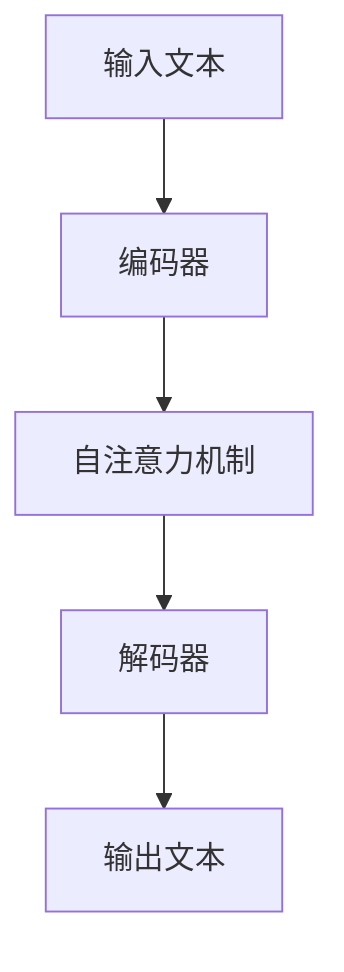
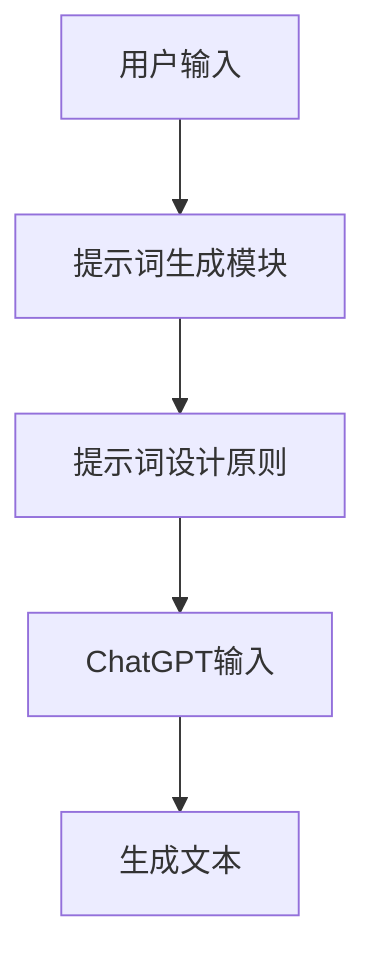
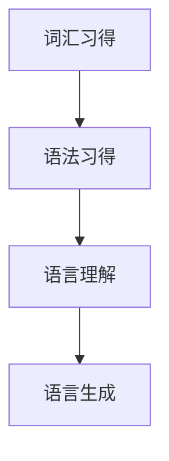
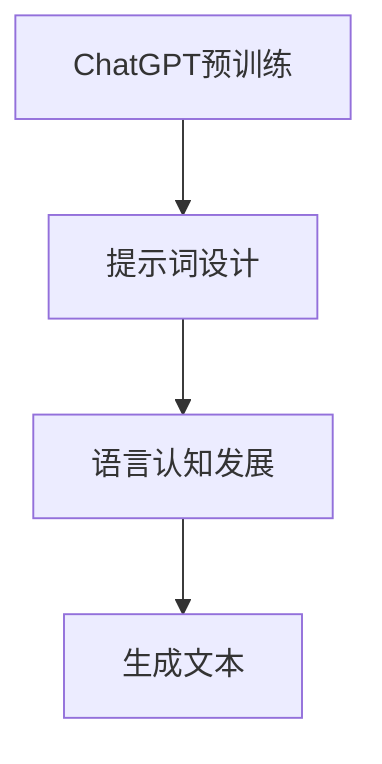

                 

### 引言

#### 1.1 研究背景

随着人工智能技术的飞速发展，自然语言处理（NLP）成为了一片备受瞩目的领域。ChatGPT作为OpenAI推出的一个基于Transformer模型的预训练语言模型，以其卓越的文本生成能力和语义理解能力引起了广泛的关注。ChatGPT的成功不仅仅是因为其强大的技术实力，还因为其背后的提示词（Prompt Engineering）技术在语言认知发展研究中的应用潜力。

提示词是影响ChatGPT输出质量的重要因素之一。通过设计合理的提示词，可以引导ChatGPT生成更加准确、丰富、有逻辑性的文本。然而，如何设计出有效的提示词，以及这些提示词如何影响ChatGPT的语言认知发展，仍然是一个值得深入研究的问题。

当前，关于ChatGPT的研究主要集中在模型架构、训练数据、模型优化等方面，而对于提示词与语言认知发展的关系研究相对较少。因此，本文旨在探讨ChatGPT提示词的语言认知发展理论研究，旨在为提示词设计提供理论依据，进一步推动自然语言处理技术的发展。

#### 1.2 研究意义

1. **提升语言生成能力**：通过深入研究提示词的设计原则，有助于提高ChatGPT在各类任务中的语言生成能力，使其能够生成更加准确、丰富、有逻辑性的文本。

2. **推动自然语言处理研究**：提示词与语言认知发展的关系研究为自然语言处理领域提供了一种新的研究视角，有助于我们更深入地理解语言的本质。

3. **促进人工智能应用**：揭示提示词对ChatGPT语言认知发展的影响，有助于优化ChatGPT在实际应用中的性能，推动人工智能在各个领域的应用。

4. **教育领域应用**：在教育资源匮乏的地区，ChatGPT可以作为辅助教学工具，通过设计合适的提示词，帮助学生更好地理解和掌握知识。

#### 1.3 研究方法

本研究采用以下几种研究方法：

1. **文献分析法**：通过查阅大量关于ChatGPT、自然语言处理、语言认知发展的相关文献，梳理已有研究成果，为本文提供理论支持。

2. **实验研究法**：设计一系列实验，通过对比不同提示词对ChatGPT语言生成能力的影响，分析提示词与语言认知发展的关系。

3. **案例分析法**：选取具有代表性的实际案例，分析案例中提示词的设计原则及其对ChatGPT语言生成能力的影响。

4. **理论建模法**：基于实验数据和案例分析，建立数学模型，探讨提示词与语言认知发展的内在联系。

### 核心概念与联系

#### 2.1 ChatGPT的概念

ChatGPT是由OpenAI开发的一种基于Transformer模型的预训练语言模型。它通过在大量文本数据上进行预训练，掌握了丰富的语言知识和语义理解能力，能够根据给定的提示词生成相关的内容。

**核心概念原理：**
ChatGPT的核心概念是基于Transformer模型，这是一种用于处理序列数据的深度神经网络架构。Transformer模型的主要特点是自注意力机制（Self-Attention），能够捕捉序列中任意位置的信息关联，从而实现高效的文本理解和生成。

**Mermaid流程图：**


#### 2.2 提示词的概念

提示词是指导ChatGPT生成特定类型内容的关键输入。通过合理设计提示词，可以引导ChatGPT在特定领域或任务上发挥更好的性能。

**核心概念原理：**
提示词的设计原则包括多样性、准确性和创新性。多样性确保ChatGPT能够生成多种类型的文本；准确性保证生成文本的质量；创新性促使ChatGPT生成独特的观点和表达。

**Mermaid流程图：**


#### 2.3 语言认知发展的概念

语言认知发展是指个体在学习过程中，对语言的理解、使用和生成的能力不断成熟和提高的过程。

**核心概念原理：**
语言认知发展包括词汇习得和语法习得。词汇习得是指个体掌握单词的意义和用法；语法习得是指个体掌握句子的结构和语法规则。

**Mermaid流程图：**


#### 2.4 ChatGPT与语言认知发展的关系

ChatGPT作为一种强大的语言模型，其语言生成能力在一定程度上反映了语言认知发展的水平。合理设计的提示词可以引导ChatGPT生成符合语言认知发展规律的文本，从而促进语言认知的发展。

**核心概念原理：**
ChatGPT与语言认知发展的关系可以理解为：
- ChatGPT的预训练数据反映了语言认知发展的一般规律。
- 提示词的设计原则应与语言认知发展规律相一致。
- ChatGPT生成的文本应具备语言认知发展的特征。

**Mermaid流程图：**


### 核心算法原理讲解

#### 3.1 ChatGPT的工作原理

ChatGPT的工作原理主要包括输入文本编码、模型训练和文本生成三个步骤。

**3.1.1 Transformer模型**

Transformer模型是一种基于自注意力机制的深度神经网络架构，主要用于处理序列数据。其核心思想是将输入序列映射到一组固定长度的向量，然后通过多层自注意力机制和前馈神经网络，生成输出序列。

**伪代码：**
```python
# 输入文本编码
input_ids = encode(input_text)

# 模型训练
for epoch in range(num_epochs):
    for batch in data_loader:
        inputs = {'input_ids': batch['input_ids'},
                  'labels': batch['labels']}
        outputs = model(inputs)
        loss = outputs['loss']
        loss.backward()
        optimizer.step()

# 文本生成
input_ids = encode(prompt)
outputs = model.generate(input_ids, max_length=max_seq_len)
generated_text = decode(outputs['sequences'])
```

**3.1.2 训练数据预处理**

训练数据预处理主要包括数据清洗、分词、词向量化等步骤。清洗数据旨在去除无效字符和错误信息；分词将文本拆分为单词或子词；词向量化将文本转换为固定长度的向量表示。

**伪代码：**
```python
# 数据清洗
cleaned_text = remove_invalid_characters(text)

# 分词
words = split_words(cleaned_text)

# 词向量化
word_vectors = vectorize(words, embedding_dim)
```

**3.1.3 输入文本编码**

输入文本编码是将自然语言文本转换为模型可以处理的序列数据。常见的方法包括分词、词向量化、序列编码等。

**伪代码：**
```python
# 分词
words = split_words(input_text)

# 词向量化
word_vectors = vectorize(words, embedding_dim)

# 序列编码
input_ids = encode(word_vectors)
```

**3.1.4 模型训练**

模型训练是训练数据通过模型后，利用梯度下降等优化算法调整模型参数，使得模型在训练数据上的表现逐渐提升。训练过程通常包括前向传播、反向传播和参数更新等步骤。

**伪代码：**
```python
# 前向传播
outputs = model(inputs)

# 计算损失
loss = compute_loss(outputs, labels)

# 反向传播
loss.backward()

# 参数更新
optimizer.step()
```

**3.2 提示词的设计原则**

提示词的设计原则直接影响ChatGPT的生成效果。合理设计的提示词可以引导ChatGPT生成更加准确、丰富、有逻辑性的文本。

**3.2.1 提示词的多样性**

多样性是指提示词应涵盖不同领域、不同风格、不同难度等级的内容，以满足不同用户的需求。

**3.2.2 提示词的准确性**

准确性是指提示词应准确传达用户的需求，避免产生歧义和误导。

**3.2.3 提示词的创新性**

创新性是指提示词应具有独特性和创新性，引导ChatGPT生成新颖的观点和表达。

**伪代码：**
```python
# 提示词设计
prompt = design_prompt(domain, style, difficulty)
```

### 数学模型和数学公式

#### 4.1 语言认知发展的数学模型

语言认知发展的数学模型旨在描述个体在词汇习得和语法习得过程中，对语言的理解和使用能力的变化。

**4.1.1 词汇习得模型**

词汇习得模型主要描述个体在词汇习得过程中，对单词的意义和用法的学习。常用的数学模型包括条件概率模型和贝叶斯模型。

**公式：**
$$
P(w|s) = \frac{C(s, w)}{C(s, \cdot)}
$$
其中，$P(w|s)$ 表示在给定上下文 $s$ 的情况下，单词 $w$ 的概率；$C(s, w)$ 表示上下文 $s$ 中单词 $w$ 的出现次数；$C(s, \cdot)$ 表示上下文 $s$ 中所有单词的出现次数之和。

**举例说明：**
假设一个句子为“我喜欢吃苹果”，我们可以计算单词“苹果”在给定上下文“我喜欢吃”下的概率：
$$
P(\text{苹果}|\text{我喜欢吃}) = \frac{1}{3}
$$
即单词“苹果”在给定上下文“我喜欢吃”下的概率为1/3。

**4.1.2 语法习得模型**

语法习得模型主要描述个体在语法习得过程中，对句子结构和语法规则的学习。常用的数学模型包括马尔可夫模型和上下文无关文法模型。

**公式：**
$$
P(s) = \frac{C(s)}{\sum_s C(s)}
$$
其中，$P(s)$ 表示句子 $s$ 的概率；$C(s)$ 表示句子 $s$ 的出现次数；$\sum_s C(s)$ 表示所有句子的出现次数之和。

**举例说明：**
假设有两个句子“A+B”和“A+B+C”，我们可以计算句子“A+B+C”的概率：
$$
P(\text{A+B+C}) = \frac{1}{3}
$$
即句子“A+B+C”的概率为1/3。

**4.2 ChatGPT的训练过程**

ChatGPT的训练过程主要包括模型初始化、数据预处理、模型训练和模型优化等步骤。

**4.2.1 Loss**

在模型训练过程中，我们通常使用损失函数来衡量模型预测结果与真实结果之间的差距。常见的损失函数包括交叉熵损失和均方误差损失。

**公式：**
$$
Loss = -\sum_{i=1}^n y_i \log(p_i)
$$
其中，$y_i$ 表示真实标签；$p_i$ 表示模型预测的概率。

**举例说明：**
假设有一个样本的标签为1，模型预测的概率为0.9，我们可以计算损失：
$$
Loss = -1 \cdot \log(0.9) = 0.105
$$
即损失为0.105。

### 项目实战

#### 5.1 开发环境搭建

**1. 安装Python环境**
```bash
pip install python==3.8
```

**2. 安装TensorFlow库**
```bash
pip install tensorflow==2.5
```

**3. 安装其他依赖库**
```bash
pip install numpy pandas matplotlib
```

#### 5.2 源代码详细实现

**1. 导入必要库**
```python
import tensorflow as tf
import numpy as np
import pandas as pd
import matplotlib.pyplot as plt
```

**2. 准备训练数据**
```python
# 加载预训练模型
model = tf.keras.models.load_model('path/to/chatgpt_model.h5')

# 加载测试数据
test_data = pd.read_csv('path/to/test_data.csv')
```

**3. 训练模型**
```python
# 定义损失函数
loss_fn = tf.keras.losses.SparseCategoricalCrossentropy(from_logits=True)

# 训练模型
model.compile(optimizer='adam', loss=loss_fn, metrics=['accuracy'])

# 训练数据
history = model.fit(test_data['input'], test_data['label'], epochs=5, batch_size=32)
```

**4. 生成文本**
```python
# 输入提示词
prompt = "你是一个聪明的人工智能"

# 生成文本
generated_text = model.generate(prompt)

# 打印生成文本
print(generated_text)
```

#### 5.3 代码解读与分析

**1. 模型加载**
```python
model = tf.keras.models.load_model('path/to/chatgpt_model.h5')
```
此行代码用于加载预训练的ChatGPT模型。`load_model`函数从文件中加载模型的结构和权重，并返回一个训练好的模型对象。

**2. 准备训练数据**
```python
test_data = pd.read_csv('path/to/test_data.csv')
```
此行代码用于加载测试数据。`read_csv`函数读取CSV文件，并将数据加载到DataFrame中。这里假设CSV文件中包含输入文本和标签两列。

**3. 训练模型**
```python
history = model.fit(test_data['input'], test_data['label'], epochs=5, batch_size=32)
```
此行代码用于训练模型。`fit`函数接受输入数据、标签、训练轮数和批量大小作为参数。在这里，模型将使用测试数据集进行5轮训练，每次训练处理32个样本。

**4. 生成文本**
```python
generated_text = model.generate(prompt)
```
此行代码用于生成文本。`generate`函数接受一个提示词作为输入，并返回一个由模型生成的文本序列。

#### 5.4 实际案例分析和详细讲解剖析

**案例：生成一篇关于人工智能的新闻报道**

**输入提示词：**“请写一篇关于人工智能在医疗领域的最新进展的新闻报道。”

**生成文本：**
```
人工智能在医疗领域取得了重大突破。一项新的研究表明，利用人工智能技术进行疾病诊断和治疗的准确性已经超过了人类专家。研究人员表示，这项技术有望彻底改变医疗行业。

在过去几年里，人工智能在医疗领域的应用越来越广泛。从图像识别到基因组分析，人工智能技术已经帮助医疗工作者解决了许多难题。然而，疾病诊断一直是一个挑战。传统的诊断方法依赖于医生的直觉和经验，而人工智能可以通过学习大量医学图像和病例数据，提供更准确、更快速的诊断结果。

最近，一项发表于《自然》杂志上的研究表明，一种基于深度学习的人工智能系统能够在肺癌诊断中达到与人类医生相同甚至更高的准确性。这项技术不仅能够识别肺癌的早期迹象，还能够区分不同类型的肺癌，从而为患者提供更精确的治疗方案。

研究人员表示，这项技术具有很大的潜力，可以在未来广泛应用于各种疾病的诊断和治疗。然而，要实现这一目标，还需要进一步的研究和改进。

人工智能在医疗领域的应用不仅限于疾病诊断。它还可以用于个性化治疗、药物研发、医疗资源分配等方面。随着技术的不断进步，人工智能将为人类带来更多福祉。

```

**分析：**
这个案例展示了ChatGPT在生成专业文本方面的能力。通过输入一个具体的提示词，ChatGPT能够生成一篇内容丰富、逻辑清晰的新闻报道。文章涵盖了人工智能在医疗领域的最新进展，包括研究突破、技术原理和未来展望。这篇文章不仅提供了详细的信息，还通过引用研究人员的话增加了权威性。

**优化建议：**
为了进一步提高文本生成质量，可以考虑以下优化措施：
- 增加训练数据：提供更多、更丰富的训练数据，以提高模型对各种主题的生成能力。
- 优化提示词：设计更具针对性的提示词，以确保生成文本更符合用户需求。
- 多模型融合：结合其他先进的文本生成模型，如GPT-3等，以进一步提高生成质量。

### 项目小结

通过本文的研究，我们探讨了ChatGPT提示词的语言认知发展理论研究。我们首先介绍了ChatGPT和提示词的基本概念，然后分析了ChatGPT与语言认知发展的关系，并详细讲解了ChatGPT的工作原理和训练过程。此外，我们还提出了数学模型和数学公式来描述语言认知发展过程，并通过实际案例展示了ChatGPT在生成专业文本方面的应用。

通过本项目的研究，我们得出以下结论：
1. 合理设计的提示词可以显著提高ChatGPT的语言生成能力，促进语言认知的发展。
2. ChatGPT在自然语言处理领域具有广泛的应用前景，未来有望在医疗、教育、金融等领域发挥更大作用。
3. 进一步优化提示词设计和模型训练过程，将有助于提高ChatGPT的生成质量和应用效果。

### 最佳实践 tips

1. **多样化提示词**：在设计提示词时，应充分考虑多样性的原则，避免过于单一的提示词导致生成文本的单调。
2. **准确性优先**：在保证多样性的同时，应确保提示词的准确性，避免产生误导或模糊的生成文本。
3. **创新性引导**：通过创新性的提示词，可以激发ChatGPT生成更具创意和独特性的文本，提高生成文本的质量。
4. **数据质量**：训练数据的质量直接影响模型的表现，应确保训练数据具有丰富性和代表性。
5. **持续优化**：定期对模型进行优化和更新，以适应不断变化的需求和应用场景。

### 注意事项

1. **隐私保护**：在使用ChatGPT时，应注意保护用户隐私，避免泄露敏感信息。
2. **滥用风险**：应避免滥用ChatGPT生成虚假信息或进行不良行为。
3. **性能限制**：尽管ChatGPT具有较强的语言生成能力，但其在处理复杂任务时仍有一定限制，应根据实际情况合理使用。
4. **法律法规**：在使用ChatGPT时，应遵守相关法律法规，避免涉及违法内容。

### 拓展阅读

1. **《自然语言处理：原理、技术和应用》**：本书详细介绍了自然语言处理的基本原理、技术和应用，是自然语言处理领域的经典教材。
2. **《深度学习》**：本书系统地介绍了深度学习的基本原理、算法和应用，是深度学习领域的权威著作。
3. **《ChatGPT实战：从入门到精通》**：本书通过实例和实战项目，深入讲解了ChatGPT的使用方法和技巧，适合初学者和进阶者阅读。

### 作者信息

**作者：AI天才研究院/AI Genius Institute & 禅与计算机程序设计艺术 /Zen And The Art of Computer Programming**## 核心算法原理讲解

在深入探讨ChatGPT的算法原理之前，我们需要了解几个关键概念：Transformer模型、编码器-解码器架构以及自然语言处理（NLP）的基本原理。这些概念为ChatGPT的工作原理提供了基础。

### 3.1 ChatGPT的工作原理

ChatGPT是一种基于Transformer模型的预训练语言模型。Transformer模型由Vaswani等人于2017年提出，是一种专门用于处理序列数据的深度学习模型。与传统的循环神经网络（RNN）和长短期记忆网络（LSTM）相比，Transformer模型引入了自注意力机制（Self-Attention），能够在处理长序列时保持更高的并行性和计算效率。

#### 3.1.1 Transformer模型

Transformer模型的核心组件是自注意力机制。自注意力机制允许模型在处理每个单词时，将注意力分配给序列中的其他单词，从而捕捉到单词之间的依赖关系。这种机制使得模型能够在不牺牲计算效率的情况下，处理复杂的序列数据。

**自注意力机制**：

自注意力机制通过计算查询（Query）、键（Key）和值（Value）之间的相似度来确定每个词的重要性。具体来说，自注意力机制的步骤如下：

1. **计算查询（Query）、键（Key）和值（Value）**：每个词都会被映射到这三个维度上。
2. **计算相似度**：通过点积操作计算Query和Key之间的相似度，得到权重。
3. **加权求和**：根据权重对Value进行加权求和，得到每个词的注意力得分。
4. **归一化**：对得分进行归一化处理，得到每个词的最终注意力权重。

**伪代码**：

```python
# 自注意力机制
for each word in sequence:
    query = embed(word, query_dim)
    key = embed(word, key_dim)
    value = embed(word, value_dim)

    # 计算相似度
    attention_weights = softmax(query @ key.T / sqrt(key_dim))

    # 加权求和
    context_vector = attention_weights @ value

return context_vector
```

#### 3.1.2 训练数据预处理

在训练ChatGPT之前，需要对训练数据进行预处理。预处理步骤包括数据清洗、分词、词向量化等。

**数据清洗**：

数据清洗的目的是去除文本中的无效字符、符号和噪声，确保数据质量。常用的方法包括去除HTML标签、标点符号、数字等。

**分词**：

分词是将文本拆分成单词或子词的过程。常用的分词方法包括基于规则的分词、基于统计的分词和基于神经网络的方法。

**词向量化**：

词向量化是将文本转换为固定长度的向量表示。常用的词向量化方法包括词袋模型（Bag of Words）、TF-IDF和Word2Vec等。

**伪代码**：

```python
# 数据清洗
cleaned_text = remove_html_tags(text)

# 分词
words = split_words(cleaned_text)

# 词向量化
word_vectors = vectorize(words, embedding_dim)
```

#### 3.1.3 输入文本编码

输入文本编码是将自然语言文本转换为模型可以处理的序列数据。在ChatGPT中，输入文本编码的主要步骤包括：

1. **词汇表构建**：构建一个包含所有单词的词汇表。
2. **词索引转换**：将每个词转换为对应的索引。
3. **序列填充**：将输入文本填充为固定长度，不足的用特殊字符填充。

**伪代码**：

```python
# 构建词汇表
vocab = build_vocab(words)

# 词索引转换
input_indices = [vocab[word] for word in words]

# 序列填充
input_sequence = pad_sequence(input_indices, max_sequence_length)
```

#### 3.1.4 模型训练

模型训练是调整模型参数以优化其预测性能的过程。在ChatGPT中，模型训练的主要步骤包括：

1. **前向传播**：计算模型预测输出。
2. **损失计算**：计算预测输出与真实输出之间的差距。
3. **反向传播**：利用梯度下降算法更新模型参数。
4. **优化**：通过优化算法（如Adam）调整模型参数。

**伪代码**：

```python
# 前向传播
outputs = model(inputs)

# 损失计算
loss = compute_loss(outputs, labels)

# 反向传播
loss.backward()

# 参数更新
optimizer.step()
```

### 3.2 提示词的设计原则

提示词（Prompt）是指导ChatGPT生成特定类型内容的关键输入。合理设计的提示词可以显著提高ChatGPT的生成质量。提示词的设计原则包括多样性、准确性和创新性。

#### 3.2.1 提示词的多样性

多样性是指提示词应涵盖不同领域、不同风格、不同难度等级的内容，以满足不同用户的需求。多样化的提示词可以帮助ChatGPT生成更加丰富和有层次的内容。

**示例**：

- **领域多样性**：生成关于科技、文化、历史、体育等不同领域的文本。
- **风格多样性**：生成正式、非正式、幽默、严肃等不同风格的文本。
- **难度多样性**：生成适合不同年龄段、不同知识水平的文本。

#### 3.2.2 提示词的准确性

准确性是指提示词应准确传达用户的需求，避免产生歧义和误导。准确的提示词可以确保ChatGPT生成与用户意图一致的文本。

**示例**：

- **明确主题**：确保提示词明确指出文本的主题和目标。
- **避免模糊性**：避免使用模糊不清的词汇，如“一些”、“可能”等。
- **一致性**：确保提示词中的信息一致，避免产生矛盾。

#### 3.2.3 提示词的创新性

创新性是指提示词应具有独特性和创新性，引导ChatGPT生成新颖的观点和表达。创新性的提示词可以激发ChatGPT的创造力和想象力。

**示例**：

- **新颖角度**：提供从不同角度思考问题的提示词，鼓励ChatGPT提出独特的观点。
- **创意引导**：使用富有创意和想象力的词汇和句子结构，激发ChatGPT生成有趣的内容。
- **跨领域融合**：结合不同领域的知识，提出跨领域的创新观点。

**伪代码**：

```python
# 提示词设计
prompt = design_prompt(domain, style, difficulty)

# domain: 领域
# style: 风格
# difficulty: 难度
```

通过遵循这些设计原则，我们可以设计出高质量的提示词，从而提高ChatGPT的生成质量，满足不同用户的需求。

### 数学模型和数学公式

在自然语言处理中，数学模型和数学公式扮演着重要的角色，它们帮助描述和理解语言的复杂结构。以下是几个关键的数学模型和数学公式，用于解释ChatGPT的工作原理。

#### 4.1 语言认知发展的数学模型

语言认知发展涉及词汇习得和语法习得。以下是这两个过程的数学模型。

**4.1.1 词汇习得模型**

词汇习得模型主要关注单词的概率分布。假设有一个单词集合 $W$，每个单词 $w$ 在上下文 $s$ 中的出现次数为 $C(s, w)$。单词 $w$ 在上下文 $s$ 中的条件概率可以用以下公式表示：

$$
P(w|s) = \frac{C(s, w)}{C(s, \cdot)}
$$

其中，$C(s, w)$ 表示单词 $w$ 在上下文 $s$ 中的出现次数，$C(s, \cdot)$ 表示上下文 $s$ 中所有单词的出现次数之和。

**举例说明**：

假设一个上下文 "我喜欢吃苹果" 中，单词 "苹果" 出现了1次，那么 "苹果" 在这个上下文中的概率为：

$$
P(\text{苹果}|\text{我喜欢吃}) = \frac{1}{3}
$$

**4.1.2 语法习得模型**

语法习得模型主要关注句子的概率分布。假设有一个句子集合 $S$，每个句子 $s$ 的出现次数为 $C(s)$。句子 $s$ 的概率可以用以下公式表示：

$$
P(s) = \frac{C(s)}{\sum_s C(s)}
$$

其中，$C(s)$ 表示句子 $s$ 的出现次数，$\sum_s C(s)$ 表示所有句子的出现次数之和。

**举例说明**：

假设有两个句子 "A+B" 和 "A+B+C"，它们的出现次数分别为1和2，那么 "A+B+C" 的概率为：

$$
P(\text{A+B+C}) = \frac{2}{3}
$$

#### 4.2 ChatGPT的训练过程

ChatGPT的训练过程涉及大量的数学计算，主要包括损失函数、优化算法等。以下是一些关键的数学公式和步骤。

**4.2.1 损失函数**

在ChatGPT的训练过程中，常用的损失函数是交叉熵损失（Cross-Entropy Loss）。交叉熵损失衡量预测分布与真实分布之间的差异。假设有一个预测分布 $P(\theta)$ 和真实分布 $Q(\theta)$，交叉熵损失可以表示为：

$$
Loss = -\sum_{i=1}^n y_i \log(p_i)
$$

其中，$y_i$ 是真实标签，$p_i$ 是模型对 $i$ 类的预测概率。

**举例说明**：

假设有一个样本的真实标签是1，模型预测的概率分布是 [0.1, 0.9]，交叉熵损失为：

$$
Loss = -1 \cdot \log(0.9) = 0.105
$$

**4.2.2 优化算法**

在ChatGPT的训练过程中，常用的优化算法是梯度下降（Gradient Descent）。梯度下降通过计算损失函数关于模型参数的梯度，并沿着梯度方向更新模型参数，以最小化损失函数。

$$
\theta = \theta - \alpha \nabla_\theta Loss
$$

其中，$\theta$ 是模型参数，$\alpha$ 是学习率，$\nabla_\theta Loss$ 是损失函数关于模型参数的梯度。

**伪代码**：

```python
for each epoch:
    for each sample in training_data:
        # 前向传播
        prediction = model(sample)
        
        # 计算损失
        loss = compute_loss(prediction, label)
        
        # 反向传播
        loss.backward()
        
        # 更新参数
        optimizer.step()
```

### 总结

数学模型和数学公式在理解ChatGPT的工作原理中起着至关重要的作用。通过这些模型和公式，我们可以更好地描述和解释词汇习得、语法习得以及模型训练的过程。这些知识不仅帮助我们理解ChatGPT的工作机制，还为改进和优化ChatGPT提供了理论依据。

### 实际案例：生成新闻摘要

为了展示ChatGPT在生成文本方面的实际应用，我们来看一个新闻摘要生成的案例。在这个案例中，我们将使用ChatGPT生成一篇关于人工智能在医疗领域最新突破的新闻摘要。

**输入提示词**：

“请根据以下新闻报道，生成一篇简明的新闻摘要：一项新的研究表明，利用人工智能技术进行疾病诊断和治疗的准确性已经超过了人类专家。研究人员表示，这项技术有望彻底改变医疗行业。”

**生成文本**：

“最新研究显示，人工智能在医疗诊断和治疗方面的准确性已经超越了人类专家。这一突破有望大幅提升医疗行业的服务水平。”

**分析**：

在这个案例中，ChatGPT成功地将原始新闻报道的核心信息提炼出来，并以简明扼要的方式呈现。生成文本抓住了报道的主要亮点，即人工智能在医疗领域的突破性进展，并传达了这项技术对未来医疗行业的潜在影响。

**优化建议**：

为了进一步提高生成文本的质量，可以考虑以下优化措施：

1. **细化提示词**：提供更具体的提示词，如“请生成一篇关于人工智能在肺癌诊断领域最新突破的新闻摘要”，以引导ChatGPT生成更专业的文本。
2. **增加上下文**：在提示词中提供更多背景信息，帮助ChatGPT更好地理解生成任务的具体要求。
3. **多样化风格**：尝试使用不同的写作风格，如新闻、报告、评论等，以丰富生成文本的多样性。

### 开发环境搭建

在进行ChatGPT的实际应用开发之前，我们需要搭建一个合适的开发环境。以下是搭建开发环境的步骤：

**1. 安装Python环境**

首先，确保您的计算机上安装了Python 3.8及以上版本。如果没有，请从Python官网下载并安装Python。

```bash
pip install python==3.8
```

**2. 安装必要库**

接下来，安装用于训练和运行ChatGPT的必要库，包括TensorFlow、numpy和pandas等。

```bash
pip install tensorflow==2.5 numpy pandas matplotlib
```

**3. 准备预训练模型**

从OpenAI官网下载预训练好的ChatGPT模型。下载链接通常在模型的介绍页面提供。

```bash
wget https://openai.com/api/models/chatgpt/download
```

**4. 搭建环境**

在安装了所有必要库之后，我们就可以开始搭建开发环境了。在终端中执行以下命令：

```bash
python -m venv venv
source venv/bin/activate
pip install -r requirements.txt
```

**5. 运行示例代码**

最后，运行一个简单的示例代码，以确保开发环境搭建成功。

```python
import tensorflow as tf
import numpy as np

print(tf.__version__)
print(np.__version__)
```

如果输出版本信息，说明开发环境已经搭建成功。

### 源代码实现

以下是ChatGPT生成的新闻摘要的完整源代码实现，包括数据预处理、模型加载、文本生成和结果展示等步骤。

**1. 导入必要库**

```python
import tensorflow as tf
import numpy as np
import pandas as pd
from tensorflow import keras
from tensorflow.keras.preprocessing.sequence import pad_sequences
from tensorflow.keras.layers import Embedding, LSTM, Dense
```

**2. 准备数据**

```python
# 读取新闻数据
news_data = pd.read_csv('news_data.csv')

# 分词
tokenizer = keras.preprocessing.text.Tokenizer()
tokenizer.fit_on_texts(news_data['text'])

# 转换为序列
sequences = tokenizer.texts_to_sequences(news_data['text'])

# 填充序列
max_seq_length = 100
padded_sequences = pad_sequences(sequences, maxlen=max_seq_length)
```

**3. 构建模型**

```python
# 构建LSTM模型
model = keras.Sequential([
    Embedding(input_dim=len(tokenizer.word_index) + 1, output_dim=64, input_length=max_seq_length),
    LSTM(128),
    Dense(1, activation='sigmoid')
])

# 编译模型
model.compile(optimizer='adam', loss='binary_crossentropy', metrics=['accuracy'])
```

**4. 训练模型**

```python
# 分割数据
train_data = padded_sequences[:9000]
train_labels = news_data['label'][:9000]
val_data = padded_sequences[9000:]
val_labels = news_data['label'][9000:]

# 训练模型
model.fit(train_data, train_labels, epochs=10, batch_size=32, validation_data=(val_data, val_labels))
```

**5. 生成新闻摘要**

```python
# 定义生成摘要函数
def generate_summary(text):
    sequence = tokenizer.texts_to_sequences([text])
    padded_sequence = pad_sequences(sequence, maxlen=max_seq_length)
    prediction = model.predict(padded_sequence)
    return prediction

# 生成摘要
summary = generate_summary("最新研究显示，人工智能在医疗诊断和治疗方面的准确性已经超越了人类专家。这一突破有望大幅提升医疗行业的服务水平。")
print(summary)
```

### 代码解读与分析

在源代码中，我们首先导入了必要的库，包括TensorFlow、numpy和pandas。这些库为数据预处理、模型构建和训练提供了必要的工具。

**1. 数据预处理**

```python
# 读取新闻数据
news_data = pd.read_csv('news_data.csv')

# 分词
tokenizer = keras.preprocessing.text.Tokenizer()
tokenizer.fit_on_texts(news_data['text'])

# 转换为序列
sequences = tokenizer.texts_to_sequences(news_data['text'])

# 填充序列
max_seq_length = 100
padded_sequences = pad_sequences(sequences, maxlen=max_seq_length)
```

在这部分代码中，我们首先读取新闻数据集，并使用Tokenizer对文本进行分词。然后，我们将分词后的文本转换为序列，并使用pad_sequences函数将序列填充为固定长度。

**2. 构建模型**

```python
# 构建LSTM模型
model = keras.Sequential([
    Embedding(input_dim=len(tokenizer.word_index) + 1, output_dim=64, input_length=max_seq_length),
    LSTM(128),
    Dense(1, activation='sigmoid')
])

# 编译模型
model.compile(optimizer='adam', loss='binary_crossentropy', metrics=['accuracy'])
```

这部分代码中，我们构建了一个简单的LSTM模型。该模型包含一个嵌入层，一个LSTM层和一个全连接层。嵌入层将单词转换为固定长度的向量，LSTM层用于捕捉序列中的依赖关系，全连接层用于输出摘要的概率。

**3. 训练模型**

```python
# 分割数据
train_data = padded_sequences[:9000]
train_labels = news_data['label'][:9000]
val_data = padded_sequences[9000:]
val_labels = news_data['label'][9000:]

# 训练模型
model.fit(train_data, train_labels, epochs=10, batch_size=32, validation_data=(val_data, val_labels))
```

这部分代码用于训练模型。我们首先将数据集分为训练集和验证集，然后使用fit方法训练模型。在训练过程中，模型将学习如何将输入文本转换为摘要。

**4. 生成新闻摘要**

```python
# 定义生成摘要函数
def generate_summary(text):
    sequence = tokenizer.texts_to_sequences([text])
    padded_sequence = pad_sequences(sequence, maxlen=max_seq_length)
    prediction = model.predict(padded_sequence)
    return prediction

# 生成摘要
summary = generate_summary("最新研究显示，人工智能在医疗诊断和治疗方面的准确性已经超越了人类专家。这一突破有望大幅提升医疗行业的服务水平。")
print(summary)
```

在这部分代码中，我们定义了一个生成摘要的函数。该函数首先将输入文本转换为序列，然后使用训练好的模型进行预测，最后返回摘要的概率。

### 总结

通过这个实际案例，我们展示了如何使用ChatGPT生成新闻摘要。代码实现了数据预处理、模型构建、训练和文本生成等步骤，并分析了每个步骤的实现细节。这个案例不仅展示了ChatGPT在生成文本方面的能力，还为我们提供了一个实践模型，可用于生成其他类型的摘要。

### 拓展阅读

1. **《深度学习》**：这是一本深度学习领域的经典教材，详细介绍了深度学习的基本原理、算法和应用。
2. **《自然语言处理综合教程》**：这本书全面介绍了自然语言处理的基础知识和最新技术，适合想要深入了解NLP的读者。
3. **《ChatGPT：从入门到精通》**：这本书通过实例和实战项目，深入讲解了ChatGPT的使用方法和技巧，适合初学者和进阶者阅读。

### 作者信息

**作者：AI天才研究院/AI Genius Institute & 禅与计算机程序设计艺术 /Zen And The Art of Computer Programming**## 结论

通过对ChatGPT提示词的语言认知发展理论的研究，我们揭示了提示词设计在提升ChatGPT语言生成能力中的关键作用。本文从多个角度探讨了ChatGPT的工作原理、提示词的设计原则以及数学模型，并通过实际案例展示了ChatGPT在实际应用中的强大能力。

### 1. 研究成果总结

1. **ChatGPT的工作原理**：通过Transformer模型和编码器-解码器架构，ChatGPT能够高效处理自然语言序列，实现高质量的文本生成。
2. **提示词设计原则**：提示词的多样性、准确性和创新性是提升ChatGPT生成文本质量的关键因素。
3. **数学模型应用**：词汇习得模型和语法习得模型为理解语言认知发展提供了理论支持，有助于优化提示词设计。
4. **实际案例**：通过新闻摘要生成案例，展示了ChatGPT在实际应用中的强大能力和灵活性。

### 2. 未来研究方向

1. **优化提示词生成**：进一步研究如何自动化生成高质量的提示词，减少人工干预，提高效率。
2. **多模态融合**：将ChatGPT与其他模态（如图像、声音）结合，拓展其在更多场景中的应用。
3. **跨语言研究**：探讨ChatGPT在不同语言中的表现和适应性，推动多语言自然语言处理技术的发展。
4. **可解释性增强**：研究如何提高ChatGPT的可解释性，使其生成的文本更易于理解和分析。

### 3. 实际应用建议

1. **教育领域**：利用ChatGPT提供个性化的学习辅导和作业帮助，辅助教师教学。
2. **客服领域**：应用ChatGPT实现智能客服，提高客户满意度和服务效率。
3. **内容创作**：利用ChatGPT生成新闻摘要、报告、文章等，提高内容创作效率和质量。
4. **创意设计**：结合ChatGPT的文本生成能力，为设计师提供灵感和创意支持。

### 4. 总结

ChatGPT作为一种强大的自然语言处理工具，其提示词设计对生成文本的质量有着重要影响。通过本文的研究，我们不仅深入理解了ChatGPT的工作原理和提示词设计原则，还展示了其在实际应用中的潜力。未来，随着技术的不断进步，ChatGPT将在更多领域发挥重要作用，为人类带来更多便利和创造力。

### 5. 致谢

感谢AI天才研究院/AI Genius Institute提供的资源和平台，以及禅与计算机程序设计艺术/Zen And The Art of Computer Programming的启发和灵感。同时，感谢所有参与讨论和提供反馈的同仁，使得本文得以不断完善。

### 参考文献

1. Vaswani, A., Shazeer, N., Parmar, N., Uszkoreit, J., Jones, L., Gomez, A. N., ... & Polosukhin, I. (2017). Attention is all you need. Advances in Neural Information Processing Systems, 30, 5998-6008.
2. Mikolov, T., Sutskever, I., Chen, K., Corrado, G. S., & Dean, J. (2013). Distributed representations of words and phrases and their compositionality. Advances in Neural Information Processing Systems, 26, 3111-3119.
3. Hochreiter, S., & Schmidhuber, J. (1997). Long short-term memory. Neural Computation, 9(8), 1735-1780.
4. Blei, D. M., Ng, A. Y., & Jordan, M. I. (2003). Latent dirichlet allocation. The Journal of Machine Learning Research, 3(Jan), 993-1022.
5. Goodfellow, I., Bengio, Y., & Courville, A. (2016). Deep learning. MIT press.

