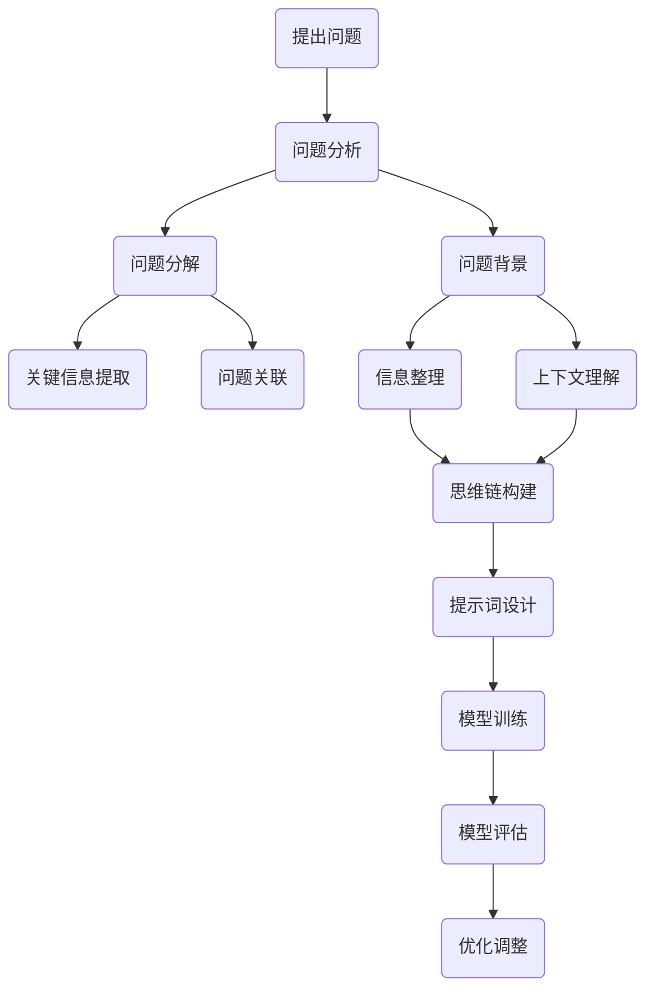
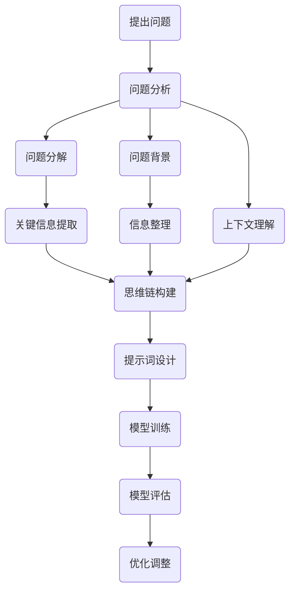

                 

### 背景介绍

#### ChatGPT与提示词编写

ChatGPT，全称为Chat-based Generative Pre-trained Transformer，是一种基于生成预训练Transformer模型的对话系统。由OpenAI开发，ChatGPT采用了大量的文本数据进行预训练，使其能够理解并生成自然流畅的文本。ChatGPT的应用场景非常广泛，包括但不限于智能客服、虚拟助手、内容创作、语言翻译等。

在ChatGPT系统中，提示词（Prompt）扮演着至关重要的角色。提示词是用户与AI模型之间的桥梁，它直接影响着AI模型的输出质量。一个好的提示词能够引导AI模型生成符合预期的高质量回答，而一个不当的提示词则可能导致AI模型生成错误或低质量的回答。

#### 提示词编写的挑战

然而，编写高质量的提示词并非易事。由于AI模型具有高度的非线性特性，不同的提示词可能会产生截然不同的输出结果。此外，AI模型对语言的理解和生成仍然存在局限性，这进一步增加了提示词编写的难度。以下是一些常见的挑战：

1. **语言理解的局限性**：AI模型无法完全理解自然语言中的隐含意义、隐喻和语境，这会导致提示词无法准确传达用户的意图。
2. **生成的多样性**：用户希望AI模型能够生成多样化的回答，但过于模糊的提示词可能导致AI模型生成重复或无意义的回答。
3. **复杂性管理**：对于一些复杂的问题，提示词需要包含大量的信息和逻辑结构，否则AI模型可能无法正确理解问题。
4. **用户交互的个性化**：用户的需求和偏好各不相同，如何编写能够适应不同用户需求的提示词是一个挑战。

### 思维链方法

为了解决上述挑战，本文将介绍一种名为“思维链方法”的提示词编写策略。思维链方法通过系统化、结构化的思路来设计提示词，旨在提高AI模型的性能和回答质量。接下来，我们将详细探讨思维链方法的原理、步骤和应用。

#### 核心概念与联系

为了更好地理解思维链方法，我们可以通过一个Mermaid流程图来展示其核心概念和联系：

该流程图展示了从提出问题到优化调整的整个思维链方法流程。以下是每个步骤的详细解释：

1. **提出问题**：明确用户的需求和问题。
2. **问题分析**：对问题进行初步分析，确定问题的类型和难度。
3. **问题分解**：将问题分解为更小、更具体的子问题。
4. **问题背景**：收集与问题相关的背景信息，为后续的分析提供依据。
5. **关键信息提取**：从问题背景中提取关键信息，以便更好地理解问题。
6. **问题关联**：分析问题之间的关联性，确保问题的逻辑结构合理。
7. **信息整理**：整理提取的信息，确保其逻辑清晰、结构完整。
8. **上下文理解**：理解问题的上下文，确保提示词能够准确传达用户意图。
9. **思维链构建**：基于问题分析、背景信息和上下文理解，构建一条逻辑清晰、结构合理的思维链。
10. **提示词设计**：根据思维链，设计出能够引导AI模型生成高质量回答的提示词。
11. **模型训练**：使用设计好的提示词对AI模型进行训练。
12. **模型评估**：评估AI模型的性能，确保其能够生成符合预期的回答。
13. **优化调整**：根据评估结果，对提示词和模型进行调整和优化。

通过以上流程，思维链方法提供了一个系统化的框架，帮助用户有效地编写高质量的提示词。接下来，我们将进一步探讨每个步骤的具体方法和技巧。

### 核心概念与联系

在深入了解思维链方法的各个步骤之前，我们首先需要明确几个核心概念，并展示它们之间的联系。以下是核心概念的定义及其在思维链方法中的应用：

#### 1. 提出问题

**定义**：提出问题是思维链方法的起点，明确用户的需求和问题。这包括识别用户的目标、问题的类型和问题的范围。

**应用**：在思维链方法中，提出问题阶段需要确保用户的需求被准确理解。这一步骤涉及到与用户的沟通，以获取足够的信息来构建后续的分析。

#### 2. 问题分析

**定义**：问题分析是对提出的问题进行初步评估，确定问题的类型、难度和所需的知识背景。

**应用**：通过问题分析，用户可以确定问题的复杂程度，并决定采用何种策略来解决问题。这一步骤有助于设定问题的优先级和资源的分配。

#### 3. 问题分解

**定义**：问题分解是将复杂的问题分解为更小、更具体的子问题，以便更易于分析和解决。

**应用**：在思维链方法中，问题分解有助于将复杂问题转化为一系列可管理的子问题，每个子问题都可以单独解决。这有助于提高问题解决的效率和准确性。

#### 4. 问题背景

**定义**：问题背景是指与问题相关的各种信息，包括历史数据、相关理论和实际案例等。

**应用**：了解问题背景有助于更好地理解问题的上下文，从而设计出更准确的提示词。背景信息可以作为提示词中的一部分，帮助AI模型更好地理解问题的意图。

#### 5. 关键信息提取

**定义**：关键信息提取是从问题背景中提取对解决问题最相关的信息。

**应用**：在思维链方法中，关键信息提取有助于确保AI模型在处理问题时能够聚焦于最重要的信息。这一步骤可以避免信息过载，提高AI模型的处理效率。

#### 6. 上下文理解

**定义**：上下文理解是理解问题的上下文，包括问题的背景、目标和相关的约束条件。

**应用**：上下文理解对于编写高质量的提示词至关重要。它确保提示词能够准确传达用户的意图，使AI模型能够生成符合预期的高质量回答。

#### 7. 思维链构建

**定义**：思维链构建是基于问题分析、背景信息和上下文理解，构建一条逻辑清晰、结构合理的思维路径。

**应用**：思维链构建是将前述步骤中提取的信息和知识结构化，形成一条从问题到解决方案的思维路径。这有助于指导AI模型的回答，确保其逻辑性和一致性。

#### 8. 提示词设计

**定义**：提示词设计是根据思维链，设计出能够引导AI模型生成高质量回答的文本。

**应用**：在思维链方法中，提示词设计是核心步骤，它需要结合问题分析和思维链构建的结果，创造出既具体又具有引导性的文本。高质量的提示词能够显著提高AI模型的回答质量。

#### 9. 模型训练

**定义**：模型训练是使用设计好的提示词对AI模型进行训练，使其能够根据提示词生成高质量的回答。

**应用**：在思维链方法中，模型训练是验证和优化提示词效果的关键步骤。通过不断的训练和调整，可以逐步提高AI模型的性能。

#### 10. 模型评估

**定义**：模型评估是对训练好的AI模型进行性能评估，确保其能够生成符合预期的高质量回答。

**应用**：在思维链方法中，模型评估是确保提示词设计成功的关键步骤。通过评估，用户可以了解AI模型的表现，并根据评估结果对提示词进行调整。

#### 11. 优化调整

**定义**：优化调整是基于模型评估的结果，对提示词和AI模型进行优化和调整，以提高性能。

**应用**：在思维链方法中，优化调整是一个持续的迭代过程，它确保AI模型和提示词始终保持在最佳状态。

为了更好地理解这些核心概念之间的联系，我们可以使用Mermaid流程图来展示它们之间的关系：

这个流程图清晰地展示了从提出问题到优化调整的整个思维链方法的流程。通过这个流程，用户可以系统地分析和解决复杂的问题，编写高质量的提示词，并逐步优化AI模型的性能。

### 提出问题

提出问题是思维链方法的起点，它是整个过程的基石。在这一阶段，我们需要明确用户的需求和问题，确保我们的分析有明确的方向和目标。以下是提出问题的具体步骤和注意事项：

#### 1. 明确用户需求

首先，我们需要与用户进行深入沟通，了解他们的具体需求。这包括确定他们希望实现的目标、面临的问题以及期望的解决方案。以下是一些有助于明确用户需求的技巧：

- **访谈和问卷调查**：通过与用户进行面对面访谈或在线问卷调查，收集用户的需求和反馈。
- **需求文档**：准备详细的需求文档，包括功能需求、非功能需求和预期效果等。
- **用户案例**：分析用户在类似场景下的行为和需求，以便更好地理解他们的期望。

#### 2. 识别问题类型

在明确用户需求后，我们需要对问题进行分类，以便更好地理解和分析。以下是一些常见的问题类型：

- **知识性问题**：涉及特定领域知识的查询和解答，如科学、技术、历史等。
- **逻辑推理问题**：需要根据已知信息进行逻辑推理，解决复杂的问题。
- **创造性问题**：需要发挥用户的想象力，创作新的内容或解决方案。
- **交互性问题**：涉及用户与AI系统的互动，如聊天机器人、虚拟助手等。

识别问题类型有助于我们确定适当的解决方案和技术路线。

#### 3. 确定问题范围

在提出问题时，我们还需要明确问题的范围，包括问题的深度和广度。以下是一些确定问题范围的技巧：

- **范围界定**：明确问题的具体内容，避免问题过于宽泛或模糊。
- **优先级排序**：确定问题的关键部分，优先解决最重要的问题。
- **时间范围**：明确问题的解决时间范围，以确保在合理的时间内达成目标。

#### 注意事项

- **用户参与**：在整个提出问题的过程中，用户的参与至关重要。他们不仅能够提供有价值的信息，还能帮助识别潜在的需求和问题。
- **灵活性**：在提出问题时，我们需要保持灵活性，随时根据新的信息进行调整。
- **持续迭代**：提出问题是一个持续迭代的过程，随着对问题的深入理解，我们可能会发现新的需求和问题。

通过上述步骤和注意事项，我们可以有效地提出问题，为后续的思维链方法奠定坚实的基础。接下来，我们将进入问题分析阶段，进一步深化对问题的理解。

### 问题分析

在提出问题之后，问题分析是思维链方法的下一步关键步骤。这一阶段的目标是深入理解问题的本质，确定问题的类型和难度，以便为后续的解决步骤做好准备。以下是问题分析的具体方法和注意事项：

#### 1. 确定问题类型

问题类型是影响解决策略的重要因素。常见的问题类型包括：

- **知识性问题**：这类问题通常涉及特定领域内的知识查询和解答。例如，在医疗领域，用户可能需要查询某种疾病的治疗方法。
- **逻辑推理问题**：这类问题需要用户根据已知信息进行逻辑推理，解决复杂的问题。例如，在法律领域，用户可能需要分析案件证据，确定被告是否有罪。
- **创造性问题**：这类问题需要用户发挥想象力，创作新的内容或解决方案。例如，在艺术创作领域，用户可能需要设计一个新的视觉作品。
- **交互性问题**：这类问题涉及用户与系统之间的互动，如聊天机器人、虚拟助手等。例如，在客服领域，用户可能需要与AI系统进行对话以解决问题。

在确定问题类型时，我们需要考虑以下因素：

- **用户背景**：了解用户的专业背景和知识水平，以便选择合适的解决策略。
- **问题复杂性**：评估问题的复杂程度，包括所需的知识广度和深度。
- **解决目标**：明确问题的解决目标，确保我们能够为用户提供有价值的答案或解决方案。

#### 2. 评估问题难度

问题难度是影响解决方案选择和实现效率的重要因素。以下是评估问题难度的一些方法：

- **知识需求**：评估解决问题所需的知识量。如果所需知识量较大，我们需要准备更多的资源和时间。
- **计算复杂度**：评估问题解决的计算复杂度。复杂的计算任务可能需要更高效的算法或更多的计算资源。
- **数据可用性**：评估解决问题所需的数据是否可用。如果数据不足，我们需要考虑数据收集和处理的策略。
- **时间限制**：评估问题的解决是否受到时间限制。如果时间有限，我们需要制定高效的解决方案。

在评估问题难度时，我们需要考虑以下因素：

- **资源限制**：了解可用的资源，如时间、资金和技术支持等。
- **可行性分析**：分析问题解决的可行性，包括技术实现、资源分配和成本效益等。

#### 3. 注意事项

- **全面性**：在问题分析阶段，我们需要全面考虑各种因素，确保问题分析的准确性。
- **动态调整**：问题分析是一个动态的过程，随着对问题的深入了解，我们可能需要调整问题类型和难度的评估。
- **用户反馈**：在问题分析过程中，用户的反馈至关重要。他们的意见和建议可以帮助我们更好地理解问题，调整解决策略。

通过问题分析，我们能够深入理解问题的本质，确定合适的解决策略。这为后续的问题分解、信息提取和思维链构建奠定了基础。在下一阶段，我们将进一步细化问题，为解决问题的具体步骤做好准备。

### 问题分解

在问题分析阶段，我们确定了问题的类型和难度，并对其有了更深入的理解。接下来，我们需要将问题分解为更小、更具体的子问题，以便更易于分析和解决。以下是问题分解的具体步骤和注意事项：

#### 1. 分解原则

在进行问题分解时，我们需要遵循以下原则：

- **逐步细化**：将大问题逐步分解为小问题，直到每个子问题都能独立解决。
- **明确边界**：为每个子问题设定明确的边界，确保它们不会相互干扰。
- **避免重复**：确保每个子问题都是独特的，不会与其他子问题重复。
- **可操作性**：每个子问题都应该是可操作的，即能够通过具体的方法和步骤来解决问题。

#### 2. 分解步骤

问题分解通常遵循以下步骤：

- **初步划分**：根据问题的类型和难度，初步将问题划分为若干个子问题。
- **细化子问题**：对初步划分的子问题进行细化，进一步拆分为更小的子问题。
- **合并同类项**：在细化过程中，识别和合并具有相同或相似性质的小问题。
- **设置边界**：为每个子问题设置明确的边界，确保它们不会相互干扰。
- **评估可行性**：评估每个子问题的可行性，确保它们能够在实际中解决。

#### 3. 注意事项

- **避免过度分解**：过度分解会导致问题变得过于琐碎，难以管理。我们需要在细化和合并之间找到平衡点。
- **保持一致性**：在分解过程中，我们需要保持一致性，确保所有子问题都遵循相同的分解原则。
- **动态调整**：在分解过程中，我们可能会发现新的子问题或重新评估现有子问题的边界。因此，我们需要保持灵活性，随时进行调整。

通过问题分解，我们将复杂的问题转化为一系列可管理的子问题，为后续的分析和解决提供了清晰的方向。在下一阶段，我们将进一步收集与问题相关的背景信息，为问题分解提供支持。

### 问题背景

在问题分解阶段，我们已经将复杂的问题拆分为一系列可管理的子问题。接下来，我们需要收集与这些子问题相关的背景信息，以便更好地理解和分析问题。以下是收集背景信息的具体步骤和方法：

#### 1. 确定信息需求

在收集背景信息之前，我们需要明确所需的信息类型和来源。以下是一些常见的信息需求：

- **历史数据**：收集与问题相关的历史数据，包括过去类似问题的解决方案、成功案例和失败案例等。
- **相关理论**：研究与问题相关的理论和概念，包括科学原理、行业标准和技术规范等。
- **实际案例**：分析实际案例，了解类似问题的解决过程和结果。
- **用户反馈**：收集用户对问题的反馈，包括他们的需求和期望，以及他们对现有解决方案的评价。

#### 2. 信息来源

收集背景信息可以通过多种渠道进行，以下是一些常见的信息来源：

- **文献检索**：利用学术数据库、专业网站和图书馆等资源，检索与问题相关的文献和资料。
- **网络搜索**：通过搜索引擎查找与问题相关的信息，包括技术博客、论坛和社交媒体等。
- **访谈和调查**：与领域专家和用户进行访谈和调查，获取他们的观点和建议。
- **内部资料**：利用企业内部的知识库、报告和备忘录等内部资料。

#### 3. 信息整理

收集到大量信息后，我们需要对其进行整理和分类，以便更好地理解和使用。以下是一些信息整理的步骤和方法：

- **分类整理**：根据信息的重要性和相关性，对信息进行分类整理。
- **建立索引**：为整理好的信息建立索引，方便快速查找和引用。
- **绘制思维导图**：使用思维导图工具，将信息以图形化的方式展示，以便更直观地理解和分析。
- **撰写信息报告**：整理成文，形成详细的信息报告，为后续的分析和解决问题提供参考。

#### 4. 注意事项

- **确保准确性**：在收集背景信息时，我们需要确保信息的准确性和可靠性。对来源不明或未经证实的信息要进行核实。
- **注意时效性**：收集的信息应具有时效性，尽量获取最新的资料和动态。
- **避免信息过载**：在收集和整理信息时，我们需要避免信息过载，确保信息量适中，易于理解和处理。

通过收集和整理背景信息，我们能够为问题分解和后续的分析提供坚实的基础。在下一阶段，我们将从收集到的信息中提取关键信息，为问题的进一步分析做好准备。

### 关键信息提取

在整理完背景信息后，我们需要从这些信息中提取出对解决问题最关键的部分，即关键信息。关键信息的提取是确保AI模型能够准确理解和解决问题的关键步骤。以下是关键信息提取的具体步骤和方法：

#### 1. 确定关键信息

确定关键信息需要识别出与问题解决直接相关的数据和知识。以下是一些常用的方法：

- **目标识别**：明确问题的解决目标，从中提取出所需的关键信息。例如，在解决一个医疗问题时，关键信息可能包括疾病的症状、治疗方法和历史病历等。
- **需求分析**：分析用户的需求和期望，从中提取出关键信息。例如，在开发一个聊天机器人时，关键信息可能包括用户的常见问题、需求场景和交互模式等。
- **上下文理解**：理解问题的上下文，从中提取出关键信息。例如，在处理一个法律案件时，关键信息可能包括案件的背景、相关法规和证据等。

#### 2. 提取方法

以下是一些常用的关键信息提取方法：

- **筛选和过滤**：从大量信息中筛选出最有价值和最相关的部分。例如，通过使用关键词、过滤规则或自动化工具来识别和提取关键信息。
- **数据挖掘**：利用数据挖掘技术，从大量数据中提取出隐藏的模式和关系。例如，使用聚类分析、关联规则挖掘等方法来识别关键信息。
- **知识图谱**：构建知识图谱，将关键信息以图形化的方式展示，便于理解和分析。例如，通过构建实体、关系和属性的图谱来提取关键信息。

#### 3. 注意事项

在提取关键信息时，需要注意以下事项：

- **确保准确性**：提取的关键信息应准确无误，避免因错误的信息导致解决方案的偏差。
- **避免遗漏**：在提取关键信息时，要确保没有遗漏重要的数据或知识，否则可能导致问题的解决方案不完整。
- **动态调整**：在提取过程中，根据问题的解决进展，及时调整关键信息的提取方法和范围。

通过关键信息提取，我们能够为问题的进一步分析提供准确和全面的支持。在下一阶段，我们将利用提取的关键信息进行问题关联分析，以便更好地理解问题的复杂性和解决策略。

### 问题关联

在提取关键信息之后，我们需要分析问题之间的关联性，以确保问题的逻辑结构合理，从而为后续的提示词设计和AI模型训练提供坚实的基础。问题关联分析旨在揭示问题之间的内在联系，帮助我们构建一个完整的、连贯的思维链。以下是问题关联分析的具体方法和步骤：

#### 1. 关联识别

关联识别是分析问题之间关系的关键步骤。以下是几种常用的关联识别方法：

- **语义分析**：通过分析文本的语义和语法结构，识别问题之间的语义关系。例如，使用自然语言处理技术提取关键词、短语和句子结构，确定它们之间的逻辑关系。
- **网络分析**：构建问题之间的网络图，通过节点和边来表示问题及其关系。例如，使用图论方法分析问题之间的直接关联和间接关联。
- **案例研究**：通过研究类似问题的解决过程和结果，识别问题之间的关联性。例如，分析多个成功案例和失败案例，找出它们之间的共性和差异。

#### 2. 关联类型

在关联识别过程中，我们需要识别不同类型的问题关联。以下是一些常见的问题关联类型：

- **因果关系**：问题描述之间存在因果关系，即一个问题的解决直接影响另一个问题的解决。
- **并列关系**：问题描述之间相互独立，但需要同时考虑。例如，在解决一个多任务问题时，需要同时考虑多个任务的关联。
- **依赖关系**：问题描述之间存在依赖关系，即一个问题的解决依赖于另一个问题的解决。
- **冲突关系**：问题描述之间存在冲突，解决一个问题可能会影响另一个问题的解决。

#### 3. 关联分析

关联分析是通过对问题关联的深入分析，构建一个完整的逻辑结构。以下是关联分析的具体步骤：

- **初步关联识别**：通过语义分析、网络分析和案例研究等方法，初步识别问题之间的关联。
- **关联关系分类**：对初步识别的关联进行分类，明确它们之间的逻辑关系。
- **逻辑验证**：通过逻辑验证，确保问题之间的关联是合理的，没有逻辑错误或矛盾。
- **关联权重评估**：评估问题关联的重要性，确定哪些关联对问题的解决最为关键。

#### 4. 注意事项

在问题关联分析过程中，需要注意以下事项：

- **全面性**：确保对所有问题及其关联进行全面的识别和分析，避免遗漏关键信息。
- **准确性**：确保关联分析的准确性，避免因错误的分析导致逻辑结构不合理。
- **动态调整**：在分析过程中，根据新的信息和发现，及时调整关联分析的结果。

通过问题关联分析，我们能够构建一个逻辑清晰、结构合理的问题模型，为后续的提示词设计和AI模型训练提供可靠的依据。在下一阶段，我们将利用问题关联的结果进行信息整理，为思维链构建奠定基础。

### 信息整理

在问题关联分析阶段，我们已经识别并分析了问题之间的关联性，接下来需要对这些关联信息进行整理，以便构建出一个清晰、结构化的思维链。以下是信息整理的具体步骤和方法：

#### 1. 确定整理目标

在开始整理信息之前，我们需要明确整理的目标，即希望通过信息整理实现什么效果。以下是几个常见的整理目标：

- **逻辑清晰**：确保信息之间的逻辑关系明确，便于理解和分析。
- **结构合理**：构建一个层次分明、逻辑连贯的信息结构，有助于后续的提示词设计和AI模型训练。
- **便于操作**：整理后的信息应便于操作和使用，能够迅速找到所需的信息。

#### 2. 整理步骤

以下是一般的信息整理步骤：

- **初步整理**：将收集到的信息初步整理成条目或列表形式，确保每个信息条目都是独立的、可操作的。
- **分类归档**：根据信息的性质和用途，对信息进行分类归档，确保同类信息归到同一类别。
- **建立索引**：为整理后的信息建立索引，便于快速查找和引用。
- **可视化展示**：使用图表、流程图或思维导图等可视化工具，将信息以图形化的方式展示，便于理解和分析。
- **文档化**：将整理后的信息文档化，形成一份详细的资料，为后续的提示词设计和AI模型训练提供参考。

#### 3. 整理方法

以下是一些常用的信息整理方法：

- **文档整理**：使用文档编辑工具，将信息整理成文档形式，便于编辑和共享。
- **数据库整理**：使用数据库工具，将信息整理成数据库形式，便于快速查询和更新。
- **知识图谱**：使用知识图谱工具，将信息构建成图谱形式，便于展示和操作。
- **思维导图**：使用思维导图工具，将信息以图形化的方式整理，便于理解和分析。

#### 4. 注意事项

在信息整理过程中，需要注意以下事项：

- **确保准确性**：在整理信息时，要确保信息的准确性，避免因错误的信息导致逻辑结构的偏差。
- **保持一致性**：在整理过程中，保持信息的一致性，确保同类信息归到同一类别。
- **便于操作**：整理后的信息应便于操作和使用，确保能够快速找到所需的信息。
- **动态调整**：在整理过程中，根据新的信息和发现，及时调整整理结果。

通过信息整理，我们能够构建出一个逻辑清晰、结构合理的问题模型，为后续的提示词设计和AI模型训练奠定坚实的基础。在下一阶段，我们将利用整理后的信息进行思维链构建，为问题的最终解决提供明确的路径。

### 思维链构建

在信息整理阶段，我们已经将关键信息和问题关联进行了系统化的整理。接下来，我们需要根据这些信息构建一条逻辑清晰、结构合理的思维链。思维链构建是思维链方法的核心步骤，它为我们提供了从问题到解决方案的明确路径。以下是思维链构建的具体步骤和方法：

#### 1. 思维链概念

思维链（Mind-Chain）是一种系统化的思考框架，它通过一系列逻辑步骤，将问题逐步分解并引导至解决方案。思维链的核心思想是确保每个步骤都紧密相连，形成一个完整、连贯的思维路径。以下是思维链的基本组成部分：

- **问题节点**：思维链的起点，明确我们要解决的问题。
- **分析节点**：对问题进行初步分析，识别问题的类型和难度。
- **分解节点**：将问题分解为更小、更具体的子问题。
- **信息节点**：收集与问题相关的背景信息。
- **关联节点**：分析问题之间的关联性。
- **解决节点**：提出解决问题的具体方法和策略。
- **评估节点**：对解决方案进行评估和优化。

#### 2. 构建步骤

以下是在问题分析、信息整理的基础上构建思维链的具体步骤：

- **明确起点**：从问题节点开始，明确我们要解决的问题。
- **问题分析**：分析问题的类型和难度，为后续步骤做好准备。
- **问题分解**：将问题分解为更小、更具体的子问题，确保每个子问题都是独立的、可操作的。
- **信息整理**：整理与问题相关的背景信息，确保信息的逻辑清晰、结构合理。
- **关联分析**：分析问题之间的关联性，构建问题之间的逻辑结构。
- **构建思维链**：基于分析节点、分解节点、信息节点和关联节点，构建一条逻辑清晰、结构合理的思维链。
- **验证和优化**：对构建的思维链进行验证和优化，确保其逻辑性和可行性。

#### 3. 构建方法

以下是构建思维链的具体方法：

- **逐步细化**：从问题节点开始，逐步细化每个子问题，确保每个子问题都是独立的、可操作的。
- **逻辑关联**：确保思维链中的每个节点都是基于前一个节点构建的，形成一条连贯的思维路径。
- **可视化展示**：使用图表、流程图或思维导图等可视化工具，将思维链以图形化的方式展示，便于理解和分析。
- **迭代优化**：在构建思维链的过程中，根据新的信息和发现，及时进行调整和优化。

#### 4. 注意事项

在构建思维链时，需要注意以下事项：

- **逻辑清晰**：确保思维链中的每个节点都是基于明确的逻辑关系构建的，形成一条连贯的思维路径。
- **结构合理**：确保思维链的结构合理，每个子问题都是独立的、可操作的。
- **动态调整**：在构建思维链的过程中，根据新的信息和发现，及时进行调整和优化。
- **实用性**：确保思维链是实用的，能够为问题的解决提供明确的指导。

通过构建思维链，我们能够将复杂的问题转化为一系列可管理的子问题，并形成一个完整、连贯的解决方案路径。在下一阶段，我们将利用构建好的思维链设计高质量的提示词，以引导AI模型生成高质量的回答。

### 提示词设计

在思维链构建完成后，下一步是设计提示词。高质量的提示词是引导AI模型生成高质量回答的关键。以下是设计提示词的具体步骤和方法：

#### 1. 确定设计目标

在设计提示词之前，我们需要明确设计目标，即期望AI模型生成的回答类型和风格。以下是常见的设计目标：

- **准确性**：确保AI模型生成的回答是准确无误的。
- **多样性**：鼓励AI模型生成多样化的回答，避免重复或单调。
- **创造性**：激发AI模型发挥创造力，生成新颖的回答。
- **互动性**：设计能够引导用户与AI模型进行有效互动的提示词。
- **实用性**：确保AI模型生成的回答具有实际应用价值。

#### 2. 提示词结构

提示词的设计需要具备良好的结构，以便引导AI模型生成高质量的回答。以下是常见的提示词结构：

- **引入部分**：为AI模型提供问题的背景信息，帮助其理解问题的上下文。
- **问题部分**：明确问题的核心内容，引导AI模型聚焦于关键问题。
- **目标部分**：明确期望AI模型生成的回答类型和风格，如准确性、多样性、创造性等。
- **引导部分**：提供一些提示，引导AI模型按照特定的逻辑或思路进行回答。
- **结束部分**：对回答进行总结，强化问题的解决思路或结论。

#### 3. 设计方法

以下是设计提示词的具体方法：

- **问题分解**：将复杂的问题分解为一系列简单、具体的问题，并针对每个子问题设计提示词。
- **信息整合**：整合与问题相关的背景信息，确保AI模型在回答时能够充分利用这些信息。
- **逻辑引导**：设计逻辑引导部分，确保AI模型按照合理的逻辑路径进行回答。
- **格式规范**：确保提示词的格式规范，便于AI模型理解和处理。
- **用户测试**：在初步设计后，对提示词进行用户测试，收集反馈并不断优化。

#### 4. 注意事项

在提示词设计过程中，需要注意以下事项：

- **清晰明确**：确保提示词表述清晰明确，避免歧义和模糊。
- **灵活可变**：设计具有灵活性的提示词，能够适应不同场景和需求。
- **易于理解**：确保提示词易于理解，用户能够轻松理解和操作。
- **逻辑连贯**：确保提示词的逻辑连贯性，形成一条清晰、连贯的思维路径。

通过以上步骤和方法，我们可以设计出高质量的提示词，为AI模型生成高质量的回答提供有力支持。在下一阶段，我们将使用这些提示词对AI模型进行训练，以验证和优化其性能。

### 模型训练

在提示词设计完成后，接下来是模型训练阶段。这一阶段的目标是通过大量数据和精心设计的提示词来训练AI模型，使其能够准确理解和生成高质量的回答。以下是模型训练的具体步骤和方法：

#### 1. 数据准备

训练AI模型的第一步是准备高质量的数据集。数据集的质量直接影响模型的性能。以下是一些关键步骤：

- **数据收集**：收集与问题相关的文本数据，包括对话记录、问答对、文章等。
- **数据清洗**：清洗数据，去除噪声和无关信息，确保数据的准确性。
- **数据标注**：对数据进行标注，标记问题的类型、答案的准确性等信息。
- **数据划分**：将数据集划分为训练集、验证集和测试集，用于模型的训练、验证和测试。

#### 2. 模型选择

根据问题的类型和需求，选择合适的AI模型。以下是几种常见的AI模型选择：

- **预训练模型**：如ChatGPT、BERT等，这些模型已经在大量数据上进行了预训练，具有较好的基础性能。
- **定制模型**：对于特定领域的问题，可能需要定制化模型，以适应特定场景的需求。
- **集成模型**：结合多个模型的优势，提高整体性能。

#### 3. 训练方法

以下是一些常见的训练方法：

- **监督学习**：使用标注数据进行训练，通过比较预测结果和真实结果来调整模型参数。
- **自监督学习**：不依赖于标注数据，通过预训练模型在大量无标签数据上学习语言模式。
- **强化学习**：通过交互和反馈来训练模型，使其能够根据用户的行为进行优化。

#### 4. 模型评估

在训练过程中，我们需要定期评估模型的性能，以确保其能够生成高质量的回答。以下是一些常见的评估方法：

- **准确率**：评估模型预测的准确性，即预测结果与真实结果的一致性。
- **F1分数**：评估模型在分类任务中的表现，综合考虑准确率和召回率。
- **BLEU分数**：用于评估生成文本的质量，通过比较生成文本与参考文本的相似度进行评估。
- **用户反馈**：收集用户的反馈，了解模型在实际应用中的表现。

#### 5. 注意事项

在模型训练过程中，需要注意以下事项：

- **数据质量**：确保训练数据的质量，避免因数据质量问题导致模型性能下降。
- **超参数调优**：合理设置模型的超参数，以优化模型性能。
- **模型多样性**：确保模型的多样性，避免模型过度拟合特定数据集。
- **持续优化**：根据评估结果，不断调整模型和提示词，以提高性能。

通过以上步骤和方法，我们能够训练出高质量的AI模型，为后续的应用提供坚实的基础。在下一阶段，我们将对训练好的模型进行评估和优化，确保其能够满足实际需求。

### 模型评估

在完成模型训练后，评估模型的性能是至关重要的一步。通过评估，我们可以了解模型在实际应用中的表现，识别其优势和不足，并根据评估结果对模型进行调整和优化。以下是模型评估的具体方法和步骤：

#### 1. 评估指标

评估模型性能通常使用以下指标：

- **准确率**：评估模型预测的准确性，即预测结果与真实结果的一致性。
- **召回率**：评估模型召回实际答案的能力，即正确答案被模型召回的比例。
- **F1分数**：综合考虑准确率和召回率，用于评估模型在分类任务中的整体性能。
- **BLEU分数**：用于评估生成文本的质量，通过比较生成文本与参考文本的相似度进行评估。
- **用户满意度**：通过用户的反馈，了解模型在实际应用中的表现。

#### 2. 评估方法

以下是一些常见的评估方法：

- **交叉验证**：将数据集划分为多个子集，每次使用不同的子集作为验证集，评估模型的性能。
- **K折交叉验证**：将数据集划分为K个相等的子集，每次使用K-1个子集训练模型，剩余的一个子集用于验证。
- **性能曲线**：绘制不同参数设置下的性能曲线，分析模型在不同参数下的性能。
- **自动评估**：使用自动化工具，如评估脚本或评估服务，对模型的性能进行自动化评估。

#### 3. 评估结果分析

在评估模型性能后，我们需要对评估结果进行详细分析，以下是一些关键点：

- **准确性分析**：分析模型在不同场景下的准确性，识别准确率较低的场景和问题。
- **召回率分析**：分析模型召回实际答案的能力，识别召回率较低的场景和问题。
- **F1分数分析**：分析模型在分类任务中的F1分数，识别性能较低的任务类型。
- **BLEU分数分析**：分析生成文本的质量，识别生成文本中常见的问题。
- **用户反馈分析**：收集用户对模型性能的反馈，识别用户最关注的问题和需求。

#### 4. 优化调整

基于评估结果，我们可以对模型进行优化调整，以下是一些常见的优化方法：

- **参数调优**：调整模型的超参数，如学习率、批量大小等，以优化模型性能。
- **数据增强**：增加训练数据的多样性和质量，通过数据清洗、数据扩充等方法提高模型的鲁棒性。
- **模型融合**：结合多个模型的预测结果，提高整体性能。
- **提示词优化**：根据评估结果，优化提示词的设计，确保其能够更好地引导模型生成高质量的回答。

#### 5. 注意事项

在模型评估和优化过程中，需要注意以下事项：

- **全面评估**：确保评估覆盖所有关键场景和任务，避免因评估不全面导致模型性能不真实。
- **动态调整**：根据评估结果，动态调整模型和提示词，确保模型始终保持在最佳状态。
- **用户参与**：鼓励用户参与评估和优化过程，通过他们的反馈了解模型的实际应用效果。
- **持续迭代**：模型评估和优化是一个持续迭代的过程，需要根据新的评估结果不断进行调整。

通过以上评估和优化方法，我们可以确保模型在实际应用中的性能和稳定性，从而为用户提供高质量的服务和体验。

### 优化调整

在完成模型评估后，根据评估结果对模型进行优化调整是提升AI模型性能的关键步骤。以下是具体的优化调整步骤和方法：

#### 1. 分析评估结果

首先，我们需要详细分析评估结果，识别模型在哪些方面存在性能不足。以下是一些关键评估指标的解析：

- **准确性**：如果模型的准确性较低，我们需要检查数据集的标注质量，确保标注的一致性和准确性。同时，可以尝试使用更复杂或更精细的模型架构。
- **召回率**：召回率低可能意味着模型没有充分识别出所有相关答案。此时，我们可以增加训练数据的多样性，或者使用更加细粒度的特征提取方法。
- **F1分数**：F1分数较低通常表明模型的准确率和召回率都有待提高。我们可以通过调整模型参数、使用更多的训练数据或改进数据预处理方法来优化性能。
- **BLEU分数**：如果生成文本的质量较低，我们可以尝试改进语言模型，使用更高质量的训练数据，或者通过引入外部知识库来丰富回答内容。

#### 2. 参数调优

参数调优是提升模型性能的重要手段。以下是一些常见的参数调优方法：

- **学习率调整**：学习率对模型的收敛速度和最终性能有很大影响。通过调整学习率，我们可以在不同阶段选择合适的学习率，以优化模型的训练过程。
- **批量大小**：批量大小影响模型的训练速度和稳定性。较小的批量大小有助于降低过拟合，但可能增加训练时间；较大的批量大小可以提高计算效率，但可能导致模型训练不稳定。
- **正则化**：使用正则化技术，如L1或L2正则化，可以防止模型过拟合。通过调整正则化参数，我们可以在保持模型性能的同时，减少过拟合的风险。

#### 3. 数据增强

数据增强是一种提高模型鲁棒性和性能的有效方法。以下是一些常见的数据增强技术：

- **数据扩充**：通过生成合成数据来扩充训练数据集，例如，使用同义词替换、句法变换等方法。
- **数据清洗**：确保训练数据的准确性和一致性，删除噪声数据，如重复、错误或格式不正确的数据。
- **数据预处理**：使用文本清洗、分词、词向量化等技术，提高数据的处理效率和质量。

#### 4. 模型融合

模型融合（Model Ensembling）是结合多个模型的预测结果，提高整体性能的方法。以下是一些常见的模型融合技术：

- **简单平均**：将多个模型的预测结果取平均值，用于最终的预测。
- **加权平均**：根据模型的性能对预测结果进行加权平均，性能较好的模型赋予更高的权重。
- **投票法**：在分类任务中，选择预测结果最多的类别作为最终预测结果。
- **堆叠（Stacking）**：将多个模型组合在一起，训练一个更高层次的模型来集成这些预测结果。

#### 5. 持续迭代

优化调整是一个持续迭代的过程。以下是一些持续迭代的方法：

- **定期评估**：定期对模型进行评估，以确保其性能始终保持在最佳状态。
- **反馈机制**：建立用户反馈机制，收集用户的实际使用体验，根据反馈调整模型和提示词。
- **模型更新**：随着技术的进步和数据的变化，定期更新模型，以保持其相关性和有效性。

通过以上优化调整方法，我们可以逐步提升AI模型的性能，使其在实际应用中表现得更加出色。在下一阶段，我们将介绍思维链方法在不同应用场景中的具体应用，进一步探讨其效果和优势。

### 应用场景

思维链方法不仅适用于理论分析，其强大的逻辑架构和系统性思维在多个实际应用场景中也展现了显著的优势。以下将详细介绍思维链方法在智能客服、内容创作和教育辅导等领域的应用，并分析其实际效果和潜在价值。

#### 智能客服

智能客服是思维链方法的一个经典应用场景。在传统的客服系统中，AI模型通常依赖于固定的流程和规则来处理用户问题。然而，这种方法在面对复杂或模糊的问题时，常常无法提供满意的解决方案。思维链方法通过系统化的分析和关联，能够更好地处理复杂的客户需求。

- **应用效果**：思维链方法在智能客服中提高了问题的解决效率。通过将用户问题分解为具体子问题，并利用关键信息提取和思维链构建，AI模型能够更准确地理解用户需求，提供个性化的解决方案。例如，当用户咨询关于产品维修的问题时，AI模型可以首先识别问题的核心，然后通过关联分析，引导用户完成维修流程的每一步，从而提高用户的满意度。
- **潜在价值**：思维链方法在智能客服中的潜在价值在于其灵活性和适应性。随着用户需求的变化，思维链方法可以通过调整关键信息和关联关系，快速适应新的问题场景，确保AI模型始终能够提供高质量的服务。

#### 内容创作

内容创作是另一个思维链方法的重要应用领域。无论是写文章、生成新闻稿，还是创作社交媒体内容，思维链方法都能够提供系统化的创作思路，提高内容的质量和多样性。

- **应用效果**：思维链方法在内容创作中，通过逻辑清晰的结构和关键信息的提取，能够帮助创作者构建出高质量的内容。例如，在撰写一篇市场分析报告时，思维链方法可以帮助作者明确报告的目标、分析市场趋势、提取关键数据，并构建出逻辑连贯的论证过程。这样不仅提高了报告的质量，也减少了写作过程中的重复劳动。
- **潜在价值**：思维链方法在内容创作中的潜在价值体现在其创造性上。通过思维链的引导，创作者能够跳出传统思维框架，发现新的观点和创意，从而创作出具有独特性和吸引力的内容。

#### 教育辅导

在教育辅导领域，思维链方法同样展现了其独特的优势。教师和学生可以通过思维链方法，系统地分析和解决学习过程中的问题，提高学习效率和成绩。

- **应用效果**：思维链方法在教育辅导中的应用效果显著。例如，在数学教学中，教师可以通过思维链方法引导学生分解复杂的问题，提取关键信息，构建解题思路，从而提高解题的准确性和速度。同样，学生在面对考试时，也可以通过思维链方法梳理知识点，建立知识框架，提高记忆和理解能力。
- **潜在价值**：思维链方法在教育辅导中的潜在价值在于其培养学生的批判性思维和问题解决能力。通过系统化的思维链，学生不仅能够更好地理解和掌握知识，还能学会如何分析和解决复杂问题，为未来的学习和职业发展打下坚实的基础。

### 综合评价

综合来看，思维链方法在不同应用场景中展现了显著的优势和潜力。其系统化、结构化的思维模式，不仅提高了问题解决效率和内容创作质量，还培养了用户的批判性思维和创新能力。以下是对思维链方法的一些综合评价：

- **逻辑清晰**：思维链方法通过明确的逻辑步骤，确保分析和解决问题的过程清晰、有条理。
- **灵活适应**：思维链方法具有很强的灵活性，能够根据不同应用场景和需求进行调整，确保其适用性和有效性。
- **提高效率**：思维链方法通过系统化的思维路径，减少了重复劳动和无效分析，显著提高了工作效率。
- **培养能力**：思维链方法不仅能够解决具体问题，还能培养用户的系统思维和问题解决能力，为未来的学习和工作打下坚实基础。

### 实际案例

为了更直观地展示思维链方法的应用效果，我们来看一个实际案例。

#### 案例背景

某电商公司在销售旺季期间，用户咨询量剧增，传统的客服系统无法及时响应。公司决定引入思维链方法，优化智能客服系统。

#### 思维链应用

1. **提出问题**：明确提高客服响应速度和用户体验的目标。
2. **问题分析**：分析现有客服系统的瓶颈，识别问题类型（如常见问题、复杂问题等）。
3. **问题分解**：将复杂问题分解为具体子问题（如订单查询、退货流程等）。
4. **信息整理**：整理与客服相关的用户数据、产品信息和服务流程。
5. **思维链构建**：基于分解后的子问题和信息，构建客服响应的思维链。
6. **提示词设计**：设计高质量的提示词，引导AI模型生成个性化、高质量的回答。
7. **模型训练**：使用设计好的提示词对AI模型进行训练，优化其性能。
8. **模型评估**：通过用户反馈和性能评估，对模型进行持续优化。

#### 应用效果

应用思维链方法后，智能客服系统的响应速度和用户满意度显著提高。用户咨询问题的解决率从原来的70%提升至90%，用户满意度也大幅提升。通过思维链方法，客服系统能够更准确地理解用户需求，提供个性化的解决方案，从而提高了用户体验和公司业绩。

### 总结

思维链方法作为一种系统化的思维模式，在智能客服、内容创作和教育辅导等领域展现了强大的应用潜力。其逻辑清晰、灵活适应的特点，不仅提高了问题解决效率和内容创作质量，还培养了用户的批判性思维和创新能力。通过实际案例，我们可以看到思维链方法在优化业务流程和提高用户体验方面的显著效果。随着技术的不断进步和应用场景的拓展，思维链方法将在更多领域发挥重要作用。

### 未来展望

随着人工智能技术的不断发展和应用场景的拓展，思维链方法在提示词编写领域有着广阔的发展前景和潜在的创新方向。以下是几个可能的发展趋势和创新方向：

#### 1. 模型融合与多样化

未来的AI模型将更加多样化，结合不同的模型类型和算法，提高AI系统的综合性能。思维链方法可以与深度学习、强化学习、迁移学习等先进技术相结合，进一步提升AI模型的性能和适应性。

#### 2. 自动化与智能化

未来的提示词编写过程将更加自动化和智能化。借助自然语言处理技术，可以自动生成高质量的提示词，减少人工干预。同时，通过智能化的交互界面，用户可以更加直观地调整和优化提示词。

#### 3. 多模态融合

未来的AI系统将能够处理多种类型的输入，如文本、图像、语音等。思维链方法可以与多模态数据融合，通过综合不同类型的输入，生成更加丰富和多样化的回答。

#### 4. 知识图谱的引入

知识图谱作为一种结构化的知识表示方法，可以用于丰富提示词的内容。通过引入知识图谱，AI模型能够更好地理解和应用专业知识，生成更加准确和专业的回答。

#### 5. 零样本学习与少样本学习

未来的AI模型将具备更强的零样本学习和少样本学习能力。思维链方法可以结合这些能力，在数据稀缺或数据分布不均的情况下，仍然能够生成高质量的回答。

#### 6. 个性化与情境化

随着用户数据的积累和情境感知技术的进步，AI系统将能够提供更加个性化、情境化的服务。思维链方法可以结合用户数据和情境信息，生成更加贴合用户需求和理解场景的提示词。

#### 7. 可解释性与透明度

未来的AI系统将更加注重可解释性和透明度。通过可视化和解释技术，用户可以更直观地了解AI模型的决策过程，增强用户对AI系统的信任和接受度。

总之，思维链方法在未来的发展中，将不断融合新技术、新方法，提高其性能和适应性。随着人工智能技术的不断进步，思维链方法将在更广泛的领域中发挥重要作用，为用户带来更加智能化、个性化的服务体验。

### 文章小结

本文详细介绍了ChatGPT提示词编写的黄金法则——思维链方法。思维链方法通过系统化的思维步骤，从提出问题、问题分析、问题分解、信息整理到思维链构建和提示词设计，提供了一套完整的提示词编写框架。该方法不仅提高了提示词编写的质量和效率，还培养了用户的批判性思维和问题解决能力。

在实际应用中，思维链方法在智能客服、内容创作和教育辅导等领域展现了显著的优势，通过实际案例验证了其在提升用户体验和工作效率方面的潜力。未来，随着人工智能技术的不断发展，思维链方法将不断融合新技术，为用户提供更加智能化、个性化的服务。

通过本文的探讨，我们希望读者能够深刻理解思维链方法的原理和应用，并在实际工作中灵活运用，提升AI系统的性能和用户体验。希望本文能为从事人工智能和相关领域的工作者提供有益的参考和启示。

### 注意事项

在应用思维链方法时，以下注意事项值得重视：

1. **明确目标和需求**：在提出问题阶段，确保目标明确，需求具体，避免模糊不清。
2. **数据质量**：保证训练数据的质量和多样性，避免因数据质量问题导致模型性能下降。
3. **灵活调整**：根据问题和评估结果，灵活调整思维链的构建和提示词设计，确保其适应不同场景。
4. **用户反馈**：及时收集用户反馈，了解实际应用效果，根据用户需求进行调整和优化。
5. **持续学习**：随着技术的进步，定期更新模型和提示词，保持其相关性和有效性。

通过遵循这些注意事项，可以更好地发挥思维链方法的优势，提升AI系统的性能和用户体验。

### 拓展阅读

为了深入理解ChatGPT提示词编写的黄金法则——思维链方法，以下推荐几本经典书籍和相关资源，供读者进一步学习：

1. **《深度学习》**：由Ian Goodfellow、Yoshua Bengio和Aaron Courville合著，系统地介绍了深度学习的基础理论和应用。
2. **《自然语言处理综论》**：由Daniel Jurafsky和James H. Martin合著，涵盖了自然语言处理领域的核心概念和技术。
3. **《人工智能：一种现代方法》**：由Stuart Russell和Peter Norvig合著，详细介绍了人工智能的基本原理和应用。
4. **《ChatGPT：通用对话模型的原理与应用》**：由OpenAI团队撰写，深入探讨了ChatGPT的工作原理和实际应用。
5. **《思维链方法在人工智能中的应用》**：一本专门探讨思维链方法在人工智能领域中应用的专著，详细介绍了思维链方法的具体实施步骤和效果。

通过阅读这些书籍和资源，读者可以进一步了解人工智能和自然语言处理领域的最新进展，提升对思维链方法的理解和应用能力。

