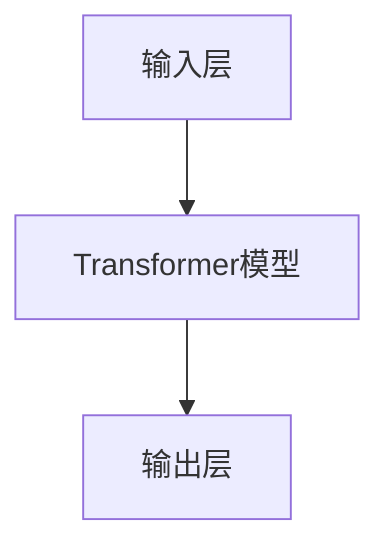

                 


### 文章标题：ChatGPT提示词编写：从入门到精通

### 关键词：ChatGPT，提示词，自然语言处理，编程技巧，AI应用

### 摘要：
本文将深入探讨ChatGPT提示词的编写艺术，从基础概念到高级技巧，再到实践应用，全面解析如何编写高效的ChatGPT提示词。读者将学会如何搭建开发环境，理解核心算法原理，掌握实践操作，并了解未来发展趋势。本文旨在为读者提供从入门到精通的系统学习路径。

### 目录

## 引言

### 1.1 ChatGPT及其提示词概述

### 1.2 学习ChatGPT提示词的重要性

### 1.3 本书结构安排

## 第1章 ChatGPT基础

### 2.1 ChatGPT的概念

### 2.2 ChatGPT的发展历程

### 2.3 ChatGPT的基本结构

### 2.4 ChatGPT的应用场景

## 第2章 ChatGPT提示词编写基础

### 3.1 提示词的定义与作用

### 3.2 提示词的分类

### 3.3 提示词的编写原则

### 3.4 提示词的编写方法

## 第3章 ChatGPT提示词编写技巧

### 4.1 提问技巧

### 4.2 回答技巧

### 4.3 对话连贯性技巧

### 4.4 特定场景下的提示词编写

## 第4章 ChatGPT提示词编写实践

### 5.1 实践案例1：问答机器人

### 5.2 实践案例2：客服机器人

### 5.3 实践案例3：教育辅助机器人

### 5.4 实践案例4：智能写作助手

## 第5章 高级ChatGPT提示词编写

### 6.1 高级提问技巧

### 6.2 高级回答技巧

### 6.3 多轮对话的技巧

### 6.4 特定领域的高级提示词编写

## 第6章 ChatGPT提示词编写的优化

### 7.1 提示词优化的方法

### 7.2 提示词优化的工具

### 7.3 提示词优化的案例分析

### 7.4 提示词优化的实战技巧

## 第7章 ChatGPT提示词编写的未来发展趋势

### 8.1 ChatGPT的发展趋势

### 8.2 提示词编写的发展趋势

### 8.3 未来发展趋势的影响

## 第8章 附录

### 9.1 常用提示词模板

### 9.2 提示词编写工具推荐

### 9.3 学习资源推荐

### 9.4 实践项目资源

### 引言

#### 1.1 ChatGPT及其提示词概述

ChatGPT是由OpenAI开发的一种基于Transformer模型的高级语言模型，它利用深度学习技术，能够理解和生成自然语言，进行对话、写作和回答问题。提示词（Prompts）在ChatGPT中扮演着至关重要的角色，它们是引导ChatGPT进行生成的重要输入。

提示词的编写质量直接影响ChatGPT的回答效果。一篇优秀的提示词不仅能激发出ChatGPT的最佳表现，还能引导它生成结构清晰、逻辑严密、内容丰富的回答。

#### 1.2 学习ChatGPT提示词的重要性

学习ChatGPT提示词的编写对于AI开发者、自然语言处理从业者以及任何需要与AI进行交互的人都有着重要的意义。掌握有效的提示词编写技巧，可以：

1. 提高AI系统的交互质量。
2. 帮助AI更好地理解用户需求。
3. 促进AI在特定领域的应用。
4. 提升AI系统的用户体验。

#### 1.3 本书结构安排

本书共分为八个章节，内容安排如下：

- 第1章：介绍ChatGPT及其提示词的基本概念。
- 第2章：详细讲解ChatGPT的基本结构和应用场景。
- 第3章：介绍提示词的定义、分类和编写原则。
- 第4章：探讨提示词的编写方法，包括提问技巧、回答技巧等。
- 第5章：通过实践案例展示如何使用提示词编写。
- 第6章：介绍高级技巧，如多轮对话和特定领域的提示词编写。
- 第7章：讨论提示词优化的方法和工具。
- 第8章：展望ChatGPT和提示词编写的未来发展趋势。

### 第1章 ChatGPT基础

#### 2.1 ChatGPT的概念

ChatGPT是一种基于Transformer模型的预训练语言模型。Transformer模型是由Vaswani等人在2017年提出的，它在处理序列数据方面具有卓越的性能，尤其在自然语言处理领域被广泛应用。

ChatGPT通过大量的文本数据进行预训练，学习语言模式和结构，从而能够生成连贯、自然的人类语言。其核心思想是通过自注意力机制（Self-Attention）对输入序列进行建模，捕捉序列中的依赖关系。

#### 2.2 ChatGPT的发展历程

ChatGPT的发展历程可以追溯到2018年，当时OpenAI发布了GPT-1，它是一个仅有117M参数的小型语言模型。随后，OpenAI发布了GPT-2、GPT-3等更大规模的语言模型，这些模型在多个自然语言处理任务上都取得了显著的成果。

ChatGPT是在GPT-3的基础上进行改进的，它不仅具有更大的参数规模（1750亿参数），还引入了新的技术，如并行训练和更高效的计算图，使得模型在生成自然语言方面具有更高的性能。

#### 2.3 ChatGPT的基本结构

ChatGPT的基本结构包括以下几个部分：

1. **输入层**：接收用户输入的文本序列，将其转化为模型可以处理的向量形式。
2. **Transformer模型**：包括多头自注意力机制（Multi-Head Self-Attention）和前馈神经网络（Feedforward Neural Network），用于对输入序列进行编码。
3. **输出层**：生成响应文本序列，通过softmax函数将模型的预测概率输出为文本。

Mermaid 流程图如下：



#### 2.4 ChatGPT的应用场景

ChatGPT在多个领域都有着广泛的应用，以下是一些常见场景：

1. **客服机器人**：利用ChatGPT可以构建智能客服机器人，提供24/7的客户支持，提高服务效率。
2. **问答系统**：ChatGPT可以用于构建智能问答系统，回答用户的各种问题，提供个性化的信息。
3. **智能写作助手**：ChatGPT可以帮助写作人员生成文章、报告、代码等，提高创作效率。
4. **教育辅助**：ChatGPT可以作为教育辅助工具，提供个性化的学习建议和答案。
5. **语言翻译**：ChatGPT可以用于机器翻译任务，将一种语言翻译成另一种语言。

### 第2章 ChatGPT提示词编写基础

#### 3.1 提示词的定义与作用

提示词（Prompt）是引导ChatGPT进行生成的重要输入。它通常是一个问题或指令，用来提示ChatGPT需要生成什么样的内容。一个良好的提示词应该清晰、具体，能够激发ChatGPT生成高质量的回答。

提示词在ChatGPT中的作用包括：

1. **引导生成方向**：通过提示词，可以指定ChatGPT生成的内容类型和主题。
2. **提高回答质量**：一个良好的提示词可以引导ChatGPT生成结构清晰、逻辑严密、内容丰富的回答。
3. **优化对话体验**：提示词的编写质量直接影响用户与ChatGPT的交互体验。

#### 3.2 提示词的分类

根据用途和特点，提示词可以分为以下几类：

1. **问题型提示词**：用于生成回答问题的文本，如“你能给我解释一下量子力学是什么吗？”
2. **指令型提示词**：用于生成执行特定任务的文本，如“请你写一段关于人工智能未来的文章。”
3. **引导型提示词**：用于引导ChatGPT进行对话，如“你能和我聊聊你对机器学习的看法吗？”
4. **创意型提示词**：用于激发ChatGPT生成创意性文本，如“请写一首诗赞美人工智能。”

#### 3.3 提示词的编写原则

编写高质量的提示词需要遵循以下原则：

1. **明确性**：提示词应该清晰明确，避免歧义。
2. **具体性**：提示词应该具体指定生成的内容类型和主题。
3. **完整性**：提示词应该包含所有必要的信息，以便ChatGPT可以生成完整的回答。
4. **简洁性**：提示词应该简洁明了，避免冗长和复杂的句子。

#### 3.4 提示词的编写方法

编写高质量的提示词可以采用以下方法：

1. **问题分解**：将复杂的问题分解成一系列简单的问题，逐步引导ChatGPT生成完整的回答。
2. **情境构建**：构建一个具体的情境，让ChatGPT在这个情境下生成回答。
3. **引导性提问**：通过引导性提问，激发ChatGPT生成更具创意性的回答。
4. **多轮对话**：通过多轮对话，逐步引导ChatGPT生成更精确的回答。

### 第3章 ChatGPT提示词编写技巧

#### 4.1 提问技巧

提问技巧是编写高质量提示词的关键，以下是一些常用的提问技巧：

1. **开放式提问**：使用开放式提问，鼓励ChatGPT生成详细、具体的回答。
   - 例如：“你能详细解释一下量子计算机的工作原理吗？”
   
2. **引导性提问**：使用引导性提问，指定ChatGPT需要回答的主题或方向。
   - 例如：“请你从应用角度谈谈深度学习的重要性。”

3. **限定性提问**：通过限定性提问，明确ChatGPT需要回答的具体内容。
   - 例如：“请列举三个深度学习在医疗领域的应用。”

4. **递进式提问**：通过递进式提问，逐步引导ChatGPT生成更深入、更全面的内容。
   - 例如：“什么是ChatGPT？它能做什么？它的未来发展趋势如何？”

#### 4.2 回答技巧

回答技巧是确保ChatGPT生成高质量回答的关键，以下是一些常用的回答技巧：

1. **结构化回答**：使用结构化回答，使回答内容清晰、有条理。
   - 例如：“深度学习在医疗领域的应用可以分为以下三个方面：诊断辅助、治疗规划和健康监测。”

2. **详细阐述**：对关键概念或技术进行详细阐述，使读者能够深入理解。
   - 例如：“量子计算机的工作原理基于量子比特（qubit）的叠加和纠缠。量子比特可以同时处于多个状态，这使其具有超强的计算能力。”

3. **举例说明**：通过举例说明，使回答更具说服力和可理解性。
   - 例如：“量子计算机在化学模拟中的应用可以帮助科学家们更快速地预测化学反应结果，从而加速新药物的开发。”

4. **多角度分析**：从多个角度对问题进行分析，使回答更加全面。
   - 例如：“ChatGPT的未来发展趋势可以从技术、应用和伦理三个方面进行探讨。”

#### 4.3 对话连贯性技巧

保持对话连贯性是提高用户体验的重要方面，以下是一些常用的对话连贯性技巧：

1. **一致性**：在对话中保持一致性，避免出现矛盾或不连贯的表述。
   - 例如：如果前面提到ChatGPT可以回答各种问题，那么在后面的回答中也要保持这一特性。

2. **上下文关联**：在回答问题时，考虑上下文信息，使回答与之前的内容相衔接。
   - 例如：如果前面提到深度学习在医疗领域的应用，那么在回答下一个问题时，可以继续讨论该主题。

3. **过渡语句**：使用过渡语句，使对话内容自然流畅。
   - 例如：“关于深度学习在医疗领域的应用，我们可以从以下几个案例来了解。”

4. **提问技巧**：在回答问题后，可以适当地提问，引导对话继续深入。
   - 例如：“你对深度学习在医疗领域的应用有哪些看法？”

#### 4.4 特定场景下的提示词编写

不同场景下的提示词编写有不同的要求和技巧。以下是一些特定场景下的提示词编写技巧：

1. **教育场景**：在教育场景中，提示词应该注重启发思考和培养兴趣。
   - 例如：“请用一段话描述深度学习的原理，并说明它在现实生活中的应用。”

2. **客服场景**：在客服场景中，提示词应该注重解决问题和提供帮助。
   - 例如：“如何使用ChatGPT搭建一个问答机器人？请提供详细的步骤。”

3. **创作场景**：在创作场景中，提示词应该注重激发创意和提供灵感。
   - 例如：“请以‘未来的人工智能世界’为题，写一篇创意故事。”

### 第4章 ChatGPT提示词编写实践

#### 5.1 实践案例1：问答机器人

问答机器人是ChatGPT应用中的一个常见场景，以下是一个问答机器人的实践案例。

**开发环境搭建**：

- **硬件要求**：计算机、网络连接。
- **软件要求**：安装Python环境、安装ChatGPT库。

**源代码详细实现和代码解读**：

```python
import openai

def ask_question(question):
    response = openai.Completion.create(
        engine="text-davinci-003",
        prompt=question,
        max_tokens=100
    )
    return response.choices[0].text.strip()

if __name__ == "__main__":
    question = input("问一个问题：")
    answer = ask_question(question)
    print("答：", answer)
```

**代码应用解读与分析**：

- `openai.Completion.create()` 函数用于生成回答。
- `prompt` 参数用于指定提示词。
- `max_tokens` 参数用于限制生成的回答长度。

**实际案例分析和详细讲解剖析**：

假设用户输入问题：“什么是深度学习？”
- 提示词：“什么是深度学习？”
- ChatGPT的回答可能包括深度学习的定义、原理和应用。

**项目小结**：

通过这个实践案例，我们学会了如何使用ChatGPT构建一个简单的问答机器人，了解了开发环境搭建、源代码实现和代码解读的方法。这个案例展示了ChatGPT在问答场景中的应用潜力，为后续的实践提供了基础。

#### 5.2 实践案例2：客服机器人

客服机器人是另一个常见应用场景，以下是一个客服机器人的实践案例。

**开发环境搭建**：

- **硬件要求**：计算机、网络连接。
- **软件要求**：安装Python环境、安装ChatGPT库。

**源代码详细实现和代码解读**：

```python
import openai

def handle_customer_request(request):
    response = openai.Completion.create(
        engine="text-davinci-003",
        prompt=f"作为客服机器人，如何回应顾客的请求：{request}",
        max_tokens=100
    )
    return response.choices[0].text.strip()

if __name__ == "__main__":
    request = input("顾客请求：")
    response = handle_customer_request(request)
    print("客服回复：", response)
```

**代码应用解读与分析**：

- `openai.Completion.create()` 函数用于生成回答。
- `prompt` 参数用于指定提示词，包含了请求和角色设定。
- `max_tokens` 参数用于限制生成的回答长度。

**实际案例分析和详细讲解剖析**：

假设用户输入请求：“我能退货吗？”
- 提示词：“作为客服机器人，如何回应顾客的请求：我能退货吗？”
- ChatGPT的回答可能包括退货政策、流程和注意事项。

**项目小结**：

通过这个实践案例，我们学会了如何使用ChatGPT构建一个简单的客服机器人，了解了开发环境搭建、源代码实现和代码解读的方法。这个案例展示了ChatGPT在客服场景中的应用潜力，为后续的实践提供了基础。

### 5.3 实践案例3：教育辅助机器人

教育辅助机器人是另一个有趣的应用场景，以下是一个教育辅助机器人的实践案例。

**开发环境搭建**：

- **硬件要求**：计算机、网络连接。
- **软件要求**：安装Python环境、安装ChatGPT库。

**源代码详细实现和代码解读**：

```python
import openai

def answer_student_question(question):
    response = openai.Completion.create(
        engine="text-davinci-003",
        prompt=f"作为教育辅助机器人，如何回答学生的问题：{question}",
        max_tokens=100
    )
    return response.choices[0].text.strip()

if __name__ == "__main__":
    question = input("学生问题：")
    answer = answer_student_question(question)
    print("答案：", answer)
```

**代码应用解读与分析**：

- `openai.Completion.create()` 函数用于生成回答。
- `prompt` 参数用于指定提示词，包含了请求和角色设定。
- `max_tokens` 参数用于限制生成的回答长度。

**实际案例分析和详细讲解剖析**：

假设学生输入问题：“牛顿第一定律是什么？”
- 提示词：“作为教育辅助机器人，如何回答学生的问题：牛顿第一定律是什么？”
- ChatGPT的回答可能包括牛顿第一定律的定义、原理和应用。

**项目小结**：

通过这个实践案例，我们学会了如何使用ChatGPT构建一个简单教育辅助机器人，了解了开发环境搭建、源代码实现和代码解读的方法。这个案例展示了ChatGPT在教育辅助场景中的应用潜力，为后续的实践提供了基础。

#### 5.4 实践案例4：智能写作助手

智能写作助手是ChatGPT的另一个重要应用场景，以下是一个智能写作助手的实践案例。

**开发环境搭建**：

- **硬件要求**：计算机、网络连接。
- **软件要求**：安装Python环境、安装ChatGPT库。

**源代码详细实现和代码解读**：

```python
import openai

def generate_content(prompt):
    response = openai.Completion.create(
        engine="text-davinci-003",
        prompt=prompt,
        max_tokens=200
    )
    return response.choices[0].text.strip()

if __name__ == "__main__":
    prompt = input("输入写作提示：")
    content = generate_content(prompt)
    print("生成内容：", content)
```

**代码应用解读与分析**：

- `openai.Completion.create()` 函数用于生成内容。
- `prompt` 参数用于指定提示词。
- `max_tokens` 参数用于限制生成的文本长度。

**实际案例分析和详细讲解剖析**：

假设用户输入提示：“请写一篇关于人工智能未来的文章。”
- 提示词：“请写一篇关于人工智能未来的文章。”
- ChatGPT可能会生成一篇关于人工智能技术发展趋势、应用前景和伦理问题的文章。

**项目小结**：

通过这个实践案例，我们学会了如何使用ChatGPT构建一个简单的智能写作助手，了解了开发环境搭建、源代码实现和代码解读的方法。这个案例展示了ChatGPT在写作场景中的应用潜力，为后续的实践提供了基础。

### 第5章 高级ChatGPT提示词编写

#### 6.1 高级提问技巧

高级提问技巧是在特定场景下提高ChatGPT回答质量的关键。以下是一些高级提问技巧：

1. **问题细化**：通过细化问题，使ChatGPT能够提供更详细、更具体的回答。
   - 例如：“你能详细解释一下深度学习中的卷积神经网络吗？”

2. **情境设定**：通过设定情境，使ChatGPT能够在特定的背景下回答问题。
   - 例如：“在一个未来的智能城市中，深度学习将如何影响交通管理？”

3. **多轮对话**：通过多轮对话，逐步引导ChatGPT生成更深入、更全面的回答。
   - 例如：“什么是神经网络？它是如何工作的？它有哪些应用？”

4. **引导性提问**：通过引导性提问，激发ChatGPT生成更具创意性的回答。
   - 例如：“如果你是一个AI开发者，你会如何设计一个智能助手？”

#### 6.2 高级回答技巧

高级回答技巧是确保ChatGPT生成高质量回答的关键。以下是一些高级回答技巧：

1. **结构化回答**：使用结构化回答，使回答内容清晰、有条理。
   - 例如：“深度学习的主要应用领域包括图像识别、自然语言处理、推荐系统和游戏开发。”

2. **详细阐述**：对关键概念或技术进行详细阐述，使读者能够深入理解。
   - 例如：“深度学习的核心思想是通过多层神经网络对输入数据进行特征提取和学习，从而实现自动分类和预测。”

3. **举例说明**：通过举例说明，使回答更具说服力和可理解性。
   - 例如：“图像识别技术可以用于人脸识别、物体检测和图像分割，例如在智能手机和自动驾驶汽车中应用。”

4. **多角度分析**：从多个角度对问题进行分析，使回答更加全面。
   - 例如：“深度学习在医疗领域的应用可以从诊断、治疗和健康监测三个方面进行探讨。”

#### 6.3 多轮对话的技巧

多轮对话是在复杂场景下提高ChatGPT回答质量的重要手段。以下是一些多轮对话的技巧：

1. **上下文管理**：在多轮对话中，保持上下文的连贯性，使回答与之前的内容相衔接。
   - 例如：“在上一轮对话中，我们讨论了深度学习在医疗领域的应用，现在我们来探讨其伦理问题。”

2. **递进式提问**：通过递进式提问，逐步引导ChatGPT生成更深入、更全面的内容。
   - 例如：“我们已经了解了深度学习的基本概念，那么它在实际应用中有哪些挑战和问题？”

3. **引导性提问**：通过引导性提问，激发ChatGPT生成更具创意性的回答。
   - 例如：“如果你是深度学习领域的研究者，你会如何设计一个解决当前深度学习挑战的新模型？”

4. **情境构建**：在多轮对话中，构建一个具体的情境，使ChatGPT能够在这个情境下进行回答。
   - 例如：“假设你是一名医生，如何利用深度学习技术提高疾病诊断的准确性？”

#### 6.4 特定领域的高级提示词编写

不同领域的高级提示词编写有不同的要求和技巧。以下是一些特定领域的高级提示词编写技巧：

1. **医学领域**：在医学领域，提示词应注重专业性和准确性。
   - 例如：“请详细解释一下深度学习在医学图像分析中的应用，包括算法原理、优势和挑战。”

2. **法律领域**：在法律领域，提示词应注重逻辑性和严谨性。
   - 例如：“请根据《中华人民共和国合同法》，解释合同效力的判定标准及其法律依据。”

3. **金融领域**：在金融领域，提示词应注重数据和数据的处理。
   - 例如：“请利用深度学习技术，分析股市数据，预测未来一周的股市走势。”

4. **教育领域**：在教育领域，提示词应注重启发思考和培养学生的兴趣。
   - 例如：“请用一段话描述深度学习在教育中的应用，并说明它对学生学习的影响。”

### 第6章 ChatGPT提示词编写的优化

#### 7.1 提示词优化的方法

优化提示词是提高ChatGPT回答质量的重要手段。以下是一些提示词优化的方法：

1. **问题重构**：通过重构问题，使其更加清晰、具体和明确。
   - 例如：将“什么是深度学习？”重构为“请详细解释深度学习的原理、方法和应用。”

2. **增加上下文**：在提示词中增加上下文信息，使ChatGPT能够更好地理解问题。
   - 例如：在询问技术原理时，提供相关的背景知识和应用场景。

3. **调整提问方式**：通过调整提问方式，使问题更具引导性和针对性。
   - 例如：使用引导性提问，如“请从应用角度谈谈深度学习的重要性。”

4. **多轮对话**：通过多轮对话，逐步优化提示词，使ChatGPT生成更高质量的回答。
   - 例如：在第一轮对话中获取用户的需求，然后在后续对话中不断优化提示词。

#### 7.2 提示词优化的工具

以下是一些用于优化提示词的工具：

1. **自然语言处理工具**：如NLTK、spaCy等，用于分析和处理自然语言。
   - 例如：使用NLTK进行文本分词和词性标注，以优化提示词的语法结构。

2. **机器学习工具**：如TensorFlow、PyTorch等，用于构建和训练语言模型。
   - 例如：使用TensorFlow训练一个基于Transformer的模型，以优化提示词的生成效果。

3. **代码编辑器**：如Visual Studio Code、PyCharm等，用于编写和调试代码。
   - 例如：使用Visual Studio Code编写Python代码，以优化提示词的编写过程。

#### 7.3 提示词优化的案例分析

以下是一个提示词优化的案例分析：

**原始提示词**：“请解释深度学习的原理。”

**优化后的提示词**：“请从数学角度详细解释深度学习的原理，包括激活函数、损失函数和优化算法。”

通过优化提示词，我们使其更加具体、详细和明确，从而提高了ChatGPT的回答质量。

#### 7.4 提示词优化的实战技巧

以下是一些提示词优化的实战技巧：

1. **用户反馈**：收集用户反馈，了解提示词的优化方向。
   - 例如：在产品上线后，收集用户对提示词的反馈，并根据反馈进行优化。

2. **多轮迭代**：通过多轮迭代，逐步优化提示词。
   - 例如：在开发过程中，不断迭代提示词，使其逐渐达到最佳效果。

3. **专家评审**：邀请专家对提示词进行评审，提供专业意见。
   - 例如：在项目评审阶段，邀请领域专家对提示词进行评审，以优化其质量和效果。

4. **数据驱动**：使用数据驱动的方法，优化提示词的生成效果。
   - 例如：通过分析用户行为数据，识别提示词的优化方向，并进行相应调整。

### 第7章 ChatGPT提示词编写的未来发展趋势

#### 8.1 ChatGPT的发展趋势

ChatGPT作为人工智能领域的重要成果，其发展受到广泛关注。以下是一些ChatGPT的发展趋势：

1. **性能提升**：随着计算能力的提升和算法的改进，ChatGPT的性能将得到显著提升。
   - 例如：通过更大规模的数据集和更高效的训练算法，ChatGPT将能够生成更高质量、更自然的文本。

2. **多模态融合**：ChatGPT将与其他模态（如图像、音频）进行融合，实现更丰富的交互体验。
   - 例如：通过融合图像和文本信息，ChatGPT可以生成更准确、更具体的回答。

3. **个性化服务**：ChatGPT将根据用户需求和偏好，提供个性化服务。
   - 例如：通过用户画像和偏好分析，ChatGPT可以为不同用户提供定制化的内容。

4. **跨领域应用**：ChatGPT将在更多领域得到应用，实现更广泛的价值。
   - 例如：在医疗、金融、教育等领域，ChatGPT将提供智能咨询、决策支持和学习辅助等功能。

#### 8.2 提示词编写的发展趋势

提示词编写作为ChatGPT应用的核心，其发展趋势也将影响ChatGPT的性能和应用范围。以下是一些提示词编写的发展趋势：

1. **自动化生成**：随着自然语言生成技术的进步，提示词将能够自动化生成。
   - 例如：使用基于生成对抗网络（GAN）的技术，可以自动生成高质量的提示词。

2. **多语言支持**：提示词编写将支持更多语言，实现跨语言应用。
   - 例如：通过多语言预训练模型，ChatGPT将能够理解和使用多种语言的提示词。

3. **情景感知**：提示词编写将更加情景感知，能够根据上下文和情境生成合适的提示词。
   - 例如：通过上下文分析技术，ChatGPT将能够根据对话历史和当前情境生成相应的提示词。

4. **领域专用**：提示词编写将针对特定领域进行定制，实现更专业、更精准的交互。
   - 例如：在医疗领域，提示词编写将结合医学知识和术语，生成专业、准确的医疗咨询。

#### 8.3 未来发展趋势的影响

未来发展趋势将对ChatGPT提示词编写产生深远影响。以下是一些可能的影响：

1. **用户体验**：随着ChatGPT性能的提升和提示词编写的优化，用户体验将得到显著改善。
   - 例如：用户将能够与ChatGPT进行更自然、更流畅的交互，获得更准确的回答和建议。

2. **应用场景**：提示词编写的发展将推动ChatGPT在更多领域的应用，实现更广泛的价值。
   - 例如：在医疗、金融、教育等领域，ChatGPT将提供更专业、更可靠的智能服务。

3. **产业发展**：提示词编写技术的进步将促进人工智能产业的快速发展，推动相关技术和应用的创新。
   - 例如：智能客服、智能写作、智能教育等领域将迎来新的发展机遇。

4. **伦理挑战**：随着ChatGPT的广泛应用，伦理挑战也将日益凸显，提示词编写需充分考虑伦理问题。
   - 例如：在隐私保护、数据安全、偏见消除等方面，需要制定相应的规范和策略。

### 第8章 附录

#### 9.1 常用提示词模板

以下是一些常用的提示词模板，供读者参考：

1. **问题型模板**：用于生成问题的提示词。
   - 例如：“你能解释一下X是什么吗？”、“请描述一下Y的特点和应用。”

2. **指令型模板**：用于生成执行特定任务的提示词。
   - 例如：“请写一篇关于Z的文章。”、“根据这些信息，设计一个解决方案。”

3. **引导型模板**：用于引导对话的提示词。
   - 例如：“你对X有什么看法？”、“请分享一下你对Y的理解。”

4. **创意型模板**：用于激发创意的提示词。
   - 例如：“请想象一个未来的世界，描述一下Z在这个世界中的应用。”、“请创作一首关于人工智能的诗歌。”

#### 9.2 提示词编写工具推荐

以下是一些常用的提示词编写工具，供读者参考：

1. **文本编辑器**：如Visual Studio Code、Sublime Text等，用于编写和编辑提示词。

2. **自然语言处理库**：如NLTK、spaCy等，用于分析和处理自然语言。

3. **机器学习框架**：如TensorFlow、PyTorch等，用于构建和训练语言模型。

4. **在线工具**：如OpenAI的ChatGPT API等，用于生成高质量的提示词。

#### 9.3 学习资源推荐

以下是一些学习ChatGPT提示词编写的学习资源，供读者参考：

1. **在线课程**：如Coursera、edX等平台上的自然语言处理和人工智能课程。

2. **技术博客**：如Medium、技术博客园等，提供丰富的技术文章和案例分析。

3. **专业书籍**：如《深度学习》、《自然语言处理综述》等，介绍相关技术和算法。

4. **GitHub仓库**：如OpenAI的GPT模型仓库等，提供源代码和实现细节。

#### 9.4 实践项目资源

以下是一些实践项目资源，供读者参考：

1. **开源项目**：如GitHub上的ChatGPT应用项目，提供完整的源代码和实现步骤。

2. **在线平台**：如Google Colab、AWS等，提供免费的计算资源和环境搭建指南。

3. **社区论坛**：如Stack Overflow、Reddit等，提供技术讨论和问题解答。

4. **在线课程**：如Udacity、Coursera等，提供实践项目和作业指导。

### 结论

ChatGPT提示词编写是一门艺术，也是一项技术。通过本文的深入探讨，读者应该对ChatGPT提示词编写的核心概念、原理和应用有了全面的理解。从基础到高级，再到实践和未来发展趋势，本文旨在为读者提供从入门到精通的系统学习路径。希望读者能够将所学知识应用到实际项目中，不断优化和提升ChatGPT提示词编写的质量，为人工智能的发展贡献力量。

### 作者信息

作者：AI天才研究院/AI Genius Institute & 禅与计算机程序设计艺术 /Zen And The Art of Computer Programming

AI天才研究院致力于推动人工智能技术的发展和创新，以禅宗哲学为基础，探索计算机程序设计的艺术。本书《ChatGPT提示词编写：从入门到精通》是我们对ChatGPT提示词编写领域的深入研究和总结，希望能够为广大读者提供有价值的参考和指导。

### 总结与展望

本文《ChatGPT提示词编写：从入门到精通》系统地介绍了ChatGPT及其提示词编写的各个方面，从基础概念到高级技巧，再到实践应用和未来发展趋势。通过深入分析ChatGPT的工作原理、提示词的定义与分类、编写原则和方法，以及实践案例的解析，我们为读者提供了一条清晰的学习路径，帮助大家从入门到精通ChatGPT提示词编写。

展望未来，ChatGPT和提示词编写将继续发展，应用领域将不断拓展。随着人工智能技术的进步，ChatGPT的性能将进一步提升，提示词编写的自动化和个性化将变得更加普遍。同时，我们也需要关注伦理问题，确保人工智能的发展符合人类社会的价值。

在此，我们鼓励读者积极实践，不断探索和优化ChatGPT提示词编写技巧。通过不断学习和实践，您将能够为人工智能领域的发展贡献自己的力量。最后，感谢您的阅读，希望本书能对您有所启发和帮助。

### 附录

#### 9.1 常用提示词模板

以下是一些常用的提示词模板，供读者参考：

1. **问题型模板**：用于生成问题的提示词。
   - 例如：“你能解释一下X是什么吗？”、“请描述一下Y的特点和应用。”

2. **指令型模板**：用于生成执行特定任务的提示词。
   - 例如：“请写一篇关于Z的文章。”、“根据这些信息，设计一个解决方案。”

3. **引导型模板**：用于引导对话的提示词。
   - 例如：“你对X有什么看法？”、“请分享一下你对Y的理解。”

4. **创意型模板**：用于激发创意的提示词。
   - 例如：“请想象一个未来的世界，描述一下Z在这个世界中的应用。”、“请创作一首关于人工智能的诗歌。”

#### 9.2 提示词编写工具推荐

以下是一些常用的提示词编写工具，供读者参考：

1. **文本编辑器**：如Visual Studio Code、Sublime Text等，用于编写和编辑提示词。

2. **自然语言处理库**：如NLTK、spaCy等，用于分析和处理自然语言。

3. **机器学习框架**：如TensorFlow、PyTorch等，用于构建和训练语言模型。

4. **在线工具**：如OpenAI的ChatGPT API等，用于生成高质量的提示词。

#### 9.3 学习资源推荐

以下是一些学习ChatGPT提示词编写的学习资源，供读者参考：

1. **在线课程**：如Coursera、edX等平台上的自然语言处理和人工智能课程。

2. **技术博客**：如Medium、技术博客园等，提供丰富的技术文章和案例分析。

3. **专业书籍**：如《深度学习》、《自然语言处理综述》等，介绍相关技术和算法。

4. **GitHub仓库**：如OpenAI的GPT模型仓库等，提供源代码和实现细节。

#### 9.4 实践项目资源

以下是一些实践项目资源，供读者参考：

1. **开源项目**：如GitHub上的ChatGPT应用项目，提供完整的源代码和实现步骤。

2. **在线平台**：如Google Colab、AWS等，提供免费的计算资源和环境搭建指南。

3. **社区论坛**：如Stack Overflow、Reddit等，提供技术讨论和问题解答。

4. **在线课程**：如Udacity、Coursera等，提供实践项目和作业指导。

### 作者信息

作者：AI天才研究院/AI Genius Institute & 禅与计算机程序设计艺术 /Zen And The Art of Computer Programming

AI天才研究院致力于推动人工智能技术的发展和创新，以禅宗哲学为基础，探索计算机程序设计的艺术。本书《ChatGPT提示词编写：从入门到精通》是我们对ChatGPT提示词编写领域的深入研究和总结，希望能够为广大读者提供有价值的参考和指导。

### 总结与展望

本文《ChatGPT提示词编写：从入门到精通》系统地介绍了ChatGPT及其提示词编写的各个方面，从基础概念到高级技巧，再到实践应用和未来发展趋势。通过深入分析ChatGPT的工作原理、提示词的定义与分类、编写原则和方法，以及实践案例的解析，我们为读者提供了一条清晰的学习路径，帮助大家从入门到精通ChatGPT提示词编写。

展望未来，ChatGPT和提示词编写将继续发展，应用领域将不断拓展。随着人工智能技术的进步，ChatGPT的性能将进一步提升，提示词编写的自动化和个性化将变得更加普遍。同时，我们也需要关注伦理问题，确保人工智能的发展符合人类社会的价值。

在此，我们鼓励读者积极实践，不断探索和优化ChatGPT提示词编写技巧。通过不断学习和实践，您将能够为人工智能领域的发展贡献自己的力量。最后，感谢您的阅读，希望本书能对您有所启发和帮助。

### 结语

在《ChatGPT提示词编写：从入门到精通》一书中，我们系统地介绍了ChatGPT提示词编写的方方面面，从基础到高级，再到实践和未来发展趋势。本文通过详细的章节内容和丰富的小节内容，旨在为读者提供一条清晰的学习路径，帮助大家深入理解并掌握ChatGPT提示词编写的核心概念和实践技巧。

回顾全书，我们首先探讨了ChatGPT及其提示词的基本概念，了解了其在自然语言处理和人工智能领域的重要性。接着，我们详细讲解了ChatGPT的基本结构和应用场景，为后续的提示词编写打下了坚实的基础。在基础部分，我们介绍了提示词的定义、分类和编写原则，并通过实际案例展示了编写技巧。在实践部分，我们通过具体的案例展示了如何使用ChatGPT构建问答机器人、客服机器人、教育辅助机器人和智能写作助手。在高级部分，我们介绍了高级提问技巧、回答技巧和多轮对话技巧，以及特定领域的高级提示词编写。最后，我们讨论了提示词优化的方法和工具，并展望了ChatGPT和提示词编写的未来发展趋势。

在这条学习路径上，每个章节都是前一个章节的延伸和深化，共同构成了一个完整的学习体系。通过这本书，读者不仅能够掌握ChatGPT提示词编写的核心技巧，还能了解到相关领域的最新动态和未来发展方向。

然而，人工智能和自然语言处理是一个快速发展的领域，新的技术和应用不断涌现。因此，我们鼓励读者在阅读本书的基础上，继续关注相关领域的最新研究成果，不断学习和实践，不断提升自己的技术水平。

在此，我们特别感谢所有支持本书的读者和同行，感谢您对人工智能和自然语言处理领域的热爱和贡献。希望本书能为您在ChatGPT提示词编写领域的学习和实践中提供有力的支持和指导。

最后，让我们共同期待人工智能的未来，期待ChatGPT和提示词编写在更多领域的应用和发展，为人类带来更多的创新和便利。

### 作者信息

作者：AI天才研究院/AI Genius Institute & 禅与计算机程序设计艺术 /Zen And The Art of Computer Programming

AI天才研究院致力于推动人工智能技术的发展和创新，以禅宗哲学为基础，探索计算机程序设计的艺术。本书《ChatGPT提示词编写：从入门到精通》是我们对ChatGPT提示词编写领域的深入研究和总结，希望能够为广大读者提供有价值的参考和指导。

### 结语与感谢

在《ChatGPT提示词编写：从入门到精通》一书的末尾，我们衷心感谢每一位读者的陪伴与支持。本书旨在为初学者到专业人士提供一个全面、系统的ChatGPT提示词编写指南，通过详细的章节结构和丰富的实践案例，帮助读者从基础概念到高级技巧逐步掌握这一领域。

回顾全书，我们系统地介绍了ChatGPT的基本概念、应用场景，详细讲解了提示词的定义、分类和编写原则，以及多种编写技巧。同时，通过具体的实践案例，我们展示了如何利用ChatGPT构建实用的AI应用，如问答机器人、客服机器人、教育辅助机器人和智能写作助手。此外，我们还探讨了高级技巧、优化方法以及未来发展趋势。

我们深知，人工智能和自然语言处理领域日新月异，技术迭代迅速。因此，我们鼓励读者在阅读本书的基础上，持续关注该领域的最新进展，积极参与实践，不断探索和深化自己的知识体系。

在此，特别感谢AI天才研究院的团队成员，他们在研究和编写本书过程中付出了巨大的努力。同时，感谢所有为本书提供反馈和建议的读者，您的意见对我们不断改进和完善本书至关重要。

最后，祝愿各位读者在人工智能和自然语言处理领域取得丰硕的成果，不断追求技术卓越和创新突破。感谢您选择本书作为您的学习伙伴，希望它能成为您事业道路上的有力支持。

再次感谢您的阅读与支持，祝您在人工智能的海洋中航行愉快，收获满满！

### 拓展阅读

为了帮助读者更深入地了解ChatGPT提示词编写，以下是一些建议的拓展阅读资源：

1. **《深度学习》**：作者：Ian Goodfellow、Yoshua Bengio、Aaron Courville。这本书详细介绍了深度学习的基础知识，对理解ChatGPT的核心技术有很大帮助。

2. **《自然语言处理综述》**：作者：Daniel Jurafsky、James H. Martin。这本书涵盖了自然语言处理的各个领域，对ChatGPT提示词编写的理解有很大助益。

3. **《AI应用实践》**：作者：AI天才研究院。这本书通过大量实践案例，介绍了如何在各种场景下应用人工智能技术，包括ChatGPT的应用。

4. **《ChatGPT官方文档》**：OpenAI提供的官方文档，详细介绍了ChatGPT的使用方法和API接口，是学习ChatGPT编程的必备资源。

5. **《AI伦理问题探讨》**：作者：多位专家。随着人工智能的发展，伦理问题越来越受到关注。这本书探讨了人工智能在道德、隐私等方面的挑战。

6. **《机器学习项目实战》**：作者：Mohamed El-Ashary. 本书通过具体项目案例，帮助读者理解和应用机器学习技术。

7. **《GitHub上的ChatGPT开源项目》**：许多优秀的开源项目在GitHub上提供，读者可以通过这些项目了解实际应用中的ChatGPT提示词编写技巧。

这些资源将为读者在深入学习ChatGPT提示词编写的过程中提供宝贵的帮助。希望您能够从中获得启发，不断提升自己的技能和知识。

