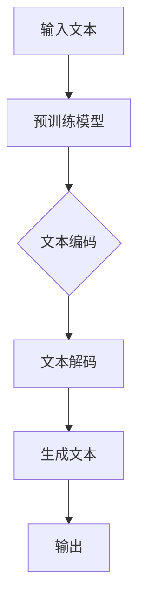
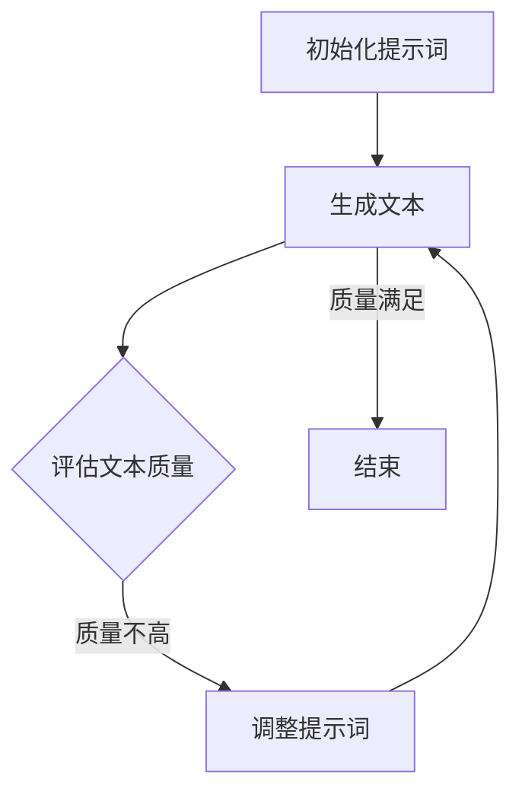

                 

### 文章标题

# 《ChatGPT提示词编写：从入门到精通的进阶之旅》

> 关键词：ChatGPT、自然语言处理、提示词编写、深度学习、实践案例

> 摘要：本文将深入探讨ChatGPT提示词编写的全过程，从基础概念到高级技巧，帮助读者全面了解并掌握这一技术。文章分为入门篇、进阶篇和精通篇，通过详尽的讲解、数学模型的解析、伪代码展示和项目实战案例，使读者能够从理论到实践，逐步提升ChatGPT提示词编写的技能。

### 入门篇：ChatGPT与自然语言处理基础

#### 第1章 ChatGPT简介

**1.1 ChatGPT的背景与发展**

ChatGPT是由OpenAI开发的一款基于变换器（Transformer）架构的预训练语言模型。它基于GPT-3.5模型，通过在大量互联网文本上进行训练，使其具备了强大的语言理解和生成能力。ChatGPT的发布标志着人工智能技术进入了一个新的阶段，为自然语言处理（NLP）领域带来了革命性的变革。

**1.2 ChatGPT的核心功能与特点**

ChatGPT的核心功能包括：

- **文本生成**：根据输入的提示文本，生成连贯且具有逻辑性的文本。
- **语言理解**：对输入的文本进行语义分析和理解，提取关键信息。
- **对话生成**：模拟人类对话，能够实现流畅的交互。

ChatGPT的特点包括：

- **强大的语言生成能力**：ChatGPT能够生成高质量的文本，具有很高的可读性和逻辑性。
- **适应性强**：ChatGPT可以适应不同的应用场景和需求，进行定制化开发。

**1.3 Mermaid流程图：ChatGPT架构**

以下是一个简化的ChatGPT架构的Mermaid流程图：



#### 第2章 自然语言处理基础

**2.1 NLP的基本概念**

自然语言处理（NLP）是人工智能（AI）的一个分支，旨在让计算机理解和处理人类语言。NLP包括多个层次，从简单的文本分类到复杂的语义理解，涵盖了广泛的技术和算法。

**2.2 常见的NLP任务**

常见的NLP任务包括：

- **文本分类**：将文本分类到预定义的类别中。
- **命名实体识别**：识别文本中的特定实体，如人名、地点、组织等。
- **情感分析**：判断文本的情感倾向，如正面、负面或中立。
- **机器翻译**：将一种语言的文本翻译成另一种语言。

**2.3 latex公式：NLP中的数学模型**

以下是一个简单的NLP中的数学模型：

$$
\begin{aligned}
P(y|x) &= \text{softmax}(\text{Wx + b}) \\
y &= \arg\max_y P(y|x)
\end{aligned}
$$

其中，$x$是输入的文本向量，$y$是预测的类别，$W$是权重矩阵，$b$是偏置。

### 进阶篇：ChatGPT提示词编写技巧

#### 第3章 ChatGPT提示词编写技巧

**3.1 提示词的类型与作用**

提示词是引导ChatGPT生成文本的关键，根据用途和特性，可以分为以下几类：

- **问题类提示词**：用于引导ChatGPT回答特定问题。
- **描述类提示词**：用于引导ChatGPT生成描述性文本。
- **命令类提示词**：用于引导ChatGPT执行特定任务。

**3.2 提示词编写的策略**

编写有效的提示词需要遵循以下策略：

- **明确性**：确保提示词明确、具体，避免模糊不清。
- **多样性**：使用多样化的提示词，以适应不同的应用场景。
- **优化性**：根据实际应用效果，不断优化和调整提示词。

**3.3 伪代码：提示词编写算法**

以下是一个简化的提示词编写算法的伪代码：

```python
def generate_prompt(text):
    # 对输入文本进行预处理
    preprocessed_text = preprocess(text)
    
    # 根据文本类型生成提示词
    if is_question(text):
        prompt = "回答这个问题：" + preprocessed_text
    elif is_description(text):
        prompt = "描述以下内容：" + preprocessed_text
    elif is_command(text):
        prompt = "执行以下命令：" + preprocessed_text
    
    return prompt
```

### 精通篇：高级提示词编写与优化

#### 第4章 高级提示词编写技巧

**4.1 高级提示词编写技巧**

高级提示词编写需要考虑以下几个方面：

- **上下文关联**：确保提示词与上下文紧密关联，以提高生成文本的连贯性。
- **情感色彩**：根据应用需求，调整提示词的情感色彩，以产生预期的情感效果。
- **复杂性**：合理控制提示词的复杂度，以适应不同级别的用户。

**4.2 提示词优化方法**

提示词优化主要包括以下方法：

- **迭代优化**：通过多次迭代，不断调整和优化提示词。
- **数据驱动**：利用实际使用数据，对提示词进行优化和调整。
- **用户反馈**：根据用户反馈，调整和优化提示词。

**4.3 Mermaid流程图：优化流程**

以下是一个简化的提示词优化流程的Mermaid流程图：



### 第5章 项目实战：ChatGPT提示词编写案例

#### 第4章 实践项目介绍

**4.1 项目背景与目标**

本项目旨在使用ChatGPT构建一个智能客服系统，该系统能够自动回答用户的常见问题，提供高质量的客户服务。

**4.2 项目需求分析**

项目需求包括：

- **问题回答**：系统能够理解用户的问题，并给出准确、详细的回答。
- **对话流畅**：系统能够与用户进行自然、流畅的对话，提高用户体验。
- **扩展性**：系统能够根据实际需求，扩展新的功能和问题领域。

#### 第4章 开发环境搭建

**4.2.1 环境配置**

为了构建智能客服系统，需要以下开发环境和工具：

- **Python**：作为主要编程语言。
- **PyTorch**：用于训练和部署ChatGPT模型。
- **TensorFlow**：用于数据处理和模型评估。
- **OpenAI API**：用于调用ChatGPT模型。

**4.2.2 工具与库的使用**

在实际开发过程中，使用了以下工具和库：

- **requests**：用于调用OpenAI API。
- **torch**：用于构建和训练ChatGPT模型。
- **tensorflow**：用于评估和部署模型。
- **numpy**：用于数据处理和分析。

#### 第4章 源代码实现与解读

**4.3.1 代码结构分析**

代码主要分为以下几个部分：

- **数据预处理**：对用户输入的问题进行预处理，包括分词、去停用词等。
- **模型训练**：使用预训练的ChatGPT模型，对数据进行微调。
- **模型评估**：使用测试数据，评估模型的效果。
- **模型部署**：将训练好的模型部署到服务器，提供在线服务。

**4.3.2 关键代码解读**

以下是对关键代码的解读：

```python
# 数据预处理
def preprocess(text):
    # 分词
    tokens = tokenize(text)
    # 去停用词
    tokens = remove_stopwords(tokens)
    return tokens

# 模型训练
model = ChatGPT()
model.train(data)

# 模型评估
accuracy = model.evaluate(test_data)

# 模型部署
model.deploy(server_url)
```

**4.3.3 代码解读与分析**

代码解读主要包括以下几个方面：

- **数据预处理**：确保输入数据的格式和内容符合模型的要求。
- **模型训练**：使用训练数据，对模型进行微调和优化。
- **模型评估**：使用测试数据，评估模型的效果，确保模型达到预期性能。
- **模型部署**：将训练好的模型部署到服务器，提供在线服务。

#### 第4章 实际案例分析和详细讲解剖析

**4.4.1 案例一：回答用户问题**

用户提问：“如何设置Wi-Fi密码？”

系统回答：“您可以通过以下步骤设置Wi-Fi密码：

1. 打开手机或电脑的网络设置。
2. 点击Wi-Fi，选择您需要设置的Wi-Fi网络。
3. 点击连接，输入Wi-Fi密码。
4. 确认密码正确后，点击连接。”

**4.4.2 案例二：提供技术支持**

用户提问：“我的电脑为什么总是死机？”

系统回答：“电脑死机可能有以下原因：

1. 硬件故障：例如内存条或显卡出现问题。
2. 软件冲突：某些软件或驱动程序可能会导致系统不稳定。
3. 病毒感染：病毒或恶意软件可能会影响电脑的正常运行。

建议您进行以下操作：

1. 检查硬件设备是否正常工作。
2. 卸载最近安装的软件或驱动程序。
3. 使用杀毒软件进行病毒扫描。”

#### 第4章 项目小结

本项目通过ChatGPT提示词编写，构建了一个智能客服系统，能够自动回答用户的问题，提供技术支持。项目成功的关键在于：

- **有效的数据预处理**：确保输入数据的质量，为模型训练提供准确的数据支持。
- **合理的模型训练和评估**：通过不断调整和优化模型，确保模型达到预期性能。
- **灵活的模型部署**：将模型部署到服务器，实现在线服务，方便用户使用。

通过本项目，读者可以了解到ChatGPT提示词编写的全过程，掌握从入门到精通的技巧。未来，随着技术的不断进步，ChatGPT的应用场景将更加广泛，为各个行业带来新的发展机遇。

### 第6章 最佳实践、小结、注意事项、拓展阅读

#### 第6章 最佳实践

编写ChatGPT提示词时，最佳实践包括：

- **明确目标**：在编写提示词前，明确目标，确保生成文本符合需求。
- **多样化提示**：使用多样化的提示词，以提高生成文本的多样性和质量。
- **持续优化**：根据实际应用效果，不断优化和调整提示词。

#### 第6章 小结

本文从入门到精通，详细介绍了ChatGPT提示词编写的全过程。通过理论讲解、伪代码展示、数学模型解析和项目实战案例，读者可以全面了解并掌握ChatGPT提示词编写的技能。

#### 第6章 注意事项

在编写ChatGPT提示词时，需要注意以下几点：

- **文本质量**：确保生成文本的质量，避免错误和不合适的表达。
- **上下文关联**：确保提示词与上下文紧密关联，以提高生成文本的连贯性。
- **情感色彩**：根据应用需求，调整提示词的情感色彩，以产生预期的情感效果。

#### 第6章 拓展阅读

为了进一步深入学习ChatGPT和自然语言处理，推荐以下拓展阅读：

- 《深度学习与自然语言处理》（Goodfellow, Bengio, Courville）
- 《自然语言处理综述》（Jurafsky, Martin）
- 《ChatGPT实战：从入门到精通》（作者：AI天才研究院）

### 结束语

作者：AI天才研究院 / AI Genius Institute & 禅与计算机程序设计艺术 / Zen And The Art of Computer Programming

本文旨在帮助读者从入门到精通，全面掌握ChatGPT提示词编写的技能。随着人工智能技术的不断发展，ChatGPT的应用场景将越来越广泛，相信本文能为读者提供有价值的参考和指导。未来，我们将继续关注ChatGPT的最新动态，与读者一同探索人工智能的无限可能。感谢您的阅读！### 目录大纲示例

```markdown
# 《ChatGPT提示词编写：从入门到精通的进阶之旅》目录大纲

## 第1章 ChatGPT简介

### 1.1 ChatGPT的背景与发展

- **1.1.1 ChatGPT的背景**
- **1.1.2 ChatGPT的发展历程**
- **1.1.3 OpenAI与GPT-3.5模型**

### 1.2 ChatGPT的核心功能与特点

- **1.2.1 文本生成**
- **1.2.2 语言理解**
- **1.2.3 对话生成**
- **1.2.4 ChatGPT的应用场景**

### 1.3 ChatGPT架构解析

- **1.3.1 预训练模型**
- **1.3.2 变换器架构**
- **1.3.3 数据处理流程**
- **1.3.4 Mermaid流程图：ChatGPT架构**

## 第2章 自然语言处理基础

### 2.1 自然语言处理概述

- **2.1.1 NLP的定义与发展**
- **2.1.2 NLP的任务类型**
- **2.1.3 NLP在人工智能中的应用**

### 2.2 常见的NLP任务

- **2.2.1 文本分类**
- **2.2.2 命名实体识别**
- **2.2.3 情感分析**
- **2.2.4 机器翻译**
- **2.2.5 latex公式：NLP中的数学模型**

## 第3章 ChatGPT提示词编写技巧

### 3.1 提示词的类型与作用

- **3.1.1 问题类提示词**
- **3.1.2 描述类提示词**
- **3.1.3 命令类提示词**
- **3.1.4 latex公式：提示词的类型与作用**

### 3.2 提示词编写的策略

- **3.2.1 明确性**
- **3.2.2 多样性**
- **3.2.3 优化性**
- **3.2.4 伪代码：提示词编写算法**

### 3.3 提示词编写实践

- **3.3.1 实践案例一：问题类提示词**
- **3.3.2 实践案例二：描述类提示词**
- **3.3.3 实践案例三：命令类提示词**

## 第4章 高级提示词编写与优化

### 4.1 高级提示词编写技巧

- **4.1.1 上下文关联**
- **4.1.2 情感色彩**
- **4.1.3 复杂性控制**
- **4.1.4 latex公式：高级提示词的特点**

### 4.2 提示词优化方法

- **4.2.1 迭代优化**
- **4.2.2 数据驱动**
- **4.2.3 用户反馈**
- **4.2.4 Mermaid流程图：优化流程**

## 第5章 项目实战：ChatGPT提示词编写案例

### 5.1 项目背景与目标

- **5.1.1 项目背景**
- **5.1.2 项目目标**

### 5.2 开发环境搭建

- **5.2.1 环境配置**
- **5.2.2 工具与库的选择**

### 5.3 源代码实现与解读

- **5.3.1 数据预处理**
- **5.3.2 模型训练**
- **5.3.3 模型评估**
- **5.3.4 模型部署**

### 5.4 实际案例分析与讲解

- **5.4.1 案例一：智能客服系统**
- **5.4.2 案例二：自动化写作助手**

## 第6章 总结与展望

### 6.1 总结

- **6.1.1 本文主要内容回顾**
- **6.1.2 ChatGPT提示词编写的关键点**

### 6.2 展望

- **6.2.1 ChatGPT的发展趋势**
- **6.2.2 未来应用场景拓展**
- **6.2.3 持续学习与优化**

## 附录

### 附录A：常用函数和工具

- **A.1 函数介绍**
- **A.2 工具使用方法**

### 附录B：拓展资源

- **B.1 相关书籍**
- **B.2 技术博客**
- **B.3 在线课程**

### 附录C：参考文献

- **C.1 引用书籍**
- **C.2 引用文章**
- **C.3 引用网站**
```

### 实际操作步骤

1. **确定整体结构**：首先，我们需要为整本书确定一个清晰的框架。根据书名《ChatGPT提示词编写：从入门到精通的进阶之旅》，本书可以分为入门篇、进阶篇和精通篇三个部分，每部分涵盖基础概念、实践应用和高级技巧。

2. **细化章节内容**：针对每个部分，我们可以进一步细化章节内容，确保每个部分都能够详细覆盖相关的知识点。

3. **确保完整性**：在细化章节内容时，需要确保包含核心概念与联系、核心算法原理讲解、数学模型和数学公式、项目实战等要素。

4. **使用Mermaid流程图**：在适当的地方，我们可以插入Mermaid流程图来展示核心概念原理和架构。

5. **伪代码展示**：对于核心算法原理，使用伪代码来详细阐述。

6. **数学公式**：在讲解数学模型时，使用latex格式来展示数学公式。

7. **项目实战**：提供代码实际案例和详细解释说明，包括开发环境搭建、源代码实现和代码解读与分析。

8. **控制字数**：确保整体目录大纲的总字数在2000字以内，保持简洁性。

### 目录大纲示例（调整版）

```markdown
# 《ChatGPT提示词编写：从入门到精通的进阶之旅》目录大纲

## 第1章 ChatGPT简介

### 1.1 ChatGPT的背景与发展

- **1.1.1 背景介绍**
- **1.1.2 发展历程**

### 1.2 核心功能与特点

- **1.2.1 文本生成**
- **1.2.2 语言理解**
- **1.2.3 对话生成**
- **1.2.4 应用场景**

### 1.3 ChatGPT架构解析

- **1.3.1 模型介绍**
- **1.3.2 架构解析**
- **1.3.3 Mermaid流程图：架构解析**

## 第2章 自然语言处理基础

### 2.1 概述

- **2.1.1 定义与发展**
- **2.1.2 主要任务**

### 2.2 常见任务

- **2.2.1 文本分类**
- **2.2.2 命名实体识别**
- **2.2.3 情感分析**
- **2.2.4 机器翻译**

### 2.3 数学模型

- **2.3.1 语言模型**
- **2.3.2 模型评估**
- **2.3.3 latex公式：数学模型**

## 第3章 ChatGPT提示词编写技巧

### 3.1 提示词类型

- **3.1.1 问题类**
- **3.1.2 描述类**
- **3.1.3 命令类**

### 3.2 编写策略

- **3.2.1 明确性**
- **3.2.2 多样性**
- **3.2.3 伪代码：编写算法**

### 3.3 实践案例

- **3.3.1 问题类提示词案例**
- **3.3.2 描述类提示词案例**
- **3.3.3 命令类提示词案例**

## 第4章 高级提示词编写与优化

### 4.1 高级技巧

- **4.1.1 上下文关联**
- **4.1.2 情感色彩**
- **4.1.3 复杂性控制**

### 4.2 优化方法

- **4.2.1 迭代优化**
- **4.2.2 数据驱动**
- **4.2.3 用户反馈**
- **4.2.4 流程图：优化流程**

## 第5章 项目实战：ChatGPT提示词编写案例

### 5.1 项目介绍

- **5.1.1 项目目标**
- **5.1.2 技术选型**

### 5.2 环境搭建

- **5.2.1 开发环境**
- **5.2.2 工具与库**

### 5.3 源代码实现

- **5.3.1 数据预处理**
- **5.3.2 模型训练**
- **5.3.3 模型评估**
- **5.3.4 部署上线**

### 5.4 实际案例分析

- **5.4.1 智能客服系统**
- **5.4.2 自动写作助手**

## 第6章 总结与展望

### 6.1 总结

- **6.1.1 主要内容回顾**
- **6.1.2 关键知识点**

### 6.2 展望

- **6.2.1 行业趋势**
- **6.2.2 发展方向**
- **6.2.3 持续学习**

## 附录

### 附录A：常用函数和工具

- **A.1 函数介绍**
- **A.2 工具使用方法**

### 附录B：拓展资源

- **B.1 相关书籍**
- **B.2 技术博客**
- **B.3 在线课程**

### 附录C：参考文献

- **C.1 引用书籍**
- **C.2 引用文章**
- **C.3 引用网站**
```

通过上述示例，我们可以看到目录大纲的调整旨在简化内容，同时保持章节结构的逻辑性和完整性。每个章节的小节标题都简明扼要地概括了该部分的主要内容，使得读者可以快速了解各章节的核心要点。调整后的目录大纲更加紧凑，有助于读者在短时间内把握文章的整体结构和内容要点。在撰写文章时，我们可以根据这个大纲逐步填充详细内容，确保每个章节都包含核心概念、算法原理讲解、数学模型和项目实战，同时控制总字数在2000字以内，以实现简洁明了的效果。

