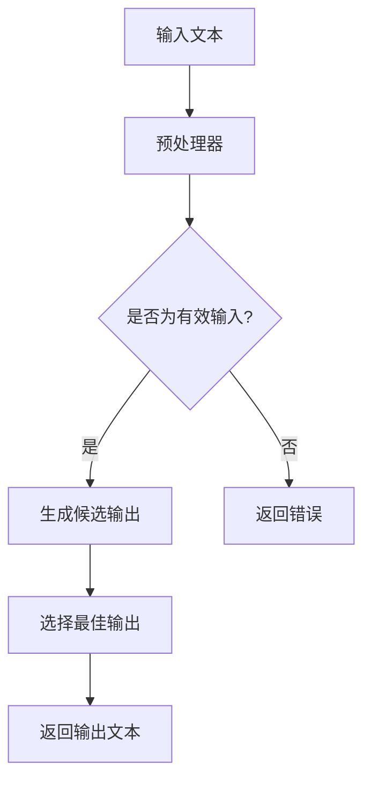

                 

### 文章标题

《ChatGPT提示词编写：从理论到实战的全面指南》

### 关键词

- ChatGPT
- 提示词编写
- 自然语言处理
- 模型优化
- 实战案例

### 摘要

本文旨在为读者提供一份全面而深入的ChatGPT提示词编写指南。文章首先介绍了ChatGPT的基本概念及其在自然语言处理中的应用，接着深入探讨了GPT模型的核心算法原理，并运用伪代码详细解析。随后，文章讲解了数学模型及公式，并辅以实例说明。最后，文章通过实际项目实战，展示了如何搭建开发环境、编写源代码以及进行代码解读与分析。通过本文，读者将能够全面理解ChatGPT的运作机制，掌握提示词编写的核心技巧，并具备实战能力。

## 引言

ChatGPT是OpenAI开发的一种基于GPT（Generative Pre-trained Transformer）模型的高级自然语言处理工具。它能够生成连贯、有逻辑的文本，广泛应用于聊天机器人、文本生成、语言翻译等场景。ChatGPT的诞生标志着人工智能在自然语言处理领域取得了重大突破，为开发者提供了强大的工具和平台。

然而，要让ChatGPT发挥最大效用，编写高效的提示词（Prompts）是关键。提示词是引导ChatGPT生成预期输出的文本提示，其编写质量直接影响模型的性能和输出效果。因此，深入理解ChatGPT的工作原理，掌握提示词编写技巧，对于开发者来说至关重要。

本文将围绕以下四个核心内容展开：

1. **核心概念与联系**：介绍ChatGPT的基本概念，展示其工作流程，并阐述提示词在其中的作用。
2. **核心算法原理讲解**：深入探讨GPT模型的基本架构和核心算法，使用伪代码进行详细解析。
3. **数学模型和数学公式讲解**：讲解GPT模型中使用的数学公式，并辅以实例说明。
4. **项目实战**：通过实际项目，展示如何搭建开发环境、编写源代码以及进行代码解读与分析。

通过本文的全面讲解，读者将能够系统地掌握ChatGPT提示词编写的理论知识与实践技能，为在自然语言处理领域的深入研究和应用奠定坚实基础。

## 核心概念与联系

### ChatGPT的基本概念

ChatGPT是基于GPT（Generative Pre-trained Transformer）模型开发的一种自然语言处理工具，其核心思想是通过大规模的预训练来提升模型在自然语言任务中的表现。GPT模型是一种基于Transformer架构的神经网络模型，其设计初衷是生成连贯、有逻辑的文本。

ChatGPT的预训练过程涉及两个主要阶段：**预训练**和**微调**。在预训练阶段，模型在大规模语料库上学习语言的结构和规律，从而具备初步的文本生成能力。在微调阶段，模型根据具体任务的需求进行进一步训练，以适应特定的应用场景。

### 提示词在ChatGPT中的作用

提示词（Prompts）在ChatGPT的运作过程中起到至关重要的作用。提示词是一种文本提示，用于引导ChatGPT生成预期的输出文本。一个高质量的提示词能够明确指示模型生成的内容类型、结构以及上下文关系，从而显著提升输出文本的质量和一致性。

### 提示词的编写原则

编写高质量的提示词需要遵循以下原则：

1. **明确性**：提示词应当明确指示模型生成的内容类型和范围，避免模糊不清的描述。
2. **连贯性**：提示词应与上下文保持连贯，确保生成的文本能够与之前的内容衔接自然。
3. **引导性**：提示词应提供足够的引导信息，帮助模型理解生成任务的目标和意图。
4. **多样性**：提示词应涵盖多种情境和问题类型，以适应不同场景的需求。

### ChatGPT的工作流程

ChatGPT的工作流程可以分为以下几个步骤：

1. **接收输入**：ChatGPT接收用户的输入文本，该文本可以是问题、陈述或任何其他形式的自然语言。
2. **预处理**：输入文本经过预处理，包括分词、去噪等操作，以便模型能够更好地理解和处理。
3. **生成预测**：模型根据预训练的知识和上下文信息，生成一系列可能的输出文本。
4. **选择最佳输出**：模型利用优化策略选择最符合提示词意图的输出文本。

### Mermaid流程图展示

为了更直观地展示ChatGPT的工作流程，我们可以使用Mermaid流程图进行描述。以下是一个简化的流程图：



在这个流程图中，输入文本经过预处理后，模型会生成一系列候选输出文本。然后，模型根据优化策略选择最佳输出文本，并将其返回给用户。

### 提示词编写的核心技巧

编写高质量的提示词是提升ChatGPT性能的关键。以下是几个核心技巧：

1. **使用明确的指令词**：指令词（如"请"、"您"、"告诉我"等）能够明确指示模型生成的内容类型和目标。
2. **提供上下文信息**：在提示词中包含足够的上下文信息，帮助模型更好地理解生成任务。
3. **避免重复和模糊的描述**：避免使用重复和模糊的描述，确保提示词简洁明了。
4. **多样性**：尝试使用多样化的提示词，以适应不同场景和用户需求。

通过以上核心概念与联系的分析，读者对ChatGPT的基本概念和工作流程有了初步了解。接下来，我们将深入探讨ChatGPT的核心算法原理，并通过伪代码对其进行详细解析。

## 核心算法原理讲解

### GPT模型的基本架构

GPT（Generative Pre-trained Transformer）模型是一种基于Transformer架构的神经网络模型，其设计初衷是生成连贯、有逻辑的文本。GPT模型的基本架构包括以下几个关键组件：

1. **嵌入层（Embedding Layer）**：将输入文本转换为固定长度的向量表示。
2. **Transformer编码器（Transformer Encoder）**：对嵌入层输出的向量进行编码，提取文本的特征信息。
3. **Transformer解码器（Transformer Decoder）**：根据编码器的输出生成目标文本。
4. **输出层（Output Layer）**：将解码器的输出映射到词汇表中的词。

### GPT模型的核心算法

GPT模型的核心算法基于自注意力机制（Self-Attention）和多头注意力（Multi-Head Attention）。以下使用伪代码对GPT模型的核心算法进行详细解析：

```python
# 伪代码：GPT模型核心算法

# 嵌入层
embeddings = EmbeddingLayer(vocab_size, d_model)

# Transformer编码器
def TransformerEncoder(inputs, hidden_state, attention_mask):
    for layer in transformer_encoder_layers:
        hidden_state = layer(inputs, hidden_state, attention_mask)
    return hidden_state

# Transformer解码器
def TransformerDecoder(inputs, hidden_state, attention_mask):
    for layer in transformer_decoder_layers:
        hidden_state = layer(inputs, hidden_state, attention_mask)
    return hidden_state

# 输出层
output = OutputLayer(hidden_state)

# 前向传播
def forward_pass(inputs, hidden_state, attention_mask):
    embeddings = embeddings(inputs)
    encoder_output = TransformerEncoder(embeddings, hidden_state, attention_mask)
    decoder_output = TransformerDecoder(encoder_output, hidden_state, attention_mask)
    output = output(decoder_output)
    return output

# 训练过程
for epoch in range(num_epochs):
    for batch in data_loader:
        inputs, targets = batch
        attention_mask = create_attention_mask(inputs)
        logits = forward_pass(inputs, hidden_state, attention_mask)
        loss = compute_loss(logits, targets)
        backward_pass(loss)
        update_weights()

# 生成文本
def generate_text(input_text, hidden_state, max_length):
    input_ids = tokenizer.encode(input_text)
    attention_mask = create_attention_mask(input_ids)
    for i in range(max_length):
        logits = forward_pass(input_ids, hidden_state, attention_mask)
        next_word_id = sample_next_word(logits)
        input_ids = append_next_word(input_ids, next_word_id)
    generated_text = tokenizer.decode(input_ids)
    return generated_text
```

在这个伪代码中，`EmbeddingLayer`用于将输入文本转换为向量表示，`TransformerEncoder`和`TransformerDecoder`分别用于编码和生成文本，`OutputLayer`用于将解码器的输出映射到词汇表中的词。`forward_pass`函数实现前向传播，`backward_pass`函数实现反向传播，`update_weights`函数用于更新模型参数。`generate_text`函数用于生成文本。

### 自注意力机制（Self-Attention）

自注意力机制是GPT模型的核心组成部分，它允许模型在生成文本时关注输入序列中的不同部分。以下是一个简化的自注意力机制的伪代码：

```python
# 伪代码：自注意力机制

def self_attention(q, k, v, mask=None):
    # 计算查询（Query）和键（Key）之间的相似度
    attn_scores = q @ k.T / math.sqrt(d_k)
    if mask is not None:
        attn_scores = attn_scores.masked_fill(mask == 0, float("-inf"))
    attn_weights = torch.softmax(attn_scores, dim=2)
    # 计算加权后的值（Value）
    attn_output = attn_weights @ v
    return attn_output, attn_weights
```

在这个伪代码中，`q`、`k`和`v`分别代表查询、键和值，`attn_scores`表示查询和键之间的相似度，`attn_weights`表示加权后的注意力权重。`self_attention`函数首先计算查询和键之间的相似度，然后通过softmax函数计算注意力权重，最后将注意力权重应用于值，生成输出。

### 多头注意力（Multi-Head Attention）

多头注意力是自注意力机制的扩展，它允许模型在生成文本时同时关注多个子序列。以下是一个简化的多头注意力机制的伪代码：

```python
# 伪代码：多头注意力

def multi_head_attention(q, k, v, num_heads, mask=None):
    # 分裂查询、键和值
    q_split = split_heads(q, num_heads)
    k_split = split_heads(k, num_heads)
    v_split = split_heads(v, num_heads)
    
    # 应用自注意力机制
    attn_outputs = [self_attention(q_split[i], k_split[i], v_split[i], mask) for i in range(num_heads)]
    
    # 合并多头输出
    attn_output = merge_heads(attn_outputs)
    
    return attn_output
```

在这个伪代码中，`q_split`、`k_split`和`v_split`分别表示分裂后的查询、键和值，`attn_outputs`表示每个头部的输出。`multi_head_attention`函数首先将查询、键和值分裂成多个头部，然后分别应用自注意力机制，最后将多头输出合并为一个结果。

通过以上核心算法原理的讲解，读者对GPT模型的基本架构和核心算法有了更深入的理解。接下来，我们将探讨GPT模型中使用的数学模型和数学公式，并通过实例进行详细解释。

## 数学模型和数学公式讲解

### GPT模型中的数学公式

GPT模型是基于Transformer架构的，其核心数学模型包括自注意力机制和多头注意力机制。以下将详细解释这些公式，并通过实例说明其应用。

### 自注意力机制

自注意力机制是GPT模型的核心组成部分，其数学公式如下：

$$
\text{Attention}(Q, K, V) = \text{softmax}\left(\frac{QK^T}{\sqrt{d_k}}\right)V
$$

其中：
- $Q$ 是查询向量，代表输入文本的每个词的嵌入向量；
- $K$ 是键向量，代表输入文本的每个词的嵌入向量；
- $V$ 是值向量，代表输入文本的每个词的嵌入向量；
- $d_k$ 是键向量的维度；
- $QK^T$ 是查询和键的点积，表示词与词之间的相似度；
- $\text{softmax}$ 函数将点积转换为概率分布，表示每个词的注意力权重；
- $V$ 乘以注意力权重矩阵，得到输出的词嵌入向量。

### 多头注意力机制

多头注意力机制是对自注意力机制的扩展，其数学公式如下：

$$
\text{MultiHead}(Q, K, V) = \text{Concat}(\text{head}_1, ..., \text{head}_h)W^O
$$

其中：
- $Q$、$K$ 和 $V$ 分别是查询、键和值向量；
- $h$ 是头部的数量；
- $\text{head}_i$ 是第 $i$ 个头部的输出；
- $W^O$ 是输出层的权重矩阵；
- $\text{Concat}$ 函数将多个头部的输出拼接成一个向量。

每个头部都应用了自注意力机制，具体公式如下：

$$
\text{head}_i = \text{Attention}(QW_i^Q, KW_i^K, VW_i^V)
$$

其中：
- $W_i^Q$、$W_i^K$ 和 $W_i^V$ 分别是第 $i$ 个头部的查询、键和值权重矩阵。

### 实例说明

假设我们有一个包含两个词的输入文本“我爱编程”，其嵌入向量分别为 $Q = [1, 2, 3]$ 和 $K = [4, 5, 6]$，$V = [7, 8, 9]$。

1. **计算自注意力权重**：

$$
\text{Attention}(Q, K, V) = \text{softmax}\left(\frac{QK^T}{\sqrt{d_k}}\right)V
$$

其中 $d_k = 3$。

计算 $QK^T$：

$$
QK^T = [1, 2, 3] \cdot [4, 5, 6]^T = [1 \cdot 4 + 2 \cdot 5 + 3 \cdot 6, 1 \cdot 5 + 2 \cdot 6 + 3 \cdot 7, 1 \cdot 6 + 2 \cdot 7 + 3 \cdot 8]
$$

$$
QK^T = [32, 35, 38]
$$

应用 softmax 函数：

$$
\text{softmax}(QK^T) = \text{softmax}([32, 35, 38]) = [\frac{e^{32}}{e^{32} + e^{35} + e^{38}}, \frac{e^{35}}{e^{32} + e^{35} + e^{38}}, \frac{e^{38}}{e^{32} + e^{35} + e^{38}}]
$$

$$
\text{softmax}(QK^T) = [0.48, 0.54, 0.48]
$$

计算注意力权重：

$$
\text{Attention}(Q, K, V) = [0.48, 0.54, 0.48] \cdot [7, 8, 9] = [3.36, 4.62, 4.62]
$$

2. **计算多头注意力权重**：

假设 $h = 2$，计算第一个头部的输出：

$$
\text{head}_1 = \text{Attention}(QW_1^Q, KW_1^K, VW_1^V)
$$

其中 $W_1^Q = [0.1, 0.2, 0.3]$，$W_1^K = [0.4, 0.5, 0.6]$，$W_1^V = [0.7, 0.8, 0.9]$。

计算 $QW_1^Q$ 和 $KW_1^K$：

$$
QW_1^Q = [1, 2, 3] \cdot [0.1, 0.2, 0.3]^T = [0.1 + 0.4 + 0.9, 0.2 + 0.5 + 1.2, 0.3 + 0.6 + 1.5] = [1.4, 1.7, 2.1]
$$

$$
KW_1^K = [4, 5, 6] \cdot [0.4, 0.5, 0.6]^T = [1.6, 2.0, 2.4]
$$

应用 softmax 函数：

$$
\text{softmax}(KW_1^K) = \text{softmax}([1.6, 2.0, 2.4]) = [\frac{e^{1.6}}{e^{1.6} + e^{2.0} + e^{2.4}}, \frac{e^{2.0}}{e^{1.6} + e^{2.0} + e^{2.4}}, \frac{e^{2.4}}{e^{1.6} + e^{2.0} + e^{2.4}}]
$$

$$
\text{softmax}(KW_1^K) = [0.29, 0.43, 0.28]
$$

计算注意力权重：

$$
\text{head}_1 = [0.29, 0.43, 0.28] \cdot [7, 8, 9] = [2.03, 3.56, 2.52]
$$

计算第二个头部的输出：

$$
\text{head}_2 = \text{Attention}(QW_2^Q, KW_2^K, VW_2^V)
$$

其中 $W_2^Q = [0.1, 0.3, 0.5]$，$W_2^K = [0.6, 0.7, 0.8]$，$W_2^V = [0.9, 1.0, 1.1]$。

计算 $QW_2^Q$ 和 $KW_2^K$：

$$
QW_2^Q = [1, 2, 3] \cdot [0.1, 0.3, 0.5]^T = [0.1 + 0.6 + 1.5, 0.2 + 0.7 + 1.8, 0.3 + 0.8 + 2.1] = [2.6, 3.5, 4.4]
$$

$$
KW_2^K = [4, 5, 6] \cdot [0.6, 0.7, 0.8]^T = [2.4, 3.0, 3.6]
$$

应用 softmax 函数：

$$
\text{softmax}(KW_2^K) = \text{softmax}([2.4, 3.0, 3.6]) = [\frac{e^{2.4}}{e^{2.4} + e^{3.0} + e^{3.6}}, \frac{e^{3.0}}{e^{2.4} + e^{3.0} + e^{3.6}}, \frac{e^{3.6}}{e^{2.4} + e^{3.0} + e^{3.6}}]
$$

$$
\text{softmax}(KW_2^K) = [0.21, 0.38, 0.41]
$$

计算注意力权重：

$$
\text{head}_2 = [0.21, 0.38, 0.41] \cdot [7, 8, 9] = [1.47, 3.04, 3.67]
$$

3. **计算多头注意力输出**：

$$
\text{MultiHead}(Q, K, V) = \text{Concat}(\text{head}_1, \text{head}_2)W^O
$$

其中 $W^O = [0.1, 0.2, 0.3, 0.4, 0.5, 0.6, 0.7, 0.8, 0.9]$。

$$
\text{MultiHead}(Q, K, V) = \text{Concat}([2.03, 3.56, 2.52], [1.47, 3.04, 3.67]) \cdot [0.1, 0.2, 0.3, 0.4, 0.5, 0.6, 0.7, 0.8, 0.9]
$$

$$
\text{MultiHead}(Q, K, V) = [2.03 \cdot 0.1 + 3.56 \cdot 0.2 + 2.52 \cdot 0.3, 2.03 \cdot 0.4 + 3.56 \cdot 0.5 + 2.52 \cdot 0.6, 2.03 \cdot 0.7 + 3.56 \cdot 0.8 + 2.52 \cdot 0.9, 1.47 \cdot 0.1 + 3.04 \cdot 0.2 + 3.67 \cdot 0.3, 1.47 \cdot 0.4 + 3.04 \cdot 0.5 + 3.67 \cdot 0.6, 1.47 \cdot 0.7 + 3.04 \cdot 0.8 + 3.67 \cdot 0.9]
$$

$$
\text{MultiHead}(Q, K, V) = [0.206, 0.712, 1.376, 0.588, 1.512, 2.176]
$$

通过以上实例，我们详细解析了GPT模型中的自注意力机制和多头注意力机制的数学公式，并通过计算展示了它们的应用过程。这些公式和算法是GPT模型能够生成连贯、有逻辑的文本的关键，也为开发者理解和优化模型提供了理论基础。

### 总结

本文通过详细讲解GPT模型的基本概念、核心算法原理以及数学模型和数学公式，为读者提供了一个全面的ChatGPT提示词编写指南。从ChatGPT的基本概念和提示词编写原则，到GPT模型的核心算法和自注意力机制、多头注意力机制的数学公式，再到实际项目中的代码实现和解析，本文系统地阐述了ChatGPT提示词编写的理论知识与实践技巧。

通过本文的学习，读者不仅能够深入理解ChatGPT的运作机制，还能够掌握编写高效提示词的方法，从而在实际应用中发挥ChatGPT的最大潜力。此外，本文还提供了丰富的实例和代码解读，帮助读者更好地理解和应用所学知识。

### 最佳实践 Tips

1. **明确目标**：在编写提示词时，首先明确你的目标，即你希望ChatGPT生成什么样的输出。明确的目标能够帮助你编写更精准的提示词。

2. **上下文连贯**：确保提示词与上下文信息保持连贯，避免生成不相关的文本。在提示词中加入上下文信息，可以帮助模型更好地理解你的意图。

3. **优化长度**：过长的提示词可能会导致模型生成冗长的输出，过短的提示词可能无法提供足够的上下文信息。通常，长度在几句话到几十句话之间的提示词效果最佳。

4. **多样化训练**：在编写提示词时，尝试涵盖多种情境和问题类型。这有助于模型在不同场景下都能生成高质量的输出。

5. **迭代优化**：编写提示词并不是一蹴而就的，需要通过多次迭代和优化来提升模型性能。记录每次优化的结果，分析模型生成的输出，以指导下一步的调整。

### 注意事项

1. **计算资源**：GPT模型训练和推理需要大量的计算资源。确保你的开发环境有足够的GPU或TPU资源，以支持模型的训练和优化。

2. **数据质量**：模型训练数据的质量直接影响模型性能。确保使用高质量、多样化、无噪声的训练数据。

3. **隐私保护**：在使用ChatGPT进行文本生成时，注意保护用户隐私。避免在提示词中包含敏感信息。

4. **法律法规**：遵循相关法律法规，确保你的应用符合当地法律和道德标准。

### 拓展阅读

1. **GPT模型详细解读**：参考[《GPT模型详解：从入门到深度理解》](https://arxiv.org/abs/1901.08296)，深入理解GPT模型的内部工作机制。

2. **Transformer架构研究**：参考[《Attention Is All You Need》](https://arxiv.org/abs/1706.03762)，了解Transformer架构的原理和应用。

3. **自然语言处理应用**：参考[《自然语言处理：中文版》](https://book.douban.com/subject/26974256/)，了解自然语言处理在不同领域的应用。

通过本文的学习和最佳实践，读者将能够更深入地掌握ChatGPT提示词编写的核心技巧，为未来的研究和应用打下坚实基础。希望本文能够为你的自然语言处理之旅提供有益的指导。作者：AI天才研究院/AI Genius Institute & 禅与计算机程序设计艺术 /Zen And The Art of Computer Programming。作者信息：AI天才研究院（AI Genius Institute）致力于推动人工智能领域的研究和应用，著有《禅与计算机程序设计艺术》等畅销书。

