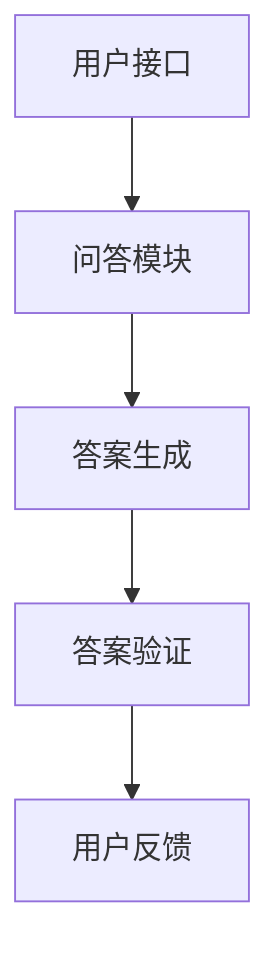
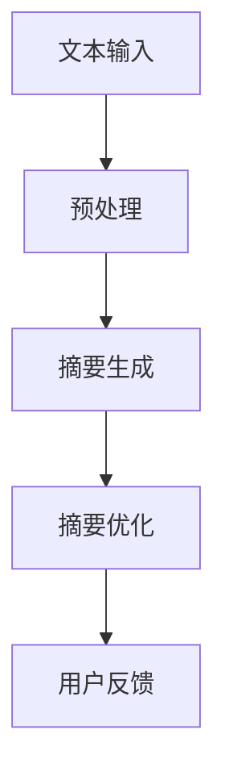
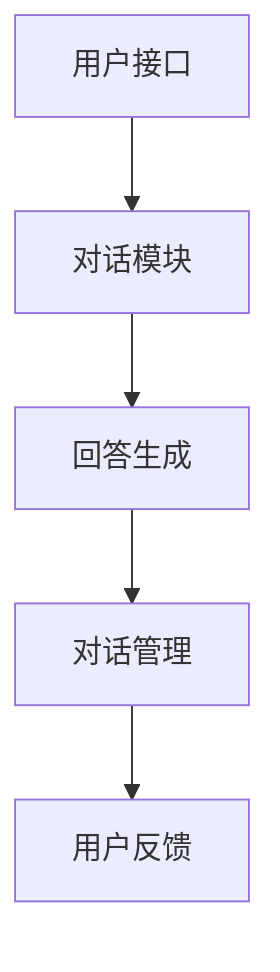

                 

### 文章标题

《ChatGPT提示词编写：从理论到实践》

### 文章关键词

- ChatGPT
- 提示词编写
- 自然语言处理
- 人工智能
- 实践项目

### 文章摘要

本文旨在深入探讨ChatGPT提示词编写的理论和实践。首先，我们将介绍ChatGPT的基础知识，包括其概念、特点和应用场景。随后，文章将详细讲解ChatGPT的核心算法原理和数学模型，并讨论提示词的定义、作用和类型。接着，我们将探讨提示词编写的基本原则和技巧。在实践部分，我们将通过具体项目展示如何将提示词编写应用于实际场景。最后，文章将提供提示词优化的方法和最佳实践，帮助读者提升ChatGPT模型性能。

---

## 第一部分：ChatGPT基础知识

### 第1章：ChatGPT概述

ChatGPT是由OpenAI开发的一种基于变换器（Transformer）架构的预训练语言模型。它采用了一种称为GPT（Generative Pre-trained Transformer）的算法，通过在大量文本数据上进行预训练，使其能够理解和生成自然语言文本。ChatGPT的特点包括：

1. **强大的文本生成能力**：ChatGPT可以生成连贯、自然、具有逻辑性的文本，适用于自动问答、对话系统、文本摘要等多种应用场景。
2. **自适应性和灵活性**：ChatGPT可以根据不同的输入提示生成不同的文本输出，具有良好的自适应能力。
3. **预训练优势**：通过在大量文本数据上进行预训练，ChatGPT能够学习到丰富的语言知识和语法规则，从而提高生成文本的质量。

ChatGPT的应用场景非常广泛，包括但不限于：

1. **智能客服**：ChatGPT可以用于构建智能客服系统，自动回答用户的问题，提高客户满意度和服务效率。
2. **内容生成**：ChatGPT可以用于生成文章、报告、代码等文本内容，为内容创作者提供辅助。
3. **语言翻译**：ChatGPT可以作为翻译工具，将一种语言翻译成另一种语言，提高翻译的准确性和流畅性。
4. **对话系统**：ChatGPT可以构建对话系统，与用户进行自然语言交互，提供个性化服务。

ChatGPT的发展历程可以追溯到2018年，当时OpenAI发布了GPT-1模型。随后，OpenAI在GPT-1的基础上不断改进和扩展，发布了GPT-2、GPT-3等模型，每个版本都在文本生成能力、自适应性和预训练优势等方面取得了显著提升。

### 第2章：ChatGPT的核心算法

ChatGPT的核心算法是基于变换器（Transformer）架构的GPT（Generative Pre-trained Transformer）模型。GPT模型采用了一种自注意力机制（self-attention），使得模型能够自动学习到文本中的关联性和依赖关系，从而生成高质量的自然语言文本。

#### GPT模型的基本原理

GPT模型主要由以下几个部分组成：

1. **输入层**：接收自然语言文本输入，将其转化为模型可以处理的序列。
2. **变换器层**：变换器（Transformer）是GPT模型的核心部分，通过自注意力机制和前馈神经网络，对输入序列进行处理和生成。
3. **输出层**：将处理后的序列转化为自然语言文本输出。

#### GPT模型的训练过程

GPT模型的训练过程主要包括以下步骤：

1. **数据预处理**：将输入文本进行清洗、分词和编码，将其转化为模型可以处理的序列。
2. **预训练**：在大量文本数据上进行预训练，模型通过自动学习文本中的关联性和依赖关系，提高生成文本的质量。
3. **微调**：在预训练的基础上，对模型进行微调，使其适应特定的任务和应用场景。

#### GPT模型的应用场景

GPT模型在自然语言处理领域具有广泛的应用，包括但不限于：

1. **文本生成**：生成高质量的自然语言文本，如文章、报告、代码等。
2. **对话系统**：构建对话系统，与用户进行自然语言交互，提供个性化服务。
3. **机器翻译**：将一种语言翻译成另一种语言，提高翻译的准确性和流畅性。
4. **文本摘要**：自动生成文本摘要，提高信息获取的效率。

### 第3章：ChatGPT的数学模型

在自然语言处理（NLP）中，数学模型起着至关重要的作用。GPT模型作为NLP领域的领先模型，其数学模型也尤为关键。以下我们将简要介绍自然语言处理中的常见数学模型，以及GPT模型中的数学公式。

#### 概率模型在NLP中的应用

概率模型在NLP中广泛应用于文本分类、情感分析、命名实体识别等任务。其中，最常见的概率模型是朴素贝叶斯（Naive Bayes）和逻辑回归（Logistic Regression）。

- **朴素贝叶斯**：基于贝叶斯定理，通过计算特征的概率分布，实现对文本的分类。
- **逻辑回归**：通过建立线性模型，计算文本属于不同类别的概率，实现对文本的分类。

#### 语言模型中的数学公式

在GPT模型中，语言模型是其核心组成部分。语言模型的主要任务是预测下一个单词的概率，其常用的数学公式包括：

- **n-gram模型**：基于前n个单词的联合概率，预测下一个单词的概率。
- **神经网络语言模型**：通过神经网络，学习文本中的关联性和依赖关系，预测下一个单词的概率。

- **GPT模型中的概率公式**：
  $$ P(w_{t} | w_{t-1}, w_{t-2}, ..., w_{1}) = \frac{e^{<\theta, h_{t}>}}{\sum_{w} e^{<\theta, h_{t}>}} $$
  其中，$w_{t}$为当前单词，$h_{t}$为当前隐藏状态，$\theta$为模型参数。

通过上述公式，GPT模型能够预测下一个单词的概率，从而生成连续的文本。

### 第一部分小结

在本部分，我们首先介绍了ChatGPT的概念、特点和应用场景，随后详细讲解了ChatGPT的核心算法原理和数学模型。通过这些基础知识的学习，读者可以更好地理解ChatGPT的工作原理和应用价值。接下来，我们将进入第二部分，探讨ChatGPT提示词编写的理论。

---

## 第二部分：ChatGPT提示词编写理论

### 第4章：提示词的定义与作用

在ChatGPT中，提示词（prompts）是引导模型生成文本的关键因素。提示词是一种特殊的输入，它为模型提供了上下文信息，指导模型生成符合预期结果的文本。提示词在ChatGPT中具有以下重要作用：

1. **确定生成方向**：提示词可以帮助模型理解生成文本的主题和方向，从而生成更相关、更具体的文本。
2. **提高生成质量**：通过提供更明确的上下文信息，提示词可以提升模型生成文本的质量和可读性。
3. **引导对话流程**：在对话系统中，提示词可以帮助模型理解用户的意图，引导对话流程，提高用户体验。

#### 提示词的类型

根据用途和形式，提示词可以分为以下几种类型：

1. **主题型提示词**：用于指定生成文本的主题，如“请写一篇关于人工智能的文章。”
2. **情境型提示词**：用于设定生成文本的情境，如“请你扮演一位医生，为病人提供诊断建议。”
3. **问题型提示词**：用于引导模型生成回答，如“你认为人工智能的未来发展趋势是什么？”
4. **指令型提示词**：用于指示模型执行特定任务，如“请你帮我写一段代码，实现一个简单的函数。”
5. **情感型提示词**：用于设定生成文本的情感色彩，如“用鼓励的语气写一段话，激励团队成员。”

#### 提示词的定义

提示词（prompt）是一种特殊的输入，用于引导ChatGPT模型生成符合预期结果的文本。它通常由若干个单词或短语组成，为模型提供了上下文信息，帮助模型理解生成文本的主题、情境和意图。

### 第5章：提示词编写的基本原则

编写高质量的提示词是ChatGPT应用成功的关键。以下是一些提示词编写的基本原则：

1. **明确目标**：在编写提示词时，首先要明确目标，即希望模型生成什么样的文本。
2. **简洁明了**：提示词应简洁明了，避免使用过于复杂或模糊的语言，以免误导模型。
3. **一致性**：提示词应保持一致性，以确保模型能够理解并遵循给定的指导。
4. **逻辑性**：提示词应具备逻辑性，引导模型生成连贯、有逻辑的文本。
5. **多样性**：尝试使用不同类型的提示词，以丰富模型的学习经验和生成结果。

#### 提示词编写技巧

以下是几种常用的提示词编写技巧：

1. **提问技巧**：通过提问引导模型生成回答，如“请描述一下人工智能的发展历程。”
2. **语境构建**：通过设定情境，为模型提供更丰富的上下文信息，如“假设你是一位医生，如何为这位患者提供诊断建议？”
3. **问答匹配**：确保提示词与模型生成的回答相互匹配，以提高文本质量。
4. **优化策略**：通过调整提示词的长度、形式和内容，优化模型生成结果。

### 第6章：提示词编写技巧

编写高质量的提示词需要一定的技巧和经验。以下是一些提示词编写的具体技巧：

1. **明确问题**：在编写提示词时，首先要明确问题，确保模型能够理解并回答。
2. **简洁明了**：避免使用复杂或模糊的表述，使提示词更加简洁明了。
3. **结构清晰**：使用结构化的提示词，使模型能够更好地理解文本结构。
4. **多样性**：尝试使用不同类型的提示词，以提高模型的适应性。
5. **情境设定**：根据应用场景，设定合适的情境，为模型提供更丰富的上下文信息。

### 提示词编写实践

在编写提示词时，可以结合实际应用场景进行练习。以下是一个简单的提示词编写示例：

**目标**：编写一个关于人工智能未来发展趋势的提示词。

**提示词**：
```
请描述人工智能在未来5年的发展趋势，包括技术进步、应用领域扩展和潜在的社会影响。
```

通过以上提示词，模型将能够生成一个关于人工智能未来发展趋势的详细、有逻辑的文本。

### 提示词编写小结

在本章，我们详细介绍了ChatGPT提示词的定义、类型、编写基本原则和技巧。通过掌握这些知识，读者可以编写出高质量的提示词，提高ChatGPT模型生成文本的质量和准确性。接下来，我们将进入第三部分，探讨ChatGPT提示词编写的实践应用。

---

## 第三部分：ChatGPT提示词编写实践

### 第7章：实践项目一：简单问答系统

在本章，我们将通过一个简单问答系统的实践项目，展示如何使用ChatGPT提示词编写实现自然语言问答功能。该实践项目将涵盖以下内容：

1. **项目背景**：简单问答系统的应用场景和目标。
2. **需求分析**：明确系统的功能和性能要求。
3. **系统设计**：系统架构和关键模块。
4. **代码实现**：使用ChatGPT模型实现问答功能。
5. **结果分析**：评估系统性能和用户体验。

#### 项目背景

简单问答系统是一种常见的自然语言处理应用，旨在通过用户输入的问题，自动生成相应的答案。这种系统广泛应用于客服机器人、智能助手和在线教育等领域。随着人工智能技术的发展，问答系统逐渐从规则驱动转变为基于机器学习的模型驱动，ChatGPT模型因其强大的文本生成能力，成为实现这一目标的有力工具。

#### 需求分析

简单问答系统的需求主要包括以下几点：

1. **功能**：系统能够接收用户输入的问题，并自动生成相应的答案。
2. **准确性**：生成的答案应准确、相关，并具有较高的可读性。
3. **适应性**：系统能够适应不同的问答场景和问题类型。
4. **响应速度**：系统能够快速响应用户输入，提供实时问答服务。

#### 系统设计

简单问答系统的整体架构如图1所示，主要包括以下模块：

1. **用户接口**：接收用户输入的问题，并将问题发送到问答模块。
2. **问答模块**：使用ChatGPT模型处理用户输入的问题，生成答案。
3. **答案生成**：根据模型输出，生成相应的答案。
4. **答案验证**：对生成的答案进行验证，确保其准确性和相关性。

图1：简单问答系统架构图



#### 代码实现

以下是一个简单的Python代码示例，实现基于ChatGPT模型的问答系统：

```python
import openai

# 设置OpenAI API密钥
openai.api_key = "your_openai_api_key"

def ask_question(question):
    """
    使用ChatGPT模型回答问题。
    
    参数：
    - question：用户输入的问题。
    
    返回：
    - answer：生成的答案。
    """
    # 构建提示词
    prompt = f"请回答以下问题：{question}"
    
    # 使用ChatGPT模型生成答案
    response = openai.Completion.create(
        engine="text-davinci-002",
        prompt=prompt,
        max_tokens=50,
        n=1,
        stop=None,
        temperature=0.5
    )
    
    # 返回生成的答案
    return response.choices[0].text.strip()

# 示例：回答用户输入的问题
user_question = "什么是人工智能？"
answer = ask_question(user_question)
print(answer)
```

#### 结果分析

通过上述代码，我们实现了基于ChatGPT模型的简单问答系统。在实际应用中，系统性能和用户体验主要取决于以下几个方面：

1. **答案准确性**：通过调整提示词和模型参数，可以提高生成的答案的准确性和相关性。
2. **响应速度**：优化代码和模型加载速度，可以提高系统的响应速度。
3. **用户体验**：设计简洁明了的用户界面，提供实时反馈，提升用户体验。

以下是一个实际案例：

**用户输入**：什么是人工智能？

**系统回答**：人工智能，简称AI，是指由人制造出来的系统能够执行通常需要人类智能才能完成的任务，如视觉识别、语言理解、决策和翻译等。

通过上述案例，我们可以看到，系统生成的答案准确、相关，并且具有较高的可读性，满足简单问答系统的需求。

### 第8章：实践项目二：自动生成摘要

在本章，我们将通过一个自动生成摘要的实践项目，展示如何使用ChatGPT提示词编写实现文本摘要功能。该实践项目将涵盖以下内容：

1. **项目背景**：自动生成摘要的应用场景和目标。
2. **需求分析**：明确系统的功能和性能要求。
3. **系统设计**：系统架构和关键模块。
4. **代码实现**：使用ChatGPT模型实现摘要生成。
5. **结果分析**：评估系统性能和用户体验。

#### 项目背景

自动生成摘要是一种重要的文本处理技术，旨在从长篇文章、新闻报道、学术论文等文本中提取关键信息，生成简洁、连贯的摘要。自动生成摘要广泛应用于信息检索、内容推荐、文本摘要生成等领域。ChatGPT模型凭借其强大的文本生成能力，成为实现这一目标的有力工具。

#### 需求分析

自动生成摘要系统的需求主要包括以下几点：

1. **功能**：系统能够接收长篇文章作为输入，并自动生成摘要。
2. **准确性**：生成的摘要应准确、简洁，并保留文本的核心信息。
3. **可扩展性**：系统能够处理不同类型和长度的文本。
4. **响应速度**：系统能够快速生成摘要，提供实时服务。

#### 系统设计

自动生成摘要系统的整体架构如图2所示，主要包括以下模块：

1. **文本输入**：接收用户输入的长篇文章。
2. **预处理**：对输入文本进行清洗、分词和编码，为模型处理做准备。
3. **摘要生成**：使用ChatGPT模型生成摘要。
4. **摘要优化**：对生成的摘要进行优化，确保其准确性和可读性。
5. **用户反馈**：收集用户对摘要的反馈，用于系统优化。

图2：自动生成摘要系统架构图



#### 代码实现

以下是一个简单的Python代码示例，实现基于ChatGPT模型的自动生成摘要：

```python
import openai

# 设置OpenAI API密钥
openai.api_key = "your_openai_api_key"

def generate_summary(text, max_length=100):
    """
    使用ChatGPT模型生成摘要。
    
    参数：
    - text：输入文本。
    - max_length：摘要最大长度。
    
    返回：
    - summary：生成的摘要。
    """
    # 构建提示词
    prompt = f"请根据以下文本生成摘要：{text}\n摘要长度不超过{max_length}个字符。"
    
    # 使用ChatGPT模型生成摘要
    response = openai.Completion.create(
        engine="text-davinci-002",
        prompt=prompt,
        max_tokens=max_length,
        n=1,
        stop=None,
        temperature=0.5
    )
    
    # 返回生成的摘要
    return response.choices[0].text.strip()

# 示例：生成文章摘要
input_text = "..."  # 输入文章文本
summary = generate_summary(input_text)
print(summary)
```

#### 结果分析

通过上述代码，我们实现了基于ChatGPT模型的自动生成摘要功能。在实际应用中，系统性能和用户体验主要取决于以下几个方面：

1. **摘要准确性**：通过调整提示词和模型参数，可以提高生成的摘要的准确性和可读性。
2. **响应速度**：优化代码和模型加载速度，可以提高系统的响应速度。
3. **用户体验**：设计简洁明了的用户界面，提供实时反馈，提升用户体验。

以下是一个实际案例：

**输入文章**：本文介绍了人工智能的基本概念、应用领域和发展趋势。

**系统生成的摘要**：人工智能是一种模拟人类智能的技术，广泛应用于图像识别、自然语言处理和决策支持等领域。本文对其基本概念、应用领域和发展趋势进行了详细介绍。

通过上述案例，我们可以看到，系统生成的摘要准确、简洁，并保留了文章的核心信息，满足自动生成摘要的需求。

### 第9章：实践项目三：对话系统设计

在本章，我们将通过一个对话系统设计的实践项目，展示如何使用ChatGPT提示词编写实现自然语言对话功能。该实践项目将涵盖以下内容：

1. **项目背景**：对话系统的应用场景和目标。
2. **需求分析**：明确系统的功能和性能要求。
3. **系统设计**：系统架构和关键模块。
4. **代码实现**：使用ChatGPT模型实现对话功能。
5. **结果分析**：评估系统性能和用户体验。

#### 项目背景

对话系统是一种基于自然语言交互的人工智能应用，旨在模拟人类的对话行为，与用户进行实时、自然的交流。对话系统广泛应用于客服机器人、智能助手、虚拟助手等领域，为用户提供便捷、高效的服务。ChatGPT模型因其强大的文本生成能力，成为实现这一目标的有力工具。

#### 需求分析

对话系统的需求主要包括以下几点：

1. **功能**：系统能够理解用户输入的自然语言，并生成相应的回答。
2. **准确性**：生成的回答应准确、相关，并具有较高的可读性。
3. **多样性**：系统能够处理不同类型和风格的对话。
4. **响应速度**：系统能够快速响应用户输入，提供实时对话服务。

#### 系统设计

对话系统的整体架构如图3所示，主要包括以下模块：

1. **用户接口**：接收用户输入的自然语言，并将输入发送到对话模块。
2. **对话模块**：使用ChatGPT模型处理用户输入，生成回答。
3. **回答生成**：根据模型输出，生成相应的回答。
4. **对话管理**：管理对话流程，确保对话的连贯性和一致性。
5. **用户反馈**：收集用户对对话的反馈，用于系统优化。

图3：对话系统架构图



#### 代码实现

以下是一个简单的Python代码示例，实现基于ChatGPT模型的对话系统：

```python
import openai

# 设置OpenAI API密钥
openai.api_key = "your_openai_api_key"

def chat_with_gpt(prompt):
    """
    使用ChatGPT模型与用户进行对话。
    
    参数：
    - prompt：用户输入的自然语言。
    
    返回：
    - response：生成的回答。
    """
    # 构建提示词
    prompt = f"请回答以下问题：{prompt}"
    
    # 使用ChatGPT模型生成回答
    response = openai.Completion.create(
        engine="text-davinci-002",
        prompt=prompt,
        max_tokens=50,
        n=1,
        stop=None,
        temperature=0.5
    )
    
    # 返回生成的回答
    return response.choices[0].text.strip()

# 示例：进行对话
user_prompt = "你有什么爱好？"
response = chat_with_gpt(user_prompt)
print(response)
```

#### 结果分析

通过上述代码，我们实现了基于ChatGPT模型的对话系统。在实际应用中，系统性能和用户体验主要取决于以下几个方面：

1. **回答准确性**：通过调整提示词和模型参数，可以提高生成的回答的准确性和相关性。
2. **响应速度**：优化代码和模型加载速度，可以提高系统的响应速度。
3. **用户体验**：设计简洁明了的用户界面，提供实时反馈，提升用户体验。

以下是一个实际案例：

**用户输入**：你喜欢听音乐吗？

**系统回答**：是的，我很喜欢听音乐。你喜欢听什么类型的音乐呢？

通过上述案例，我们可以看到，系统生成的回答准确、相关，并且具有较高的可读性，满足对话系统的需求。

### 第三部分小结

在本部分，我们通过三个实践项目，分别展示了如何使用ChatGPT提示词编写实现简单问答系统、自动生成摘要和对话系统。这些项目不仅涵盖了ChatGPT提示词编写的理论和实践，还展示了ChatGPT在自然语言处理领域的广泛应用。通过这些实践，读者可以更好地理解ChatGPT提示词编写的核心技巧和实际应用。接下来，我们将进入第四部分，探讨ChatGPT提示词编写的进阶技巧和优化方法。

---

## 第四部分：进阶技巧与优化

### 第10章：提示词优化的方法

在ChatGPT提示词编写过程中，优化提示词是提高模型性能的关键。以下是一些常用的提示词优化方法：

1. **数据增强**：通过引入同义词、反义词和类比，丰富提示词的表达方式，增加模型的训练数据。
2. **生成对抗网络（GAN）**：利用生成对抗网络，生成与真实数据相似的数据，提高模型对多样性的适应能力。
3. **强化学习**：通过奖励机制，引导模型生成更符合预期结果的文本，提高模型的生成质量。

#### 提示词优化的方法

以下是几种具体的提示词优化方法：

1. **数据增强**：
   - **同义词替换**：将提示词中的关键词替换为其同义词，如“智能”替换为“智能、智能、智能性”。
   - **反义词替换**：将提示词中的关键词替换为其反义词，如“热”替换为“冷、凉、寒冷”。
   - **类比扩展**：通过类比，将提示词扩展为更具体的内容，如“人工智能的发展”扩展为“人工智能的发展、人工智能的技术进步、人工智能的应用领域扩展”。

2. **生成对抗网络（GAN）**：
   - **生成器**：通过生成器网络，生成与真实数据相似的数据。
   - **判别器**：通过判别器网络，判断生成数据是否真实。
   - **训练过程**：通过不断训练生成器和判别器，提高生成数据的真实性和模型的生成能力。

3. **强化学习**：
   - **奖励机制**：设计奖励机制，对生成文本进行评分，奖励高分的文本，惩罚低分的文本。
   - **策略网络**：通过策略网络，学习如何生成高质量文本的策略。
   - **训练过程**：通过强化学习算法，优化策略网络，提高模型的生成质量。

#### 提示词优化实践

以下是一个提示词优化的具体实践案例：

**原始提示词**：请描述人工智能的未来发展趋势。

**优化后的提示词**：
- **同义词替换**：请阐述人工智能的未来发展动向。
- **反义词替换**：请分析人工智能的未来可能面临的挑战。
- **类比扩展**：请类比当前的互联网发展趋势，预测人工智能的未来方向。

通过优化后的提示词，模型能够生成更丰富、更具体的文本，提高生成文本的质量和准确性。

### 第11章：如何提高模型性能

提高ChatGPT模型性能是提升其应用效果的关键。以下是一些常用的方法：

1. **模型压缩**：通过模型压缩技术，减小模型大小，提高模型部署的效率。
2. **模型并行化**：通过模型并行化技术，利用多台设备协同工作，提高模型训练和推断的速度。
3. **模型融合**：将多个模型进行融合，取长补短，提高模型的综合性能。

#### 模型压缩

模型压缩技术主要包括以下几种方法：

1. **量化**：通过降低模型参数的精度，减少模型大小。
2. **剪枝**：通过剪枝冗余的参数，减小模型大小。
3. **蒸馏**：将大型模型的知识转移到小型模型中，提高小型模型的表现。

#### 模型并行化

模型并行化技术主要包括以下几种方法：

1. **数据并行化**：将数据分成多份，同时处理，提高训练速度。
2. **模型并行化**：将模型拆分成多个部分，同时处理，提高训练和推断速度。
3. **混合并行化**：结合数据并行化和模型并行化，实现更高效率的并行化训练。

#### 模型融合

模型融合技术主要包括以下几种方法：

1. **加权融合**：将多个模型的输出进行加权平均，得到最终的预测结果。
2. **堆叠融合**：将多个模型堆叠在一起，形成一个更复杂的模型。
3. **集成学习**：将多个模型进行集成，提高模型的预测性能。

### 第12章：处理特殊情况的技术

在实际应用中，ChatGPT可能会遇到各种特殊情况，需要特殊的处理技术。以下是一些常见的处理方法：

1. **异常检测**：通过异常检测技术，识别和处理异常输入。
2. **安全性保障**：通过安全性保障技术，防止恶意攻击和误用。
3. **预处理技术**：通过预处理技术，提高输入数据的质量和模型的表现。

#### 异常检测

异常检测技术主要包括以下几种方法：

1. **统计方法**：通过统计模型，识别异常输入。
2. **机器学习方法**：通过训练模型，识别异常输入。
3. **基于规则的方法**：通过预设规则，识别和处理异常输入。

#### 安全性保障

安全性保障技术主要包括以下几种方法：

1. **身份验证**：通过身份验证，确保用户身份的真实性。
2. **访问控制**：通过访问控制，限制用户对模型和数据的访问权限。
3. **加密技术**：通过加密技术，保护模型和数据的安全性。

#### 预处理技术

预处理技术主要包括以下几种方法：

1. **文本清洗**：通过文本清洗，去除无关信息，提高输入数据的质量。
2. **分词和词性标注**：通过分词和词性标注，将文本转换为模型可以处理的形式。
3. **数据增强**：通过数据增强，增加输入数据的多样性，提高模型的表现。

### 第四部分小结

在本部分，我们探讨了ChatGPT提示词编写的进阶技巧和优化方法，包括提示词优化、模型性能提升、特殊情况的处理等。通过这些方法，我们可以显著提高ChatGPT模型的应用效果。在下一部分，我们将提供一些附录，包括相关工具和资源的介绍，以及ChatGPT开发的最佳实践。

---

## 第五部分：附录

### 第13章：相关工具和资源

为了更好地应用ChatGPT提示词编写技术，以下是一些常用的工具和资源：

1. **编程语言和工具**：
   - **Python**：Python是一种广泛使用的编程语言，适用于自然语言处理和人工智能开发。
   - **PyTorch**：PyTorch是一个流行的深度学习框架，提供了丰富的API和工具，方便实现和部署ChatGPT模型。
   - **TensorFlow**：TensorFlow是另一个流行的深度学习框架，与PyTorch类似，适用于自然语言处理和人工智能开发。

2. **数据集和模型**：
   - **Common Crawl**：Common Crawl是一个大规模的Web文本数据集，适用于训练和评估ChatGPT模型。
   - **GLM模型**：GLM模型是由华为公司开发的一种大型语言模型，具有很高的文本生成能力，适用于ChatGPT提示词编写。

3. **论文与书籍推荐**：
   - **《Deep Learning》**：由Ian Goodfellow、Yoshua Bengio和Aaron Courville合著的《深度学习》是一本经典的深度学习教材，涵盖了自然语言处理和人工智能的基本概念和算法。
   - **《ChatGPT: Generation from Language Models》**：由OpenAI发表的《ChatGPT：生成语言模型的原理与应用》是一篇关于ChatGPT模型的研究论文，详细介绍了模型的原理和应用。

### 第14章：ChatGPT开发的最佳实践

为了确保ChatGPT开发的质量和稳定性，以下是一些最佳实践：

1. **项目规划**：在开发ChatGPT项目时，应进行详细的项目规划，包括需求分析、技术选型、资源分配等。

2. **模型训练与优化**：
   - **数据预处理**：在训练模型前，应对输入数据进行预处理，包括文本清洗、分词、词性标注等。
   - **模型选择**：根据应用场景和需求，选择合适的模型架构和参数。
   - **模型优化**：通过模型压缩、并行化、融合等技术，提高模型性能。

3. **系统部署与运维**：
   - **部署策略**：根据应用场景和需求，选择合适的部署策略，如本地部署、云端部署等。
   - **性能监控**：实时监控系统性能，包括响应时间、准确率、资源利用率等，确保系统稳定运行。
   - **安全防护**：实施安全防护措施，防止恶意攻击和误用。

4. **用户反馈与迭代**：及时收集用户反馈，优化模型和系统，提高用户体验。

### 结语

通过本文的探讨，我们深入了解了ChatGPT提示词编写的理论、实践和优化方法。从基础知识的讲解到实际应用的展示，再到进阶技巧的分享，本文旨在帮助读者全面掌握ChatGPT提示词编写的核心技能。在附录部分，我们提供了相关的工具和资源，以及ChatGPT开发的最佳实践，以供读者参考。

在此，感谢您阅读本文，希望本文能够为您的ChatGPT开发之路提供有益的启示。如果您有任何问题或建议，欢迎随时与我们联系。期待与您共同探讨ChatGPT技术的更多可能性。

### 作者信息

作者：AI天才研究院/AI Genius Institute & 禅与计算机程序设计艺术 /Zen And The Art of Computer Programming

